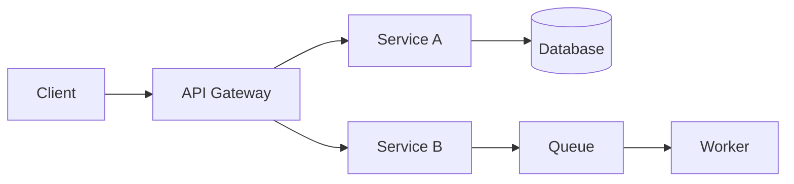

# Content Authoring Spec

You are writing markdown content pages for an interactive senior-software-engineering
interview-prep website. Follow this spec **exactly** — the site parses these files.

## Where files go

`D:\AiGeneratedNotes\interview-prep\src\content\<section>\NN-slug.md`

The `NN-` prefix sets the ordering in the sidebar. Create files with the `create` tool.
Do not modify any file outside your assigned list.

## 1. Frontmatter (required, exactly this shape)

```
---
title: Sliding Window
description: A one-sentence summary of 15 to 30 words explaining what the page covers and why it matters in interviews
difficulty: Foundational
tags: [arrays, two-pointers, patterns]
---
```

Rules:

- `title` — Title Case, short (2–6 words). No colons.
- `description` — ONE line, 15–30 words, plain text. **Must not contain a colon (`:`), quotes, or square brackets.**
- `difficulty` — one of `Foundational`, `Core`, `Advanced`.
- `tags` — 2–5 lowercase hyphenated tags in an inline array.

## 2. Body structure

- **Never use a level-1 `#` heading.** The site renders the title from frontmatter.
- Open with a 1–3 sentence intro paragraph (no heading above it).
- Use `##` for main sections, `###` for sub-sections. Never go deeper than `###` except inside the questions block.
- Target **1,300–2,200 words** in the body (before the questions). Long enough to be genuinely useful,
  short enough to read in 7–10 minutes. Never write a wall of text — break it up.

### Required elements in every page

| Element | Minimum | Notes |
|---|---|---|
| Mermaid diagram | 1 (2 is better) | Architecture, flow, state machine, sequence or class diagram |
| Markdown tables | 2+ | Comparisons, decision matrices, complexity/limits tables |
| Code block | 1+ where it makes sense | C# for backend/.NET/LLD, SQL for databases, TypeScript for frontend, Python for AI, YAML/bash for DevOps |
| Callouts | 2–4 | See syntax below |
| `## Cheat sheet` | 1 | 6–12 crisp bullet "points to remember" |
| `## Common mistakes` | 1 | Table (`Mistake` / `Fix`) or bullet list |
| `## Summary` | 1 | 3–5 sentences tying it together |
| `## Top Interview Questions` | 1 | Must be the **last** section — see section 4 |

### Callout syntax

```
> [!KEY]
> The one idea to remember from this section.

> [!TIP]
> Something that makes you sound senior in the room.

> [!WARNING]
> A subtlety candidates get wrong.

> [!DANGER]
> A classic trap or anti-pattern.

> [!NOTE]
> Useful context that is not core.
```

Available markers: `KEY`, `TIP`, `WARNING`, `DANGER`, `NOTE`. Use the whole blockquote —
the marker must be on its own line, body on following `>` lines.

### Mermaid rules (important — invalid diagrams break the page)

- Fence with ` ```mermaid `.
- Always quote node labels: `A["Load Balancer"]` — never `A(Load Balancer)` with raw parens/commas inside.
- Never use `end`, `graph`, `class`, `style`, `click` as a node **id**.
- Prefer `flowchart LR`, `flowchart TD`, `sequenceDiagram`, `stateDiagram-v2`, `classDiagram`, `erDiagram`.
- Keep it to ~12 nodes. Two small diagrams beat one huge one.
- In `sequenceDiagram`, keep participant names single-word or quoted.
- Avoid `%%` comments, `subgraph` names with spaces (quote them: `subgraph "Write path"`).
- Do not use `<br>`; use `<br/>` inside quoted labels only if needed.

Good example:



## 3. Writing style

- Plain, direct, neutral English. Explain jargon the first time it appears.
- Write **for interview performance**: what gets asked, the expected answer shape,
  the follow-up question, the trade-off to name out loud.
- Prefer a table or diagram over three paragraphs of prose.
- Include concrete numbers where they help (latencies, limits, orders of magnitude).
- Include short, realistic code — 5 to 30 lines. Comment the non-obvious line only.
- Where relevant, add a short line on "what a senior answer sounds like".
- No emojis except occasional ✅/❌ inside tables. No HTML. No level-1 headings.
- Do not mention this website, other pages, or external URLs.

## 4. The interview questions block (required, must be last)

End every file with **exactly** this heading:

```
## Top Interview Questions
```

Then **8–12** questions in exactly this format:

```
### Q1. What is the difference between a process and a thread?

A process is an isolated execution unit with its own virtual address space...
(80–180 words. May include a short table, list or 3–8 line code block.)

### Q2. When would you choose a thread pool over creating threads directly?

...
```

Rules:

- Numbering is `Q1.` through `Q12.`, sequential, with a full stop after the number.
- Questions must be **real, commonly-asked** questions for that specific topic —
  the kind that appear in senior interviews at large product companies.
- Answers must be **complete enough to say out loud** and win the point. Do not write
  "see above" or one-line answers.
- Mix definition questions, "why/when" trade-off questions, at least two scenario or
  debugging questions, and at least one "what would you do in production" question.

## 5. Sizing guidance

Do not make a page so large it is exhausting, or so thin it teaches nothing.
A good page is roughly:

- Intro: 2–3 sentences
- 4–7 `##` sections of 150–350 words each, each with a table, diagram or code block
- Cheat sheet, common mistakes, summary
- 8–12 questions

## 6. Existing notes you may draw on

There are pre-existing personal notes at `D:\AiGeneratedNotes\Content\`. If your assignment
lists relevant files, read them and **enhance** them — fix gaps, add diagrams and tables,
restructure for interview use. Never copy them verbatim and never copy broken image links
(`` — these must be removed, images do not exist on the site).

## 7. Checklist before you finish each file

- [ ] Frontmatter present, `description` has no colon or quotes
- [ ] No `#` level-1 heading anywhere
- [ ] At least one valid mermaid diagram with quoted labels
- [ ] At least two tables
- [ ] 2–4 callouts
- [ ] `## Cheat sheet`, `## Common mistakes`, `## Summary` present
- [ ] Last section is `## Top Interview Questions` with 8–12 `### Qn.` entries
- [ ] No image references, no HTML, no external URLs
