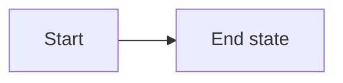

# Senior Interview Prep

An interactive study site covering the full curriculum for senior software engineering
interviews — DSA, system design, LLD, Java & the JVM, Spring Boot, C#/.NET, Azure, databases,
messaging, AI engineering, front-end, security, DevOps, observability, testing, fundamentals,
behavioural and résumé prep.

Code samples in the DSA, LLD and design tracks are written in **Java 17**. The C#/.NET and
ASP.NET Core tracks are kept as their own sections for candidates interviewing on that stack.

The author's own hand-written notes have been **merged into the curriculum**, not bolted on
beside it: their explanations, worked examples, code and hand-drawn diagrams live inside the
relevant topic page, deduplicated against the authored material. There is one page per topic.

| | |
|---|---|
| Topic pages | **353** across 22 tracks and 93 groups |
| Interview questions | **4,060** with full answers |
| Mermaid diagrams | **600** |
| Original hand-drawn diagrams | **384** |
| Comparison tables | **1,673** |
| Reading time | ~87 hours |

Run `npm run stats` for the per-track breakdown.

## Content hierarchy

Each track is split into ordered sub-groups rather than one flat list, so a long track like
DSA reads as a syllabus:

```
dsa/
  01-foundations/            Complexity Analysis
  02-linear-structures/      Arrays, Hashing, Linked Lists, Stacks & Queues
  03-trees-and-heaps/        Heaps, Binary Trees, BSTs, Tries
  04-graphs/                 Traversal, Union-Find, Topo Sort, Shortest Path, MST
  05-core-patterns/          Two Pointers, Sliding Window, Binary Search, and friends
  06-dynamic-programming/    Foundations, Patterns
  07-interview-craft/        Playbook, Pattern Recognition, Advanced Patterns, Java reference
  08-problem-library/        Must-solve list, worked problems, contest write-ups
```

The folder name sets the group order and title — no configuration needed. The Java and
Spring Boot tracks follow the same shape:

```
java/
  01-language-core/          Type system, OOP, generics, exceptions, equals & immutability
  02-collections-and-streams/ Collections, map internals, lambdas, streams, Optional
  03-concurrency/            Threads, the JMM, locks, executors, concurrent collections,
                             CompletableFuture, virtual threads
  04-jvm-internals/          Class loading, memory areas, garbage collection, JIT tuning
  05-modern-java/            Java 8 to 21, records & pattern matching, rapid-fire revision

spring-boot/
  01-core-spring/            IoC & DI, bean lifecycle, configuration, AOP and proxies
  02-building-apis/          Spring MVC, validation, auto-configuration, WebFlux
  03-data-access/            Spring Data JPA, Hibernate performance, transactions, caching
  04-production-spring/      Security, testing, actuator, microservices, production readiness
```

## Running it

```bash
npm install     # first time only
npm run dev     # http://localhost:5173
```

Build a static copy you can host anywhere:

```bash
npm run build
npm run preview          # serves dist/ at http://localhost:4173
```

The build uses relative asset paths and hash routing, so `dist/` can be dropped onto any
static host with no server configuration — GitHub Pages, Azure Static Web Apps, Netlify,
an S3 bucket or an internal file server. (Browsers block ES modules over `file://`, so
serve it with `npm run preview` or `npx serve dist` rather than double-clicking
`dist/index.html`.)

On Windows you can just double-click `start.bat` to run it in development mode.

## Features

| Feature | How to use |
|---|---|
| Full-text search | <kbd>Ctrl</kbd>+<kbd>K</kbd> (or <kbd>/</kbd>) anywhere |
| Light / dark theme | Sun-moon button in the header |
| Accent colour & density | Gear button in the header |
| Copy page as markdown | **Copy markdown** button on any topic |
| Download page as `.md` | **Download .md** button on any topic |
| Print / save as PDF | **Print** button on any topic |
| Mark topics complete | Button on the topic page, or the number badge in a section list |
| Bookmarks | **Save** button on any topic; listed under Progress |
| Private notes | Notes box at the bottom of every topic |
| Flashcard drill | **Practice** in the header — <kbd>Space</kbd> reveals, <kbd>←</kbd>/<kbd>→</kbd> navigate |
| Study plan | **Roadmap** in the header |
| Export / import progress | Buttons on the Progress page |

Progress, bookmarks and notes are stored in `localStorage` — nothing leaves the browser.

## Adding or editing content

Content is plain markdown. Drop a file at:

```
src/content/<section-id>/<NN-group>/<NN-slug>.md
```

and it appears in the sidebar automatically — the folder sets the group and its order, the
`NN` prefix sets the page order within the group, and the frontmatter supplies the title and
metadata. A section may also hold files directly (no group folder) if it is short.

```markdown
---
title: Sliding Window
description: One sentence of 15 to 30 words with no colons or quotes
difficulty: Foundational
tags: [arrays, patterns]
---

Opening paragraph.

## A section

| Column | Column |
|---|---|
| ... | ... |



> [!TIP]
> Callouts support KEY, TIP, WARNING, DANGER and NOTE.

## Cheat sheet
## Common mistakes
## Summary

## Top Interview Questions

### Q1. A real interview question

The answer.
```

The full rules are in [`CONTENT-SPEC.md`](./CONTENT-SPEC.md).

Section metadata (title, blurb, icon, colour, priority, grouping) lives in
`src/lib/sections.ts`.

### Validating content

```bash
npm run validate          # report spec violations
npm run validate:fix      # auto-fix question numbering, level-1 headings, stray images
npm run check:mermaid     # parse every diagram with the real mermaid parser
npm run check             # typecheck + validate + mermaid, all in one
npm run stats             # per-track page/question/diagram counts
```

### Browser smoke test

These drive real Chrome (or Edge) against a running server and assert that pages render,
every mermaid diagram produces an SVG, and the console is clean.

```bash
npm run build && npm run preview     # in one terminal
npm run smoke                        # in another - one page per track
npm run smoke:all                    # every one of the 353 pages
npm run smoke:routes                 # home, sections, roadmap, practice, revise, progress
npm run smoke:theme                  # diagrams survive and recolour on theme toggle
```

## How the personal notes were merged in

The original hand-written notes live outside this project at `D:\AiGeneratedNotes\Content`.
They were brought in as a one-time migration and then folded into the curriculum:

| Script | What it did |
|---|---|
| `tools/import-notes.mjs` | pulled in 83 markdown notes and copied their 383 images to `public/notes/` |
| `tools/import-xbox-guide.mjs` | converted the Xbox Services Guide HTML into the Xbox Systems track |
| `tools/finalise-merge.mjs` | removed the temporary `NN-my-notes` groups once their content was merged |
| `tools/renumber.mjs` | tidied the `NN-` prefixes after pages moved between groups |

`MERGE-SPEC.md` records the rules the merge followed: one page per topic, deduplicate hard,
keep every hand-drawn diagram, no "from my notes" attribution.

The two import scripts now refuse to run without `--force`, because re-running them would
recreate the duplicate groups and overwrite the merged pages. If you update a note in
`D:\AiGeneratedNotes\Content` and want it reflected, edit the corresponding page under
`src/content/` directly — that is now the source of truth.

## Project layout

```
plugins/content-manifest.ts   Vite plugin: scans src/content, emits the nav/search manifest
public/notes/                 Images copied from your original notes
src/content/                  All markdown: <section>/<NN-group>/<NN-page>.md
src/lib/                      Content loading, sections registry, progress, theme
src/components/               Header, sidebar, command palette, markdown renderer, mermaid
src/pages/                    Home, section, topic, roadmap, practice, revise, progress
src/styles/                   Design tokens, layout, prose, page styles
tools/validate-content.mjs    Content linter
tools/check-mermaid.mjs       Parses every diagram with the mermaid parser
tools/regroup.mjs             Applies the sub-group layout to curriculum pages
tools/renumber.mjs            Normalises the NN- prefixes inside every group
tools/finalise-merge.mjs      Removed the temporary my-notes groups after merging
tools/import-notes.mjs        One-time import of the markdown notes and their images
tools/import-xbox-guide.mjs   One-time conversion of the Xbox Services Guide HTML
tools/smoke.mjs               Headless-Chrome render check for topic pages
tools/check-routes.mjs        Headless-Chrome check for the other routes
tools/check-hierarchy.mjs     Headless-Chrome check for groups and note images
tools/check-theme.mjs         Headless-Chrome theme-toggle check
tools/stats.mjs               Curriculum statistics
```
