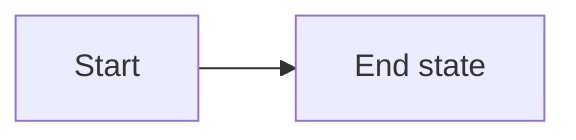

# Senior Interview Prep

An interactive study site covering the full curriculum for senior software engineering
interviews — DSA, system design, LLD, Java & the JVM, Spring Boot, C#/.NET, Azure, databases,
messaging, AI engineering, front-end, security, DevOps, observability, testing, fundamentals,
language breadth, behavioural, résumé and the interview loop itself.

Code samples in the DSA, LLD and design tracks are written in **Java 17**. The C#/.NET and
ASP.NET Core tracks are kept as their own sections for candidates interviewing on that stack,
and `dsa/09-csharp-workbook/` solves the same coding patterns in C# for .NET candidates.

Every earlier collection of notes — hand-written notebooks, generated markdown sets, problem
banks and outline skeletons — has been **merged into this curriculum**, not bolted on beside
it. Their explanations, worked examples, code and hand-drawn diagrams live inside the relevant
topic page, deduplicated against the authored material. There is one page per topic, and this
project is now the single source of truth.

| | |
|---|---|
| Topic pages | **385** across 23 tracks and 103 groups |
| Interview questions | **4,325** with full answers |
| Mermaid diagrams | **628** |
| Original hand-drawn diagrams | **402** |
| Comparison tables | **1,969** |
| Reading time | ~94 hours |

Run `npm run stats` for the per-track breakdown.

## Content hierarchy

Each track is split into ordered sub-groups rather than one flat list, so a long track like
DSA reads as a syllabus:

```
dsa/
  01-foundations/            Complexity Analysis
  02-linear-structures/      Arrays, Hashing, Linked Lists, Stacks & Queues
  03-trees-and-heaps/        Heaps, Binary Trees, BSTs, Tries
  04-graphs/                 Traversal, Union-Find, Topo Sort, Shortest Path, MST
  05-core-patterns/          Two Pointers, Sliding Window, Binary Search, and friends
  06-dynamic-programming/    Foundations, Patterns
  07-interview-craft/        Playbook, Pattern Recognition, Advanced Patterns,
                             Java and C# language references
  08-problem-library/        Must-solve list, worked problems, contest write-ups
  09-csharp-workbook/        The same patterns solved in C#, nine worked problem sets
```

The folder name sets the group order and title — no configuration needed. The Java and
Spring Boot tracks follow the same shape:

```
java/
  01-language-core/          Type system, OOP, generics, exceptions, equals & immutability
  02-collections-and-streams/ Collections, map internals, lambdas, streams, Optional
  03-concurrency/            Threads, the JMM, locks, executors, concurrent collections,
                             CompletableFuture, virtual threads
  04-jvm-internals/          Class loading, memory areas, garbage collection, JIT tuning
  05-modern-java/            Java 8 to 21, records & pattern matching, rapid-fire revision

spring-boot/
  01-core-spring/            IoC & DI, bean lifecycle, configuration, AOP and proxies
  02-building-apis/          Spring MVC, validation, auto-configuration, WebFlux
  03-data-access/            Spring Data JPA, Hibernate performance, transactions, caching
  04-production-spring/      Security, testing, actuator, microservices, production readiness
```

## Running it

```bash
npm install     # first time only
npm run dev     # http://localhost:5173
```

Build a static copy you can host anywhere:

```bash
npm run build
npm run preview          # serves dist/ at http://localhost:4173
```

The build uses relative asset paths and hash routing, so `dist/` can be dropped onto any
static host with no server configuration — GitHub Pages, Azure Static Web Apps, Netlify,
an S3 bucket or an internal file server. (Browsers block ES modules over `file://`, so
serve it with `npm run preview` or `npx serve dist` rather than double-clicking
`dist/index.html`.)

On Windows you can just double-click `start.bat` to run it in development mode.

### GitHub Pages

`.github/workflows/deploy-pages.yml` builds the site and publishes `dist/` on every push
to `main`. Pages must be pointed at that workflow, not at a branch: **Settings → Pages →
Build and deployment → Source → GitHub Actions**. Serving the repository root instead
publishes the unbuilt `index.html`, which then 404s on `/src/main.tsx`.

## Features

| Feature | How to use |
|---|---|
| Full-text search | <kbd>Ctrl</kbd>+<kbd>K</kbd> (or <kbd>/</kbd>) anywhere |
| Light / dark theme | Sun-moon button in the header |
| Accent colour & density | Gear button in the header |
| Copy page as markdown | **Copy markdown** button on any topic |
| Download page as `.md` | **Download .md** button on any topic |
| Print / save as PDF | **Print** button on any topic |
| Mark topics complete | Button on the topic page, or the number badge in a section list |
| Bookmarks | **Save** button on any topic; listed under Progress |
| Private notes | Notes box at the bottom of every topic |
| Flashcard drill | **Practice** in the header — <kbd>Space</kbd> reveals, <kbd>←</kbd>/<kbd>→</kbd> navigate |
| Study plan | **Roadmap** in the header |
| Export / import progress | Buttons on the Progress page |

Progress, bookmarks and notes are stored in `localStorage` — nothing leaves the browser.

## Adding or editing content

Content is plain markdown. Drop a file at:

```
src/content/<section-id>/<NN-group>/<NN-slug>.md
```

and it appears in the sidebar automatically — the folder sets the group and its order, the
`NN` prefix sets the page order within the group, and the frontmatter supplies the title and
metadata. A section may also hold files directly (no group folder) if it is short.

```markdown
---
title: Sliding Window
description: One sentence of 15 to 30 words with no colons or quotes
difficulty: Foundational
tags: [arrays, patterns]
---

Opening paragraph.

## A section

| Column | Column |
|---|---|
| ... | ... |



> [!TIP]
> Callouts support KEY, TIP, WARNING, DANGER and NOTE.

## Cheat sheet
## Common mistakes
## Summary

## Top Interview Questions

### Q1. A real interview question

The answer.
```

The full rules are in [`CONTENT-SPEC.md`](./CONTENT-SPEC.md).

Section metadata (title, blurb, icon, colour, priority, grouping) lives in
`src/lib/sections.ts`.

### Validating content

```bash
npm run validate          # report spec violations
npm run validate:fix      # auto-fix question numbering, level-1 headings, stray images
npm run check:mermaid     # parse every diagram with the real mermaid parser
npm run audit             # deep audit: cross-page duplication, truncation, table and fence integrity
npm run syllabus          # check the curriculum against the senior-interview topic pool
npm run check             # typecheck + validate + mermaid + audit + syllabus, all in one
npm run stats             # per-track page/question/diagram counts
```

`npm run audit` is the second-level linter. Where `validate` checks a page against the authoring
spec, `audit` compares pages **against each other** and reads inside the prose — it catches
repeated interview questions across pages, near-duplicate explanations, code fences in the wrong
language for a track, unescaped `|` inside table cells, answers too thin to say out loud,
placeholder text and cross-references that break the one-page-per-topic rule.

`npm run syllabus` walks a fixed pool of ~160 topics that senior loops actually draw from and
reports each as covered by a page, covered by a section, mentioned, weak or missing. It exits
non-zero on a missing topic, so a curriculum gap fails the build rather than going unnoticed.

### Browser smoke test

These drive real Chrome (or Edge) against a running server and assert that pages render,
every mermaid diagram produces an SVG, and the console is clean.

```bash
npm run build && npm run preview     # in one terminal
npm run smoke                        # in another - one page per track
npm run smoke:all                    # every one of the 385 pages
npm run smoke:routes                 # home, sections, roadmap, practice, revise, progress
npm run smoke:theme                  # diagrams survive and recolour on theme toggle
```

## How the earlier note collections were merged in

This project began as an authored curriculum sitting alongside nine separate folders of
notes — hand-written notebooks, several generated markdown sets, HLD/LLD/coding problem
banks, and outline-only skeletons. All of them have now been folded in and the originals are
gone. `MERGE-SPEC.md` records the rules the merge followed: one page per topic, deduplicate
hard, keep every hand-drawn diagram, no "from my notes" attribution.

What the merge produced, beyond enriching existing pages:

| Added | Where |
|---|---|
| Résumé deep dive — the bullet drill and nine project case studies | `resume/` |
| The interview loop — round-by-round, machine coding, revision plans, one-pagers | `interview-process/` |
| Language breadth — Python, C++, Node.js | `languages/` |
| C# coding workbook — nine worked problem sets | `dsa/09-csharp-workbook/` |
| Application architecture — clean, hexagonal, DDD, persistence patterns | `lld/05-application-architecture/` |
| Test automation — manual QA, Selenium, Playwright, API automation, .NET testing | `testing/` |
| HTML, CSS, browser rendering and Core Web Vitals | `frontend/05-web-platform/` |
| Database operations — query triage, backup and recovery, multi-tenancy | `databases/06-operating-in-production/` |
| Azure cost, governance, API Management and monitoring | `azure/06-operations-and-cost/` |
| OS essentials, Linux and the command line, SDLC and agile delivery | `fundamentals/` |
| Caching in ASP.NET Core | `backend/03-aspnet-core/` |
| Build and dependency management | `devops/03-delivery/` |
| Communication and design docs, levelling and offers | `behavioural/03-the-conversation/` |

Hand-drawn diagrams were deduplicated by content rather than filename — several folders held
re-encoded copies of the same image — so `public/notes/` holds 402 distinct diagrams, every
one of them referenced by a page.

`tools/finalise-merge.mjs` and `tools/renumber.mjs` remain as the housekeeping scripts used
during the merge. The two one-time import scripts have been removed along with the external
folders they read from; `src/content/` is now the only source of truth.

## Project layout

```
plugins/content-manifest.ts   Vite plugin: scans src/content, emits the nav/search manifest
public/notes/                 Hand-drawn diagrams carried over from the original notes
src/content/                  All markdown: <section>/<NN-group>/<NN-page>.md
src/lib/                      Content loading, sections registry, progress, theme
src/components/               Header, sidebar, command palette, markdown renderer, mermaid
src/pages/                    Home, section, topic, roadmap, practice, revise, progress
src/styles/                   Design tokens, layout, prose, page styles
tools/validate-content.mjs    Content linter
tools/audit-content.mjs       Cross-page audit: duplication, fences, tables, thin answers
tools/check-syllabus.mjs      Curriculum coverage against the senior-interview topic pool
tools/check-mermaid.mjs       Parses every diagram with the mermaid parser
tools/regroup.mjs             Applies the sub-group layout to curriculum pages
tools/renumber.mjs            Normalises the NN- prefixes inside every group
tools/finalise-merge.mjs      Removed the temporary my-notes groups after merging
tools/smoke.mjs               Headless-Chrome render check for topic pages
tools/check-routes.mjs        Headless-Chrome check for the other routes
tools/check-hierarchy.mjs     Headless-Chrome check for groups and note images
tools/check-theme.mjs         Headless-Chrome theme-toggle check
tools/stats.mjs               Curriculum statistics
```
