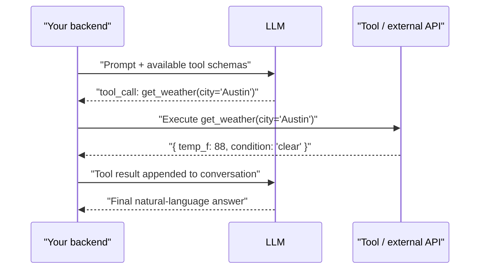

Tool calling is what turns an LLM from a text generator into something that can act — query a database, call an internal API, write a file. The mechanism is simpler than it looks, and interviewers care most about how you handle the parts that go wrong: bad schemas, failures, and unsafe side effects.

## How tool calling actually works

The model never executes anything itself. It only ever emits **structured text** describing an intended call — a tool name and a JSON object of arguments. Your application code is entirely responsible for actually running that call and feeding the result back in.



> [!KEY]
> Say this clearly in an interview: "The model decides *what* to call and *with what arguments* — it never runs code. My backend is the thing that actually executes the call, and it's my backend's job to validate, authorize, and sandbox that execution before trusting the result back to the model."

This means every tool call is a **round trip**: one API call to get the intended tool call, your own execution, then a second API call with the result appended to the conversation so the model can produce (or chain into) a final answer. Multi-step agents just repeat this loop.

## Tool schema design

The schema is the model's only information about what a tool does and when to use it — treat it like API documentation for a very literal-minded caller.

```json
{
  "name": "search_orders",
  "description": "Search the customer's order history by date range and status. Use this when the user asks about a specific past order, not for general product questions.",
  "parameters": {
    "type": "object",
    "properties": {
      "customer_id": { "type": "string", "description": "Internal customer UUID, not the email" },
      "status": { "type": "string", "enum": ["shipped", "delivered", "cancelled", "returned"] },
      "start_date": { "type": "string", "format": "date" },
      "end_date": { "type": "string", "format": "date" }
    },
    "required": ["customer_id"]
  }
}
```

| Design factor | Why it matters |
|---|---|
| Tool name | Should read like a verb-noun action; ambiguous names get misused or ignored |
| Description | The single biggest driver of correct selection — state *what it does* and *when to use it (and when not to)* |
| Parameter types | Enums over free strings wherever possible — narrows the model's guesswork |
| Required fields | Prevents the model from omitting something your code needs, forcing it to ask the user instead |
| Parameter descriptions | Disambiguate near-identical fields (e.g. "customer_id, not email") |

> [!TIP]
> If two tools are chosen incorrectly in testing, the fix is almost always to rewrite the *descriptions*, not the code. Descriptions are the entire interface the model reasons over — vague or overlapping descriptions between two tools are the number one cause of wrong tool selection.

## Parallel tool calls

Modern APIs can return multiple tool calls in a single turn when the calls are independent — e.g. "what's the weather in Austin and in Denver" can trigger two parallel `get_weather` calls instead of two sequential round trips. Your execution layer should be able to run independent tool calls concurrently and return all results together, rather than assuming a single call per turn — a common bug is code written to only ever pop and execute the first tool call in the response.

## Error handling: return failures to the model

When a tool fails (timeout, 404, invalid input), the temptation is to catch it and short-circuit with your own error message. Usually the better move is to **return the failure as a tool result**, structured, so the model can reason about it — retry with different arguments, try an alternative tool, or tell the user what went wrong.

```python
def execute_tool_call(name: str, args: dict) -> dict:
    try:
        result = TOOL_REGISTRY[name](**args)
        return {"status": "success", "data": result}
    except NotFoundError:
        # Structured failure the model can act on, not a raw exception
        return {"status": "error", "error": "not_found", "message": "No order matches that ID"}
    except TimeoutError:
        return {"status": "error", "error": "timeout", "message": "The order service timed out"}
```

> [!WARNING]
> Never let a raw stack trace or internal exception message flow back into the model's context — it can leak implementation details and derail the model into unhelpful behavior. Normalize failures into a small, stable vocabulary of error codes the model has seen in your prompt or examples.

## Tool selection with many tools

Accuracy degrades as the number of available tools grows, because the model has to discriminate among more, often-similar, options in a single decision. Common strategies at scale:

| Strategy | How it works | Use when |
|---|---|---|
| Flat list | All tools passed every call | Small toolset (< ~10–15) |
| Routing | A cheap first step classifies intent, then only relevant tools are loaded | Medium toolsets, distinct domains |
| Hierarchical tools | Coarse "category" tools that reveal finer sub-tools once selected | Large toolsets (50+), natural grouping |
| Retrieval-based filtering | Embed tool descriptions, retrieve top-k relevant tools per query | Very large or dynamically registered toolsets |

> [!KEY]
> A senior answer names the scaling problem directly: "Beyond roughly a dozen tools, accuracy drops if you just dump the whole list in every call. I'd add a routing or retrieval step so the model only sees the 5–10 tools actually relevant to this request."

## Guardrails on side-effecting tools

Read-only tools (search, lookup) are low-risk — a wrong call wastes a round trip. Side-effecting tools (send email, issue refund, delete record, write to database) need real guardrails because the cost of a wrong call is a real-world action, not a wasted API call.

- **Human-in-the-loop confirmation** for high-stakes or irreversible actions (refunds above a threshold, account deletion).
- **Least-privilege scoping** — the tool's own credentials should only be able to do what that tool is meant to do, so even a manipulated call has limited blast radius.
- **Argument validation independent of the model** — re-validate ranges, ownership, and permissions in your execution layer; never trust that the model's arguments respect business rules.
- **Dry-run / preview mode** for anything destructive, surfaced back to the user before committing.

> [!DANGER]
> Never wire a side-effecting tool (payments, deletions, permission changes) directly to model output without a server-side authorization check independent of the prompt. A prompt injection or a plain reasoning mistake can trigger the call — the backend, not the model, must be the actual gatekeeper.

## Timeouts, retries and idempotency

Tool execution is just a network call with extra steps, so ordinary distributed-systems discipline applies:

| Concern | Practice |
|---|---|
| Timeouts | Set an explicit timeout per tool; return a structured timeout error to the model rather than hanging the whole turn |
| Retries | Retry transient failures (network blips) automatically; don't retry business-logic errors (invalid input) |
| Idempotency | Side-effecting tools should accept an idempotency key so a model retry (or your own retry) can't double-charge or double-send |

> [!WARNING]
> A model can legitimately call the same tool twice in one conversation — either because it's genuinely retrying after a transient error, or because of its own repeated reasoning. Any tool with a real-world side effect must be safe to call twice with the same idempotency key.

## Testing tool calls

Unit-test the tool implementations exactly like any other function (mock external dependencies, test error paths). Separately, evaluate *selection accuracy* with a labelled test set of prompts and their expected tool + arguments — this is the part that actually depends on the model and prompt, and is the part that regresses silently when you add a new tool or tweak a description.

```python
test_cases = [
    {"prompt": "What's my order #4471 status?", "expected_tool": "search_orders",
     "expected_args": {"order_id": "4471"}},
    {"prompt": "Cancel my subscription", "expected_tool": "cancel_subscription", "expected_args": {}},
]

def eval_tool_selection(test_cases, run_model):
    passed = 0
    for case in test_cases:
        call = run_model(case["prompt"])
        if call.name == case["expected_tool"]:
            passed += 1
    return passed / len(test_cases)
```

## Cheat sheet

- The model only emits a structured intent — your backend executes it and returns the result; there's always a round trip.
- Tool descriptions are the primary lever for correct selection — rewrite descriptions before touching code when selection is wrong.
- Prefer enums and required fields over free-text parameters to narrow the model's guesswork.
- Support parallel tool calls in your execution layer, not just a single call per turn.
- Return structured failures to the model instead of swallowing them or leaking raw stack traces.
- Beyond ~10–15 tools, add routing, hierarchy, or retrieval-based filtering to keep selection accurate.
- Side-effecting tools need human confirmation, least-privilege scoping, and server-side validation independent of the prompt.
- Make every side-effecting tool idempotent — retries (yours or the model's) must be safe.
- Evaluate tool *selection accuracy* with a labelled test set, separate from unit-testing the tool implementations.

## Common mistakes

| Mistake | Fix |
|---|---|
| Assuming one tool call per model turn | Handle parallel tool calls and execute independent ones concurrently |
| Letting raw exceptions/stack traces flow back into model context | Normalize failures into a small, stable error vocabulary |
| Wiring a refund/delete/send tool straight to model output | Add server-side authorization and human confirmation for high-stakes actions |
| Passing 40 tool schemas in every call | Add routing, hierarchy, or retrieval-based filtering |
| Vague or overlapping tool descriptions | Rewrite descriptions to state what the tool does and when (not) to use it |
| No idempotency key on a side-effecting tool | Add one; retries must not double-execute |

## Summary

Tool calling is a request/execute/respond loop, not the model reaching into your systems directly — your backend always stays in control of execution, validation, and authorization. Schema design, especially the description field, is the single biggest lever over selection accuracy, and it degrades as the toolset grows unless you add routing or filtering. Side-effecting tools need the same guardrails as any other externally-triggered action in a distributed system: validation independent of the caller, idempotency, timeouts, and human approval where the stakes are high.

## Top Interview Questions

### Q1. Walk me through what actually happens when an LLM "calls a tool".

The model never executes code directly. Given a prompt and a set of tool schemas, it emits structured text — a tool name and a JSON object of arguments — as its response instead of natural language. Your application code receives that structured intent, validates and executes the actual call against the real tool or API, and then appends the result back into the conversation as a new message. The model is then called again with that result in context, and it either produces a final natural-language answer or emits another tool call, chaining into a multi-step loop. The key point to state explicitly: the model decides *what* and *with what arguments*; your backend is the only thing that ever actually executes anything.

### Q2. What makes a tool schema good, and what's the single biggest lever over correct tool selection?

A good schema has an unambiguous, verb-noun name; tightly typed parameters (enums instead of free strings wherever the domain allows it); required fields for anything your code can't function without; and clear per-parameter descriptions disambiguating similar-looking fields. But the single biggest lever is the tool-level **description** — it's the primary text the model reasons over to decide whether and when to call this tool versus another. In practice, when tool selection is wrong in testing, the fix is almost always to rewrite the description to explicitly state both what the tool does and when *not* to use it, rather than to change the underlying implementation.

### Q3. How do you handle a tool call that fails — say, an internal API returns a 404 or times out?

Don't let the raw exception or a generic unhandled error propagate — catch it and return a structured, normalized failure back to the model as the tool result (e.g. `{"status": "error", "error": "not_found"}`), using a small, stable vocabulary of error codes rather than raw stack traces, which can leak internals and confuse the model into unhelpful behavior. Returning the failure to the model (rather than swallowing it in your own code) lets it reason about next steps — try different arguments, fall back to another tool, or explain the issue to the user — which is usually the more useful behavior than your backend guessing on its behalf. Timeouts specifically should be enforced explicitly per tool call so one slow dependency doesn't hang the entire conversation turn.

### Q4. Your assistant has 60 tools registered and starts calling the wrong one more often as you add more. Why, and what would you do?

Tool selection accuracy degrades as the number of available options grows because the model has to discriminate among more — often semantically overlapping — choices within a single decision, and passing all 60 schemas into every call also bloats the prompt and can push out other useful context. I'd introduce a filtering step before the main call: either a cheap routing step that classifies the general domain of the request and loads only relevant tools, a hierarchical structure where broad category tools reveal specific sub-tools once selected, or retrieval-based filtering that embeds tool descriptions and surfaces only the top-k most relevant tools for the current query. This keeps each individual selection decision small and accurate instead of a 60-way discrimination every time.

### Q5. How do you support parallel tool calls, and why does it matter?

Modern tool-calling APIs can return multiple independent tool calls in a single model turn — for example, a request touching two unrelated lookups can trigger two calls at once instead of two sequential round trips. Your execution layer needs to iterate over *all* returned tool calls (not just assume and pop the first one, which is a common bug), execute independent ones concurrently for latency, and return all results together as the next turn's context so the model can synthesize a combined answer. This meaningfully reduces total latency for multi-part requests and is worth testing explicitly, since a single-call assumption baked into early code silently breaks or serializes unnecessarily once the model starts returning parallel calls.

### Q6. What guardrails would you put around a tool that issues customer refunds?

I'd treat it fundamentally differently from a read-only lookup tool. First, server-side validation independent of the model's arguments — re-check the refund amount against actual order value and account permissions, never trust the model's numbers at face value. Second, least-privilege credentials for the tool itself, so even a manipulated or mistaken call is bounded (e.g. it can't refund more than the original charge). Third, human-in-the-loop confirmation for anything above a defined threshold or fully irreversible, surfaced to a human or the customer before committing. Fourth, an idempotency key so a retry — from the model or from my own retry logic — can't double-refund. The model's tool call is treated as a *proposed* action, not an authorized one.

### Q7. Why does a side-effecting tool need to be idempotent?

Because a model can legitimately call the same tool twice with the same arguments in one conversation — either as a genuine retry after what looks like a transient failure, or simply because its own reasoning revisits the same action — and your own infrastructure-level retry logic for timeouts adds another path to duplicate calls. If a "send refund" or "send email" tool isn't idempotent, either of those retries can cause a real-world duplicate side effect (double refund, double email) that's much harder to undo than an API-level mistake. The standard fix is the same as anywhere else in distributed systems: generate or accept an idempotency key per logical action, and have the tool's backend detect and no-op a repeat with the same key.

### Q8. Why should tool results generally be returned to the model rather than handled entirely in your own code?

Because the model often needs the failure or result as *context* to decide the next reasonable step, not just a signal to your code — for example, if a `search_orders` call finds nothing, the model can decide to ask the user for a different date range, try a broader search, or clearly explain the situation, none of which your backend can script for every case in advance. Handling everything in code works for a fixed, fully-anticipated set of outcomes, but tool-using assistants exist precisely because the space of user requests and follow-ups is too open-ended to hard-code. The exception is anything security- or business-rule-critical: those checks should happen in your code regardless of what the model would do with the information, with only a sanitized result or refusal passed back to the model.

### Q9. How do you test tool-calling behavior, given that the model's decisions are non-deterministic?

Two separate test surfaces. First, unit test the tool implementations themselves exactly like any other function — mock external dependencies, assert on inputs/outputs, and cover error paths — this part is fully deterministic and needs no special treatment. Second, and separately, evaluate *tool selection accuracy*: build a labelled set of representative prompts with their expected tool name and expected arguments, run them through the live model, and score the match rate. This selection eval is the part that depends on the model and prompt/schema wording, and it's what silently regresses when you add a new overlapping tool or tweak a description — so it needs to run as part of your regression suite, not just once during initial development.

### Q10. What's the difference between hard-coding tool routing in your backend versus letting the model pick from all tools freely?

Hard-coded routing (e.g. classify the request type in your own code, then only expose the relevant tool subset) gives you deterministic, testable control over which tools are even reachable for a given request type, at the cost of needing to maintain that routing logic yourself and it being less flexible for genuinely ambiguous or multi-domain requests. Letting the model freely choose from the full tool set is more flexible and handles unanticipated combinations better, but accuracy degrades as the toolset grows and you lose some determinism in which path gets taken. In practice, a hybrid is common: use cheap deterministic routing to narrow the tool set for the common, well-understood cases, and let the model choose freely within that narrowed, still-flexible subset.

### Q11. A tool call succeeds, but the model then says something factually wrong about the result. Is that a tool-calling bug?

Not necessarily — this is worth diagnosing carefully rather than assuming the tool integration is broken. First check whether the tool actually returned correct data (log and inspect the raw tool result); if the data itself was wrong, that's a bug in the tool or its upstream source, not the LLM layer. If the tool result was correct but the final answer misrepresents it, that's a generation-quality issue — the model summarizing or reasoning over the tool result incorrectly — which you'd address with prompt changes around how tool results should be interpreted, or by post-processing/validating the final answer against the raw tool data before returning it to the user. Separating "did the tool return the right data" from "did the model use that data correctly" is the key debugging split, and it mirrors the retrieval-vs-generation failure split used in RAG debugging.

### Q12. What would you do differently for a read-only "search" tool versus a "delete_account" tool, from an engineering standpoint?

For the read-only tool, the main engineering concerns are correctness of results, reasonable latency, and a sensible timeout/retry policy — a wrong or repeated call wastes a round trip but causes no lasting harm, so I'd let the model call it fairly liberally and even in parallel. For `delete_account`, I'd add several layers absent from the search tool: strict server-side authorization checks that don't rely on model-supplied identifiers alone, a mandatory human confirmation step (never execute directly from a single model turn), an idempotency key, detailed audit logging of who/what triggered the call, and likely a soft-delete with a recovery window rather than an immediate irreversible action. The general principle: guardrail investment should scale with the real-world cost of the tool being wrong or triggered maliciously, not be uniform across all tools.
