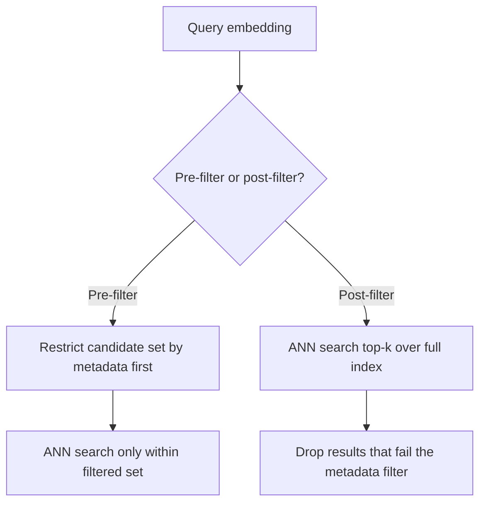

Embeddings are the foundation every RAG and semantic search feature is built on, and interviewers use them to test whether you understand what's actually happening beneath a vector database's API — not just that you can call `.similarity_search()`.

## What an embedding is

An embedding is a fixed-length vector of floating-point numbers produced by a model, positioned in a high-dimensional space such that **semantically similar inputs end up close together** and dissimilar inputs end up far apart. Two sentences with completely different words but the same meaning ("the car wouldn't start" / "my vehicle failed to turn on") land near each other; two sentences with overlapping words but different meaning land far apart.

> [!KEY]
> An embedding model doesn't store meaning symbolically — it compresses semantic similarity into geometric distance. "Search" becomes "find nearby points," which is why the whole field runs on nearest-neighbour algorithms rather than keyword matching.

Typical dimensionality ranges from 256 (small, fast models) to 3,072 (large, high-fidelity models); more dimensions generally capture finer semantic distinctions at the cost of storage and query time.

## Similarity metrics

| Metric | Formula intuition | Sensitive to magnitude? | Typical use |
|---|---|---|---|
| Cosine similarity | Angle between two vectors | No — normalises out length | Default for most text embedding models |
| Dot product | Sum of element-wise products | Yes — larger-magnitude vectors score higher | Fast (no normalisation step); correct when vectors are pre-normalised, then equivalent to cosine |
| Euclidean (L2) distance | Straight-line distance between points | Yes | Common in classic ANN literature (e.g. k-means-based indexes); less common for text |

Most text embedding models are trained and benchmarked against cosine similarity, so use that unless you have a specific reason not to. If every vector is L2-normalised (unit length) at index time, dot product and cosine similarity become mathematically equivalent — a common performance trick, since dot product avoids the normalisation division at query time.

> [!TIP]
> Say this out loud: "I'd normalise vectors at write time and use dot product for search — same ranking as cosine similarity, cheaper per query because I skip the normalisation step for every comparison." That's a concrete, correct optimisation that signals you've actually implemented this before.

## Dimensionality and storage cost

Storage is a straightforward multiplication: `vectors × dimensions × bytes-per-value`.

| Corpus size | Dimensions | Precision | Approx. raw storage |
|---|---|---|---|
| 1M chunks | 1536 | float32 (4 bytes) | ~6.1 GB |
| 1M chunks | 1536 | float16 (2 bytes) | ~3.1 GB |
| 1M chunks | 384 | float32 (4 bytes) | ~1.5 GB |
| 100M chunks | 1536 | float32 (4 bytes) | ~614 GB |

This is *before* index overhead (graph structures, quantisation metadata) and before metadata storage. At real scale, dimensionality choice and quantisation are cost decisions, not just quality ones — a smaller embedding model that scores slightly lower on a benchmark can be the right call if it cuts storage and query latency by 4x.

## Approximate nearest neighbour (ANN) indexes

Exact nearest-neighbour search (brute-force comparing the query against every vector) is `O(n)` per query — fine for tens of thousands of vectors, too slow past a few million. ANN indexes trade a small amount of recall for massive speedups.

| Index | Idea | Build time | Query speed | Recall | Memory |
|---|---|---|---|---|---|
| Flat (brute force) | Compare against every vector | None | Slow at scale | 100% (exact) | Lowest overhead, but full vectors in memory |
| IVF (inverted file) | Cluster vectors, search only nearby clusters | Fast | Fast | High, tunable via `nprobe` | Moderate |
| HNSW (hierarchical navigable small world) | Multi-layer proximity graph, greedy traversal | Slower to build | Very fast | Very high | Highest (graph edges add overhead) |
| Product quantisation (PQ) | Compress vectors into small codes, approximate distance | Moderate | Fast | Lower unless combined with a graph/IVF | Lowest — main lever for memory at huge scale |

> [!KEY]
> HNSW is the default choice for most production RAG systems (used by pgvector, Pinecone, Weaviate, Qdrant) because it gives the best recall-for-speed trade-off at moderate memory cost. Reach for IVF+PQ specifically when memory, not latency, is the binding constraint — e.g. hundreds of millions of vectors that don't fit in RAM at full precision.

## Recall vs latency tuning

Every ANN index exposes a tuning knob that trades recall for speed:

- **HNSW**: `ef_search` (how many candidates to explore at query time) — higher means better recall, slower queries.
- **IVF**: `nprobe` (how many clusters to search) — higher means better recall, slower queries.

There is no universal "right" value — you tune it against a labelled eval set (queries with known relevant documents) and pick the point on the recall/latency curve your product needs. A support-ticket search tolerates a 95% recall, 50ms answer; a compliance/legal search may need close to 100% recall and accept 300ms.

## Do you need a dedicated vector database?

| Option | When it fits |
|---|---|
| `pgvector` (Postgres extension) | You already run Postgres, moderate scale (up to low millions of vectors), want one less system to operate |
| Dedicated vector DB (Pinecone, Weaviate, Qdrant, Milvus) | Large scale, need advanced filtering/hybrid search, want managed scaling |
| In-memory library (FAISS, Annoy) | Prototype, batch job, or embedded use case with no need for a live service |
| Redis / Elasticsearch vector support | Already have that infra, need vectors alongside existing keyword search |

> [!NOTE]
> The most common over-engineering mistake is reaching for a dedicated vector database before proving the feature needs it. `pgvector` handles a surprisingly large range of production RAG workloads with far less operational overhead than running a new distributed system.

## Filtering with metadata: pre- vs post-filtering

Real queries usually need both semantic similarity *and* a hard filter (`tenant_id = X`, `date > Y`, `status = 'published'`).

- **Pre-filtering** restricts the candidate set before the ANN search runs. Correct results, but can be slow if the filtered subset breaks the index's assumptions (some ANN structures don't support arbitrary filters natively).
- **Post-filtering** runs the ANN search first, then discards non-matching results. Fast, but risks **returning fewer than k results** if the filter is narrow — you might filter out most of the top-k and have nothing left.

> [!WARNING]
> Post-filtering with a narrow metadata filter (e.g. a specific `tenant_id` in a huge shared index) can silently return zero or too few relevant results, because the top-k candidates the ANN search found may almost all belong to other tenants. Either over-fetch (search top-200, filter down to top-10) or use an index that supports native pre-filtering.

## Updating and deleting vectors

Unlike a plain key-value store, most ANN index structures (especially graph-based ones like HNSW) are not trivially mutable — deleting a node from a live proximity graph can degrade its structure over time. Common patterns:

- **Soft delete**: mark vectors as deleted in metadata, filter them out at query time, and periodically rebuild/compact the index.
- **Versioned re-index**: for large content changes, rebuild the index from scratch on a schedule rather than incrementally patching it.
- **Upsert by stable ID**: always key vectors by a stable document/chunk ID so re-embedding an updated document is a clean replace, not an orphaned duplicate.

## Embedding model choice and re-embedding cost

Changing your embedding model — for better quality, lower dimensionality, or lower cost — means **every vector in your corpus must be regenerated**, because embeddings from different models are not compatible with each other (they live in unrelated vector spaces, even at the same dimensionality). For a large corpus this is a real, budgeted migration:

| Corpus | Illustrative embedding cost (hypothetical $0.02 / 1M tokens) | Notes |
|---|---|---|
| 10M chunks × 200 tokens avg | ~$40 | Cheap in absolute terms, but still an operational migration (re-index, cutover, dual-write) |
| 500M chunks × 200 tokens avg | ~$2,000 | Real budget line item; batch and rate-limit carefully |

> [!TIP]
> Because switching embedding models forces a full re-embed and re-index, pick your embedding model deliberately up front (benchmark on your own eval set, not just published leaderboards) rather than treating it as an easy swap later.

## Cheat sheet

- Embeddings turn semantic similarity into geometric distance — nearby vectors mean similar meaning.
- Cosine similarity is the default; normalise vectors at write time and use dot product to skip the normalisation cost per query.
- Storage = vectors × dimensions × bytes/value — quantisation (float16, PQ) is a direct cost lever at scale.
- HNSW: best recall/speed trade-off, higher memory. IVF+PQ: lower memory, use when RAM is the binding constraint.
- Tune `ef_search` / `nprobe` against a labelled eval set — there's no universal recall/latency setting.
- Don't reach for a dedicated vector DB before proving `pgvector` or an in-memory index can't handle the scale.
- Post-filtering can silently starve results on narrow metadata filters — over-fetch or use native pre-filtering.
- ANN indexes (especially graph-based) aren't cheaply mutable — plan for soft-delete + periodic rebuild.
- Changing embedding models means re-embedding the entire corpus — budget it as a real migration, not a config change.

## Common mistakes

| Mistake | Fix |
|---|---|
| Mixing vectors from two different embedding models in one index | Re-embed the whole corpus on model change — never mix |
| Using post-filtering with a narrow tenant/date filter and top-k = 10 | Over-fetch (e.g. top-200) before filtering, or use native pre-filtering |
| Reaching for Pinecone/Weaviate before testing pgvector at your actual scale | Validate scale requirements first; simpler infra is often enough |
| Treating HNSW as trivially updatable like a hash map | Plan soft-delete + periodic rebuild for high-churn corpora |
| Picking an embedding model purely off a public leaderboard | Benchmark against your own domain and query patterns |
| Ignoring quantisation as a cost lever | Consider float16 or PQ before scaling out to more/bigger machines |

## Summary

Embeddings map semantic similarity onto geometric distance, and everything downstream — similarity metric choice, index type, filtering strategy — is really about approximating "find nearby points" fast enough at scale. HNSW and IVF+PQ sit at different points on the recall/speed/memory trade-off, and the right choice depends on whether latency or memory is your binding constraint. Because embedding models aren't interchangeable, model choice is a decision you commit to for the corpus's lifetime unless you're willing to fund a full re-embed and re-index.

## Top Interview Questions

### Q1. What is an embedding, and why does semantic search work by comparing vectors?

An embedding is a fixed-length vector of numbers produced by a model such that inputs with similar meaning are positioned close together in the vector space, and dissimilar inputs are positioned far apart — the model learns this geometry during training on large amounts of text (or other data) where semantic relationships are implicitly present. Semantic search works because "find things similar in meaning to this query" becomes "find vectors near this query's vector" — a purely geometric nearest-neighbour problem, which is much cheaper and more scalable to compute than any kind of symbolic meaning comparison. This is also why embedding-based search finds relevant results with zero keyword overlap: "car wouldn't start" and "vehicle failed to turn on" land near each other despite sharing almost no words.

### Q2. When would you use dot product instead of cosine similarity?

Cosine similarity measures the angle between two vectors, ignoring their magnitude, which is why it's the standard choice for most text embedding models — magnitude differences between embeddings usually don't carry meaningful signal. Dot product is sensitive to magnitude, but if every vector is normalised to unit length at index/write time, dot product produces the exact same ranking as cosine similarity while being cheaper to compute at query time, since there's no division/normalisation step per comparison. So in practice: normalise once at write time, then use dot product at query time as a pure performance optimisation with no accuracy trade-off.

### Q3. Compare HNSW and IVF+PQ as ANN index choices. When would you pick each?

HNSW builds a multi-layer proximity graph and does greedy graph traversal at query time, giving very high recall and very fast queries, at the cost of higher memory usage (graph edges add real overhead per vector) and slower index builds. IVF clusters vectors and restricts search to a subset of clusters (`nprobe` controls how many), and is often paired with product quantisation (PQ), which compresses vectors into small codes to approximate distance — this dramatically cuts memory at some recall cost. I'd default to HNSW for most production RAG use cases where latency matters most and the corpus fits in memory at reasonable cost; I'd reach for IVF+PQ specifically when the corpus is so large (hundreds of millions of vectors) that full-precision HNSW simply doesn't fit in available memory, and I'm willing to trade some recall for that.

### Q4. How would you tune the recall/latency trade-off for a vector search feature in production?

I'd build a small labelled eval set of realistic queries with known relevant documents, then sweep the index's tuning parameter (`ef_search` for HNSW, `nprobe` for IVF) and measure both recall@k and p95 query latency at each setting. There's no universally correct value — a support-ticket search might accept 90-95% recall at 50ms, while a compliance or legal-discovery search might require near-100% recall and tolerate 200-300ms. I'd pick the setting that meets the product's latency SLA while maximizing recall within it, and re-validate that choice whenever the corpus size or shape changes materially, since recall/latency curves shift as the index grows.

### Q5. Why can post-filtering by metadata silently return too few or irrelevant results?

Post-filtering runs the ANN search first against the whole index and then discards results that fail a metadata check (e.g. `tenant_id`). If the filter is narrow relative to the index — say, one tenant's data is a small fraction of a large shared index — most of the top-k candidates returned by the ANN search can belong to *other* tenants and get filtered out, leaving far fewer than k usable results, or none at all, even though relevant matches exist deeper in the ranked list. The fixes are either to over-fetch (retrieve top-200 candidates, then filter down to the desired top-10) so there's enough headroom for the filter to remove, or to use an index/vector database that supports native pre-filtering, restricting the candidate set before the similarity search runs.

### Q6. Your team wants to switch to a newer, better-performing embedding model. What does that migration actually involve?

Embeddings from different models are not compatible — they live in unrelated vector spaces even at the same dimensionality — so switching models means re-embedding every document/chunk in the corpus and rebuilding the index; you cannot mix old and new vectors in one similarity comparison. For a large corpus this is a real operational migration: batch and rate-limit the re-embedding calls (cost and API limits), likely dual-write or blue/green the index (build the new index fully before cutting over, to avoid downtime or an inconsistent mixed state), and re-validate retrieval quality against your eval set before switching production traffic. I'd budget both the direct embedding API cost and the engineering time for a safe cutover, not just treat it as changing a config value.

### Q7. When do you actually need a dedicated vector database versus something simpler like pgvector?

If you're already running Postgres and your scale is in the low millions of vectors with moderate query load, `pgvector` is often sufficient and avoids the operational cost of running an entirely new distributed system — one less piece of infrastructure to operate, monitor, and scale independently. Dedicated vector databases (Pinecone, Weaviate, Qdrant, Milvus) earn their keep at larger scale, when you need advanced native filtering combined with ANN search, multi-region replication, or managed auto-scaling that would be significant engineering effort to build on top of Postgres yourself. The common mistake is reaching for a dedicated vector database as a default before validating that simpler infrastructure can't handle the actual expected scale — that's premature infrastructure complexity.

### Q8. How do updates and deletes work against an ANN index like HNSW, and why is that harder than a normal database?

Graph-based ANN structures like HNSW are built assuming a relatively stable set of nodes — removing a node from a live proximity graph can leave "holes" that degrade traversal quality over time, and naive incremental updates aren't as cheap or safe as a normal B-tree index update. The common pattern is to avoid true in-place deletes: mark vectors as deleted via metadata and filter them out at query time (soft delete), then periodically rebuild or compact the index in the background rather than mutating it live on every write. For content that changes frequently, it's worth designing the ingestion pipeline around stable chunk IDs so an update is a clean "delete old ID, insert new ID" rather than an accumulation of orphaned or stale vectors.

### Q9. Give a concrete example of how dimensionality affects both storage and quality trade-offs.

A 1536-dimension embedding at float32 precision for 1 million chunks is roughly 6.1 GB of raw vector storage (1M × 1536 × 4 bytes), while a 384-dimension embedding for the same corpus is closer to 1.5 GB — a 4x difference purely from dimensionality choice, before any index overhead. Higher dimensionality generally captures finer semantic distinctions and can improve recall on nuanced queries, but it directly multiplies storage, memory, and query compute cost. In practice I'd benchmark a smaller/cheaper embedding model against my actual retrieval eval set first — if it captures 95% of the quality at a quarter of the storage and query cost, that's usually the better production trade-off than defaulting to the largest available model.

### Q10. A user reports that semantic search for their tenant returns almost nothing, even though you know relevant documents exist. How would you debug this?

I'd first check whether this is a filtering problem or a genuine retrieval problem: if the vector index applies a metadata filter for `tenant_id` as a post-filter over a shared multi-tenant index, and this tenant's data is a small slice of a much larger index, the top-k ANN results before filtering may contain almost no vectors from this tenant, causing the post-filter to strip out nearly everything. I'd verify by running the same query without the tenant filter and checking whether the tenant's relevant documents appear at all in the unfiltered top-k, and if they don't (or appear very low), that confirms a pre-filtering fix (or a much larger over-fetch) is needed rather than a change to the embedding model or chunking strategy. This is a common and specifically diagnosable failure mode in multi-tenant vector search, distinct from an actual embedding-quality problem.

### Q11. Why can't you just always use exact (brute-force) nearest-neighbour search and avoid ANN complexity entirely?

Brute-force search compares the query vector against every vector in the corpus, which is `O(n)` per query — perfectly fine and simplest-possible-correct for corpora in the tens of thousands of vectors, but it doesn't scale: at millions or hundreds of millions of vectors, a single query becomes prohibitively slow for any latency-sensitive product feature. ANN indexes exist specifically to trade a small, tunable amount of recall for orders-of-magnitude query speedup by avoiding a full linear scan — HNSW's graph traversal or IVF's cluster restriction both approximate "find the nearest vectors" without checking every single one. The senior answer names the actual threshold: don't add ANN complexity prematurely at small scale, but recognize when corpus growth is approaching the point where brute force will start missing latency SLAs, and plan the ANN migration before that happens, not after an incident.

### Q12. How would you decide whether it's worth quantizing (e.g. float16 or product quantisation) your embeddings in production?

I'd look at where the actual cost or bottleneck is: if memory footprint or infrastructure cost is the binding constraint (e.g. the full-precision index no longer fits comfortably in RAM, or you're paying heavily for larger instances), quantisation is one of the highest-leverage levers — float16 alone roughly halves storage with usually negligible recall impact, and product quantisation can compress much further at a larger, but still often acceptable, recall cost. I'd validate the actual recall impact against my eval set before committing (rather than assuming it's negligible), since the acceptable trade-off is workload-dependent — a nice-to-have recommendation feature can tolerate more quality loss than a compliance-critical search. If latency, not memory, is the bottleneck, quantisation helps less than choosing a faster index structure or tuning existing parameters like `ef_search`/`nprobe`.
