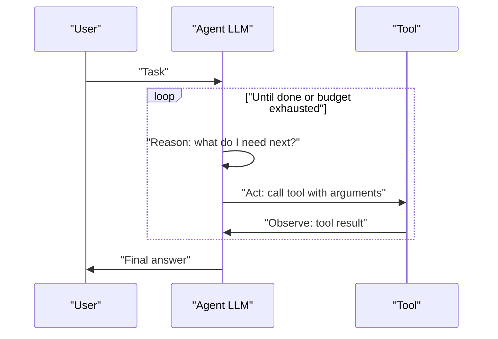

"Agent" gets used for everything from a single prompt template to a multi-day autonomous system, and interviewers will probe whether you know the difference. The useful definition is about control flow, not vocabulary.

## What Makes Something an Agent

A **chatbot** maps one input to one output through a fixed prompt — no branching, no tools. A **workflow** (or chain) executes a fixed, developer-defined sequence of steps, possibly calling an LLM at each step, but the *order and choice of steps* is decided by code. An **agent** is a system where the LLM itself decides, at runtime, which action to take next, based on what it observes — the model controls the control flow, not just the content.

| Property | Chatbot | Workflow / chain | Agent |
|---|---|---|---|
| Decides next step | Developer (fixed) | Developer (fixed sequence) | Model (dynamic) |
| Can call tools | Rarely | Yes, in fixed order | Yes, in model-chosen order |
| Number of steps | 1 | Fixed, known upfront | Variable, unknown upfront |
| Predictability | High | High | Lower |
| Failure mode | Wrong answer | Wrong step output | Wrong step **choice** |

> [!KEY]
> The interview-winning line: *"An agent is defined by autonomy over control flow — the model decides what to do next, not just what to say."* Everything else (tools, memory, loops) is implementation detail on top of that one property.

Said another way, a plain model call is passive and stateless while an agent is semi-autonomous and carries state across turns.


## The Four Moving Parts

Every agent decomposes into the same four components, and naming them cleanly is the fastest way to show you have built one rather than read about one.


| Component | What it does | Where it breaks |
|---|---|---|
| Core model | Generates reasoning and chooses the next action | Weak instruction following, no self-correction |
| Memory | Short-term conversation state plus long-term retrieval | Context overflow, stale or irrelevant recall |
| Planning | Goal decomposition, chain-of-thought, re-planning | Over-decomposition, plans that ignore tool results |
| Tool use | Acting on the world through APIs, code and search | Wrong tool choice, malformed arguments, silent failure |

Those parts wire together into a loop that only exits when the goal is met or a budget is exhausted.


## The ReAct Loop

Most agents are built on **ReAct** (Reason + Act): the model produces a thought, chooses an action (usually a tool call), observes the result, and repeats until it decides it has enough information to answer.



The "reason" step is usually just the model's own chain of intermediate text before it emits a tool call — you do not need a separate model for it. What matters is that the loop **feeds the observation back in** before the next decision, so the agent can correct course based on what actually happened, not just what it predicted would happen.

## The Agent Loop in Code

Stripped to its essentials, an agent loop is a `while` loop with a budget, not magic:

```python
def run_agent(task: str, tools: dict, max_steps: int = 8) -> str:
    messages = [{"role": "user", "content": task}]
    for step in range(max_steps):
        response = llm.chat(messages, tools=list(tools.values()))
        if response.tool_call is None:
            return response.content  # model decided it's done
        result = tools[response.tool_call.name](**response.tool_call.args)
        messages.append(response.to_message())
        messages.append({"role": "tool", "content": str(result)})
    return "Stopped: step budget exhausted without a final answer"
```

**Termination conditions** are what stop an agent from running forever: the model emits a final answer with no tool call, a step budget is hit, a wall-clock timeout expires, a cost ceiling is reached, or a tool signals a terminal failure. Ship all four — relying on "the model will stop when it's done" alone is how a bug turns into a runaway bill.

> [!WARNING]
> A step budget alone is not enough. Also cap total tokens and wall-clock time — a "step" that triggers a slow external API call can hang far longer than a token-based budget anticipates.

## When an Agent Is the Wrong Answer

Agents trade predictability and cost for flexibility. If you already know the sequence of steps needed to complete a task, a deterministic workflow is almost always better: cheaper (fewer model calls), faster (no reasoning overhead per step), and testable (fixed inputs and outputs per step, no branching to enumerate).

| Situation | Better fit |
|---|---|
| Steps and their order are known in advance | Workflow / chain |
| The task genuinely varies — which tools and how many is unknown until runtime | Agent |
| Latency budget is tight (sub-second) | Workflow, or no LLM at all |
| Correctness must be guaranteed (payments, compliance) | Workflow with an LLM only for narrow sub-steps |
| Exploration or open-ended research tasks | Agent |
| You need to explain every branch you might take, to an auditor or reviewer | Workflow |

> [!TIP]
> The senior answer when asked to design an agent: *"Before reaching for an agent, I'd check if this is actually a fixed 3-step pipeline wearing an agent costume — if so, a workflow is cheaper, faster and easier to test."* Interviewers reward restraint here more than agent enthusiasm.

## Cost, Latency and Non-Determinism

Every extra step in an agent loop is another full model round trip — an 8-step agent can cost 8x a single call and take 8x as long, even before accounting for tool latency. Multi-step agents also compound token cost, because each step typically re-sends the growing conversation history as context.

Non-determinism compounds with steps: if each step has even a 95% chance of choosing correctly, an 8-step task has roughly a 34% chance of a wrong step somewhere (0.95⁸ ≈ 0.66). This is why agents need **evals over full trajectories**, not just final-answer checks — pass rate should be measured across many runs of the same task, and tests should assert on properties ("did it call the refund tool with the correct order ID") rather than exact output strings, since the exact path taken may legitimately vary between runs.

## Common Failure Modes and Mitigations

The honest one-slide summary of the trade: real autonomy over complex tasks, paid for in hallucination risk, latency, tool errors, safety exposure, cost and a debugging story far harder than a deterministic pipeline.


| Failure mode | What it looks like | Mitigation |
|---|---|---|
| Infinite / repeated loop | Same tool called with same args repeatedly | Step budget, detect repeated (tool, args) pairs and force a stop |
| Wrong tool selection | Calls search when it should calculate | Narrow, well-named tool descriptions; fewer tools per agent |
| Hallucinated arguments | Calls a real tool with a made-up ID or parameter | Schema-validate arguments before executing; reject and re-prompt on failure |
| Premature give-up | Returns "I cannot do this" after one failed attempt | Retry with the error message fed back as an observation before giving up |
| Context window overflow | Long tool outputs push out earlier reasoning | Summarise or truncate tool results before appending to history |
| Silent partial completion | Stops after step 3 of 5 and reports success | Require an explicit "done" signal tied to a checklist, not just absence of a tool call |

## Cheat sheet

- Agent = model controls control flow. Chatbot = one shot. Workflow = fixed developer-defined sequence.
- ReAct = reason, act, observe, repeat — the loop only works because the observation feeds back in.
- Always ship four termination conditions: no tool call, step budget, time budget, cost budget.
- If you can enumerate the steps in advance, use a workflow — it is cheaper, faster and testable.
- Cost and latency scale with steps; assume an N-step agent costs roughly N model calls.
- Per-step error compounds: 95% per-step accuracy over 8 steps is only ~66% end to end.
- Test agents on trajectory properties (right tool, right args) not exact output strings.
- Validate tool arguments before executing — never trust a model-generated ID or parameter blindly.
- Repeated identical tool calls are the clearest loop signal; detect and break them explicitly.

## Common mistakes

| Mistake | Fix |
|---|---|
| Calling any multi-step LLM pipeline "an agent" | Reserve the term for systems where the model chooses the next action |
| Relying only on the model to know when to stop | Enforce step, time and cost budgets in code |
| Building an agent for a task with a known fixed sequence | Use a deterministic workflow instead |
| Testing with exact-string assertions on final output | Assert on trajectory properties and tool calls instead |
| Executing tool calls with unvalidated arguments | Schema-validate before execution, reject and re-prompt on mismatch |
| Letting tool output grow the context unbounded | Summarise or truncate before appending to conversation history |
| Ignoring per-step failure probability compounding | Budget for retries and design evals across many runs, not one |

## Summary

An agent is defined by one property: the model decides what to do next, not the developer. That autonomy is implemented most commonly as a ReAct loop — reason, act, observe, repeat — bounded by explicit termination conditions, because a model alone cannot be trusted to know when to stop. Agents cost more, run slower and behave non-deterministically compared to a fixed workflow, so the right first question in a design interview is whether the task actually needs that flexibility, or whether a cheaper, more testable workflow already covers it. When you do build one, budget for step count, cost, and time, validate every tool argument, and test trajectories rather than exact strings.

## Top Interview Questions

### Q1. What is the precise difference between an agent, a chatbot, and a workflow?

The distinguishing property is who controls the flow of execution. A chatbot maps one input to one output through a single, fixed prompt with no branching or tool use. A workflow (or chain) calls one or more LLMs as steps in a sequence that a developer defines up front — the order and number of steps is fixed code, even if an LLM decides content within a step. An agent hands control of *which action to take next* to the model itself, at runtime, based on what it observes from previous actions — the number and order of steps is not known in advance. The practical test: if you can draw the exact sequence diagram before running it, it's a workflow; if the model can legitimately take a different path each run, it's an agent.

### Q2. Explain the ReAct pattern and why the "observe" step matters.

ReAct interleaves reasoning, acting and observing: the model produces intermediate reasoning text, chooses a tool call, the tool executes, and the result is fed back into the model's context before it decides the next step. The observe step is what makes this different from just planning upfront and executing blindly — it lets the model correct course based on what actually happened (a search returned no results, an API call failed with a specific error) rather than what it predicted would happen. Without feeding the observation back in, you have open-loop planning, which fails silently the moment reality diverges from the plan; ReAct is closed-loop and can adapt mid-task.

### Q3. How do you decide the termination conditions for an agent, and why is "the model says it's done" not sufficient alone?

A production agent needs multiple independent stop conditions: the model emitting a response with no tool call (the intended happy path), a maximum step count, a wall-clock timeout, and a cost/token ceiling. Relying only on the model's own judgement is risky because models can loop on a failing tool call, get stuck re-attempting the same malformed argument, or simply never converge on a case outside their training distribution — and each of those failure modes still involves the model "trying" rather than announcing it is stuck. Hard budgets in code are what turn a possible infinite loop into a bounded-cost, bounded-latency operation regardless of model behaviour.

### Q4. When would you recommend a deterministic workflow instead of an agent, even though agents are more flexible?

Whenever the sequence of steps needed is knowable in advance — for example, "validate input, call pricing API, call inventory API, compose a response" — a workflow does the same job for a fraction of the cost and latency, because it skips the reasoning overhead of deciding what to do next at each step, and it is far easier to test since every branch is enumerable. I'd also default to a workflow when correctness must be guaranteed, such as in payments or compliance-sensitive flows, using an LLM only for a narrow, well-scoped sub-step like classifying free text, rather than letting a model own the whole control flow. Agents earn their cost when the task genuinely varies at runtime — open-ended research, "figure out what's wrong and fix it" support tasks — where the set of needed steps cannot be enumerated upfront.

### Q5. How does cost and latency scale with the number of steps in an agent, and how would you control it in production?

Each step is a full model round trip, so an 8-step agent run costs roughly 8x a single call plus tool latency at each step, and because most implementations resend the growing conversation history as context each time, token cost per step also increases as the trajectory grows. In production I would cap steps with a hard budget sized to the task's realistic complexity, use a cheaper/faster model for simple reasoning steps and reserve an expensive model for the steps that need it, truncate or summarise tool outputs before they re-enter context, and monitor cost and latency per completed task as a first-class metric — the same as accuracy — so a design that works in a demo does not silently 10x the bill at scale.

### Q6. Why is testing agents harder than testing a deterministic function, and how would you approach it?

The same input can legitimately produce different but equally valid trajectories run to run, because the model chooses tool order and sometimes even which tools to use, so exact-string or exact-sequence assertions on the final output are brittle and will fail on valid runs. I would instead assert on trajectory properties: did it call the correct tool at least once, did it pass a valid and correct argument for a specific field, did it avoid a disallowed tool, did it terminate within budget. I would also run each test case multiple times and report a pass rate rather than a single pass/fail, since agent behaviour is a distribution, not a point value, and track that pass rate over time the same way you would track an eval metric.

### Q7. Describe a scenario where an agent gets stuck in a loop, and how you would detect and fix it.

A common case: the agent calls a lookup tool with a malformed ID, gets an error back, and — instead of correcting the ID — retries the exact same call, repeating indefinitely until the step budget is exhausted. I would detect this by tracking (tool name, arguments) pairs across the trajectory and forcing a stop or an escalation path if the same pair repeats more than once or twice. The actual fix is usually upstream: feed the tool's error message clearly back into the model's context as an observation (not just "failed"), so it has the information needed to correct the argument, and validate the argument schema before the call so obviously malformed inputs are caught before wasting a round trip.

### Q8. What is argument hallucination in tool calling, and how do you guard against it reaching a real system?

Argument hallucination is when the model calls a real, valid tool but invents a plausible-looking value for a parameter — an order ID, a file path, a customer email — that does not actually exist or was never provided in context. The guard is to never trust model-generated arguments blindly: validate them against a schema and, where possible, against ground truth (does this order ID actually exist) before executing any action with side effects, and return a clear validation error as the tool's observation so the model can retry with a corrected value rather than the call silently succeeding against the wrong record. For high-risk actions (refunds, deletions, sending messages), add a confirmation or human-in-the-loop gate regardless of how confident the argument looks.

### Q9. How would you handle an agent that keeps giving up prematurely on a solvable task?

First check whether it is actually giving up or correctly reporting a real blocker — not every "I can't do this" is a bug. If it is premature, the usual cause is that a single tool failure is being treated as terminal instead of retryable: the fix is to feed the specific error back as an observation and explicitly prompt the agent to attempt an alternative approach before concluding failure, rather than accepting the first negative result. It also helps to give the agent a small number of guaranteed retries with backoff for transient failures (rate limits, timeouts) handled in code rather than relying on the model to decide to retry, since models are inconsistent about persistence unless explicitly instructed to be.

### Q10. Why can multi-step agents be non-deterministic even at temperature zero, and what does that mean for reliability?

Temperature zero reduces but does not eliminate variability — tool results can differ run to run (a search index updates, an API returns slightly different data), floating-point non-determinism exists in some inference stacks, and even small context differences (timestamps, session IDs) change the exact tokens sampled. Combined with the fact that even a fixed per-step accuracy compounds across steps (95% per step over 8 steps is only about two-thirds success end to end), reliability has to be engineered rather than assumed: idempotent tool calls so retries are safe, validation gates between steps, and monitoring pass rate over many runs rather than trusting a single successful test run as proof the system works.

### Q11. How would you scope the tools available to an agent, and why does having too many tools hurt?

Scope tools narrowly and give each one a precise name and description that clearly distinguishes it from the others — an agent choosing between "search_orders" and "search_customers" makes fewer mistakes than one choosing among fifteen loosely-named tools with overlapping purposes. Too many tools increases the chance of wrong-tool selection because the model has to disambiguate at every step, increases prompt size (every tool schema counts against context and cost), and makes failures harder to diagnose because more candidate explanations exist. In practice I would group tools by task and load only the relevant subset per agent or per step, rather than exposing every tool the organisation owns to every agent.

### Q12. In production, how would you decide the step budget and cost ceiling for a new agent, and how would you monitor whether it is being hit too often?

I would size the initial budget from offline testing — run the golden set of representative tasks, record the step count and cost distribution for successful completions, and set the budget a bit above the p95 of that distribution, not an arbitrary round number. In production, I would track and alert on the rate of runs that hit the budget without producing a final answer, since a rising rate signals either a regression (a tool changed shape, a prompt drifted) or that real-world tasks are harder than the offline set represented. I would also log the full trajectory of every budget-exhausted run so it can be triaged and, if it is a legitimate new failure pattern, folded into the eval dataset the same way any other production incident would be.
