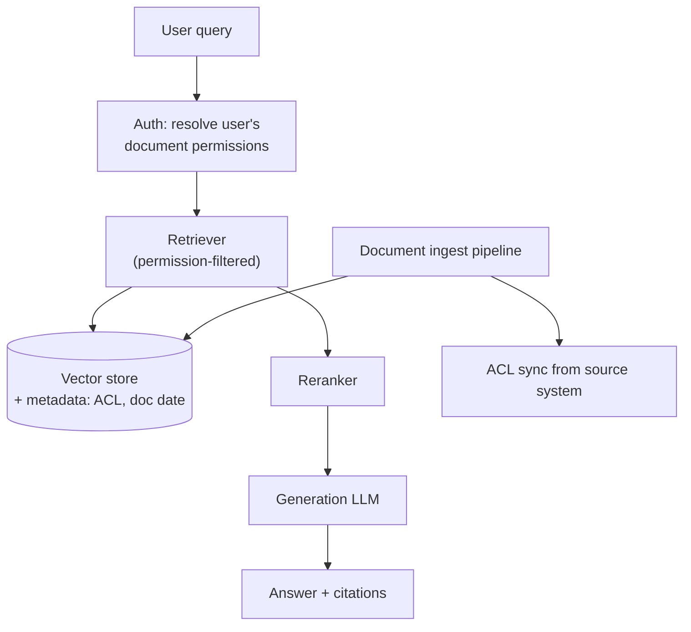
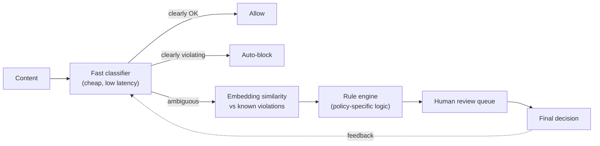
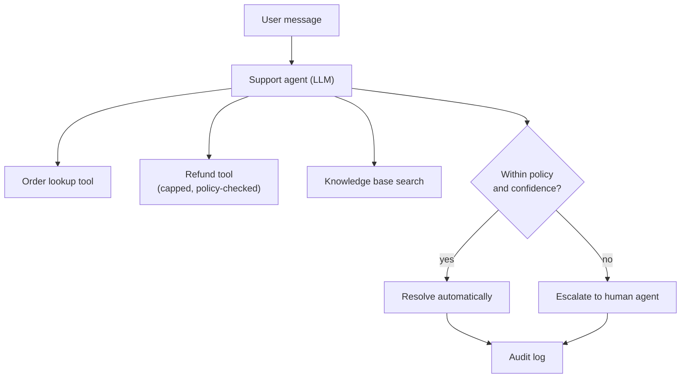
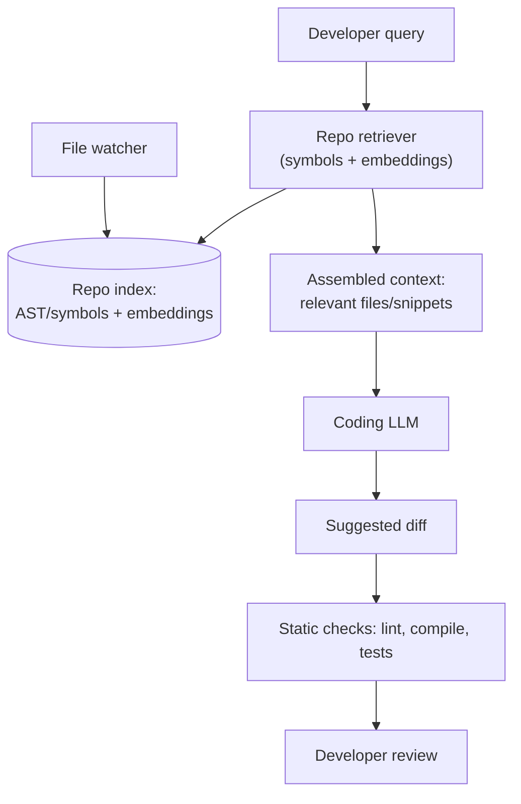

Design interviews for AI features reward the same discipline as any system design round — requirements, architecture, data flow, trade-offs — applied to problems where retrieval quality, hallucination and per-call cost are first-class constraints. These four worked designs are the ones that come up most often.

## Case Study 1: Enterprise Document Q&A Over a Private Corpus

### Requirements

Answer employee questions grounded in an internal document corpus (policies, contracts, wikis) spanning millions of pages, where **every document has its own access permissions** and a user must never see an answer built from a document they cannot open directly. Freshness matters — a policy updated this morning should be reflected within minutes, not the next reindex cycle.

### Architecture

### Data Flow and Key Decisions

Documents are chunked and embedded at ingest time, but the **access control list for each chunk is stored as metadata and enforced at query time** rather than baked into a per-user index, which would not scale and would go stale immediately. The retriever applies a permission filter, drawn from the user's live entitlements, *before* similarity search — a restricted document never competes for the top-k slots, and never appears in a trace a lower-privileged session might see.

| Decision | Choice | Why |
|---|---|---|
| Permission enforcement point | Pre-filter at retrieval, re-verify at generation | Never let a restricted chunk reach the prompt at all |
| Freshness | Incremental re-index on document change webhook | Minutes-level freshness without full reindex cost |
| Citations | Require the model to cite chunk IDs, verify citations exist post-hoc | Reduces unverifiable claims, makes answers auditable |
| Stale permission cache | Short TTL (minutes) + explicit invalidation on ACL change | Balances entitlement-check cost against staleness risk |

### Evaluation Strategy

A golden set of representative questions per document category, scored on context precision/recall and faithfulness, plus a **dedicated permission-leak test suite**: adversarial queries run as low-privilege users, asserting zero restricted content appears in retrieved context or the final answer, run in CI on every retrieval or ACL-sync change.

### Failure Modes and Cost

The two failure modes that matter most are a permission leak (restricted content appears in an answer — a security incident, not a quality bug) and staleness (an answer built from a superseded document). Cost scales with corpus size at ingest and query volume at serving; a common lever is a cheaper generation model once retrieval quality is high, since retrieved context does most of the correctness work.

> [!DANGER]
> A permission check performed only on the *final answer* (checking if the visible text mentions restricted content) is not sufficient — a model can leak restricted information paraphrased or without a direct quote. The filter must happen before retrieval, on the underlying chunks, never as an after-the-fact text scan.

### What the Interviewer Pushes On

- "What happens if the ACL sync lags behind a permission revocation?" — expect a concrete staleness bound and an explanation of the trade-off against checking live on every query.
- "How do you know the model isn't hallucinating a citation?" — verify cited chunk IDs actually exist and were in the retrieved set, don't trust the model's claim.
- "What's your cost at 50,000 employees querying daily?" — expect back-of-envelope: query volume × (retrieval infra cost + generation tokens × price).

## Case Study 2: AI Content Moderation Pipeline

### Requirements

Classify user-generated content (text, images) for policy violations at high volume and low latency, with an acceptable false-negative rate near zero for severe categories (violence, exploitation) and tolerance for a slower, more careful path on ambiguous cases.

### Architecture

### Data Flow and Key Decisions

A layered pipeline, cheapest and fastest checks first: a lightweight classifier resolves the bulk of decisions in milliseconds. Content it cannot confidently classify goes to an **embedding similarity check** against known violation examples (catches near-duplicates of content already actioned), then a **rule engine** for logic that is easier to express explicitly than to leave to a model (banned terms, regulatory categories, jurisdiction rules). Only the genuinely ambiguous remainder reaches a **human reviewer**, whose decisions feed back as new labelled examples.

| Decision | Choice | Why |
|---|---|---|
| Severe-category bias | Tune threshold toward false positives over false negatives | Cost of missing real harm vastly exceeds cost of an unnecessary review |
| Where an LLM sits | Only on the ambiguous tier, not the fast path | Full LLM classification on 100% of volume is too slow and expensive |
| Human review | Queue prioritised by severity and confidence, not FIFO | Highest-risk ambiguous content reviewed first |
| Feedback loop | Reviewer decisions become new training/eval examples | Classifier and embedding set improve continuously |

### Evaluation Strategy

Precision and recall tracked **per policy category separately**, not as one blended accuracy number, since a 99% overall accuracy can hide a near-zero recall on a rare but severe category. Recall on severe categories is the metric leadership actually cares about; a regression there should block a model or threshold change regardless of overall accuracy.

### Failure Modes and Cost

False negatives on severe content carry the highest cost (real-world harm, regulatory exposure); false positives at scale erode trust and generate reviewer backlog. Cost is dominated by the human review tier at high volume, so the real design lever is the ambiguous-tier threshold, not model choice.

> [!WARNING]
> Optimising for overall accuracy instead of per-category recall is the single most common mistake in moderation system design — a model can be 99.5% accurate while missing the majority of a rare, severe category, because that category is such a small fraction of total volume that missing it barely moves the aggregate number.

### What the Interviewer Pushes On

- "How do you handle an adversarial user probing the classifier's boundary?" — expect mention of embedding similarity catching near-duplicates and a feedback loop that adapts over time.
- "What's your latency budget and how does the tiered pipeline meet it?" — most volume resolved in the fast tier; only a small percentage pays the slower tiers' latency.
- "How do you evaluate a category with very few real examples?" — synthetic/adversarial example generation and recall-focused, not accuracy-focused, metrics.

## Case Study 3: Agentic Customer Support with Real Tool Calls

### Requirements

Resolve support requests end-to-end where possible — look up an order, check a status, issue a refund within policy limits — by calling real backend systems, and escalate to a human agent when the request is ambiguous, exceeds policy limits, or a tool call fails unexpectedly.

### Architecture

### Data Flow and Key Decisions

The agent runs a bounded ReAct loop with a small, tightly-scoped toolset — order lookup, a refund tool hard-capped at a policy limit, and a knowledge base search. Every refund call is policy-checked **in the tool itself**, not trusted from the agent's reasoning — the agent can request a refund, but the tool enforces the actual limit and rejects anything outside it, returning a clear rejection the agent must then escalate.

| Decision | Choice | Why |
|---|---|---|
| Refund authority | Tool-enforced cap, not model-trusted | Model reasoning is not an authorization mechanism |
| Escalation trigger | Policy violation, low confidence, or repeated tool failure | Bounds the agent's blast radius to genuinely resolvable cases |
| Tool scope | Minimum needed per agent role | Smaller attack surface, fewer wrong-tool mistakes |
| Handoff to human | Full transcript + agent's reasoning summary passed | Human doesn't restart from zero, but doesn't inherit raw context bloat |

### Evaluation Strategy

Offline eval runs on a golden set of past tickets, scored on correct tool selection, correct arguments, and correct escalation decisions — not exact response text, since valid phrasing varies. Online, track auto-resolution rate, escalation rate, and the **override rate**: how often a human reviewing an auto-resolved case would decide differently, since that leads a policy or threshold problem before it becomes a complaint spike.

### Failure Modes and Cost

The costliest failure is an incorrect automatic resolution that should have escalated, which is why every side-effecting action goes through a tool-enforced check rather than model trust alone. Cost is driven by agent step count and human review capacity for the escalated fraction; a cascade design (automate first, escalate only what's needed) keeps expensive human-hours proportional to genuinely hard cases.

> [!TIP]
> A strong answer names the specific control that prevents the worst-case failure: *"The refund amount is enforced by the tool's own policy check, not by trusting the agent's reasoning — the agent can be wrong about the policy and the system still can't issue an out-of-policy refund."* That is the difference between a demo and a production design.

### What the Interviewer Pushes On

- "What stops the agent from issuing an unauthorized refund?" — the tool-level policy enforcement, not the prompt.
- "How do you measure quality when the agent's exact wording varies?" — trajectory-level eval: right tool, right arguments, right escalation decision.
- "What's the cost at 10x current ticket volume?" — model calls per resolved ticket × volume, plus escalation-fraction × human agent cost; cascade/cheaper-model-first as the lever.

## Case Study 4: AI Coding Assistant with Repository Context Retrieval

### Requirements

Answer questions and generate code changes grounded in a specific, possibly large, private repository — correct imports, correct existing function signatures, consistent with the codebase's actual conventions, not generic patterns from training data.

### Architecture

### Data Flow and Key Decisions

Repository context retrieval is not plain RAG over prose — it combines **symbol-aware indexing** (definitions, call graphs, imports) with embedding similarity, because "find the function that handles X" is often better answered by a symbol lookup than semantic similarity on comments. The index updates incrementally via file-watcher or commit hook, since a suggestion built against a since-renamed function is worse than no suggestion. Generated changes run through **deterministic checks** (lint, compile, existing tests) before being shown, catching errors a generative check alone would miss.

| Decision | Choice | Why |
|---|---|---|
| Retrieval method | Symbol/AST index + embeddings, not embeddings alone | Code structure (calls, definitions) is often more relevant than prose similarity |
| Context freshness | Incremental index update on file save/commit | Stale references produce confidently wrong suggestions |
| Validation before showing suggestion | Lint + compile + relevant test subset | Deterministic checks catch what generation quality alone won't |
| Scope of context window | Relevant files/symbols only, not whole repo | Whole-repo context is prohibitively expensive and dilutes relevance |

### Evaluation Strategy

A golden set of real past tasks (bug fixes, small features) with the actual accepted diff as ground truth, scored on whether the suggestion compiles, passes relevant tests, and edit distance from suggestion to merged code — a strong proxy for usefulness that text similarity misses. Online, track acceptance rate and **silent rejection** (suggestion shown, developer writes something different without explicit feedback) as a signal separate from thumbs-down.

### Failure Modes and Cost

The dominant failure mode is a plausible-looking suggestion referencing a function that no longer exists or has a different signature — caught by the compile/lint check before it reaches the developer, which is why that check is non-negotiable. Cost scales with repository size and query volume; latency is a hard constraint, since a suggestion arriving after the developer has typed past that point is worthless regardless of quality.

> [!NOTE]
> Latency budgets for inline coding suggestions are much tighter than for a chat assistant — hundreds of milliseconds, not seconds — which pushes the design toward smaller, faster models for the common case and reserves larger models for explicitly-requested, non-inline interactions like "explain this function" or full PR review.

### What the Interviewer Pushes On

- "How do you keep suggestions correct as the codebase changes constantly?" — incremental re-indexing, and deterministic compile/lint checks as a safety net regardless of index freshness.
- "How do you evaluate 'good code' beyond exact match?" — compiles, passes tests, low edit distance from what was actually merged, not text similarity to a reference answer.
- "What's your latency budget for inline suggestions versus a chat-style query?" — sub-second for inline, seconds acceptable for explicit chat-style requests; different models for each.

## Cheat sheet

- Enforce permissions at retrieval time, on the underlying data, never as a post-hoc scan of the generated text.
- Moderation and support systems should track recall per category/decision type, not one blended accuracy number.
- Any side-effecting tool call (refund, delete, send) needs its authorization enforced in the tool itself, not trusted from model reasoning.
- Code and document retrieval both need freshness pipelines — a stale index produces confidently wrong answers, not obviously wrong ones.
- Deterministic checks (schema validation, compile, lint, policy caps) catch what generation-quality metrics alone will miss.
- Evaluate agentic systems on trajectory/decision correctness (right tool, right escalation) not exact output text.
- Cost at scale is almost always dominated by the highest-cost tier (human review, largest model, whole-repo context) — the design's job is to keep that tier's volume small.
- These case study designs reduce to the same shape: cheap/fast path for the common case, escalation to a more expensive or human path for the hard tail, deterministic guardrails around anything irreversible.

## Common mistakes

| Mistake | Fix |
|---|---|
| Checking permissions only on the final generated answer | Filter at retrieval, before restricted content ever reaches the prompt |
| Reporting one blended accuracy for a moderation classifier | Report precision/recall per policy category separately |
| Trusting an agent's own reasoning as authorization for a refund or deletion | Enforce policy limits inside the tool, independent of the model |
| Treating a stale repo or document index as an acceptable trade-off | Build incremental freshness pipelines; stale context causes confident wrong answers |
| Using exact-text similarity to evaluate code or agent output | Use compile/test pass rate, edit distance, or trajectory correctness instead |
| Sizing cost estimates off average request only | Model cost by tier (fast path vs escalated/human path) since tiers dominate differently |
| Skipping deterministic validation because "the model is good" | Always add a cheap deterministic check as a safety net before showing output |

## Summary

All four designs share the same underlying shape: a cheap, fast path handles the common case, an escalation path (a stronger model, a rule engine, a human) handles the hard or high-stakes tail, and deterministic checks — permission filters, policy caps, compile/lint gates — sit between generation and any consequence that matters. The differences are domain-specific: document Q&A lives or dies on permission enforcement and freshness, moderation on per-category recall, agentic support on tool-level authorization, and coding assistance on structural (not just semantic) retrieval plus a compile/test safety net. In an interview, name the requirement that dominates the design (permissions, recall, authorization, freshness), the diagram that shows the escalation path, and the specific control that prevents the worst-case failure — that combination is what a senior answer sounds like.

## Top Interview Questions

### Q1. In the enterprise document Q&A system, why must permission filtering happen at retrieval time rather than after the model generates an answer?

If retrieval is unfiltered, a restricted document's content can enter the model's context and influence the generated answer even if the model is later instructed not to reveal it directly — the model can paraphrase, summarise, or use the restricted content to inform an answer without quoting it verbatim, which a post-hoc text scan for "does the visible answer contain restricted content" would miss entirely. Filtering before retrieval means the restricted chunk never competes for the top-k results and never enters the prompt at all, so there is no path for it to leak regardless of how the model phrases its response. This also matters for auditability — a trace of "what did the model see" should never itself contain data the requesting user isn't entitled to.

### Q2. How would you evaluate a content moderation pipeline differently from a general-purpose chatbot?

A moderation pipeline needs per-category precision and recall, not one blended accuracy score, because categories vary enormously in both frequency and cost of a miss — a rare, severe category (exploitation content) needs near-perfect recall even if it's a tiny fraction of volume, and a single blended number can look excellent while that category's recall is poor. I'd also weight false negatives and false positives asymmetrically per category rather than treating them as equally bad by default: for severe categories, a false positive (an unnecessary human review) is far cheaper than a false negative (real harm reaching users), so the threshold tuning itself is a policy decision informed by, but not purely dictated by, the raw metrics.

### Q3. In the agentic support case study, why is it not sufficient to prompt the agent with "never exceed the refund policy limit"?

A prompt instruction is a request to the model, not an enforcement mechanism — the model can misread the policy, get confused by an ambiguous case, or be manipulated by adversarial input in the conversation, and there is no guarantee it always follows the instruction. Enforcing the limit inside the refund tool itself means the check happens in code, independent of what the model reasoned or intended, so even a fully "convinced" agent attempting to issue an out-of-policy refund gets rejected by the tool and must escalate. This is the same principle as never trusting client-side validation alone in a traditional web application — the authoritative check has to live at the boundary that actually executes the action.

### Q4. How would you design freshness for the coding assistant's repository index, and what happens if you get it wrong?

I'd use an incremental update triggered by file saves or commit hooks rather than a periodic full reindex, updating only the changed files' symbols and embeddings so the index reflects the current state of the codebase within seconds to minutes rather than hours. Getting this wrong produces a specific and dangerous failure mode: a suggestion that references a function that has since been renamed, moved, or had its signature changed looks entirely plausible and confidently wrong, which is worse than an obviously bad suggestion because a developer is more likely to accept it without close inspection. This is also why the compile/lint check before showing a suggestion is not optional — it's the safety net that catches staleness-driven errors regardless of how good the freshness pipeline is.

### Q5. Across these systems, how would you estimate cost at scale, and what's the biggest lever to reduce it?

I'd break cost down by tier rather than computing one average cost per request, since each of these systems has a cheap common-case path and an expensive escalation path with very different unit economics — document Q&A's cost is dominated by embedding/retrieval infra plus generation tokens, moderation's cost is dominated by the human review tier at high volume, support's cost is dominated by escalated human-agent time, and the coding assistant's cost is dominated by whichever model handles the (hopefully rare) larger-context requests. In every case, the biggest lever is keeping the expensive tier's volume proportional to genuinely hard cases — tightening a moderation confidence threshold, improving retrieval so fewer support escalations are needed, or making the fast-path model good enough that fewer coding suggestions need the larger model — rather than trying to make the expensive tier itself cheaper.

### Q6. How do you evaluate an agentic system's output when the exact wording or step order can legitimately vary between runs?

I'd score trajectories on properties rather than exact text: did the agent select the correct tool for the situation, did it pass correct and policy-valid arguments, did it make the right escalate-vs-resolve decision, and did it terminate within its step and cost budget. For the support case specifically, I'd also track the human override rate — how often a reviewer looking at an auto-resolved case would have made a different decision — sampled continuously in production, since that is a leading indicator of a miscalibrated confidence threshold or an under-covered edge case in the golden eval set, well before it shows up as a spike in complaint volume.

### Q7. What's the difference between using embeddings alone versus a symbol/AST-aware index for code retrieval, and why does it matter?

Embedding similarity captures semantic/textual closeness — good for "find code that talks about authentication" — but code retrieval often needs structural relationships that similarity search doesn't reliably capture, like "find every caller of this function" or "what's the exact current signature of this method," which are precise, discrete facts rather than fuzzy similarity. A symbol/AST-aware index answers those directly and exactly, while embeddings can miss a highly relevant but textually dissimilar caller, or surface a textually similar but structurally irrelevant snippet. Combining both — symbol lookup for structural questions, embeddings for conceptual/semantic ones — covers more of what a developer actually asks than either alone.

### Q8. In the document Q&A system, how would you handle a document that is updated while a user's question is being answered?

I would accept that a query in flight reads a consistent snapshot of the index — you don't want to be resolving a retrieval mid-update against a half-written document — but bound how stale that snapshot can be, via the incremental reindex pipeline's latency target, and make that bound an explicit, communicated SLA rather than an unstated assumption. If freshness within seconds is a genuine requirement (not just "soon"), that pushes toward a design where truly time-sensitive fields (like "is this policy currently active") are checked against a live source of truth at generation time rather than solely relying on the reindexed vector store, since the index update pipeline will always have some lag under load.

### Q9. Why does the content moderation pipeline route ambiguous content through both an embedding similarity check and a rule engine, rather than sending everything ambiguous straight to a human?

The embedding similarity step is cheap and catches a specific, high-value case — near-duplicates or close variants of content that has already been reviewed and actioned — without needing a human to re-review something functionally identical to a past decision. The rule engine handles cases that are easier and more reliable to express as explicit logic than to leave to a model's judgement, such as exact regulatory category rules or jurisdiction-specific requirements, where consistency and auditability matter more than nuance. Only what neither of those resolves — genuinely novel, genuinely ambiguous content — reaches the human queue, which keeps that expensive tier's volume proportional to content that actually needs human judgement rather than content that could have been resolved cheaply and consistently.

### Q10. How would you design the escalation handoff from the support agent to a human agent so the human isn't starting from zero?

I'd pass a structured summary rather than the raw conversation and tool-call history verbatim: the customer's original request, what the agent attempted (which tools, what it found), why it's escalating (policy limit hit, low confidence, repeated tool failure), and any relevant account context already retrieved — enough for the human to pick up immediately without re-asking the customer to repeat themselves, but without dumping the full raw agent reasoning trace, which is verbose and not written for a human audience. This is the same handoff design principle as multi-agent systems generally: pass a purpose-built summary, not the full internal state, and make the reason for the handoff explicit so the human isn't left guessing why the case landed with them.

### Q11. What would make you recommend against building the coding assistant as an agent, versus a simpler retrieval-plus-generation pipeline?

If the core task is "retrieve relevant context, generate a suggestion, validate it deterministically" — a fixed three-step sequence — that's a workflow, not an agent, and I would not add agentic autonomy just because the domain sounds sophisticated. I'd only reach for an agent loop if the assistant needs to take a variable, runtime-determined sequence of actions to satisfy a request — for example, an open-ended "fix this failing test" task that might require exploring multiple files, running the test, reading the failure, and iterating an unknown number of times. For straightforward inline code completion or single-file suggestions, the fixed pipeline is cheaper, faster, and considerably easier to test and reason about than an agent would be.

### Q12. Across all four systems, what's the one architectural decision you'd defend as non-negotiable regardless of cost pressure?

The deterministic guardrail at the boundary of anything irreversible or high-stakes: permission filtering before retrieval in the document Q&A system, tool-enforced refund caps in the support agent, and compile/lint validation before showing a code suggestion. Each of these is cheap relative to the system's overall cost but is the specific control that prevents the worst-case failure — a data leak, an unauthorized refund, a suggestion that breaks the build — and none of them can be safely replaced by "the model is instructed not to do that" no matter how good the underlying model gets, because model behaviour is probabilistic and instructions are not enforcement. Everything else in these designs (which model, how big a context window, how many pipeline tiers) is a cost/quality tuning knob; these specific checks are not.
