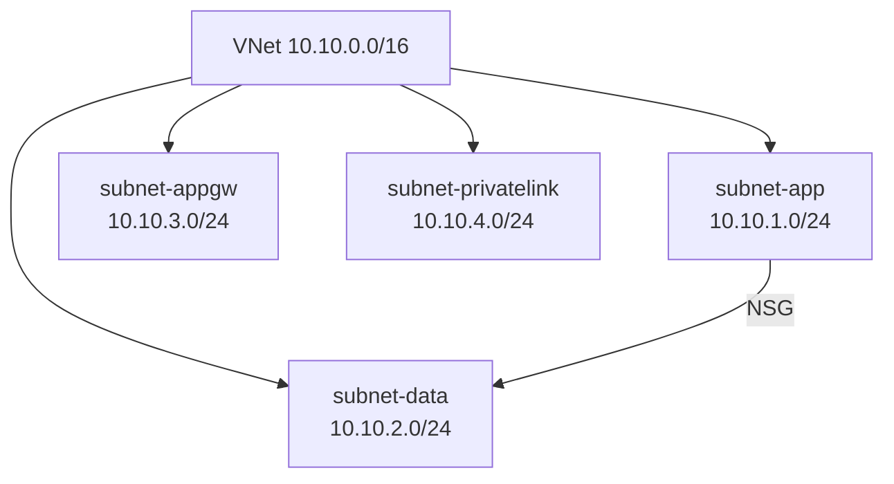
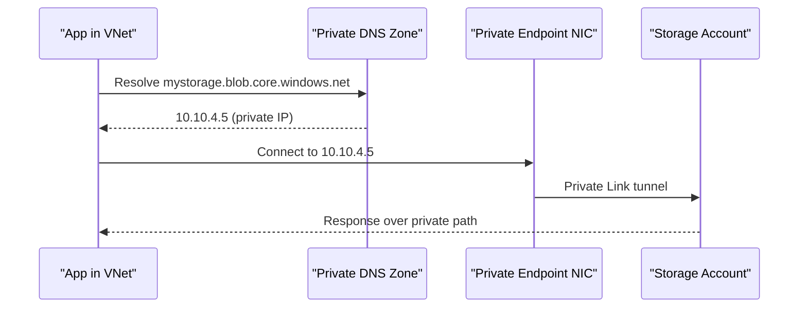

Networking questions are where "explain your architecture" interviews separate people who deployed resources from people who understand isolation. This page covers VNet design, the service-endpoint-versus-private-endpoint decision that trips up most candidates, DNS resolution, and connectivity options.

## VNets, subnets, and CIDR planning

A **Virtual Network (VNet)** is an isolated network boundary within a region; **subnets** partition it into smaller ranges, each of which can carry different NSGs, route tables, and service delegations. Azure reserves the first four and last one address in every subnet (network ID, default gateway, two DNS reserved, broadcast), so a `/24` subnet gives you 251 usable addresses, not 256.



> [!KEY]
> Plan CIDR ranges for the whole company before the first VNet is deployed, not per-project. Overlapping address spaces are the single biggest reason VNet peering and hub-and-spoke migrations get expensive later — you cannot peer two VNets with overlapping ranges.

| Planning concern | Guidance |
|---|---|
| Size subnets for growth | Leave headroom — resizing a subnet with resources already deployed is disruptive |
| Reserve ranges centrally | A shared IPAM spreadsheet or tool prevents two teams claiming the same `/16` |
| Delegate subnets per service | Some PaaS (e.g. VNet-integrated App Service, Azure Firewall) require a dedicated, delegated subnet |
| Keep a gateway subnet | VPN/ExpressRoute gateways require a subnet literally named `GatewaySubnet` |

## NSGs vs Azure Firewall vs Application Security Groups

These three operate at different layers and are often used together, not as alternatives.

| Control | Layer | Scope | Stateful | Typical use |
|---|---|---|---|---|
| Network Security Group (NSG) | L3/L4 (IP, port, protocol) | Subnet or NIC | Yes | Coarse allow/deny between subnets and tiers |
| Application Security Group (ASG) | Grouping mechanism over NSG rules | Referenced inside NSG rules | N/A | Group VMs by role ("web", "db") instead of hardcoding IPs |
| Azure Firewall | L3–L7 (FQDN filtering, threat intel) | Hub VNet, centralised | Yes | Centralised egress control, FQDN allow-listing, cross-subscription policy |

> [!TIP]
> A senior answer: "NSGs enforce tier-to-tier segmentation cheaply at the subnet level; Azure Firewall sits in the hub and centralises egress filtering and FQDN rules so we don't replicate firewall logic per spoke; ASGs let our NSG rules reference 'the web tier' instead of a list of IPs that drifts out of date."

## Service endpoints vs private endpoints — the comparison that matters

This is the single most-tested networking topic in Azure interviews. Both extend your VNet's identity to a PaaS service, but they solve different problems.

| Aspect | Service Endpoint | Private Endpoint |
|---|---|---|
| What it does | Routes traffic to the PaaS service over the Azure backbone, tagging it with your VNet/subnet identity | Injects a private IP from your VNet directly into the service, via Azure Private Link |
| Target still has a public IP | Yes — endpoint is still public, but firewall can restrict to "traffic from subnet X" | No — the service gets a NIC in your subnet; public access can be fully disabled |
| Protects against data exfiltration | Partially — restricts by source subnet, not by full network isolation | Yes — service is unreachable from the public internet at all |
| Cross-VNet / on-premises access | No — only works from within Azure VNets with the endpoint enabled | Yes — reachable via peering, VPN, or ExpressRoute like any other private IP |
| DNS impact | None — public DNS name still resolves to public IP | Requires private DNS zone so the public FQDN resolves to the private IP |
| Billing | Free | Small hourly + data processing charge per endpoint |
| Granularity | Per-subnet | Per-resource-instance (a private endpoint targets one storage account, one Key Vault, etc.) |

Service endpoints extend the *VNet's identity* to the service; private endpoints extend the *service's presence* into the VNet. If the requirement is "no path to this database exists outside our network, full stop," only a private endpoint (combined with disabling public network access) satisfies it.

```bash
# Create a private endpoint for a storage account into a dedicated subnet,
# then disable the account's public network access entirely.
az network private-endpoint create \
  --name pe-mystorage-blob --resource-group rg-shared-network \
  --vnet-name vnet-hub --subnet subnet-privatelink \
  --private-connection-resource-id $(az storage account show -n mystorage --query id -o tsv) \
  --group-id blob --connection-name mystorage-blob-connection

az storage account update --name mystorage --public-network-access Disabled
```

## Private DNS zones — the resolution problem people get wrong

A private endpoint gives a resource a private IP, but the resource's FQDN (e.g. `mystorage.blob.core.windows.net`) still normally resolves to its **public** IP unless something overrides that. Azure Private DNS zones (e.g. `privatelink.blob.core.windows.net`) linked to your VNet provide that override, so clients inside the VNet resolve the same public hostname to the private IP, while clients outside still see the public one (which you then block at the resource's network settings).



> [!DANGER]
> The classic failure: teams create the private endpoint but forget to link the private DNS zone to the VNet, or forget it needs linking to *every* VNet that must resolve it (including peered VNets and on-premises via a DNS forwarder/Azure DNS Private Resolver). Without that link, clients still resolve to the public IP, traffic either fails (if public access is disabled) or silently goes over the public path (if it isn't) — defeating the entire point of the private endpoint while looking like it's "configured".

## VNet peering vs VPN vs ExpressRoute

| Option | Connects | Latency | Bandwidth | Typical use |
|---|---|---|---|---|
| VNet peering | Azure VNet ↔ Azure VNet | Lowest — Microsoft backbone | Very high | Hub-and-spoke within/across regions |
| Site-to-site VPN | On-premises ↔ Azure, over internet (IPsec) | Variable, internet-dependent | Up to ~1.25 Gbps per tunnel | Quick, cheap hybrid connectivity, DR link |
| ExpressRoute | On-premises ↔ Azure, private circuit via a connectivity provider | Low, predictable | 50 Mbps–100 Gbps | Production hybrid workloads needing SLA-backed bandwidth |

Peering is not transitive: if Spoke A peers with Hub, and Hub peers with Spoke B, Spoke A cannot reach Spoke B through the hub unless the hub has a network virtual appliance/Azure Firewall with user-defined routes forcing that traffic through it.

## Egress control, forced tunnelling, and PaaS isolation

By default, resources in a VNet can reach the internet directly. **Forced tunnelling** overrides this with a user-defined route (UDR) sending `0.0.0.0/0` through a central firewall or NVA, so all egress is inspectable and FQDN-filterable — required in regulated environments. For PaaS services (Storage, SQL, Cosmos DB, Key Vault, Service Bus...), network isolation is a three-step pattern: disable public network access, add a private endpoint into a dedicated subnet, and link the matching private DNS zone.

> [!WARNING]
> Forced tunnelling breaks anything that relies on Azure's default outbound path (including some managed identity token requests to Azure AD endpoints and Instance Metadata Service calls) if the firewall doesn't explicitly allow those FQDNs. Always allow-list the required Azure AD, ARM, and platform endpoints before enabling forced tunnelling broadly.

## Cheat sheet

- CIDR-plan the whole estate up front — overlapping ranges block peering later.
- NSG = tier segmentation, Azure Firewall = centralised egress/FQDN filtering, ASG = readable NSG rules.
- Service endpoint = VNet identity extended to a still-public service; private endpoint = service given a private IP inside your VNet.
- Private endpoint + disabled public access is the only way to fully remove a PaaS resource from the internet.
- Every private endpoint needs its matching private DNS zone linked to every VNet that must resolve it.
- VNet peering is non-transitive; hub-and-spoke needs a firewall/NVA and UDRs to route spoke-to-spoke traffic.
- ExpressRoute for SLA-backed production hybrid bandwidth; VPN for cheap/quick or DR connectivity.
- Forced tunnelling requires explicit allow-listing of Azure control-plane FQDNs or identity/token calls silently fail.

## Common mistakes

| Mistake | Fix |
|---|---|
| Treating service endpoints as equivalent to private endpoints | Use private endpoints when public access must be fully removed |
| Creating a private endpoint but not linking the private DNS zone | Link the zone to every VNet (including peered ones) that needs resolution |
| Assuming peering is transitive across a hub | Add a firewall/NVA with UDRs for spoke-to-spoke routing |
| Undersizing subnets, then needing to resize with resources live | Plan headroom; delegated subnets (Firewall, App Service, gateway) can't shrink easily |
| Enabling forced tunnelling without allow-listing identity/ARM endpoints | Explicitly permit required Azure control-plane FQDNs first |
| Hardcoding IPs in NSG rules for VM roles | Use Application Security Groups instead |

## Summary

Azure network design is really about answering one question well: what is reachable from where, and why. VNets and subnets set the boundaries, NSGs and Azure Firewall enforce them at different layers, and the service-endpoint-versus-private-endpoint choice determines whether a PaaS resource is merely restricted or genuinely unreachable from the internet. Private DNS zone linkage is the detail that quietly breaks private endpoints in production, so name it explicitly whenever you describe the pattern. Layer connectivity options — peering, VPN, ExpressRoute — on top based on latency, bandwidth, and SLA needs.

## Top Interview Questions

### Q1. What's the difference between a service endpoint and a private endpoint, and when would you choose each?

A service endpoint extends your VNet's identity onto the Azure backbone path to a PaaS service — the service itself keeps its public IP, but you can configure it to only accept traffic that originates from a tagged subnet. A private endpoint instead provisions a private IP address from your VNet directly on the service via Azure Private Link, so the service can be made completely unreachable from the public internet. I'd use a service endpoint for a quick, free way to restrict access from known subnets when full isolation isn't required and cost/complexity should stay low. I'd use a private endpoint whenever the requirement is genuine network isolation — no public path should exist at all — which is now the default recommendation for anything handling sensitive data, since it also enables access from on-premises or peered networks that service endpoints can't reach.

### Q2. You set up a private endpoint for a storage account, but the app still can't connect, or worse, still resolves to the public IP. What do you check?

First, DNS: private endpoints only work if the resource's FQDN resolves to the private IP inside the VNet, which requires an Azure Private DNS zone (`privatelink.blob.core.windows.net` for blob storage) linked to the VNet. If the app resolves the hostname to a public IP, the zone either isn't linked, or is linked to the wrong VNet (common with peered VNets or hybrid setups where an on-premises DNS forwarder needs to point at Azure DNS Private Resolver). Second, check whether public network access is actually disabled on the storage account and whether any firewall exceptions ("allow trusted Microsoft services") are needed. Third, confirm the app's subnet has no NSG or route table blocking the private endpoint's subnet, and that the client is actually running inside the VNet or a network with connectivity to it — testing from a jumpbox in the same subnet isolates DNS from network reachability issues quickly.

### Q3. Explain hub-and-spoke topology and why VNet peering being non-transitive matters.

Hub-and-spoke centralises shared services — a firewall, VPN/ExpressRoute gateway, DNS resolver — in a "hub" VNet, while workload teams get their own "spoke" VNets peered to the hub, isolating blast radius and letting each team own their spoke independently. It matters that peering is non-transitive because peering the hub to Spoke A and the hub to Spoke B does not let Spoke A talk to Spoke B automatically — Azure doesn't route through a peered VNet to reach a third one. To allow (or force) that traffic, you route spoke-to-spoke traffic through a network virtual appliance or Azure Firewall in the hub using user-defined routes, which also gives you a single inspection point for that lateral traffic rather than relying on peering alone.

### Q4. When would you pick Azure Firewall over relying purely on NSGs?

NSGs are stateful L3/L4 allow/deny rules scoped to a subnet or NIC — good for coarse segmentation like "web tier can talk to app tier on 443" — but they can't filter by FQDN, don't centralise policy across many VNets, and don't provide threat intelligence-based filtering. Azure Firewall operates at the hub, can filter outbound traffic by fully qualified domain name (so you can allow `*.azurewebsites.net` without allowing arbitrary internet egress), supports threat intelligence feeds, and gives one place to apply and audit egress policy across every spoke. I'd use NSGs for cheap, fast, per-subnet segmentation as a baseline everywhere, and add Azure Firewall in the hub when the requirement is centralised, auditable, FQDN-aware egress control — typically driven by a security/compliance requirement.

### Q5. What's the risk of enabling forced tunnelling without additional configuration, and how would you roll it out safely?

Forced tunnelling redirects all outbound traffic — including `0.0.0.0/0` — through a central firewall or NVA via a user-defined route, which is necessary for full egress inspection but breaks anything relying on Azure's default outbound internet path unless explicitly allowed through the firewall. This commonly breaks managed identity token acquisition (calls to Azure AD endpoints), Windows/Linux update services, and any SaaS dependency the app calls directly. I'd roll it out by first cataloguing every FQDN/IP the workload legitimately needs (Azure AD, ARM, package repositories, third-party APIs), explicitly allow-listing them on the firewall, testing in a non-production spoke first, and monitoring firewall deny logs closely after cutover to catch anything missed before it becomes an incident.

### Q6. How do you plan CIDR ranges across an organisation with many teams deploying their own VNets?

I'd allocate address space centrally before teams start deploying, not after — typically a large private range (e.g. `10.0.0.0/8`) split into per-region, per-environment blocks handed out from a central IPAM tool or a tracked spreadsheet, with each team requesting a block rather than picking their own. The reason this has to happen up front is that overlapping CIDR ranges between two VNets make peering impossible without re-addressing, which is disruptive once resources and DNS records exist. I'd also size subnets generously for growth, keep aside a dedicated `GatewaySubnet` for VPN/ExpressRoute, and delegate subnets early for services that require it (App Service VNet integration, Azure Firewall, Application Gateway) since those often have minimum size and delegation constraints that are painful to fix retroactively.

### Q7. What's the difference between VPN Gateway and ExpressRoute, and how would you decide between them for a production hybrid workload?

A site-to-site VPN Gateway connects on-premises to Azure over the public internet using IPsec tunnels, is quick and relatively cheap to set up, but has variable latency and bandwidth capped around 1.25 Gbps per tunnel (higher with multiple tunnels/ECMP), with no formal latency SLA since it traverses the internet. ExpressRoute is a private circuit through a connectivity provider that bypasses the public internet entirely, offering predictable low latency, bandwidth from 50 Mbps up to 100 Gbps, and an SLA. For a production workload with real throughput or latency requirements — say, a data centre migration streaming continuous replication traffic, or a trading-adjacent system — I'd choose ExpressRoute for the primary path and keep a VPN Gateway as a lower-cost failover, since ExpressRoute circuits, while more expensive and slower to provision (can take weeks), are the only option with a real SLA.

### Q8. A security review flags that your Key Vault has "public network access enabled" even though you added a private endpoint. Why does that matter, and how do you fix it?

Adding a private endpoint gives the resource a private path, but by default the public endpoint often remains reachable too, unless public network access is explicitly disabled on the resource. That means an attacker (or a misconfigured client) can still reach the Key Vault over the internet using its public IP if network ACLs allow it, even though the "correct" private path exists — the private endpoint alone doesn't enforce isolation. The fix is to explicitly set public network access to "disabled" (or restrict it to selected networks only as an interim step) on the Key Vault's networking configuration, then verify with a connectivity test from outside the VNet that the public path is actually rejected, not just deprioritised.

### Q9. How would you design network isolation for a PaaS-heavy architecture (App Service, SQL Database, Service Bus, Key Vault) end to end?

I'd put a dedicated subnet for private endpoints in the spoke VNet, disable public network access on every PaaS resource, and create a private endpoint per resource into that subnet, each with its corresponding private DNS zone (`privatelink.database.windows.net`, `privatelink.servicebus.windows.net`, `privatelink.vaultcore.azure.net`) linked to the VNet. For the compute side, I'd use VNet integration on App Service so outbound calls originate from within the VNet and can actually reach those private endpoints — inbound to App Service itself I'd typically front with Application Gateway or Front Door rather than exposing it directly. I'd centralise egress through Azure Firewall in a hub VNet with FQDN allow-listing for anything that must reach the public internet (e.g. a third-party API), and use NSGs on each subnet as defense-in-depth even though the private endpoints already remove the public attack surface.

### Q10. Two peered VNets have overlapping address spaces and now need to communicate. What are your options?

There's no way to make VNet peering work with overlapping CIDR ranges — Azure will reject the peering, or if it was somehow established before an overlap was introduced, routing becomes ambiguous and unreliable. The clean long-term fix is re-addressing one of the VNets, which is disruptive since every resource, NSG rule, and DNS record referencing the old range needs updating — best done by standing up a new VNet with a non-overlapping range and migrating workloads rather than trying to renumber in place. A short-term workaround if renumbering isn't immediately possible is to route only the non-overlapping subset of traffic through a network virtual appliance doing NAT translation between the two ranges, but that adds real operational complexity and I'd frame it as a stopgap, not a design choice, in front of an interviewer — the actual answer they're listening for is "we should never have let this happen; central CIDR planning prevents it."
