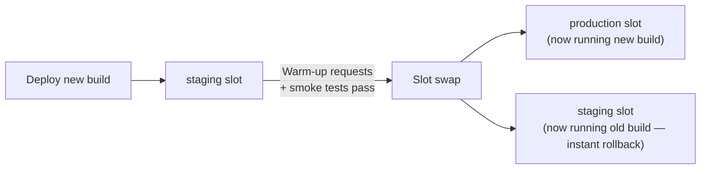
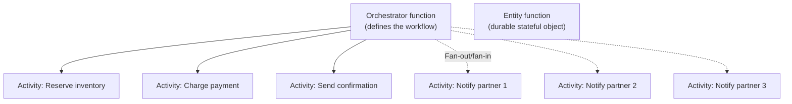
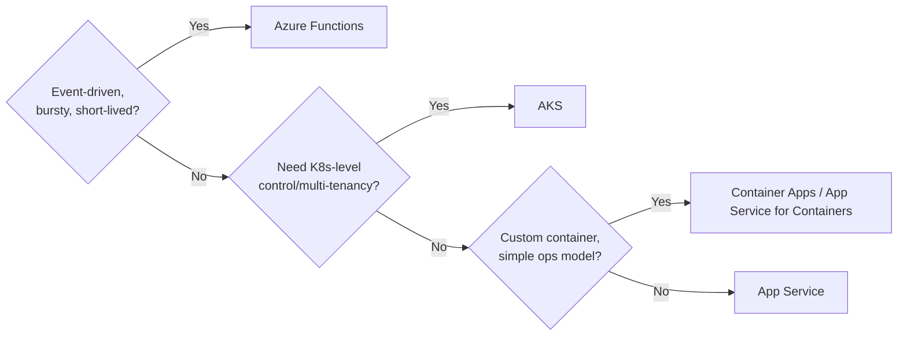

Compute choice is usually the first question in an "explain your architecture" interview, and "we used App Service because it was easy" is a weak answer. This page covers App Service scaling and slots, Functions triggers/bindings and cold starts, Durable Functions, and how to justify Functions versus App Service versus containers.

## App Service plans and scaling

An **App Service Plan** is the underlying set of VM instances (a specific SKU/size) that one or more App Service apps run on; the plan, not the app, is what you scale. Scaling is either **vertical** (scale up — bigger SKU, more CPU/RAM per instance) or **horizontal** (scale out — more instances), and horizontal scaling can be manual, schedule-based, or metric-based autoscale (CPU%, memory, queue length).

| Tier | Use case | Key limits |
|---|---|---|
| Free/Shared | Prototypes only | No custom domain SSL, shared compute, low quotas |
| Basic | Dev/test | No autoscale, no slots |
| Standard | Small production workloads | 5 slots, autoscale, daily backups |
| Premium v3 | Production | 20 slots, VNet integration, higher scale-out limits, faster CPUs |
| Isolated (App Service Environment) | Regulated/high-isolation workloads | Dedicated deployment inside your own VNet, single-tenant |

> [!KEY]
> Everything in the same App Service Plan shares the same instances and scales together. Putting a CPU-hungry background app in the same plan as a latency-sensitive API means a spike in one starves the other — split them into separate plans when their scaling profiles differ.

## Deployment slots and slot swap with warm-up

A **deployment slot** is a live, separately-addressable copy of the app running in the same plan — commonly a `staging` slot deployed to and validated before being swapped into `production`. A **swap** exchanges the virtual IP/routing between two slots, not the code, and is near-instant from a routing perspective, but the target slot must be "warmed up" first (App Service applies the destination slot's configuration to the source slot, restarts it, and waits for it to respond to requests) so there's no cold-start gap for real users.



> [!TIP]
> The instant-rollback story is the point interviewers want to hear: "If the new version misbehaves after swap, we swap back — the old build is still warm in the other slot, so rollback is as fast as the original swap, not a redeploy." Configure `Always On` and custom warm-up paths (`applicationInitialization` in web.config, or a health endpoint) so the swap genuinely serves zero cold requests.

Slot-specific app settings (e.g. a "which environment am I" flag, or a connection string that must NOT swap) are marked "sticky" and stay with the slot rather than swapping with the code.

## Always On and App Service networking

**Always On** keeps the app loaded in memory and prevents IIS/the platform from unloading it after 20 minutes of inactivity — without it, the first request after idle time pays a full cold start. It's required for any app using continuous WebJobs, and effectively mandatory for any production API.

For network isolation, App Service has two distinct, complementary mechanisms:

| Mechanism | Direction | What it does |
|---|---|---|
| VNet Integration | Outbound | App's *outbound* calls (to a database, Redis, another private-endpoint-protected service) go through the VNet |
| Private Endpoint | Inbound | Gives the App Service itself a private IP so *inbound* traffic can only reach it from inside the VNet (plus anything peered/connected) |

> [!WARNING]
> VNet Integration alone does not make your app private — it only affects outbound traffic. The app is still publicly reachable on its default `*.azurewebsites.net` URL unless you also add a private endpoint (or restrict access via access restrictions/IP rules) for inbound isolation. This is a very commonly confused pair in interviews.

## Azure Functions: triggers and bindings

Functions are event-driven — a **trigger** decides when a function runs and supplies the input, while **input/output bindings** declaratively wire up additional data sources/sinks without you writing SDK boilerplate.

| Trigger | Fires on | Common binding pairing |
|---|---|---|
| HTTP | Inbound HTTP request | HTTP response output binding |
| Timer | CRON schedule | — |
| Queue (Storage Queue / Service Bus) | New message | Output binding to another queue, or Cosmos DB |
| Blob | New/updated blob | Output binding to another container |
| Event Hub / Event Grid | New event | Output to Storage, Service Bus |
| Cosmos DB (change feed) | Document insert/update | Output binding for fan-out writes |

```csharp
[Function("ProcessOrder")]
public async Task Run(
    [ServiceBusTrigger("orders", Connection = "ServiceBusConnection")] string message,
    [CosmosDBOutput("Orders", "Items", Connection = "CosmosConnection")] IAsyncCollector<dynamic> output)
{
    var order = JsonSerializer.Deserialize<Order>(message);
    await output.AddAsync(order); // binding handles the SDK call
}
```

## Consumption vs Premium vs Dedicated plan

| Plan | Scaling | Cold starts | Max execution time | VNet integration | Cost model |
|---|---|---|---|---|---|
| Classic Consumption | Automatic, event-driven, 0→N instances | Yes — pays for it | 5–10 min (configurable up to 10) | No | Pay per execution + GB-s |
| Flex Consumption | Automatic, event-driven, scale-to-zero with optional always-ready instances | Lower and more tunable than classic Consumption | Longer-running workloads than classic Consumption, subject to plan limits | Yes | Pay per execution/GB-s plus any always-ready baseline |
| Premium | Automatic, with pre-warmed instances | Minimal/avoidable | Unbounded (with caveats) | Yes | Pay for pre-warmed + burst instances |
| Dedicated (App Service Plan) | Manual/autoscale, same as App Service | No (Always On) | Unbounded | Yes | Pay for the plan regardless of invocations |

Classic Consumption literally scales to zero — you pay nothing when idle, but the first request after idle time pays the cost of spinning up a new instance from scratch and it lacks VNet integration. Flex Consumption is the newer serverless option for many workloads: it keeps the scale-to-zero billing model, adds VNet integration and optional always-ready instances, and reduces some cold-start pain without taking on the full Premium baseline. Premium plan keeps a configurable number of pre-warmed instances always ready and remains the choice when you need the most predictable event-driven latency and broader hosting features.

## Cold starts and how to avoid them

A cold start is the latency of provisioning a new worker, loading the runtime, and JIT-compiling/initializing your code before the first request is served — commonly hundreds of milliseconds to several seconds, worse for larger dependency graphs or runtimes like Java/.NET compared to lighter ones.

| Mitigation | Effect |
|---|---|
| Premium plan pre-warmed instances | Removes cold start almost entirely for the configured minimum instance count |
| Reduce package/dependency size | Less to load and JIT per cold start |
| Avoid heavy static initialization | Defer expensive setup until actually needed |
| Use `.NET` isolated/ReadyToRun or trimmed deployments | Faster startup than full JIT from scratch |
| Keep functions warm with a timer ping (Consumption) | Hacky, not guaranteed, but reduces frequency in practice |

## Durable Functions

Durable Functions extend Functions with stateful orchestration, checkpointing progress to storage automatically so a workflow can run far longer than a single function's timeout and survive process restarts.



| Function type | Role |
|---|---|
| Orchestrator | Defines the workflow logic — deterministic, replayed from history on resume |
| Activity | Does the actual work (call an API, write to a DB) — not replayed, only executed once per real attempt |
| Entity | A durable stateful object (like a tiny actor) with operations that mutate its own state |
| Fan-out/fan-in | Orchestrator kicks off many activities in parallel, then waits for all to complete |

> [!DANGER]
> Orchestrator code must be **deterministic** — no `DateTime.Now`, no direct random numbers, no direct I/O — because the runtime replays the orchestrator's history from checkpoints to resume state after any restart. Non-deterministic code produces different results on replay and corrupts the workflow. Use the provided deterministic APIs (`context.CurrentUtcDateTime`, activity calls) instead.

## Timeouts and long-running work

Classic Consumption plan functions have a hard execution timeout (default 5 minutes, configurable to 10); anything longer must move to a plan that supports longer executions (Flex Consumption, Premium, or Dedicated, depending on the trigger and workload) or be restructured as a Durable Functions orchestration that checkpoints and can span hours or days without holding a single execution open the whole time.

## When to choose Functions vs App Service vs containers

| Requirement | Best fit |
|---|---|
| Simple, sporadic, event-driven workload | Functions (Consumption or Flex Consumption, depending on networking/startup needs) |
| Need VNet integration while keeping serverless scale-to-zero | Functions (Flex Consumption) |
| Need to eliminate cold start as much as possible, keep event-driven model | Functions (Premium) |
| Long-running API, full control over middleware/framework | App Service |
| Need custom OS-level dependencies, non-.NET stack quirks, or portability across clouds | Containers (App Service for Containers, Container Apps, or AKS) |
| Complex multi-step workflow with retries/fan-out spanning hours | Durable Functions |
| Need Kubernetes-level control (custom schedulers, service mesh, multi-tenant isolation) | AKS |



## Cheat sheet

- Scale the App Service **plan**, not the app; split unrelated apps into separate plans if scaling profiles differ.
- Slot swap exchanges routing, not code — warm up the target slot first so users never hit a cold instance.
- VNet Integration = outbound isolation only; Private Endpoint = inbound isolation. You usually need both.
- Classic Consumption scales to zero and pays per execution but eats cold starts and lacks VNet integration; Flex Consumption adds VNet support and optional always-ready instances; Premium keeps pre-warmed instances for the most predictable latency.
- Orchestrator functions must be deterministic — no `DateTime.Now`, no direct I/O, no raw random — because history is replayed.
- Durable entities are the "actor" pattern inside Functions — small stateful objects with their own operations.
- Fan-out/fan-in lets an orchestrator dispatch N activities in parallel and await them all.
- Consumption timeout is capped (default 5 min, max 10); use Premium/Dedicated or Durable Functions for longer work.

## Common mistakes

| Mistake | Fix |
|---|---|
| Assuming VNet Integration makes the app private | Add a private endpoint (or access restrictions) for inbound isolation too |
| Writing non-deterministic code inside an orchestrator function | Move I/O, randomness, and current-time reads into activity functions |
| Running a background batch job in the same plan as a latency-sensitive API | Split into separate App Service Plans with independent scaling |
| Expecting Consumption plan to have zero cold-start latency | Use Flex always-ready or Premium pre-warmed instances if cold start is unacceptable |
| Swapping slots without warm-up/health checks configured | Enable Always On + `applicationInitialization` / custom warm-up path |
| Treating Durable Functions as suitable for sub-second latency workflows | Use them for long-running, checkpointed workflows, not tight request/response loops |

## Summary

App Service gives you a managed web host with predictable scaling via plans and near-zero-downtime deployments via slot swaps, provided you understand that VNet Integration and private endpoints solve different halves of network isolation. Azure Functions trades that always-on model for event-driven compute, with hosting choices ranging from classic Consumption through Flex Consumption to Premium; cold starts and VNet needs are usually what move you up that ladder. Durable Functions extends the model to long-running, stateful workflows through deterministic orchestrators and replayable history. Choosing between Functions, App Service, and containers comes down to how event-driven the workload is, how much control you need over the runtime, and how tolerant the workload is of cold starts and execution time limits.

## Top Interview Questions

### Q1. What is a deployment slot, and how does slot swap achieve near-zero-downtime deployment?

A deployment slot is a live, independently addressable instance of an app running in the same App Service Plan, typically used to deploy and validate a new build (in a "staging" slot) before it serves production traffic. A slot swap doesn't move code — it swaps the routing (and non-sticky configuration) between two slots, so the slot that was "staging" becomes "production" and vice versa, essentially instantly from a traffic-routing perspective. To make this genuinely zero-downtime, App Service first applies the target slot's settings to the source slot and issues warm-up requests (via `applicationInitialization` or a configured health endpoint) so the app is already fully started and serving real requests successfully before the swap completes — without that warm-up, the first users after swap would hit a cold, unstarted app. If the new version misbehaves, you swap back, and the previous build is still warm in the other slot, making rollback as fast as the original deployment.

### Q2. What's the difference between VNet Integration and a private endpoint on App Service, and why do people confuse them?

VNet Integration affects only the app's **outbound** traffic — it routes calls the app makes to other resources (a database, a private-endpoint-protected storage account, an internal API) through the VNet, so those calls can reach VNet-only resources. A private endpoint gives the App Service itself a private IP address, controlling **inbound** access — without one (or equivalent access restrictions), the app remains reachable at its public `*.azurewebsites.net` hostname regardless of VNet Integration being enabled. People confuse them because both involve "the VNet" and both are configured in the same networking blade, but they solve opposite directions of traffic; a fully network-isolated App Service typically needs both — VNet Integration so it can reach other private resources, and a private endpoint (plus disabling public access) so it can't be reached from the internet.

### Q3. Why must Durable Functions orchestrator code be deterministic, and what happens if it isn't?

The Durable Functions runtime persists a history of every action an orchestrator takes (activity calls, timers, external events) and, whenever the orchestrator needs to resume — after awaiting an activity, after a process restart, or when scaling to a different worker — it **replays the orchestrator function from the beginning**, using the recorded history to fast-forward through already-completed steps rather than re-executing them. If the orchestrator's code isn't deterministic — say it calls `DateTime.Now` or generates a random number directly — the replay produces different values than the original execution did, so the orchestrator can take a different logical path than before, corrupting the workflow's state or causing duplicate/skipped side effects. The fix is to only perform actual work, randomness, or current-time reads inside activity functions (which are recorded and not replayed), and use the framework's deterministic equivalents (`context.CurrentUtcDateTime`, `context.NewGuid()`) inside the orchestrator itself.

### Q4. When would you choose Azure Functions Premium plan over Consumption, given Premium costs money even when idle?

Classic Consumption cold starts — the delay while a new worker is provisioned and your code initializes — can range from a few hundred milliseconds to several seconds depending on runtime and dependency size, which is unacceptable for latency-sensitive, user-facing paths. Premium keeps a configurable number of pre-warmed instances ready to minimise that gap, while still scaling out automatically and supporting VNet integration. Today I would also evaluate Flex Consumption: it preserves serverless scale-to-zero, supports VNet integration, and offers always-ready instances for specific functions, so it can sit between classic Consumption and Premium on cost/latency. I choose Premium when latency predictability, trigger support, or hosting features require it; I keep Consumption/Flex for background or bursty workloads where occasional startup cost is acceptable.

### Q5. Explain fan-out/fan-in in Durable Functions with a concrete scenario.

Fan-out/fan-in is a pattern where an orchestrator dispatches multiple activity function calls in parallel (fan-out) and then waits for all of them to complete before proceeding (fan-in), rather than awaiting each one sequentially. A concrete scenario: an order-fulfilment orchestrator needs to notify five downstream partner systems about a new order — instead of calling each partner one after another (five times the latency of the slowest), it starts all five activity calls at once, collects the resulting `Task` array, and awaits `Task.WhenAll` to know when every partner has been notified (or which ones failed) before marking the order as fully processed. This is valuable whenever a workflow has independent sub-tasks whose combined latency should be the *maximum* of the individual tasks rather than their *sum*, and Durable Functions' checkpointing means this stays correct and resumable even if the process restarts partway through.

### Q6. A function on the Consumption plan is timing out after 10 minutes on a long batch job. What are your options?

First, question whether the work genuinely needs 10+ minutes in one execution, or whether it can be decomposed into smaller units — for example, processing a queue of items in smaller batches so each invocation stays well under the limit, which also improves resilience to partial failures. If the work is inherently a long, multi-step workflow (not just "large"), the right fix is to convert it into a Durable Functions orchestration: break the work into activity functions, let the orchestrator sequence and checkpoint them, and the overall workflow can then span far longer than any single execution's timeout since it's not held open continuously. If the workload is genuinely a single long-running unit of compute that can't be decomposed or checkpointed, moving to a Premium or Dedicated (App Service) plan removes the hard timeout entirely, at the cost of losing pure pay-per-execution billing.

### Q7. How would you decide between Azure Functions, App Service, and containers for a new backend service?

I'd start from the traffic and workload shape: if the service is event-driven and bursty — reacting to queue messages, blob uploads, or scheduled triggers with no need for a persistent process — Functions is the natural fit, and I'd pick Consumption or Premium based on cold-start tolerance. If it's a continuously-running API with full control needed over middleware, long-lived connections (WebSockets, SignalR), or a framework that doesn't map cleanly to the trigger/binding model, App Service is the better fit. If the workload has custom OS-level dependencies, needs to be portable across environments, or the team already has strong container tooling and wants consistent local/prod parity, I'd containerize it — using Container Apps or App Service for Containers if Kubernetes-level control isn't needed, or AKS specifically when the team needs custom scheduling, service mesh, or genuine multi-tenant cluster-level isolation that the simpler container platforms don't offer.

### Q8. What's the difference between "Always On" and a Premium plan's pre-warmed instances, and do you need both?

Always On (available from Standard tier up) simply stops App Service from unloading your app after 20 minutes of no requests — without it, the app is torn down when idle and pays a full cold start on the next request, same category of problem as a Functions cold start. Premium plan's pre-warmed instances are specifically a Functions Premium plan feature that keeps a configurable minimum number of *additional* instances warmed and ready to absorb scale-out events, on top of whatever's already running — a different mechanism solving "scale-out cold start" rather than "idle teardown cold start." For a standard App Service web app, Always On alone (assuming Standard tier or above) removes the idle-teardown problem; Functions Premium's pre-warmed instances address the scale-out case that Always On doesn't cover for Functions' elastic scaling model. They're not redundant — App Service doesn't have "pre-warmed instances" as a distinct concept the way Functions Premium does.

### Q9. Why would you split two apps into separate App Service Plans instead of running them together on one plan to save cost?

An App Service Plan represents a fixed pool of compute instances shared by every app deployed to it, so if two apps are on the same plan, they compete for the same CPU and memory, and autoscale rules apply to the whole plan, not per app. If one app is a latency-sensitive customer-facing API and the other is a CPU-intensive background report generator, a spike in report generation can starve the API of CPU, causing latency spikes or timeouts that have nothing to do with the API's own load — a classic "noisy neighbour" problem, except the neighbour is your own other app. Splitting them into separate plans costs more (you're now paying for two sets of instances instead of sharing one), but isolates their scaling and resource contention completely; the decision is really about whether the cost savings of sharing a plan are worth the coupling of failure/performance domains between unrelated workloads.

### Q10. A Function App on Consumption plan works fine in testing but shows inconsistent latency in production under real load. What would you investigate?

I'd first check whether the inconsistent latency correlates with scale-out events — Consumption plan spins up new instances dynamically as load increases, and each new instance pays a cold start, so if traffic is spiky rather than steady, a meaningful fraction of requests could be hitting freshly-provisioned instances rather than warm ones, which testing at low, steady load wouldn't have revealed. I'd look at Application Insights' live metrics and dependency/duration telemetry to separate cold-start latency from actual processing latency, and check whether the function has any heavy static initialization (large DI container setup, loading big config/models at startup) that's cheap once but expensive on every cold start. If cold starts under real traffic patterns turn out to be the dominant cause, I'd move the workload to Flex Consumption with always-ready instances or to a Premium plan with a sensible minimum pre-warmed instance count, or reduce the function's dependency footprint and startup work if staying on classic Consumption is a hard requirement.
