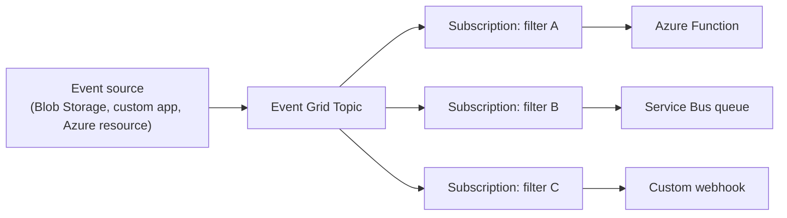
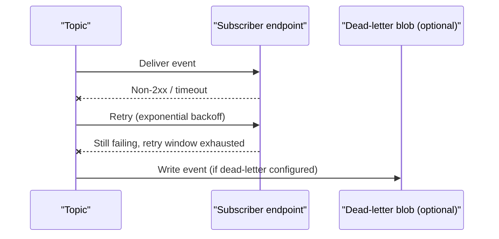

Event Grid is the piece that trips people up because it looks like Service Bus or Event Hubs but solves a genuinely different problem — reacting to discrete things happening, pushed to you, rather than processing a stream or a work queue. This page covers the push model, topic types, delivery guarantees, and the three-way comparison interviewers love to ask for.

## The push-based eventing model

Event Grid **pushes** events to subscribers the moment they occur, rather than subscribers pulling/polling for them — the defining difference from Service Bus and Event Hubs, both of which are pull-based (a consumer actively receives or reads). A publisher raises an event once; Event Grid fans it out to every matching subscription's destination (a webhook, a Function, a Service Bus queue, a Storage Queue, an Event Hub, a Logic App) with typically sub-second latency.



> [!KEY]
> Event Grid answers "something happened, who needs to know right now" — reactive, low-latency, fan-out notification. Event Hubs answers "a continuous stream of data needs to be ingested and replayed." Service Bus answers "this unit of work needs to be reliably processed exactly once." Confusing these three is the single most common mistake in an Azure messaging design discussion.

## Topics, system topics, and domains

| Concept | What publishes to it | Typical use |
|---|---|---|
| Custom topic | Your own application code | App-level custom events ("OrderShipped", "UserRegistered") |
| System topic | Azure itself, on behalf of a resource | Built-in events from Blob Storage, Resource Groups, Key Vault, IoT Hub, etc. — no code required to publish |
| Domain | Acts as a management wrapper over many topics | Multi-tenant SaaS — one domain, thousands of per-tenant "topics" managed and billed as a single resource |

> [!TIP]
> "We used system topics to react to Blob Storage uploads and Key Vault certificate near-expiry without writing any publishing code ourselves, and a custom topic for our own domain events like OrderPlaced" is the kind of sentence that shows you've actually used both categories, not just the custom-topic path everyone defaults to.

## Event schema and CloudEvents

Event Grid supports two event envelope schemas: its own native **Event Grid schema**, and the **CloudEvents** schema (a CNCF standard adopted across multiple cloud providers and tools for portability).

| Field (Event Grid schema) | CloudEvents equivalent | Purpose |
|---|---|---|
| `id` | `id` | Unique event identifier |
| `eventType` | `type` | What kind of event this is |
| `subject` | `subject` | The specific resource/entity affected |
| `eventTime` | `time` | When the event occurred |
| `data` | `data` | The event payload |

```csharp
// Publishing a custom CloudEvents-schema event
var cloudEvent = new CloudEvent(
    source: "orders-service",
    type: "com.contoso.orders.placed",
    jsonSerializableData: new { OrderId = "12345", Total = 89.50 });

await client.SendEventAsync(cloudEvent);
```

Prefer CloudEvents for anything crossing organisational or cloud-provider boundaries, since it's a recognised open standard many tools and libraries already parse; the native Event Grid schema is fine for purely internal, Azure-only event flows and has been supported the longest.

## Subscriptions and filters

An **event subscription** binds a topic (or system topic) to a destination and a filter — subject-prefix/suffix matching, event-type matching, or advanced filters against arbitrary fields in the event's `data` payload — so a destination only receives the events it actually cares about, rather than every event on the topic.

```csharp
// Advanced filter example (conceptual): only orders over $100 reach this subscription
// filter: { key: "data.total", operatorType: "NumberGreaterThan", value: 100 }
```

| Filter type | Matches on |
|---|---|
| Subject filter | Prefix/suffix of the `subject` field |
| Event type filter | Specific `eventType`/`type` values |
| Advanced filter | Any field inside `data`, with operators (equals, greater than, contains, etc.) |

## Delivery retries and dead-lettering

Event Grid retries failed deliveries with **exponential backoff**, for up to 24 hours by default (configurable), before giving up. If a dead-letter destination (a Storage Blob container) is configured on the subscription, permanently failed events land there instead of being silently dropped — without one configured, an event that exhausts retries is simply lost.



> [!DANGER]
> Configuring a dead-letter destination is opt-in, not default. Teams that skip it discover during an incident that failed events during an outage were simply gone — always configure dead-lettering for any subscription whose events matter, and monitor the dead-letter container's blob count.

## Webhook validation handshake

To prevent Event Grid from being used to spam arbitrary URLs, any new **webhook** endpoint subscription must complete a validation handshake before events start flowing: Event Grid sends a special `SubscriptionValidationEvent` containing a `validationCode`, and the endpoint must echo it back in its response — Azure Functions and Logic Apps built-in Event Grid triggers handle this automatically, but a raw custom webhook must implement it explicitly.

```csharp
// Minimal webhook validation handling for a raw HTTP endpoint
if (eventGridEvent.EventType == "Microsoft.EventGrid.SubscriptionValidationEvent")
{
    var validationData = eventGridEvent.Data.ToObjectFromJson<SubscriptionValidationEventData>();
    return Results.Ok(new SubscriptionValidationResponse
    {
        ValidationResponse = validationData.ValidationCode
    });
}
```

## At-least-once delivery and ordering — there is none

Event Grid guarantees **at-least-once delivery** (a subscriber may receive the same event more than once, particularly around retries), and provides **no ordering guarantee** at all — events can arrive out of the order they were raised, especially under retry conditions or high volume. Subscriber logic must be idempotent and tolerant of out-of-order arrival; if strict ordering matters, that requirement belongs to Service Bus sessions or an Event Hubs partition key, not Event Grid.

> [!WARNING]
> This is the most commonly missed fact in interviews: candidates correctly say "at-least-once" but then describe logic that assumes events arrive in the order raised. State both properties explicitly — no ordering and possible duplicates — and explain how the subscriber handles each.

## Latency characteristics

Event Grid is built for low-latency, near-real-time delivery — typically well under a second end-to-end under normal conditions — which is precisely why it's the mechanism behind reactive automation (e.g. "run a Function within moments of a blob upload") rather than a batch or scheduled pattern. This latency profile is part of why it's unsuitable for high-volume streaming ingestion (that's Event Hubs' job) — Event Grid is optimized for many independent, relatively low-volume-per-type discrete events, not a continuous multi-megabyte-per-second firehose.

## Event-driven reactions to Azure resource changes

System topics let you react to platform-level events without any custom publishing code — a Function triggered by every new blob landing in a container to kick off processing, a Logic App notifying a team channel when a VM is deallocated, an automated remediation workflow triggered by a Key Vault certificate nearing expiry, or a governance pipeline reacting to `Microsoft.Resources.ResourceWriteSuccess` events to tag newly created resources automatically.

## Event Grid vs Service Bus vs Event Hubs

| Aspect | Event Grid | Service Bus | Event Hubs |
|---|---|---|---|
| Model | Push, reactive notification | Pull, transactional broker | Pull, replayable log |
| Ordering | None | Per-session | Per-partition |
| Delivery guarantee | At-least-once | At-least-once (peek-lock) / at-most-once (receive-and-delete) | At-least-once |
| Retention after delivery | Not retained — fire once, retry until success/give-up | Message stays until completed or expires | Retained for full window regardless of reads |
| Replay | No | No (aside from dead-letter reprocessing) | Yes — rewind to any offset |
| Typical volume | Low-to-moderate, many discrete event types | Moderate, transactional units of work | Very high, continuous streams |
| Typical use | React to a resource/app event | Reliable work queues, ordered per-key processing | Telemetry/clickstream ingestion, event sourcing |

## Cheat sheet

- Event Grid is push-based and reactive; Service Bus and Event Hubs are pull-based.
- System topics publish Azure platform events for you — no custom publishing code needed.
- Domains let you manage thousands of per-tenant topics as one billed/managed resource.
- Prefer the CloudEvents schema for cross-boundary portability; native schema is fine for internal-only flows.
- Delivery is at-least-once with **no ordering guarantee at all** — say both explicitly.
- Dead-lettering is opt-in; configure it and monitor it, or failed events during an outage are simply lost.
- Webhook subscriptions must complete a validation handshake before events flow; Functions/Logic Apps do this automatically.
- Latency is sub-second by design — great for reactive automation, wrong tool for high-volume streaming (that's Event Hubs).

## Common mistakes

| Mistake | Fix |
|---|---|
| Assuming Event Grid preserves event order | It guarantees none; design idempotent, order-tolerant subscriber logic |
| Not configuring a dead-letter destination | Always set one for subscriptions whose events matter, and monitor it |
| Implementing a custom webhook without the validation handshake | Echo the `validationCode` from the `SubscriptionValidationEvent`, or use a Function/Logic App trigger that handles it automatically |
| Using Event Grid for high-volume continuous streaming | Use Event Hubs; Event Grid is for discrete, reactive, lower-volume events |
| Treating a subscription's filter as a performance optimization only | It's also a correctness tool — an under-filtered subscription processes irrelevant events |
| Forgetting system topics exist and hand-rolling polling for Azure resource changes | Subscribe to the relevant system topic instead of polling ARM |

## Summary

Event Grid is the reactive, push-based layer of Azure's eventing story — publishers raise a discrete event once, and Event Grid fans it out with sub-second latency to every matching, filtered subscription, whether that's a webhook, a Function, or a downstream queue. System topics extend this to Azure's own resource lifecycle events with zero publishing code, and domains let large multi-tenant systems manage many logical topics as one resource. The two properties worth stating explicitly in any interview answer are at-least-once delivery and the complete absence of ordering guarantees — subscriber logic has to be idempotent and order-tolerant regardless of how reliable the pipeline looks. Knowing when a requirement actually belongs to Service Bus (ordered, transactional work) or Event Hubs (high-volume replayable streams) instead of Event Grid is what separates a coherent messaging architecture from three services glued together without a reason.

## Top Interview Questions

### Q1. What makes Event Grid fundamentally different from Service Bus and Event Hubs?

Event Grid is push-based: a publisher raises an event once, and Event Grid actively delivers it to every matching subscriber's destination, typically within well under a second. Service Bus and Event Hubs are both pull-based — a consumer actively receives (Service Bus) or reads (Event Hubs) messages/events rather than having them pushed to it. Beyond the push/pull distinction, Event Grid doesn't retain events after delivery and offers no replay, whereas Event Hubs retains its log for a configured window and supports full replay, and Service Bus retains a message until it's explicitly completed. The practical takeaway: reach for Event Grid when you need low-latency, fan-out reaction to discrete things happening; reach for the other two when you need reliable work processing or high-throughput streaming with replay.

### Q2. Explain the difference between a custom topic, a system topic, and a domain.

A custom topic is one you create and publish to yourself, typically for application-level events (an "OrderPlaced" event your own service raises). A system topic is automatically available for Azure resources — Blob Storage, Key Vault, Resource Groups, and others — and is published to by Azure itself whenever the relevant thing happens (a blob is created, a certificate is nearing expiry), requiring no publishing code from you at all. A domain is a management wrapper that lets you operate what would otherwise be thousands of separate topics — commonly one per tenant in a multi-tenant SaaS product — as a single Azure resource for billing, access control, and management purposes, since creating thousands of individual topic resources directly would be unwieldy. Choosing between them is really about who's publishing (your code, Azure, or many logical tenants) rather than a difficulty/capability trade-off.

### Q3. Does Event Grid guarantee ordering, and how should that affect how you write a subscriber?

No — Event Grid provides no ordering guarantee whatsoever; events can be delivered out of the order they were raised, particularly under retry conditions or bursts of activity, and there's no mechanism analogous to Service Bus sessions or Event Hubs partition keys to change that. This means subscriber logic must never assume "event B happening after event A in my code means my subscriber will see A before B" — instead, subscribers should be designed to handle events arriving in any order, for example by checking a timestamp or version field in the payload before applying an update, rather than assuming sequential arrival implies correctness. If a workflow genuinely requires strict ordering, that's a signal the requirement belongs to Service Bus (sessions) or Event Hubs (partition key), not Event Grid.

### Q4. What happens to an event if its subscriber's endpoint is down when Event Grid tries to deliver it?

Event Grid retries the delivery using exponential backoff, continuing for up to 24 hours by default (configurable), giving a transient outage on the subscriber's side a real chance to recover before the event is considered undeliverable. If the subscription has a dead-letter destination configured — typically a Blob Storage container — an event that exhausts all retries without a successful delivery is written there instead of being discarded, letting you later inspect and potentially reprocess it. Critically, dead-lettering is opt-in per subscription, not automatic, so if it isn't explicitly configured, an event that can't be delivered within the retry window is simply lost with no record — which is a common and painful discovery during a post-incident review, and worth configuring proactively for anything that matters.

### Q5. What is the webhook validation handshake, and why does Event Grid require it?

When you create a new event subscription pointing at a raw webhook endpoint (as opposed to an Azure Function or Logic App with a built-in Event Grid trigger, which handle this automatically), Event Grid first sends a special `SubscriptionValidationEvent` containing a `validationCode`, and the endpoint must respond by echoing that code back before Event Grid will start actually delivering real events to it. This exists to prevent Event Grid from being weaponized to send arbitrary traffic to any URL someone points a subscription at — without proof that the endpoint owner actually consented to receive events (by correctly handling the handshake), anyone could subscribe an unrelated third party's URL and use Event Grid as an amplification/spam vector. For a custom webhook, you need to explicitly detect and respond to this validation event type in your handler; for Function/Logic App triggers, the platform's Event Grid integration does this for you transparently.

### Q6. A stakeholder wants near-instant notification when a file lands in Blob Storage, to kick off processing. Would you use Event Grid or poll the container?

I'd use Event Grid via the system topic that Blob Storage automatically exposes, subscribing an Azure Function (or another destination) to the `Microsoft.Storage.BlobCreated` event — this requires no custom publishing code since Azure itself raises the event, and delivery latency is typically well under a second, meeting a "near-instant" requirement far better than any polling approach could. Polling the container on a schedule would introduce latency bounded by the polling interval (and cost, since every poll is an API call regardless of whether anything changed), and doesn't scale well if there are many containers or high upload frequency. The only reason I'd reconsider is if the actual requirement were "process every blob reliably with retry/ordering semantics per blob," in which case I might have the Event Grid-triggered Function simply enqueue a message to Service Bus for reliable downstream processing, using Event Grid purely as the low-latency trigger and Service Bus for the processing guarantees.

### Q7. How would you filter which events a particular subscriber receives, and why does that matter beyond just reducing noise?

Event Grid subscriptions support subject filters (prefix/suffix matching on the `subject` field), event type filters (matching specific `eventType`/`type` values), and advanced filters that can match against arbitrary fields inside the event's `data` payload using operators like equals, greater-than, or contains — so a subscription can be scoped to, for example, only `BlobCreated` events where the subject starts with `/blobServices/default/containers/incoming-orders/`. This matters beyond noise reduction because an under-filtered subscription forces the subscriber's own code to re-implement filtering logic after receiving (and paying the processing cost for) every event, and increases the risk of a subscriber accidentally acting on an event type it wasn't actually designed to handle. Filtering at the subscription level is both a performance optimization and a correctness boundary — it's the difference between "my Function only ever sees events it knows how to process" and "my Function has to defensively check every event's type before doing anything."

### Q8. Your event-driven pipeline occasionally processes the same event twice. Is this a bug, and how should the subscriber be written?

This is expected behavior, not a bug — Event Grid explicitly guarantees only at-least-once delivery, meaning duplicate delivery of the same event is a normal, documented possibility, most commonly happening when a delivery attempt times out or the destination returns a transient error close to a retry boundary, even if the original delivery had actually succeeded. The correct response isn't to try to eliminate duplicates at the Event Grid layer (there's no built-in deduplication feature to lean on), but to write the subscriber idempotently — for example, keying processing off the event's unique `id` field and checking (via a database unique constraint, a dedup cache, or simply designing the operation to be naturally idempotent, like an upsert) whether that event has already been fully processed before acting on it again. This is the same idempotency discipline any at-least-once delivery system requires, and it's worth stating explicitly that "at-least-once" is a deliberate trade-off for simplicity and availability, not a defect to route around.

### Q9. When would Event Grid, Service Bus, and Event Hubs all plausibly be used together in the same system, and how would they fit?

A common real pattern: Event Grid reacts to a discrete trigger — say, a file landing in Blob Storage or a custom "OrderPlaced" application event — and its low-latency push delivers that notification to an Azure Function, which then enqueues a message onto a Service Bus queue for reliable, ordered, retryable processing of that specific unit of work (using peek-lock, sessions if per-customer ordering matters, and dead-lettering for poison messages). Separately, high-volume telemetry generated by the same system — page views, sensor readings, application metrics — streams continuously into Event Hubs, where multiple independent consumer groups (a real-time monitoring dashboard, a long-term analytics pipeline) read and replay that stream at their own pace. Each service is doing the job it's actually built for: Event Grid for "something happened, react now," Service Bus for "this business transaction needs reliable, ordered processing," and Event Hubs for "ingest and retain a high-volume continuous stream" — using one for all three roles would mean fighting the service's design rather than working with it.

### Q10. How would you debug a production issue where events seem to be silently disappearing from an Event Grid subscription?

First, I'd check whether a dead-letter destination is configured on the subscription at all — if not, any event that exhausted its retry window (up to 24 hours by default) during a subscriber outage would simply be gone with no trace, which is the single most common cause of "events disappearing" and the first thing to rule in or out. If dead-lettering is configured, I'd check that container for accumulated events matching the missing time window, which would confirm delivery was attempted and failed rather than the event never being published at all. I'd also verify the subscription's filters weren't inadvertently excluding the events in question — an overly narrow subject or advanced filter can make events appear to vanish when they were actually just never routed to that subscription — and check Event Grid's delivery metrics/diagnostic logs (via Azure Monitor) for delivery failure counts and status codes during the affected window to distinguish "never published," "filtered out," and "delivery failed and retries exhausted" as three genuinely different root causes with different fixes.
