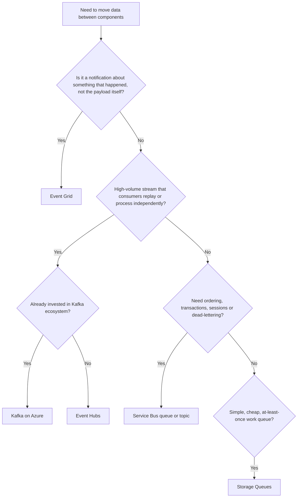

Every Azure system design round eventually asks "how do these two services talk to each other", and the honest answer is almost never "call it directly". This page is the decision framework for picking a messaging service and the language to justify it under follow-up questions.

## The four shapes of "messaging"

Azure's messaging options are not five flavours of the same thing — they solve four different problems.

- **Brokered queue** (Storage Queues, Service Bus queues) — one message, one consumer, work is removed once processed.
- **Brokered pub/sub** (Service Bus topics/subscriptions) — one message, many independent subscribers, each gets its own copy with its own filter.
- **Event notification** (Event Grid) — "something happened", pushed at low latency, HTTP-native, not meant to carry the full payload.
- **Event streaming / log** (Event Hubs, Kafka on Azure) — an ordered, replayable, retained log that many consumers can read at their own pace and rewind.

> [!KEY]
> Queues *distribute work*, pub/sub and Event Grid *notify*, and Event Hubs/Kafka *stream a durable log*. Naming which of the four you need is 80% of the design answer.

## Comparison table

| Dimension | Service Bus | Event Hubs | Event Grid | Storage Queues | Kafka on Azure (HDInsight / Confluent) |
|---|---|---|---|---|---|
| Model | Broker (queue + pub/sub) | Partitioned log | Push event router | Simple broker queue | Partitioned log |
| Ordering | FIFO within a session | Guaranteed per partition | Not guaranteed | Not guaranteed | Guaranteed per partition |
| Delivery guarantee | At-least-once (dedup available) | At-least-once | At-least-once (retries + DLQ) | At-least-once | At-least-once (exactly-once with transactions) |
| Retention | Until consumed (up to 14 days idle) | Time-based, 1–90 days, replayable | Not stored — retried up to 24h then dropped | Up to 7 days (unbounded with base64 tricks) | Time/size-based, replayable, can be indefinite |
| Throughput | Moderate (thousands msg/s per unit) | Very high (MB/s per partition unit) | Very high, millions of events/day | Moderate, high with sharding | Very high, scales with brokers/partitions |
| Max message size | 256 KB (1 MB premium) | 1 MB | 1 MB (event data) | 64 KB (base64, ~48 KB effective) | Configurable, MBs |
| Dead-lettering | Native DLQ per queue/subscription | None built-in (roll your own) | Native dead-letter destination | None built-in | None built-in (manual DLQ topic) |
| Filtering | SQL/correlation filters per subscription | None (consumer filters) | Advanced JSON-path filters at source | None | Consumer-side filtering |
| Cost shape | Per-unit (Standard/Premium tiers) | Per throughput unit + ingress | Per million operations, cheap | Per operation, very cheap | Cluster/infra cost, always-on |
| Typical use case | Order processing, transactional workflows | Telemetry, IoT, log ingestion | Reacting to resource/blob/custom events | Simple background job queue | Cross-platform streaming, existing Kafka estate |

> [!TIP]
> If the interviewer says "guaranteed ordering and exactly-once processing for financial transactions", the answer is Service Bus sessions with duplicate detection — not Event Hubs. If they say "a million sensors per second", Event Hubs or Kafka, not Service Bus.

## Decision flowchart



## Scenario walkthroughs

**Order processing.** A customer places an order; payment, inventory reservation and shipping must happen in a strict, recoverable sequence, and duplicate orders must never double-charge. Use **Service Bus** with sessions keyed on order ID for ordering, duplicate detection for idempotency, and a dead-letter queue for orders that fail validation after retries. A topic with subscriptions lets payment, inventory and shipping each get an independent copy filtered by order type.

**Telemetry ingestion.** Ten thousand IoT devices each send a reading every second. No single reading matters much, but the aggregate rate is huge and multiple downstream systems (hot path alerting, cold path storage) need to read the same stream independently. Use **Event Hubs**: partition by device ID so a device's readings stay ordered, use the Capture feature to land raw data in Blob Storage for free, and let Stream Analytics or a Functions consumer group process the hot path.

**Resource change reactions.** A blob lands in storage and three independent systems need to react — a thumbnail generator, an audit log writer, and a search indexer. This is not high-throughput data movement, it is "tell interested parties this happened". Use **Event Grid**: the blob create event fires once, Event Grid fans it out to three independent handlers (Functions, Logic Apps, webhook) with retry and dead-lettering per subscriber, and nobody has to poll storage.

**Fan-out notifications.** A single "order shipped" event must reach email, SMS, push notification and a partner webhook, each with different reliability needs and none of which should block the others. Use a **Service Bus topic** with one subscription per channel, each with its own filter and retry policy — or Event Grid if the payload is small and you want push-based HTTP delivery without managing subscriptions yourself.

**Work distribution.** A background job queue for resizing uploaded images — cheap, simple, at-least-once, no ordering requirement, thousands of jobs an hour. **Storage Queues** are the cheapest option and integrate trivially with Azure Functions queue triggers; reaching for Service Bus here is over-engineering unless you also need sessions or dead-lettering.

## What interviewers want to hear when you justify a choice

State the reasoning as a short chain, not a memorised fact:

1. **What is the delivery guarantee I actually need** — ordering, exactly-once, at-least-once?
2. **What is the throughput and message size** — thousands/sec vs millions/sec, KB vs MB?
3. **Who are the consumers** — one worker pool (queue) or several independent systems (pub/sub or stream)?
4. **Do I need replay** — can a new consumer join later and read history? Only Event Hubs/Kafka give you this.
5. **What does failure handling look like** — do I need a dead-letter queue, or is "retry until success" enough?
6. **What's the cost and operational shape** — always-on cluster vs consumption-based, who manages scaling?

> [!WARNING]
> A common trap is picking Event Hubs "because it's fast" for a workload that actually needs strict per-message ordering across the whole stream, transactional dead-lettering, or request/response semantics — none of which Event Hubs gives you cleanly. Fast is not the only axis.

## Code sample: Service Bus vs Event Hubs send

```csharp
// Service Bus — queue send with session for ordering
await using var client = new ServiceBusClient(connectionString);
ServiceBusSender sender = client.CreateSender("orders");
var message = new ServiceBusMessage(BinaryData.FromObjectAsJson(order))
{
    SessionId = order.OrderId,          // guarantees FIFO per order
    MessageId = order.OrderId           // enables duplicate detection
};
await sender.SendMessageAsync(message);

// Event Hubs — batch send partitioned by device
await using var producer = new EventHubProducerClient(ehConnectionString, "telemetry");
using EventDataBatch batch = await producer.CreateBatchAsync(
    new CreateBatchOptions { PartitionKey = reading.DeviceId });
batch.TryAdd(new EventData(BinaryData.FromObjectAsJson(reading)));
await producer.SendAsync(batch);
```

## Cheat sheet

- Queue vs pub/sub vs log vs event router — name the shape before naming the product.
- Service Bus = ordering, transactions, sessions, dead-lettering, moderate throughput.
- Event Hubs / Kafka = massive throughput, partition-ordered, replayable log.
- Event Grid = "this happened", push delivery, filtering at the source, not for payload-heavy data.
- Storage Queues = cheapest, simplest, no ordering or dead-lettering guarantees out of the box.
- Replay/rewind is only native to Event Hubs and Kafka.
- Max message size shrinks the further "up the throughput ladder" you go: Storage Queues (64 KB) < Service Bus (256 KB–1 MB) < Event Hubs/Event Grid (1 MB).
- Cost shape: per-operation (Storage Queues) vs per-unit (Service Bus/Event Hubs) vs always-on cluster (Kafka).
- Dead-lettering is native in Service Bus and Event Grid, absent in Event Hubs and Storage Queues.

## Common mistakes

| Mistake | Fix |
|---|---|
| Using Event Hubs for strict cross-stream ordering | Ordering is only guaranteed per partition — pick a partition key that matches your ordering unit |
| Using Service Bus for millions of events/second | Service Bus throughput per unit is far lower than Event Hubs; scale-out adds operational cost fast |
| Expecting Event Grid to store or replay events | Event Grid retries for up to 24 hours then dead-letters or drops — it is not a log |
| Ignoring the 64 KB Storage Queue message cap | Store the payload in Blob Storage and queue a pointer instead |
| Treating "at-least-once" as "exactly-once" | Design consumers to be idempotent regardless of which service you pick |
| Choosing Kafka on Azure without an existing Kafka investment | Managing or paying for a cluster rarely beats Event Hubs' Kafka-compatible endpoint for greenfield work |

## Summary

The choice is rarely about raw performance — it is about which delivery guarantee, ordering model and replay capability the workload actually needs. Queues distribute discrete units of work, pub/sub and Event Grid notify multiple independent parties, and Event Hubs/Kafka give you a durable, replayable, partition-ordered stream. State the requirement first ("I need exactly-once, ordered, transactional processing" or "I need a million events a second fanned out to three readers"), then name the service — that order of reasoning is what separates a memorised answer from an engineered one.

## Top Interview Questions

### Q1. What is the fundamental difference between Service Bus and Event Hubs?

Service Bus is a **brokered message queue/pub-sub system** built for enterprise messaging: it guarantees at-least-once delivery, supports transactions, sessions for strict ordering, duplicate detection and native dead-lettering, but at moderate throughput (thousands of messages/second per unit) and small message counts retained until consumed. Event Hubs is a **partitioned, append-only log** built for high-throughput ingestion: it can absorb millions of events per second, retains data for a configurable window regardless of whether it has been read, and lets multiple independent consumer groups replay the same stream from any offset. The mental shortcut: Service Bus moves and completes discrete units of work; Event Hubs is a firehose you can tap into and rewind.

### Q2. When would you choose Event Grid over Event Hubs?

Event Grid is for **event notification**, not event streaming. Choose it when you need to react to something that happened — a blob was created, a resource was provisioned, a custom app event fired — and want push-based delivery to many independent handlers with per-subscriber filtering, retry policy and dead-lettering, at very low latency (sub-second) and near-zero cost per event. Choose Event Hubs instead when the payload itself is the valuable data at high volume and consumers need to process it in order, replay history, or run analytics over the stream. A rule of thumb: Event Grid carries "a blob named X was created"; Event Hubs carries the actual sensor readings.

### Q3. How does Service Bus guarantee ordering, and what's the catch?

Ordering is guaranteed only within a **session** — messages sharing the same `SessionId` are delivered strictly in the order they were sent, and only one consumer processes a given session's messages at a time (session locking). Without sessions, Service Bus makes no ordering guarantee across the whole queue, especially with multiple concurrent receivers. The catch: sessions add complexity (you must enable them on the queue up front and structure receivers around `AcceptNextSessionAsync`), and if one session has a poison message, that session's processing stalls while other sessions continue — you need per-session timeout and dead-letter handling to avoid head-of-line blocking within that session.

### Q4. Event Hubs claims ordering — how is that actually scoped?

Ordering in Event Hubs is guaranteed **per partition only**, not across the whole event hub. Every event is assigned a partition, either explicitly via a partition key (all events with the same key land in the same partition, in send order) or round-robin if no key is given. A consumer reading a single partition sees strict order; a consumer aggregating across partitions sees interleaved order and must reconcile it (e.g. via an event timestamp or sequence number) if global order matters. This is why choosing the partition key is a modeling decision: pick the entity whose internal order actually matters — a device ID, a tenant ID, an order ID — not something that spreads too thin or too unevenly.

### Q5. What does "at-least-once" delivery mean in practice, and how do you handle it?

At-least-once means a message may be delivered and processed more than once — after a crash, a network blip, or a lock renewal failure, the broker will redeliver a message it isn't sure was completed. None of Azure's brokered services except Service Bus (via `MessageId`-based duplicate detection, which only dedups within a configurable time window) give you built-in exactly-once semantics. The production answer is to make consumers **idempotent**: use the message's unique ID to check-and-set a "processed" record before acting, use idempotent database operations (upserts, conditional writes), or design side effects (like sending an email) to tolerate duplicates via a dedup table.

### Q6. Your Event Hubs consumer is falling behind during traffic spikes — what do you check and fix?

First check partition count and throughput units (or processing units on the dedicated/premium tiers) — a single partition caps out at roughly 1 MB/s or 1,000 events/s ingress, and if your partition key concentrates traffic on a few partitions, adding partitions alone won't help. Check consumer-side: is a single consumer group instance processing serially, or are you using the Event Processor Client to parallelize across partitions with one worker per partition (or more workers than partitions, which wastes capacity)? Also check checkpointing frequency — checkpointing too often adds storage-account overhead; too rarely means large reprocessing windows on restart. The fix is usually some combination of increasing throughput/processing units, adding partitions with a better key, and scaling out consumer instances to match partition count.

### Q7. How would you design fan-out to five independent downstream systems from one event?

Use a **Service Bus topic** with one subscription per downstream system, each with its own SQL filter if systems only care about a subset of events, its own dead-letter queue, and its own retry/lock-duration policy — so a slow or failing subscriber never blocks the others. Alternatively, if the downstream systems are HTTP endpoints and you don't need transactional guarantees or message-level filtering beyond simple JSON-path rules, Event Grid gives the same fan-out with less operational overhead and near-zero cost per event, at the price of a much smaller message size limit and no long-term retry window beyond 24 hours.

### Q8. Why would a team choose Kafka on Azure instead of Event Hubs, given Event Hubs has a Kafka-compatible endpoint?

Mostly organizational, not technical: an existing on-prem or multi-cloud Kafka investment (schema registry, Kafka Streams/ksqlDB topologies, Kafka Connect connectors, existing operational tooling) is expensive to re-platform, so running Kafka on HDInsight or using Confluent Cloud on Azure preserves that tooling. Technically, self-managed or Confluent Kafka gives finer control over retention, compaction, exactly-once transactions across producer/consumer, and tiered storage options that Event Hubs' standard tier doesn't expose. The trade-off is real operational cost: cluster capacity planning, broker patching, and rebalancing are your responsibility (or your vendor's), versus Event Hubs being a fully managed PaaS service you scale by throughput units.

### Q9. A message keeps failing and clogging your Service Bus queue — walk through your production response.

Service Bus auto-dead-letters a message after `MaxDeliveryCount` is exceeded (default 10), so first check the dead-letter queue rather than the main queue — the "clog" symptom usually means delivery count hasn't yet been exhausted, or the message is inside a session that's now stuck. I'd inspect the message's delivery count and exception history (if logged), check whether the failure is transient (external dependency down — let retries continue) or permanent (malformed payload — should be dead-lettered faster by explicitly abandoning with a reason, or completing after logging). Long term, I'd add a circuit breaker so a downstream outage doesn't burn through all delivery attempts on every message simultaneously, and alert on dead-letter queue depth rather than only on the main queue.

### Q10. How do Storage Queues differ from Service Bus queues, and when is the cheaper option the wrong choice?

Storage Queues are part of a general-purpose storage account: extremely cheap (fractions of a cent per 10,000 operations), simple REST/SDK API, at-least-once delivery, up to 7 days visibility timeout window, but no ordering guarantee, no sessions, no native dead-lettering (you track delivery count via the message's dequeue count yourself), no filtering, and a 64 KB message size limit. They're the right choice for simple, high-volume, loosely-coupled background work — thumbnail generation, log processing — where losing a message occasionally to a bug is recoverable and there's no cross-message relationship. They're the wrong choice the moment you need ordering, transactional semantics, duplicate detection, or automatic dead-lettering — reaching for Service Bus there saves you from re-implementing those features badly on top of a primitive queue.

### Q11. How do you handle poison messages across these services?

In Service Bus, a message is automatically moved to the dead-letter sub-queue after `MaxDeliveryCount` deliveries, or you can explicitly dead-letter it with a reason string for observability; consumers should then alert on DLQ depth and provide a replay tool. In Event Grid, failed deliveries are retried with exponential backoff up to a configurable window (default 24 hours, up to 30 days), after which the event goes to a configured dead-letter storage location if set, or is dropped. In Event Hubs and Storage Queues there's no built-in poison message concept: you must track a per-message retry/dequeue count yourself (Storage Queues expose `DequeueCount` natively) and manually move consistently failing items to a separate "quarantine" queue or table after a threshold.

### Q12. If an interviewer asks "why not just use a database table as a queue", what's the strong answer?

A database-as-queue works for very low volume but breaks down under concurrency and scale: you need `SELECT ... FOR UPDATE SKIP LOCKED`-style tricks to avoid two workers picking up the same row, polling adds latency and load, there's no native visibility timeout/lease renewal for long-running work, no partition-based throughput scaling, and you're paying database IOPS for what is fundamentally a different access pattern (write-once, read-once, delete). Purpose-built queues give you push-based or efficient long-polling consumption, automatic lease/lock management with renewal, built-in retry and dead-lettering, and throughput that scales independently of your transactional database — freeing the database to do what it's good at.
