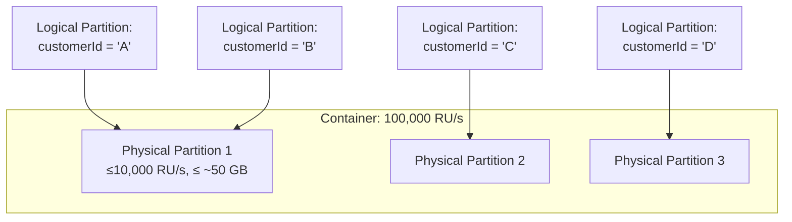

Partitioning is the single most consequential design decision in Cosmos DB — get it wrong and no amount of RU/s or clever indexing will save you from throttling and hot partitions. This page covers the logical/physical partition model, how to pick a partition key, and how to reason about Request Unit cost like someone who has actually been paged for a 429 storm.

## Logical vs physical partitions

A **logical partition** is every item sharing the same partition key value — Cosmos guarantees all of a logical partition's data lives together on one physical partition and can be queried/transacted together. A **physical partition** is the actual replicated compute+storage unit Cosmos manages behind the scenes; you never address it directly, but its two hard limits shape every partitioning decision:

| Limit | Value | Consequence |
|---|---|---|
| Max storage per **logical partition** | 20 GB | A partition key value that accumulates unbounded data (e.g. "tenantId" for a huge tenant) will eventually hit a hard write failure |
| Max throughput per **physical partition** | 10,000 RU/s | A container provisioned at 100,000 RU/s still has that split across roughly 10 physical partitions — no single partition key's traffic can exceed 10,000 RU/s no matter the container total |



> [!KEY]
> Physical partitions are Cosmos's internal scaling unit; **you only ever choose the logical partition key**, and Cosmos maps many logical partitions onto each physical partition, splitting physical partitions automatically as storage or throughput demands grow.

## Choosing a partition key

The three properties to check, in order:

1. **High cardinality** — many distinct values, so traffic and storage spread across many logical (and therefore physical) partitions.
2. **Even distribution** — no single value dominates request volume or storage; a celebrity user, a huge tenant, or "status" with three possible values all make bad keys.
3. **Present in most queries' filter** — queries that include the partition key in `WHERE` become single-partition, avoiding an expensive fan-out.

| Candidate key | Cardinality | Distribution | In most queries? | Verdict |
|---|---|---|---|---|
| `customerId` on an orders container | High | Usually even | Yes, most order queries are per-customer | ✅ Good default |
| `status` (e.g. "pending"/"shipped"/"delivered") | Very low | Skewed (most orders "delivered") | Sometimes | ❌ Hot partitions guaranteed |
| `tenantId` with a few huge tenants | Medium | Skewed toward big tenants | Yes | ⚠️ Risk of a 20 GB/10,000 RU/s ceiling on big tenants |
| `orderId` (unique per item) | Very high | Even | No — most queries filter by customer, not order | ⚠️ Great distribution, but every customer query becomes cross-partition |

> [!TIP]
> A senior answer names the tension explicitly: "I want high cardinality for distribution, but the key also has to appear in my dominant query pattern, or I trade hot partitions for cross-partition fan-out on every read." That's the actual trade-off interviewers are probing for.

## Synthetic and hierarchical partition keys

When no single property is both high-cardinality and query-aligned, combine properties:

- **Synthetic key** — concatenate fields into one string, e.g. `tenantId_deviceId`, giving finer-grained distribution than `tenantId` alone while still supporting tenant-scoped queries via a prefix or a secondary lookup.
- **Hierarchical partition keys** (up to 3 levels, e.g. `/tenantId`, `/userId`, `/sessionId`) — let Cosmos treat each level as part of the physical partitioning without you concatenating strings manually; queries scoped to just `/tenantId` still avoid a full fan-out because Cosmos can prune to the relevant sub-partitions, and it solves the "one big tenant" problem because that tenant's data now spreads across multiple physical partitions by `userId`.

```csharp
// Container creation with a hierarchical partition key
ContainerProperties props = new ContainerProperties(
    id: "events",
    partitionKeyPaths: new List<string> { "/tenantId", "/userId", "/sessionId" });
await database.CreateContainerAsync(props, throughput: 10000);
```

## Hot partitions — symptoms, detection, remedies

A **hot partition** is a physical partition receiving disproportionate traffic relative to its share of total RU/s, so it throttles while the container's aggregate RU/s utilisation looks fine.

| Symptom | Detection | Remedy |
|---|---|---|
| 429s despite low overall RU consumption | Azure Monitor metric "Normalized RU Consumption" split by **PartitionKeyRangeId** shows one range near 100% while others are idle | Pick a higher-cardinality/better-distributed partition key; may require re-modelling and a data migration |
| One partition key value dominates writes | Query the `PartitionKeyStatistics` / use the "Partition Key" insights in the Data Explorer metrics tab | Introduce a synthetic key to spread that value's data across sub-buckets |
| A logical partition approaching 20 GB | Storage metric per partition key range, or proactive size estimate at design time | Split the entity by a secondary dimension (time bucket, sub-tenant) before hitting the ceiling |

> [!DANGER]
> Increasing container-level RU/s does **not** fix a hot partition — RU/s is provisioned per container but enforced per physical partition. Doubling a container from 50,000 to 100,000 RU/s just gives the hot physical partition a higher share of a bigger pool if the split lands unevenly; it does not raise its individual 10,000 RU/s ceiling.

## RU cost by operation type

| Operation | Typical RU cost (1 KB item, few indexed properties) | Why |
|---|---|---|
| Point read (by id + partition key) | ~1 RU | Direct lookup, no index scan |
| Point write (insert) | ~5–10 RU | Data write + index updates for every indexed path |
| Point write (replace/update) | ~7–15 RU | Old + new index entries, larger if many properties change |
| Single-partition query (equality on partition key) | ~2.5+ RU, scales with items scanned/returned | Index seek plus per-item RU |
| Cross-partition query (no partition key filter) | Sum of per-partition RU × number of physical partitions fanned out to | Query executes against every partition, results merged by the gateway |
| Stored procedure / transactional batch | Sum of RU for each operation inside, plus small overhead | Still bound to a single logical partition key |

> [!WARNING]
> A query "feels the same" whether it's single-partition or cross-partition from the code, but the RU bill is wildly different — a cross-partition fan-out against a 20-physical-partition container can cost 20x a single-partition equivalent. Always check `x-ms-request-charge` / `RequestCharge` during load testing, not just correctness.

## Why a 100,000 RU/s container can still throttle

RU/s is provisioned at the container level but **enforced per physical partition**, split roughly evenly by Cosmos based on partition count (e.g. 100,000 RU/s across 10 physical partitions ≈ 10,000 RU/s each). If your partition key concentrates traffic — one tenant, one status value, one "hot" customer — that logical partition's physical partition throttles at its local share long before the container's aggregate RU/s is exhausted. This is the single most common production Cosmos incident: dashboards show "container at 40% RU utilisation" while the application sees a wall of 429s, because the utilisation metric is an aggregate average, not per-partition.

## 429s, Retry-After, and SDK retry policy

A `429 (Too Many Requests)` response includes an `x-ms-retry-after-ms` header telling the client how long to back off. The official SDKs retry automatically by default (`RetryOptions.MaxRetryAttemptsOnThrottledRequests`, default 9, and `MaxRetryWaitTimeInSeconds`), but production systems should still:

- Monitor 429 **rate**, not just count — a rising rate against flat traffic is a leading indicator of an emerging hot partition.
- Set retry limits deliberately: too many silent retries can turn a brief blip into multi-second latency spikes for the caller.
- Consider request-level priority (priority-based execution, a newer Cosmos feature) so low-priority batch work backs off before user-facing traffic does.

```csharp
CosmosClientOptions options = new()
{
    MaxRetryAttemptsOnRateLimitedRequests = 9,
    MaxRetryWaitTimeOnRateLimitedRequests = TimeSpan.FromSeconds(30)
};
var client = new CosmosClient(connectionString, options);
```

## Estimating RUs before you ship

1. Model realistic item shapes and typical operation mix (reads : writes : queries).
2. Use the Cosmos DB **capacity calculator** or run representative operations against a test container and read `RequestCharge` off real responses — never guess from documentation averages alone, since indexing policy and item shape change the numbers materially.
3. Load test at expected peak concurrency and watch **per-partition** RU consumption, not just the container aggregate, to catch skew before production.

## Cheat sheet

- **Logical partition** = all items sharing a partition key value; capped at **20 GB**.
- **Physical partition** = Cosmos-managed scaling unit; capped at **10,000 RU/s**; you never choose it directly.
- Good partition key = high cardinality + even distribution + present in the dominant query filter.
- Low-cardinality or skewed keys (status, boolean flags, small enums) → guaranteed hot partitions.
- **Synthetic keys** concatenate fields; **hierarchical partition keys** (up to 3 levels) do the same natively without a new re-migration cost every time you split further.
- Container RU/s is enforced **per physical partition**, not as a shared pool — a big container can still throttle on one hot key.
- Point read ≈ 1 RU; writes cost more (index updates); cross-partition queries cost roughly (per-partition RU) × (partitions fanned out to).
- 429 responses carry `x-ms-retry-after-ms`; SDKs retry automatically but tune the limits deliberately.
- Detect hot partitions via the **Normalized RU Consumption by PartitionKeyRangeId** metric, not container-level RU utilisation.

## Common mistakes

| Mistake | Fix |
|---|---|
| Choosing partition key purely for even distribution, ignoring query patterns | Balance cardinality/distribution against "appears in most queries" |
| Raising container RU/s to fix throttling without checking per-partition metrics | Check Normalized RU Consumption by partition range first |
| Using a low-cardinality field like `status` or `country` as partition key | Use a high-cardinality field, or a synthetic/hierarchical key combining it with something finer |
| Assuming 429 retries are "free" | Excess retries add latency; monitor 429 rate as a leading indicator, not just an error count |
| Not checking `RequestCharge` during load tests | Instrument every response; cross-partition queries can be an order of magnitude more expensive |
| Letting one tenant's logical partition approach 20 GB unnoticed | Alert on per-partition storage; pre-plan a synthetic key for large tenants |

## Summary

Cosmos DB scales by splitting data across physical partitions, but you only ever control the logical partition key — so its cardinality, distribution and alignment with your dominant query pattern determine whether that scaling actually helps you or quietly creates a hot partition. RU/s is enforced per physical partition, not shared evenly across a container's aggregate number, which is why "just add more RU/s" is not always the fix for throttling. Treat partition key selection as a modelling decision made once and expensive to change, back it with real RU measurements from load tests, and monitor per-partition metrics — not container averages — to catch hot partitions before customers do.

## Top Interview Questions

### Q1. What is the difference between a logical and a physical partition in Cosmos DB?

A logical partition is the set of all items sharing the same partition key value — Cosmos guarantees it's stored contiguously and can be queried or transacted as a unit, and it's capped at 20 GB. A physical partition is the actual replicated resource (compute + storage + throughput) that Cosmos manages internally; each physical partition holds many logical partitions and is capped at 10,000 RU/s. You never choose or address a physical partition directly — you only choose the partition key path, and Cosmos decides how logical partitions map onto physical partitions, splitting them automatically as storage or throughput requirements grow. The key exam point: RU/s limits are enforced at the physical partition level, so container-level RU/s is really "roughly divided across however many physical partitions currently exist".

### Q2. How do you choose a good partition key?

Check three properties in order: high cardinality (many distinct values, so data and traffic spread widely), even distribution (no value dominates volume — a single huge tenant or common status value creates a hot partition), and presence in the dominant query filter (queries that include the partition key become efficient single-partition operations; queries that don't must fan out across every physical partition). The hard part is that these can conflict — `orderId` has perfect cardinality and distribution but is useless if queries filter by customer, while `customerId` aligns with queries but might skew for a whale customer. When no single field satisfies all three, combine fields into a synthetic key or use a hierarchical partition key.

### Q3. Why can a container provisioned at 100,000 RU/s still throttle with 429s?

Because RU/s is enforced per physical partition, not as one shared pool across the container. Cosmos splits a container's total RU/s roughly evenly across its physical partitions — a 100,000 RU/s container with 10 physical partitions gives each partition about 10,000 RU/s. If the partition key concentrates traffic onto a small number of logical partitions that all map to the same physical partition, that physical partition can hit its local ceiling and start returning 429s, even while the container's aggregate RU utilisation dashboard shows plenty of headroom. This is why diagnosing throttling requires the "Normalized RU Consumption by PartitionKeyRangeId" metric, not the container-level average — and why simply raising provisioned RU/s often doesn't fix a genuinely hot partition.

### Q4. What are synthetic and hierarchical partition keys, and when would you use them?

Both address the case where no single property is simultaneously high-cardinality, evenly distributed, and aligned with your queries. A synthetic key concatenates two or more properties into one string value — e.g. `tenantId_deviceId` — so that a container partitioned only by `tenantId` (which might have a few huge tenants) instead spreads each tenant's data across many finer-grained logical partitions. Hierarchical partition keys (available on the NoSQL API, up to three levels, e.g. `/tenantId`, `/userId`, `/sessionId`) achieve the same effect without manual string concatenation — Cosmos treats each level as part of the partitioning scheme, and queries scoped to just the first level or two can still avoid a full cross-partition fan-out because Cosmos prunes to matching sub-partitions.

### Q5. What's the RU cost difference between a point read and a cross-partition query, and why does it matter?

A point read (by id and partition key) is the cheapest possible operation — roughly 1 RU for a small item, because it's a direct index lookup with no scanning. A cross-partition query (one that doesn't filter on the partition key) must fan out to every physical partition, run the query logic on each, and merge results at the gateway — its cost is roughly the sum of per-partition RU charges across however many physical partitions the container currently has, which grows as the container scales out. This matters because code that "just adds a query without a partition key filter" can look identical in a code review to an efficient one, but its RU bill — and hence cost and throttling risk — scales with container size in a way a point read never does. Always check the actual request charge, not just correctness, when reviewing query patterns.

### Q6. Your monitoring shows overall container RU utilisation at 40%, but the application is seeing frequent 429s. What do you investigate?

This is the textbook hot-partition signature — aggregate utilisation hides per-partition skew. I'd pull the "Normalized RU Consumption by PartitionKeyRangeId" metric in Azure Monitor to see if one or a few physical partitions are near 100% while others sit idle. If confirmed, I'd next check which partition key values map to the hot range — often a single large tenant, a popular status value, or a "global" key like a fixed string used for a counter/singleton pattern. The fix isn't raising container RU/s (that just grows an unevenly-split pool); it's re-modelling the partition key — adding a synthetic suffix, moving to a hierarchical key, or splitting the offending entity type into its own container with a better key — followed by a data migration via the change feed or a bulk copy tool.

### Q7. How does the Cosmos SDK handle 429 responses by default, and how would you tune it for production?

A 429 response includes an `x-ms-retry-after-ms` header specifying the server's suggested backoff. The .NET/Java SDKs retry automatically by default, governed by `MaxRetryAttemptsOnRateLimitedRequests` (default 9) and `MaxRetryWaitTimeOnRateLimitedRequests`, so a moderate throttling blip is often invisible to application code. In production I'd tune these deliberately rather than trust defaults blindly: cap max retry wait time so a struggling partition doesn't turn into multi-second latency for a user-facing request, monitor the **rate** of 429s (even retried-away ones) as a leading indicator of a developing hot partition, and for background/batch workloads consider Cosmos's priority-based execution so low-priority work backs off before customer-facing traffic is affected.

### Q8. Why is a low-cardinality field like `status` or `orderType` almost always a bad partition key?

Because a field with only a handful of distinct values (say, 3–5 order statuses) means all items with the most common value — typically the vast majority of records over time, like "delivered" — collapse into one logical partition, which is capped at both 20 GB of storage and whatever slice of throughput its physical partition gets. Every write or query hitting that dominant value concentrates load onto a single physical partition regardless of how much total RU/s the container has, guaranteeing a hot partition as data grows. It's a common trap because `status` genuinely does appear in many query filters, which makes it feel like a good choice by the "present in queries" heuristic alone — but cardinality and distribution have to hold too, so `status` is usually better as a secondary filter combined with a high-cardinality field, not the partition key itself.

### Q9. How would you estimate the RU/s a new container needs before launch?

Start with realistic assumptions about operation mix and volume — expected reads/sec, writes/sec, and typical item size/shape, including how many properties are indexed since indexing directly drives write RU cost. I'd then either use Cosmos's capacity/RU calculator for an initial ballpark, or better, stand up a representative container with production-like indexing policy and item shapes, run the real operations from application code (not synthetic benchmarks), and read the actual `RequestCharge` off SDK responses rather than trusting published averages — because item size, property count, and indexing policy all shift the real numbers. I'd load test at expected peak concurrency and specifically watch per-partition RU consumption rather than only the container aggregate, since that's the only way to catch a skewed partition key before it becomes a production incident.

### Q10. A single tenant's data is approaching the 20 GB logical partition limit — what are your options?

First, confirm this is actually the partition key by checking whether `tenantId` alone is the partition key path — if so, this tenant's logical partition is a single, non-splittable unit and further growth will start failing writes once the limit is hit. The fix requires a re-modelling: introduce a synthetic key that combines `tenantId` with another dimension specific to that tenant's data (a date bucket, a sub-entity ID, a shard number derived by hashing a secondary field), or migrate to a hierarchical partition key with `tenantId` as the first level and a finer-grained field as the second. Either path requires a data migration — typically via the change feed to backfill a new container with the new partition key scheme — and cannot be done as an in-place container property change, so the earlier this is caught via per-partition storage monitoring, the cheaper the fix.

### Q11. What's the RU cost difference between an insert and an update, and why do writes cost more than reads?

Both cost noticeably more than a comparable point read — typically 5-15+ RU versus ~1 RU — because a write must persist the document itself and then update every index entry for every indexed property path (by default, all paths are indexed unless you've customised the indexing policy). An insert writes fresh index entries for the whole document; an update (replace) typically costs a bit more because Cosmos must remove stale index entries for changed properties and add new ones, on top of the base document write, and the cost scales with how many indexed properties actually changed and how large the document is. This is one of the practical levers for reducing RU spend: narrowing the indexing policy to exclude paths that are never queried directly reduces the per-write RU cost significantly, sometimes by 30–50% on write-heavy containers.

### Q12. Design the partition key for a multi-tenant SaaS "activity log" container where tenants vary wildly in size and queries are almost always scoped to one tenant and a date range.

I'd avoid a plain `tenantId` partition key because a handful of large tenants would create hot, storage-capped partitions while most small tenants sit nearly empty on shared physical partitions. Instead I'd use a hierarchical partition key of `/tenantId`, `/yearMonth` (a coarse date bucket) — this keeps queries scoped to a tenant and date range efficient (Cosmos can prune to the matching sub-partitions without a full fan-out), naturally caps each logical partition's growth to roughly one tenant-month of data well under 20 GB even for large tenants, and spreads big tenants' data across many physical partitions over time instead of concentrating it. I'd validate the date bucket granularity (month vs week) against actual per-tenant write volume during load testing, since too coarse a bucket recreates the hot/oversized partition problem for the very largest tenants.
