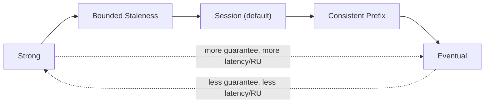
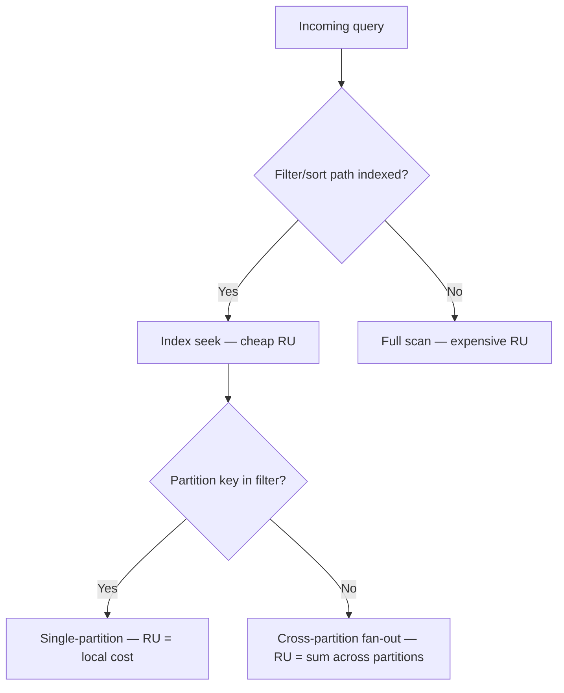

Consistency and indexing are the two Cosmos DB knobs that most directly trade RU cost against correctness and query speed, and interviewers use them to check whether you actually operated Cosmos or just read the docs once. This page covers the five consistency levels, session tokens, and how the automatic indexing policy shapes both query performance and your write bill.

## The five consistency levels

Cosmos DB is unusual among databases in offering five distinct, well-defined consistency levels, chosen per account (with per-request override) rather than forcing a single global trade-off.

| Level | Guarantee | Read latency | Availability | RU cost (reads) |
|---|---|---|---|---|
| **Strong** | Linearizable — reads always see the latest committed write | Highest | Lowest (no reads during a region failure without failover) | Highest |
| **Bounded staleness** | Reads lag writes by at most *K* versions or *T* time, configurable | Low-to-moderate | High | Moderate |
| **Session** (default) | Within one client session, always read your own writes (monotonic reads/writes) | Low | High | Low |
| **Consistent prefix** | Reads never see out-of-order writes (no gaps), but may be stale | Low | High | Low |
| **Eventual** | No ordering guarantee at all; eventually converges | Lowest | Highest | Lowest |



> [!KEY]
> Only **strong** and **bounded staleness** are "global" guarantees enforced across all replicas; **session**, **consistent prefix**, and **eventual** are progressively weaker but far cheaper and more available, especially across multi-region writes.

## Why session is the default, and what a session token is

Session consistency gives the single most useful guarantee for typical application code — **read-your-own-writes** — at close to eventual-consistency cost and latency. It works via a **session token**: a client-side vector clock-like value returned on every write, which the SDK automatically attaches to subsequent reads from that same client session so Cosmos can guarantee those reads see at least that write, even if routed to a different replica. This makes session consistency ideal for the common "user submits a form, then immediately reloads the page and expects to see their own change" pattern without paying strong consistency's global coordination cost.

```csharp
// Session tokens are handled automatically within one CosmosClient instance,
// but you can capture and pass one explicitly across processes/requests if needed
ItemResponse<Order> writeResponse = await container.CreateItemAsync(order, new PartitionKey(order.CustomerId));
string sessionToken = writeResponse.Headers.Session;

// Later, on a different client/process, pass it to guarantee read-your-write
var requestOptions = new ItemRequestOptions { SessionToken = sessionToken };
ItemResponse<Order> readResponse = await container.ReadItemAsync<Order>(
    order.Id, new PartitionKey(order.CustomerId), requestOptions);
```

> [!TIP]
> If asked "why not always use strong consistency", the strong answer names the cost explicitly: strong consistency requires synchronous replication/quorum across regions, so it increases write and read latency, reduces availability during network partitions, and is only available for single-region or bounded multi-region write topologies — not general multi-write scenarios.

## Per-request consistency override

The account-level default (usually session) can be **weakened but not strengthened** per individual request — you can ask for eventual consistency on a specific read for lower cost/latency even if the account default is session or bounded staleness, but you cannot ask for strong consistency on a request if the account default is weaker.

```csharp
var options = new QueryRequestOptions { ConsistencyLevel = ConsistencyLevel.Eventual };
var iterator = container.GetItemQueryIterator<Order>(query, requestOptions: options);
```

> [!WARNING]
> A common interview trap: assuming you can request stronger consistency per-call than the account default. You cannot — the account-level setting is the ceiling; per-request options can only relax it.

## The automatic indexing policy

By default, Cosmos indexes **every property of every item** automatically, with no schema required — this is what makes ad-hoc queries "just work" without manual index management, but it means every write pays the RU cost of updating every property's index entry.

| Concept | Purpose |
|---|---|
| **Included paths** | Paths explicitly indexed (default `/*`, everything) |
| **Excluded paths** | Paths explicitly skipped — cheapest lever to cut write RU cost |
| **Composite indexes** | Required for `ORDER BY` on two or more properties, or efficient filter+sort combos on multiple properties |
| **Spatial indexes** | Enable geospatial query functions (`ST_DISTANCE`, `ST_WITHIN`) on GeoJSON properties |

```json
{
  "indexingPolicy": {
    "indexingMode": "consistent",
    "includedPaths": [{ "path": "/*" }],
    "excludedPaths": [
      { "path": "/largePayload/*" },
      { "path": "/_etag/?" }
    ],
    "compositeIndexes": [
      [
        { "path": "/customerId", "order": "ascending" },
        { "path": "/orderDate", "order": "descending" }
      ]
    ]
  }
}
```

> [!DANGER]
> Forgetting a composite index is the classic cause of a query that works but throws `Order-by items are not supported unless a composite index is used` (or silently falls back to a much higher RU cost) once you sort by more than one field or combine a filter on one field with `ORDER BY` on another. Interviewers love to ask "why did this query suddenly get expensive after adding a second sort field".

## Cutting RU cost via indexing

Excluding rarely-queried, large, or write-heavy paths (large embedded blobs, verbose audit metadata, `_etag`) from indexing can reduce write RU cost by 20-50% on document-heavy containers, because Cosmos skips generating and maintaining index entries for those paths. The trade-off: any query that filters on an excluded path falls back to a full scan of the partition (or container, if cross-partition), which is dramatically more expensive per-query — so exclude only paths you are certain are never filtered or sorted on.

## RU cost by read/query shape

| Operation | Relative RU cost | Notes |
|---|---|---|
| Point read (id + partition key) | Baseline (~1 RU for 1 KB) | Direct index lookup, cheapest possible |
| Single-partition query, indexed filter | Low, scales with items matched | Efficient index seek |
| Single-partition query, `ORDER BY` on 2+ fields without composite index | High, or query rejected | Falls back to in-memory sort or fails |
| Cross-partition query | Sum across physical partitions fanned out to | Multiply single-partition cost by partition count roughly |
| Query on an excluded/unindexed path | Very high | Effectively a full scan |

Always inspect **query metrics** (`FeedResponse.RequestCharge`, and the more detailed `PopulateQueryMetrics` diagnostics) during development — they break down RU cost into index lookup, document load, and VM execution time, which tells you precisely whether a slow/expensive query is an indexing problem or a partitioning problem.



## Cheat sheet

- Five levels, strongest to weakest: **strong → bounded staleness → session (default) → consistent prefix → eventual**.
- Session gives **read-your-own-writes** via a session token, at near-eventual cost — the right default for most apps.
- Per-request consistency can only be **weakened**, never strengthened, relative to the account default.
- Cosmos indexes **every property by default** — no schema, but every write pays for it.
- **Excluded paths** are the main lever to cut write RU cost; exclude only paths never filtered/sorted on.
- **Composite indexes** are required for `ORDER BY` across multiple properties, or filter+sort combinations.
- **Spatial indexes** unlock `ST_DISTANCE` / `ST_WITHIN` geospatial queries.
- Cross-partition queries cost roughly (per-partition cost) × (partitions fanned out to) — always check `RequestCharge`.
- Query metrics break RU cost into index lookup, document load and VM execution — use them to diagnose, not guess.

## Common mistakes

| Mistake | Fix |
|---|---|
| Assuming per-request options can request stronger consistency than the account default | Account-level setting is a ceiling; only weakening is allowed per request |
| Always using strong consistency "to be safe" | Understand the latency/availability/RU cost; session covers the common read-your-writes need far more cheaply |
| Sorting by two fields without a composite index | Add the composite index proactively, or the query fails or gets very expensive |
| Excluding paths that are actually queried | Check real query filters before excluding — recheck after new features add new filters |
| Ignoring query metrics when a query feels slow/expensive | Pull `RequestCharge` and diagnostics to see if it's an indexing or partitioning problem |
| Treating indexing as "set once and forget" | Revisit the indexing policy as query patterns evolve; it's a live cost lever, not a one-time setup |

## Summary

Cosmos DB's consistency levels let you trade global correctness guarantees for latency, availability and RU cost on a sliding scale, with session consistency as the default because it cheaply solves the read-your-own-writes problem most applications actually have. The automatic indexing policy is the other major cost lever: everything is indexed by default for query flexibility, but excluding rarely-queried paths and adding composite indexes for multi-field sorts are the two concrete techniques to keep write and query RU costs under control. Being able to explain both — with the specific trade-off named, not just the feature — is what a genuinely experienced Cosmos answer sounds like.

## Top Interview Questions

### Q1. Name the five Cosmos DB consistency levels and rank them by guarantee strength.

From strongest to weakest: **strong** (linearizable — every read sees the latest committed write, globally), **bounded staleness** (reads lag writes by at most a configured number of versions or a time window), **session** (within one client session, guarantees read-your-own-writes and monotonic reads — the default), **consistent prefix** (reads never see writes out of order, but may be arbitrarily stale), and **eventual** (no ordering guarantee at all, cheapest and fastest). Each weaker level trades some correctness guarantee for lower latency, higher availability, and lower RU cost — strong consistency requires the most coordination across replicas and is the most expensive and least available under network partitions, while eventual is the cheapest and most available.

### Q2. Why is session consistency the default, and what problem does a session token solve?

Session consistency is the default because it cheaply solves the most common application requirement — a user should immediately see the effect of their own write — without paying for global linearizability. It works via a session token, effectively a logical version marker returned with every write; the SDK automatically attaches the latest session token to subsequent reads from the same client, and Cosmos guarantees those reads reflect at least that write, even if served from a different, possibly lagging replica. This gives "read-your-own-writes" and monotonic read/write guarantees at close to eventual-consistency latency and RU cost, which is why it's the right default for the vast majority of applications rather than paying strong consistency's cost for a guarantee most requests don't need.

### Q3. Can you request strong consistency on a single query if the account default is session?

No — per-request consistency overrides can only **weaken** the guarantee relative to the account-level default, never strengthen it. If the account is configured for session consistency, a request can ask for eventual consistency (to save latency/RU on a read that doesn't need read-your-own-writes), but it cannot ask for strong or bounded staleness, because the underlying replication topology and quorum behavior that make strong consistency possible are configured account-wide, not per query. If a particular workload genuinely needs strong consistency, the account itself must be configured that way, accepting the latency/availability/cost trade-off for all traffic (or you isolate that workload into a separate account).

### Q4. What is a composite index, and when do you need one?

A composite index is an index over an ordered combination of two or more properties, and it's required whenever a query does an `ORDER BY` across multiple properties, or combines a range/equality filter on one property with a sort on another, in a way the default per-property index can't satisfy efficiently. Without it, such a query either fails outright with an error about missing a composite index, or in some cases falls back to a far more expensive execution plan. You define composite indexes explicitly in the indexing policy as ordered path lists (e.g. `customerId` ascending then `orderDate` descending), matching the exact filter/sort pattern your query uses — they're not automatic like single-property indexing.

### Q5. How do you reduce the RU cost of writes to a container with a large indexing footprint?

The main lever is customising the indexing policy to **exclude paths** that are never used in query filters or sorts — by default Cosmos indexes every property of every item, and every indexed path adds RU cost to every write because the index entry must be created/updated. Common candidates for exclusion are large embedded blobs, verbose audit/metadata fields, or deeply nested objects that exist for storage but are never queried directly. This can cut write RU cost by a large margin on document-heavy containers, but the trade-off must be made carefully: any future query that filters on an excluded path falls back to an expensive full scan, so exclusions should be based on confirmed, stable query patterns, revisited whenever new features introduce new filters.

### Q6. A query that sorts by `orderDate` runs fine, but after adding a second `ORDER BY totalAmount`, it starts failing or costing far more RUs. Why, and how do you fix it?

Cosmos's default indexing policy handles single-property sorts efficiently via the automatic range index on each property, but sorting on two or more properties simultaneously requires a **composite index** explicitly covering that combination of properties in that order — the per-property indexes alone can't satisfy a multi-field sort efficiently. Without it, the query either throws an explicit error telling you a composite index is required, or executes with a much more expensive in-memory sort, depending on the SDK/engine version and query shape. The fix is to add a composite index entry in the indexing policy listing both properties in the exact order and direction used by the `ORDER BY` clause, then confirm via query metrics that the RU cost drops back to the expected range.

### Q7. What's the RU cost difference between a single-partition query and a cross-partition query, and how do you detect which one you're running?

A single-partition query — one whose filter includes an equality on the partition key — executes against exactly one physical partition and costs roughly what a normal index seek plus per-item retrieval costs. A cross-partition query, lacking a partition key filter, must fan out to every physical partition in the container, execute the query logic on each, and merge/re-sort results at the gateway, so its RU cost is roughly the sum of the per-partition costs across however many physical partitions currently exist — which silently grows as the container scales out over time. You detect this by inspecting the query's `RequestCharge` and diagnostics (`PopulateQueryMetrics`); a cost that's a clean multiple of a known single-partition query cost, or that scales with container size in monitoring over months, is the signature of an unintentional cross-partition query.

### Q8. Why might strong consistency not even be available for a Cosmos account with multiple write regions?

Strong consistency requires synchronous quorum-based replication so that a write is only acknowledged once enough replicas confirm it, guaranteeing linearizable reads globally — this is fundamentally in tension with allowing writes to be accepted independently in multiple regions at once, since concurrent writes in two regions would need cross-region synchronous coordination on every write, destroying the latency benefit of writing locally. Because of this, Cosmos restricts strong consistency to single-region-write topologies (or specific bounded multi-region configurations); if you need multi-region writes for write availability/latency, you must accept session, bounded staleness, consistent prefix, or eventual consistency, and handle conflicts explicitly (see multi-region write conflict resolution).

### Q9. How would you use query metrics to diagnose an expensive query in production?

I'd pull the query's diagnostics (via `QueryRequestOptions.PopulateIndexMetrics`/`FeedResponse.RequestCharge` in the .NET SDK, or the query metrics returned from the Data Explorer "Query Stats" tab) which break the total RU charge down into distinct phases: index lookup time/RU, document load RU, and VM execution time for any user-defined filtering/projection logic not satisfied by the index. If most of the cost is in document load with a low match count, the query is likely doing a partition or container-wide scan rather than an efficient seek — pointing to a missing index or an excluded path being queried. If cost is dominated by VM execution, the query likely includes an expression the index can't evaluate directly (e.g. a computed property or complex string function), which I'd try to rewrite as an indexable filter.

### Q10. Your application currently uses strong consistency everywhere "to avoid bugs" — how do you push back on that in a design review?

I'd first ask what specific correctness property the team believes they need, because in practice most of what "strong consistency everywhere" is protecting against is actually the read-your-own-writes case, which session consistency solves at a fraction of the latency and RU cost, and with far higher availability during regional issues. I'd point out the concrete costs of strong consistency: higher write/read latency from cross-replica quorum, restricted availability during network partitions or regional failover, incompatibility with multi-region writes, and generally higher RU consumption per operation — none of which are free "safety margins", they're real production risk in exchange for a guarantee most call sites don't need. I'd recommend defaulting to session consistency account-wide and identifying the small number of genuinely strong-consistency-dependent operations (if any exist) as candidates for per-request or architectural handling instead.

### Q11. What does it mean that Cosmos indexes everything by default, and why might that be wrong for a given container?

By default, every property in every item is automatically indexed with a range index (and default indexing mode is "consistent", meaning the index is updated synchronously with every write, so queries always see fresh data). This is fantastic for exploratory or evolving schemas where you don't know query patterns up front, but it means every write pays RU cost proportional to the number of indexed properties, which can be wasteful for containers holding large documents with many properties that are never filtered or sorted on — telemetry payloads with dozens of sensor readings where only three are ever queried, for instance. The fix is a deliberate indexing policy with excluded paths for the unused properties, informed by actual observed query patterns rather than guesswork, ideally revisited periodically as the application evolves.

### Q12. Can spatial indexing coexist with regular range indexing on the same container, and what does it enable?

Yes — indexing policies can mix range indexes (for equality/range filters and sorting on scalar properties) and spatial indexes (for GeoJSON Point/Polygon/LineString properties) in the same container, applied to different paths. Spatial indexes enable geospatial query functions like `ST_DISTANCE` (find items within X meters of a point) and `ST_WITHIN` (find items inside a polygon/region) to execute as efficient index-backed operations rather than full scans with manual distance calculation. A typical use case is a store-locator or geofencing feature — indexing a `/location` GeoJSON property spatially lets a query like "find the 10 nearest stores to this coordinate" run at low RU cost instead of loading every document and computing distance client-side.
