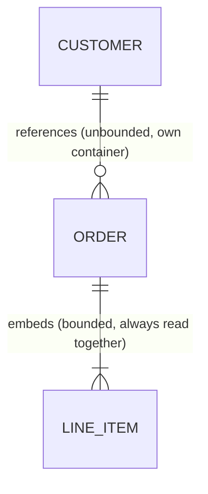
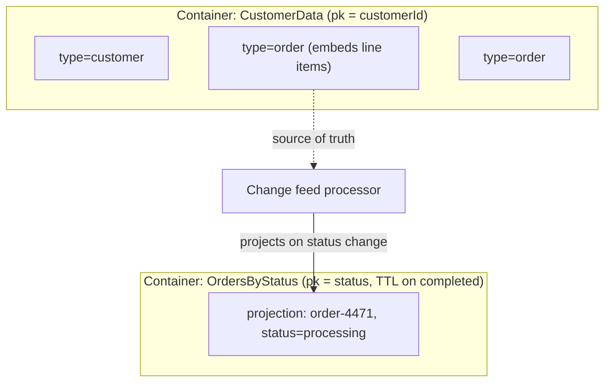

Relational modelling starts from the entities and normalises; Cosmos DB modelling starts from the **queries** and denormalises on purpose. This is the mental switch that trips up experienced relational engineers, and it's the thing interviewers probe hardest when Cosmos is on your resume — not whether you can write a `SELECT`.

## Access-pattern-first modelling

Before drawing a single entity, list every query the application actually runs: "get order by ID", "list a customer's last 20 orders", "find orders shipped to a region in the last week". Each access pattern implies a partition key candidate and a document shape. Only after this list exists do you decide what to embed, what to reference, and what to duplicate.

> [!KEY]
> In Cosmos DB, the schema is a **side effect of the queries**, not the other way around. If you can't name the top five queries before modelling, you will re-model after production traffic tells you which ones actually mattered.

## Embedding vs referencing

| Factor | Embed | Reference |
|---|---|---|
| Relationship shape | Bounded (a few, known max) — e.g. an order's line items | Unbounded or large — e.g. a customer's lifetime orders |
| Read pattern | Almost always read together | Usually queried independently |
| Write frequency | Child rarely changes independently of parent | Child updates far more often than parent |
| Size | Combined document stays well under the **2 MB** item limit | Would push the document toward or over the limit |
| Consistency need | Fine to be slightly stale as one unit | Needs independent access/update without touching the parent |



```json
// Embedding — line items are bounded and always read with the order
{
  "id": "order-4471",
  "customerId": "cust-882",
  "type": "order",
  "lineItems": [
    { "sku": "SKU-1", "qty": 2, "price": 19.99 },
    { "sku": "SKU-2", "qty": 1, "price": 49.00 }
  ],
  "total": 88.98
}
```

> [!TIP]
> A senior answer names the failure mode of over-embedding explicitly: "an order's line items are safe to embed because they're bounded and read together, but a customer's full order history is not — that's unbounded, so I'd reference it via a shared partition key or a separate container instead of risking the 2 MB item limit."

## Denormalisation and keeping duplicates fresh

Cosmos modelling routinely duplicates data across documents to avoid joins — e.g. storing a customer's name directly on every order document so an order list view needs one read, not a join. The cost is keeping duplicates in sync when the source changes.

- **Change feed as the sync mechanism** — when `Customer.name` changes, a change feed processor on the `Customers` container updates the denormalised `customerName` field on affected `Order` documents.
- **Accept staleness where it's harmless** — a customer's display name lagging by seconds on old orders is usually fine; a price lagging on an open cart is not.

> [!WARNING]
> Denormalisation is not "no updates" — it is "explicit, deliberate propagation of updates", usually via the change feed. Teams that denormalise without building the propagation path end up with silently stale data and no clear owner for fixing it.

## Multiple entity types, one container: the type discriminator pattern

Cosmos bills throughput per **container**, and cross-container queries/transactions don't exist — so a common pattern is storing several related entity types in a single container, distinguished by a `type` (or `docType`) property, sharing a partition key that matches the dominant access pattern.

```json
{ "id": "cust-882", "type": "customer", "partitionKey": "cust-882", "name": "Aria Osei" }
{ "id": "order-4471", "type": "order", "partitionKey": "cust-882", "total": 88.98 }
{ "id": "note-9", "type": "note", "partitionKey": "cust-882", "text": "Prefers email contact" }
```

This is the **single-container pattern**: a customer and all their orders and notes share partition key `cust-882`, so "everything about this customer" is one efficient single-partition query, and a transactional batch can atomically update several of them together.

| One-to-few | One-to-many | Many-to-many |
|---|---|---|
| Embed directly (order + line items) | Reference with shared partition key (customer + orders) | Reference both ways, or a join document/array of IDs on each side (students ↔ courses) — no native join, so denormalise the commonly-queried direction |

## Transactional batch within a partition key

Cosmos DB supports multi-item ACID transactions **only within a single logical partition key**, via `TransactionalBatch` — all-or-nothing execution of several point operations.

```csharp
PartitionKey pk = new PartitionKey("cust-882");
TransactionalBatchResponse response = await container.CreateTransactionalBatch(pk)
    .CreateItem(newOrder)
    .ReplaceItem(customer.Id, updatedCustomer)
    .ExecuteAsync();

if (!response.IsSuccessStatusCode) { /* entire batch rolled back */ }
```

Stored procedures offer the same partition-key-scoped transactional guarantee with more logic, but come with limits worth naming: they execute synchronously against a single partition, count against that partition's RU/s budget, must complete within a bounded execution time (a few seconds), and cannot call out to external services — making them suitable for small, self-contained multi-document operations, not general business logic.

## TTL for expiry

Setting `DefaultTimeToLive` on a container (or a `ttl` property per item, which overrides the container default) lets Cosmos automatically purge expired items without a manual cleanup job — ideal for session data, temporary tokens, or soft-deleted records that should eventually disappear for good.

```json
{ "id": "session-abc", "ttl": 3600 }
```

## Worked model: an e-commerce order domain

Access patterns: (1) get a customer's profile, (2) list a customer's recent orders, (3) get one order with its line items, (4) find all orders in "processing" status across all customers for ops dashboards.



Patterns (1)-(3) are served by one container partitioned by `customerId`, with `order` documents embedding their line items. Pattern (4) needs a cross-customer, status-scoped view that a `customerId`-partitioned container can't serve efficiently — so a change feed processor projects a slim `{orderId, customerId, status}` document into a second container partitioned by `status`, giving ops dashboards a cheap single-partition query at the cost of maintaining that projection.

## Cheat sheet

- Model from **access patterns**, not from a normalised entity diagram.
- Embed when the relationship is **bounded, read together, and rarely updated independently**; reference when it's unbounded or independently accessed.
- Watch the **2 MB item limit** — unbounded embedded arrays are the most common way to hit it.
- Denormalise deliberately, and use the **change feed** to propagate updates to duplicated fields.
- The **single-container, type-discriminator pattern** groups related entities under one partition key for efficient single-partition reads and transactional batches.
- `TransactionalBatch` and stored procedures both give ACID guarantees, but **only within one logical partition key**.
- Stored procedures have execution time limits and can't call external services — use for small, self-contained multi-document ops only.
- **TTL** (`DefaultTimeToLive` / per-item `ttl`) automatically expires items — use for sessions, tokens, and soft-delete cleanup.
- When one access pattern doesn't fit the primary partition key, project a slim copy into a second container via the change feed rather than forcing a bad partition key on the primary container.

## Common mistakes

| Mistake | Fix |
|---|---|
| Modelling Cosmos like a normalised relational schema | Start from queries; denormalise and embed deliberately |
| Embedding an unbounded array (e.g. "all orders" inside a customer document) | Reference via a shared partition key or separate container instead |
| Denormalising data without a propagation path | Use the change feed to keep duplicated fields in sync |
| Assuming transactions work across partition keys | `TransactionalBatch`/stored procedures are scoped to one logical partition key only |
| Using stored procedures for long-running or external-call logic | Keep them small, fast, and partition-local; move heavier logic to the application layer |
| Forgetting the 2 MB item size limit when embedding | Check realistic growth of embedded arrays before committing to the shape |

## Summary

Cosmos DB data modelling inverts the relational instinct: you start from the queries, choose a partition key that serves the dominant ones, and embed or reference based on whether data is bounded and read together or unbounded and independently accessed. Denormalisation is expected, not a smell, provided it's paired with a deliberate propagation mechanism — usually the change feed. Transactions and stored procedures only work within a single logical partition key, and the single-container, type-discriminator pattern is how real systems keep related entities co-located for efficient reads and atomic multi-document updates. A worked domain model, with a secondary change-feed-fed projection for the one access pattern that doesn't fit the primary partition key, is exactly the kind of answer that proves production experience.

## Top Interview Questions

### Q1. What's the fundamental difference between relational and Cosmos DB data modelling?

Relational modelling normalises around entities and relationships first, then lets the query planner and joins handle whatever access pattern shows up later — the schema is designed independently of specific queries. Cosmos DB modelling inverts this: because there's no cross-container join and throughput/partitioning are tied to the container and partition key, you must know your dominant access patterns *before* choosing a document shape, embedding decisions, or a partition key. The practical consequence is that the "right" Cosmos schema for the same domain can differ significantly depending on which queries actually run in production, whereas a normalised relational schema is largely access-pattern-agnostic by design.

### Q2. When should you embed data versus reference it in Cosmos DB?

Embed when the relationship is bounded (a known, small maximum count), almost always read together with its parent, rarely updated independently, and keeps the combined document comfortably under the 2 MB item limit — an order's line items are the textbook case. Reference (store as a separate item, linked by ID and usually sharing a partition key) when the relationship is unbounded or large, queried independently of the parent, or updated at a very different frequency than the parent — a customer's full lifetime order history is the textbook case, since it's unbounded and orders are typically queried on their own. The failure mode to name explicitly: embedding an unbounded collection eventually blows past the 2 MB item limit and forces a painful re-model.

### Q3. How do you handle "joins" in Cosmos DB, given there's no native cross-container join?

Three practical approaches, chosen based on the access pattern: denormalise by duplicating the frequently-needed fields from the "other side" directly onto the document (e.g. store `customerName` on every order so listing orders needs no second lookup), accepting the cost of keeping duplicates in sync, typically via the change feed; do the join client-side by issuing a second point read or query using an ID stored on the first document (acceptable when it's a rare, non-hot-path query); or restructure so both entity types live in the same container under the same partition key, so a single-partition query returns everything needed without a join at all (the single-container, type-discriminator pattern). Which one you pick depends on how often the "joined" data is needed and how tolerant the use case is of staleness.

### Q4. What is the single-container, type-discriminator pattern and why would you use it?

It's the practice of storing multiple related entity types (e.g. `customer`, `order`, `note`) in one physical container, distinguished by a `type` (or `docType`) property, typically sharing a partition key aligned with the dominant access pattern (e.g. `customerId`). The motivation is that Cosmos DB bills and scales throughput per container, and has no cross-container transactions or joins — so co-locating an entity and its closely related child entities under one partition key turns "get everything about this customer" into one efficient single-partition query, and allows `TransactionalBatch` to atomically update several of them together. The trade-off is added application-level discipline: every query must filter or handle multiple document shapes, typically via the discriminator field, and indexing policy needs to account for properties that only some types have.

### Q5. What's the scope of a Cosmos DB transaction, and how does that shape your design?

A Cosmos DB transaction — whether via `TransactionalBatch` or a stored procedure — is scoped strictly to a **single logical partition key**; there is no way to atomically update items across two different partition key values, let alone across containers. This directly shapes data modelling: any set of entities that must be updated together atomically (e.g. an order and its customer's running total, or several line items and an inventory count) must share the same partition key, which is one of the strongest arguments for the single-container pattern with a shared partition key like `customerId`. If a genuine cross-partition-key transaction requirement exists (e.g. transferring inventory between two independently-partitioned warehouses), that's a signal Cosmos alone can't satisfy it and you likely need a saga/compensating-transaction pattern at the application level instead.

### Q6. What are the practical limits of Cosmos DB stored procedures, and when should you avoid them?

Stored procedures execute synchronously, scoped to a single logical partition key, and must complete within a bounded execution time (a small number of seconds) or they're aborted and rolled back; they also cannot make outbound calls to external services (no HTTP calls, no calling other Cosmos containers), and their RU consumption counts entirely against that partition's throughput budget, so a heavy stored procedure can itself cause a hot partition. They're a good fit for small, self-contained, latency-sensitive multi-document operations within one partition — an atomic "create order + decrement inventory count" pair, for instance. Avoid them for anything resembling general business logic, long-running batch work, or logic that needs to call out to other systems — that belongs in the application layer or a separate orchestrator, using `TransactionalBatch` from the client if atomicity within a partition is still needed.

### Q7. How would you keep denormalised, duplicated data consistent when the source changes?

The standard mechanism is the change feed: attach a change feed processor (or Azure Functions Cosmos trigger) to the container holding the source of truth (e.g. `Customers`), and on every change, look up and update the denormalised copies elsewhere (e.g. `customerName` on that customer's `Order` documents) using a query scoped to the shared partition key where possible to keep it cheap. This makes the propagation asynchronous and eventually consistent — acceptable for most denormalised fields (a display name lagging by a second or two is invisible to users) but not appropriate for fields where staleness causes real business error, like a price shown on an active shopping cart, which should instead be read live or embedded only at the point of an immutable transaction (the order, once placed, legitimately freezes the price it charged).

### Q8. Design a Cosmos DB model for a game's news feed, where each player sees a personalised feed of recent items, and items can be liked/commented on by many players.

I'd start from access patterns: "get a player's feed" (paginated, most recent first), "get one news item with its recent comments", "add a like/comment", and "a moderator needs all items flagged for review across all players". I'd partition a `Feed` container by `playerId`, with each document being a slim reference to a news item (`itemId`, `publishedAt`, a denormalised preview) so a player's feed is a cheap single-partition, indexed range query. News item content itself, along with a bounded number of recent comments (say the latest 20, embedded), would live in a separate `NewsItems` container partitioned by `itemId`, since items are read far more often than they're written and don't need to share a partition with any one player. Likes/comments beyond the embedded recent window would be a further-referenced, paginated sub-collection to avoid unbounded embedding. The moderator's cross-player query would be served by a change-feed-fed projection into a `FlaggedItems` container partitioned by a moderation status, rather than forcing a bad partition key onto the primary containers.

### Q9. What is the risk of choosing `customerId` as a shared partition key across customer, order and note documents in a single container, and how would you validate it's safe?

The main risk is exactly the hot-partition/oversized-partition problem covered in partitioning: if a small number of customers generate a disproportionate volume of orders or notes (a large enterprise account versus thousands of small retail customers), their logical partition could approach the 20 GB storage limit or dominate that physical partition's 10,000 RU/s ceiling, while most customers' partitions stay tiny. I'd validate this by modelling realistic data growth per customer type before committing — projecting worst-case order/note volume for the largest expected customer over the product's data retention window — and if any customer segment risks the ceiling, I'd plan a synthetic or hierarchical partition key (e.g. `customerId` + a time bucket) from the start rather than discovering the problem in production.

### Q10. How does TTL (time-to-live) work in Cosmos DB, and what's a good production use for it?

TTL is configured at the container level via `DefaultTimeToLive` (in seconds), applied automatically to every item unless overridden by a per-item `ttl` property, which takes precedence and can also disable expiry entirely for a specific item by setting it to -1. Once an item's TTL elapses, Cosmos DB deletes it automatically in the background, without consuming your provisioned throughput for an explicit delete operation from application code, and without needing a scheduled cleanup job. Good production uses include session or auth-token storage that should self-expire, transient rate-limiting counters, and soft-deleted records that should be given a grace period (visible/recoverable for N days) before being purged permanently for storage cost and compliance reasons.

### Q11. A container modelled around `customerId` as the partition key now needs to support "find all orders shipped in the last 24 hours across every customer" for an ops dashboard — how do you serve that without a full cross-partition scan?

Since that query has no natural alignment with `customerId`, running it directly against the primary container would fan out across every physical partition, which gets more expensive and slower as the container grows. The standard fix is a **change-feed-fed projection**: attach a change feed processor to the `Orders` container, and on every relevant change, upsert a slim document (`orderId`, `customerId`, `status`, `shippedAt`) into a second, purpose-built container partitioned by something like a date bucket or `status`, which the ops dashboard queries instead. This trades a small amount of eventual consistency and an extra container to maintain for turning an expensive, ever-growing cross-partition scan into a cheap, bounded single- or few-partition query — exactly the "materialised view" pattern the change feed exists to support.

### Q12. Your data model embeds a growing array of "activity events" inside a user's profile document, and writes are starting to throttle — what's happening and how do you fix it?

This is the classic over-embedding failure: an unbounded, ever-growing array inside one document means every single write to add a new activity event requires re-writing (and re-indexing) the entire, increasingly large profile document, so RU cost per write keeps climbing as the array grows, and eventually the document risks the 2 MB item limit entirely. The fix is to stop embedding and instead reference: store activity events as their own items in a separate container (or the same container with a `type=activityEvent` discriminator) sharing the user's partition key, so appending a new event is a small, cheap, constant-cost write regardless of history size, and reading "this user's recent activity" becomes a range query on that partition rather than a full document rewrite. This also naturally solves the size-limit risk, since individual event items stay small and bounded rather than one document growing indefinitely.
