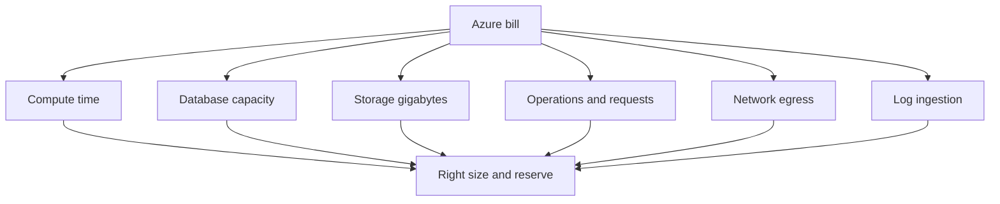

Azure operations are a balance between giving teams speed and keeping spend, risk and quota failures under control. Senior interviews expect you to know the meters that create the bill, the guardrails that prevent drift, and the limits that break launches when ignored.

## Cost model by service family

Azure cost is not one meter. Compute charges for time and size, databases charge for provisioned capacity or operations, storage charges for capacity and transactions, and networking charges mainly for egress. A useful cost review starts by grouping spend by service, then by resource, then by meter.



| Service family | Common meters | What to inspect first |
|---|---|---|
| VMs, App Service, AKS | Instance size, node count, uptime | Idle capacity and baseline versus peak |
| Functions and serverless | Executions, duration, memory, plan type | Cold-start plan choices and runaway triggers |
| Azure SQL | vCores or DTUs, storage, backup retention | Provisioned tier, elastic pool fit, idle databases |
| Cosmos DB | Provisioned RU/s, autoscale max, storage | Consumed RU versus provisioned RU and hot partitions |
| Storage | GB stored, redundancy, transactions, retrieval | Tier, lifecycle rules and redundancy level |
| Networking | Internet egress, cross-region egress, gateways | Large downloads, chatty cross-region services |
| Monitor and Log Analytics | GB ingested, retention, commitment tier | Verbose logs and tables with high ingestion |

> [!KEY]
> Optimise by meter, not by hunch. The most visible resource is not always the expensive one; egress, logs and provisioned throughput often beat compute.

A strong answer names the cost shape of the selected service. Cosmos can be cheap for point reads and expensive when provisioned RU/s is oversized. App Service may be cheap at low scale and wasteful if many plans sit half idle. Log Analytics can surprise teams because a debug-level deployment can multiply ingestion overnight.

## Levers that move the bill

Cost optimisation is not only picking the cheapest SKU. It is matching commitment, scale and tier to the workload. The biggest recurring wins usually come from reducing idle compute, buying discounts for steady baselines, tiering cold data and avoiding unnecessary egress.

| Lever | Works best for | Trade-off |
|---|---|---|
| Right-sizing | Overprovisioned VMs, App Service plans, databases | Needs real utilisation data and safe rollback |
| Reserved instances or savings plans | Predictable baseline compute | Commitment risk if workload disappears |
| Autoscale floors | Spiky traffic and dev environments | Too low a floor can hurt latency or cold start |
| Scheduled shutdown | Dev, test, training environments | Requires ownership tags and exceptions |
| Storage lifecycle tiers | Backups, logs, media, infrequently read blobs | Retrieval delay and early deletion charges |
| CDN caching | Static assets and large downloads | Cache invalidation and TTL discipline |
| Cosmos autoscale or serverless | Bursty or low average RU consumption | Autoscale floor or serverless per-operation cost |
| Log sampling and retention | High-volume telemetry | Must preserve errors and audit data |

```bash
az costmanagement query \
  --type ActualCost \
  --timeframe MonthToDate \
  --dataset-granularity Daily
```

Cosmos deserves explicit discussion. Provisioned throughput is right for steady, high-volume workloads. Autoscale is useful when peaks are several times higher than average because you pay for a floor plus bursts. Serverless is attractive for intermittent small workloads, but high sustained traffic is often more expensive than provisioned RU/s.

> [!TIP]
> Reserve the baseline, autoscale the variable part and use spot or scheduled shutdown only where interruption is acceptable.

## Tags, budgets and showback

Tags make cost explainable. Without consistent `team`, `service`, `environment` and `cost-center` tags, finance sees a subscription bill instead of accountable product spend. Showback reports cost to teams; chargeback actually bills them. Even if the organisation does not charge teams directly, showback changes behaviour because owners can see the effect of idle resources.

| Control | Purpose | Practical detail |
|---|---|---|
| Required tags | Allocate spend and ownership | Enforce at resource group or subscription scope |
| Budgets | Alert before invoice shock | Use 80 percent and 100 percent thresholds |
| Cost anomaly alerts | Detect unusual spend pattern | Useful for egress, logs and runaway scale |
| Advisor recommendations | Find rightsizing and reservation opportunities | Review on a regular cadence |
| Resource locks | Prevent accidental delete of shared assets | Use sparingly with documented owner |

Budgets should page the accountable team, not a central mailbox nobody reads. Alerts without owners become noise. For shared platform resources, allocate cost by usage when possible, or by agreed percentage when usage data is unavailable.

## Management groups and policy

The hierarchy is tenant, management group, subscription, resource group and resource. In cost and governance conversations, subscriptions are important because they are billing, quota and blast-radius boundaries. Management groups let you apply policy and role assignments across many subscriptions.

| Scope | Best use | Avoid using it for |
|---|---|---|
| Management group | Org-wide policy, broad compliance reporting | Day-to-day app permissions |
| Subscription | Billing, quota and environment boundary | Mixed prod and dev blast radius |
| Resource group | Workload lifecycle and team deployment scope | Network or security isolation assumptions |
| Resource | Narrow exceptions and data-plane access | Managing hundreds of manual assignments |

Azure Policy can deny, audit, append or deploy settings. Use it for guardrails such as allowed regions, required tags, no public storage accounts, diagnostic settings and approved VM SKUs.

```json
{
  "if": {
    "allOf": [
      { "field": "type", "equals": "Microsoft.Storage/storageAccounts" },
      { "field": "Microsoft.Storage/storageAccounts/allowBlobPublicAccess", "equals": true }
    ]
  },
  "then": {
    "effect": "deny"
  }
}
```

> [!WARNING]
> A policy that denies noncompliant resources is only safe when teams know it exists and have a tested exception path. Surprise governance breaks deployment pipelines.

Blueprints and landing zones package these decisions into repeatable environments: networking, logging, identity, policy and tagging arrive before workload teams deploy.

## RBAC and least privilege

Azure RBAC assigns roles to principals at scopes, inherited downward. The default production posture should be group-based assignments, narrow scopes, managed identity for workloads and Privileged Identity Management for human elevation.

| Role or pattern | Use | Risk if overused |
|---|---|---|
| Reader | Auditors, support, dashboards | Low, but data-plane may still be separate |
| Contributor | CI on a specific resource group | Can create or delete resources in scope |
| Owner | Break-glass only | Can grant access to others |
| User Access Administrator | RBAC management only | Privilege escalation if permanent |
| Data-plane roles | App access to blobs, queues or secrets | Wrong scope can expose production data |
| PIM eligible roles | Temporary human elevation | Process friction if approvals are slow |

Control-plane roles do not always grant data-plane rights. For example, managing a storage account resource is different from reading blobs inside it. A senior answer says which plane the workload needs, then grants only that role to its managed identity.

## Quotas, limits and throttling

Quotas are production readiness items. Many limits are soft and can be raised by support request; others are architectural and require design changes. Plan before launch, because quota increases can take time and hard limits do not move.

| Limit | Typical default or shape | Design response |
|---|---|---|
| Regional vCPU quota | Often low in new subscriptions | Request 2 times expected peak before launch |
| Public IP count | Limited per subscription | Use private networking and consolidate frontends |
| Key Vault throughput | Per vault operation limits | Cache secrets and shard high-throughput vaults |
| Cosmos partition limits | 20 GB per logical partition and about 10,000 RU/s per physical partition range | Choose partition key, hierarchical key or synthetic buckets carefully |
| API Management unit capacity | Calls per second per unit | Scale units or choose tier deliberately |
| Storage account request rate | Account-level throughput ceilings | Shard hot workloads across accounts |
| ARM control-plane throttling | Request-rate limited | Back off, reduce deployment parallelism |

HTTP 429 usually includes `Retry-After`. Clients and automation should respect it and add jittered exponential backoff. For multi-tenant systems, use bulkheads so one throttled tenant does not consume all shared retry capacity.

## Operating rhythm

Cost and governance controls work best as a rhythm, not as a one-time cleanup. Cloud estates drift because teams ship, experiments are left running, quotas are consumed and access accumulates. A lightweight recurring process catches drift before it becomes a finance, security or launch incident.

| Cadence | Activity | Output |
|---|---|---|
| Every sprint | Review Advisor and top cost movers | Rightsizing tickets or accepted exceptions |
| Monthly | Showback by team and service tag | Owners understand spend trends |
| Monthly | Budget and anomaly review | Alert thresholds adjusted before invoice shock |
| Quarterly | RBAC and PIM access review | Removed stale users and service principals |
| Quarterly | Policy compliance review | Remediated public endpoints or missing diagnostics |
| Before launch | Quota and capacity review | Approved increases and scaling runbook |
| After incident | Cost and governance postmortem | New guardrail or automation if needed |

This rhythm should be visible to engineering teams. If a budget alert fires, the owning service team should receive it with the resource, meter and recent change context. If a policy blocks deployment, the error should point to documentation and an exception path. If access is removed, the engineer should know how to request temporary PIM elevation.

Automation helps, but do not automate away judgement. A policy can require tags, but humans still decide the cost model for a new product. Advisor can recommend shutting down an idle VM, but the owner knows whether it is a warm disaster recovery node. The operating model should separate automatic guardrails for obvious risks from review processes for trade-offs.

A strong interview answer ends with ownership. Central platform teams define guardrails, shared dashboards and landing zones. Product teams own their resources, budgets and exceptions. Finance gets showback, security gets policy evidence, and engineering keeps a path to move quickly without permanent subscription-level privileges.

Governance should be measured by outcomes, not by the number of rules. Useful outcomes include fewer unowned resources, no production public storage accounts, predictable cost by team, faster access removal, and fewer launch failures from quota exhaustion. If rules create a shadow process where teams ask for broad permissions or deploy outside the landing zone, the governance model is too hard to use. The platform team should treat developer experience as part of governance: templates, policy error messages, approved modules and documented exception flows reduce both risk and friction.

A concise interview close is that governance is paved road engineering. Teams can leave the road when justified, but the safest and cheapest path should also be the easiest path.
## Cheat sheet

- Start cost reviews in Cost Analysis grouped by service, then resource, then meter.
- The big Azure cost levers are idle compute, reserved baseline capacity, storage tiers, egress, logs and provisioned database throughput.
- Tags power ownership, showback, automation and cleanup.
- Budgets need actionable owners and thresholds before the invoice arrives.
- Subscriptions are billing, quota and blast-radius boundaries.
- Azure Policy enforces guardrails; landing zones package policy, networking, logging and identity.
- Use group-based RBAC, narrow scopes, managed identity and PIM for human elevation.
- Separate control-plane and data-plane roles when granting access.
- Treat quotas as launch readiness tasks, not incident response tasks.
- Respect `Retry-After` and design bulkheads for throttling.

## Common mistakes

| Mistake | Fix |
|---|---|
| Guessing that VMs caused a bill spike | Use Cost Analysis by meter before optimising |
| Leaving dev and test resources on all month | Schedule shutdowns and require ownership tags |
| Buying reservations for unproven workloads | Reserve only stable baseline usage |
| Applying Azure Policy without an exception process | Publish guardrails and test deployment pipelines |
| Granting subscription Owner for convenience | Use PIM and narrow resource group or resource scopes |
| Assuming Contributor can read all data | Check data-plane RBAC separately |
| Discovering quota limits during launch | Request increases during readiness review |
| Retrying 429s with fixed delays | Respect `Retry-After` and use jittered backoff |

## Summary

Azure cost and governance are operational design concerns, not finance afterthoughts. The estate stays healthy when spend is visible by owner, policy prevents dangerous drift, RBAC is scoped to the minimum needed and quota headroom is checked before scale events. The senior posture is pragmatic: guardrails should catch mistakes early without blocking teams that have a documented, approved exception.

## Top Interview Questions

### Q1. Your Azure bill doubled last month. What do you do first?

I would start in Cost Analysis, compare current month with the prior month, group by service name and sort by cost delta. Then I would drill into the top mover by resource and meter, because the meter tells the story: egress, provisioned throughput, log ingestion, VM hours or storage retrieval are different fixes. I would check whether a reservation expired, autoscale max changed, verbose logs were enabled, a CDN was bypassed or test resources were left running. Before leaving the investigation, I would add or adjust budget alerts and tag ownership so the team responsible gets early warning next time. Guessing at VM sizes before looking at cost data wastes time.

### Q2. Which Azure cost levers usually matter most?

The biggest levers are usually idle compute, commitment discounts for steady baselines, storage tiering, database throughput and network or logging volume. Right-sizing and scheduled shutdown remove waste from dev and oversized services. Reserved instances or savings plans reduce cost for capacity you know will run continuously. Storage lifecycle policies move cold blobs to cheaper tiers. Cosmos and similar services need provisioned versus consumed review because unused RU/s is pure waste. CDN caching and regional co-location reduce egress. Log sampling, retention and table tier choices control observability spend. The senior answer is to inspect the meter first, then choose the matching lever.

### Q3. How do you choose between Cosmos provisioned, autoscale and serverless from a cost view?

Provisioned throughput fits steady high-volume workloads because you pay for a known RU/s capacity and can reserve capacity when usage is predictable. Autoscale fits workloads with peaks several times higher than average; you pay for a floor and bursts up to the configured max, which is safer than manual scaling but still has a minimum cost. Serverless fits intermittent low-volume workloads because you pay per operation without managing throughput, but sustained high traffic can cost more than provisioned. I would look at p95 and p99 RU consumption, peak-to-average ratio, throttling tolerance and whether the workload has hot partitions before choosing.

### Q4. What tags would you require and how would you enforce them?

I would require at least `team`, `service`, `environment`, `cost-center` and `data-classification` or an equivalent ownership model. These tags support showback, incident routing, lifecycle automation and compliance reporting. Enforcement should use Azure Policy at management group or subscription scope, ideally denying creation when required tags are missing and appending inherited tags from the resource group where appropriate. The rollout should include communication and an exception path because a sudden deny policy can break deployment pipelines. I would also report untagged resources regularly, since imported or legacy resources often predate enforcement.

### Q5. How would you structure subscriptions for a large organisation?

I would use management groups for broad policy and reporting, then subscriptions as billing, quota and blast-radius boundaries. A common model is separate subscriptions per environment and business unit or workload class, such as production, nonproduction and shared platform subscriptions. Resource groups then represent workload lifecycle boundaries owned by teams. This prevents a dev quota spike, runaway Terraform apply or compromised identity from directly affecting production. It also makes billing and compliance scoping easier. Shared networking, identity and monitoring can live in platform subscriptions connected to workload subscriptions through hub-spoke networking and central policy.

### Q6. What is Azure Policy good for and what can go wrong?

Azure Policy is good for repeatable guardrails: allowed regions, required tags, approved VM SKUs, diagnostic settings, public network restrictions and audit of insecure configurations. It can deny noncompliant deployments, audit them or append settings. What can go wrong is using deny policies without warning or exception processes. Teams suddenly see pipeline failures they do not understand, and they may work around governance manually. The safe rollout is audit first, fix existing resources, publish the standard, provide an approved exception path, then move critical rules to deny. Policy should prevent mistakes without becoming a mysterious deployment blocker.

### Q7. Explain Azure RBAC least privilege in practice.

Least privilege means assigning a principal only the actions it needs, at the narrowest workable scope, for the shortest duration. Humans should usually get group-based Reader access to production and use PIM for temporary elevation. CI identities might get Contributor only on the resource group they deploy to, not the whole subscription. Workloads should use managed identities with service-specific data-plane roles, such as a blob data reader role for one storage account. Owner is reserved for break-glass because it can grant further access. I also distinguish control plane from data plane, since managing a resource is not the same as reading its data.

### Q8. What Azure quota failures have you seen or would plan for?

Common failures include regional vCPU quota blocking scale-out, public IP limits during load balancer expansion, Key Vault request limits during startup storms, Cosmos logical-partition storage limits or hot physical partition ranges, API Management unit capacity and ARM deployment throttling. I plan for them in launch readiness: request vCPU quota above expected peak, avoid unnecessary public IPs, cache secrets instead of reading Key Vault per request, choose partition keys that avoid 10,000 RU/s logical partition ceilings, scale APIM units before campaigns and throttle deployment parallelism. Monitoring should alert when quota usage approaches around 80 percent or when 429 throttling rises above a tiny threshold.


