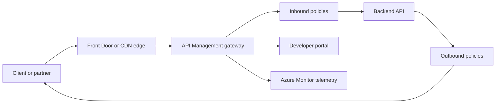

Azure-native operations are not just dashboards. API Management controls the north-south API surface, App Configuration controls runtime behaviour, and Azure Monitor with Log Analytics and Application Insights turns platform telemetry into diagnosis and action.

## API gateway responsibilities

Azure API Management is a managed gateway in front of APIs. It is strongest at the boundary between external consumers and backend services: authentication enforcement, products, subscription keys, policy-based transforms, rate limits, versioning and documentation. It is usually not the right hop for every internal microservice call.



| Capability | What APIM does | Interview caveat |
|---|---|---|
| Gateway | Reverse proxy in front of APIs | Adds latency and cost per call |
| Products | Packages APIs for consumers | Product policy can differ from API policy |
| Subscription keys | Identifies and throttles consumers | Not a replacement for user authentication |
| Policies | XML rules for auth, rate limit, headers, cache | Powerful but can become hidden business logic |
| Developer portal | Docs, keys and test console | Valuable for partner APIs, less for internal-only APIs |
| Versions and revisions | Manage breaking and nonbreaking changes | Versioning strategy must be explicit |

> [!KEY]
> Put APIM on north-south API boundaries where policy and consumer management matter. Do not route every east-west internal call through it just to get visibility.

Front Door or CDN can sit before APIM for global edge entry, WAF and static caching. If origin bypass matters, restrict backend access so callers cannot skip the edge and gateway policies.

## Policies, versions and self hosted gateway

Policies run at inbound, backend, outbound and error stages. Common policies validate tokens, set correlation headers, limit rates, cache safe responses, rewrite URLs and return mocks while a backend is not ready.

```xml
<policies>
  <inbound>
    <base />
    <validate-jwt header-name="Authorization" require-scheme="Bearer">
      <audiences>
        <audience>orders-api</audience>
      </audiences>
    </validate-jwt>
    <rate-limit-by-key calls="100" renewal-period="60" counter-key="@(context.Subscription.Id)" />
    <set-header name="x-correlation-id" exists-action="override">
      <value>@(context.RequestId.ToString())</value>
    </set-header>
  </inbound>
  <outbound>
    <base />
  </outbound>
</policies>
```

| Mechanism | Use it for | Trap |
|---|---|---|
| Revision | Nonbreaking change to same API version | Forgetting to promote after testing |
| Version | Breaking contract change | Too many live versions to support |
| Product | Consumer packaging and quotas | Treating products as security boundaries only |
| Named value | Shared policy config | Storing secrets here instead of Key Vault references |
| Self-hosted gateway | Run gateway close to on-prem or edge workloads | You operate connectivity, updates and observability |

Rate limits should be per consumer, tenant or token, not global only. A global limit protects the backend but lets one noisy consumer starve everyone else. The self-hosted gateway is useful when APIs must be exposed near a private environment while managed from Azure, but it brings operational responsibilities that the hosted gateway normally hides.

> [!WARNING]
> APIM policies are code. Keep them in source control, test them through CI and avoid burying business decisions in gateway XML that application owners cannot see.

## Azure Monitor data model

Azure Monitor is the platform umbrella. Metrics are numeric time series, logs are queryable records stored in a Log Analytics Workspace, and Application Insights captures application requests, dependencies, exceptions and traces into workspace-backed tables. The Azure-specific skill is knowing where each signal lives and how to query or alert from it.

| Signal | Azure store | Typical latency | Best use |
|---|---|---:|---|
| Platform metrics | Azure Monitor Metrics | About 1 minute | CPU, RU consumption, queue length, availability |
| Resource logs | Log Analytics Workspace | 2 to 5 minutes | Diagnostic events, gateway logs, audit records |
| App requests | Application Insights tables | 2 to 5 minutes | Request rate, duration, failures |
| Dependencies | Application Insights tables | 2 to 5 minutes | SQL, HTTP, Service Bus, Redis calls |
| Traces and exceptions | Application Insights tables | 2 to 5 minutes | Stack traces and correlated log events |
| Activity Log | Subscription level event log | Minutes | Control-plane changes and policy actions |

Workspace-based Application Insights is the modern default because it puts telemetry into Log Analytics where KQL can join across resources and services. Classic per-resource silos make estate-wide questions harder.

## KQL, workbooks and cost control

Kusto Query Language is the daily tool for Log Analytics. It is pipeline-oriented: filter early, summarize, then order or render. Good operational queries are saved into workbooks or alert rules rather than pasted from chat during every incident.

```kusto
requests
| where timestamp > ago(1h)
| summarize p99 = percentile(duration, 99), failures = countif(success == false) by cloud_RoleName, operation_Name
| order by p99 desc
```

```kusto
dependencies
| where timestamp > ago(30m)
| where success == false
| summarize failures = count(), sample = any(resultCode) by cloud_RoleName, target, type
| order by failures desc
```

| Cost lever | Use when | Caveat |
|---|---|---|
| Adaptive sampling | High volume App Insights success telemetry | Keep all exceptions and important custom events |
| Table retention | Different data needs different history | Security logs may need longer retention than debug traces |
| Basic logs | Verbose diagnostic tables | Limited query and alert capability |
| Archive tier | Rarely queried old data | Restore or search job adds delay |
| Commitment tier | Predictable high ingestion | Wrong tier wastes money |

> [!TIP]
> Sampling should protect diagnostic value, not hide incidents. Keep failures, slow requests and key business events even when routine success telemetry is sampled.

Workbooks combine KQL, metrics and parameters into reusable operational views. They are ideal for service health pages, release dashboards and incident drill-downs because they preserve the investigation path.

## Alerts, action groups and tracing

Azure alerts evaluate metrics, log queries or activity events and notify action groups. An action group can send email, SMS, webhook, ITSM, automation or function calls. Good alerts are tied to service objectives and include a runbook link.

| Alert type | Good for | Example |
|---|---|---|
| Metric alert | Fast numeric threshold | CPU over 80 percent for 10 minutes |
| Log alert | Rich KQL condition | Error rate above 1 percent by operation |
| Activity Log alert | Control-plane changes | Production Key Vault deleted |
| Smart detection | App Insights anomaly pattern | Failure spike or performance degradation |
| Availability test | Synthetic endpoint check | Public API health from multiple regions |

Distributed tracing in Application Insights uses operation ids and W3C trace context so one user request can be followed across services and dependencies. In .NET and many Azure SDKs, `Activity` propagation and dependency collection give most edges automatically when configured correctly.

```kusto
traces
| where timestamp > ago(1h)
| where operation_Id == "REPLACE_WITH_OPERATION_ID"
| project timestamp, cloud_RoleName, message, severityLevel
| order by timestamp asc
```

The Azure-specific answer mentions App Map, transaction search and dependency telemetry. App Map shows service nodes, dependency edges, failure rates and latency, which is often the fastest first screen during an incident.

## App Configuration and feature flags

App Configuration stores non-sensitive configuration and feature flags outside the deployment artifact. Key Vault stores secrets, keys and certificates. A common pattern is App Configuration for the flag or setting, with Key Vault references for sensitive values.

| Feature | App Configuration | Key Vault |
|---|---|---|
| Stores | Non-sensitive settings and flags | Secrets, keys and certificates |
| Runtime change | SDK refresh and sentinel keys | Version refresh or app restart pattern |
| Targeting | Feature filters by user, group, percentage or time | Not a feature flag system |
| Security | RBAC and private networking | Stronger secret management and purge protection |
| Best use | Behaviour switches and environment config | Credentials and cryptographic material |

```json
{
  "id": "new-checkout",
  "enabled": true,
  "conditions": {
    "client_filters": [
      { "name": "Microsoft.Percentage", "parameters": { "Value": 5 } }
    ]
  }
}
```

Use a sentinel key so clients refresh only when a known version marker changes. Rollouts should move from internal users to 5 percent, 25 percent and 100 percent while monitoring error rate, latency and business metrics. Remove stale flags quickly; every old flag is a permanent branch in production.

## Operational ownership model

The gateway, monitoring workspace and configuration store usually have different owners. Confusion over ownership creates slow incidents: the API team thinks the platform team owns a rate limit, the platform team thinks the service team owns a broken backend, and nobody owns an alert. Define the boundary before production.

| Surface | Typical owner | Ownership questions |
|---|---|---|
| APIM instance and networking | Platform team | Tier, capacity, private networking and global policy |
| API policy for one product | Service team with platform review | Auth, limits, transforms and version rollout |
| Developer portal content | API product owner | Consumer docs, subscription workflow and examples |
| Log Analytics workspace | Platform or SRE team | Retention, table tiers, access and cost controls |
| App Insights instrumentation | Service team | Operation names, custom events and dependency context |
| Alert rules and runbooks | Service team | Thresholds, action groups and first response |
| App Configuration store | Platform plus service owners | Key naming, labels, refresh and stale flag cleanup |

This model prevents APIM from becoming a dumping ground for hidden application logic. Platform teams can provide reusable policy fragments for correlation headers, token validation and standard error shapes. Service teams remain responsible for API contracts, backend health and consumer-specific limits. The same split applies to monitoring: platform owns the workspace hygiene, but the service team owns whether `operation_Name` values are meaningful and whether alerts represent real user impact.

Access control follows ownership. Gateway operators may need APIM contributor rights, API teams may need permission to publish revisions, and on-call engineers may need Log Analytics reader rights for their service. Write access to shared workspaces and gateway-wide policy should be narrow, because one bad change can affect many teams.

During incidents, the ownership model should lead to a quick handoff. If APIM returns 401 because policy rejects tokens, the API policy owner investigates. If APIM returns 500 after a backend timeout, the backend service owner investigates with dependency traces. If ingestion cost spikes, the workspace owner identifies the noisy table and works with the service owner to reduce volume safely.

The same ownership model helps with change management. APIM policy changes should have review from the API owner and the platform owner because a bad policy can block every consumer. Alert changes should be reviewed by the on-call team because they pay the noise cost. Feature flag changes should be auditable because they alter production behaviour without deployment. Workbooks and dashboards should be treated as operational assets, not personal scratch pads, when they are used during incidents.

A mature Azure estate keeps these surfaces close to infrastructure as code. APIM APIs and policies, alert rules, action groups, dashboard definitions and App Configuration keys can all be represented or at least promoted through controlled pipelines. That gives rollback, review and repeatability to the operational plane itself.
## Cheat sheet

- APIM is a north-south gateway for external or partner APIs, not a default east-west service mesh.
- Products package APIs for consumers; versions handle breaking changes; revisions handle nonbreaking changes.
- Policies can validate JWTs, transform headers, rate limit, cache and mock responses.
- Rate limit by consumer or tenant where possible, not only globally.
- The self-hosted gateway is managed by Azure but operated in your environment.
- Azure Monitor Metrics are fast numeric series; Log Analytics stores queryable records; App Insights adds app telemetry.
- KQL is the operational query language for Log Analytics workspaces.
- Alerts should route through action groups and include runbooks.
- App Map and transaction search are Azure-native tracing accelerators.
- App Configuration stores non-secret config and flags; Key Vault stores secrets.

## Common mistakes

| Mistake | Fix |
|---|---|
| Putting every internal service call through APIM | Use APIM at boundaries and service networking or mesh internally |
| Treating subscription keys as authentication | Validate user or app identity with tokens where required |
| Editing APIM policies manually in the portal | Keep gateway policy in source control and CI |
| Creating one global rate limit | Limit per consumer so one tenant cannot starve others |
| Sending every debug log to Log Analytics forever | Use sampling, retention and table tiers intentionally |
| Alerting on symptoms nobody owns | Route to action groups with runbook links and service owners |
| Storing secrets in App Configuration | Use Key Vault references or managed identity to Key Vault |
| Leaving feature flags in place indefinitely | Remove flags after full rollout and cleanup window |

## Summary

APIM, Azure Monitor, Application Insights and App Configuration are the Azure-specific operating surface around application code. APIM controls API contracts and policy at the edge, Monitor and Log Analytics turn platform and app telemetry into queries and alerts, App Insights provides distributed tracing mechanics, and App Configuration lets teams change behaviour safely without redeploying. The senior answer is always tied to placement, ownership, cost and failure mode.

## Top Interview Questions

### Q1. When would you use Azure API Management?

I would use APIM when APIs need a managed north-south gateway: partner onboarding, subscription keys, products, documentation, JWT validation, rate limiting, header or URL transforms and version management. It is especially useful when multiple backend services need a consistent external contract. I would not put every internal microservice call through APIM just for visibility, because it adds latency, cost and another hop. Internal traffic belongs on platform networking, Kubernetes Services or a service mesh when needed. The strong answer names the boundary: APIM is for API governance and consumer management, not as a universal replacement for service-to-service communication.

### Q2. What are APIM products, versions and revisions?

A product is a package of one or more APIs exposed to a group of consumers, often with subscription requirements, quotas and documentation. A version represents a breaking API contract change, such as a changed route or response schema, where old and new clients may need to coexist. A revision is a nonbreaking update to the same API version, useful for testing and promoting changes without changing the public version. In practice, I use revisions for safe deployment and rollback of policy or backend changes, and versions only when clients must consciously migrate. Too many versions create support burden, so every version needs a lifecycle policy.

### Q3. Show examples of APIM policies you would actually use.

Common policies include `validate-jwt` to reject unauthenticated calls before they reach the backend, `rate-limit-by-key` or `quota-by-key` to protect services by consumer, `set-header` to inject or preserve correlation ids, `rewrite-uri` to map public routes to backend routes, and `cache-lookup` with `cache-store` for safe read responses. I also use `mock-response` when a contract is agreed before the backend exists. The caution is that policies are executable gateway logic. They should be versioned, reviewed and tested like application code, and complex business rules should stay in services where owners can observe and test them fully.

### Q4. How do Azure Monitor, Log Analytics and Application Insights relate?

Azure Monitor is the umbrella platform. Metrics are numeric time series used for fast alerting and charts. Log Analytics is the workspace where resource logs and queryable records are stored and queried with KQL. Application Insights is the application monitoring layer that records requests, dependencies, exceptions, traces and distributed transaction data, now commonly backed by a Log Analytics Workspace. So for an API latency incident, I might start with Azure Monitor metrics for fast health, use App Insights App Map and transaction search to find the failing dependency, then query the workspace with KQL for detailed request and exception patterns.

### Q5. Write the shape of a useful KQL query for a slow API incident.

I would filter to the recent incident window, group by role and operation, then summarize high percentiles and failure counts. The important shape is filter early, summarize by useful dimensions and sort by the worst symptom. For example, query `requests` for the last hour, calculate p95 or p99 duration and failed request count by `cloud_RoleName` and `operation_Name`, then order by p99 descending. If one operation is slow, join or pivot to `dependencies` for the same operation id or time window to see whether SQL, Redis, HTTP or Service Bus dependency latency explains the request. Saved queries should become workbook panels or alert rules.

### Q6. How do you control Log Analytics and App Insights cost without losing diagnostics?

First I identify the high-ingestion tables and services rather than cutting blindly. Then I use adaptive sampling for routine success telemetry while preserving exceptions, slow requests and key business events. I set per-table retention based on value: security or audit records may stay longer, verbose debug traces shorter. Basic logs or archive can hold low-value diagnostic data at lower cost, with the caveat that query and alert capabilities differ. I also remove accidental debug logging and noisy custom events. The goal is signal-to-cost, not minimum telemetry. Turning off all logs saves money but makes incidents slower and more expensive.

### Q7. What makes a good Azure alert?

A good alert maps to user impact or an imminent resource limit, has a clear owner, routes through an action group and includes a runbook. Metric alerts are best for fast signals like CPU, queue depth or availability. Log alerts are best when KQL needs to calculate error rate by operation or detect a specific exception pattern. Activity Log alerts catch control-plane risks like a production resource deletion. I avoid alerting on every single failure because that creates noise; instead I alert on burn rate, sustained error percentage, p99 latency beyond SLO or throttling above a small threshold. Every alert should answer who acts and what they do first.

### Q8. How would you roll out a risky feature using App Configuration?

I would ship the code behind a disabled feature flag, then enable it for internal users through a targeting filter. If metrics look healthy, I would enable it for a small percentage such as 5 percent, watch error rate, p99 latency and a business metric, then increase to 25 percent and 100 percent. The application should refresh configuration through the App Configuration SDK, ideally using a sentinel key to avoid constant polling. If the feature causes problems, rollback is flipping the flag off, not redeploying. After the feature is fully launched and stable, I would remove the flag from code so it does not become long-lived production branch logic.


