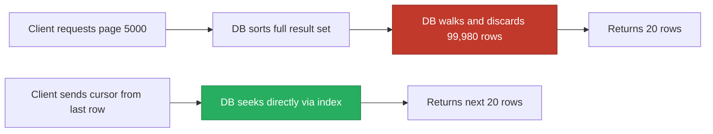

Any list endpoint that can grow past a few hundred rows needs a pagination strategy, and the naive choice — offset and limit — quietly degrades as a table grows, which is exactly the kind of thing interviewers probe to separate "wrote a CRUD API" from "operated one in production." Filtering and sorting sit right alongside pagination because all three interact: a sort on an unindexed column can make pagination slow regardless of which strategy you pick.

## Offset/limit vs keyset (cursor) pagination

| | Offset/limit | Keyset (cursor) |
|---|---|---|
| Request shape | `?offset=200&limit=20` | `?cursor=eyJpZCI6MjA1fQ&limit=20` |
| Underlying query | `ORDER BY id OFFSET 200 LIMIT 20` | `WHERE id > 205 ORDER BY id LIMIT 20` |
| Performance at page 1 | Fast | Fast |
| Performance at page 10,000 | Slow — scans and discards all skipped rows | Fast — uses the index, no scan-and-discard |
| Jump to arbitrary page N | Easy (`offset = N * pageSize`) | Not possible, only "next"/"previous" |
| Stable under concurrent inserts/deletes | No — rows shift between pages, causing skips or duplicates | Yes — anchored to a value, unaffected by inserts elsewhere |
| Total page count | Trivial (`COUNT(*) / pageSize`) | Requires a separate, possibly-approximate count |
| Best for | Small-to-medium tables, UI page-number controls | Large or fast-growing tables, infinite scroll, APIs |

> [!KEY]
> Offset pagination pays a cost proportional to the offset itself: `OFFSET 100000` still makes the database walk (or at least count) 100,000 rows before it can discard them and return the next 20. Keyset pagination pays a cost proportional to the page size only, because it seeks directly via an index condition.

## The deep-pagination performance problem

```sql
-- Page 5000, page size 20 — the database must still touch ~100,000 rows
SELECT * FROM orders ORDER BY created_at DESC OFFSET 100000 LIMIT 20;
```

Even with an index on `created_at`, most engines still need to walk the index that many entries deep before it can start returning rows, because `OFFSET` is applied *after* sorting, not before. At small offsets this is invisible; at offset 100,000+ it can turn a 5 ms query into a multi-second one, and it gets linearly worse the deeper a client pages. This is precisely why infinite-scroll feeds, log viewers, and public paginated APIs (Stripe, GitHub) use cursors, not offsets.



## Stable sort keys and ties

Keyset pagination needs a **unique, totally-ordered** sort key, or rows with the same value on the sort column get silently skipped or duplicated across pages. Sorting purely on `created_at` breaks if two rows share the same timestamp (common with bulk inserts or low-precision timestamps).

> [!WARNING]
> Always break ties with a secondary unique column: `ORDER BY created_at, id` and a cursor of `(created_at, id)`. Sorting only on `created_at` when duplicates exist means the boundary between page N and page N+1 is ambiguous, and rows can vanish from the client's view entirely.

## Opaque cursors

Expose the cursor as an opaque, encoded token rather than a raw column value — it keeps the API contract stable if you change the underlying sort key later, and stops clients from constructing or guessing cursors themselves.

```json
// Decoded for illustration; the real API returns only the base64 string
{ "createdAt": "2025-06-01T12:00:00Z", "id": 20458 }
```

```http
GET /orders?limit=20&cursor=eyJjcmVhdGVkQXQiOiIyMDI1LTA2LTAxVDEyOjAwOjAwWiIsImlkIjoyMDQ1OH0
```

## Page metadata and link headers

Two common conventions for telling the client what to do next:

```json
{
  "data": [ /* 20 orders */ ],
  "page": {
    "nextCursor": "eyJjcmVhdGVkQXQiOi...",
    "hasMore": true
  }
}
```

```http
HTTP/1.1 200 OK
Link: <https://api.example.com/orders?cursor=abc123>; rel="next"
```

GitHub's API uses `Link` headers; most JSON-first APIs (Stripe, Slack) put pagination metadata directly in the body, which is usually easier for typed client SDKs to consume.

## Filtering syntax design

| Style | Example | Notes |
|---|---|---|
| Simple equality | `?status=active` | Fine for most fields |
| Range | `?createdAfter=2025-01-01&createdBefore=2025-06-01` | Clear, avoids inventing operator syntax |
| Operator-embedded | `?price[gte]=10&price[lte]=50` | Powerful, needs a documented convention |
| Free-text search | `?q=laptop` | Delegate to a search engine for anything beyond trivial `LIKE` |
| Multi-value | `?status=active,pending` or `?status=active&status=pending` | Pick one convention and use it everywhere |

> [!TIP]
> Keep filtering, sorting and pagination in query parameters, never in the path or body of a GET — this keeps the resource URI stable, lets responses be cached per unique query string, and matches how every HTTP cache and CDN keys requests.

## Sorting on unindexed columns

`?sort=-lastLoginAt` looks harmless until `lastLoginAt` has no index, at which point every sorted page requires a full table scan plus an in-memory sort — fine at 1,000 rows, a production incident at 10 million. Either add an index for every column you expose as sortable, or restrict the sortable-field allowlist to columns you've deliberately indexed, and reject (400) any sort field outside that list.

## Total count cost and alternatives

`SELECT COUNT(*)` over a large, filtered table can be as expensive as the query itself, and it doesn't parallelize well with the actual page fetch. Options:

| Approach | Trade-off |
|---|---|
| Exact `COUNT(*)` every request | Simple, correct, expensive at scale |
| Cache the count with a short TTL | Fast, slightly stale |
| Approximate count (`pg_class.reltuples` in Postgres, or a maintained counter) | Very fast, not exact |
| Omit total count, expose only `hasMore` | Cheapest, matches keyset pagination naturally |

Most infinite-scroll UIs never needed the exact total in the first place — `hasMore: true/false` is enough, and it's exactly what keyset pagination gives you for free (fetch `limit + 1` rows, if you get the extra one, there's a next page).

## N+1 and over-fetching

Pagination interacts badly with lazy-loaded related data: paginating 20 orders, then lazily loading each order's customer inside a loop, issues 1 query for the page plus 20 more — the classic N+1 problem. Eager-load or batch-load related data for the page you're about to return, not per-row.

## Keyset pagination in EF Core

```csharp
public async Task<(List<Order> Items, string? NextCursor)> GetOrdersPage(
    DateTime? cursorCreatedAt, int? cursorId, int limit)
{
    var query = _db.Orders.AsNoTracking()
        .OrderByDescending(o => o.CreatedAt)
        .ThenByDescending(o => o.Id)
        .AsQueryable();

    if (cursorCreatedAt is not null && cursorId is not null)
    {
        // Tuple comparison keeps the tie-break correct in a single index seek
        query = query.Where(o =>
            o.CreatedAt < cursorCreatedAt ||
            (o.CreatedAt == cursorCreatedAt && o.Id < cursorId));
    }

    var items = await query.Take(limit + 1).ToListAsync(); // fetch one extra to detect "hasMore"
    bool hasMore = items.Count > limit;
    if (hasMore) items.RemoveAt(items.Count - 1);

    var last = items.LastOrDefault();
    string? nextCursor = last is null ? null : Encode(last.CreatedAt, last.Id);
    return (items, hasMore ? nextCursor : null);
}
```

```sql
-- The query EF generates, roughly:
SELECT TOP (@limit + 1) *
FROM Orders
WHERE CreatedAt < @cursorCreatedAt
   OR (CreatedAt = @cursorCreatedAt AND Id < @cursorId)
ORDER BY CreatedAt DESC, Id DESC;
```

A composite index on `(CreatedAt DESC, Id DESC)` makes this a direct index seek rather than a scan, regardless of how deep into the dataset the cursor points.

## Cheat sheet

- Offset pagination is simple and supports jump-to-page, but gets linearly slower with the offset and is unstable under concurrent writes.
- Keyset pagination is fast at any depth and stable under writes, but can't jump to an arbitrary page — only next/previous.
- Always sort on a unique, totally-ordered key (or a compound key with a unique tie-breaker) for keyset pagination.
- Encode cursors as opaque tokens, not raw column values.
- Keep filters, sort and pagination params in the query string, never the path or body.
- Restrict sortable fields to an indexed allowlist; reject anything else with 400.
- Avoid exact `COUNT(*)` on large filtered tables; prefer `hasMore` or a cached/approximate count.
- Batch-load related data for the whole page; never lazy-load per row (N+1).

## Common mistakes

| Mistake | Fix |
|---|---|
| Using `OFFSET` for a large or fast-growing dataset | Switch to keyset/cursor pagination |
| Sorting by a non-unique column with no tie-breaker | Add a unique secondary sort column (usually the primary key) |
| Exposing raw column values as the cursor | Encode as an opaque, versionable token |
| Allowing `sort=` on any arbitrary column | Allowlist indexed, sortable columns only |
| Computing exact `COUNT(*)` on every paginated request | Cache it, approximate it, or drop it for `hasMore` |
| Lazy-loading related entities inside a page's result loop | Eager-load or batch-load once for the whole page |

## Summary

Offset pagination is the easiest to implement and the only option that supports jumping to an arbitrary page, but it degrades linearly with depth and shifts under concurrent writes, which makes it a poor fit for large or fast-changing datasets. Keyset (cursor) pagination trades away arbitrary page-jumping for consistent, index-seek performance at any depth and stability under inserts and deletes — the right default for public APIs, infinite scroll, and anything that might grow large. Whichever you choose, pair it with a unique sort key, an indexed and allowlisted set of sortable columns, and a cheap or approximate way to signal "is there more" rather than an expensive exact count on every request.

## Top Interview Questions

### Q1. Why does offset pagination get slower as the offset grows, even with an index on the sort column?

`OFFSET` is applied after the database has sorted the result set, so to return rows 100,001–100,020 the engine still has to walk (or otherwise account for) the first 100,000 matching rows in sort order before it can start returning the next 20, even if an index makes the sort itself efficient. This means the cost of a query grows roughly linearly with the offset, not with the page size — a query for page 2 is fast, but page 5,000 can be orders of magnitude slower, all returning the same 20 rows. Keyset pagination avoids this because it turns "skip N rows" into "seek to a specific index position," which is O(page size), not O(offset).

### Q2. What problem does keyset (cursor) pagination solve that offset pagination doesn't, in terms of consistency?

Under offset pagination, if a row is inserted or deleted between two page requests, every subsequent row shifts position — a client paging through can see the same row twice or miss one entirely, because "row 21" no longer refers to the same record it did a moment ago. Keyset pagination anchors the next page to a specific value from the last row seen (`WHERE createdAt < :lastSeenCreatedAt`), so it's immune to insertions or deletions elsewhere in the dataset — the next page is always "everything after this exact point," regardless of what else changed. The trade-off is you lose the ability to jump directly to an arbitrary page number.

### Q3. Why do you need a tie-breaker column for keyset pagination, and what happens if you omit it?

If the sort column isn't unique (e.g., sorting purely by `createdAt`, and multiple rows share the same timestamp), the boundary "everything after this value" is ambiguous — rows with an identical value to the cursor could be included in both the current and next page (duplicates) or excluded from both (silently dropped), because the database has no way to know which of the tied rows you've already seen. The fix is to always add a unique secondary sort key, typically the primary key: `ORDER BY createdAt DESC, id DESC`, with the cursor carrying both values and the WHERE clause comparing the tuple, not just the primary column.

### Q4. Why should a cursor be an opaque encoded token rather than a raw value like a timestamp?

An opaque token (base64-encoded JSON, or an encrypted/signed blob) decouples the public API contract from the underlying implementation — you can change the sort key, add a tie-breaker column, or switch storage engines without changing what a "cursor" looks like to clients, since they never parse it, only pass it back verbatim. It also prevents clients from constructing arbitrary cursors by hand (which could be used to probe data they shouldn't access) and avoids leaking internal implementation details like exact ID ranges or timestamps in a way clients might start depending on.

### Q5. Why is `SELECT COUNT(*)` expensive on a large filtered table, and what would you do instead of computing it on every request?

Counting every matching row generally requires scanning (or at least touching, via an index) every row that satisfies the filter, which is proportional to the size of the filtered result set, not the page size — on a large table this can be as expensive as, or more expensive than, fetching the actual page of data, and it doesn't benefit from the same index-seek optimizations as a limited, sorted fetch. Instead, I'd either drop the exact total entirely and expose only `hasMore` (computed cheaply by fetching one extra row past the page size), cache the count with a short TTL if an approximate total is acceptable for UI purposes, or use database-specific approximate row-count statistics if a rough number is good enough.

### Q6. How would you design an endpoint that lets clients sort by an arbitrary field, safely?

Never accept an arbitrary column name and interpolate it directly into a query (SQL injection risk, and unindexed columns tank performance) — instead, maintain an explicit allowlist mapping public sort field names to actual indexed columns (e.g., `sort=createdAt` maps to a known, indexed `CreatedAt` column), and reject any value outside that list with a 400. Every field on the allowlist should have a supporting index (ideally a composite index that also covers the tie-breaker), so that sorting by any of the exposed fields stays fast even as the table grows; fields without an index either shouldn't be sortable or need one added before being exposed.

### Q7. A paginated `/orders` endpoint is slow, and profiling shows most of the time is spent loading each order's customer one at a time. What's the problem and the fix?

This is the N+1 problem: the endpoint runs one query to fetch the page of orders, then lazily triggers a separate query per order to load its related customer, so a 20-item page issues 21 queries instead of 1 or 2. The fix is to eager-load or batch-load the related data for the entire page in one shot — in EF Core, `.Include(o => o.Customer)` to eager-load via a join, or a single `WHERE CustomerId IN (...)` batch query if the relation is more complex — so the total query count stays constant regardless of page size, rather than scaling linearly with it.

### Q8. When would you still choose offset pagination over keyset pagination, given its downsides?

Offset pagination is the right choice when the dataset is small-to-medium (so deep-offset cost never materializes), when the UI genuinely needs numbered page controls and jump-to-page functionality (e.g., "go to page 47"), which keyset pagination fundamentally cannot support, or for internal admin tools where consistency under concurrent writes and performance at extreme depth simply don't matter. It's also simpler to implement and reason about, so for a low-traffic internal endpoint the added complexity of cursor encoding and composite sort keys may not be worth it.

### Q9. How would you implement "infinite scroll" pagination for a social feed that's being written to constantly?

Keyset pagination is the natural fit: anchor each page to the last item's sort key (typically `(createdAt, id)` descending) rather than a numeric offset, so that new posts arriving at the top of the feed don't shift the position of items the client has already scrolled past — there's no "offset" to become stale. Fetch `limit + 1` rows to cheaply determine `hasMore` without a separate count query, encode the last row's sort key as an opaque cursor for the "next" request, and skip computing a total count entirely since infinite scroll UIs never need to display "page 4 of 900."

### Q10. How would filtering interact badly with pagination if you're not careful, and how do you avoid it?

If filters and sort aren't applied consistently between the initial request and subsequent cursor-based requests, a client can end up with a corrupted view — for example, if the filter criteria silently changes between page 1 and page 2 (a common bug when filters live in mutable server-side session state instead of being part of every request), the cursor from page 1 no longer means the same thing under page 2's filter. The fix is to keep pagination fully stateless: every page request must re-send the complete filter and sort parameters alongside the cursor, and the server should encode enough of the query context into the cursor (or validate it against the current request's filters) to detect and reject a mismatched cursor rather than silently returning wrong results.

### Q11. How does the choice between offset and keyset pagination affect your database indexing strategy?

Offset pagination mainly needs a single index on the sort column to make the sort itself efficient, since the `OFFSET`/`LIMIT` cost is dominated by the walk-and-discard behavior regardless of indexing. Keyset pagination benefits from a composite index that exactly matches your `ORDER BY` clause including the tie-breaker (e.g., `(CreatedAt DESC, Id DESC)`), because the WHERE clause used to seek to the cursor position needs to align with that same compound key for the database to do an efficient index seek rather than a scan — get the column order or direction wrong and you lose most of keyset's performance advantage.

### Q12. A client asks for `GET /orders?sort=total&page=50000&pageSize=20` on a 10-million-row table and the request times out. Walk through how you'd diagnose and fix this.

First check whether `total` has a supporting index — if not, the sort itself requires an in-memory sort of the full filtered set, which alone could explain the timeout, and adding an index (or restricting sortable fields to an allowlist of indexed columns) is the first fix. Second, even with an index, `OFFSET` at 50,000 × 20 = 1,000,000 rows deep is exactly the deep-pagination problem — the database still walks a million rows before returning the requested 20. The real fix is migrating this endpoint to keyset pagination keyed on `(total, id)`, which turns the query into a direct index seek independent of how "deep" the client is paging, and if arbitrary page-jump is a hard UI requirement, offering it only for the first N pages while keyset (or a search-index-backed count) takes over beyond that.
