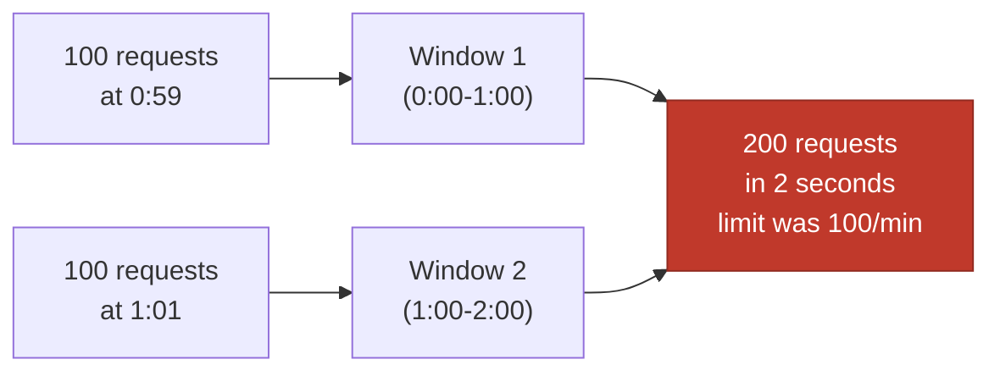

Rate limiting protects a system from being overwhelmed — by a runaway client, a scraping bot, an unintentional retry loop, or genuine excess demand — and it enforces fairness so one noisy tenant can't starve everyone else. Interviewers use it to check whether you can reason about algorithms, distributed state and graceful degradation together, since a real rate limiter touches all three.

## Why rate limit

| Goal | Example |
|---|---|
| Protection | Stop a buggy client's retry loop or a DDoS-style burst from taking the service down |
| Fairness | Prevent one tenant on a shared multi-tenant API from starving others |
| Cost control | Cap usage against a paid upstream (SMS provider, LLM API) per customer |
| Contractual tiers | Enforce a documented "1,000 requests/hour on the free plan" limit |

> [!KEY]
> Rate limiting is a resilience pattern, not a security control on its own — it complements authentication and input validation, it doesn't replace them. A determined attacker with many IPs or accounts can still exceed a per-key limit in aggregate.

## Algorithms compared

| Algorithm | How it works | Memory | Burst behaviour | Weakness |
|---|---|---|---|---|
| Fixed window | Count requests in a fixed clock interval (e.g., per-minute bucket), reset at boundary | O(1) per key | Allows up to 2× the limit right at the window boundary | Boundary burst problem |
| Sliding window log | Store a timestamp per request, count how many fall within the trailing window | O(n) per key (n = requests in window) | Perfectly accurate | Memory grows with request rate |
| Sliding window counter | Weighted average of current and previous fixed windows | O(1) per key | Smooths the boundary burst, approximate | Slight inaccuracy, but usually acceptable |
| Token bucket | Bucket refills at a fixed rate, each request consumes a token, requests fail when empty | O(1) per key | Allows controlled bursts up to bucket capacity | Needs careful capacity/refill tuning |
| Leaky bucket | Requests queue and are processed at a fixed output rate | O(queue size) | Smooths bursts into a constant rate, adds latency | Not ideal when you want to reject fast, not queue |

> [!TIP]
> Token bucket is the default choice for most APIs because it naturally allows short bursts (a user who was idle for a while can burst up to the bucket size) while still enforcing a steady-state rate — that "allows reasonable bursts, still caps average rate" behaviour matches real client traffic patterns better than a rigid fixed window.

### The fixed-window boundary problem, visualised



A client can send the full limit right before a window boundary and again right after, getting 2× the intended rate in a couple of seconds — this is exactly what sliding window counter and token bucket approaches avoid.

## Where to enforce rate limits

| Layer | Pros | Cons |
|---|---|---|
| API gateway / edge (Kong, Envoy, Azure API Management, NGINX) | Centralised, protects every backend behind it, no code change per service | Coarse-grained, may not know business-specific limits (per-plan, per-feature) |
| Application middleware | Business-aware (per-tenant plan, per-endpoint cost) | Duplicated across every service unless shared as a library |
| Both | Gateway absorbs cheap, coarse abuse before it reaches services; app enforces fine-grained business rules | More moving parts to keep consistent |

A common production pattern: a coarse IP-based limit at the gateway to blunt obvious abuse cheaply, and a precise per-API-key/per-plan limit in the application layer where business context (subscription tier, endpoint cost weighting) is available.

## Distributed rate limiting with Redis

A single-instance in-memory counter doesn't work once you have more than one server — each replica would enforce its own independent limit, silently multiplying the effective allowed rate by the replica count. Redis (or another shared store) gives every replica a consistent view of the counter.

The atomicity problem: reading the current count, checking it against the limit, and incrementing it are three separate steps — if not atomic, two concurrent requests can both read the same "under limit" count and both proceed, letting the effective rate exceed the limit. The fix is a Lua script executed atomically by Redis (`EVAL`), so the whole check-and-increment happens as one indivisible operation:

```lua
-- KEYS[1] = rate limit key, ARGV[1] = limit, ARGV[2] = window seconds
local current = redis.call("INCR", KEYS[1])
if current == 1 then
    redis.call("EXPIRE", KEYS[1], ARGV[2])
end
if current > tonumber(ARGV[1]) then
    return 0 -- reject
end
return 1 -- allow
```

```csharp
var script = LuaScript.Prepare(luaScriptText);
var result = (int)await _redisDb.ScriptEvaluateAsync(script, new
{
    KEYS = new RedisKey[] { $"rl:{apiKey}:{windowStart}" },
    ARGV = new RedisValue[] { limit, windowSeconds }
});
bool allowed = result == 1;
```

> [!DANGER]
> Doing `GET`, then compare in application code, then `INCR` as three separate Redis calls is a classic race condition — two requests can both `GET` the same value before either `INCR`s, both pass the check, and the true rate ends up above the configured limit. Always push the check-and-increment into a single atomic operation (Lua script, or Redis's built-in `INCR`+`EXPIRE` pattern used carefully).

## Rate limit keys — per-user, per-IP, per-tenant

| Key | Use case | Risk |
|---|---|---|
| Per-IP | Anonymous/public endpoints, login attempts | NATs and corporate proxies share one IP across many real users |
| Per-user/API key | Authenticated APIs, per-account fairness | Requires authentication to have already happened |
| Per-tenant | Multi-tenant SaaS, isolate noisy-neighbour tenants | Needs tenant resolution before the limiter runs |
| Per-endpoint plus caller key | Expensive endpoints (search, export) need tighter limits than cheap ones (`GET /health`) | More keys to track and tune |

> [!TIP]
> Layer keys rather than picking just one: a login endpoint often needs *both* a per-IP limit (stop credential-stuffing from one source) and a per-account limit (stop one compromised account from being hammered from many IPs).

## 429 responses and headers

```http
HTTP/1.1 429 Too Many Requests
Retry-After: 30
X-RateLimit-Limit: 100
X-RateLimit-Remaining: 0
X-RateLimit-Reset: 1719840000
```

- `Retry-After` — seconds (or an HTTP date) to wait before retrying; well-behaved clients back off using this instead of guessing.
- `X-RateLimit-Limit` / `-Remaining` / `-Reset` — not standardized in an RFC but a widely-adopted convention, letting clients self-throttle *before* hitting 429 at all.

## Graceful degradation

Rate limiting shouldn't be a hard binary wall in every case. Options that keep the system usable under pressure:

- Return `429` for the offending caller while continuing to serve everyone else normally (the whole point of per-key limiting).
- For internal callers/critical paths, prefer shedding low-priority requests first (a queue with priority) rather than a flat limit that treats all traffic equally.
- Provide a burst allowance so a legitimate spike (a user re-opening an app after being offline) doesn't immediately trip the limiter.
- Fail open, not closed, if the rate limiter's backing store (Redis) is unavailable — a rate limiter outage should not become a total service outage; log the failure and let traffic through, or fall back to a coarser local limit.

## C# sample — token bucket middleware sketch

```csharp
public class TokenBucketRateLimiter
{
    private readonly IDatabase _redis;
    private const int Capacity = 20;
    private const double RefillPerSecond = 5.0;

    public TokenBucketRateLimiter(IDatabase redis) => _redis = redis;

    public async Task<bool> TryAcquireAsync(string key)
    {
        var now = DateTimeOffset.UtcNow.ToUnixTimeMilliseconds();
        var script = @"
            local tokens = tonumber(redis.call('HGET', KEYS[1], 'tokens') or ARGV[1])
            local last = tonumber(redis.call('HGET', KEYS[1], 'ts') or ARGV[3])
            local elapsed = (tonumber(ARGV[3]) - last) / 1000.0
            tokens = math.min(tonumber(ARGV[1]), tokens + elapsed * tonumber(ARGV[2]))
            local ttl = math.ceil((tonumber(ARGV[1]) / tonumber(ARGV[2])) * 2)
            if tokens < 1 then
                redis.call('HSET', KEYS[1], 'tokens', tokens, 'ts', ARGV[3])
                redis.call('EXPIRE', KEYS[1], ttl)
                return 0
            end
            tokens = tokens - 1
            redis.call('HSET', KEYS[1], 'tokens', tokens, 'ts', ARGV[3])
            redis.call('EXPIRE', KEYS[1], ttl)
            return 1";
        var result = (int)await _redis.ScriptEvaluateAsync(script,
            new RedisKey[] { $"bucket:{key}" },
            new RedisValue[] { Capacity, RefillPerSecond, now });
        return result == 1;
    }
}
```

## Cheat sheet

- Token bucket is the go-to default: allows bursts up to capacity, enforces a steady average rate.
- Fixed window is simplest but allows up to 2× the limit right at window boundaries.
- Sliding window counter approximates a true sliding window at O(1) memory — the practical middle ground.
- Enforce coarse limits at the gateway/edge, fine-grained business limits in the application layer.
- Distributed rate limiting needs a shared store (Redis) and an atomic check-and-increment (Lua script), never separate GET/INCR calls.
- Layer keys: per-IP for anonymous abuse, per-account for authenticated fairness, per-tenant for SaaS isolation.
- Always return `Retry-After` and the `X-RateLimit-*` headers on both 429s and normal responses so clients can self-throttle.
- Fail open if the limiter's backing store goes down — don't let a rate limiter outage become a full outage.

## Common mistakes

| Mistake | Fix |
|---|---|
| Using GET-then-INCR as two separate Redis calls | Use an atomic Lua script or Redis's atomic primitives |
| Rate limiting only by IP for an authenticated API | Add a per-account/per-API-key limit too; IPs are shared behind NATs |
| Fixed window with no smoothing | Use sliding window counter or token bucket to avoid the boundary-burst problem |
| Returning 429 with no `Retry-After` | Always include it so clients back off correctly instead of hammering harder |
| Local in-memory counters on a multi-replica deployment | Move to a shared store (Redis) so all replicas see the same count |
| Rate limiter outage takes down the whole API | Fail open (allow traffic) if the backing store is unavailable, and alert |

## Summary

Rate limiting protects a system and enforces fairness by capping how often a caller can act within a window, and the algorithm you pick trades off memory cost, accuracy and burst tolerance — token bucket is the common default because it allows short bursts while capping the steady-state rate. Enforcing it correctly at scale means solving a distributed systems problem: multiple replicas need a shared source of truth (Redis) and an atomic check-and-increment, usually via a Lua script, or you silently multiply your effective limit by the replica count. Combine keys (IP, account, tenant) for layered protection, always respond to violations with `429` plus `Retry-After` and `X-RateLimit-*` headers, and make sure the limiter itself failing doesn't take down the service it's meant to protect.

## Top Interview Questions

### Q1. Why is fixed-window rate limiting prone to allowing bursts above the configured limit?

Fixed window counts requests within a rigid clock-aligned interval (say, per calendar minute) and resets to zero at the boundary. A client can send the full limit of requests in the last second of one window, and immediately send the full limit again in the first second of the next window — from the client's perspective it burst at up to 2× the intended rate within a couple of seconds, even though each individual window's count never technically exceeded the limit. Sliding window counter or token bucket approaches smooth this out because they don't have a hard reset point.

### Q2. Compare token bucket and leaky bucket. When would you pick one over the other?

Token bucket allows a request to proceed immediately as long as a token is available, and the bucket refills at a steady rate up to a capacity — this lets a client that's been idle burst up to the bucket size, then settle into the steady-state rate, which matches how real traffic (a user opening an app after being offline) actually behaves. Leaky bucket instead queues incoming requests and processes them at a constant output rate regardless of how bursty the input is, smoothing traffic into a steady stream but adding queueing latency and requiring a bounded queue (or you drop excess requests instead of rejecting them immediately). Pick token bucket when you want to reject excess requests immediately and allow legitimate bursts; pick leaky bucket when you specifically need to shape traffic into a constant rate downstream (e.g., protecting a fixed-throughput backend).

### Q3. Why does a naive Redis-based rate limiter using separate GET and INCR calls have a race condition, and how do you fix it?

If a request first `GET`s the current count, checks it against the limit in application code, and only then calls `INCR`, two concurrent requests can both execute the `GET` and see the same "under limit" value before either has incremented it — both then proceed, and the true count ends up one (or more, under higher concurrency) above what the limit should have allowed. The fix is to make the check-and-increment a single atomic operation from Redis's point of view: a Lua script executed via `EVAL` runs entirely on the Redis server without interleaving with other clients' commands, so the increment and the limit check happen as one indivisible step.

### Q4. Why is rate limiting per-IP not sufficient for an authenticated API?

Many real users can share a single public IP address — behind a corporate NAT, a university network, or a mobile carrier's IP pool — so a per-IP limit can either unfairly throttle many legitimate users sharing that IP, or fail to catch a single account being abused from many different IPs (e.g., a botnet or credential-stuffing attack rotating source addresses). For authenticated APIs, a per-account or per-API-key limit is the more meaningful boundary since it directly maps to the actual customer/tenant the business cares about protecting or capping; a robust design often layers both — per-IP to blunt anonymous abuse before authentication, per-account afterward for fairness.

### Q5. What headers should a rate-limited API return, and what's each one for?

`Retry-After` tells the client how many seconds (or an absolute date) to wait before retrying, giving well-behaved clients a concrete backoff signal instead of guessing or hammering immediately. `X-RateLimit-Limit` communicates the configured ceiling for the current window, `X-RateLimit-Remaining` how many requests are left before hitting it, and `X-RateLimit-Reset` when the window resets (often a Unix timestamp) — these aren't part of an official RFC but are a widely adopted de facto standard, and returning them on *every* response (not just 429s) lets clients self-throttle proactively before ever being rejected.

### Q6. How would you design rate limiting across multiple replicas of a service behind a load balancer?

An in-memory counter local to each replica doesn't work, because the load balancer distributes requests across replicas somewhat randomly, so each replica would only ever see a fraction of a given client's traffic and independently allow up to the configured limit — effectively multiplying the true allowed rate by the number of replicas. The fix is a shared, external store (typically Redis) that every replica consults, with the check-and-increment performed atomically (a Lua script) so concurrent requests hitting different replicas at the same instant still see a single consistent, correctly-incrementing counter.

### Q7. Your rate limiter's Redis backing store becomes unavailable. What should happen to API traffic, and why?

The rate limiter should fail open — allow requests through (possibly with a fallback to a coarser, local in-process limit as a safety net) rather than failing closed and rejecting all traffic, because a rate limiter's job is to protect the service from *excess* load, and turning a Redis outage into a full API outage is a far worse outcome than temporarily running without precise rate limiting. This should be paired with alerting so the team knows the limiter is degraded and can restore Redis quickly, and ideally a circuit breaker so the application doesn't also grind to a halt retrying a downed Redis on every single request.

### Q8. How would you rate limit differently for a free tier versus a paid tier of the same API?

Key the limiter by account/API key rather than IP so each customer's usage is tracked independently, and store the applicable limit (requests per minute/hour, burst capacity) as part of that account's plan metadata rather than hardcoding a single global value — the middleware looks up the caller's plan on each request (or caches it briefly) and applies the corresponding token bucket capacity and refill rate. This also naturally supports tiered burst allowances: a paid tier might get a larger bucket capacity to smooth out legitimate spiky usage, while the free tier gets a smaller, stricter bucket.

### Q9. A specific endpoint (a bulk export) is much more expensive than others but shares the same per-minute request limit. How would you address this?

A flat "N requests per minute" limit treats a cheap `GET /health` call the same as an expensive bulk export, which isn't representative of actual load — the fix is to weight requests by cost rather than counting them uniformly: assign the export endpoint a higher "token cost" per call (e.g., consuming 10 tokens from the bucket instead of 1), or maintain a separate, stricter bucket keyed specifically to that endpoint alongside the general per-account bucket. This lets you cap genuinely expensive operations tightly without over-restricting cheap, frequent ones under the same overall budget.

### Q10. How would you rate limit a login endpoint to prevent credential-stuffing without locking out legitimate users?

Layer multiple keys: a per-IP limit catches a single source hammering many different accounts (classic credential stuffing from one bot), while a per-account limit catches many different sources targeting one specific account (a distributed attack against a single high-value target) — neither alone is sufficient, since an attacker rotating IPs evades the first and one rate-limited-by-IP legitimate user retrying their own password evades needing the second. I'd also add a short exponential backoff or CAPTCHA challenge after a few failed attempts rather than an outright block, and make sure successful logins reset or don't count against the failed-attempt counter, so a legitimate user who mistypes their password twice then succeeds isn't penalized.

### Q11. What's the trade-off between sliding window log and sliding window counter algorithms?

Sliding window log stores an actual timestamp for every request within the trailing window and counts exactly how many fall inside it on each check, giving perfectly accurate enforcement of the limit — but memory usage grows with the request rate itself (a high-traffic key could store thousands of timestamps), which doesn't scale well under heavy load. Sliding window counter approximates this with O(1) memory by taking a weighted average of the current and previous fixed windows' counts (weighted by how far into the current window you are), trading a small amount of accuracy for constant memory regardless of traffic volume — in practice this approximation is close enough that it's the preferred middle ground over the log-based approach for high-throughput systems.

### Q12. How would you test that a rate limiter is actually enforcing the correct limit in a distributed deployment, without a full load test environment?

Run a targeted integration test that spins up multiple concurrent worker tasks (simulating multiple replicas) all hitting the shared Redis-backed limiter with the same key simultaneously, and assert that the total number of "allowed" responses across all workers never exceeds the configured limit for that window, even under heavy concurrency — this specifically exercises the atomicity of the check-and-increment operation, which is where race conditions hide. I'd also add a test that intentionally sends requests spanning a window boundary to confirm the algorithm's boundary behaviour matches expectations (e.g., confirming a sliding window counter smooths the burst that a fixed window would allow), rather than trusting the algorithm choice in a design doc alone.
