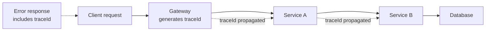

Every request that reaches your API is either well-formed and permitted, or it isn't — and where you check that, how consistently you report failures, and how much internal detail you leak in the process are all things interviewers probe to see if you've actually run an API in production versus just built one that works on the happy path.

## Where to validate

| Layer | Checks | Example |
|---|---|---|
| Edge (gateway/API layer) | Malformed syntax, auth, request size, content type | Invalid JSON, missing bearer token, oversized payload |
| Application (model binding) | Required fields, types, ranges, formats | `email` must be a valid email, `age` must be a positive integer |
| Domain (business rules) | Rules that depend on state or cross-field logic | "cannot cancel an order that already shipped" |
| Database (constraints) | Last line of defence — uniqueness, foreign keys, not-null | Duplicate email violates a unique index |

> [!KEY]
> Fail fast, and fail at the cheapest layer that can catch the problem. A malformed JSON body should never reach your domain layer; a business-rule violation should never be caught only by a database constraint throwing an exception you have to translate after the fact.

## Model validation vs business rule validation

Model (or input) validation asks "is this request shaped correctly" — types, required fields, string length, format (email, URL). Business rule validation asks "is this request allowed given the current state of the system" — it usually needs a database read or domain knowledge the model alone doesn't have.

```csharp
public class CreateOrderRequest
{
    [Required]
    public string CustomerId { get; set; } = default!;

    [Range(1, 100)]
    public int Quantity { get; set; }
}
```

That attribute-based check runs before the request ever reaches your handler. But "this customer's account is suspended" or "this SKU is out of stock" can only be answered by asking the domain — that validation belongs in the service/domain layer, not a data annotation.

> [!TIP]
> A senior answer draws this line explicitly: *"Model validation is about syntax and shape, and I'd fail those with 400. Business rule validation is about semantics given current state, and I'd fail those with 422 or 409, from the domain layer, not the DTO."*

## RFC 7807 Problem Details

Instead of inventing a bespoke error JSON shape per API, RFC 7807 standardizes one:

```json
{
  "type": "https://example.com/probs/insufficient-stock",
  "title": "Insufficient stock",
  "status": 422,
  "detail": "Only 2 units of SKU-4471 are available, 5 were requested.",
  "instance": "/orders",
  "traceId": "00-4bf92f3577b34da6a3ce929d0e0e4736-00f067aa0ba902b7-01"
}
```

| Field | Meaning |
|---|---|
| `type` | A URI identifying the error category (doesn't have to resolve to a real page) |
| `title` | Short, human-readable summary, stable across occurrences |
| `status` | The HTTP status code, duplicated in the body for convenience |
| `detail` | Specific, human-readable explanation of *this* occurrence |
| `instance` | The specific request/resource URI involved |

ASP.NET Core generates this automatically via `ProblemDetails` for validation failures and unhandled exceptions when configured, which keeps error shape consistent without every controller building its own.

## A consistent error envelope

Whether you use RFC 7807 or a custom shape, the property is what matters: **every** error response, from every endpoint, has the same top-level structure, so client code can handle errors generically instead of special-casing each endpoint.

```json
{
  "error": {
    "code": "VALIDATION_FAILED",
    "message": "One or more fields are invalid.",
    "details": [
      { "field": "email", "issue": "must be a valid email address" },
      { "field": "quantity", "issue": "must be between 1 and 100" }
    ],
    "traceId": "00-4bf92f35-00f067aa-01"
  }
}
```

## Error codes vs messages

| | Purpose | Audience |
|---|---|---|
| Error code (`INSUFFICIENT_STOCK`) | Stable, machine-readable, safe to branch logic on | Client code |
| Error message | Human-readable explanation, may be localised | End user / support |

> [!WARNING]
> Never make client logic branch on the *message* string — messages get reworded, retranslated, or have details interpolated in, and any of those silently breaks client code that was string-matching on them. Always expose a stable `code` for programmatic handling and keep `message` purely for display.

## Never leak internals

A raw exception message or stack trace in a response can leak SQL schema, internal file paths, library versions, or even connection strings — all useful reconnaissance for an attacker, and none of it useful to a legitimate client.

> [!DANGER]
> Returning `ex.Message` or `ex.ToString()` directly to the client in a production environment is one of the most common real-world security findings in API reviews. Always map exceptions to a sanitised, generic message for the client, and log the full detail (including stack trace) server-side only.

## Global exception handling middleware in ASP.NET Core

```csharp
public class ExceptionHandlingMiddleware
{
    private readonly RequestDelegate _next;
    private readonly ILogger<ExceptionHandlingMiddleware> _logger;

    public ExceptionHandlingMiddleware(RequestDelegate next, ILogger<ExceptionHandlingMiddleware> logger)
    {
        _next = next;
        _logger = logger;
    }

    public async Task InvokeAsync(HttpContext context)
    {
        try
        {
            await _next(context);
        }
        catch (Exception ex)
        {
            var (status, code, message) = MapException(ex);
            _logger.LogError(ex, "Unhandled exception. TraceId={TraceId}", context.TraceIdentifier);

            context.Response.StatusCode = status;
            context.Response.ContentType = "application/problem+json";
            await context.Response.WriteAsJsonAsync(new
            {
                type = $"https://example.com/probs/{code}",
                title = message,
                status,
                traceId = context.TraceIdentifier
            });
        }
    }

    private static (int Status, string Code, string Message) MapException(Exception ex) => ex switch
    {
        ValidationException => (400, "validation-failed", "One or more fields are invalid."),
        NotFoundException => (404, "not-found", "The requested resource was not found."),
        DomainRuleException dre => (422, "business-rule-violation", dre.Message), // safe, user-facing message
        ConflictException => (409, "conflict", "The request conflicts with the current state."),
        _ => (500, "internal-error", "An unexpected error occurred.") // never leak ex.Message here
    };
}
```

Register it first in the pipeline so it wraps everything downstream:

```csharp
app.UseMiddleware<ExceptionHandlingMiddleware>();
app.UseRouting();
```

## Mapping exceptions to status codes

| Exception type | Status | Notes |
|---|---|---|
| Model/DTO validation failure | 400 | Malformed shape |
| Not found | 404 | Resource doesn't exist |
| Domain rule violation | 422 | Well-formed, fails a business rule |
| Optimistic concurrency conflict | 409 | Someone else changed it first |
| Authorization failure | 403 | Authenticated but not permitted |
| Unhandled/unexpected | 500 | Log full detail, return generic message |

## Correlation IDs

Every error response (and ideally every response, error or not) should carry a correlation/trace ID, generated at the edge and propagated through every downstream call. When a customer reports "I got an error at 2:14pm," support can find the exact request across every service's logs using that one ID, instead of guessing from a timestamp and a vague description.



## Localisation

Error `message` fields intended for end users should respect `Accept-Language` where the product supports multiple locales — resolve the message template server-side using the stable error `code` as the lookup key, never by translating a hardcoded English string on the client. The `code` itself stays in English/stable regardless of locale; only the human-facing `message` is localised.

## Cheat sheet

- Validate at the cheapest layer that can catch the problem: syntax at the edge, shape via model binding, semantics in the domain.
- Model validation → 400. Business rule validation → 422 or 409. Don't conflate them.
- Adopt one consistent error envelope (RFC 7807 or your own) across every endpoint.
- Expose a stable `code` for client logic; keep `message` for humans, and localise it, never the code.
- Never return raw exception messages or stack traces to clients — log them server-side, return a generic sanitised message.
- A single global exception-handling middleware, registered first in the pipeline, keeps error mapping in one place.
- Every error response should carry a correlation/trace ID that's propagated across services.
- Fail fast — validate as early as possible, don't let a bad request travel deep into the system before rejecting it.

## Common mistakes

| Mistake | Fix |
|---|---|
| Returning `ex.Message`/stack trace to the client | Map to a sanitised message; log full detail server-side only |
| Every controller building its own error JSON shape | Standardise on one envelope (RFC 7807 or custom) across the API |
| Client code branching on the error `message` string | Expose a stable `code`; keep `message` for display only |
| Doing business-rule validation only via a DB constraint exception | Validate explicitly in the domain layer with a clear, mapped error |
| No correlation ID in error responses | Generate one at the edge, propagate and log it everywhere |
| Returning 500 for a validation failure | Reserve 500 for genuinely unexpected server faults |

## Summary

Validation belongs at multiple layers — syntax at the edge, shape via model binding, semantics in the domain — and each layer should fail fast with a status code that matches what actually went wrong (400 for malformed input, 422/409 for business-rule violations). A single, consistent error envelope, ideally RFC 7807's `type`/`title`/`status`/`detail` shape, lets clients handle errors generically, and a stable machine-readable `code` alongside a human `message` keeps client logic robust to wording and localisation changes. A global exception-handling middleware centralises exception-to-status mapping in one place, ensures internal details never leak to clients, and — combined with a propagated correlation ID — makes production incidents traceable across every service an error passed through.

## Top Interview Questions

### Q1. Where in a layered application should validation happen, and why not just do it all in one place?

Validation should happen at the cheapest layer capable of catching the problem: malformed syntax and auth failures at the edge before any business code runs, required-field/type/format checks during model binding, and cross-field or state-dependent business rules in the domain layer where the necessary context (current state, related entities) is actually available. Doing it all in one place either forces the domain layer to also parse raw, unvalidated input (mixing concerns and duplicating what model binding already does for free), or forces the edge to somehow know business rules it has no business knowing — splitting by layer keeps each concern testable and keeps failures cheap, since you reject bad input before it does any real work.

### Q2. What's the difference between model validation and business rule validation, and what status codes should each produce?

Model validation checks that the request is *shaped* correctly — required fields present, correct types, values within a declared range or format — and can be fully determined from the request alone, independent of any system state; it should produce a 400 Bad Request. Business rule validation checks that the request is *allowed* given the current state of the system — "this order can't be cancelled because it already shipped," "this SKU has insufficient stock" — which requires reading domain state, and should produce a 422 Unprocessable Entity (or 409 Conflict if it's specifically a concurrency/state clash). Conflating the two, e.g., putting a stock-availability check in a data annotation, either doesn't work (annotations can't easily query a database) or blurs the status code you return.

### Q3. What is RFC 7807 Problem Details, and why would you adopt it instead of a custom error format?

RFC 7807 standardizes a JSON (or XML) shape for HTTP API errors with fields `type` (a URI identifying the error category), `title` (a stable summary), `status` (the HTTP status code), `detail` (specifics of this occurrence), and `instance` (the specific resource/request involved). Adopting it instead of inventing a custom shape means you get a format many HTTP client libraries and API gateways already understand and can parse generically, it's directly supported by ASP.NET Core's built-in `ProblemDetails` type for both validation errors and unhandled exceptions, and it removes the bikeshedding of designing your own error envelope from scratch. The actual value is consistency — whichever format you choose, using it uniformly across every endpoint is more important than which specific fields it has.

### Q4. Why should client-facing error responses expose a stable error code rather than relying on the message text?

Message text is meant for humans and is expected to change — it gets reworded for clarity, localised into other languages, or has runtime details interpolated into it — and any client code that does string matching against a message will silently break the next time copy is edited or a locale changes, often without anyone realizing the client-side error handling stopped working. A stable, machine-readable code like `INSUFFICIENT_STOCK` is a contract clients can safely branch on (e.g., show a specific "add to waitlist" button only for that code), decoupled entirely from how the accompanying message is worded or translated for display.

### Q5. Why is it dangerous to return raw exception details to API clients, and what should happen instead?

A raw exception message or stack trace can reveal internal implementation details an attacker can use for reconnaissance — database table/column names from a SQL exception, internal file paths, library versions with known vulnerabilities, or even connection details in some misconfigured cases — none of which are useful to a legitimate client trying to fix their request. Instead, a global exception handler should map every exception type to a generic, sanitised, client-safe message and the appropriate status code, while logging the full exception (message, stack trace, inner exceptions) server-side, tagged with the same correlation ID that's returned to the client, so engineers can look it up without exposing it.

### Q6. Walk through how you'd implement global exception handling in an ASP.NET Core API.

Register a single middleware early in the pipeline (before routing/authorization) that wraps the rest of the pipeline in a try/catch — when an exception bubbles up uncaught from anywhere downstream, the middleware catches it, maps the exception's concrete type to an HTTP status code and a sanitised message/code via a switch expression (e.g., `ValidationException` → 400, `NotFoundException` → 404, unrecognized exceptions → 500 with a generic message), logs the full exception with the request's trace ID, and writes a consistent `application/problem+json` response body. This keeps exception-to-status mapping in exactly one place instead of scattered try/catch blocks in every controller action, and guarantees every unhandled error, regardless of source, produces the same consistent client-facing shape.

### Q7. Why should you never let a database constraint violation be the only place a business rule is enforced?

Relying solely on the database to reject an invalid state (e.g., a unique constraint catching a duplicate email) means the failure surfaces as a low-level exception (often something like a `DbUpdateException` wrapping a provider-specific SQL exception) deep in your data access code, which is awkward to map cleanly to a client-facing error and easy to leak details from if not carefully caught. It's also often too late — by the time the database rejects it, you may have already done other work in the same request that now needs to be rolled back or compensated for. The constraint should exist as a safety net for data integrity, but the actual validation (checking for an existing email before attempting to insert) belongs explicitly in the domain/application layer, where it can be reported clearly and early.

### Q8. What's the point of a correlation/trace ID in error responses, and how would you propagate one across services?

A correlation ID is a unique identifier generated once per incoming request (usually at the edge/gateway) that gets attached to every log line and every response related to that request, including error responses — its purpose is to let you go from "a customer says they saw an error around 2pm" to the exact request across every service and log store it touched, without guessing from timestamps alone. Propagation typically means generating it (or accepting an incoming `traceparent`/`X-Request-Id` header) at the edge, then passing it along as a header on every downstream HTTP call or message the request triggers, and including it in every structured log statement and in the error response body so the client can report it back to support.

### Q9. A client reports intermittent 500 errors, but your logs show no exceptions around that time. How would you approach debugging this with the error-handling design described above?

First check whether the correlation ID the client reports (assuming your error responses include one) actually appears anywhere in your logs — if it doesn't, the request may never have reached your application at all, pointing at an upstream layer (load balancer, gateway, CDN, a timeout at a proxy) generating its own 500 independently of your code. If it does appear but without a corresponding exception log entry, check whether the global exception middleware itself is correctly wired to catch exceptions thrown *before* it in the pipeline (e.g., in earlier middleware like authentication) or exceptions thrown in a background task/fire-and-forget call that never flows back through the middleware's try/catch at all — those are common gaps where errors happen but the standard handling path never sees them.

### Q10. How would you handle localisation of error messages without breaking client logic that depends on error codes?

Keep the error `code` as a stable, English/locale-independent identifier that never changes based on the caller's locale — it's the contract clients program against. Resolve the human-readable `message` field server-side by looking up a translation keyed on that same `code` plus the request's `Accept-Language` header (or a resource file per locale), so the localised text is generated fresh per request rather than baked into a single hardcoded string. This way, a client can always safely check `error.code == "INSUFFICIENT_STOCK"` regardless of what language the accompanying `message` happens to be displayed in for that user.

### Q11. Your API currently returns 400 for both "the JSON is malformed" and "the discount code has expired." A reviewer flags this. What's the concern, and how do you fix it?

Conflating the two loses meaningful information: "malformed JSON" is a client bug in constructing the request that no amount of retrying with the same logic will fix, whereas "the discount code has expired" is a legitimate, well-formed request that fails a business rule dependent on system state — these deserve different status codes (400 for the former, 422 for the latter) so that client error-handling code, monitoring dashboards, and retry logic can distinguish "you sent something invalid" from "your request was fine, but here's why the operation itself can't proceed." The fix is to route model/shape validation failures through 400 and domain rule failures through a distinct domain exception type that the global handler maps to 422, keeping the two failure classes visibly separate in both the status code and the error `code` field.

### Q12. How would you design validation for an endpoint that accepts a large batch of records, some of which are valid and some invalid?

Rather than failing the whole batch on the first invalid record (which is frustrating for the client and wastes the valid records' processing), validate every record up front and return a structured response that separates successes from failures — for example, process and persist the valid records, and return a 207-style or 200 response body listing which indices/IDs succeeded and which failed with a `code`/`detail` per failure, similar to how bulk APIs from providers like Stripe or Elasticsearch's bulk endpoint report partial results. This requires the error envelope to support an array of errors rather than a single one, and the client contract needs to be explicit that a 2xx status doesn't necessarily mean every item in the batch succeeded — it means the batch was processed and the body describes the per-item outcome.
