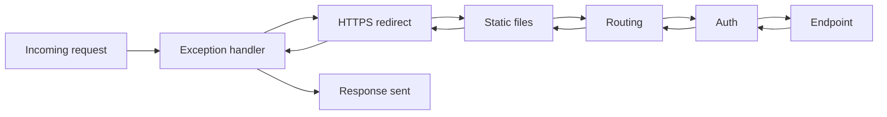

Every ASP.NET Core request travels through a pipeline of middleware components before it produces a response. Understanding this pipeline — what runs, in what order, and why — is one of the fastest ways to separate someone who has configured `Program.cs` from someone who understands the framework underneath it.

## The pipeline as a chain of delegates

Middleware is just a function that takes a `HttpContext` and a reference to "the next thing", does some work, optionally calls that next thing, and optionally does more work on the way back out. The runtime wires these into a single nested delegate chain built at startup.



The arrows going back show the key idea: middleware is **onion-shaped**. Code before `await next(context)` runs on the way in; code after it runs on the way out, in reverse order. This is why an exception filter registered first can catch errors thrown by everything downstream — it wraps the entire rest of the pipeline.

> [!KEY]
> Middleware order is not a style choice — it changes behaviour. A component can only act on what already ran before it, and it only sees the response after everything after it has run.

## Use, Run and Map

`IApplicationBuilder` exposes three registration verbs with different intents.

| Method | Behaviour | Typical use |
|---|---|---|
| `Use` | Runs, then optionally calls `next` | Most middleware — logging, auth, custom checks |
| `Run` | Terminal — never calls `next` | Last component in a branch, e.g. a fallback 404 |
| `Map` / `MapWhen` | Branches the pipeline based on path or predicate | Splitting behaviour for a path prefix like `/admin` |

```csharp
app.Use(async (context, next) =>
{
    // before: runs on the way in
    await next(context);
    // after: runs on the way out
});

app.MapWhen(ctx => ctx.Request.Path.StartsWithSegments("/admin"), branch =>
{
    branch.UseMiddleware<AdminOnlyMiddleware>();
    branch.Run(async ctx => await ctx.Response.WriteAsync("admin area"));
});
```

`Map` creates a genuinely separate branch — middleware registered inside it does not run for requests outside that path, which is useful for isolating expensive or sensitive components.

## Order matters: the canonical pipeline

The default ASP.NET Core template orders middleware for a reason — each component depends on invariants set up by the ones before it.

| Order | Middleware | Why it goes here |
|---|---|---|
| 1 | Exception handler / `UseExceptionHandler` | Must wrap everything else to catch downstream failures |
| 2 | HSTS | Set the header before any redirect or content is sent |
| 3 | HTTPS redirection | Redirect before anything reads the request as HTTP |
| 4 | Static files | Serve early, skip the cost of routing and auth for assets |
| 5 | Routing (`UseRouting`) | Must run before auth so auth can see the matched endpoint's metadata |
| 6 | CORS | Needs to run after routing (to know the endpoint) but before auth checks |
| 7 | Authentication | Establishes `HttpContext.User` |
| 8 | Authorization | Needs `User` from authentication and the endpoint from routing |
| 9 | Endpoint execution (`MapControllers`, etc.) | The actual handler |

> [!WARNING]
> Putting `UseAuthentication`/`UseAuthorization` before `UseRouting` is a very common mistake. Authorization middleware reads endpoint metadata (like `[Authorize]` attributes) that routing attaches to the context — if routing hasn't run yet, there is nothing to authorize against and the check silently no-ops.

## Writing custom middleware

There are two supported styles.

**Convention-based** — a plain class with a constructor taking `RequestDelegate next` and an `InvokeAsync`/`Invoke` method. No interface required; the runtime finds the method by reflection.

```csharp
public class RequestTimingMiddleware
{
    private readonly RequestDelegate _next;
    private readonly ILogger<RequestTimingMiddleware> _logger;

    public RequestTimingMiddleware(RequestDelegate next, ILogger<RequestTimingMiddleware> logger)
    {
        _next = next;
        _logger = logger;
    }

    public async Task InvokeAsync(HttpContext context)
    {
        var sw = Stopwatch.StartNew();
        await _next(context);
        _logger.LogInformation("{Path} took {Ms}ms", context.Request.Path, sw.ElapsedMilliseconds);
    }
}
```

**`IMiddleware`** — implement the interface explicitly, and the middleware is resolved through DI per request rather than constructed once at startup. Use this when the middleware itself needs a scoped dependency, since convention-based middleware is instantiated **once** as a singleton and cannot safely hold scoped state in its constructor.

```csharp
public class TenantResolverMiddleware : IMiddleware
{
    private readonly ITenantContext _tenantContext; // scoped, injected per request

    public TenantResolverMiddleware(ITenantContext tenantContext) => _tenantContext = tenantContext;

    public async Task InvokeAsync(HttpContext context, RequestDelegate next)
    {
        _tenantContext.TenantId = context.Request.Headers["X-Tenant-Id"];
        await next(context);
    }
}
// registration: services.AddTransient<TenantResolverMiddleware>();
```

## Short-circuiting and terminal middleware

A middleware short-circuits by simply **not calling `next`** — it writes a response and returns. This is normal and intentional: an auth check that rejects a request, a rate limiter that returns `429`, or `Run` at the end of a branch are all short-circuits.

> [!TIP]
> A senior answer names the risk: if you short-circuit *after* some middleware already wrote to the response (e.g. started streaming), you can get `InvalidOperationException: headers already sent`. Always short-circuit as early in the branch as possible.

## Middleware vs filters vs handlers

These three are often confused because they all "wrap" a request, but they operate at different layers.

| Concept | Scope | Sees MVC concepts (model binding, action)? | Typical use |
|---|---|---|---|
| Middleware | Whole pipeline, every request | No — only `HttpContext` | Cross-cutting: logging, auth, CORS, exception handling |
| MVC filter (`IActionFilter`, etc.) | Controller/action pipeline only | Yes — model, action arguments, result | Validation, response shaping, per-action logic |
| `DelegatingHandler` | Outgoing `HttpClient` requests | N/A — client side | Adding auth headers, retry, logging on outbound calls |

A filter cannot run for a static file request because static files never reach MVC; middleware runs for everything that enters the pipeline, MVC or not.

## Accessing services in middleware and the scoped-service trap

Convention-based middleware classes are constructed **once**, at startup, as effectively singletons. If you inject a scoped service (like a `DbContext`) directly into the constructor, you capture one instance for the app's entire lifetime — a bug that often only shows up under concurrent load as data corruption or `ObjectDisposedException`.

```csharp
// Wrong: DbContext injected into the singleton middleware constructor
public class BadMiddleware
{
    private readonly AppDbContext _db; // captured once, reused across all requests
    public BadMiddleware(RequestDelegate next, AppDbContext db) { _db = db; }
}

// Right: resolve the scoped service per request from HttpContext.RequestServices
public async Task InvokeAsync(HttpContext context)
{
    var db = context.RequestServices.GetRequiredService<AppDbContext>();
    // use db here, scoped correctly to this request
    await _next(context);
}
```

> [!DANGER]
> This is the same captive-dependency problem that shows up with singleton services, just wearing a middleware costume. The fix is always the same: inject `IServiceProvider`/`RequestDelegate` in the constructor, and resolve scoped services per-request via method parameters or `HttpContext.RequestServices`.

`InvokeAsync` can also take extra parameters beyond `HttpContext` — the runtime resolves them from DI **per call**, which is the idiomatic way to get scoped services into convention-based middleware without the trap above.

## Cheat sheet

- Middleware is an onion: code before `next` runs inbound, code after runs outbound, in reverse order.
- `Use` chains, `Run` terminates, `Map`/`MapWhen` branches by path or predicate.
- Canonical order: exception handler → HSTS → HTTPS redirect → static files → routing → CORS → authN → authZ → endpoints.
- Routing must come before authentication/authorization so endpoint metadata is available.
- Convention-based middleware is a singleton — never capture scoped services in its constructor.
- `IMiddleware` is resolved per-request through DI; use it when the middleware itself needs scoped state.
- Short-circuit by not calling `next`; do it before writing any response bytes.
- Middleware sees only `HttpContext`; MVC filters see model binding and action results.

## Common mistakes

| Mistake | Fix |
|---|---|
| Registering auth before routing | Always call `UseRouting()` before `UseAuthentication()`/`UseAuthorization()` |
| Injecting a scoped `DbContext` into a middleware constructor | Resolve it in `InvokeAsync` via a parameter or `HttpContext.RequestServices` |
| Assuming filters run for static files | Filters only run for requests that reach an MVC/API endpoint |
| Forgetting the exception handler must be first | It can only catch exceptions from middleware registered after it |
| Calling `next` after already writing the response body | Causes header-already-sent exceptions; short-circuit instead |
| Putting expensive middleware (e.g. full auth) ahead of static files | Serve static assets before paying for auth/routing costs |

## Summary

The ASP.NET Core pipeline is a chain of delegates, wrapped onion-style, where order determines both correctness and performance. `Use`, `Run` and `Map` give you chaining, termination and branching; the canonical order exists because later middleware depends on state set up earlier, most notably routing running before authentication and authorization. Custom middleware is easy to write but easy to misuse if you forget that convention-based instances are singletons — resolve scoped dependencies per request, not per middleware instance.

## Top Interview Questions

### Q1. What does it mean that ASP.NET Core middleware is "onion-shaped"?

Each middleware wraps the rest of the pipeline: code before `await next(context)` executes as the request travels inward, and code after it executes as the response travels back outward, in the reverse order middleware was registered. So if you register A, B, C, the execution order is A-in, B-in, C-in, (endpoint), C-out, B-out, A-out. This is why an exception-handling middleware registered first can catch exceptions thrown anywhere downstream — it is the outermost layer of the onion and its `catch` block wraps every layer inside it.

### Q2. Why must `UseRouting` be called before `UseAuthentication` and `UseAuthorization`?

Routing matches the incoming URL to an endpoint and attaches that endpoint's metadata — including `[Authorize]` attributes and policy requirements — to `HttpContext`. Authorization middleware reads that metadata to decide whether to allow the request. If authorization runs before routing, there is no endpoint metadata to inspect yet, so the check either throws or silently passes everything through, effectively disabling authorization. Authentication technically only needs to run before authorization (to populate `HttpContext.User`), but the template places both after routing and before endpoint execution to keep the contract simple and consistent.

### Q3. What is the difference between `Use`, `Run` and `Map`?

`Use` registers middleware that can call `next` to continue the pipeline — it is the general-purpose building block. `Run` registers terminal middleware that never calls `next`; it is meant to be the last thing in a pipeline or branch, such as a catch-all 404 handler. `Map` and `MapWhen` create a **branch**: requests matching a path prefix or predicate are routed into a separate sub-pipeline with its own middleware, while requests that don't match skip that branch entirely. `Map` is useful for isolating expensive middleware (like a heavy auth check) to only the paths that need it.

### Q4. How do you write custom middleware, and what are the two supported approaches?

The convention-based approach is a plain class with a constructor accepting `RequestDelegate next` and an `InvokeAsync(HttpContext)` method; the runtime finds it via reflection, no interface needed, and the instance is built once at startup as a singleton. The `IMiddleware` approach implements a formal interface with `InvokeAsync(HttpContext, RequestDelegate)`, and the instance is resolved through DI on every request according to its registered lifetime. Use `IMiddleware` when the middleware class itself needs constructor-injected scoped services; use convention-based middleware for everything else, resolving any scoped dependency from `HttpContext.RequestServices` inside `InvokeAsync` instead of the constructor.

### Q5. What is short-circuiting in a middleware pipeline, and when would you use it?

Short-circuiting means a middleware writes a response and returns without calling `next`, stopping the request from reaching the rest of the pipeline. It is a completely normal pattern: an authentication middleware returning `401` for a missing token, a rate limiter returning `429`, or caching middleware serving a cached response without ever touching the real endpoint. The risk to call out is doing it too late — if downstream middleware has already started writing to the response stream, short-circuiting earlier middleware can throw `InvalidOperationException` because headers are already sent, so short-circuiting decisions should happen as early in the chain as the check allows.

### Q6. Why is it dangerous to inject a scoped `DbContext` directly into a middleware's constructor?

Convention-based middleware classes are instantiated once, at application startup, and reused as a de facto singleton for the lifetime of the app. If a scoped service like `DbContext` is injected through the constructor, that single instance gets captured and shared across every request and every thread — the same "captive dependency" problem singleton services have when they capture scoped ones. In practice this surfaces as intermittent `ObjectDisposedException`, cross-request data leakage, or thread-safety exceptions from `DbContext`, which is explicitly not thread-safe. The fix is to resolve the scoped service per request, either as a parameter on `InvokeAsync` (DI resolves method parameters per call) or via `context.RequestServices.GetRequiredService<T>()`.

### Q7. What's the difference between middleware, MVC filters and `DelegatingHandler`s?

Middleware operates on every request that enters the ASP.NET Core pipeline and only understands `HttpContext` — it runs even for static files or requests that never reach MVC. MVC filters (`IActionFilter`, `IExceptionFilter`, `IResultFilter`, etc.) only run for requests routed to a controller action, and they understand MVC-specific concepts like model binding results and action arguments, making them the right tool for per-action validation or response shaping. `DelegatingHandler` is unrelated to inbound request handling — it wraps **outgoing** `HttpClient` calls, useful for adding auth headers or retry logic to calls your service makes to others. Interviewers listen for you naming the scope difference, not just the definitions.

### Q8. You added a logging middleware, but it never logs for requests to `/health`. Why might that be, and how would you debug it?

The most likely cause is registration order or an early short-circuit: if a health-check middleware (`MapHealthChecks` or similar) or a `Map`/`MapWhen` branch for that path is registered before your logging middleware, requests to `/health` may be diverted into a branch or terminated before reaching your logger. To debug, I would log the registration order from `Program.cs`, add a temporary log at the very top of the pipeline to confirm the request arrives at all, then binary-search by moving the logging middleware earlier until it starts firing. This is also a good moment to check whether `UseRouting` short-circuits static-file-like paths before your middleware runs.

### Q9. How would you add per-tenant behaviour (e.g. resolving a tenant ID from a header) as middleware without breaking DI lifetimes?

I'd implement `IMiddleware` rather than convention-based middleware, because the tenant resolver needs to write into a scoped `ITenantContext` service that other scoped services (like a scoped `DbContext` or repository) read from later in the same request. `IMiddleware` instances are resolved by DI per request according to their registered lifetime, so registering the middleware itself as scoped or transient avoids ever capturing per-request state in a long-lived instance. Inside `InvokeAsync`, I'd read the header, populate the scoped `ITenantContext`, then call `next` — everything downstream in that same request sees the correct tenant because it resolves the same scoped instance from the same `HttpContext.RequestServices`.

### Q10. In production, how would you decide where in the pipeline a new cross-cutting concern (say, request size limiting) should be registered?

I'd ask what the middleware depends on and what it protects. Request size limiting should sit very early — right after the exception handler — because it's cheap to check and should reject oversized payloads before any expensive parsing, routing or auth work happens; letting a huge payload reach later middleware wastes CPU and memory and is a denial-of-service vector. More generally, the rule is: order by dependency (routing before auth, auth before authorization) and by cost (cheap rejects first, expensive work last), and always keep the exception handler outermost so any middleware you add is automatically covered by centralized error handling.

### Q11. What happens if you forget to call `next()` in a piece of middleware you intended to be non-terminal?

The pipeline stops at that point — nothing registered after it will run, including the endpoint itself, unless that middleware itself writes a response. If it doesn't write anything either, the client typically receives an empty `200 OK` with no body, which is a subtle bug: no exception is thrown, so it can pass code review and only get caught when someone notices an endpoint silently doesn't work. This is why it's good practice to write an integration test that asserts the actual response body/status for any custom middleware, not just that the middleware class compiles.

### Q12. Why does static file middleware get registered before routing and authentication?

Static files (CSS, JS, images) are typically public and don't need authentication or routing's endpoint-matching logic, so serving them earlier avoids paying for that work on every asset request, which matters a lot under load since asset requests are usually the highest-volume ones. It also means a broken or misconfigured auth policy can't accidentally block your CSS from loading. The trade-off to name out loud: if you ever need to protect specific static files (e.g. a private upload), you cannot rely on the default `UseStaticFiles` placement — you'd need a separate, authenticated route for that content instead of serving it from the public static files middleware.
