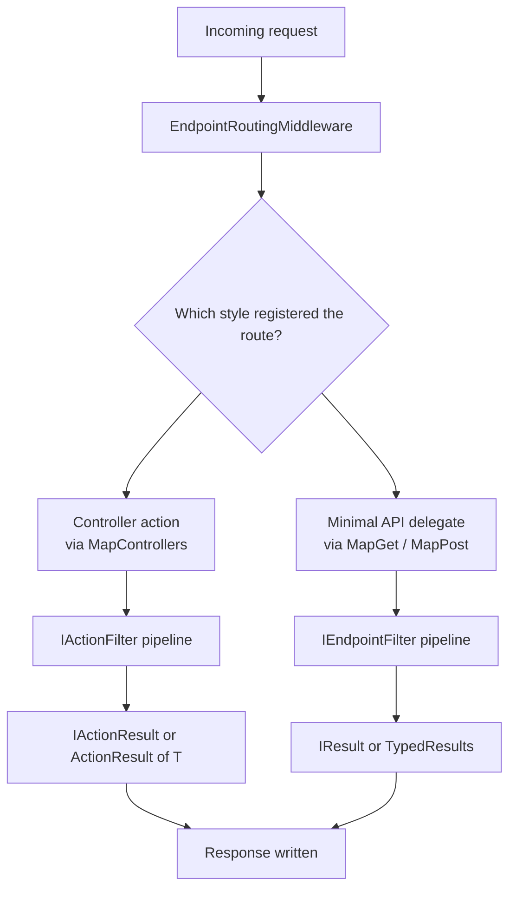

ASP.NET Core gives you two ways to build HTTP APIs: controllers (the MVC-style approach with attributes and conventions) and minimal APIs (endpoints defined as lambdas on `WebApplication`). They compile down to similar routing internals, but they differ enough in ergonomics, performance and testability that "which one and why" is a standard interview question.

## The two styles, side by side

```csharp
// Controller style
[ApiController]
[Route("api/[controller]")]
public class OrdersController : ControllerBase
{
    private readonly IOrderService _orders;
    public OrdersController(IOrderService orders) => _orders = orders;

    [HttpGet("{id:int}")]
    public async Task<ActionResult<OrderDto>> GetById(int id)
    {
        var order = await _orders.GetAsync(id);
        return order is null ? NotFound() : Ok(order);
    }
}

// Minimal API style
app.MapGet("/api/orders/{id:int}", async (int id, IOrderService orders) =>
{
    var order = await orders.GetAsync(id);
    return order is null ? Results.NotFound() : Results.Ok(order);
});
```

Both produce the same route, the same model binding for `id`, and the same JSON response. The differences show up in scale, tooling and conventions rather than raw capability.



## Comparison table

| Dimension | Controllers | Minimal APIs |
|---|---|---|
| Startup performance | Slightly slower (reflection-based discovery) | Faster cold start, fewer allocations |
| Testability | Easy — test the controller class directly | Easy for the handler, but route wiring itself is only covered by integration tests |
| Filters | Rich `IActionFilter`/`IAsyncActionFilter` pipeline | Endpoint filters (`IEndpointFilter`) — simpler, lighter |
| Model binding | Attribute-driven, many built-in sources and conventions | Explicit — inferred from parameter types and a smaller rule set |
| Conventions | Heavy — action results, `[ApiController]` behaviours, filters, areas | Minimal — you write what you mean, less "magic" |
| Discoverability | Great with Swagger/OpenAPI tooling and years of ecosystem support | Good, catching up; less tooling for very large surfaces |
| Best fit | Large APIs, teams used to MVC, heavy cross-cutting filter logic | Microservices, small focused APIs, latency-sensitive endpoints |

> [!KEY]
> Minimal APIs are not "a lesser version" of controllers — they're a lower-ceremony way to express the same routing and binding model, optimized for services where startup time and per-request overhead matter (e.g. serverless, high-density microservices).

## Routing: attribute vs conventional

Controllers support two routing styles. **Attribute routing** (`[Route]`, `[HttpGet]`) puts the route template directly on the action — this is the default and near-universal choice for APIs because it's explicit and co-located with the code it routes to. **Conventional routing** (`app.MapControllerRoute("default", "{controller}/{action}/{id?}")`) derives routes from a pattern and controller/action names — this is largely an MVC-with-views legacy pattern and rarely used for JSON APIs because it hides the route in configuration rather than on the action.

Minimal APIs only have one style: routes are declared explicitly at the call site (`app.MapGet(...)`, `app.MapPost(...)`), which is effectively always "attribute-style" in spirit — the route and handler are never separated.

## Model binding sources and the [FromBody] rule

| Source | Attribute | Where it comes from |
|---|---|---|
| Route | `[FromRoute]` | URL path segments, e.g. `{id}` |
| Query string | `[FromQuery]` | `?page=2&size=10` |
| Body | `[FromBody]` | Deserialized JSON request body |
| Header | `[FromHeader]` | HTTP request headers |
| Form | `[FromForm]` | `multipart/form-data` or url-encoded body |
| Service | `[FromServices]` | Resolved from the DI container instead of the request |

With `[ApiController]` on a controller, ASP.NET Core **infers** binding sources without attributes: complex types default to `[FromBody]`, simple types (string, int, Guid, etc.) that match a route parameter come from the route, and other simple types come from the query string.

> [!WARNING]
> Only **one** parameter per action can be bound from the body — the request body is read as a single stream and can only be consumed once. If you need multiple pieces of data from the body, wrap them in a single DTO instead of trying to bind two `[FromBody]` parameters.

Minimal APIs use similar inference: complex types are bound from the body by default (unless marked `[AsParameters]` or bound from route/query), and route/query parameters are matched to method parameter names automatically. `[FromServices]` still works to pull DI-registered dependencies into the delegate signature.

## Action results and IResult

Controllers return `IActionResult` (or `ActionResult<T>` for strongly-typed responses with implicit conversion), produced via helpers like `Ok()`, `NotFound()`, `BadRequest()`, `CreatedAtAction()`. Minimal APIs return `IResult`, produced via the `Results` static class (`Results.Ok()`, `Results.NotFound()`, `Results.Created()`) or `TypedResults` (introduced in .NET 7) for compile-time-checked, OpenAPI-friendly variants.

```csharp
// TypedResults gives you a concrete type the OpenAPI generator can describe precisely
app.MapPost("/api/orders", async (CreateOrderRequest req, IOrderService orders) =>
{
    var created = await orders.CreateAsync(req);
    return TypedResults.Created($"/api/orders/{created.Id}", created);
});
```

`TypedResults` is preferred over `Results` in new minimal API code because the return type documents the possible status codes directly in the method signature, which both the compiler and OpenAPI/Swagger tooling can use.

## [ApiController] attribute behaviours

Decorating a controller with `[ApiController]` turns on several conventions at once:

- **Automatic 400 response** — if model validation fails (via data annotations), the framework short-circuits with a `400 Bad Request` and a `ValidationProblemDetails` body before your action method even runs.
- **Binding source inference** — complex types come from the body, route-matched simple types from the route, and other simple types from query, removing many `[FromBody]`/`[FromQuery]` attributes.
- **Multipart/form-data inference** for `IFormFile` parameters.
- **Problem details for non-success status codes**, using RFC 7807 shape.

Minimal APIs don't get automatic model-validation 400s out of the box; validation must be done explicitly (manually, with an endpoint filter, or via a validation library), which is a real trade-off to name in an interview.

## Route constraints

Both styles support route constraints to validate and disambiguate a segment before the handler runs.

| Constraint | Example | Matches |
|---|---|---|
| `int` | `{id:int}` | Only integers |
| `guid` | `{id:guid}` | Only valid GUIDs |
| `alpha` | `{code:alpha}` | Letters only |
| `min(n)`/`max(n)` | `{age:min(18)}` | Numeric range |
| `regex(...)` | `{sku:regex(^[A-Z]{{3}}\\d{{4}}$)}` | Custom pattern |

Constraints let the router itself reject malformed input (returning `404`) before your handler runs, which is cheaper than binding and then validating manually.

## Endpoint filters in minimal APIs

`IEndpointFilter` is the minimal API analogue of an MVC action filter — lighter weight, composable via `.AddEndpointFilter()`.

```csharp
app.MapPost("/api/orders", CreateOrder)
   .AddEndpointFilter(async (context, next) =>
   {
       var request = context.GetArgument<CreateOrderRequest>(0);
       if (request.Quantity <= 0)
           return Results.ValidationProblem(new Dictionary<string, string[]>
           {
               ["Quantity"] = new[] { "Must be greater than zero." }
           });
       return await next(context);
   });
```

Filters can be registered per-route or applied to a `RouteGroup` for shared behaviour across many endpoints, similar to applying a filter at the controller level.

## When to choose each

> [!TIP]
> A strong senior answer: "For a large domain API with dozens of endpoints, shared validation, and a team already fluent in MVC conventions, controllers reduce boilerplate. For a small, focused service — a BFF, a serverless function, an internal tool — minimal APIs cut startup cost and make the route trivially greppable in one file."

> [!NOTE]
> Both styles share the same underlying routing engine (`EndpointRouteBuilder`), the same DI container, and the same middleware pipeline — you can even mix both in one app, which is common during incremental migration from controllers to minimal APIs.

## Cheat sheet

- Controllers: attribute or conventional routing, `IActionFilter` pipeline, `[ApiController]` gives automatic 400s and binding inference.
- Minimal APIs: routes declared at the call site, `IEndpointFilter` pipeline, faster startup, less built-in validation.
- Only one `[FromBody]` parameter per action/handler — the request body is a single-read stream.
- `[ApiController]` binding inference: complex type → body, simple type matching route → route, other simple type → query.
- Prefer `TypedResults` over `Results` in minimal APIs for OpenAPI-friendly, compiler-checked responses.
- Route constraints (`:int`, `:guid`, `:regex(...)`) reject bad input before your handler runs.
- Minimal APIs need explicit validation — there's no automatic model-state 400 like `[ApiController]` gives controllers.
- Both share the same routing engine, DI container and middleware pipeline; you can mix them in one app.

## Common mistakes

| Mistake | Fix |
|---|---|
| Trying to bind two `[FromBody]` parameters | Combine into a single request DTO |
| Assuming minimal APIs auto-validate models | Add explicit validation, an endpoint filter, or a validation library |
| Using conventional routing for a JSON API | Prefer attribute routing (or minimal API routes) — explicit beats implicit for APIs |
| Returning `Results.Ok()` when `TypedResults.Ok()` would document the contract better | Use `TypedResults` for OpenAPI accuracy in new code |
| Forgetting `[ApiController]` and wondering why validation errors aren't automatic | Add `[ApiController]` to get automatic 400s and binding inference |
| Choosing minimal APIs for a huge, filter-heavy domain API "because it's newer" | Weigh actual filter/validation needs, not novelty |

## Summary

Controllers and minimal APIs are two syntaxes over the same routing, binding and middleware foundation — the choice is about ceremony and ecosystem fit, not raw capability. Controllers bring `[ApiController]` conventions (automatic validation, binding inference, rich filters) that suit large, filter-heavy APIs; minimal APIs trade some of that automation for lower startup cost and an explicit, single-file view of a route. Know the binding rules (especially the single-`[FromBody]` limit) and the fact that minimal APIs need validation wired up manually — those are the two things that trip people up in practice.

## Top Interview Questions

### Q1. What are the main practical differences between controllers and minimal APIs?

Controllers use attribute or conventional routing on classes decorated with `[ApiController]`, which gives automatic model-validation 400 responses, binding-source inference, and a rich `IActionFilter`/`IAsyncActionFilter` pipeline. Minimal APIs declare routes directly on the `WebApplication` via `MapGet`/`MapPost`/etc., have faster startup and lower per-request allocation because they skip a lot of MVC's reflection-based discovery, and use a lighter `IEndpointFilter` pipeline. The biggest functional gap is validation: `[ApiController]` gives you automatic model-state 400s for free, while minimal APIs require you to validate explicitly. Both share the same routing engine, DI container and middleware pipeline underneath.

### Q2. How does `[ApiController]` change binding behaviour?

It enables binding source inference so you don't need `[FromBody]`/`[FromQuery]`/`[FromRoute]` attributes in the common case: complex types (classes/records) are assumed to come from the request body, simple types (int, string, Guid, bool) that match a route template parameter come from the route, and other simple types are assumed to come from the query string. It also enables automatic `400 Bad Request` responses when model validation fails — the action method is never invoked if `ModelState` is invalid, and the framework returns an RFC 7807 `ValidationProblemDetails` body automatically.

### Q3. Why can you only bind one parameter from the request body?

The HTTP request body is exposed as a single, forward-only stream. The model binder reads and deserializes it once into whichever parameter is marked (or inferred) as `[FromBody]`; there is no way to "rewind" the stream and read it again for a second parameter. If you need multiple logical pieces of data from the body, the correct approach is to combine them into one request DTO/record and bind that single object — trying to mark two parameters `[FromBody]` throws an `InvalidOperationException` at startup in controllers, or simply won't bind correctly in minimal APIs.

### Q4. When would you pick minimal APIs over controllers for a new service?

I'd pick minimal APIs for small, focused services — a backend-for-frontend, an internal tool, a serverless function, or a microservice with a handful of endpoints — where fast cold start and low per-request overhead matter and the team doesn't need heavy cross-cutting filter logic. I'd pick controllers when the API is large (dozens of endpoints), the team already has MVC conventions and shared action filters, or I need the automatic validation and binding inference that `[ApiController]` provides without writing it by hand. In practice both can coexist in the same app, so migration is incremental rather than all-or-nothing.

### Q5. What's the difference between `IActionResult`, `ActionResult<T>` and `IResult`?

`IActionResult` is the controller-style return type implemented by helpers like `Ok()`, `NotFound()`, `BadRequest()` — it doesn't encode the success payload's type. `ActionResult<T>` wraps `IActionResult` with an implicit conversion from `T`, so you can `return order;` for the success case and `return NotFound();` for the failure case in the same method, which also lets Swagger infer the success response schema. `IResult` is the minimal API equivalent, produced via `Results.X()` or the newer `TypedResults.X()`; `TypedResults` returns concrete types (like `Ok<Order>`) instead of the generic `IResult`, which both the compiler and OpenAPI generators can reason about more precisely.

### Q6. How do route constraints help, and give two examples of when you'd use them?

Route constraints validate a route segment's shape before your handler is invoked, letting the router return `404` for malformed input instead of your action having to check and return `400`/`404` manually. `{id:int}` ensures only numeric IDs match that route, so a request for `/orders/abc` never reaches the handler at all — useful for avoiding unnecessary parsing/binding work and for disambiguating overlapping routes like `/orders/{id:int}` versus `/orders/{status:alpha}`. `{sku:regex(^[A-Z]{{3}}\\d{{4}}$)}` enforces a specific product-code shape directly in routing, which is handy when two endpoints would otherwise collide on the same path template.

### Q7. Your minimal API endpoint isn't returning a 400 for invalid input the way an equivalent `[ApiController]` action would. Why, and how do you fix it?

Minimal APIs don't run automatic data-annotation validation the way `[ApiController]` controllers do — there's no implicit `ModelState.IsValid` check wired into the pipeline. The fix is to validate explicitly: either check the model manually at the top of the handler and return `Results.ValidationProblem(...)`, use an `IEndpointFilter` that runs a validator (e.g. FluentValidation) before calling `next`, or adopt a library that adds minimal-API validation support. I'd prefer the endpoint filter approach so the validation logic is reusable across multiple routes via `.AddEndpointFilter()` on a route group, rather than duplicated in every handler.

### Q8. How would you apply a shared behaviour, like requiring an API key, across a group of minimal API endpoints without repeating code?

I'd use route groups: `var admin = app.MapGroup("/api/admin");` and then add the shared filter once — `admin.AddEndpointFilter<ApiKeyFilter>();` — so every endpoint mapped on that group inherits it, analogous to putting a filter attribute on a controller base class. Inside the filter, I'd check the header, and short-circuit with `Results.Unauthorized()` if it's missing or invalid before calling `next(context)`. This keeps the check in one place, testable in isolation, and avoids the risk of someone adding a new admin endpoint and forgetting to protect it individually.

### Q9. What's the difference between attribute routing and conventional routing in controllers, and why do APIs almost always use attribute routing?

Attribute routing puts the route template directly on the controller/action via `[Route]`/`[HttpGet]` etc., so the URL a given action responds to is visible right next to the code that handles it. Conventional routing defines a pattern once (e.g. `{controller}/{action}/{id?}`) and derives routes from controller and action names by convention — this was the default for old-style MVC apps serving HTML views, where a handful of predictable patterns covered many controllers. APIs favor attribute routing because JSON APIs typically need precise, varied route shapes (nested resources, custom segments, constraints) that don't fit a single convention cleanly, and because explicit routes are easier to grep, document and reason about in code review.

### Q10. In production, how do you decide whether validation failures should return a generic 400 or a structured problem-details response with field-level errors?

For any API consumed by another service or a frontend that needs to render field-specific errors, I'd always return RFC 7807 `ProblemDetails`/`ValidationProblemDetails` with per-field messages, because a generic 400 forces the caller to guess what was wrong. `[ApiController]` gives this for free in controllers; in minimal APIs I'd build it explicitly with `Results.ValidationProblem(errorsDictionary)` inside a validation filter, keeping the response shape consistent across both styles so client-side error handling doesn't need to special-case which style produced it. I'd also make sure both styles return the same content-type (`application/problem+json`) so monitoring and client code can rely on one contract.

### Q11. Can you mix controllers and minimal APIs in the same ASP.NET Core application? What are the trade-offs of doing so?

Yes — both are built on the same `EndpointRouteBuilder`, so calling both `app.MapControllers()` and `app.MapGet(...)`/`app.MapPost(...)` in the same `Program.cs` works out of the box, and requests are routed to whichever matches regardless of style. This is genuinely useful during an incremental migration from an older MVC codebase to minimal APIs, or when a handful of endpoints benefit from minimal API's lower overhead while the bulk of the domain API stays in controllers for its existing filters and conventions. The trade-off is consistency: two different validation and filter models in one codebase can confuse new contributors, so I'd document which style is used where and why, and standardize error-response shapes across both.

### Q12. Why might a minimal API have a faster cold start than an equivalent controller-based API?

Controllers are discovered via assembly scanning and reflection at startup — the framework walks assemblies looking for classes ending in `Controller`, inspects their action methods and attributes, and builds a route table from that metadata, all of which costs CPU time before the first request can be served. Minimal API routes are registered explicitly and eagerly via direct method calls (`MapGet`, `MapPost`) in `Program.cs`, avoiding most of that reflection-based discovery, and the request delegates involved allocate less per call. This difference matters most in serverless or container-per-request scenarios where cold start time is billed or directly affects user-perceived latency; for a long-running service handling steady traffic, the difference is largely invisible after warm-up.
