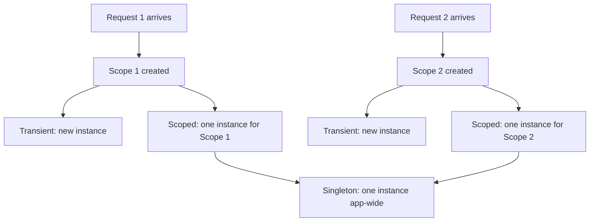

Dependency injection (DI) is how ASP.NET Core wires collaborators together instead of having classes construct their own dependencies. The mechanics are simple to learn and easy to misuse — almost every "weird bug under load" story in a .NET backend traces back to a lifetime mismatch, which is exactly why interviewers probe this deeply.

## Why DI, and the built-in container

DI inverts control: a class declares what it needs (via constructor parameters) instead of creating those dependencies itself. This makes classes easier to test (swap in a fake), easier to reconfigure (swap an implementation without touching consumers), and forces you to think about lifetime explicitly. ASP.NET Core ships a built-in container (`IServiceCollection`/`IServiceProvider`) that is lightweight by design — no interception, no property injection, no circular dependency resolution — you can swap in Autofac or others if you need more, but the built-in container covers the vast majority of real applications.



## Transient vs Scoped vs Singleton

| Lifetime | Instance created | Lives until | Concrete example |
|---|---|---|---|
| Transient | Every time it's resolved | Immediately eligible for GC after use | A lightweight validator or mapper with no state, `IEmailFormatter` |
| Scoped | Once per request (per `IServiceScope`) | End of the HTTP request / scope | `DbContext`, a unit-of-work, a per-request tenant context |
| Singleton | Once, on first resolution (or eagerly at startup) | Application lifetime | `IMemoryCache`, `IHttpClientFactory`, configuration snapshots |

```csharp
services.AddTransient<IEmailFormatter, EmailFormatter>();
services.AddScoped<AppDbContext>();
services.AddSingleton<IMemoryCache, MemoryCache>();
```

> [!KEY]
> Pick the lifetime based on **state and cost**, not habit. Stateless and cheap → transient. Needs to be consistent across one request → scoped. Expensive to build, thread-safe, and safe to share forever → singleton.

## The captive dependency problem

A **captive dependency** happens when a longer-lived service holds a reference to a shorter-lived one — most commonly, a singleton capturing a scoped service through its constructor. The container resolves the scoped dependency once, when the singleton is first constructed, and that single instance is then captured and reused for the lifetime of the app.

```csharp
// Bug: DbContext (scoped) captured by a singleton
public class ReportCache // registered as singleton
{
    private readonly AppDbContext _db; // captured ONCE, reused forever
    public ReportCache(AppDbContext db) => _db = db;
}
```

How this surfaces as a bug: `DbContext` is not thread-safe, so concurrent requests hitting the singleton's captured instance throw `InvalidOperationException: A second operation started on this context before a previous operation completed`. If the scoped service is disposable, you can also get `ObjectDisposedException` once the first request's scope disposes it — every request after that fails.

> [!DANGER]
> The built-in container **detects and throws at startup** for the most common shape of this bug (validated by default in `IsRootScope`/`ValidateScopes` in Development), but only if the mismatch is visible at registration time. Constructor injection through an intermediate abstraction, or manual `GetRequiredService` calls, can hide it until production traffic finds it.

## Using IServiceScopeFactory for background work

Singleton services (like a hosted background service) cannot directly take a constructor dependency on a scoped service — and shouldn't try to. Instead, inject `IServiceScopeFactory` (itself a singleton) and create a new scope manually whenever you need scoped services.

```csharp
public class ReportGeneratorService : BackgroundService
{
    private readonly IServiceScopeFactory _scopeFactory;
    public ReportGeneratorService(IServiceScopeFactory scopeFactory) => _scopeFactory = scopeFactory;

    protected override async Task ExecuteAsync(CancellationToken stoppingToken)
    {
        while (!stoppingToken.IsCancellationRequested)
        {
            using var scope = _scopeFactory.CreateScope();
            var db = scope.ServiceProvider.GetRequiredService<AppDbContext>();
            await GenerateAsync(db, stoppingToken);
            await Task.Delay(TimeSpan.FromMinutes(5), stoppingToken);
        }
    }
}
```

Each loop iteration gets a fresh scope, so the scoped `DbContext` is created, used and disposed cleanly — exactly mirroring what would happen at the boundaries of an HTTP request.

## Registering multiple implementations and keyed services

You can register several implementations of the same interface; `GetServices<T>()` returns all of them, while plain `GetRequiredService<T>()` returns the **last one registered**.

```csharp
services.AddScoped<INotifier, EmailNotifier>();
services.AddScoped<INotifier, SmsNotifier>();
// consumer: IEnumerable<INotifier> notifiers -> both run
```

Since .NET 8, **keyed services** let you register and resolve by a key without needing a wrapper factory:

```csharp
services.AddKeyedScoped<INotifier, EmailNotifier>("email");
services.AddKeyedScoped<INotifier, SmsNotifier>("sms");

public class AlertSender([FromKeyedServices("sms")] INotifier notifier) { /* ... */ }
```

## Factory registrations and disposal rules

Factory registrations (`services.AddScoped<IThing>(sp => new Thing(sp.GetRequiredService<IOther>()))`) are useful when construction needs logic beyond a simple constructor call — reading configuration, picking an implementation conditionally, or passing a computed value.

| Lifetime | Who disposes it? |
|---|---|
| Transient | The container tracks it within its owning scope and disposes it at scope end — **not** immediately after use |
| Scoped | Disposed when the scope (request) ends |
| Singleton | Disposed when the application/root container shuts down |

> [!WARNING]
> A common surprise: transient `IDisposable` services registered and resolved directly from the **root** container (not inside a request scope), such as in a console app without scopes, are never disposed until the app exits — because "end of scope" for the root container is "app shutdown". Always resolve scoped/transient disposables inside an explicit scope in non-web hosts.

## Service locator anti-pattern

Injecting `IServiceProvider` everywhere and calling `GetService<T>()` on demand — the **service locator** pattern — hides a class's real dependencies, defeats compile-time and constructor-time validation, and makes unit testing harder because you must mock the entire provider instead of a single interface.

```csharp
// Anti-pattern: dependencies are hidden inside the method body
public class OrderService
{
    private readonly IServiceProvider _sp;
    public OrderService(IServiceProvider sp) => _sp = sp;
    public void Process() => _sp.GetRequiredService<IEmailSender>().Send(/* ... */);
}
```

The narrow, legitimate exception is exactly the scope-creation scenario above (background services, middleware needing per-call resolution) — everywhere else, prefer explicit constructor injection.

## Testing with DI

Because dependencies are interfaces injected through constructors, unit tests can construct the class under test directly with fakes/mocks, bypassing the container entirely. Integration tests use `WebApplicationFactory<T>` and can override registrations via `builder.ConfigureServices(services => services.Replace(...))` to swap a real database for an in-memory or test double, without changing production wiring.

## Cheat sheet

- Transient: new every resolution, cheap and stateless (validators, mappers).
- Scoped: one per request, holds request-specific state (`DbContext`, unit of work).
- Singleton: one for the app's life, must be thread-safe and stateless or safely shared (cache, `HttpClient` factory).
- Captive dependency: singleton capturing scoped — surfaces as thread-safety exceptions or stale data under load.
- Use `IServiceScopeFactory.CreateScope()` inside singletons/background services to get scoped services safely.
- `GetServices<T>()` returns all registrations; `GetRequiredService<T>()` returns the last one.
- Keyed services (`AddKeyedScoped`, `[FromKeyedServices]`) let you register multiple named implementations cleanly.
- Disposal happens at scope end for scoped/transient, at app shutdown for singleton — and for the root container if you never create a scope.
- Avoid the service locator pattern — inject what you need, not the container itself.

## Common mistakes

| Mistake | Fix |
|---|---|
| Singleton service injecting a scoped `DbContext` in its constructor | Inject `IServiceScopeFactory` and create a scope per unit of work |
| Resolving transient/scoped disposables from the root container in a console app | Wrap usage in an explicit `using var scope = provider.CreateScope();` |
| Registering everything as singleton "for performance" | Match lifetime to statefulness/thread-safety, not perceived speed |
| Using `IServiceProvider` as a general-purpose locator | Inject the specific interfaces a class actually needs |
| Assuming `GetRequiredService<T>()` throws if multiple implementations exist | It silently returns the last registered one — use `IEnumerable<T>` if you want all of them |
| Forgetting `ValidateScopes`/`ValidateOnBuild` in tests | Enable them in `Development`/test builders to catch captive dependencies early |

## Summary

Lifetime is a contract about how long an instance is safe to share, and mismatches between contracts — most dangerously a singleton capturing a scoped service — are the classic source of "works in dev, breaks under load" bugs. Transient is for cheap stateless work, scoped is for per-request consistency, and singleton is for expensive, thread-safe, long-lived state. When a long-lived component needs short-lived services, reach for `IServiceScopeFactory` rather than fighting the container, and keep dependencies explicit through constructor injection instead of a service-locator `IServiceProvider` field.

## Top Interview Questions

### Q1. What are the three built-in DI lifetimes in ASP.NET Core, and give a concrete example of each?

Transient creates a brand-new instance every time it's resolved, best for cheap, stateless services like a validator or a mapper. Scoped creates one instance per scope — in a web app, that's one per HTTP request — best for anything that should stay consistent across a single request, most notably `DbContext`, where you want one unit-of-work per request rather than a new database context on every repository call. Singleton creates exactly one instance for the lifetime of the application, best for expensive-to-build, thread-safe, shared state like `IMemoryCache` or the object backing `IHttpClientFactory`. The choice should be driven by whether the service holds state and whether that state is safe to share across concurrent requests.

### Q2. What is a captive dependency, and how does it typically show up as a bug in production?

A captive dependency occurs when a longer-lived service (typically a singleton) takes a constructor dependency on a shorter-lived service (typically scoped). The container resolves the scoped instance once, at the moment the singleton is first constructed, and that single instance is then held — "captured" — for the singleton's entire lifetime, defeating the whole point of scoping it. This surfaces in production as intermittent failures under concurrent load: `DbContext` is not thread-safe, so two requests hitting the same captured instance concurrently throw `InvalidOperationException`, or once the first request's scope disposes the context, every subsequent request throws `ObjectDisposedException`. It's especially nasty because it can pass code review and work fine in single-request manual testing, only failing once real concurrent traffic hits it.

### Q3. How would you safely use a scoped service, like a repository backed by `DbContext`, inside a singleton `BackgroundService`?

I would not inject the scoped service directly into the `BackgroundService` constructor — instead, I'd inject `IServiceScopeFactory`, which is itself a singleton and safe to hold long-term. Inside the background loop, I'd call `_scopeFactory.CreateScope()` to create a fresh scope for each unit of work, resolve the scoped service from `scope.ServiceProvider`, use it, and let the `using` block dispose the scope (and everything scoped within it) at the end of that iteration. This mirrors exactly what happens at the start and end of an HTTP request, just driven manually by the loop instead of the framework.

### Q4. What does `services.AddScoped<AppDbContext>()` actually guarantee, and why is that the right lifetime for a DbContext?

It guarantees that within a single scope (one HTTP request, or one manually created scope), every consumer that resolves `AppDbContext` gets the **same instance** — so a controller, a couple of repositories, and a unit-of-work class all share one context and one change tracker for that request, and `SaveChanges()` from any of them commits the same tracked entities. `DbContext` is deliberately scoped rather than transient because entity tracking, identity resolution and the change tracker only make sense within a bounded unit of work; it's deliberately not singleton because it's not thread-safe and holding one across requests would immediately cause the captive-dependency symptoms described earlier.

### Q5. If you register the same interface with multiple implementations, what happens when you resolve it?

`GetRequiredService<IThing>()` (and constructor injection of a single `IThing` parameter) returns the **last** implementation registered — earlier registrations are effectively shadowed, not merged or errored on. If you actually want all registered implementations, inject or resolve `IEnumerable<IThing>`, which returns every registration in registration order; this is the standard pattern for "run all handlers of this type" scenarios, like notification dispatchers. Since .NET 8, keyed services (`AddKeyedScoped`/`[FromKeyedServices("key")]`) are the cleaner alternative when you need to pick a *specific* named implementation rather than either "the last one" or "all of them".

### Q6. What is the service locator anti-pattern, and why is it discouraged in favour of constructor injection?

Service locator means injecting the container itself (`IServiceProvider`) into a class and calling `GetService<T>()`/`GetRequiredService<T>()` inside method bodies to fetch dependencies on demand, rather than declaring them as constructor parameters. It's discouraged because it hides the class's real dependencies — you can't tell what a class needs by reading its constructor, static analysis and DI validation tools can't catch missing registrations at startup, and unit testing becomes harder because you must mock or configure an entire provider instead of passing in one fake interface. The narrow legitimate use is exactly the opposite scenario — a long-lived component (middleware, background service) that needs to create a **new scope** and resolve scoped services per unit of work, which requires an `IServiceScopeFactory`/`IServiceProvider`, not a locator pattern used to dodge constructor injection.

### Q7. Your team registered a caching service as a singleton, but users started seeing other users' cached data. What's the likely root cause?

The likely cause is that the singleton cache service captured a scoped, per-request piece of state — for example, a scoped `ICurrentUserContext` or `ITenantContext` injected into its constructor — so the "current user" reference it holds was fixed at the moment it was first constructed and never updated after that. Every subsequent request reusing the singleton then reads or writes cache entries under whatever user context happened to be captured first, leaking data across users. The fix is to never let user/tenant identity flow through a singleton's constructor; instead the cache key itself should be parameterized by user/tenant ID, passed explicitly into cache methods, with the user context resolved per-request from a scoped or transient service, never captured in the singleton.

### Q8. How would you unit test a class that depends on several injected services, without spinning up the DI container?

Because dependencies are declared as constructor parameters typed to interfaces, I construct the class under test directly, passing in mocks or fakes for each interface (via Moq, NSubstitute, or hand-written test doubles) — there's no need to touch `IServiceCollection`/`IServiceProvider` at all for a pure unit test. This is one of the core benefits of constructor injection: it makes the dependency graph explicit and substitutable. For broader integration tests that need the real DI wiring — verifying that registrations resolve correctly and middleware behaves as configured — I'd use `WebApplicationFactory<TEntryPoint>` and override specific registrations with `builder.ConfigureServices(services => services.Replace(ServiceDescriptor.Scoped<IThing, FakeThing>()))`.

### Q9. What's the difference between resolving a transient disposable from a request scope versus from the root service provider in a console app?

Inside a web request, a transient `IDisposable` registered and resolved through DI is tracked by that request's scope and disposed automatically when the scope ends — you get correct, timely disposal without doing anything extra. In a plain console app (or any host without an explicit per-operation scope), resolving directly from the root `IServiceProvider` means the "scope" is effectively the whole application, so that transient instance is tracked by the root container and only disposed when the app shuts down — leaking resources for the entire run if you create many of them. The fix in non-web hosts is to explicitly create scopes around units of work (`using var scope = provider.CreateScope();`) so transient and scoped disposables are cleaned up promptly rather than accumulating for the app's lifetime.

### Q10. When would you choose a factory registration (`services.AddScoped<IThing>(sp => ...)`) over a plain type registration?

I'd use a factory registration when construction needs logic the container's constructor-injection can't express directly: reading a value from configuration to decide which concrete type to build, passing a computed or externally-sourced parameter that isn't itself a registered service, or conditionally choosing between implementations based on runtime state like a feature flag. The factory delegate receives `IServiceProvider`, so it can still resolve other registered dependencies (`sp.GetRequiredService<IOther>()`) while adding whatever custom logic is needed around them. For the common case — a class with only DI-resolvable constructor parameters — a plain `AddScoped<IThing, Thing>()` registration is simpler and preferred; reach for the factory form only when you need that extra flexibility.

### Q11. How does ASP.NET Core help catch captive dependency bugs before they hit production?

When `ValidateScopes` is enabled — which it is by default in the `Development` environment via `CreateBuilder` — the container performs scope validation at resolution time and throws an `InvalidOperationException` immediately if a scoped service is being resolved directly from the root provider or captured by a singleton, rather than letting the bug silently ship. `ValidateOnBuild` goes further and validates the entire registration graph eagerly when the provider is built, catching some captive-dependency shapes (and missing registrations) at startup rather than waiting for the first request to hit the bad path. The catch: these validations only run in `Development` by default and can miss cases where the mismatch is hidden behind an intermediate abstraction or a manual `GetRequiredService` call, so they reduce risk but don't eliminate the need for careful lifetime design and code review.

### Q12. In a production incident, requests started intermittently failing with "A second operation was started on this context before a previous operation completed." How would you investigate?

That exception is the signature symptom of a `DbContext` (or anything wrapping it) being shared across concurrent requests — almost always because it, or something holding it, was registered with a longer lifetime than scoped. I'd first grep the DI registrations for anything singleton that has `AppDbContext`, a repository, or a unit-of-work type in its constructor dependency chain, since that's the most common root cause; a factory-registered singleton that closes over a scoped service in a lambda is a sneakier variant of the same bug. I'd also check for `Task.Run`/`Parallel.ForEach`/fire-and-forget code paths that reuse the same injected `DbContext` instance across concurrent tasks within a single request, which produces the identical exception without any DI misconfiguration at all — the fix there is a new scope (and new context) per concurrent task rather than a lifetime change.
