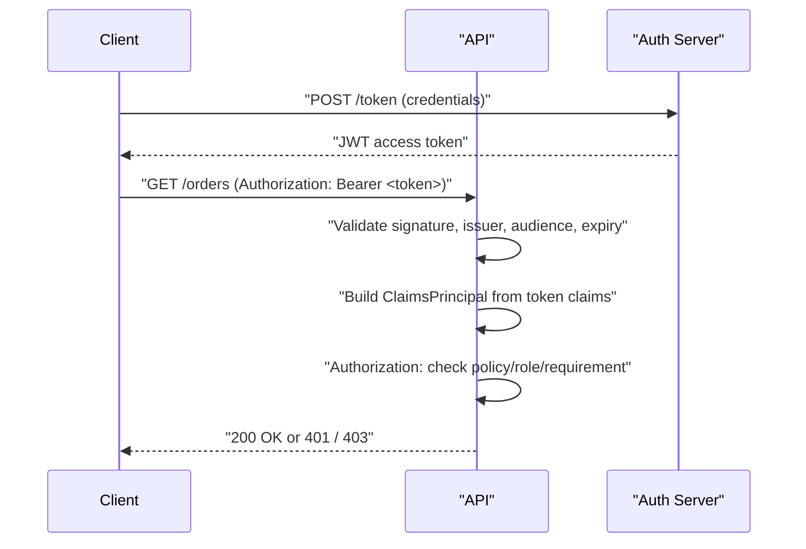

Authentication answers "who are you"; authorization answers "what are you allowed to do". They are separate concerns implemented as separate middleware, run in that order, and conflating them is one of the fastest ways to design an insecure API. This page covers how ASP.NET Core implements both, and the JWT bearer flow that backs most modern API auth.


## AuthN vs AuthZ in the pipeline

`UseAuthentication()` runs first and populates `HttpContext.User` (a `ClaimsPrincipal`) by asking each registered authentication **scheme** to try to identify the caller from the request — a header, a cookie, a token. `UseAuthorization()` runs after and, using the endpoint metadata routing attached, decides whether the now-identified (or still-anonymous) user is allowed to reach that endpoint.



> [!KEY]
> A `401 Unauthorized` means "I don't know who you are" (authentication failed or was never attempted). A `403 Forbidden` means "I know who you are, and you're not allowed to do this" (authorization failed). Mixing these up in API design is a common and telling mistake.

## Authentication schemes and handlers

A **scheme** is a named configuration of an `IAuthenticationHandler` — the code that inspects the request and produces (or fails to produce) a `ClaimsPrincipal`. An app can register multiple schemes (JWT bearer, cookies, API key) and pick a default, or require a specific scheme per endpoint.

```csharp
builder.Services.AddAuthentication(JwtBearerDefaults.AuthenticationScheme)
    .AddJwtBearer(options =>
    {
        options.Authority = "https://issuer.example.com";
        options.Audience = "orders-api";
        options.TokenValidationParameters = new TokenValidationParameters
        {
            ValidateIssuer = true,
            ValidateAudience = true,
            ValidateLifetime = true,
            ValidateIssuerSigningKey = true,
            ClockSkew = TimeSpan.FromMinutes(2)
        };
    });
```

### API key and Basic authentication handlers

Not every caller is a browser-driven user with a JWT. Server-to-server integrations and partner APIs often authenticate with a simpler scheme, implemented as a custom `AuthenticationHandler<T>` registered alongside JWT bearer:

```csharp
public class ApiKeyAuthOptions : AuthenticationSchemeOptions { }

public class ApiKeyAuthHandler : AuthenticationHandler<ApiKeyAuthOptions>
{
    private readonly IApiKeyStore _store;

    public ApiKeyAuthHandler(IOptionsMonitor<ApiKeyAuthOptions> options, ILoggerFactory logger,
        UrlEncoder encoder, IApiKeyStore store) : base(options, logger, encoder) => _store = store;

    protected override async Task<AuthenticateResult> HandleAuthenticateAsync()
    {
        if (!Request.Headers.TryGetValue("X-Api-Key", out var key))
            return AuthenticateResult.NoResult(); // let another scheme try

        var client = await _store.FindByHashedKeyAsync(Hash(key!));
        if (client is null) return AuthenticateResult.Fail("Invalid API key");

        var identity = new ClaimsIdentity(new[] { new Claim("client_id", client.Id) }, Scheme.Name);
        return AuthenticateResult.Success(new AuthenticationTicket(new ClaimsPrincipal(identity), Scheme.Name));
    }
}
// registration: builder.Services.AddAuthentication().AddScheme<ApiKeyAuthOptions, ApiKeyAuthHandler>("ApiKey", null);
```

Basic authentication (username/password Base64-encoded in the `Authorization` header) is rarely appropriate for a public API — the encoding isn't encryption, and credentials travel on every request — but it still shows up for internal tooling sitting behind mTLS or a VPN where the transport is already trusted. API keys and Basic credentials are bearer-style secrets with no built-in identity or permission model of their own, so treat an API key the same way you'd treat a password: store only a hash server-side, scope each key to a specific client and a minimal set of operations, and support rotation, because a leaked key is valid until someone notices and revokes it.

## JWT bearer validation

A JWT (JSON Web Token) is a signed, self-contained set of claims. Validating one on the API side means checking several independent things — a partial check is a partial vulnerability.

| Check | What it prevents |
|---|---|
| Signature | Token tampering — was it really issued by the trusted authority? |
| Issuer (`iss`) | Accepting tokens minted by a different, untrusted authority |
| Audience (`aud`) | Accepting a token that was issued for a *different* API (token confusion) |
| Lifetime (`exp`/`nbf`) | Accepting an expired or not-yet-valid token |
| Clock skew | False rejections from small clock drift between issuer and API servers |

> [!WARNING]
> Default clock skew in the JWT bearer handler is **5 minutes** — generous enough to hide real expiry bugs in testing. Explicitly set it (commonly 1–2 minutes) so you understand the actual tolerance in production rather than relying on the default.

## Cookie auth vs token auth

| Aspect | Cookie authentication | Token (bearer/JWT) authentication |
|---|---|---|
| Storage | Browser-managed, `HttpOnly` cookie | Client-managed (memory, storage) |
| CSRF exposure | Vulnerable without anti-forgery tokens | Not vulnerable to CSRF (no automatic sending) |
| XSS exposure | Lower if `HttpOnly`/`Secure` set | Higher if stored in `localStorage` |
| Statefulness | Can be stateless (encrypted) or session-backed | Stateless by design (self-contained claims) |
| Best fit | Server-rendered apps, first-party browser sessions | APIs, SPAs, mobile apps, service-to-service calls |
| Revocation | Easy — invalidate server-side session/cookie | Hard — must wait for expiry or maintain a blocklist |

> [!TIP]
> A senior answer names the revocation trade-off explicitly: "JWTs are stateless, so revoking one before expiry requires either short lifetimes plus refresh tokens, or a server-side deny-list — which reintroduces the statefulness JWTs were meant to avoid."

### Session-based authentication with a distributed cache

Session-backed cookie auth is still the right call for first-party, server-rendered apps: the server creates a session on login, stores it centrally, and hands the client only an opaque session ID.


```csharp
builder.Services.AddStackExchangeRedisCache(o => o.Configuration = redisConnectionString);
builder.Services.AddSession(o =>
{
    o.Cookie.HttpOnly = true;
    o.Cookie.SecurePolicy = CookieSecurePolicy.Always;
    o.IdleTimeout = TimeSpan.FromMinutes(30);
});
// app.UseSession(); before app.UseAuthentication();
```

Backing the session store with a distributed cache (Redis, SQL) rather than in-process memory is what makes this horizontally scalable — any instance behind the load balancer can look up the same session, so you get centralized revocation (delete the session, the user is logged out everywhere) without sticky sessions.

## Refresh tokens and rotation

Pairing a short-lived access token with a longer-lived refresh token gives you both a small blast radius if a token leaks and a way to end a session before the access token's natural expiry.


- Access tokens commonly live 15 minutes to 1 hour; refresh tokens 7 to 30 days.
- Store refresh tokens as opaque, server-validated values (not JWTs) so they can be revoked instantly, and rotate them on every use — issue a new refresh token and invalidate the old one, so a stolen-but-unused refresh token becomes worthless the moment the legitimate client refreshes, instead of staying valid for its entire remaining lifetime.
- Store the refresh token in an `HttpOnly`, `Secure` cookie for browser clients — never in `localStorage`, where any XSS on the page can read it.

## Claims and ClaimsPrincipal

`HttpContext.User` is a `ClaimsPrincipal`, a container for one or more `ClaimsIdentity` objects, each holding a bag of `Claim` key/value pairs (`sub`, `email`, `role`, custom claims like `tenant_id`). Authorization checks — roles, policies, resource checks — are all ultimately reading claims off this object. These are exactly the fields the token carried in the first place:


```csharp
var userId = User.FindFirstValue(ClaimTypes.NameIdentifier);
var isAdmin = User.IsInRole("Admin");
var tenantId = User.FindFirstValue("tenant_id");
```

## Role-based, policy-based and resource-based authorization

```csharp
// Role-based — simple, but roles alone don't express fine-grained rules well
[Authorize(Roles = "Admin,Manager")]
public IActionResult Approve() => Ok();

// Policy-based — named, reusable, can combine multiple requirements
builder.Services.AddAuthorization(options =>
    options.AddPolicy("MinimumAge", policy =>
        policy.Requirements.Add(new MinimumAgeRequirement(18))));

[Authorize(Policy = "MinimumAge")]
public IActionResult BuyAlcohol() => Ok();

// Resource-based — the decision depends on the specific object, not just the user
var result = await _authorizationService.AuthorizeAsync(User, order, "OwnerOnly");
if (!result.Succeeded) return Forbid();
```

| Model | Decision based on | Example |
|---|---|---|
| Role-based | Static role membership | Only `Admin` can delete users |
| Policy-based | One or more composable requirements | Age ≥ 18, and email verified |
| Resource-based | The specific object being accessed | Only the order's owner can view it |

## Requirement handlers

A policy requirement is a plain object; an `AuthorizationHandler<T>` contains the logic that decides whether it's satisfied.

```csharp
public class MinimumAgeRequirement : IAuthorizationRequirement
{
    public int MinimumAge { get; }
    public MinimumAgeRequirement(int minimumAge) => MinimumAge = minimumAge;
}

public class MinimumAgeHandler : AuthorizationHandler<MinimumAgeRequirement>
{
    protected override Task HandleRequirementAsync(
        AuthorizationHandlerContext context, MinimumAgeRequirement requirement)
    {
        var dob = context.User.FindFirstValue("date_of_birth");
        if (dob is not null && DateTime.Parse(dob).AddYears(requirement.MinimumAge) <= DateTime.UtcNow)
            context.Succeed(requirement);
        return Task.CompletedTask;
    }
}
// registration: services.AddSingleton<IAuthorizationHandler, MinimumAgeHandler>();
```

Multiple handlers can target the same requirement type; by default **any one succeeding** satisfies it (logical OR across handlers for a requirement, logical AND across distinct requirements in a policy).

## [Authorize] and [AllowAnonymous]

`[Authorize]` on a controller/action (or `.RequireAuthorization()` on a minimal API route) demands the request pass authentication and any specified role/policy. `[AllowAnonymous]` punches a hole through a controller-level `[Authorize]` for a specific action — commonly used for a login or health endpoint nested in an otherwise-protected controller.

> [!DANGER]
> `[AllowAnonymous]` wins over **any** `[Authorize]` on the same action, including ones from policies applied globally via `options.FallbackPolicy`. A stray `[AllowAnonymous]` left on an endpoint during debugging is a real, recurring production incident.

## Multi-tenancy checks

In multi-tenant systems, authentication alone is not enough — you must also verify the authenticated user's tenant matches the tenant of the resource being accessed, otherwise a valid token for Tenant A can read Tenant B's data if IDs are guessable. This is best implemented as a resource-based authorization check (or a query filter applied automatically at the data layer) rather than scattered `if` checks in every action.

## Common misconfigurations

- Trusting a client-supplied tenant/role claim without validating it was actually issued by the trusted authority (not just present in an unverified token).
- Validating the token's signature but skipping audience validation, allowing a token minted for a *different* API to be replayed against this one.
- Registering authorization middleware before authentication, so `User` is always anonymous when policies evaluate.
- Storing JWTs in `localStorage` for a SPA, exposing them to any XSS on the page — an `HttpOnly` cookie or in-memory storage is safer.
- Storing raw API keys in the database instead of a hash, so a database leak hands out every client's live credential.
- Skipping refresh-token rotation, leaving a stolen refresh token valid for its whole lifetime instead of a single use.

## Cheat sheet

- AuthN populates `User`; AuthZ decides access. 401 = unknown identity, 403 = known but disallowed.
- JWT validation must check signature, issuer, audience, lifetime — skipping any one is a real vulnerability, not a nitpick.
- Cookies suit first-party browser apps (watch CSRF); tokens suit APIs/SPAs/service-to-service (watch XSS and revocation).
- API keys and Basic auth are custom `AuthenticationHandler<T>` schemes — hash keys at rest, scope and rotate them.
- Session-backed cookie auth needs a distributed cache (Redis) behind it to scale horizontally and revoke centrally.
- Access tokens short-lived (minutes–hours); refresh tokens longer-lived, opaque, rotated on every use, stored `HttpOnly`.
- `ClaimsPrincipal` → `ClaimsIdentity` → `Claim`s is the object model behind every authorization check.
- Role-based is simplest; policy-based composes requirements; resource-based decides per-object.
- `[AllowAnonymous]` always wins over `[Authorize]` on the same endpoint — audit for stray usages.
- Multi-tenancy needs explicit tenant-match checks; a valid token is not the same as an authorized tenant.

## Common mistakes

| Mistake | Fix |
|---|---|
| Returning 401 for "user exists but lacks permission" | Return 403 — reserve 401 for unauthenticated requests |
| Skipping audience validation on JWTs | Always set and validate `ValidateAudience` and the expected `Audience` |
| Registering `UseAuthorization` before `UseAuthentication`/`UseRouting` | Keep the canonical order: routing → authentication → authorization |
| Leaving `[AllowAnonymous]` on a debug endpoint | Remove it before merging; add a test asserting the endpoint requires auth |
| Trusting a `tenant_id` claim without checking resource ownership | Add a resource-based authorization check or a data-layer tenant filter |
| Storing bearer tokens in `localStorage` for a SPA | Prefer `HttpOnly` cookies or in-memory storage with short-lived tokens |
| Reusing the same refresh token across multiple refresh calls | Rotate on every use — issue a new one and invalidate the old |

## Summary

Authentication and authorization are two distinct middleware stages: one identifies the caller, the other decides what they can do, and both depend on the pipeline running in the correct order. JWT validation is only as strong as its weakest unchecked field — signature, issuer, audience and lifetime all matter. Beyond JWT bearer, ASP.NET Core happily hosts API-key and cookie/session schemes side by side, and a distributed cache is what lets session-backed auth scale horizontally the same way stateless tokens do. Choose role-based authorization for static permissions, policy-based for composable rules, and resource-based when the decision depends on the specific object being accessed, pair short-lived access tokens with rotated refresh tokens to bound both leak damage and revocation lag, and always treat multi-tenancy as an explicit authorization concern rather than an assumption baked into a token claim.

## Top Interview Questions

### Q1. What is the difference between authentication and authorization, and how does that map to HTTP status codes?

Authentication establishes identity — verifying who is making the request, typically by validating credentials, a cookie, or a bearer token, and results in a populated `ClaimsPrincipal`. Authorization takes that established (or absent) identity and decides whether the action is permitted, based on roles, policies, or the specific resource involved. The status code mapping follows directly: `401 Unauthorized` means authentication failed or was never provided — the server doesn't know who you are — while `403 Forbidden` means authentication succeeded but the now-known identity isn't allowed to perform this action. Returning 401 for a permission failure is a common and confusing API design mistake.

### Q2. Walk through what happens when an API validates an incoming JWT bearer token.

The JWT bearer handler first verifies the token's **signature** against the issuer's signing key (fetched from a JWKS endpoint or configured directly), proving the token wasn't tampered with and really came from the trusted authority. It then checks the **issuer** (`iss`) claim matches the configured trusted issuer, and the **audience** (`aud`) claim matches this API's expected audience, preventing a token minted for one API from being replayed against another. It checks **lifetime** — `exp` hasn't passed and `nbf` has — allowing for a configured clock-skew tolerance to absorb small differences between server clocks. Only if all of these pass does it build a `ClaimsPrincipal` from the token's claims and attach it to `HttpContext.User` for downstream authorization to use.

### Q3. Why is validating the audience claim important, and what goes wrong if you skip it?

The audience (`aud`) claim identifies which API/resource the token was issued for. If an authorization server issues tokens for multiple APIs using the same signing key, skipping audience validation means a token legitimately issued for, say, a low-privilege "profile" API would also be accepted by a higher-privilege "payments" API, since the signature alone would still verify correctly. This is a real class of vulnerability called token confusion — validating signature and expiry are necessary but not sufficient; the token must also be proven to have been issued *for this specific API*, which is exactly what audience validation checks.

### Q4. What's the practical trade-off between cookie-based and token-based authentication for an API?

Cookies are automatically attached by the browser to same-site requests, which is convenient for first-party server-rendered apps but opens CSRF exposure unless anti-forgery tokens are used, and they can be made relatively safe from XSS by marking them `HttpOnly` and `Secure`. Bearer tokens must be attached manually by client code, which avoids CSRF entirely since nothing sends them automatically, but if a SPA stores the token in `localStorage` it becomes readable by any script that runs on the page, including injected XSS payloads. Tokens are also naturally stateless and hard to revoke before expiry, while cookie-backed sessions can be invalidated instantly server-side — so the choice depends on whether you're serving browsers (favor cookies, or tokens in memory with short lifetimes) or serving APIs/mobile/service-to-service clients (favor bearer tokens).

### Q5. What is the difference between role-based, policy-based and resource-based authorization?

Role-based authorization checks static group membership — `[Authorize(Roles = "Admin")]` — which is simple but coarse; it can't express "the user must own this specific record" or "the user must satisfy two independent conditions". Policy-based authorization defines a named policy composed of one or more `IAuthorizationRequirement`s, each evaluated by a handler, letting you combine conditions like minimum age and verified email under one reusable policy name applied via `[Authorize(Policy = "...")]`. Resource-based authorization goes further and evaluates the decision against a specific loaded object — calling `IAuthorizationService.AuthorizeAsync(User, resource, policyName)` — which is required whenever the answer depends on data you can only know after fetching the record, such as "is this user the owner of this specific order".

### Q6. How would you implement "only the owner of a resource can modify it" using ASP.NET Core's authorization APIs?

I'd write a resource-based authorization requirement and handler rather than trying to express it with roles or a static policy, since the decision depends on the loaded entity. I'd define an `IAuthorizationRequirement` (e.g. `SameOwnerRequirement`), implement `AuthorizationHandler<SameOwnerRequirement, Order>` whose `HandleRequirementAsync` compares `context.User`'s user-id claim against `resource.OwnerId` and calls `context.Succeed(requirement)` on a match, and register a policy that requires it. In the action, after loading the order, I'd call `await _authorizationService.AuthorizeAsync(User, order, "SameOwnerPolicy")` and return `Forbid()` if it fails — critically, this check has to happen *after* the resource is loaded, since the decision depends on data that doesn't exist until then.

### Q7. Your API returns 200 OK for an endpoint you expected `[Authorize]` to protect. What would you check?

First, I'd check for a stray `[AllowAnonymous]` on the action or a base class it inherits from — it always wins over `[Authorize]` regardless of where the authorize attribute came from, including global fallback policies, and is a very common leftover from debugging. Second, I'd verify `UseAuthentication()` and `UseAuthorization()` are both registered in `Program.cs`, in that order, and after `UseRouting()` — if authorization middleware is missing entirely or misordered, `[Authorize]` attributes are simply never enforced. Third, I'd check whether the endpoint is a minimal API route that needs `.RequireAuthorization()` explicitly, since minimal API routes are anonymous by default even in an app that otherwise requires auth globally, unless a fallback policy is configured.

### Q8. How do you handle authorization in a multi-tenant API where a valid token doesn't automatically mean access to a specific tenant's data?

I'd never rely solely on the presence of a `tenant_id` claim to imply the request is scoped correctly — instead, I'd treat tenant matching as an explicit authorization check: extract the tenant from the token, extract the tenant the requested resource belongs to (from the URL, a loaded entity, or a data-layer filter), and require they match, via a resource-based authorization handler or a global query filter enforced at the `DbContext` level (e.g. an EF Core global query filter keyed on tenant id). I'd also make sure the tenant claim in the token was actually issued by the trusted authority — asserting the caller belongs to tenant X only if that assertion came from a validated, signed token, never from a client-supplied header that could be forged.

### Q9. What is a refresh token and why is it used alongside short-lived access tokens?

An access token (typically a JWT) is deliberately short-lived — commonly 15 minutes to an hour — to limit the damage window if it's stolen, since JWTs can't be revoked before expiry without extra infrastructure. A refresh token is longer-lived (commonly 7 to 30 days) and is exchanged with the authorization server for a new access token when the old one expires, without requiring the user to log in again; because refresh tokens are typically opaque and validated server-side (not self-contained JWTs), they **can** be revoked immediately by deleting the server-side record, which is exactly the capability short-lived access tokens lack. This combination gives you both a short blast radius per stolen access token and the ability to fully revoke a user's session by invalidating their refresh token — and rotating the refresh token on every use (issuing a new one and invalidating the old) closes the gap where a stolen-but-unused refresh token would otherwise stay valid for its entire remaining lifetime. Whatever stores it client-side should be an `HttpOnly` cookie, never `localStorage`.

### Q10. Why does `UseAuthorization()` need to run after `UseRouting()` in the middleware pipeline?

Routing is what matches the incoming request to a specific endpoint and attaches that endpoint's metadata — including `[Authorize]` attributes, required roles, and policy names — onto `HttpContext`. The authorization middleware reads exactly that attached metadata to decide what checks to apply; if it ran before routing, there would be no endpoint metadata yet, so it would have nothing to evaluate against and would either throw or, worse, silently allow every request through. This is a very concrete illustration of why middleware order isn't cosmetic — it directly determines correctness, not just performance.

### Q11. In production, how would you detect and respond to a spike in 401 responses on a public API?

I'd first check whether it's global or scoped to one client/token issuer — a global spike right after a deploy often means a JWT validation configuration regressed (wrong issuer/audience, rotated signing key not picked up, clock skew misconfigured), while a scoped spike often means one client's tokens expired and their refresh flow is broken. I'd add structured logging around authentication failures that captures the specific validation failure reason (expired vs bad signature vs wrong audience) without logging the token itself, since that reason narrows the cause immediately. I'd also check the signing-key rotation process — if keys are fetched from a JWKS endpoint and that endpoint is cached or unreachable, tokens signed with a newly rotated key will fail signature validation until the cache refreshes, which is a classic silent-until-rotation-day bug.

### Q12. What's the risk of an authorization handler that always calls `context.Succeed(requirement)` without checking anything?

It silently defeats the entire policy — any endpoint protected by that policy becomes effectively open to any authenticated (or even anonymous, depending on configuration) user, while still *looking* protected in code review because the `[Authorize(Policy = "...")]` attribute is present and a handler is registered. This is a realistic incident scenario: a handler stubbed out during development with a `TODO` and an unconditional success, left in because tests only checked "does the endpoint return 200 for a valid user" rather than "does it return 403 for an invalid one". The mitigation is to always write both positive and negative authorization tests — assert that a user *without* the required claim is rejected, not just that one *with* it is accepted.
