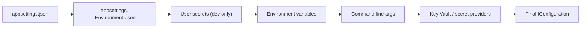

Configuration, logging and health checks are the unglamorous plumbing that decides whether an incident takes five minutes or five hours to diagnose. Interviewers use this area to check whether you've actually run something in production, not just built it.

## Configuration providers and precedence

ASP.NET Core configuration is a layered stack of providers, each contributing key-value pairs to one flattened `IConfiguration`. Later providers **override** earlier ones for the same key.



| Order | Source | Typical use |
|---|---|---|
| 1 | `appsettings.json` | Defaults shared across all environments |
| 2 | `appsettings.{Environment}.json` | Per-environment overrides (Development, Staging, Production) |
| 3 | User secrets | Local developer secrets, never committed |
| 4 | Environment variables | Container/orchestrator-injected values, the standard 12-factor mechanism |
| 5 | Command-line arguments | Ad-hoc overrides at launch |
| 6 | Key Vault / AWS Secrets Manager / etc. | Secrets pulled from a managed secret store at startup |

> [!KEY]
> Precedence is registration order, not the order above by convention — `WebApplication.CreateBuilder` registers them in this order by default, but if you add providers manually, whichever is added **last** wins for a duplicate key.

## Environment variables and Key Vault

Environment variables are the standard way orchestrators (Kubernetes, ECS, Docker Compose) inject configuration without baking it into the image — `ConnectionStrings__Default` maps to `ConfigurationSection["ConnectionStrings:Default"]` via the double-underscore convention, since `:` isn't valid in most shell environments. Key Vault (or an equivalent secret manager) is added as a configuration provider too, so secrets appear in `IConfiguration` alongside everything else — the code consuming a connection string doesn't need to know whether it came from `appsettings.json` or a vault.

Never put real secrets in `appsettings.json`, even in a `.Development.json` variant that's gitignored — mistakes happen, and files get committed. Use user secrets locally and a managed secret store everywhere else.

## The Options pattern

Binding configuration sections to strongly-typed classes beats scattering `configuration["Section:Key"]` string lookups across the codebase — it's discoverable, testable, and fails at a single point if misconfigured.

```csharp
public class SmtpOptions
{
    public string Host { get; set; } = default!;
    public int Port { get; set; } = 587;
}

builder.Services.AddOptions<SmtpOptions>()
    .Bind(builder.Configuration.GetSection("Smtp"))
    .ValidateDataAnnotations()
    .ValidateOnStart(); // fail fast at startup, not on first use
```

| Interface | Reload behaviour | Lifetime | Typical use |
|---|---|---|---|
| `IOptions<T>` | Snapshot at startup, never reloads | Singleton-safe | Values that never change at runtime |
| `IOptionsSnapshot<T>` | Recomputed per scope (per request) | Scoped | Values that may change via `appsettings.json` reload, read per-request |
| `IOptionsMonitor<T>` | Recomputed on change, pushes notifications | Singleton-safe | Long-lived singletons that need to react to config changes live |

> [!TIP]
> `IOptionsMonitor<T>.OnChange(callback)` is the one to reach for inside a singleton background service that needs to notice a config file change without restarting the process — `IOptionsSnapshot<T>` cannot be injected into a singleton at all, since it's scoped.

## Validation on start

`ValidateOnStart()` (added in .NET 8, paired with `ValidateDataAnnotations()` or a custom `IValidateOptions<T>`) moves configuration errors from "the first request that touches this option" to "the process refuses to start", which is a strictly better failure mode — a crash-looping pod in a deploy pipeline is far easier to diagnose than a service that starts fine and fails silently on the first real request.

```csharp
public class SmtpOptionsValidator : IValidateOptions<SmtpOptions>
{
    public ValidateOptionsResult Validate(string? name, SmtpOptions options) =>
        options.Port > 0 ? ValidateOptionsResult.Success
                          : ValidateOptionsResult.Fail("Smtp:Port must be positive.");
}
```

## Structured logging with ILogger

`ILogger<T>` uses **message templates**, not string interpolation — the template and its arguments are kept separate so log sinks can index on structured fields instead of parsing free text.

```csharp
// Good: structured — "OrderId" becomes a queryable field in the log sink
_logger.LogInformation("Order {OrderId} shipped to {City}", order.Id, order.City);

// Bad: interpolated — loses structure, can't be queried by OrderId
_logger.LogInformation($"Order {order.Id} shipped to {order.City}");
```

> [!DANGER]
> `LogInformation($"...")` compiles and looks identical in output, but destroys the ability to query "all logs for order 12345" without a regex over free text. This is the single most common structured-logging mistake in code review.

## Log levels and when to use each

| Level | When to use |
|---|---|
| `Trace` | Extremely verbose, step-by-step detail — off in production |
| `Debug` | Diagnostic detail useful while developing a feature |
| `Information` | Normal application flow worth recording — "order created", "request completed" |
| `Warning` | Unexpected but recoverable — retry succeeded, fallback used, deprecated API called |
| `Error` | A failure that affected the current operation, but the app keeps running |
| `Critical` | The application or a core dependency is in a state it likely cannot recover from |

## Scopes and correlation IDs

A logging **scope** attaches contextual data (a correlation ID, a user ID) to every log line written within it, without threading that value through every method signature.

```csharp
using (_logger.BeginScope(new Dictionary<string, object> { ["CorrelationId"] = correlationId }))
{
    _logger.LogInformation("Processing order {OrderId}", order.Id);
    // every log line inside this scope, including from called methods, includes CorrelationId
}
```

Correlation IDs (often read from or generated for the `traceparent`/`X-Correlation-Id` header) are what let you follow a single request across multiple services in distributed tracing — without one, debugging a multi-service failure means grepping timestamps and hoping.

## Health checks: liveness, readiness, startup

| Type | Question it answers | Kubernetes action on failure |
|---|---|---|
| Liveness | "Is the process stuck/deadlocked and should be restarted?" | Kills and restarts the pod |
| Readiness | "Can this instance currently serve traffic?" | Removes pod from the load-balancer pool, no restart |
| Startup | "Has the app finished its (possibly slow) initialization?" | Delays liveness/readiness checks until this passes |

```csharp
builder.Services.AddHealthChecks()
    .AddCheck<DatabaseHealthCheck>("database", tags: new[] { "ready" })
    .AddCheck("self", () => HealthCheckResult.Healthy(), tags: new[] { "live" });

app.MapHealthChecks("/health/live", new HealthCheckOptions { Predicate = c => c.Tags.Contains("live") });
app.MapHealthChecks("/health/ready", new HealthCheckOptions { Predicate = c => c.Tags.Contains("ready") });
```

> [!WARNING]
> Never make a liveness check depend on a downstream dependency (database, cache, another service). If the database blips, liveness failing would cause Kubernetes to restart every pod — the opposite of what you want. Downstream dependency checks belong in **readiness**, not liveness.

## Cheat sheet

- Config precedence: json → environment json → user secrets → environment variables → command line → Key Vault (last registered wins).
- Environment variables use `__` (double underscore) instead of `:` for nested keys.
- `IOptions<T>` = fixed at startup; `IOptionsSnapshot<T>` = per-scope reload; `IOptionsMonitor<T>` = live change notifications, safe in singletons.
- `ValidateOnStart()` turns config bugs into startup crashes instead of first-request surprises — prefer it.
- Log with message templates (`{OrderId}`), never string interpolation, so fields stay queryable.
- Log levels: Information for normal flow, Warning for recoverable oddities, Error for failed operations, Critical for the app itself being in trouble.
- Use `BeginScope` and correlation IDs to tie a whole request's logs together across services.
- Liveness = "restart me if I'm stuck"; readiness = "don't send me traffic right now"; never couple liveness to downstream health.

## Common mistakes

| Mistake | Fix |
|---|---|
| Using string interpolation in log calls | Use message templates: `_logger.LogInformation("Order {Id}", id)` |
| Putting secrets in `appsettings.json` | Use user secrets locally, Key Vault/secret manager in other environments |
| Coupling liveness checks to the database | Keep liveness self-contained; put dependency checks in readiness |
| Injecting `IOptionsSnapshot<T>` into a singleton | It's scoped and will throw/misbehave; use `IOptionsMonitor<T>` instead |
| Discovering a bad config value only when a feature is first used | Add `ValidateDataAnnotations().ValidateOnStart()` |
| No correlation ID across service calls | Propagate a correlation/trace ID header and log it in every scope |

## Summary

Configuration in ASP.NET Core is a layered, overridable stack — know the precedence order and bind it to strongly-typed options validated at startup rather than read as loose strings. Structured logging with message templates and scopes is what turns logs into a queryable dataset instead of a wall of text, and correlation IDs are what make that dataset useful across service boundaries. Health checks split into liveness (am I stuck) and readiness (can I serve traffic right now), and conflating the two is a reliable way to turn a transient dependency blip into a full outage via unnecessary restarts.

## Top Interview Questions

### Q1. What is the precedence order of ASP.NET Core's default configuration providers, and why does it matter?

The default order registered by `WebApplication.CreateBuilder` is `appsettings.json`, then `appsettings.{Environment}.json`, then user secrets (Development only), then environment variables, then command-line arguments — and later providers override earlier ones for the same key. It matters because it defines a predictable escape hatch: you can ship sensible defaults in `appsettings.json`, override them per environment in a variant file, and still let an operator or orchestrator override any of it at deploy time via environment variables or a command-line flag, without touching the deployed files at all. This is exactly the mechanism that lets one build artifact run correctly across dev, staging and production with different settings.

### Q2. What's the difference between `IOptions<T>`, `IOptionsSnapshot<T>` and `IOptionsMonitor<T>`?

`IOptions<T>` computes the bound options object once, the first time it's needed, and never changes for the life of the process — safe to inject into a singleton, but it won't reflect a config file change without a restart. `IOptionsSnapshot<T>` is recomputed once per scope, so in a web app it effectively reflects the latest configuration on every request — but because it's registered as scoped, it cannot be injected into a singleton. `IOptionsMonitor<T>` is itself a singleton, always exposes the current value via `.CurrentValue`, and additionally lets you subscribe to changes via `.OnChange(callback)`, making it the right choice for a long-lived singleton or background service that needs to react to configuration changes without a restart.

### Q3. Why should you prefer message-template logging (`_logger.LogInformation("Order {Id}", id)`) over string interpolation?

Message templates keep the literal template string and its arguments separate, which lets structured log sinks (Seq, Application Insights, Elasticsearch) index `Id` as its own queryable field rather than as an opaque substring buried in free text. With string interpolation (`$"Order {id}"`), the value is baked into the final string before the logger ever sees it, so you lose the ability to filter "show me every log line for order 12345" without a fragile text search, and you lose type information (the sink sees a string, not the original int). Message templates also avoid the (small but real) cost of building the string at all when the log level is disabled, since the logger can early-exit before formatting.

### Q4. What is the difference between a liveness check and a readiness check, and why shouldn't liveness depend on a database?

A liveness check answers "is this process fundamentally broken and should be killed and restarted" — deadlocked, hung, or otherwise unable to make progress — and Kubernetes responds to failure by restarting the pod. A readiness check answers "can this specific instance handle traffic right now" and Kubernetes responds to failure by pulling the pod out of the load-balancer's rotation, without restarting it. If liveness depends on a downstream database and that database has a brief blip, every pod's liveness check fails simultaneously, and Kubernetes restarts the entire fleet at once — turning a transient, recoverable dependency issue into a self-inflicted total outage, when the correct response was simply "stop sending this pod traffic until the database recovers", which is exactly what readiness is for.

### Q5. How do you avoid committing secrets to source control while still making configuration easy to work with locally?

Locally, use the Secret Manager tool (`dotnet user-secrets`), which stores values in a per-project file outside the repository (under the user's profile), and is automatically added as a configuration provider in Development — so code reads `configuration["Smtp:Password"]` the same way it would from `appsettings.json`, with no special-casing. In other environments, secrets come from a managed secret store — Azure Key Vault, AWS Secrets Manager, or environment variables injected by the orchestrator — registered as another configuration provider, so again the consuming code is unaware of where the value actually came from. The rule I'd enforce in code review: no connection strings, API keys or certificates ever committed in any `appsettings*.json` variant, checked by a pre-commit secret scanner as a backstop.

### Q6. What does `ValidateOnStart()` do for the Options pattern, and why is it worth the extra startup cost?

Without it, a misconfigured or missing options value (e.g. a required connection string left blank) typically fails the first time some code actually resolves and uses that `IOptions<T>` — which might be the first real user request, well after deployment looked successful. `ValidateOnStart()` runs the configured validators (data annotations or a custom `IValidateOptions<T>`) eagerly during host startup, so a bad configuration makes the process fail to start at all, which surfaces immediately in a deployment pipeline or as a crash-looping pod rather than as an intermittent runtime error discovered by a user. The extra cost is milliseconds at startup — a trivial price for converting a silent runtime bug into a loud, immediate deployment failure.

### Q7. What is a logging scope, and how would you use one to make a distributed system easier to debug?

A logging scope, created with `_logger.BeginScope(state)`, attaches contextual key-value data to every log entry written while the scope is active — including entries written by methods several calls deep, as long as they're within that `using` block — without needing to pass that data explicitly through every method signature. In a distributed system, I'd wrap request handling in a scope carrying a correlation ID (read from an incoming `traceparent`/`X-Correlation-Id` header, or generated if absent, and forwarded to any downstream service calls), so every log line — across every service the request touches — can be filtered by that one ID. Without this, debugging a failure that spans three services means correlating log lines by timestamp and guesswork, which doesn't scale past a handful of concurrent requests.

### Q8. Your team's production logs are enormous and expensive to store, but you can't find the errors you need during an incident. What would you change?

I'd first audit log levels in the hot paths — a very common cause is `Information`-level logging inside tight loops or high-frequency endpoints that should be `Debug` (off by default in production) or removed entirely, since volume, not usefulness, is usually the real cost driver. I'd make sure every log line uses structured message templates rather than interpolated strings, so the existing volume is at least queryable by field instead of requiring full-text search, and add correlation IDs via logging scopes so an incident investigation can pull every line for one request instantly instead of scanning broadly. Finally, I'd consider dynamic log-level overrides (many logging providers support changing the minimum level at runtime without a redeploy) so during an active incident you can temporarily raise verbosity for a specific category without paying that cost all the time.

### Q9. How would you design health checks for a service that depends on a database, a cache, and a message queue?

I'd separate liveness from readiness clearly: liveness stays minimal and self-contained — essentially "can this process respond at all" — so a downstream outage never triggers a mass restart. Readiness would include checks for the database and message queue, since the service genuinely cannot do useful work without them, tagged so they're only evaluated on the `/health/ready` endpoint; the cache is more debatable — if the app can function in degraded mode without it (falling back to the database), I'd exclude it from readiness entirely, or make its check advisory rather than failing, since taking every pod out of rotation because a non-critical cache is unavailable is worse than serving slightly slower responses. I'd also add a startup check tagged separately so Kubernetes doesn't start evaluating liveness/readiness at all until any slow initial cache warm-up or migration check has completed.

### Q10. What's wrong with reading configuration values as raw strings scattered across the codebase (`Configuration["Smtp:Host"]`) instead of using the Options pattern?

Raw string-keyed lookups have no compile-time safety — a typo in the section path fails silently at runtime by returning null instead of a compiler error, and there's no single place documenting what configuration the application actually needs. They also bypass validation entirely, so a missing or malformed value is only discovered when the specific code path that reads it executes, which could be an infrequently used feature that fails weeks after deployment. The Options pattern centralizes the shape of a configuration section into a typed class, supports `ValidateDataAnnotations()`/`ValidateOnStart()` for fail-fast behaviour, and gives IDEs and code review something concrete to check against, which scales far better as an application's configuration surface grows.

### Q11. In production, an alert fires that a pod is being restarted repeatedly ("CrashLoopBackOff"), but the application logs show no errors. How would you investigate?

I'd first check whether this is a liveness-check failure rather than an application crash — Kubernetes restarts a pod whose liveness probe fails repeatedly, and if the check is HTTP-based, a slow or deadlocked request handler (thread-pool starvation, a blocked async call, an infinite loop) can fail the probe without ever writing an application-level error log, since the request handling the probe itself never completes. I'd check the probe's configured timeout and failure threshold against actual observed response times, and check whether the probe path itself accidentally depends on a slow or unavailable downstream dependency (the liveness-shouldn't-depend-on-database mistake). If logs truly show nothing, I'd also verify the container has enough memory — an OOM-killed process can look identical to a liveness failure in `kubectl describe pod` output, and the fix (memory limit or leak) is completely different from a probe misconfiguration.

### Q12. How would you propagate a correlation ID across an API and the services or queues it calls, so that a support ticket can be traced end to end?

At the API's edge, I'd check for an incoming `traceparent` (or a custom `X-Correlation-Id`) header and generate one if it's absent, then push it into a logging scope for the duration of the request so every log line inherits it automatically. For any outbound call — an `HttpClient` request to another service, or a message published to a queue — I'd propagate that same ID as an outgoing header or message property, ideally via a shared `DelegatingHandler` or messaging middleware so individual call sites don't have to remember to do it manually. On the receiving side, that service reads the same header/property and starts its own logging scope with it, so a single correlation ID threads through every service's independent logs, and a support ticket referencing "request X failed" can be resolved to one ID and grepped across every system's logs or a centralized log aggregator in one query.
