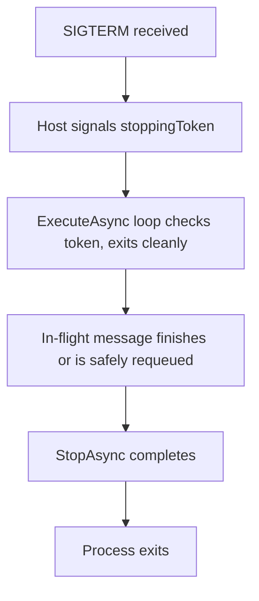

Background work — processing a queue, running a periodic job, warming a cache — is a normal part of most backend services, and .NET gives you a first-class abstraction for it: hosted services. Getting them wrong is subtle because the failures (a blocked startup, a leaked scope, duplicate work across replicas) don't show up in local testing.

## IHostedService vs BackgroundService

`IHostedService` is the low-level interface with `StartAsync`/`StopAsync`, both invoked by the host at application startup/shutdown. `BackgroundService` is an abstract base class implementing `IHostedService` for you, exposing a single `ExecuteAsync(CancellationToken)` method that you fill with a loop — it's the right starting point for almost all background work.

```csharp
public class QueueConsumerService : BackgroundService
{
    protected override async Task ExecuteAsync(CancellationToken stoppingToken)
    {
        while (!stoppingToken.IsCancellationRequested)
        {
            await DoWorkAsync(stoppingToken);
        }
    }
}
// registration: builder.Services.AddHostedService<QueueConsumerService>();
```

> [!KEY]
> All hosted services are registered as **singletons** and share the app's DI container and lifetime. If your background work needs a scoped service (a `DbContext`, a repository), you must create a scope manually — you cannot inject it directly.

## The StartAsync blocking trap

The host calls every `IHostedService.StartAsync` **sequentially and awaits each one** before the application is considered started and begins accepting requests. `BackgroundService.StartAsync` (inherited, not overridden in typical usage) calls `ExecuteAsync` but does **not** await its completion — it fires it and returns, which is exactly right for a long-running loop. The trap is overriding `StartAsync` directly and awaiting a long-running operation inside it, or writing an `ExecuteAsync` whose first line does something that never yields (a synchronous blocking call before the first `await`), which delays the whole application's startup or, worse, the readiness probe.

```csharp
// Wrong: blocks the host from starting until this returns
public override async Task StartAsync(CancellationToken cancellationToken)
{
    await LoadEntireCatalogIntoMemoryAsync(cancellationToken); // could take minutes
    await base.StartAsync(cancellationToken);
}

// Right: let ExecuteAsync run in the background, don't block startup
protected override async Task ExecuteAsync(CancellationToken stoppingToken)
{
    await LoadEntireCatalogIntoMemoryAsync(stoppingToken); // runs after the app has started
    while (!stoppingToken.IsCancellationRequested) { /* ... */ }
}
```

## Graceful shutdown and stopping tokens

When the host begins shutting down, it signals the `CancellationToken` passed to `ExecuteAsync` (and calls `StopAsync` on every hosted service), then waits up to `HostOptions.ShutdownTimeout` (default 30 seconds) for everything to finish. A well-behaved background service checks the token cooperatively inside its loop and inside any long-running work, so it can wind down within that window instead of being abruptly killed.



> [!WARNING]
> If your loop ignores `stoppingToken` inside a long unit of work (e.g. processing a huge batch with no cancellation checks), the host force-kills the process once `ShutdownTimeout` elapses — mid-operation, potentially corrupting state or losing a message that was neither fully processed nor safely requeued.

## Scoped services inside a singleton hosted service

Since hosted services are singletons, any scoped dependency (`DbContext`, most repositories) must be resolved from a manually created scope, not injected into the constructor.

```csharp
public class ReportService : BackgroundService
{
    private readonly IServiceScopeFactory _scopeFactory;
    public ReportService(IServiceScopeFactory scopeFactory) => _scopeFactory = scopeFactory;

    protected override async Task ExecuteAsync(CancellationToken stoppingToken)
    {
        while (!stoppingToken.IsCancellationRequested)
        {
            using var scope = _scopeFactory.CreateScope();
            var db = scope.ServiceProvider.GetRequiredService<AppDbContext>();
            await RunReportAsync(db, stoppingToken);
            await Task.Delay(TimeSpan.FromMinutes(10), stoppingToken);
        }
    }
}
```

## Periodic work with PeriodicTimer

`PeriodicTimer` (since .NET 6) is preferred for periodic async work because it gives a clear tick-based loop, integrates cleanly with cancellation, and does not queue overlapping callbacks when one iteration runs long. A simple `while` loop with `Task.Delay` after the work is also non-overlapping, but it drifts because the delay starts after each run finishes; callback timers such as `System.Timers.Timer` are the ones that most often overlap if the callback is slower than the period.

```csharp
protected override async Task ExecuteAsync(CancellationToken stoppingToken)
{
    using var timer = new PeriodicTimer(TimeSpan.FromMinutes(1));
    while (await timer.WaitForNextTickAsync(stoppingToken))
    {
        await RunOnceAsync(stoppingToken);
    }
}
```

If `RunOnceAsync` takes longer than the period, `PeriodicTimer` does not queue a burst of catch-up executions; the next `WaitForNextTickAsync` completes on the next available tick. That makes overrun behavior explicit without the reentrancy risk of callback-based timers.

## Web app vs separate worker process

| Approach | When it fits | Risk |
|---|---|---|
| Hosted service inside the web app | Lightweight, low-volume background work tightly coupled to the API | Competes for the same thread pool/memory as request handling; scaling the API also scales (and duplicates) the background work |
| Separate worker process/service | Heavier, independently-scaled workloads (queue consumers, batch jobs) | Extra deployment unit to operate, but isolates resource usage and scaling |

> [!TIP]
> A senior answer names the coupling risk directly: "If I scale the API to 10 replicas for HTTP load, and the same process also runs a hosted service polling a queue, I now have 10 consumers competing for the same queue — possibly fine, possibly a duplicate-processing bug, depending on whether the work is idempotent." Splitting into a separate worker service lets you scale the two independently.

## Scaling out and duplicate work

Running the same hosted service across multiple replicas means multiple instances may pick up the same periodic trigger or poll the same queue concurrently. For a queue with proper competing-consumer semantics (Service Bus, SQS with visibility timeout), this is usually fine — each message is delivered to one consumer. For a naive "run this every hour" timer with no distributed coordination, every replica fires independently, producing duplicate work (double-charging, duplicate emails). Use a distributed lock, a leader-election mechanism, or move the schedule to something inherently single-owner (a scheduled job outside the app, like a Kubernetes CronJob).

## Poison messages

A **poison message** is one that repeatedly fails processing and, without a limit, gets retried forever, blocking the queue or burning resources. The standard mitigation is a delivery-count/retry-count check that routes a message to a dead-letter queue after N failed attempts, so it's quarantined for manual inspection instead of endlessly retried.

```csharp
if (message.DeliveryCount > MaxRetries)
{
    await _deadLetterQueue.SendAsync(message);
    return;
}
```

## Channels for in-process producer-consumer

`System.Threading.Channels` gives you an in-memory, async-friendly queue for producer-consumer patterns **within a single process** — useful for decoupling an HTTP endpoint that needs to respond quickly from slower background processing, without needing an external message broker.

```csharp
var channel = Channel.CreateBounded<WorkItem>(new BoundedChannelOptions(1000)
{
    FullMode = BoundedChannelFullMode.Wait // apply backpressure instead of unbounded growth
});
// producer: await channel.Writer.WriteAsync(item);
// consumer (in a BackgroundService): await foreach (var item in channel.Reader.ReadAllAsync(stoppingToken))
```

> [!DANGER]
> An unbounded channel (or an unbounded in-memory queue in general) is a memory-leak-shaped outage waiting to happen: if the consumer falls behind the producer for any reason, the channel grows without limit until the process runs out of memory. Always bound the channel and choose a `FullMode` that applies backpressure (`Wait`) or sheds load (`DropOldest`) deliberately.

## Cheat sheet

- `BackgroundService.ExecuteAsync` is fire-and-forget from the host's perspective — don't await long work inside `StartAsync` itself.
- All hosted services are singletons; use `IServiceScopeFactory` to get scoped services like `DbContext`.
- Respect `stoppingToken` throughout your loop and any long operation so shutdown finishes within `ShutdownTimeout` (default 30s).
- Prefer `PeriodicTimer` over `Task.Delay` loops — it doesn't stack overlapping runs when an iteration overruns.
- Decide web-app-hosted vs separate worker process based on independent scaling needs, not convenience.
- Multiple replicas running the same "timer" job duplicate work unless the trigger is inherently single-owner or distributed-locked.
- Always cap retries and dead-letter poison messages — don't retry forever.
- Bound in-process channels and pick a `FullMode`; unbounded queues are an unbounded memory leak under load.

## Common mistakes

| Mistake | Fix |
|---|---|
| Awaiting slow work inside an overridden `StartAsync` | Do the work in `ExecuteAsync` instead, after the app has started |
| Injecting a scoped `DbContext` into a hosted service constructor | Inject `IServiceScopeFactory`, create a scope per unit of work |
| Ignoring `stoppingToken` inside long-running work | Check/pass the token throughout so shutdown completes gracefully |
| Using `Task.Delay` for periodic work | Use `PeriodicTimer`, which avoids overlapping ticks |
| Running a naive scheduled job across N replicas | Add distributed locking/leader election, or move it outside the app |
| Retrying a poison message indefinitely | Track delivery count and dead-letter after a threshold |
| Unbounded in-process channel/queue | Bound it and choose a deliberate `FullMode` |

## Summary

`BackgroundService` is the right default for background work in .NET, but its correctness depends on details that don't show up until production: never block application startup inside `StartAsync`, always resolve scoped services through a manually created scope, and always respect the cancellation token so shutdown is graceful instead of abrupt. Decide whether background work belongs inside the web process or in a separately scaled worker based on resource contention and duplicate-work risk, cap retries so a poison message can't loop forever, and bound any in-process queue so a slow consumer becomes backpressure instead of an out-of-memory crash.

## Top Interview Questions

### Q1. What is the difference between `IHostedService` and `BackgroundService`?

`IHostedService` is the raw interface with `StartAsync(CancellationToken)` and `StopAsync(CancellationToken)`, both called and awaited by the host during application startup and shutdown respectively — you're responsible for managing your own long-running loop and its lifetime. `BackgroundService` is an abstract class that implements `IHostedService` for you: its `StartAsync` kicks off your overridden `ExecuteAsync(CancellationToken)` method without awaiting its completion (so a long-running loop doesn't block application startup), and its `StopAsync` signals the cancellation token and waits briefly for `ExecuteAsync` to wind down. In practice, `BackgroundService` covers the vast majority of use cases; you'd drop down to raw `IHostedService` only if you needed asymmetric start/stop logic that doesn't fit a single continuous loop.

### Q2. Why can overriding `StartAsync` and awaiting long-running work inside it be dangerous?

The host calls every registered `IHostedService.StartAsync` sequentially and **awaits each one** before the application is considered fully started — for a web app, that means before it starts accepting HTTP requests or reporting itself ready. If a hosted service awaits a slow operation directly inside `StartAsync` (loading a large cache, running a migration), the entire application's startup is blocked for that duration, which can trip liveness/readiness probes with tight timeouts or simply make deploys much slower than they need to be. The fix is to do that work inside `ExecuteAsync` instead (which `BackgroundService.StartAsync` fires without awaiting), so the app finishes starting immediately and the slow work proceeds in the background.

### Q3. How do you use a scoped service like `DbContext` inside a `BackgroundService`, given that hosted services are registered as singletons?

You can't inject a scoped service into the constructor — the container would either throw (with scope validation enabled) or, worse, silently capture one instance for the service's entire lifetime, the classic captive-dependency bug. Instead, inject `IServiceScopeFactory` (a singleton, safe to hold long-term), and inside each unit of work call `_scopeFactory.CreateScope()` to get a fresh `IServiceScopeProvider`, resolve the scoped service from it, use it, and let the `using` block dispose the scope — mirroring what an HTTP request's scope boundary would do automatically. This should happen once per logical unit of work (e.g. once per loop iteration or once per message), not once for the whole service's lifetime.

### Q4. What does the `CancellationToken` passed into `ExecuteAsync` represent, and how should a background loop use it?

That token is signalled by the host when the application begins graceful shutdown (e.g. on receiving `SIGTERM` in a container, or `Ctrl+C` locally), giving the background service a chance to stop cleanly rather than being killed mid-operation. A well-written loop checks `stoppingToken.IsCancellationRequested` (or lets an awaited call throw `OperationCanceledException` when the token is signalled) at the top of each iteration, and passes the same token into any downstream async calls — database queries, HTTP calls, delays — so those operations can also be cancelled promptly rather than running to completion regardless. The host only waits up to `HostOptions.ShutdownTimeout` (30 seconds by default) for everything to wind down before forcibly terminating the process, so ignoring the token risks losing in-flight work or being killed mid-write.

### Q5. Why is `PeriodicTimer` generally preferred over a `while` loop with `Task.Delay` for periodic background work?

A `Task.Delay(period)` loop measures the delay starting from *after* the previous iteration's work completes, so if the work itself takes variable or unpredictable time, the actual interval between runs drifts. More importantly, naive alternatives like `System.Timers.Timer` can fire a new tick while the previous callback is still running, leading to overlapping executions that compete for the same resources or corrupt shared state if the work isn't reentrant. `PeriodicTimer.WaitForNextTickAsync` only returns one tick at a time and inherently will not queue up multiple pending ticks if an iteration runs long — the next `WaitForNextTickAsync` call simply returns as soon as the next scheduled tick arrives, without stacking bursts of catch-up executions, and it integrates directly with a `CancellationToken` for clean shutdown.

### Q6. You have a hosted service running inside your web API that polls a queue, and you scale the API from 2 to 10 replicas for HTTP load. What goes wrong, and how would you fix it?

Scaling the web app for HTTP traffic also scales the hosted service running inside it, because they're the same process — you now have 10 independent queue pollers instead of 2, which is only safe if the queue technology guarantees each message is delivered to exactly one consumer (competing-consumer semantics with visibility timeouts, like Service Bus or SQS) and the processing is otherwise idempotent. If it doesn't, or if the "work" is actually a naive scheduled job rather than a real queue, you'll get duplicate processing — duplicate emails, duplicate charges — proportional to replica count. The fix is to decouple the two concerns: run the queue consumer as a separately deployed worker service scaled independently based on queue depth, rather than piggybacking it on however many replicas the API needs for unrelated HTTP load.

### Q7. What is a poison message, and how do you prevent it from degrading your system?

A poison message is one that consistently fails processing — due to a bug, a malformed payload, or a downstream dependency issue specific to that message — and without a limit, keeps getting redelivered and retried indefinitely, consuming consumer capacity and potentially blocking other messages behind it in ordered-processing scenarios. The standard mitigation is tracking a delivery/retry count per message (many queue systems provide this natively, like `DeliveryCount` in Service Bus or `ApproximateReceiveCount` in SQS) and, once it exceeds a threshold, routing the message to a dead-letter queue instead of retrying again — quarantining it for manual inspection or automated alerting rather than looping forever. This also protects overall throughput: one bad message shouldn't be allowed to consume a disproportionate share of consumer capacity indefinitely.

### Q8. When would you choose `System.Threading.Channels` over an external message broker like a queue service?

Channels are in-process and in-memory, so they're appropriate when the producer and consumer live in the same process and you don't need durability across restarts, cross-service delivery, or horizontal scaling of consumers independent of the producer — a common case is decoupling a fast HTTP endpoint from slower background processing within the same web app, so the endpoint can return quickly while a `BackgroundService` drains the channel. An external broker (Service Bus, SQS, Kafka) is the right choice when you need the work to survive a process restart, be processed by a different service or scaled independently, be retried/dead-lettered by the broker itself, or be observed/audited outside the process. A rule of thumb: if losing the queued items on a crash or redeploy is unacceptable, you need a durable broker, not an in-memory channel.

### Q9. Why must you bound a `Channel<T>` (or any in-process queue) instead of leaving it unbounded?

If the consumer processes items more slowly than the producer enqueues them — because of a slow downstream call, a burst of traffic, or a bug — an unbounded channel will keep accepting writes and grow without limit, since nothing pushes back on the producer. This is a classic slow, deferred failure mode: memory usage climbs quietly until the process is OOM-killed, often well after the root cause (a slow consumer) has already degraded response times elsewhere. A bounded channel with `BoundedChannelFullMode.Wait` applies backpressure directly to the producer — a write simply awaits until there's room — turning an unbounded memory leak into an observable, deliberate slowdown that surfaces as an actionable metric (queue full, producer blocked) instead of a silent crash hours later.

### Q10. How would you design a robust queue-consuming `BackgroundService` for production use?

I'd structure it around a `PeriodicTimer` or a native async-receive loop (depending on the queue client's API) inside `ExecuteAsync`, wrap each message's processing in a try/catch that distinguishes transient failures (worth retrying) from permanent ones (worth dead-lettering immediately), and check the message's delivery count against a max-retry threshold before reprocessing to avoid poison-message loops. I'd resolve any scoped dependencies (a `DbContext`, a unit of work) via `IServiceScopeFactory.CreateScope()` once per message rather than once for the service's lifetime, respect the `stoppingToken` throughout so shutdown can complete within the host's timeout, and make sure the processing logic is idempotent so at-least-once delivery semantics (which most queues provide) don't cause duplicate side effects on redelivery after a crash mid-processing.

### Q11. In production, you notice CPU usage on your worker service spikes every hour on the hour, correlating with a scheduled `BackgroundService` job. What would you check?

I'd first check whether the job's actual work has grown (more rows, larger payloads) faster than expected, which is the mundane and common explanation, by looking at the job's own duration and item-count metrics over time. If duration is stable but CPU spikes are new, I'd check for accidental overlap — verify the job isn't using a naive `Task.Delay` loop that could stack overlapping runs if a previous iteration occasionally overran, and confirm only the expected number of replicas are actually running this job (a redeploy or autoscaling event could have added replicas that all independently fire the same "run at :00" logic). I'd also check whether the CPU spike correlates with GC pressure from processing a large batch in memory all at once, which might call for streaming/paginating the work instead of loading everything before processing.

### Q12. How do you decide whether background work belongs inside the existing web application process or in a separate worker service?

The main factors are scaling independence and resource contention: if the background work's load doesn't correlate with HTTP request volume (a nightly batch job versus API traffic that peaks during business hours), bundling them means you either over-provision the API to satisfy the batch job's resource needs or under-provision the batch job to keep API costs down — neither is ideal. A separate worker process lets you scale each independently (e.g. autoscale the worker based on queue depth, autoscale the API based on request rate) and isolates a runaway background job from starving the thread pool or memory available to request handling. I'd keep genuinely lightweight, tightly-coupled work (a cache warm-up tied to that specific instance) inside the web process, and move anything with independent scaling needs, meaningful resource consumption, or a need for reliable delivery/retry semantics into its own worker.
