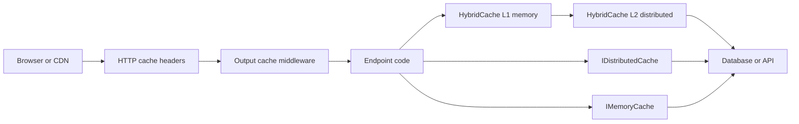

ASP.NET Core caching questions are usually about picking the correct framework feature, not proving that caches are fast. The strong answer names the scope, the invalidation mechanism, and the security boundary: in-process object cache, distributed byte store, .NET 9 HybridCache, HTTP response caching, or output caching.

## The ASP.NET Core Caching Map

ASP.NET Core exposes several caching surfaces that look similar until you ask where the value lives and who is allowed to reuse it. `IMemoryCache` is a singleton in the current process. `IDistributedCache` is a shared byte store such as Redis or SQL Server. `HybridCache` combines local and distributed storage with framework-managed coalescing. Response caching and output caching operate on HTTP responses rather than arbitrary objects.



| Feature | Scope | Stores | Best interview answer |
|---|---|---|---|
| `IMemoryCache` | One process | Live objects | Fastest, but every instance has a different cache |
| `IDistributedCache` | Whole app fleet | `byte[]` with helper string extensions | Correct across instances, but pays serialization and network latency |
| `HybridCache` | One process plus shared secondary | Typed values serialized to L2 | .NET 9 answer for L1 plus L2 plus stampede protection |
| Response caching | HTTP clients, proxies, response middleware | Full HTTP responses under HTTP cache rules | Good for public GET responses controlled by `Cache-Control` |
| Output caching | Server-side middleware | Full endpoint output in `IOutputCacheStore` | Server policy cache with vary rules, tags, and eviction |

> [!KEY]
> If the response depends on user identity, never put it in a shared HTTP cache. Use a private browser cache, a server-side cache keyed by user or tenant, or output caching with an explicit per-user vary policy.

## IMemoryCache Mechanics

`IMemoryCache` is in-process and stores object references, so it has no serialization cost and can be sub-microsecond on hot paths. It is appropriate for small, hot, recomputable data where each app instance can tolerate having its own copy: feature metadata, lookup tables, expensive pure computations, or short-lived local replicas of distributed state.

`MemoryCacheEntryOptions` controls expiration, priority, size, and callbacks. Absolute expiration caps total lifetime. Sliding expiration extends lifetime each time the entry is accessed. Sliding expiration without an absolute cap can keep a hot entry alive forever, so combine them when staleness matters. Eviction callbacks are useful for telemetry, but they run after eviction and should not perform heavy work.

```csharp
builder.Services.AddMemoryCache(options =>
{
    options.SizeLimit = 10_000; // Unitless. Every entry must set Size.
});

public sealed class ProductLookup(IMemoryCache cache, IProductRepository repo, ILogger<ProductLookup> log)
{
    public Task<ProductDto?> GetAsync(int id, CancellationToken ct) =>
        cache.GetOrCreateAsync($"product:{id}", async entry =>
        {
            entry.AbsoluteExpirationRelativeToNow = TimeSpan.FromMinutes(10);
            entry.SlidingExpiration = TimeSpan.FromMinutes(2);
            entry.Size = 1;
            entry.RegisterPostEvictionCallback((key, value, reason, state) =>
                log.LogInformation("Cache entry {Key} evicted because {Reason}", key, reason));

            return await repo.FindProductAsync(id, ct);
        });
}
```

Size limits are deliberately unitless: you decide whether one unit means one item, one kilobyte, or an estimated cost. If `SizeLimit` is set, every entry must set `Size`; otherwise insertion fails. Avoid putting a size limit on a shared `IMemoryCache` used by libraries you do not control, because their entries may not specify size. Use a dedicated `MemoryCache` instance when you need strict sizing.

> [!WARNING]
> `IMemoryCache` breaks as a correctness mechanism the moment you scale out. Instance A can evict or refresh a key while instance B keeps serving the old value.

## IDistributedCache Mechanics

`IDistributedCache` gives all instances one shared cache abstraction. The core interface works with `byte[]`: `GetAsync`, `SetAsync`, `RefreshAsync`, and `RemoveAsync`. String helpers exist, but typed objects are your responsibility. That means you choose serialization, versioning, compression, and error handling. Redis is the common low-latency implementation; SQL Server is useful when teams want operational simplicity or already run SQL infrastructure, but it is usually slower than Redis.

```csharp
builder.Services.AddStackExchangeRedisCache(options =>
{
    options.Configuration = builder.Configuration.GetConnectionString("Redis");
    options.InstanceName = "orders:";
});

public sealed class OrderSummaryCache(IDistributedCache cache, IOrderRepository repo)
{
    public async Task<OrderSummary> GetAsync(Guid tenantId, Guid orderId, CancellationToken ct)
    {
        var key = $"order-summary:{tenantId}:{orderId}";
        var bytes = await cache.GetAsync(key, ct);

        if (bytes is not null)
            return JsonSerializer.Deserialize<OrderSummary>(bytes)!;

        var summary = await repo.LoadSummaryAsync(tenantId, orderId, ct);
        await cache.SetAsync(
            key,
            JsonSerializer.SerializeToUtf8Bytes(summary),
            new DistributedCacheEntryOptions
            {
                AbsoluteExpirationRelativeToNow = TimeSpan.FromMinutes(5),
                SlidingExpiration = TimeSpan.FromMinutes(1)
            },
            ct);

        return summary;
    }
}
```

The trade is correctness across instances for serialization and network cost. A Redis round trip is still far cheaper than a database query, but it is not free; caching tiny values that are cheaper to compute than serialize is a net loss. `IDistributedCache` also has no tag model and no built-in request coalescing, so grouped invalidation and stampede protection must be built on top of it.

| Implementation | What it gives | Watch out for |
|---|---|---|
| Redis | Fast shared cache, TTL support, common production choice | Network dependency and serialization on every miss or hit |
| SQL Server | Shared cache table using existing SQL operations | Higher latency and load on SQL infrastructure |
| In-memory distributed cache | Development convenience | Not distributed, despite the interface name |

## HybridCache in .NET 9

`HybridCache` exists because many teams hand-rolled the same pattern: check local memory first, then Redis, then the database, while trying to prevent one expired hot key from causing a database stampede. In .NET 9, `Microsoft.Extensions.Caching.Hybrid` provides that pattern as a framework abstraction. It checks the primary in-process cache, then the secondary distributed cache if configured, then calls your factory and stores the result in both layers.

It also coalesces concurrent misses for the same key within a single `HybridCache` instance: one caller runs the factory, and other callers await that result. That is stampede protection for the common single-instance hot key case. It does not coordinate the factory across different app instances, so a fleet-wide cold start can still send one miss per instance unless the L2 cache is warm or you add warm-up.

```csharp
builder.Services.AddStackExchangeRedisCache(options =>
{
    options.Configuration = builder.Configuration.GetConnectionString("Redis");
});

builder.Services.AddHybridCache(options =>
{
    options.DefaultEntryOptions = new HybridCacheEntryOptions
    {
        Expiration = TimeSpan.FromMinutes(10),
        LocalCacheExpiration = TimeSpan.FromSeconds(30)
    };
});

public sealed class CatalogService(HybridCache cache, IProductRepository repo)
{
    public Task<ProductDto> GetProductAsync(Guid tenantId, int productId, CancellationToken ct) =>
        cache.GetOrCreateAsync(
            $"product:{tenantId}:{productId}",
            async token => await repo.LoadProductAsync(tenantId, productId, token),
            new HybridCacheEntryOptions
            {
                Expiration = TimeSpan.FromMinutes(15),
                LocalCacheExpiration = TimeSpan.FromSeconds(20)
            },
            tags: [$"tenant:{tenantId}", $"product:{productId}"],
            cancellationToken: ct);

    public Task InvalidateProductAsync(Guid tenantId, int productId, CancellationToken ct) =>
        cache.RemoveByTagAsync($"product:{productId}", ct);
}
```

Tag invalidation in `HybridCache` is logical. Calling `RemoveByTagAsync` establishes that older values with the tag should be ignored; it does not physically delete every local and distributed value immediately. Old entries age out by normal expiration. That design is why tags work on top of caches that do not natively understand tags.

> [!TIP]
> In new .NET 9 code, reach for `HybridCache` before writing your own `IMemoryCache` plus Redis plus per-key lock wrapper. It is the framework answer to that repeated pattern.

## Response Caching and Output Caching

Response caching is HTTP-header-driven. `ResponseCacheAttribute` sets headers such as `Cache-Control` and `Vary`, and response caching middleware follows HTTP caching rules, including client request directives. It is useful for public GET or HEAD responses where the body is the same for every allowed cache consumer.

Output caching, available from .NET 7, is server-side and policy-driven. It is configured with `AddOutputCache`, `UseOutputCache`, endpoint attributes, and endpoint builder policies. It can vary by route, query, header, or a custom value, and it supports tag eviction through `IOutputCacheStore`. By default it avoids unsafe cases such as authenticated responses and `Set-Cookie`; if you deliberately cache authenticated output, place middleware after authentication and authorization, vary by a stable user or tenant key, and write a policy that explicitly allows that behavior.

```csharp
builder.Services.AddResponseCaching();
builder.Services.AddOutputCache(options =>
{
    options.AddPolicy("ProductList", policy => policy
        .Expire(TimeSpan.FromSeconds(30))
        .SetVaryByQuery("category", "page")
        .Tag("products"));
});

app.UseAuthentication();
app.UseAuthorization();
app.UseResponseCaching();
app.UseOutputCache();

app.MapGet("/products", GetProducts).CacheOutput("ProductList");

app.MapPost("/products/purge", async (IOutputCacheStore store, CancellationToken ct) =>
{
    await store.EvictByTagAsync("products", ct);
    return Results.NoContent();
});
```

| Dimension | Response caching | Output caching |
|---|---|---|
| Control plane | HTTP headers and RFC caching rules | Server policy and endpoint metadata |
| Client `Cache-Control: no-cache` | Respected | Server controls cache policy |
| Authenticated responses | Not safe for shared caches | Possible only with explicit safe vary policy |
| Invalidation | Freshness headers and validators | Expiration plus tag eviction |
| Storage | Browser, proxy, or response caching middleware | `IOutputCacheStore`, memory by default, Redis supported |
| Stampede protection | Depends on cache layer | Resource locking enabled by default |

## HTTP Edge Caching Mechanics

HTTP caching is about making clients and intermediaries avoid full responses. `Cache-Control: public, max-age=60` says shared caches may reuse the response for 60 seconds. `private` limits storage to the user's browser. `no-cache` means the stored response must be revalidated before reuse. `no-store` means do not store any part of the request or response.

Validators save payload bytes when data has not changed. The server returns an `ETag`, the client later sends `If-None-Match`, and the server can return `304 Not Modified` with no body. `Last-Modified` and `If-Modified-Since` are the timestamp-based version of the same idea. `Vary` tells caches which request headers are part of the cache key; without `Vary: Accept-Language`, one language can accidentally be served to another.

| Header | Meaning | Common failure |
|---|---|---|
| `Cache-Control` | Freshness and storage directives | Confusing `no-cache` with `no-store` |
| `ETag` | Version token for revalidation | Generating unstable tags that change every request |
| `If-None-Match` | Client asks whether its ETag is still current | Returning full `200` when `304` would work |
| `Last-Modified` | Server timestamp for validator logic | One-second precision can miss rapid updates |
| `Vary` | Adds request headers to the cache key | Forgetting authorization, encoding, or language differences |
| `Set-Cookie` | Personalizes client state | Shared caches must not store these responses |

> [!DANGER]
> Anything that emits `Set-Cookie`, depends on `Authorization`, or contains per-user data must not be stored in a shared public cache. A fast data leak is still a data leak.

## Production Concerns

The two recurring production failures are stampedes and wrong sharing. A stampede happens when a hot key expires and many requests miss at once. `HybridCache` request coalescing and output cache resource locking both reduce this by making other callers wait for the first refresh. For older `IMemoryCache` or `IDistributedCache` code, use a per-key `SemaphoreSlim` or a single-flight wrapper, never one global lock.

Invalidation should be chosen by the unit of change. Key deletion is precise. Tag invalidation works for groups such as all product pages or all tenant dashboards. Short TTLs are acceptable when staleness is cheap and writes are frequent. Event-based invalidation is useful when writes happen in one service and reads happen in another, but it must tolerate missed events with a TTL safety net.

Monitor hit ratio, miss rate, load duration on misses, Redis latency, serialization failures, local cache evictions, output cache storage size, and tag eviction counts. A high hit ratio with bad p99 latency can still mean the miss path is stampeding or a few keys are huge. A low hit ratio can mean the key includes unnecessary variation such as a timestamp, cursor, or header that should not be part of identity.

## Cheat sheet

- `IMemoryCache` stores live objects in one process; it is fastest and least shared.
- Use absolute expiration as a hard cap and sliding expiration as an activity window.
- If `SizeLimit` is set, every `IMemoryCache` entry needs `Size`; prefer a dedicated cache for sized entries.
- `IDistributedCache` is a `byte[]` abstraction; typed serialization, compression, and versioning are your job.
- Redis and SQL Server implementations trade a network hop for correctness across app instances.
- `HybridCache` is .NET 9's L1 plus L2 cache with request coalescing and tag invalidation.
- `HybridCache` tag invalidation is logical; old values are ignored before they physically expire.
- Response caching follows HTTP headers and is for public cacheable responses.
- Output caching is server-side and policy-driven, with vary rules, tags, and resource locking.
- Use `ETag` or `Last-Modified` validators to return `304` when the client already has the current body.
- Never cache `Set-Cookie` or per-user authenticated payloads in a shared cache.
- Watch hit ratio and miss latency together; either one alone can hide the real problem.

## Common mistakes

| Mistake | Fix |
|---|---|
| Using `IMemoryCache` for data that must invalidate across all pods | Use `IDistributedCache`, `HybridCache`, or publish invalidation events |
| Setting sliding expiration with no absolute cap | Add an absolute expiration to bound staleness |
| Forgetting `Size` when `SizeLimit` is configured | Set size on every entry or use an unsized cache |
| Treating `IDistributedCache` as a typed object cache | Serialize explicitly and handle schema changes |
| Caching personalized responses with `Cache-Control: public` | Use `private`, `no-store`, user-scoped server keys, or safe output cache variation |
| Varying by the entire query string when only one key matters | Vary only by the parameters that affect the response |
| Solving stampedes with one global lock | Lock or coalesce per cache key |
| Monitoring only hit ratio | Also monitor miss cost, evictions, payload size, and backend load |

## Summary

ASP.NET Core caching is a set of separate tools with different safety boundaries. Use `IMemoryCache` for local hot objects, `IDistributedCache` for shared serialized values, and `HybridCache` when you want the common two-tier pattern without hand-rolling coalescing and invalidation. Response caching is HTTP semantics for public responses, while output caching is server policy for endpoint output. The senior signal is knowing not only how to enable a cache, but how it varies, invalidates, avoids stampedes, and prevents cross-user leaks.

## Top Interview Questions

### Q1. Compare `IMemoryCache`, `IDistributedCache`, and `HybridCache`.

`IMemoryCache` is an in-process object cache. It is fastest because there is no network hop or serialization, but every app instance has its own copy, so it is not a correctness mechanism across a scaled-out fleet. `IDistributedCache` is shared across instances through implementations such as Redis or SQL Server, but the interface stores `byte[]`, so serialization and payload versioning are your responsibility and every access pays a network cost. `HybridCache` in .NET 9 combines both ideas: L1 in-process memory for speed, L2 distributed cache for sharing, typed APIs, request coalescing, and tags. For new .NET 9 services needing both speed and shared state, it is usually the first option to consider.

### Q2. How do absolute and sliding expiration differ in `IMemoryCache`?

Absolute expiration sets a hard deadline after which the entry is stale regardless of how often it was read. Sliding expiration resets the timer on each access, so a frequently used value can stay cached as long as traffic continues. Sliding expiration is useful for values that should disappear after inactivity, but it is dangerous alone because a hot key can live forever and serve stale data indefinitely. The normal production pattern is to combine them: sliding expiration keeps active values warm, while absolute expiration caps the maximum staleness. In ASP.NET Core this is configured through `MemoryCacheEntryOptions` or directly on the `ICacheEntry` inside `GetOrCreateAsync`.

### Q3. What does `SizeLimit` do in `IMemoryCache`, and what is the trap?

`SizeLimit` creates a unitless capacity limit for a `MemoryCache` instance. The cache does not know bytes automatically; your application defines what one unit means and every entry must set `Size`. The trap is enabling `SizeLimit` on the shared `IMemoryCache` registered in DI while other framework or library code also uses that cache. If those entries do not set `Size`, insertion can fail. For strict sizing, use a dedicated `MemoryCache` instance that only your code writes to. Also remember that size limits are not a replacement for good key design; caching unbounded user-generated keys can still churn and evict useful entries.

### Q4. Why does `IDistributedCache` use bytes, and what does that mean for application code?

`IDistributedCache` is intentionally a minimal abstraction that can be implemented by Redis, SQL Server, or another store. A byte-array API avoids forcing one serializer or object model on every implementation. The cost is that application code must serialize and deserialize typed objects, decide on JSON versus another format, handle version changes, and watch payload size. Serialization happens on both hits and misses, so it can dominate the cost for small or cheap-to-compute values. It also means exceptions from corrupt or old payloads must be handled deliberately, usually by treating the value as a miss and repopulating rather than failing the request.

### Q5. How does `HybridCache` reduce cache stampedes?

`HybridCache.GetOrCreateAsync` coalesces concurrent misses for the same key within a single `HybridCache` instance. If ten requests miss the same key at once, one request runs the factory that loads from the database or API, and the others await that result instead of all calling the backend. The result is then stored in the local and secondary caches. This is the framework version of the single-flight or per-key lock many teams previously wrote themselves. The nuance is scope: coalescing is per app instance, not fleet-wide. If every pod starts cold at once, each pod can still run one factory call until the distributed cache is warmed.

### Q6. What is tag-based invalidation in `HybridCache` and output caching?

Tags group cache entries so one invalidation can affect many keys. In output caching, endpoints can be tagged and `IOutputCacheStore.EvictByTagAsync` evicts cached responses for that group, such as all product-list pages. In `HybridCache`, entries can be created with tags and later invalidated with `RemoveByTagAsync`. The important nuance is that `HybridCache` tag invalidation is logical: it records that entries created before the invalidation point should be treated as misses. The old values may remain physically stored until normal expiration. Tags are useful when writes change many cached views, but they are not an excuse for vague invalidation names; use stable tags such as tenant, product, or dashboard groups.

### Q7. What is the difference between response caching and output caching?

Response caching is driven by HTTP cache headers and follows HTTP caching rules. It is appropriate for public GET or HEAD responses where clients, proxies, or response caching middleware may reuse the body based on `Cache-Control`, `Vary`, and validators. Output caching is server-side and policy-driven. It caches endpoint output according to ASP.NET Core policies, supports vary rules and tag eviction, and can be backed by memory or Redis. The interview distinction is control: response caching optimizes HTTP reuse and respects client cache directives, while output caching protects server work under server-defined rules. Output caching can be used for authenticated endpoints only when you explicitly vary by user or tenant and allow that behavior safely.

### Q8. How do `ETag` and `If-None-Match` work?

The server sends an `ETag` header that represents the current version of a resource. The client stores both the body and the ETag. On a later request, the client sends `If-None-Match` with that ETag. If the resource has not changed, the server returns `304 Not Modified` with no body, and the client reuses its cached copy. This saves payload bytes and serialization work, though it still requires a round trip. `Last-Modified` and `If-Modified-Since` are the timestamp-based alternative. The common mistake is generating unstable ETags that change every response, which prevents revalidation from ever succeeding.

### Q9. How would you cache a personalized ASP.NET Core API response safely?

First, do not put it in a shared HTTP cache. Avoid `Cache-Control: public`; use `private` for browser-only caching or `no-store` if the data is sensitive. Server-side, use a key that includes tenant and user identity, such as `feed:{tenantId}:{userId}:{cursor}`, and keep the TTL short enough for the product's staleness tolerance. In ASP.NET Core output caching, only cache authenticated output with an explicit policy that varies by stable user or tenant identity and runs after authentication and authorization. Do not rely on `Vary: Authorization` at a CDN as the main safety mechanism; many shared caches bypass or mishandle authorization variation.

### Q10. What would you monitor for ASP.NET Core caching in production?

Monitor hit ratio, miss rate, miss load duration, cache backend latency, serialization failures, entry size, eviction counts, and application p95 or p99 latency. For `IMemoryCache`, watch process memory and eviction reasons. For Redis-backed `IDistributedCache` or `HybridCache`, watch Redis timeouts, connection errors, payload sizes, and fallback load on the database during cache outages. For output caching, watch storage size, served-from-cache counts, tag evictions, and whether unsafe responses are being excluded as expected. Hit ratio alone is not enough: a 99 percent hit ratio can still hurt if the 1 percent miss path stampedes a database or loads huge payloads.
