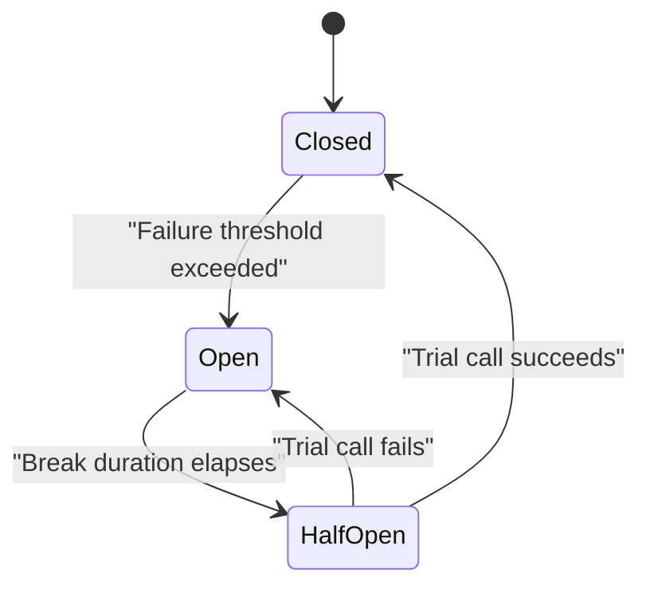

Every network call can fail, hang, or slow down, and a distributed system that doesn't plan for that will eventually turn one slow dependency into a full outage. Resilience patterns are the standard vocabulary for reasoning about this — interviewers use this topic to check whether you've actually operated a service that calls other services, not just built one.

## Timeouts: the most common production failure

An HTTP call, a database query, or a queue receive with **no timeout** will wait as long as the underlying transport allows — often minutes, sometimes forever. Under load, threads (and connections) pile up waiting on a slow dependency, and the caller runs out of capacity long before the dependency actually fails outright. This single missing setting is behind an outsized share of real production incidents.

```csharp
var client = new HttpClient { Timeout = TimeSpan.FromSeconds(5) };
// or, per-request with a resilience pipeline (recommended — see below):
var pipeline = new ResiliencePipelineBuilder()
    .AddTimeout(TimeSpan.FromSeconds(2))
    .Build();
```

> [!KEY]
> Always set an explicit timeout shorter than whatever timeout the *caller of your service* has, so your service fails fast enough that its own caller doesn't time out first while you're still "trying". A chain of unaligned timeouts is a classic cause of cascading slowness.

## Retries — and when retrying is harmful

Retrying makes sense for **transient** failures: a dropped connection, a `503` from an overloaded but recovering service, a brief network blip. Retrying is actively harmful for **non-transient** failures — a `400 Bad Request` will fail identically every time, and retrying it wastes capacity and adds latency for no benefit. Retrying a `429 Too Many Requests` without honouring backoff makes the underlying overload *worse*, not better.

| Failure type | Retry? | Why |
|---|---|---|
| Connection reset / timeout | Yes | Often transient network blip |
| `503 Service Unavailable` | Yes, with backoff | Service is recovering, don't pile on |
| `429 Too Many Requests` | Yes, honouring `Retry-After` | Server is explicitly asking you to slow down |
| `400 Bad Request` | No | Deterministic — will fail identically every time |
| `401`/`403` | No | Retrying won't fix an auth problem |
| `409 Conflict` | Depends | Only if the operation is safe to recompute (e.g. re-read then retry) |

## Exponential backoff with jitter

Fixed-interval retries from many clients synchronize into repeated waves hitting the recovering service at the same moment — this is exactly the **thundering herd** / retry storm problem. Exponential backoff spaces out successive retries; adding random jitter spreads different clients' retries across time so they don't all retry in lockstep.

```csharp
var delay = TimeSpan.FromMilliseconds(
    Math.Min(baseDelayMs * Math.Pow(2, attempt), maxDelayMs)
    + Random.Shared.Next(0, jitterMs));
```

> [!WARNING]
> Backoff without a cap on max delay or max attempts means a client can retry a hung dependency for an unbounded amount of time, holding a thread/connection the whole way. Always set a **retry budget**: a maximum number of attempts, and/or a maximum total time spent retrying.

## Circuit breaker states

A circuit breaker stops sending calls to a dependency that's clearly failing, instead of continuing to send doomed requests and waiting out their (possibly long) timeouts. It has three states.



| State | Behaviour |
|---|---|
| Closed | Calls pass through normally; failures are counted |
| Open | Calls fail immediately without attempting the dependency, for a configured break duration |
| Half-open | A limited number of trial calls are let through to test recovery |

> [!TIP]
> A senior answer names the benefit precisely: "The circuit breaker protects the *caller* — once open, it fails fast instead of waiting out timeouts on every request, freeing up threads and connections that would otherwise be stuck." It's as much about protecting yourself as protecting the downstream service.

## Bulkhead isolation

Named after ship compartments that stop one flooded section from sinking the whole vessel — a bulkhead limits how much of your resource pool (threads, connections, concurrency) any single dependency can consume, so a slow or failing dependency can't starve calls to everything else. In .NET, this is typically a concurrency limiter per downstream dependency (e.g. a semaphore-based limit, or a per-client `HttpClient` with its own connection pool via `IHttpClientFactory`), rather than one shared unbounded pool for all outbound calls.

## Fallback and graceful degradation

A fallback is what you do **instead of** failing outright: serve a cached or default value, degrade to reduced functionality, or return a partial response. The key design question is whether a stale/default answer is better than an error for that specific feature — a recommendation widget failing open to "no recommendations" is fine; a payment authorization failing open to "approved" is not.

```csharp
var pipeline = new ResiliencePipelineBuilder<Recommendations>()
    .AddFallback(new FallbackStrategyOptions<Recommendations>
    {
        FallbackAction = _ => Outcome.FromResultAsValueTask(Recommendations.Empty)
    })
    .Build();
```

## Hedged requests

A hedged request sends a duplicate request to a redundant backend (or retries early) if the first hasn't responded within some threshold, taking whichever response comes back first and cancelling the other. This trades extra load for lower tail latency — useful when p99 latency matters more than the modest cost of occasional duplicate work, and only safe when the operation is idempotent or safely cancellable.

## Combining policies in order

Resilience strategies compose, and **order changes behaviour**. A common, sensible order from outermost to innermost:

| Order | Policy | Why here |
|---|---|---|
| 1 (outermost) | Fallback | Catches anything that still fails after everything below it |
| 2 | Circuit breaker | Stops calling a clearly-broken dependency before paying for retries/timeouts |
| 3 | Retry | Retries individual attempts within the circuit's view |
| 4 (innermost) | Timeout | Bounds each individual attempt |

> [!DANGER]
> Putting retry **outside** the circuit breaker means each "retry" is seen by the breaker as a separate failure count reset, and you can retry your way past a breaker that should have opened — defeating its purpose. Putting timeout outside retry means a single timeout ends the whole operation instead of bounding each attempt.

## Polly and the .NET resilience pipeline

Polly is the standard .NET resilience library; since .NET 8, `Microsoft.Extensions.Resilience` wraps it into a first-class `ResiliencePipeline` that integrates with `IHttpClientFactory`.

```csharp
builder.Services.AddHttpClient<OrdersClient>()
    .AddResilienceHandler("orders-pipeline", builder =>
    {
        builder.AddRetry(new RetryStrategyOptions
        {
            MaxRetryAttempts = 3,
            BackoffType = DelayBackoffType.Exponential,
            UseJitter = true
        });
        builder.AddCircuitBreaker(new CircuitBreakerStrategyOptions
        {
            FailureRatio = 0.5,
            SamplingDuration = TimeSpan.FromSeconds(30),
            BreakDuration = TimeSpan.FromSeconds(15)
        });
        builder.AddTimeout(TimeSpan.FromSeconds(5));
    });
```

This registers retry, circuit breaker and timeout as a named pipeline attached to every call made through `OrdersClient`'s `HttpClient`, with no code changes needed at each call site.

## A table: failure type to pattern

| Symptom | Right pattern |
|---|---|
| Occasional transient network blip | Retry with exponential backoff and jitter |
| Dependency is clearly down/overloaded | Circuit breaker |
| One slow dependency starves calls to others | Bulkhead (per-dependency concurrency limit) |
| Call hangs indefinitely | Timeout |
| A feature can tolerate a stale/default answer | Fallback |
| Tail latency (p99) matters more than extra load | Hedged requests |
| Many clients retrying in lockstep | Jitter, and/or a shared circuit breaker |

## Cheat sheet

- Always set a timeout, shorter than your own caller's timeout — this is the single highest-value resilience setting.
- Retry only transient failures (`503`, timeouts, connection resets); never retry deterministic errors (`400`).
- Exponential backoff + jitter prevents synchronized retry storms; always cap total retry attempts/time (a retry budget).
- Circuit breaker states: Closed (normal) → Open (fail fast) → Half-open (probe) → Closed or Open again.
- Bulkheads isolate concurrency per dependency so one slow dependency can't starve calls to others.
- Fallbacks are only safe when a stale/default/degraded answer is genuinely acceptable for that feature.
- Compose policies outermost-to-innermost as: fallback → circuit breaker → retry → timeout.
- Polly / `Microsoft.Extensions.Resilience` pipelines attach to `IHttpClientFactory` clients centrally, not per call site.

## Common mistakes

| Mistake | Fix |
|---|---|
| No timeout on an outbound HTTP call | Always set one, shorter than upstream callers' timeouts |
| Retrying every non-2xx response including 400/401 | Only retry transient categories: timeouts, 503, 429 |
| Fixed-delay retries with no jitter | Add jitter so many clients don't retry in lockstep |
| Unbounded retries | Cap attempts and/or total retry time (a retry budget) |
| Retry registered outside the circuit breaker | Nest retry inside the circuit breaker, not around it |
| Fallback used for a correctness-critical operation (e.g. payments) | Fail loudly instead; only fall back where staleness/default is acceptable |
| One shared thread/connection pool for all downstream calls | Bulkhead — isolate concurrency per dependency |

## Summary

Resilience is about assuming failure and bounding its blast radius, not eliminating it. Timeouts stop a hang from becoming an unbounded resource leak; retries with backoff and jitter recover from transient blips without causing a synchronized storm; circuit breakers stop you from hammering a dependency that's clearly down; bulkheads stop one bad dependency from starving calls to everything else; and fallbacks decide, deliberately, when a degraded answer beats an error. The patterns compose, but only in the right order — retry inside the circuit breaker, timeout inside retry — and Polly's resilience pipeline is the standard way to wire all of this into `HttpClientFactory` centrally instead of scattering try/catch logic at every call site.

## Top Interview Questions

### Q1. Why is an explicit timeout described as the single most important resilience setting?

Without a timeout, a call to a hung or extremely slow dependency will wait as long as the underlying transport allows, which can be minutes or effectively forever — and while it waits, it holds a thread, a connection, and often a lock or scope on resources the rest of your service needs. Under real load, this doesn't stay isolated to the one caller: threads pile up waiting, the thread pool or connection pool gets exhausted, and previously-unrelated requests start failing or queuing, turning one slow dependency into a systemic outage. A short, explicit timeout converts an unbounded hang into a bounded, fast failure that the rest of your resilience strategy (retry, circuit breaker, fallback) can then actually act on.

### Q2. How do you decide whether a given failure is safe to retry?

The deciding factor is whether the failure is transient (likely to succeed on a subsequent attempt with no change) versus deterministic (will fail identically every time). Network-level failures — connection resets, timeouts — and explicit "please retry" signals from the server, like `503 Service Unavailable` or `429 Too Many Requests` (ideally honouring a `Retry-After` header), are safe and sensible to retry. Client errors like `400 Bad Request` or `401 Unauthorized` are not — the request is wrong or unauthenticated, and resending the identical request wastes latency and capacity for a guaranteed identical failure; for `409 Conflict`, it depends on whether re-reading current state and recomputing the request is meaningful for that operation.

### Q3. What problem does exponential backoff with jitter solve that plain exponential backoff doesn't?

Plain exponential backoff still has every client following the same deterministic delay schedule, so if many clients start retrying after the same triggering event (a brief outage), they tend to retry at the same moments — first retries land together, second retries land together, and so on — recreating a burst of synchronized load against a dependency that's trying to recover. This is the thundering herd / retry storm problem. Adding random jitter to each computed delay spreads different clients' retries out across a window instead of a single instant, so the aggregate retry traffic against the recovering dependency is smoothed out rather than arriving in synchronized waves, giving it a real chance to recover instead of being immediately re-overwhelmed.

### Q4. Explain the three states of a circuit breaker and what triggers each transition.

In the **closed** state, calls pass through normally and the breaker counts failures (or a failure ratio) over a rolling window. Once failures exceed a configured threshold, the breaker transitions to **open**, where it fails every call immediately without even attempting the dependency, for a configured break duration — this protects the caller from wasting time and resources on calls likely to fail or hang. After the break duration elapses, the breaker moves to **half-open** and allows a small number of trial calls through to test whether the dependency has recovered; if those succeed, it closes again and resumes normal traffic, and if they fail, it reopens and waits another break duration before trying again.

### Q5. What is the difference between a circuit breaker and a retry policy, and why do you usually need both?

A retry policy operates on a single logical call, re-attempting it a bounded number of times when it fails, and is oblivious to the broader pattern of failures across many different calls over time. A circuit breaker operates across many calls, tracking the aggregate failure rate of a dependency, and makes a system-wide decision to stop calling it altogether once it's clearly unhealthy — something a per-call retry policy has no visibility into. You typically need both because retry alone doesn't protect you from hammering a dependency that's completely down (each failed call still pays the full retry cost before giving up), while a circuit breaker alone doesn't help recover from a single transient blip that would have succeeded on the very next attempt; nesting retry inside the circuit breaker gives you both.

### Q6. What is bulkhead isolation, and why would you apply it per downstream dependency rather than sharing one resource pool?

Bulkhead isolation limits how much of a shared resource — typically concurrency, threads, or connections — any single dependency's calls can consume, named after the isolated compartments in a ship's hull that keep one breach from sinking the whole vessel. If all outbound calls share one unbounded thread/connection pool, a single slow or failing dependency can consume all of it waiting on hung calls, starving calls to every *other* dependency even though those other dependencies are perfectly healthy. By giving each downstream dependency its own bounded concurrency limit (for example, a dedicated `HttpClient` with its own connection pool via `IHttpClientFactory`, or a semaphore-based limiter), a failure in one dependency is contained to its own allotment and can't cascade into unrelated calls.

### Q7. In what order should you compose timeout, retry, circuit breaker and fallback, and what goes wrong if you get the order wrong?

The typical correct order, from outermost to innermost, is fallback, then circuit breaker, then retry, then timeout — so each individual attempt is bounded by a timeout, several attempts are grouped and retried within the circuit breaker's view, the circuit breaker observes the aggregate outcome across many calls to decide whether to open, and a fallback catches whatever still fails after all of that. If retry is placed outside the circuit breaker instead, each retry attempt can look like a fresh call to the breaker in a way that resets or dilutes its failure tracking, effectively letting retries "route around" a breaker that should have opened and continuing to hammer a dependency that's clearly down. If timeout is placed outside retry, one timeout ends the entire multi-attempt operation instead of bounding just the current attempt, defeating the purpose of having multiple attempts at all.

### Q8. When is a fallback the right response to a failure, and when is it dangerous?

A fallback is appropriate when a degraded, cached, or default answer is genuinely acceptable for that specific feature — a product recommendations widget falling back to an empty list, or a "trending now" panel falling back to a cached snapshot from an hour ago, causes no real harm and keeps the rest of the page working. It is dangerous for anything correctness-critical, where a wrong-but-plausible answer is worse than a visible error: a payment authorization check that "fails open" to approved, or an authorization check that fails open to allowed, converts an availability problem into a security or financial one. The senior framing to state out loud: fallback trades correctness for availability, so it should only be used where the cost of being wrong is lower than the cost of failing outright — never on the write path of anything involving money, security, or data integrity.

### Q9. Your service calls a downstream API, and during an incident that API starts returning 500s intermittently, then goes fully down for ten minutes, then recovers. Walk through how a well-configured resilience pipeline behaves through each phase.

While the downstream API is only intermittently failing, retries with exponential backoff and jitter absorb the blips — most calls succeed after one or two retries, users see slightly higher latency but no errors, and the circuit breaker's rolling failure count starts climbing but hasn't crossed its threshold yet. Once the API goes fully down, the failure ratio crosses the circuit breaker's threshold and it opens: calls now fail immediately without waiting out timeouts or burning retry attempts, freeing up threads/connections, and (if configured) a fallback serves a degraded response instead of an error for non-critical features. When the break duration elapses, the breaker moves to half-open and lets a small number of trial calls through; once the API has actually recovered, those trial calls succeed, the breaker closes, and normal traffic (still protected by retry and timeout) resumes — all without a human needing to intervene mid-incident.

### Q10. How would you set timeout values across a chain of services (A calls B calls C) so that failures don't cascade as hangs?

I'd set each service's outbound timeout strictly shorter than the timeout its own caller is willing to wait, working backwards from the end-user-facing budget: if A promises a client a response within 3 seconds, and A calls B, B's timeout as configured in A should be meaningfully less than 3 seconds to leave room for A's own processing and network overhead, and B's timeout for its own call to C should be shorter still. Getting this backwards — for example C having a longer timeout than B is willing to wait for it — means C can still be "in progress" doing wasted work after B has already given up and returned an error to A, wasting resources on a response nobody will use. This is also why propagating a deadline (not just a fixed timeout) end-to-end, so downstream services know how much budget is actually left, is a more robust version of the same idea than each service picking its timeout in isolation.

### Q11. What is a hedged request, and what has to be true about an operation for hedging to be safe?

A hedged request issues a second (or third) attempt — either to a redundant backend instance or as an early retry — before the first attempt has necessarily failed, purely because it hasn't responded within some latency threshold, and takes whichever response arrives first while cancelling the other. This directly targets tail latency (p99/p999) rather than average latency, trading some extra load and duplicate work for a much tighter worst-case response time, which matters for services where a slow response is as bad as a failed one. For hedging to be safe, the operation must be idempotent or otherwise safe to execute more than once — hedging a payment charge or any non-idempotent write without deduplication would risk double-processing, so it's typically applied to read-only or explicitly idempotent operations.

### Q12. You inherited a service where every outbound call is wrapped in its own bespoke try/catch retry loop with inconsistent backoff logic. How would you improve this in production without a large rewrite?

I'd centralize the resilience logic instead of leaving it scattered per call site, using `IHttpClientFactory`'s named/typed clients combined with a shared resilience pipeline (Polly or `Microsoft.Extensions.Resilience`'s `AddResilienceHandler`) configured once per downstream dependency — timeout, retry with backoff and jitter, and a circuit breaker — so every call through that client automatically gets consistent behaviour without each call site needing its own try/catch. I'd migrate incrementally, dependency by dependency, starting with whichever call is implicated in the most recent incidents, and remove the bespoke retry loops as each one is replaced, verifying with tests that failure injection (simulated timeouts/500s) produces the expected retry counts and circuit state. I'd also add metrics/logging on the pipeline itself (retry counts, circuit state transitions) so the next incident is diagnosable from dashboards instead of reading scattered try/catch code under pressure.
