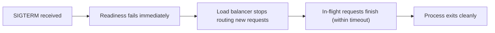
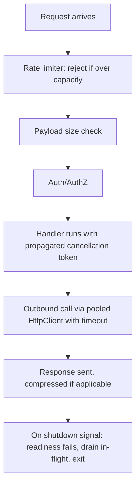

Getting a service to work is table stakes; getting it to survive real traffic, real failures, and real deploys is a different, larger checklist. This page is a tour of the guards a production ASP.NET Core service needs that a demo or a happy-path implementation usually skips.

## Connection pooling and HttpClientFactory

Creating a new `HttpClient` per call exhausts sockets: each `HttpClient` instance owns its own connection pool, and disposing it doesn't immediately release the underlying TCP connection — it lingers in `TIME_WAIT`. Under load, this exhausts available ports, a failure mode known as **socket exhaustion**. The opposite mistake — one static, long-lived `HttpClient` — causes **DNS staleness**: the client caches the resolved IP for a connection's lifetime, so it never notices a DNS change (a failed-over load balancer, a rotated IP) until the process restarts.

```csharp
// Right: IHttpClientFactory manages a pool of handlers, recycling them
// periodically so DNS changes are picked up without new-HttpClient-per-call cost
builder.Services.AddHttpClient<OrdersClient>(client =>
{
    client.BaseAddress = new Uri("https://orders.internal");
    client.Timeout = TimeSpan.FromSeconds(5);
});
```

> [!KEY]
> `IHttpClientFactory` solves both problems at once: it pools and reuses `HttpMessageHandler` instances (avoiding per-call socket cost) while still recycling them periodically (avoiding permanent DNS staleness), by default every two minutes.

## Graceful shutdown and draining

When an orchestrator wants to stop an instance (deploy, scale-down, node drain), it sends a termination signal and expects the process to stop accepting new work while finishing in-flight requests within a bounded window — not stop instantly, and not hang forever.



> [!WARNING]
> If readiness doesn't fail immediately on shutdown signal, the load balancer keeps sending new requests to an instance that's already draining, and some of them arrive after the process has exited — visible to users as a burst of connection-reset errors during every deploy.

## Request timeouts and cancellation propagation

Every inbound request should have a deadline, and that deadline should propagate down through every downstream call the request triggers — database queries, HTTP calls, cache lookups — using the request's own `CancellationToken` (via `HttpContext.RequestAborted` or an action method's `CancellationToken` parameter), not a fresh, unrelated token per call.

```csharp
[HttpGet("{id}")]
public async Task<IActionResult> Get(int id, CancellationToken cancellationToken)
{
    // propagates: if the client disconnects or the server enforces a deadline,
    // the DB call is cancelled instead of running to completion for nothing
    var order = await _db.Orders.FindAsync(new object?[] { id }, cancellationToken);
    return order is null ? NotFound() : Ok(order);
}
```

## Backpressure and concurrency limits

Without a concurrency limit, a burst of traffic queues unboundedly inside your process — memory grows, latency grows, and eventually everything times out together instead of some requests being rejected quickly. `Microsoft.AspNetCore.RateLimiting` middleware lets you cap concurrent or per-window request counts and reject excess with `503`/`429` instead of accepting unbounded work.

```csharp
builder.Services.AddRateLimiter(options =>
    options.AddConcurrencyLimiter("orders", opt =>
    {
        opt.PermitLimit = 100;
        opt.QueueLimit = 20;
        opt.QueueProcessingOrder = QueueProcessingOrder.OldestFirst;
    }));
```

## Payload size limits, compression and keep-alive

| Guard | Purpose | Default in Kestrel |
|---|---|---|
| Max request body size | Prevent memory exhaustion from oversized uploads | 30 MB (`MaxRequestBodySize`) |
| Response compression | Reduce bandwidth for large text/JSON responses | Off by default, opt-in middleware |
| Keep-alive timeout | Free idle connections holding no active request | 130 seconds |
| Request headers timeout | Reject slow-loris-style slow header attacks | 30 seconds |

Compression trades CPU for bandwidth — worth it for large JSON/text payloads over slower networks, often not worth it for already-compressed content (images, video) or extremely latency-sensitive small payloads where the compression overhead outweighs the bandwidth saved.

## Thread-pool starvation symptoms

The .NET thread pool grows slowly (by design, to avoid over-provisioning threads for short bursts) — if code blocks threads synchronously (`.Result`, `.Wait()`, synchronous I/O) faster than the pool can grow, requests queue waiting for a worker thread, and latency climbs even though CPU usage looks low.

| Symptom | Likely cause |
|---|---|
| p99 latency spikes with low CPU usage | Threads blocked on sync-over-async calls, pool can't grow fast enough |
| Latency recovers slowly after a load spike | Thread pool needs time to grow; a burst outpaces it |
| `ThreadPool.PendingWorkItemCount` climbing | Direct evidence of queued work waiting for threads |

> [!DANGER]
> `.Result` or `.Wait()` on an async call inside a request handler blocks a thread-pool thread for the entire duration of that call instead of releasing it back to the pool — the single most common cause of thread-pool starvation under load. Use `await` all the way down.

## Memory limits and feature flags

Set explicit container memory limits and configure the GC to respect them (`DOTNET_GCHeapHardLimit` or container-aware GC, on by default in modern .NET) so a leak or a burst degrades predictably (OOM-killed and restarted by the orchestrator) instead of the node itself running out of memory and taking other pods down with it. Feature flags let you ship code dark and enable it gradually or per-tenant, decoupling deploy from release — a bad feature can be turned off instantly without a rollback/redeploy cycle.

## Safe deployments and load shedding

| Technique | What it protects against |
|---|---|
| Rolling deploy / blue-green | A bad version taking down 100% of capacity at once |
| Canary release | A bad version affecting more than a small traffic slice before detection |
| Health-check gating on new instances | Routing traffic to an instance before it's actually ready |
| Load shedding (reject early under overload) | A pile-up where accepting more work makes total throughput *worse* |

> [!WARNING]
> Under true overload, accepting every request and queuing it can reduce total throughput compared to rejecting a portion outright — queued requests consume memory and eventually time out anyway, having wasted resources that could have served requests within their deadline. Shedding load early (fast `503`s) preserves capacity for requests you can actually complete.

## Observability hooks

Production readiness assumes you can *see* these guards working: structured logs with correlation IDs, metrics (request rate, latency percentiles, error rate, thread-pool queue length, GC pauses), and distributed traces across service boundaries. The three together — logs, metrics, traces — are what let you diagnose an incident from a dashboard instead of guessing.

## The readiness checklist

| Area | Check |
|---|---|
| HTTP clients | Using `IHttpClientFactory`, not per-call `new HttpClient()` or one static instance |
| Timeouts | Every outbound call has one; every inbound request propagates cancellation |
| Shutdown | Readiness fails fast on `SIGTERM`; in-flight requests drain within a bounded window |
| Concurrency | Rate limiting/concurrency limits configured, load shed early under true overload |
| Payload limits | Max body size set appropriately for the endpoint, not left at a generic default |
| Thread-pool health | No `.Result`/`.Wait()` on async calls in request paths |
| Memory | Container memory limit set and GC configured to respect it |
| Deploys | Rolling/canary strategy, health-check gating before routing traffic |
| Observability | Structured logs, metrics, and traces with correlation IDs wired end to end |
| Feature flags | Risky changes shippable dark, toggled without a redeploy |

## Mermaid: request lifecycle with guards



## Cheat sheet

- Use `IHttpClientFactory`, never `new HttpClient()` per call and never one static instance forever.
- Every outbound call needs a timeout; every inbound request should propagate its cancellation token downstream.
- Fail readiness immediately on shutdown signal, then drain in-flight requests within a bounded window.
- Set concurrency/rate limits so overload produces fast rejections, not unbounded queuing.
- Cap request body size deliberately per endpoint; don't rely on a generic framework default everywhere.
- Never call `.Result`/`.Wait()` on async code in a request path — it starves the thread pool under load.
- Set container memory limits and use a container-aware GC so failures are predictable (OOM-killed) not contagious.
- Ship risky changes behind feature flags so rollback is a toggle, not a redeploy.
- Observability (logs + metrics + traces) is what turns "guards exist" into "guards are verified working".

## Common mistakes

| Mistake | Fix |
|---|---|
| `new HttpClient()` per request | Use `IHttpClientFactory` / typed clients |
| One static `HttpClient` for the app's lifetime | Same fix — factory-managed handlers avoid both socket exhaustion and DNS staleness |
| No timeout on outbound calls | Set one, shorter than the caller's own timeout |
| `.Result`/`.Wait()` in a controller action | `await` all the way down |
| Accepting unlimited concurrent requests | Add rate limiting / concurrency limits with fast rejection |
| No readiness-fails-fast on shutdown | Fail readiness immediately on `SIGTERM`, then drain |
| Deploying to 100% of instances at once | Rolling or canary deploy with health-check gating |
| No correlation ID / structured logging | Add both before you need them during an incident, not after |

## Summary

Production readiness is the sum of many small guards, each cheap to add and expensive to omit: pooled HTTP clients instead of ad-hoc ones, timeouts that propagate as cancellation, graceful shutdown that drains instead of dropping, concurrency limits that shed load instead of queuing it unboundedly, and enough observability to see those safeguards actually working. None of these are exotic — they're the difference between a demo and a service that survives its first real incident, and interviewers use this topic specifically to separate candidates who have operated something in production from those who have only built it.

## Top Interview Questions

### Q1. What is socket exhaustion, and how does `IHttpClientFactory` prevent it?

Socket exhaustion happens when an application creates a new `HttpClient` instance for every outbound call; each `HttpClient` owns its own underlying socket/connection, and even after the client is disposed, the OS holds that connection in `TIME_WAIT` for a period before it's fully released. Under any real load, connections are created faster than the OS releases them, and the process runs out of available local ports, causing new outbound connections to fail entirely. `IHttpClientFactory` prevents this by managing a pool of `HttpMessageHandler` instances internally and reusing them across many logical `HttpClient` usages, so the underlying connections are reused rather than recreated per call, while still periodically recycling handlers (by default every two minutes) to avoid the opposite problem of a single connection becoming permanently stale.

### Q2. What is DNS staleness, and why does a single long-lived static `HttpClient` cause it?

A `HttpClient` resolves the target hostname to an IP address once, when the underlying connection is established, and then reuses that same connection (and therefore the same resolved IP) for as long as the connection stays open. If you create exactly one static `HttpClient` for the entire application's lifetime, its connections can live for hours or days, meaning it never re-resolves DNS even if the actual IP behind that hostname changes — a failed-over load balancer, a rescaled cluster, a DNS-based traffic shift — so the client keeps sending requests to a now-stale or dead IP until the process itself restarts. `IHttpClientFactory` avoids this by periodically recycling the underlying handler (and its connections) even while exposing what looks like the same client to your code, so DNS changes are picked up within a bounded time rather than never.

### Q3. Why is calling `.Result` or `.Wait()` on an async method inside a request handler dangerous under load?

Doing so blocks the calling thread — typically a thread-pool thread handling that request — for the entire duration of the awaited operation, instead of releasing it back to the pool the way `await` does. The .NET thread pool grows slowly and deliberately (to avoid over-provisioning threads for short bursts), so if requests are blocking threads faster than the pool can grow new ones, incoming requests queue up waiting for an available thread, and you see a distinctive symptom: latency (especially p99) climbs sharply while CPU usage looks unremarkable, because threads are idle-but-blocked rather than busy computing. The fix is `await` all the way through the call chain, with no synchronous blocking on asynchronous work anywhere in a request-handling path.

### Q4. How would you implement graceful shutdown for a service running behind a load balancer in Kubernetes?

I'd make sure the readiness probe fails **immediately** on receiving the termination signal (`SIGTERM`, or `IHostApplicationLifetime.ApplicationStopping` in ASP.NET Core), before the process actually stops handling requests — this tells the load balancer to stop routing new traffic to this instance right away. I'd then let in-flight requests finish naturally within Kubernetes' configured `terminationGracePeriodSeconds` (and ASP.NET Core's own `ShutdownTimeout`), rather than killing them immediately, so users mid-request don't see a connection reset. The two failure modes to avoid: readiness not failing fast enough (new requests keep arriving at a draining instance) and the grace period being too short for genuinely long-running requests to finish (causing them to be killed mid-flight anyway) — both are typically caught by watching error rates during deploys, not by code review alone.

### Q5. What is backpressure, and why is unbounded request queuing worse than rejecting some requests outright under overload?

Backpressure means signalling upstream that you cannot currently accept more work, rather than silently absorbing it — accepting a request but queuing it internally without limit means memory usage climbs with queue depth, and every queued request still consumes some resources (a connection, a partially-allocated context) while waiting, even before it's actually processed. Under true, sustained overload, queued requests often end up waiting long enough to time out anyway from the caller's perspective, meaning the work done queuing and eventually processing them was entirely wasted — while that same capacity could have been spent completing a smaller number of requests within their deadline. Rejecting excess requests immediately (via a concurrency limiter returning `503`/`429`) preserves throughput for the requests you can actually serve, and gives the caller an immediate, actionable signal (retry later, back off) instead of a slow, wasted wait.

### Q6. Why should you propagate the request's `CancellationToken` into every downstream call it makes?

If a client disconnects, or the server enforces a request deadline, the ASP.NET Core request pipeline signals `HttpContext.RequestAborted` (or the `CancellationToken` parameter bound into your action) — but that signal only has an effect if the code you wrote actually passes that token into the async calls it makes (database queries, HTTP calls, cache lookups). Without propagation, a database query started for a request whose client already disconnected keeps running to completion, wasting database connection capacity and CPU on work whose result nobody will ever consume — and under load, many such orphaned queries can meaningfully degrade the database for requests that still matter. Propagating the token end-to-end means abandoned work is cancelled as early as possible, freeing resources for requests that are still actually being waited on.

### Q7. Your service's memory usage grows steadily under sustained load and the process eventually gets OOM-killed. How would you distinguish a genuine memory leak from expected memory growth under load?

I'd start by looking at whether memory returns to baseline after load subsides — genuine leaks keep growing monotonically regardless of load, while expected growth (larger caches, connection pools warming up, GC not yet having collected a generation) typically plateaus or drops back down once load decreases and a GC cycle runs. I'd take heap snapshots or use a memory profiler (dotnet-gcdump, dotnet-trace) at two points under sustained load to diff object counts and identify what's actually accumulating — common real culprits are unbounded in-process caches/channels, event handlers that are subscribed but never unsubscribed (a classic .NET leak pattern), or a captive-dependency-style bug where a supposedly per-request object is actually being held by a singleton. Setting an explicit container memory limit with container-aware GC at least bounds the blast radius to "this instance gets killed and restarted" rather than the underlying node running out of memory and affecting unrelated pods.

### Q8. What's the difference between a rolling deployment and a canary deployment, and when would you choose canary specifically?

A rolling deployment replaces instances of the old version with the new version gradually, typically a few at a time, gated by health checks — its main protection is against a broken new version affecting 100% of traffic simultaneously, but it still eventually replaces every instance with the new version even if a subtle bug wasn't caught by health checks. A canary deployment deliberately routes a small, controlled slice of *real production traffic* (say 1-5%) to the new version while the bulk of traffic still goes to the old version, and only proceeds to a wider rollout after observing that the canary's error rates, latency, and business metrics look healthy. I'd choose canary specifically for higher-risk changes — significant logic changes, anything touching payments or data integrity, changes that are hard to fully validate in staging — where the extra operational complexity of a staged, metrics-gated rollout is worth it to limit blast radius on a change that health checks alone might not catch.

### Q9. How do feature flags improve production readiness beyond what safe deployment strategies already provide?

Deployment strategies (rolling, canary) control which *version of the code* is running, but feature flags let you decouple deploying code from enabling behaviour — a risky feature can be merged and deployed dark (flag off, no behavioural change), verified in production with real traffic hitting the surrounding code paths, then enabled gradually (per percentage, per tenant, per region) without needing a new deployment at all. This matters most for the failure mode where a bug isn't a crash but a subtle logic or business-metric regression that only becomes visible with real traffic and real data — a feature flag lets you turn that specific behaviour off instantly, in seconds, without a rollback/redeploy cycle that might take minutes and itself carries some risk. The trade-off to name: flags accumulate as technical debt if not cleaned up after a feature is fully rolled out, so a flag's lifecycle needs an actual removal step, not just an "on" step.

### Q10. What's the risk of not setting an explicit max request body size, and where would you set the limit?

Without an explicit limit, an attacker (or a buggy client) can send an arbitrarily large request body, and depending on how your code processes it (buffering the whole body in memory before validating anything, for instance), a small number of oversized requests can exhaust available memory well before any business logic even runs — a straightforward denial-of-service vector that costs the attacker very little. I'd set the limit deliberately per endpoint rather than relying on the framework's generic default (Kestrel defaults to 30 MB, which is often far too generous for a JSON API endpoint that should never receive more than a few KB): a strict limit for typical JSON endpoints, and a specifically higher, separately-monitored limit only for endpoints genuinely expected to receive large payloads (file uploads), ideally streamed rather than buffered in memory.

### Q11. In production, p99 latency has doubled but average latency and CPU usage look normal. What would you investigate?

A high p99 with normal average and CPU strongly suggests a tail-latency problem affecting a subset of requests rather than a systemic slowdown — common causes include thread-pool starvation from blocking calls on some code path (which only shows up when the pool is under enough pressure to queue, not on every request), lock contention or a slow downstream dependency that only some requests happen to hit, or GC pauses (particularly full/blocking GCs) that stall all threads briefly but only affect requests unlucky enough to be in-flight during the pause. I'd check thread-pool queue length and GC pause metrics first since both directly explain "CPU looks fine but some requests are slow," then look at whether the slow requests correlate with a specific endpoint or downstream dependency (pointing at a missing timeout or an unbounded retry) versus being spread evenly across all traffic (pointing at something process-wide like GC).

### Q12. How would you build observability into a service so that the guards described in a production-readiness checklist (timeouts, rate limits, circuit breakers) are verifiably working, not just configured?

I'd emit metrics specifically for each guard's activation, not just overall request success/failure — a counter for rate-limiter rejections, a gauge or counter for circuit-breaker state transitions and time spent open, a histogram for actual vs. configured timeout durations — so a dashboard can show these mechanisms firing during an incident rather than inferring their effect indirectly from aggregate error rates. I'd pair that with structured logs carrying a correlation ID through the guard layers (rate limiter, auth, handler, outbound call) so a single request's full journey, including which guard (if any) rejected or degraded it, is reconstructable from logs alone. Distributed tracing ties this together across service boundaries, letting you see, for a single slow or failed end-user request, exactly which service and which guard along the chain was responsible — turning "we have resilience patterns configured" into "we can prove they activated correctly during the last incident."
