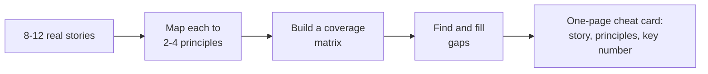

Large technology companies do not evaluate behavioural answers on vibes — they score against a written competency rubric, usually shared across interviewers as a scorecard. Understanding the rubric changes how you prepare: instead of memorising stories, you map stories onto the specific things each interviewer is scored on eliciting from you.

## How large companies score behavioural rounds

Most senior loops split interviewers across a small set of competencies, each interviewer typically responsible for probing two or three in depth rather than all of them shallowly. They take structured notes against specific behavioural indicators — not "did I like this candidate" but "did they show evidence of independently identifying and closing a gap" or "did they show they sought disconfirming evidence before deciding." Scores are usually calibrated in a debrief where interviewers compare notes against the same rubric, which is why a vague, unstructured answer scores poorly even if it was a genuinely interesting story — the interviewer literally cannot write it down against a specific indicator.

> [!KEY]
> If you can't imagine which box on a scorecard your story would tick, the interviewer probably can't either. Structure your answer so the competency being tested is unmistakable, not just implied.

## Common themes across companies

Different companies use different names, but the underlying competencies converge heavily. The table below uses commonly recognised terms and applies broadly regardless of which specific company's language is used.

| Principle | What it's really testing | A prompt that targets it |
|---|---|---|
| Customer focus | Do you reason from user/customer impact, not just internal convenience | "Tell me about a time you changed direction based on customer feedback" |
| Ownership | Do you act beyond your assigned scope and see things through | "Tell me about a problem you fixed that wasn't your job" |
| Bias for action | Can you decide and move with incomplete information | "Tell me about a decision you made without all the data you wanted" |
| Dive deep | Do you get to root cause, or stop at the first plausible explanation | "Tell me about a time you found a problem others had missed" |
| Deliver results | Do you actually ship, and can you quantify the outcome | "Tell me about hitting a difficult goal despite obstacles" |
| Earn trust | Are you candid, including about your own mistakes | "Tell me about giving or receiving difficult feedback" |
| Disagree and commit | Can you argue hard, then execute fully once decided | "Tell me about a decision you disagreed with" |
| Learn and be curious | Do you actively seek new skills or perspectives | "Tell me about learning something outside your comfort zone" |
| Develop others | Do you grow people, not just extract their output | "Tell me about mentoring someone" |
| Think big | Do you consider a bigger solution than the minimum ask | "Tell me about a time you proposed something beyond what was asked" |
| Insist on high standards | Do you hold a quality bar even under pressure | "Tell me about refusing to cut a corner" |

> [!TIP]
> Notice that many of these are two sides of the same coin — "bias for action" and "insist on high standards" are in tension, and a strong candidate can speak to both, using different stories, without contradicting themselves.

## Mapping one story to several principles

The efficient way to prepare is not one story per principle — it's identifying which two or three principles each of your 8–12 stories can honestly support, then noticing the gaps. Take a single real story and see how many angles it supports:

**Story:** led a migration to a new message queue after our existing one caused repeated on-call pages.

| Principle | How this story supports it |
|---|---|
| Ownership | Nobody assigned the migration; you identified the recurring pain and proposed it |
| Dive deep | You root-caused the on-call pages to specific queue behaviour, not just "it's flaky" |
| Deliver results | Pages dropped by a specific, quantified amount post-migration |
| Develop others | You paired a junior engineer through the riskiest part of the cutover |

The same underlying facts, told with a different opening sentence and a different emphasis in the Action section, credibly answers four different prompts. This is a far better use of prep time than writing four different weaker stories.

### Coverage matrix across your bank

Build this once for your full story bank, not just one story — it reveals genuine gaps rather than assumed ones.

| Story | Ownership | Bias for action | Dive deep | Develop others | Disagree & commit |
|---|---|---|---|---|---|
| Queue migration | ✅ | | ✅ | ✅ | |
| Scope cut under deadline | | ✅ | | | |
| Architecture disagreement | | | | | ✅ |
| Onboarding automation | ✅ | | | | |

If "think big" or "customer focus" has no checkmark anywhere in your matrix, that's a concrete signal to build or find a story for it before the interview, not to hope it doesn't come up.

## Mid-level versus senior answers to the same question

The prompt "tell me about a time you improved a process" gets asked at every level, and the rubric expects the *altitude* of the answer to scale with the level you're interviewing for.

| Aspect | Mid-level answer | Senior answer |
|---|---|---|
| Scope | Fixed a problem in their own workflow | Fixed a problem affecting multiple teams or a whole org |
| Initiation | Was asked to look into it | Noticed it independently before it was raised |
| Mechanism | Implemented a known best practice | Designed a new approach or convinced others to adopt one |
| Measurement | "It's better now" | A specific number, plus how it was tracked over time |
| Durability | Fixed once | Built in a way that prevents recurrence or scales to new teams |

> [!WARNING]
> A candidate interviewing for a senior or tech lead role who only has mid-level-altitude stories — correct process, no scope beyond themselves, no unprompted initiation — will be scored as "good IC, not clearly senior" even if every individual answer was competent.

## Signalling scope and impact

Two habits reliably raise the altitude of an answer without changing the underlying facts: state the *scope* explicitly ("this affected four teams and roughly 200 engineers", not just "it was a big change"), and always close with impact stated in the audience's terms — a business metric, a reliability number, a time saved — rather than a purely technical detail that requires the interviewer to infer why it mattered.

> [!DANGER]
> Do not inflate scope you didn't actually have. An interviewer who asks one clarifying question ("who else was involved, and what was your specific role") will quickly expose a story you've oversold, which damages trust in every other answer you give afterward.

## Preparing a one-page cheat card

Before the interview, condense your story bank into a single page you can glance at beforehand (not during): one line per story with its name, the two or three principles it best supports, and the single number that anchors its result. This is not for reading from — it's so that when you hear an unfamiliar prompt, you can instantly recall which of your 8–12 stories is the closest match, rather than searching your memory cold in the room.

## Cheat sheet

- Interviewers score against a written rubric with specific indicators, not general impressions.
- Different companies use different words for largely the same underlying competencies.
- Map 8–12 stories to 2–4 principles each rather than writing one story per principle.
- Build a coverage matrix to find real gaps, especially "think big" and "customer focus," which are often thin.
- Senior answers differ from mid-level answers in scope, initiation, mechanism, measurement, and durability.
- State scope and impact explicitly and in terms the interviewer can weigh, not just technical detail.
- Never inflate scope — a single clarifying question will expose it and damage the rest of your answers.
- Build a one-page cheat card mapping stories to principles for quick recall, not for reading from.

## Common mistakes

| Mistake | Fix |
|---|---|
| Preparing one story per principle, ending up shallow everywhere | Map fewer, richer stories to multiple principles each |
| Not knowing which principle a given answer supports | Structure the answer so the competency is unmistakable |
| Stories are all mid-level altitude for a senior-level interview | Add scope, unprompted initiation, and durability to the framing |
| Inflating scope beyond what actually happened | Keep scope honest; it survives a clarifying follow-up |
| No story for "think big" or "customer focus" | Identify the gap via a coverage matrix and fill it deliberately |
| Ending an answer on a technical detail with no stated impact | Close with a number or outcome in the interviewer's terms |

## Summary

Behavioural interviewers at large companies are scoring you against a specific competency rubric, so the goal of preparation is to make the mapping between your stories and that rubric unmistakable, not to hope a good story will be self-evidently impressive. Build a small bank of rich stories, each honestly supporting several principles, use a coverage matrix to find and fill real gaps, and consistently signal the scope and durability expected at the level you're interviewing for. A one-page cheat card linking stories to principles and key numbers is the single highest-leverage artefact to bring into interview week.

## Top Interview Questions

### Q1. How do you think interviewers actually score behavioural answers?

Most large companies use a written competency rubric with specific behavioural indicators, and interviewers are typically each responsible for probing two or three competencies in depth rather than everything. They take structured notes against specific things they're listening for — did the candidate identify a gap independently, did they seek disconfirming evidence, did they quantify an outcome — and compare notes in a calibration debrief. Because of this, I try to structure my answers so the competency being tested is unmistakable, with a clear decision point, a stated scope, and a quantified result, rather than relying on a story simply being interesting enough to speak for itself.

### Q2. Tell me about a story that could answer several different competency questions, and explain how.

I led a migration to a new message queue after the old one caused recurring on-call pages. It supports "ownership" because nobody assigned the migration, I identified the recurring pain and proposed it. It supports "dive deep" because I root-caused the pages to a specific queue behaviour rather than accepting "it's just flaky." It supports "deliver results" because pages dropped by a specific, measured amount after the cutover. And it supports "develop others" because I paired a junior engineer through the riskiest part of the migration. I tell the same underlying facts differently depending on which of these the question is actually asking about.

### Q3. How do you make sure your story bank covers all the competencies you might be asked about?

I build a matrix with my stories as rows and the common competencies — ownership, bias for action, dive deep, deliver results, earn trust, disagree and commit, develop others, think big, customer focus — as columns, and mark which each story can honestly support. This usually reveals that competencies like "think big" or "customer focus" are thin in my bank even though I have plenty of ownership or delivery stories, since those come up more naturally in day-to-day work. Once I see a gap, I either recall a story I hadn't considered relevant or build a fuller account of one I'd previously told in a smaller way.

### Q4. What's the difference between a mid-level and a senior answer to "tell me about improving a process"?

A mid-level answer typically describes fixing a process within their own workflow, after being asked to look into it, using a known best practice, with a vague sense that it's "better now." A senior answer describes a problem noticed independently before anyone raised it, affecting multiple teams rather than just the speaker, solved with a new approach or by convincing others to adopt one, measured with a specific number, and built durably enough that it doesn't quietly regress once attention moves elsewhere. The facts can be genuinely similar; the altitude comes from scope, initiation, and durability, which is exactly what I try to make explicit rather than leaving implicit.

### Q5. How do you avoid inflating the scope of a story?

I keep scope statements specific and checkable rather than impressive-sounding but vague — "this affected the three teams that consumed that service, roughly 40 engineers" rather than "it was a huge, org-wide change." I know that any inflated scope tends to unravel under a single clarifying question like "who else was involved, and what exactly was your role," and once an interviewer catches one exaggeration, it reasonably makes them scrutinise every other answer I give more sceptically. Being precise about scope, even when it's more modest than I'd like, has been more effective than rounding up.

### Q6. Tell me about a time you demonstrated "disagree and commit."

I was against introducing a new message queue technology for a core service, believing it added operational risk for limited benefit, and made that case with specific data on expected complexity. Once the team decided to proceed anyway, I fully committed — helping design the migration, writing a meaningful portion of the adapter code, and not relitigating my original objection in later discussions. The migration succeeded, and the operational tooling around the new technology turned out better than what we'd had. This story supports both "disagree and commit" and "earn trust," since the team could see I'd argue hard but execute fully regardless of the outcome.

### Q7. Give an example of a "think big" story, distinct from a straightforward ownership story.

When asked to fix a specific recurring alert, I noticed the underlying pattern — several unrelated alerts across different services shared the same root cause category, a lack of standard retry-and-backoff handling for a class of downstream failures. Rather than just fixing the one alert I was asked about, I proposed and built a shared library implementing the pattern correctly once, which multiple teams adopted over the following two quarters. The difference from a pure ownership story is the scale of the solution relative to the size of the original ask — I solved a category of problem, not just the specific instance I was asked to look at.

### Q8. How do you handle a competency you genuinely don't have a strong story for, like "think big"?

I'm honest that some competencies map less directly onto my day-to-day work than others, but I still look for the closest honest example rather than stretching an unrelated story. For "think big," I might reach for a case where I proposed a broader library instead of a one-off fix, even if the scale was moderate rather than dramatic, and be explicit about the scope rather than overstating it. If I truly have nothing, I say so and explain what I'd do differently going forward, since a thoughtful acknowledgment of a gap is more credible than a forced, unconvincing example.

### Q9. What's an example of "earn trust" as a competency, and how is it different from "ownership"?

Earn trust is specifically about candour, especially about your own mistakes, and consistency between what you say and do. I told my team directly, in a retro, that a caching design I'd pushed hard for in review had introduced a staleness bug affecting a small percentage of users, explained what I'd underweighted, and proposed the fix along with monitoring to catch it faster next time. Ownership would be about acting on a gap nobody assigned to me; earn trust here is specifically about being the one to surface my own mistake rather than waiting for someone else to find it, which is what built continued trust with the team afterward.

### Q10. How do you decide which of your prepared stories to use when a question doesn't map cleanly to any of them?

I identify the specific competency the question is really probing — often it's a variant of one of the common eleven or so — and pick whichever story in my bank most honestly supports that competency, even if the surface-level scenario doesn't match perfectly. For an unusual prompt like "tell me about a time you changed your mind based on new information," I'd reach for my "dive deep" story about root-causing on-call pages, since changing my initial assumption based on evidence is the common thread, even though the original story wasn't built for that exact wording. I make sure the opening line signals that mapping clearly, so the interviewer isn't left to infer it themselves.

### Q11. How should your answers differ if you're interviewing for a tech lead role versus a senior IC role?

For a tech lead role, I lean into stories where my primary contribution was setting direction for others or making someone else successful — delegating ownership, running a design review, mentoring — even if that means fewer of my strongest "I built this myself" stories get airtime. For a senior IC role, I lean more into technical depth and independent judgement stories, like diving deep into a hard bug or making a significant unilateral technical call. The underlying competencies overlap heavily, but which stories I lead with, and how much I emphasise people versus technical outcomes, shifts based on which altitude and scope the interviewer is trying to validate for that specific role.

### Q12. What's the value of preparing a one-page cheat card before the interview, and what goes on it?

It's not for reading from during the interview, but for fast recall — a glance beforehand refreshes which of my 8 to 12 stories maps to which competencies, so that when an unfamiliar question lands, I'm pattern-matching against something I've already organised rather than searching my memory cold under pressure. Each line has the story's short name, the two or three competencies it best supports, and the one number that anchors its result, so I can also sanity-check I'm not about to repeat the exact same story I used in an earlier round that day if I'm doing back-to-back interviews.
