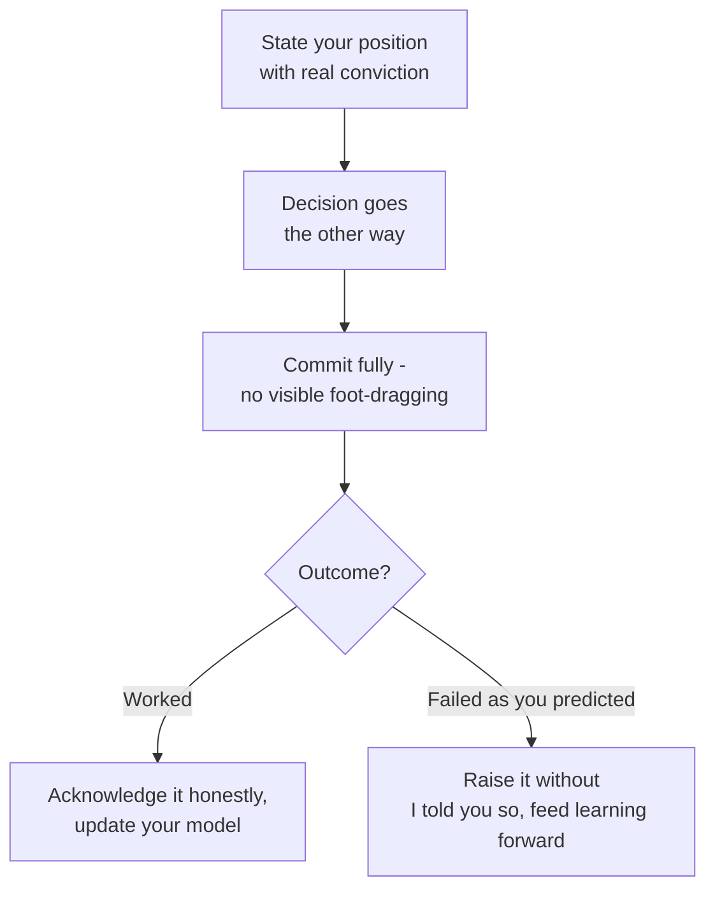

Every senior loop asks some version of "tell me about a disagreement." Interviewers are not looking for evidence you avoid conflict, or that you win every one — they are listening for whether you handle it with data, empathy, and enough self-awareness to know when you were wrong.

## The structure of a good conflict story

A conflict story needs more scaffolding than a standard STAR answer because it has two people's positions in it, not one. The shape that works:

1. **Context** — what was at stake, briefly.
2. **Both positions, stated fairly** — including why the other person's view was reasonable, not a strawman.
3. **How you sought data** — what you did to move the conversation from opinion to evidence.
4. **Resolution** — what actually happened, and who moved.
5. **Relationship preserved** — a concrete sign the working relationship survived or improved.
6. **Outcome** — what happened afterward, ideally with a number.

> [!KEY]
> The step candidates skip most is stating the other person's position fairly. If your story makes the other person sound unreasonable, the interviewer hears ego, not judgement — even if your technical call was correct.

## Disagreeing with an engineer

The most common variant. The strongest version shows you engaged with the technical substance of their position before pushing back, and that the resolution came from evidence or a jointly agreed test, not from you outranking them or simply talking longer.

## Disagreeing with a manager

This one tests whether you can push back **up**, which is a different skill from pushing back sideways. The key elements: you raised the disagreement privately rather than undermining them in front of others, you led with the business or technical risk rather than personal frustration, and you were clear about the line between disagreeing and refusing — you stated your case once, clearly, and then either got agreement or committed to their call.

> [!TIP]
> A strong line: *"I told my manager directly, in private, that I thought the timeline risked a specific class of bug given what we'd seen in the previous release. I made the case once with the data I had, and once she'd heard it and still wanted to proceed, I committed fully and made sure the team understood the trade-off we were accepting."*

## Disagreeing with a partner team

Partner-team disagreements are really about **incentives**, not personalities. The strongest stories name the actual incentive misalignment (their team is measured on a different metric than yours) and show you either found a framing where both incentives were served, or escalated the trade-off transparently to whoever owned the cross-team priority call, rather than quietly working around them.

## Disagreeing with a decision already made

This is the hardest variant, because the natural instinct is either to silently comply and complain later, or to relitigate loudly after the fact. The credible answer shows you raised the disagreement through the right channel once the decision was final — not undermining it in the room but also not staying silent forever if new evidence emerged — and that you executed the decision competently in the meantime.

## Disagree and commit, done properly

"Disagree and commit" is one of the most name-checked phrases in senior interviews, and also one of the most performed insincerely. Done properly it has three parts: you make your case with real conviction and evidence, not a token objection; once the decision is made you execute it as if it were your own idea, without visible foot-dragging; and if you were right that it would fail, you say so afterward without an "I told you so" and use it to inform the next decision, not to relitigate this one.

> [!WARNING]
> A red flag is describing "disagree and commit" as agreeing in the meeting and then slow-walking the implementation. Interviewers listen closely for whether your "commit" story shows genuine execution, not passive resistance.

## Escalation that is not tattling

Escalation is a legitimate tool, but candidates often either avoid it entirely (which reads as conflict-averse) or describe it in a way that sounds like going over someone's head to win. The difference is process: you told the person directly first, you escalated the *decision*, not the *person*, and you escalated to someone who actually owned the trade-off, with the goal of getting a decision made, not getting someone in trouble.

| Tattling framing | Escalation framing |
|---|---|
| "I told their manager they were wrong" | "I raised the unresolved trade-off to whoever owned the roadmap call" |
| Focuses on the person's competence | Focuses on the decision and its risk |
| Comes as a surprise to the other person | The other person already knew you disagreed |
| Goal is being seen as right | Goal is getting a timely decision |

## Talking about a disagreement you lost

This is a deliberately hard prompt, and refusing to have a real answer for it is worse than admitting you lost one. A good answer: state the disagreement plainly, explain why the other position had merit even though you didn't initially see it, and say what changed your mind or what you learned about how you argue your case. If the outcome later proved you right, say so honestly but without bitterness — and describe what you did with that information constructively.

## What interviewers listen for

| Signal they're scoring | What it sounds like when done well | What it sounds like when done badly |
|---|---|---|
| Ego | "Here's why their view was reasonable" | "They just didn't understand the trade-off" |
| Blame | "We both missed X, so I proposed Y" | "It was their fault the deadline slipped" |
| Data | "I ran a benchmark to settle it" | "I was pretty sure I was right" |
| Empathy | "I could see why they were worried about Z" | No mention of the other person's reasoning at all |

## Red-flag phrases to avoid

| Phrase | Why it's a problem |
|---|---|
| "I had to explain to them why they were wrong" | Frames the other person as simply incorrect, not reasonable |
| "I just went over their head" | Sounds like escalation-as-power-move, not process |
| "Eventually they came around to my view" | Implies the goal was winning, not the best outcome |
| "We agreed to disagree" | Often means no resolution actually happened |
| "It wasn't really my fault" | Reads as blame-shifting under a thin disagreement story |

## Scenario-to-answer-skeleton

| Scenario | Skeleton |
|---|---|
| Disagreement with a peer engineer | State both technical positions fairly → propose a test or benchmark → let data decide → both learn something |
| Disagreement with your manager | Raise privately, once, with the specific risk → hear their reasoning → commit fully once decided |
| Disagreement with a partner team | Name the incentive mismatch → find shared framing or escalate the trade-off transparently → resolve without blame |
| Disagreement with a decision already made | Raise through the right channel once → execute competently → revisit only if new evidence appears |

## Sample answers for the four common variants

**With an engineer:** we disagreed on whether to introduce a new caching layer for a performance problem. I laid out my reasoning, listened to their concern about added operational complexity, and we agreed to prototype both for a week against real traffic. The data showed the complexity concern was valid but manageable, and we adopted a scoped version of my proposal with their operational safeguards built in.

**With a manager:** my manager wanted to ship a feature a sprint early by skipping a security review. I raised, privately, the specific risk given a similar issue we'd hit before, and asked for a scoped, faster review instead of skipping it. She agreed to the faster review. Had she not, I would have executed the original timeline and flagged the accepted risk explicitly to the team.

**With a partner team:** a partner team's API changes were breaking our integration tests repeatedly because they were incentivised to ship fast without notifying consumers. I proposed a lightweight contract test they could run in their own CI, which cost them little and solved our problem, rather than escalating immediately.

**With a decision already made:** leadership decided to consolidate two services against my technical recommendation. I raised my concern once, in writing, before the decision was finalised, then executed the consolidation fully and competently. Six months later, one of my concerns did materialise as a scaling issue, which I raised constructively as input for the next architecture review rather than as a "told you so."

## Cheat sheet

- Structure: context, both positions fairly stated, how you sought data, resolution, relationship preserved, outcome.
- State the other person's position as if they were in the room — never a strawman.
- Disagree and commit means full, visible execution afterward, not passive resistance.
- Escalate the decision, not the person, and only after raising it directly first.
- Have a real answer ready for "a disagreement you lost" — refusing to have one is worse than admitting it.
- Interviewers score for ego, blame, data, and empathy — in that order of how often people fail them.
- Avoid phrases that frame the other party as simply wrong or that imply the goal was winning.

## Common mistakes

| Mistake | Fix |
|---|---|
| Making the other person sound unreasonable | State their position as fairly as your own |
| "Disagree and commit" story is really "agree then slow-walk" | Show genuine, visible execution after the decision |
| Escalation framed as going over someone's head | Frame it as escalating an undecided trade-off, told to them first |
| No real story for a disagreement you lost | Prepare one honestly; refusing is a worse signal |
| Blaming the other party for a shared miss | Name what both sides missed, then what you did about it |
| Resolution is "we agreed to disagree" | Show what mechanism actually resolved it — data, a test, an escalation |

## Summary

Conflict questions are not about proving you are always right; they are about proving you can hold a real disagreement without ego or blame, move it toward evidence, and preserve the relationship regardless of outcome. Prepare distinct stories for disagreeing with a peer, a manager, a partner team, and a decision already finalised, and have an honest answer ready for the one you lost. The consistent thread across strong answers is that the other person's position is stated fairly and the resolution came from something more objective than force of personality.

## Top Interview Questions

### Q1. Tell me about a time you disagreed with a decision your team made.

My team decided to consolidate two microservices to reduce operational overhead, while I believed it would create a scaling bottleneck for one high-traffic path. I raised my concern once, clearly, in the design review, along with the specific traffic pattern that worried me, and the team decided to proceed anyway given the operational benefits were significant and near-term. I committed fully to the implementation and helped build it well rather than half-heartedly. About five months later the scaling concern did materialise under a traffic spike, and I raised it constructively as input for how we designed the next consolidation, rather than as an "I told you so," which kept the team receptive to hearing it.

### Q2. Describe a disagreement you had with your manager. How did you handle it?

My manager wanted to cut a security review to hit a launch date a sprint early. I asked for a private conversation rather than raising it in a team meeting, and made the case with a specific example of a similar issue that had caused an incident previously. She listened, and we agreed on a scoped, faster review instead of skipping it entirely, which addressed both her timeline concern and my risk concern. Had she decided to proceed without any review, I would have executed the plan as directed while making sure the accepted risk was documented and visible to the team, since raising the concern once, clearly, was where my responsibility for the disagreement ended.

### Q3. Tell me about a time you disagreed with another team and how you resolved it.

A partner team kept shipping API changes that broke our integration without notice, because their incentives were tied entirely to their own roadmap, not to downstream consumers. Rather than escalating immediately, I proposed a lightweight contract test suite they could run in their own CI pipeline, which cost them very little effort but caught breaking changes before they shipped. I framed it as reducing their own support load from multiple consumers, not just solving my problem. They adopted it within two weeks, and breaking changes to our integration dropped from roughly monthly to essentially zero over the following quarter.

### Q4. Give an example of "disagree and commit" done well.

I was against moving a core service to a new message queue technology, believing it added operational risk for marginal benefit, but after making my case with data on the expected complexity, the team decided to proceed. I fully committed: I helped design the migration plan, wrote a significant portion of the adapter code, and did not raise my original objection again in team discussions. The migration succeeded, and to my genuine surprise, the operational tooling around the new queue turned out to be better than what we had, which changed my view. I've used that experience since as a reminder that voicing disagreement clearly once, then executing fully, is more valuable than being technically right at the cost of team trust.

### Q5. Tell me about a disagreement you lost, and what you took away from it.

I argued against introducing a feature flag framework, believing our release cadence was fast enough that the added complexity wasn't worth it. A colleague pushed for it, citing a specific case where we'd have avoided a rollback if flags existed. We adopted it, and within two months we used a flag to safely disable a problematic feature without a full rollback, which would have been considerably more disruptive under my original approach. What I took away wasn't just that I was wrong on that call, but that I'd been weighting our historical release speed too heavily against a risk I hadn't personally experienced yet — I've since been more deliberate about seeking out others' direct incident experience before forming a strong opinion.

### Q6. How do you escalate a disagreement without it feeling like you're going around someone?

I always raise the disagreement directly with the person first, so escalation is never a surprise to them. When I do escalate, I frame it as an undecided trade-off that needs a decision from whoever owns that call, not as a complaint about the person — for example, "we have two valid approaches to this data migration and disagree on risk tolerance, and I'd like a decision from you on which risk profile the team should accept." I also tell the other person before or as I escalate, so they hear it from me rather than being surprised in a meeting. This keeps the focus on getting a timely decision rather than on being seen as right.

### Q7. Describe a time you had to push back on a decision that had already been finalised.

Leadership had already decided to sunset a service my team relied on heavily, and I believed the timeline underestimated the migration cost for downstream consumers. Rather than relitigating the decision after the fact, I raised a specific, data-backed concern about the timeline through the program's technical lead within a day of the announcement, framed as new information rather than a re-argument of the original decision. They adjusted the timeline by one sprint based on that input, which was a reasonable middle ground. Once the (adjusted) timeline was set, I fully supported the migration and didn't revisit the original disagreement again.

### Q8. Tell me about a conflict where both sides were partly right.

Two engineers on my team disagreed on how to handle retries for a flaky downstream dependency — one wanted aggressive retries for reliability, the other wanted to fail fast to avoid cascading load. Both were right about a real risk: naive retries could amplify an outage, but failing fast could turn transient blips into user-visible errors unnecessarily. Instead of picking a side, I proposed we quantify the actual blip duration from our logs, which showed most failures resolved within 200ms. We landed on a small bounded retry with exponential backoff and a circuit breaker, which addressed both concerns, and both engineers ended up co-authoring the design.

### Q9. How do you know when to keep pushing a disagreement versus when to let it go?

I weigh two things: how reversible the decision is, and how strong my evidence actually is versus just my preference. For a decision that's cheap to reverse — a coding convention, a small config choice — I'll voice my view once and drop it even if unresolved, because the cost of continued friction outweighs the stakes. For something expensive to reverse — a data model, an API contract others will build on — I'll push harder and specifically seek out data or a small experiment to move the conversation past opinion. I try to be explicit about which category a disagreement falls into early, so I don't spend political capital on low-stakes points.

### Q10. Tell me about a time you had to give feedback that caused friction, and how you managed the relationship afterward.

I told a peer engineer directly that their PR review style — long, unstructured comment threads without clear resolution — was slowing the team down, which was an uncomfortable conversation because I knew they took pride in thorough reviews. I made sure to frame it around the specific impact (review turnaround had roughly doubled) rather than their character, and I asked what would help rather than dictating a new process. We agreed on a lightweight checklist for blocking versus non-blocking comments. There was some initial coolness in our working relationship, but within a few weeks, once they saw the change actually sped things up without lowering quality, it became one of our smoother working relationships.

### Q11. How do you handle a disagreement in a public setting, like a design review, without it becoming adversarial?

I try to depersonalise the disagreement immediately by restating it as a trade-off between two options rather than a clash between two people — "so we have two valid approaches here, let's list the cost of each" — which shifts the room's attention from personalities to substance. In one review, a disagreement was getting heated, and I explicitly asked both engineers to state the other's strongest argument before continuing, which noticeably cooled the tone because each had to demonstrate they'd actually understood the other's position. We reached a decision within the same meeting instead of it festering into a longer-running conflict.

### Q12. What's the difference between healthy conflict and a conflict that damages a team, and how do you tell which one you're in?

Healthy conflict stays focused on the decision, both sides feel heard even if they don't get their way, and the relationship is intact or stronger afterward. It becomes damaging when it shifts to questioning competence or motive, when the same disagreement resurfaces repeatedly without new information, or when people start avoiding each other or routing around the disagreement instead of resolving it. I watch for the second pattern specifically — if I notice a colleague going quiet in meetings where they'd normally speak up, that's usually a sign an earlier disagreement wasn't actually resolved, and I'll follow up privately rather than assume it's settled just because the meeting moved on.
