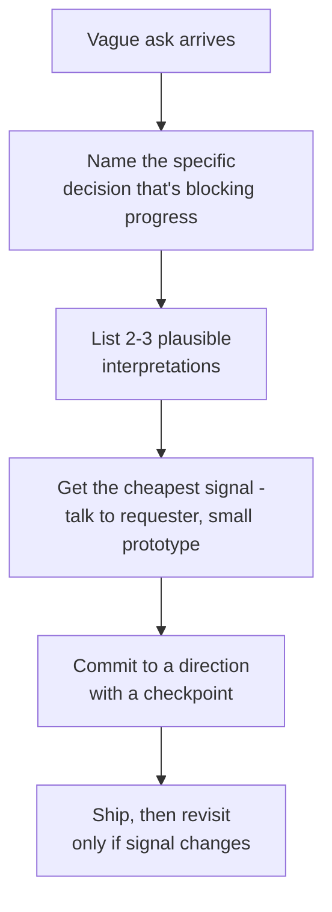
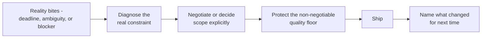

Execution questions test something different from leadership or conflict questions: can you actually get things shipped when reality is messy — the deadline is real, the requirements are half-formed, and something has to give. Interviewers are listening for judgement about *what* you cut and *how* you decided, not just that you hit the date.

## Tight deadlines and competing priorities

The weak version of this story is "I worked long hours to hit the date." The strong version shows a decision about *scope*, not just effort — you identified what could be cut, negotiated it explicitly with stakeholders, and protected the parts that mattered most (correctness, security, data integrity) while trimming the parts that didn't (polish, edge cases with low probability, nice-to-have configurability).

> [!KEY]
> "I worked extra hours" is not a differentiator — most candidates can say that. "I identified exactly what to cut and got explicit agreement to cut it" is the signal interviewers are actually listening for.

## Negotiating and cutting scope well

Cutting scope badly means silently dropping something and hoping nobody notices, or unilaterally deciding what's "not important" without checking with the people who asked for it. Cutting scope well is a negotiation:

1. State clearly what is at risk given the current scope and date.
2. Propose two or three concrete options (cut X, extend by N days, add resourcing) rather than just raising a problem.
3. Get an explicit decision from whoever owns the trade-off — don't assume silence is agreement.
4. Write down what was cut and why, so it doesn't quietly become "forgotten" scope that resurfaces as a surprise later.

| Weak scope cut | Strong scope cut |
|---|---|
| Silently dropped the edge case, hoped nobody noticed | Flagged it explicitly, got sign-off from the product owner |
| "We just didn't have time for tests" | "We shipped with reduced test coverage on the low-risk path, and added a follow-up ticket" |
| Cut based on personal judgement alone | Cut based on impact data or explicit stakeholder input |
| No record of what was descoped | Documented the cut and the plan to revisit it |

## Unblocking a stalled project

A good "unblocking" story identifies the *actual* root cause of the stall — often a missing decision, an unclear owner, or a dependency nobody had pinged in weeks — rather than just "I worked harder." Naming the specific mechanism you used (scheduled a decision meeting with a deadline, found the one blocking approver and got five minutes on their calendar, wrote a one-page doc that finally got a stuck debate resolved) is what separates this from a generic "I pushed it forward" claim.

## Driving ambiguity to clarity

Ambiguous problems are common at senior level, and the story here should show a repeatable method, not luck. A reliable approach: state the decision that actually needs to be made, list the two or three most plausible interpretations, pick the cheapest way to get signal on which is right (a quick prototype, a conversation with the actual requester, a small user test), and commit to a direction with an explicit checkpoint to revisit if it's wrong.

## Estimating and being wrong

Every senior engineer has an estimate that blew up. The strong version of this story is honest about the miss, names the *specific* thing that was underestimated (an integration nobody had scoped, a data migration that turned out messier than expected), and — critically — describes what changed in how you estimate afterward. "I now always add explicit time for the integration surface, not just the code I'm writing" is a much better ending than "I just try to pad estimates more now."

## Cross-team dependencies

Dependency stories test whether you can drive an outcome you don't fully control. The strongest version names the specific mechanism you used to de-risk the dependency early — a shared timeline document, a weekly sync specifically about the interface contract, building a mock of their API before it existed so your team wasn't blocked — rather than just "we communicated a lot."

## Saying no

Saying no well is a senior skill because junior engineers often either say yes to everything (and burn out or slip dates) or say no reflexively (and become hard to work with). The strong pattern: acknowledge the request's value, state the specific trade-off it would cost (what would slip or break), and if possible, offer an alternative that gets most of the value more cheaply.

> [!TIP]
> A good "no" sounds like: *"I can't add that to this sprint without pushing the security fix we already committed to. I can either do a smaller version of it now, or the full version next sprint — which is more useful to you?"* — refusal plus options, not a flat refusal.

## Shipping under pressure without destroying quality

This is where interviewers probe for whether you have a *floor* — a set of things you refuse to cut regardless of pressure (data integrity checks, security reviews, rollback plans) — versus things that flex (UI polish, non-critical test coverage, documentation that can follow later). A senior answer names that floor explicitly and gives an example of holding it even when it was uncomfortable to do so.

> [!DANGER]
> A story where you cut a safety check to hit a date and got lucky is a red flag, not a win, unless you are explicit that you would not make the same call again. Interviewers listen for whether you've internalised the lesson or are quietly proud of the shortcut.

## Prioritisation frameworks worth naming

You do not need to formally run these in every decision, but naming one naturally when asked "how did you decide what to cut" signals structured thinking rather than gut feel.

| Framework | What it weighs | When to reference it |
|---|---|---|
| MoSCoW (Must/Should/Could/Won't) | Binary must-have vs nice-to-have | Scope cuts under a fixed deadline |
| RICE (Reach, Impact, Confidence, Effort) | Expected value of competing initiatives | Roadmap or backlog prioritisation |
| Cost of delay | What it costs to wait, per unit time | Deciding order of near-equal-value items |
| Eisenhower (urgent vs important) | Distinguishing noise from real priorities | Personal or team workload triage |

Use the name naturally, in one sentence — "I roughly used a MoSCoW split to separate what had to ship from what could follow" — rather than presenting it as if you ran a formal workshop for a two-day decision.

## What a strong delivery story sounds like versus a weak one

| Weak delivery story | Strong delivery story |
|---|---|
| "We worked nights and weekends and made it" | "I identified the two features we could defer, got explicit sign-off, and protected the security review" |
| "The deadline was tight but we pulled through" | "I renegotiated scope with the stakeholder in week one, not week three" |
| "I just pushed the team harder" | "I found the actual blocker — a missing decision — and got it resolved in a day" |
| "We got lucky it worked out" | "I made sure the parts we couldn't afford to get wrong were the parts we didn't cut" |
| No mention of what was learned | Names a specific change to how they estimate or scope next time |

## The execution narrative arc

Most strong delivery stories, regardless of the specific prompt, follow the same underlying arc — recognising this lets you adapt one strong story to several different questions.

## Cheat sheet

- "I worked harder" is not a story; "I identified what to cut and negotiated it explicitly" is.
- Scope cuts need explicit sign-off and a written record, not silent dropping.
- Unblocking stories need a specific mechanism (found the real blocker), not just persistence.
- Ambiguity stories need a repeatable method: name the decision, list interpretations, get cheap signal, commit with a checkpoint.
- Estimation-miss stories need a named specific cause and a concrete change to future estimating habits.
- Saying no well means naming the trade-off and offering an alternative, not a flat refusal.
- Always have a stated quality "floor" you don't cut under pressure, and a real example of holding it.
- Name a prioritisation framework naturally in one sentence when relevant; don't over-formalise a quick decision.

## Common mistakes

| Mistake | Fix |
|---|---|
| Story is just "we worked really hard" | Reframe around the scope or priority decision you made |
| Scope cut was silent, no stakeholder sign-off | Show the explicit negotiation and written record |
| "Unblocking" story has no specific mechanism | Name the actual root cause and what you did about it |
| Estimation-miss story has no lesson attached | State the concrete change to how you estimate now |
| "No" story is a flat refusal with no alternative | Add the trade-off and an alternative option |
| Cut a safety check to hit a date and call it a win | Be explicit you wouldn't repeat that trade-off |

## Summary

Execution stories are ultimately about the quality of the trade-off decisions you made under real constraints, not about effort or luck. The strongest answers name the actual constraint, show an explicit negotiation or decision about what to cut, protect a clear quality floor, and end with something concrete that changed in how you plan or estimate afterward. Build one or two flexible stories that can flex across "tight deadline," "ambiguity," "saying no," and "cross-team dependency" prompts by choosing which part of the same arc to emphasise.

## Top Interview Questions

### Q1. Tell me about a time you had to deliver something under a tight deadline.

We had three weeks to ship a compliance-driven change with a hard regulatory date. In week one, I mapped the full scope and identified that a secondary reporting feature could be deferred without affecting the compliance requirement itself. I took that trade-off to the product owner explicitly, rather than quietly dropping it, and got written agreement to descope it with a follow-up ticket for the next sprint. That freed up enough time to keep our normal security review and testing bar on the core compliance change. We shipped on time, the deferred feature landed two weeks later with no one surprised by its absence, and the compliance change passed its audit with no findings.

### Q2. Describe a situation where you had to cut scope. How did you decide what to cut?

I was leading a feature with growing scope creep against a fixed launch date tied to a partner's own announcement. I listed every remaining piece of work and roughly split it using a must/should/could framing — what would break the core promise to users, what would be noticeably worse without, and what was genuinely optional polish. I took that split to the stakeholders with a specific ask: approve cutting the "could" items, or the date slips by two weeks. They approved the cut. We shipped on time with a slightly less polished settings screen, which nobody who used the product in the following month raised as an issue, while the two features that mattered most landed with full quality.

### Q3. Tell me about a time you unblocked a stalled project.

A cross-team data pipeline project had been stuck for nearly a month with no visible progress. Investigating, I found the actual blocker wasn't technical — it was a decision about data ownership that had been raised in a doc but never explicitly resolved, so both teams were quietly waiting on the other. I scheduled a 30-minute meeting with the two people who actually owned the decision, framed it as needing a yes/no by the end of that meeting, and we got a clear answer. The project resumed the same week and shipped roughly on its original timeline, which taught me to look for a missing decision, not a missing person, whenever a project stalls without an obvious reason.

### Q4. How do you approach a task that's genuinely ambiguous, with no clear requirements?

I start by naming the specific decision that's actually blocking progress, rather than trying to resolve all the ambiguity at once. For a request to "improve our internal developer experience," I listed three plausible interpretations — faster CI, better documentation, or simpler local setup — and rather than guessing, spent thirty minutes talking to five engineers about their actual daily friction. That pointed clearly at local setup time as the dominant pain point, which I might not have picked from my own assumptions. I committed to that direction with a two-week checkpoint to confirm it was the right bet before investing further, which it was.

### Q5. Tell me about a time your estimate was significantly wrong. What happened?

I estimated a two-week integration with a third-party payment provider at two weeks, and it took five. The specific miss was that I'd scoped the code we needed to write, but not the integration surface — their sandbox environment behaved differently from production in ways that required three rounds of back-and-forth with their support team, none of which I'd accounted for. Since then, I explicitly add a separate estimate line for "unknowns in third-party integration behaviour" whenever a project depends on an external system I don't control, usually informed by asking whether anyone on the team has integrated with that provider before.

### Q6. Describe a time you had to say no to a request from a stakeholder.

A product manager asked for a new reporting feature to be added mid-sprint, on top of an already committed security fix. I acknowledged the feature's value, then stated the specific trade-off clearly: adding it without extending the sprint would mean deprioritising the security fix, which wasn't something I was willing to do. I offered an alternative — a much smaller version of the reporting feature that covered their most common use case, ready in the following sprint. They took the smaller version, the security fix shipped on time, and the fuller reporting feature landed a sprint later with no negative impact, since the smaller version had already covered their most urgent need.

### Q7. Tell me about a time you had to manage a dependency on another team that was outside your control.

My team's launch depended on an API from another team that hadn't been built yet, and their roadmap treated it as lower priority than ours. Rather than waiting, I proposed we jointly agree the interface contract early, then I built a mock of their API against that contract so my team could keep developing without being blocked. We ran a weekly ten-minute sync specifically on any contract changes, which caught two breaking changes before they hit our integration tests. When their real API was ready, integration took under a day because we'd effectively already been developing against its final shape.

### Q8. How do you prioritise when everything seems urgent?

I try to separate urgency from importance rather than reacting to whichever request is loudest. In one period with three competing "urgent" asks, I quickly estimated rough impact and effort for each — similar to a RICE-style comparison — which showed one request affected a small number of internal users while another was blocking a customer-facing outage workaround. I communicated that ranking explicitly to all three requesters rather than silently choosing, which meant the two deprioritised requesters understood why and didn't need to keep escalating. The outage workaround shipped within a day, and the other two followed within the week without anyone feeling ignored.

### Q9. Tell me about a time you shipped under significant pressure without cutting corners you shouldn't have.

During a critical launch window, there was pressure to skip a data migration dry run to save two days. I held the line on that specific check, because a bad migration on production data was not a risk I was willing to accept regardless of the date, and instead found two days elsewhere by deferring a non-critical UI refinement that had already been flagged as optional. The dry run caught a data type mismatch that would have caused silent corruption in about 2% of records had we skipped it. That experience is exactly why I now treat data integrity and security checks as a fixed floor, and look for schedule flexibility everywhere else first.

### Q10. Describe a time you had to renegotiate a deadline. How did you approach the conversation?

Partway through a project, new requirements were added without an updated timeline, so I proactively went to the stakeholder rather than waiting to be asked why we were behind. I presented the original scope, the new scope, and three concrete options: extend the date by two weeks, cut a specific secondary feature, or bring in one more engineer for the final two weeks. I didn't just flag a problem; I brought a decision they could actually make. They chose to extend by ten days, which was less disruptive than either of us initially expected, and having the options ready meant the conversation took fifteen minutes instead of becoming a drawn-out back-and-forth.

### Q11. Tell me about a time you had to balance speed and quality on a deliverable.

I was building an internal tool where the requesting team wanted it "as soon as possible," which could easily have meant cutting testing entirely. I proposed a middle path: ship a minimal version fast, but insist on automated tests for the core data transformation logic specifically, since that was the part most likely to silently produce wrong results if broken. I deliberately skipped tests for the UI layer, which was low-risk and easy to visually verify. This got them a usable tool within three days instead of a fully tested version in two weeks, while protecting the part of the system where a bug would have been hardest to detect.

### Q12. What do you do when you realise mid-project that you're not going to hit the deadline?

I flag it as early as possible rather than hoping to catch up silently, since the earlier a stakeholder knows, the more options exist. When I realised a migration project was going to run a week over, I went to the stakeholder with the specific reason (an unexpected data quality issue in about 15% of records), the revised estimate, and options to either extend the date or ship a reduced scope that handled the clean 85% first with a follow-up for the rest. They chose the phased approach, which meant most users saw no disruption at all, and the team avoided the last-minute scramble that silently discovering the slip in the final days would have caused.
