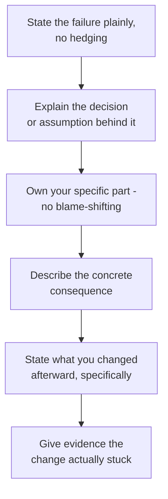

"Tell me about a failure" is the highest-signal question in most behavioural loops, and also the most commonly fumbled. Candidates either pick something too trivial to matter, spin a success story with a fake flaw attached, or over-correct into self-flagellation that makes an interviewer worry about their resilience rather than their judgement.

## Why this is the highest-signal question

Almost any candidate can describe a success convincingly, because success stories are easy to be generous with yourself about. A failure story forces a choice: be honest about something that went wrong and own your part in it, or reach for a safe, sanitised non-answer. Interviewers use this question specifically because the *quality of honesty* is itself the signal — more than the failure's content.

> [!KEY]
> The failure itself matters less than what it reveals about your self-awareness and what changed afterward. A moderate failure with a sharp, honest account of the lesson beats a dramatic failure told defensively.

## Choosing a real failure

Not every setback makes a good story. A good failure candidate is:

- **Big enough to matter** — a real consequence, not a typo you caught yourself.
- **Honestly yours** — your decision or action was a meaningful contributing cause, not just "the team missed a deadline."
- **Recent enough** to be credible and to show current judgement, ideally within the last two to three years.
- **Followed by genuine learning** — something specific changed in how you work, not a generic "I learned to communicate more."

| Bad failure choice | Why it fails |
|---|---|
| "I once mistyped a config value" | Too small, no real stakes |
| "My team missed a deadline" (you weren't really responsible) | Not honestly yours |
| A failure from ten years ago in a junior role | Doesn't reflect current judgement |
| A "failure" that's actually a humble-brag ("I worked too hard") | Reads as spin, not honesty |

## The anatomy of a great failure answer

The step candidates skip most is the last one — evidence the change stuck. "I now write a design doc before big changes" is a claim; "the next three projects I led all had design docs, and one caught a similar issue before it shipped" is evidence.

## Owning it without self-flagellation

There is a narrow band between deflecting blame and excessive self-criticism, and both fail. Deflection sounds like "the requirements were unclear" or "the tooling let me down." Self-flagellation sounds like dwelling on how bad you felt, or a tone that suggests you still haven't processed it. The right register is matter-of-fact: state what you got wrong plainly, in one or two sentences, and move quickly to what you did about it.

> [!WARNING]
> Interviewers are also evaluating resilience. A candidate who describes a failure with visible ongoing distress, or who frames it as evidence they're generally not good enough, raises a real concern about how they'll handle the inevitable next failure on the job.

## What you changed afterward, and evidence it stuck

This is where most answers are thin. A specific, checkable change is far stronger than a general resolution:

| Generic (weak) | Specific (strong) |
|---|---|
| "I learned to communicate better" | "I now send a written summary after every cross-team meeting within the hour" |
| "I'm more careful with testing now" | "I added a mandatory rollback plan section to our deploy checklist" |
| "I double-check things more" | "I introduced a peer review step specifically for schema migrations" |

Then, ideally, name a later moment where the new habit actually caught something — this is the evidence that turns a stated intention into a credible, demonstrated change.

## Failures to avoid mentioning

Some categories are technically true but poor choices for an interview, because they raise more concern than they resolve:

- Anything involving a serious ethical or integrity lapse.
- A failure that damaged someone else's career or reputation, where the story centres your learning over their harm.
- A failure you clearly still haven't processed or accepted responsibility for.
- Anything that reveals a pattern rather than a one-off — if you have three "I missed a deadline" stories, that's a trend, not an anecdote.

## The bad architectural decision story

This is a strong, common variant for senior and staff-track candidates. The shape: state the decision plainly, name the information you had at the time and what you missed or under-weighted, describe the concrete cost once it surfaced (a migration, an outage, a slow feature), and be specific about what changed in how you make architectural decisions now — a new step in your design review process, a category of risk you now explicitly check for.

## The production incident you caused story

This is the most common failure prompt for backend and infrastructure-leaning roles, and it doubles as an incident-response competency check. Strong structure: what you changed and why it seemed safe at the time, how the incident was detected, what you did during the incident itself (calm, methodical, communicated status), the concrete impact (duration, users affected, revenue if known), the root cause once found, and the specific guardrail added afterward — a canary rollout step, a new alert, a required review for that class of change.

> [!TIP]
> A senior answer explicitly separates "what caused the incident" from "what allowed it to reach production" — the second is usually the more interesting engineering answer, because it's about systemic prevention, not a single mistake.

## The missed deadline story

Weaker than the other two variants if handled generically, but strong if it reveals an estimation or communication failure specifically. The key differentiator: did you flag the risk of missing the deadline early, or did it surprise everyone at the last moment? A story where you should have raised the risk two weeks earlier and didn't is more honest and more useful than a story that blames unforeseeable circumstances.

## Weak versus strong failure answers

| Weak | Strong |
|---|---|
| "We missed a deadline because requirements changed" | "I underestimated integration complexity and didn't flag the risk early enough; I now separate integration risk into its own estimate line" |
| "I pushed a bug to production, we fixed it fast" | "I skipped a canary step under time pressure; the incident lasted 40 minutes and affected 3% of requests; I made canary rollout mandatory for that service afterward" |
| "I learned to be a better communicator" | "I now send written meeting summaries within an hour, and it's caught two misunderstandings before they became real problems" |
| Visibly still upset or defensive about it | Matter-of-fact tone, brief on the mistake, detailed on the fix |

## Four sample outlines

**Bad architectural decision:** chose a synchronous integration pattern for a service assuming low call volume; six months later it became a scaling bottleneck requiring a costly rework under pressure; now explicitly evaluates growth assumptions and asks "what if this is 10x busier in a year" for any integration design.

**Production incident:** shipped a config change without a canary step under deadline pressure; caused a 40-minute partial outage affecting a subset of requests; root cause was an untested edge case in a config validator; made canary deployment mandatory for that service and added a specific test case class for config validation.

**Missed deadline:** underestimated a third-party integration's complexity and didn't raise the risk until a week before the date, surprising stakeholders; now flags integration risk explicitly in week one of any project depending on an external system, with a checkpoint before final commitments are made public.

**Team/people failure:** avoided giving a struggling teammate direct feedback for too long, hoping it would resolve itself, which let a performance issue affect a shared deliverable; now gives specific, direct feedback within the first instance of a recurring pattern rather than waiting to see if it repeats.

## Cheat sheet

- Pick a failure that's big enough to matter, honestly yours, recent, and followed by real learning.
- State the mistake plainly and briefly; spend most of your time on the fix and evidence it stuck.
- Avoid both deflection ("requirements were unclear") and excessive self-criticism.
- Generic lessons ("I communicate better now") are weak; specific, checkable habits are strong.
- For incident stories, separate "what caused it" from "what allowed it to reach production."
- Never pick a story involving an integrity lapse or one where you still haven't accepted responsibility.
- If you have a recurring pattern of similar failures, that's a red flag to address directly, not to hide.

## Common mistakes

| Mistake | Fix |
|---|---|
| Picking a failure too trivial to matter | Choose one with a real, stated consequence |
| Blaming external factors ("requirements changed") | Own your specific contributing decision |
| Visible ongoing distress or self-criticism | Matter-of-fact tone, brief on the mistake |
| Generic lesson with no specific habit change | Name a concrete, checkable change you made |
| No evidence the change actually stuck | Give a later example where the new habit helped |
| Failure story is really a humble-brag | Choose something genuinely uncomfortable to admit |

## Summary

The failure question rewards honesty and specificity more than the dramatic size of the mistake. Choose something real, honestly yours, and recent, state it plainly without spinning or dwelling, and spend the majority of your answer on the specific, checkable change you made afterward and evidence that it stuck. Prepare at least one architectural, one production-incident, and one missed-deadline variant, since interviewers often ask a follow-up that pushes you toward a specific flavour of failure.

## Top Interview Questions

### Q1. Tell me about a time you failed. What happened?

I made an architectural decision to build a new internal service with a synchronous request pattern, assuming call volume would stay low based on the initial use case. I didn't push hard enough to validate that assumption against the team's actual growth plans, and within six months it had become a scaling bottleneck as three more consumers integrated with it, causing latency spikes under load. We had to do a disruptive rework to introduce asynchronous processing under time pressure, which cost roughly three weeks that a better initial design would have avoided. Since then, I explicitly ask "what does this look like at ten times the current load" for any new service design, and I've caught two similar assumptions before they shipped.

### Q2. Tell me about a production incident you caused.

I pushed a configuration change to skip our canary rollout step because we were under deadline pressure and the change looked low-risk. It turned out to expose an edge case in how the service handled a specific header value, causing a 40-minute partial outage affecting roughly 3% of requests before we rolled back. During the incident, I focused on getting a fast rollback out and communicating status clearly rather than trying to root-cause live. Afterward, the root cause was a gap in our config validation tests, and I made canary deployment mandatory for that service regardless of how low-risk a change looks, plus added a specific test category for config validation. That guardrail has since caught at least one similar issue before it reached production.

### Q3. Describe a time you missed a deadline. What went wrong?

I was leading an integration with a third-party API and estimated it would take two weeks, based mainly on the code I expected to write rather than the integration surface itself. I didn't flag any risk until about a week before the deadline, when their sandbox environment's inconsistent behaviour with production had already cost several days I hadn't planned for, which meant the delay came as a late surprise to stakeholders rather than something they'd had time to plan around. What I got wrong wasn't just the estimate, it was not raising the risk early enough for anyone to adjust. I now explicitly flag integration risk in week one of any project with an external dependency, with a checkpoint before I let a date become a public commitment.

### Q4. Tell me about a time you made a technical decision you later regretted.

Early in a project, I chose to build a bespoke authentication layer instead of using an existing, well-tested library, believing our requirements were unusual enough to justify it. They weren't, and the custom layer accumulated subtle bugs over the following months, including one that briefly allowed a session token to persist slightly longer than intended after logout. Fixing it properly meant migrating to a standard library anyway, which is what we should have done from the start. The specific change I made afterward is that for any security-relevant component, I now require an explicit justification for not using an established library, reviewed by at least one other senior engineer, rather than defaulting to a custom build.

### Q5. Tell me about a time you let a teammate down.

A colleague was blocked waiting on an API I owned, and I underestimated how urgent it was to them because they hadn't escalated loudly, so I deprioritised finishing it behind my own work for nearly a week. When I found out how much it had actually blocked them, including a deadline of their own, I felt it was a real failure on my part to have not checked in proactively. Since then, I explicitly ask anyone waiting on my work "what's this blocking on your end, and by when" rather than assuming silence means it's not urgent, and I've caught at least one similar situation early enough to reprioritise before it caused real delay.

### Q6. What's the biggest mistake you've made in a leadership or mentoring capacity?

I avoided giving a teammate direct feedback about a recurring pattern of underspecified pull requests for too long, hoping it would improve on its own, which let it affect a shared deliverable's timeline before I finally addressed it directly. Once I did have the direct conversation, it resolved within a couple of weeks, which made it clear the delay in addressing it had been my hesitation, not a hard problem to solve. I've since committed to giving direct, specific feedback the first time I notice a recurring pattern rather than waiting to see if it repeats, since waiting mainly extended the negative impact without giving the person a fair, earlier chance to adjust.

### Q7. Tell me about a time you were overconfident and it backfired.

I was confident a database migration was low-risk because I'd tested it thoroughly against a staging copy of the data, and skipped a planned dry run against a full production-scale dataset to save half a day. It turned out a specific data pattern that existed only at production scale caused the migration to run far longer than expected, extending a planned maintenance window by two hours. Nothing was permanently broken, but it was avoidable, and it taught me that "I tested it" and "I tested it at the right scale" are different claims. I now treat production-scale dry runs as non-negotiable for any migration affecting customer data, regardless of how confident I feel.

### Q8. Describe a failure that changed how you approach estimation or planning.

I estimated a data migration project without accounting for the possibility of unexpected data quality issues, assuming the data was as clean as our schema implied. About three weeks in, we discovered roughly 15% of records had inconsistencies that required manual handling, which extended the project by nearly two weeks past the original estimate. The specific change I made was to always run a data profiling pass before finalising an estimate for any project involving existing data, rather than assuming schema constraints reflect actual data quality. On the next two migration projects, that profiling step surfaced similar issues early enough to fold into the original estimate rather than causing a mid-project surprise.

### Q9. Tell me about a time you had to admit you were wrong to your team.

I had pushed hard for a particular caching strategy in a design review, and after it was implemented, it introduced a subtle staleness bug that affected a small percentage of user-facing data for about two days before we caught it. I raised it in our next team meeting myself rather than waiting to be asked, explained specifically what I'd underweighted in my original design, and proposed the fix along with a monitoring check to catch similar staleness issues faster next time. Being direct about it, rather than letting someone else surface it, is what I think kept the team's trust intact — the mistake itself was less damaging than a defensive reaction to it would have been.

### Q10. What's a failure you haven't fully resolved or are still working through?

I still catch myself defaulting to solving a problem myself rather than delegating it early enough, especially under time pressure, even though I know intellectually that this limits how much the team grows and how much I can take on longer-term. A recent example: during a tight deadline, I wrote a non-trivial piece of code myself rather than pairing a capable junior engineer through it, purely because it felt faster in the moment. I'm actively working on this by deliberately choosing to delegate the first thing I'm tempted to grab under pressure, even when it costs a bit more short-term speed, because I know from experience that the long-term payoff for the team is worth it.

### Q11. Tell me about a failure that was more about communication than a technical mistake.

I made a design decision and implemented it without circulating a written summary first, assuming a quick verbal mention in standup was enough. Two other engineers built against a slightly different understanding of the interface, which surfaced as an integration mismatch a week later and cost about two days to reconcile. The technical decision itself was fine; the failure was assuming verbal context would propagate accurately. I now write a short summary for any cross-team-affecting decision and share it explicitly in the relevant channel, even when it feels like overkill, and it's since caught at least one similar misunderstanding before any code was written against the wrong assumption.

### Q12. How do you decide which failure to bring up in an interview, and how do you keep the story honest without it sounding rehearsed?

I look for a failure that's genuinely mine, big enough to have had a real consequence, and recent enough to reflect how I currently work, then I prepare the facts — what happened, what I got wrong, what changed — rather than a polished script. To keep it honest in the room, I state the mistake plainly and briefly, without either downplaying it or dwelling on it, and I spend most of my time on the specific, checkable change I made afterward. I also make sure I can answer a natural follow-up like "did that change actually work later?" with a real example, since that's usually the question that separates a rehearsed answer from one grounded in something that actually happened.
