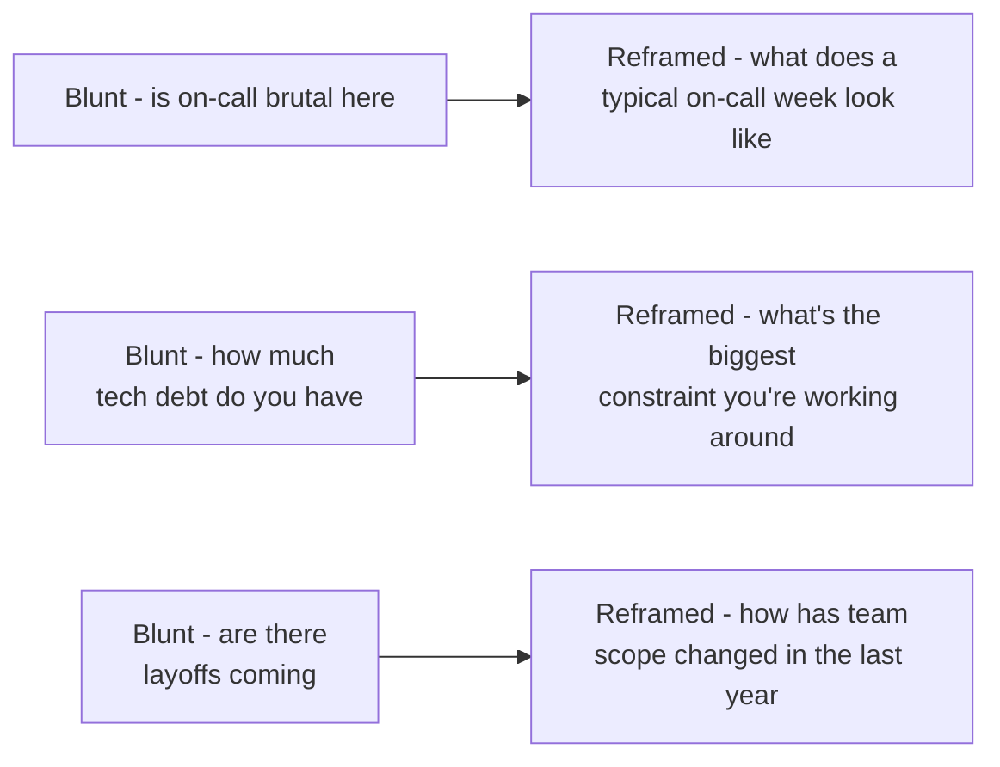

The questions you ask at the end of every interview are not a courtesy slot — they are actively evaluated, and they are also your best tool for finding out whether the role is actually right for you. Treating this as an afterthought wastes one of the highest-leverage parts of the entire loop.

## Why your questions are part of the evaluation

Interviewers form an impression from the questions you ask: specific, well-researched questions signal genuine interest and preparation, while "no, I think you've covered everything" signals low investment, even if unintentional. Good questions also let you tailor follow-up conversations — asking a manager about team structure gets a different, more useful answer than asking an IC the same question, so matching your question to the interviewer's role gets you better signal as well as better optics.

> [!KEY]
> Prepare more questions than you'll use, tailored per interviewer, and let earlier answers in the loop retire questions that get answered naturally — asking something you were already told is a bigger miss than asking too few questions.

## A categorised question bank

### Team and role

| Question | What it signals about you | What the answer signals about them |
|---|---|---|
| "What does the team's on-call rotation actually look like week to week?" | You think about sustainability, not just the job title | Whether on-call load is reasonable or a hidden burden |
| "How is work typically divided across the team?" | You're thinking about fit and autonomy | Whether roles are well-defined or chaotic |
| "What would success look like in this role after six months?" | You think in outcomes, not just tasks | Whether expectations are concrete or vague |

### Technical and architecture

| Question | What it signals about you | What the answer signals about them |
|---|---|---|
| "What's the biggest architectural constraint the team is working around right now?" | Genuine technical curiosity and depth | Honesty about technical debt versus a sales pitch |
| "How do you decide when to pay down technical debt versus ship features?" | You understand the real trade-off senior engineers navigate | Whether debt is actively managed or perpetually deferred |
| "What does your deployment and rollback process look like?" | Operational maturity | Actual engineering rigor versus stated rigor |

### Process and delivery

| Question | What it signals about you | What the answer signals about them |
|---|---|---|
| "How does the team handle scope changes mid-sprint?" | You've dealt with this reality before | Whether planning is respected or constantly overridden |
| "How are incidents reviewed, and what happens after a postmortem?" | You care about durable fixes, not just fire-fighting | Blameless culture versus blame culture |
| "How much of the roadmap is typically set quarter to quarter versus decided reactively?" | Interest in planning stability | Whether the team has real strategic space or is purely reactive |

### Culture and growth

| Question | What it signals about you | What the answer signals about them |
|---|---|---|
| "How do people typically grow from this level to the next here?" | Ambition paired with realism | Whether growth paths are clear or improvised |
| "Can you tell me about a recent instance of someone disagreeing with a decision and it changing the outcome?" | You value substance over politeness | Whether dissent is genuinely welcomed |
| "What's something the team has changed about how it works in the last year?" | Interest in continuous improvement | Whether the team adapts or is stagnant |

### Manager and expectations

| Question | What it signals about you | What the answer signals about them |
|---|---|---|
| "How do you like to give and receive feedback?" | Self-awareness about working styles | Their actual management style, not just stated values |
| "What's the biggest challenge the last person in this role faced?" | You're thinking realistically about the job | Honesty about the role's hard edges |
| "How involved are you day to day versus how much autonomy does the team have?" | Interest in fit, not just approval | Management style — hands-on or hands-off |

### Business and strategy

| Question | What it signals about you | What the answer signals about them |
|---|---|---|
| "How does this team's work connect to the company's broader priorities this year?" | Strategic thinking beyond your own tasks | Whether the interviewer can articulate it clearly |
| "What's the biggest competitive or market risk the company is watching right now?" | Business literacy, not just technical focus | How grounded leadership's thinking is |
| "How has the team's headcount or scope changed in the last year?" | Practical interest in stability | Growth trajectory versus contraction, indirectly |

## Questions that are red flags to ask

Some questions technically fine to ask can land poorly depending on timing and framing — avoid leading with these, even if you genuinely want the answer:

- "What's your attrition rate?" asked bluntly and early — reframe as "how long do people typically stay on the team, and why do people leave?"
- "Is there a lot of overtime expected?" asked without context — reframe as "how does the team handle crunch periods around major launches?"
- Purely compensation-focused questions in a technical round — save these for the recruiter or hiring manager conversation.
- "Why did the last person leave this role?" asked confrontationally — reframe as "what's changed about this role since it was last filled?"

## Probing on-call, tech debt, and reorg risk politely

These are legitimate, important things to understand before joining, but blunt phrasing can read as adversarial. Frame them as forward-looking and collaborative rather than as an audit:

> [!TIP]
> The reframed versions get you the same underlying information — you can infer attrition, debt severity, and stability risk from the honesty and specificity of the answer — without putting the interviewer on the defensive.

## Tailoring questions to the interviewer's role

Ask an IC about day-to-day reality (code review culture, how decisions actually get made, what surprised them after joining). Ask a manager or hiring manager about team structure, growth paths, and expectations. Ask a skip-level or director about strategy, how the team's success is measured at the org level, and where the team fits into a multi-year plan. Asking a director a question best suited for an IC ("what's it like day to day") wastes a rare opportunity to get strategic context you can't get elsewhere in the loop.

> [!WARNING]
> Do not ask the exact same generic question of every interviewer — it's the fastest way to look like you're running through a rehearsed script rather than genuinely curious about each person's perspective.

## Using context without turning questions into research reports

Company context matters only because it helps you ask sharper questions. Do enough homework to avoid asking for public facts, then convert what you learned into a question about the team's real trade-offs. The interviewer should hear curiosity and judgement, not a mini-presentation proving you read every press release.

| Context signal | Better question | Why it works |
|---|---|---|
| Recent platform migration | "What has been hardest to stabilize since that migration?" | Moves from public fact to operational reality |
| Job description mentions on-call | "What typically pages the team, and what has reduced pages recently?" | Asks about sustainability and improvement |
| Engineering blog highlights scale | "Which scaling assumption has changed most since that design was written?" | Lets the interviewer discuss evolution, not marketing |
| Role mentions cross-functional work | "Where does collaboration with product or support usually get hardest?" | Surfaces the influence surface of the role |
| Company is growing fast | "How has the team's scope changed as headcount grew?" | Gets signal on stability and role ambiguity |

## Retiring and rotating questions during the loop

Treat your question list as a queue, not a script. If an earlier interviewer already answered something, retire it and ask a follow-up that uses the new information. If three interviewers give different answers to the same topic, that is useful signal, but ask intentionally rather than repeating a canned line.

| Situation | Better move |
|---|---|
| A question was fully answered earlier | Ask a follow-up from another angle or drop it |
| Two answers conflict | Ask neutrally how the team is aligning on that difference |
| You have only two minutes left | Ask one high-signal fit question, not three small ones |
| The interviewer is an IC | Ask about day-to-day engineering reality |
| The interviewer owns the team | Ask about expectations, constraints, and first-six-month success |
| The interviewer is senior leadership | Ask about strategy, trade-offs, and how the team is measured |

## Cheat sheet

- Questions you ask are actively evaluated — prepare specific ones, not generic ones.
- Tailor questions to the interviewer's role: IC for day-to-day reality, manager for team structure, director for strategy.
- Reframe blunt questions (attrition, tech debt, layoffs) as forward-looking, collaborative versions.
- Avoid pure compensation questions in technical rounds; save those for the recruiter or hiring manager.
- Use light company context to make questions specific, not to recite research.
- Retire questions that have already been answered and ask follow-ups that use what you learned.
- Keep one high-signal fit question ready for short end-of-round windows.

## Common mistakes

| Mistake | Fix |
|---|---|
| Asking the same generic question of every interviewer | Tailor at least one question per interviewer's role |
| "No, I think you've covered everything" | Always have at least two prepared questions ready |
| Blunt phrasing on attrition, debt, or layoffs | Reframe as forward-looking, collaborative questions |
| Leading with compensation questions in a technical round | Save those for the recruiter or hiring manager conversation |
| Turning a question into a speech about your research | Ask the decision or trade-off your research surfaced |
| Re-asking something already answered earlier | Retire it or ask a sharper follow-up |

## Summary

The questions you ask are an active, evaluated part of the interview, not a courtesy, and they double as your own diligence tool for whether the role is genuinely a good fit. Build a categorised bank tailored to each interviewer's role, reframe sensitive questions like attrition or tech debt collaboratively rather than bluntly, and use light company context to ask sharper follow-ups. Strong questions reveal expectations, constraints, team health, and whether the role matches how you do your best work.

## Top Interview Questions

### Q1. What questions do you typically ask at the end of an interview, and why?

I tailor questions to the interviewer's role rather than asking the same thing of everyone. With an IC, I might ask what surprised them most after joining, since that reveals gaps between the pitch and the reality. With a manager, I ask how the team handles scope changes mid-sprint, since that reveals whether planning is respected in practice. With a more senior leader, I ask how the team's work connects to broader company priorities. I keep a few in reserve and drop ones that get answered naturally earlier in the conversation, since re-asking something already covered wastes the opportunity.

### Q2. How would you politely find out about on-call burden without asking directly if it's bad?

I'd ask something like "what does a typical on-call week look like for the team, and how often does something actually page someone overnight?" rather than bluntly asking if it's brutal. This gets at the same information — frequency, severity, and whether it's sustainable — without putting the interviewer on the defensive, and the specificity or vagueness of their answer usually tells me what I need to know. If the answer is vague or deflects the numbers, that itself is informative.

### Q3. How much company context do you need to ask good questions?

Enough to avoid generic or public-fact questions, not so much that the question becomes a research monologue. I want one or two concrete signals — a recent migration, a product launch, a reliability theme in the job description — and then I convert each into a question about the team's current trade-off. For example, instead of saying I read a blog post about your architecture, I would ask what assumption in that architecture has changed most since it was written. The value is not proving I researched; it is getting a more honest answer about present reality.

### Q4. How do you decide which questions to ask an IC versus a hiring manager versus a director?

I match the question to what each person actually has good visibility into. An IC can tell me about day-to-day reality — code review norms, how decisions actually get made versus how they're supposed to be made, what they'd change if they could. A hiring manager can speak to team structure, growth paths, and expectations for the role. A director or skip-level can speak to strategy and how the team's success is measured at an organisational level. Asking a director what a typical day looks like wastes a rare chance to get context I can't get from anyone else in the loop.

### Q5. How do you turn research into a question rather than a speech?

I turn the public fact into a present-tense trade-off. If I know the team migrated a system, I do not spend a minute summarizing their blog post back to them. I ask what has been hardest to operate since the migration, or which assumption changed after production traffic arrived. If the job description emphasizes cross-functional ownership, I ask where product and engineering trade-offs usually become hardest. The pattern is signal, then question: one sentence of context at most, followed by an open question the interviewer can answer from lived experience.

### Q6. How would you find out about a team's technical debt situation without seeming like you're digging for problems?

I'd ask something like "what's the biggest architectural constraint the team is currently working around?" which invites an honest, specific answer rather than a binary "yes we have debt" or defensive denial. Most engineers are happy to talk candidly about a real constraint when asked this way, since it's framed as understanding the technical landscape rather than as an audit. The specificity and candour of the answer also tells me a lot about the team's culture around acknowledging debt versus glossing over it.

### Q7. How do you decide whether a question is worth asking?

I ask whether the answer would change my understanding of the role, the team, or the risks of joining. "What stack do you use?" is usually low value if the posting already says it. "What technical constraint slows delivery most often?" is higher value because it reveals daily reality and engineering maturity. I also prefer questions that give the interviewer room to answer concretely: a recent example, a measurable expectation, or a trade-off the team is actively navigating. If the answer could be copied from a careers page, I cut the question.

### Q8. What's a red flag question that candidates sometimes ask, and how would you ask it better?

Bluntly asking "why did the last person in this role leave?" can come across as confrontational and puts the interviewer in an awkward position, especially if the departure was difficult. I'd reframe it as "what's changed about this role or team since it was last filled?" which gets at similar information — whether the role's scope or expectations have shifted, which can indirectly reveal why someone left — without asking the interviewer to speak negatively about a specific person or situation.

### Q9. How do you keep your question list fresh across a multi-round loop?

I treat the list as a queue that changes after every conversation. If an IC answers my on-call question in detail, I do not ask the manager the identical question later; I might ask how they are investing to reduce the specific page class the IC mentioned. If two people give different accounts of planning stability, I ask a neutral follow-up about how priorities are aligned when that happens. This makes later questions sharper and prevents me from sounding scripted. It also gives me better signal, because inconsistencies across answers are often more informative than any single answer.

### Q10. Tell me about a question you asked in an interview that gave you genuinely useful signal about whether to join.

I asked a hiring manager, "can you tell me about a recent time someone disagreed with a decision and it actually changed the outcome?" Their answer described a specific, recent example in detail, including what changed and why, which gave me real confidence that dissent was genuinely welcomed rather than just stated as a value. In a different interview, the same question got a vague, generic answer about "we value all opinions," which was a much weaker signal and something I weighed when comparing offers.

### Q11. How do you ask about growth without sounding entitled?

I ask about the observable path rather than implying I expect a promotion on a fixed date. A good version is "what evidence typically shows someone is ready for the next level here?" or "what have you seen strong engineers at this level do in their first year that set them up well?" That frames growth as performance and contribution, not entitlement. It also gives me practical signal: whether expectations are concrete, whether the manager can describe examples, and whether the team has a real development path or just a vague promise that people grow over time.

### Q12. Why do you think the questions a candidate asks are evaluated, and what does a strong one look like to you?

The questions reveal how much genuine thought a candidate has put into whether this specific role and team are right for them, which is different from how well they perform on a scripted technical or behavioural question. A strong question is specific to something I've actually researched or heard earlier in the loop — for example, referencing a technical trade-off mentioned by an earlier interviewer and asking how the team is thinking about it going forward — rather than a generic question that could apply to any company. That specificity signals both preparation and real engagement, which is exactly what I'd want to see if I were on the other side of the table.
