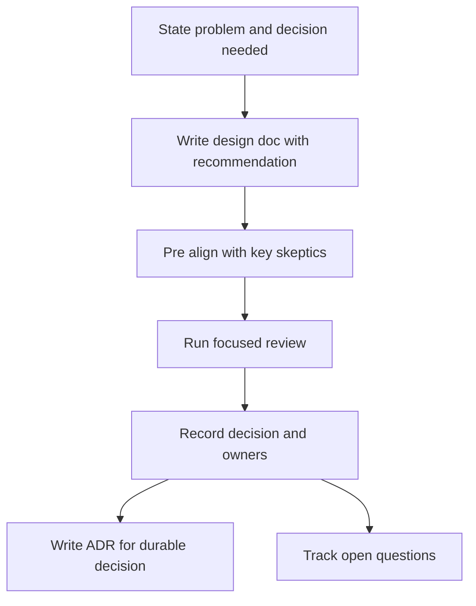

Senior engineers are judged not only by technical judgment but by whether others can understand, trust, and act on that judgment. Clear writing, design reviews, and stakeholder alignment turn ambiguous technical work into decisions people can support.

## Communication as engineering work

Good communication reduces coordination cost. It makes risks visible before they become surprises, lets busy reviewers make decisions asynchronously, and gives partner teams enough context to plan around your work.

The most useful default is BLUF: bottom line up front. Lead with the decision, recommendation, or ask, then give supporting evidence. Engineers often want to build context first and conclusion last, but senior written communication should let a reader understand the point in the first few lines.

| Audience | What they need | What to avoid | Strong opening |
|---|---|---|---|
| Engineer | Failure modes, trade-offs, interfaces, rollout details | Business-only framing with no technical substance | "The hardest technical decision is the storage boundary." |
| Manager | Risk, staffing, timeline, decision owner | Deep implementation detail before impact | "This is on track, with one dependency risk." |
| Executive | Business impact, cost, customer risk, recommendation | Acronyms and mechanism-first explanations | "I recommend option B because it reduces launch risk." |
| Partner team | Contract changes, dates, owners, migration expectations | Vague "FYI" updates with no ask | "Your team owns one API change by Friday." |

> [!KEY]
> The purpose of a design doc is to get a decision made. If readers finish impressed by the detail but unclear on the decision, the doc failed.

## Design docs that get read

A design doc should be skimmable in five minutes and reviewable in depth in thirty. The top should state the problem, the decision needed, and the recommendation. Details belong below, organized around trade-offs rather than a chronological story of how you explored the space.

| Section | Why it matters | Common failure |
|---|---|---|
| Context | Explains what is broken or missing now | Too much history before the actual problem |
| Goals and non-goals | Defines success and prevents scope creep | Goals are vague and non-goals are missing |
| Requirements | Makes constraints measurable | Everything is marked high priority |
| Proposed design | Gives reviewers one concrete path to critique | Multiple options are presented with no recommendation |
| Alternatives considered | Shows judgment and prevents repeated objections | Rejected options are dismissed without evidence |
| Risks and mitigations | Lets stakeholders choose with eyes open | Risks are hidden to make the design look clean |
| Rollout plan | Proves the design can ship safely | Big-bang launch with no rollback |
| Open questions | Turns uncertainty into owned follow-up | Questions have no owner or date |

```text
Decision needed: Approve the new partitioning design for the feed service.
Recommendation: Move to hash-prefixed publisher partitions with dual-write migration.
Why now: Current p99 read latency is 600 ms against a 200 ms target.
Trade-off: Adds migration complexity, but avoids tripling database capacity cost.
Ask: Review risks and rollout plan by Thursday so implementation can start Monday.
```

This format respects the reader's time. A reviewer who disagrees with the recommendation can jump straight to alternatives and risks; a manager can see date and impact; a partner team can see whether they owe an action.

## Decision records and review flow

Architecture Decision Records, or ADRs, are short records of decisions that will matter later. They are not full design docs. A good ADR captures context, decision, status, and consequences so a future engineer can understand why the team chose a path.



Write an ADR when a decision is hard to reverse, surprising, or likely to be questioned later. Do not write one for every implementation detail.

> [!TIP]
> Pre-align with the strongest skeptic before the review. A short one-on-one often turns a public derailment into a sharper meeting because objections arrive already understood.

## Running a design review

A design review is not a live reading session. Send the doc at least 48 hours ahead when possible, name the decision you need, and state which parts need review. In the meeting, open with a two-minute summary and move quickly to the highest-risk choices.

| Moment | Strong behavior | Weak behavior |
|---|---|---|
| Before | Share doc, ask for comments, meet key skeptics | Surprise reviewers in the meeting |
| Opening | State decision, recommendation, and review focus | Read the document section by section |
| Objection | Restate the concern and map it to evidence | Defend every choice as if feedback is an attack |
| New alternative | Capture it with owner and due date | Dismiss it because it was not in the doc |
| Closing | Record decision, owners, and open questions | End with "we will follow up" but no owner |

If an objection is valid, incorporate it. If it is a repeat of something already addressed, point to the evidence calmly. If it is a rabbit hole, capture it as an open question and keep the meeting on the decision.

## Async writing and status updates

Async communication should be complete enough that the reader can act without another meeting. A message that says "thoughts?" often creates a synchronous interrupt. A better message states the recommendation, the specific feedback needed, and the deadline.

Status reporting builds trust when it is predictable and specific. The format should not change every week because readers learn where to find what matters.

```text
Status: On track for beta on 12 May.
Progress: Dual-write is deployed to staging and validation has run for 24 hours.
Risk: Partner API schema review is not scheduled yet and could slip beta by one week.
Ask: Need a named reviewer from Partner Platform by Wednesday.
Next update: Friday 16:00 with validation results.
```

> [!WARNING]
> Escalation is not blame. Escalation is making a decision owner, risk, and timeline visible early enough that the organization can still choose a good option.

During incidents, shorten the cadence and use a fixed template: status, impact, current hypothesis, action taken, next action, ETA, and next update time. Never send only "working on it."

Async decisions need an explicit default. If ten people are copied on a thread and nobody knows what silence means, the decision will either stall or be made informally by whoever is loudest later. Write the default into the message: "If there are no objections by Thursday 17:00, I will proceed with option B." That gives busy reviewers a clear review window and gives dissenters a fair chance to respond.

| Async situation | Add this detail | Why it helps |
|---|---|---|
| Requesting review | Decision needed, sections to review, deadline | Prevents unfocused comments after the decision point |
| Sharing status | Progress, risk, blocker, next update time | Builds predictability and reduces status pings |
| Proposing a change | Default action if nobody objects | Avoids silent deadlock |
| Closing a discussion | Final decision, owner, link to record | Keeps the decision discoverable later |

For distributed teams, this matters even more. A complete async message respects time zones because it does not require someone to wake up for a clarification that should have been in the original note.

The same rule applies to disagreement. If a thread is becoming long, summarize the competing positions in one comment, name the decision owner, and move the final decision into the design doc or ADR. Otherwise, the real decision becomes trapped in a chat history that future maintainers will never find.

## Disagreement and stakeholder alignment

Influence without authority is mostly preparation. You win support by solving the other team's problem too, presenting data before opinion, and reducing the cost of saying yes.

Stakeholder mapping helps because not every person needs the same message.

| Stakeholder type | What they care about | How to manage |
|---|---|---|
| Decision maker | Risk, cost, accountability | Bring options, recommendation, and consequences |
| Strong skeptic | Failure modes, precedent, hidden complexity | Pre-align early and model their concern honestly |
| Partner implementer | Contract shape, timeline, test plan | Name DRI, migration steps, and support path |
| Affected manager | Staffing, schedule, escalation path | Show milestones, blockers, and trade-offs |
| Passive observer | Awareness only | Keep updates short and optional |

When disagreeing in writing, separate facts from interpretation. Use comparison tables, failure scenarios, measurements, and explicit assumptions. Avoid tone that corners the other person; the goal is a better decision, not a written record of who was right.

> [!NOTE]
> "Disagree and commit" means making your case with data, documenting the decision, then supporting execution. It does not mean staying silent before the decision or relitigating afterward.

## Answering influence without authority

The interview question "Tell me about a time you influenced a team you had no authority over" is testing whether you can create alignment without relying on title. The answer should show a real dependency, conflicting incentives, the mechanism you used, and a measurable outcome.

| Story beat | What to say |
|---|---|
| Situation | "My team depended on five partner teams adopting a new API contract." |
| Tension | "They had their own sprint goals, so our migration was not naturally prioritized." |
| Action | "I wrote a design doc, mapped each team's impact, pre-aligned with their DRI, and created a shared board." |
| Influence | "I tied the change to their reliability goals and offered migration examples." |
| Result | "All teams adopted before cutover, with no launch blocker and no escalation at the deadline." |

The strongest answers include a moment where you changed your own proposal after feedback. That shows influence as collaboration, not persuasion theater.

## Cheat sheet

- Lead with BLUF: decision, recommendation, why it matters, and ask.
- A design doc should produce a decision, owners, and open questions.
- Include alternatives considered and why they were rejected; it prevents repeated objections.
- ADRs are for durable decisions, not every implementation detail.
- Send design docs before meetings and pre-align with likely skeptics.
- Tailor depth to the audience: engineers need failure modes, executives need impact and recommendation.
- Async updates should be complete enough to avoid a meeting.
- Escalate by naming risk, owner, timeline, and decision needed.
- Influence without authority through data, partner incentives, early alignment, visible wins, and named DRIs.

## Common mistakes

| Mistake | Fix |
|---|---|
| Writing a design doc like a research journal | Put the decision and recommendation at the top |
| Presenting options without a recommendation | Make a call and explain the trade-off |
| Hiding risks to make the design easier to approve | Name risks and mitigation so trust increases |
| Running reviews as live doc readings | Send the doc early and use the meeting for decisions |
| Escalating only at the deadline | Escalate when the decision can still change the outcome |
| Sending vague async messages | State the ask, owner, deadline, and default if nobody responds |
| Treating disagreement as conflict | Use data and decision records, then commit after the decision |

## Summary

Communication is a core senior engineering tool because it turns technical judgment into shared action. Write design docs around decisions, not detail for its own sake; run reviews as decision meetings, not document readings; and adapt the same technical fact to what each audience needs. Influence without authority comes from early alignment, clear trade-offs, partner empathy, and written follow-through.

## Top Interview Questions

### Q1. How do you write a design doc that actually gets approved?

I start with the decision needed, the recommendation, and why it matters now. Then I structure the doc around goals, non-goals, requirements, proposed design, alternatives considered, risks, rollout plan, and open questions with owners. The approval usually comes from clarity, not length. Reviewers trust a doc when they can see that the obvious alternatives were considered and rejected for concrete reasons, and managers trust it when risks and rollout are explicit. Before the review, I send the doc early and pre-align with key skeptics. In the review, I do not read the doc; I focus on the decision, the riskiest trade-offs, and the open questions needed to approve.

### Q2. What sections matter most in a senior-level design document?

The highest-signal sections are problem statement, goals and non-goals, proposed design, alternatives considered, risks and mitigations, rollout plan, and open questions. The problem statement prevents solving the wrong issue. Goals and non-goals stop scope creep. The proposed design gives reviewers one concrete thing to critique. Alternatives considered show judgment and prevent the same objections from consuming the meeting. Risks and rollout prove that the design can survive production, not just a whiteboard. Open questions with owners turn uncertainty into work. Implementation detail matters, but only after the reader understands the decision and the trade-off.

### Q3. How do you tailor a technical message for engineers, managers, executives, and partner teams?

I keep the underlying truth the same but change the entry point and depth. Engineers need interfaces, failure modes, trade-offs, and enough detail to challenge correctness. Managers need timeline, staffing, risks, and whether a decision is needed. Executives need business impact, customer risk, cost, and a clear recommendation without implementation jargon. Partner teams need contract changes, dates, DRIs, migration steps, and how to test. For example, a database migration might be described to engineers as partition keys and dual-write validation, to a manager as launch risk and staffing, and to an executive as reducing latency without downtime.

### Q4. How do you run a design review without it getting derailed?

I prevent derailment before the meeting. I send the doc early, state the review focus, and talk to the strongest skeptics beforehand so I understand their concerns. In the meeting, I open with a two-minute summary: problem, recommendation, decision needed, and highest-risk trade-off. When objections come up, I restate the concern and connect it to evidence or capture it as an open question with an owner and due date. I timebox rabbit holes and keep the meeting oriented around decisions, not consensus on every detail. The meeting should end with recorded decisions, owners, and follow-up items.

### Q5. What makes a good Architecture Decision Record?

A good ADR is short, durable, and focused on why a decision was made. It should include title, date, status, context, decision, and consequences. It is useful when the decision is hard to reverse, surprising, or likely to be questioned later. It is not a substitute for a design doc; the design doc explores the space, while the ADR records the decision after review. The most important part is consequences, including what the decision makes harder. A future engineer should be able to read it months later and understand why the team chose this path without reconstructing a Slack thread or asking people who may have left.

### Q6. How do you communicate project status in a way that builds trust?

I send status on a predictable cadence in a consistent format: current state, progress, risks, blockers, asks, and next milestone. I avoid vague updates like "still working on it." If something might slip, I say so early with options: reduce scope, add help, move date, or accept risk. Trust comes from no surprises. Stakeholders do not need every implementation detail, but they need to know whether the plan still holds and what decision they may need to make. I also separate blockers from risks. A blocker needs action now; a risk needs monitoring and mitigation before it becomes a blocker.

### Q7. How do you escalate well?

Good escalation names the risk, the impact, the decision needed, the owner, and the deadline. It is not blame and it should not be emotional. For example: "The partner API review is not scheduled. If it is not assigned by Wednesday, beta slips by one week. I need a DRI from Partner Platform or approval to ship with the temporary adapter." That gives leaders something actionable. I try peer-to-peer resolution first, but I escalate before the deadline, not after the plan has already failed. The test is whether escalation creates a path to a decision while preserving the working relationship.

### Q8. How do you disagree in writing without damaging the relationship?

I separate facts, assumptions, and recommendations. I write the trade-off clearly, use evidence where available, and avoid language that attributes bad motives or incompetence. A useful structure is: "My concern is X because of data Y. I think option A has risk Z. Option B reduces that risk but costs N. If we still choose A, I recommend mitigation M." This lets the other person engage the reasoning rather than defend themselves. If the decision goes the other way, I document the outcome and commit to execution. Written disagreement should improve decision quality, not create a permanent argument.

### Q9. Tell me about a time you influenced a team you had no authority over.

A strong answer should show that influence came from alignment, not title. I would describe the dependency, the other team's incentives, and what I did to reduce their cost of adopting my proposal. For example, I needed several partner teams to adopt a new API contract. They had their own roadmaps, so I wrote a design doc that mapped impact per team, pre-aligned with each DRI, created a shared dependency board, and offered sample PRs and test cases. I also tied the work to their reliability goals, not just mine. The result should be concrete: adoption, reduced blocker count, launch success, or avoided escalation.

### Q10. How do you handle a stakeholder who keeps changing requirements?

I first try to understand the underlying need because changing requirements often mean an unstated constraint was missed. I ask what business outcome changed, what risk they are trying to avoid, and whether the change is must-have or nice-to-have. Then I write the clarified requirement down with scope, trade-offs, and sign-off before changing implementation. If the change affects timeline, I present options rather than simply absorbing it: move date, drop another feature, add resources, or accept risk. This keeps the conversation about decisions and consequences, not frustration. The important part is converting churn into an explicit choice.
