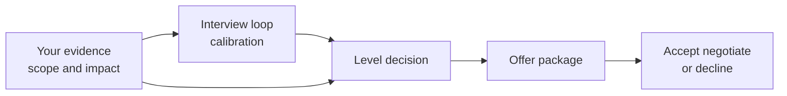

The offer stage is still part of the interview process because level, scope, team match, and compensation are all being finalized. A calm, evidence-based conversation helps you protect the relationship while making sure the role and package match the work you are being hired to do.

## Levelling is about scope

Levelling is not a reward for years of experience. It is a prediction about the scope of problems you can own with low supervision, the blast radius of your decisions, and the influence you can have beyond your immediate tasks.

| Dimension | Senior signal | Staff signal |
|---|---|---|
| Scope | Owns a service or domain end to end | Defines direction across teams or an organization |
| Ambiguity | Creates a plan from unclear requirements | Frames problems no team has solved yet |
| Influence | Aligns partner teams around a design | Sets standards other teams adopt |
| Execution | Ships safely with rollout and rollback | Builds systems that unblock multiple teams |
| Mentorship | Raises team quality through review and coaching | Creates reusable patterns and grows other leaders |
| Communication | Writes design docs others can build from | Drives cross-org decisions with durable artifacts |

> [!KEY]
> Levelling evidence should sound like scope and impact: "I owned the migration across five partner teams" is stronger than "I implemented the migration code."

Down-levelling often happens when evidence is too implementation-heavy. If every story is about what you personally built, the loop may miss that you shaped the problem, aligned stakeholders, reduced risk, and owned outcomes.

## Reading loop calibration

You can often infer the calibrated level from the questions being asked. A senior loop probes domain ownership, design judgment, ambiguity, and cross-team collaboration. A staff loop spends more time on organizational influence, technical direction across teams, and ambiguous problems with no obvious owner.



| Signal in the loop | What it may mean | How to respond |
|---|---|---|
| Most questions stay at feature implementation | Loop may be calibrated below your target level | Add scope, decision, and stakeholder context without rambling |
| Interviewers probe cross-team influence | They are testing senior or staff readiness | Use examples with named partner teams and decisions |
| Hiring manager asks about first year impact | Level and scope are still being matched | Ask what success looks like at the expected level |
| Feedback mentions "not enough strategic scope" | Down-level risk | Offer concrete evidence of strategy, standards, or org-wide adoption |

> [!WARNING]
> Do not argue level as entitlement. Discuss it as calibration: "Based on the scope I have owned, I want to make sure we are calibrating against the right level expectations."

## Signaling senior versus staff impact

The safest way to discuss level is to map your evidence to the company's rubric. If you do not have the rubric, use neutral dimensions: scope, ambiguity, influence, technical complexity, execution risk, and durability of impact.

| Evidence type | Weak phrasing | Strong phrasing |
|---|---|---|
| Scope | "I built the new API." | "I owned the API migration from design through cutover across three consuming teams." |
| Ambiguity | "Requirements were unclear." | "I wrote the requirements and got sign-off from product, support, and platform." |
| Risk | "We deployed carefully." | "I designed dual-write, validation, rollback, and monitoring for zero downtime." |
| Influence | "I told teams what changed." | "I aligned each partner DRI, resolved contract concerns, and tracked adoption." |
| Durability | "It worked." | "The pattern became the team standard for future migrations." |

If down-levelled, first ask for the gap, not the compensation number. A useful response is: "Can you share which level signal was missing so I can understand whether this is a scope mismatch, an evidence gap, or a role constraint?" The answer tells you whether to provide more evidence, negotiate scope, or decide the role is not the right fit.

## Compensation package components

An offer is more than base salary. Evaluate the full package, timing, risk, and role fit. Neutral negotiation starts with understanding the components before reacting to the headline number.

| Component | What to clarify | Notes |
|---|---|---|
| Base salary | Annual amount, pay frequency, review cycle | Most stable cash component |
| Sign-on bonus | Payment date, repayment terms, tax treatment | Can offset lost bonus or unvested equity |
| Annual bonus | Target percentage, payout history, eligibility date | Target is not guaranteed |
| Equity | Grant value, number of shares, vesting schedule, refresh policy | Risk depends on company stage and liquidity |
| Level and title | Internal level, promotion path, scope expectations | A lower level can limit future scope and bands |
| Benefits | Health, retirement, leave, relocation, remote policy | Compare practical value, not just list size |
| Start date | Flexibility, notice period, bonus timing | Timing can be negotiable even when cash is not |

> [!TIP]
> Get the written offer before declining other processes or resigning. Verbal offers can change because approval, headcount, or compensation review is not complete yet.

## Evaluating competing offers

Competing offers are useful data, but they should not be used as threats. A practical comparison scores both compensation and the work you will actually do.

| Criterion | Offer A | Offer B | Question to ask |
|---|---|---|---|
| Level and scope | Senior owning one service | Staff shaping platform standards | Which role builds the evidence you want next? |
| Cash | Higher base | Lower base plus sign-on | Which is more predictable over two years? |
| Equity | Public liquid shares | Private options | What is the realistic risk-adjusted value? |
| Manager | Experienced manager | New manager | Who will create clearer expectations and growth path? |
| Team health | Stable on-call | Unknown on-call | What sustainability risk are you accepting? |
| Learning | Familiar domain | New strategic domain | Which expands your future options? |

Use a time horizon, usually two to four years, and include vesting cliffs, refreshers, promotion probability, commute or remote constraints, and the kind of stories the role will let you tell later.

## Negotiating without damaging the relationship

Negotiation works best when it is clear, specific, and non-adversarial. You are not trying to win a fight. You are trying to see whether the company can make the offer match the level, market, and competing options.

```text
Thank you. I am excited about the team and the scope.
Based on the level we discussed and my other process, I was hoping to be closer to 260 total compensation.
Is there flexibility in base, sign-on, or equity to get nearer to that?
```

If pressed for expectations before an offer, avoid anchoring too early when you do not know level or package shape:

```text
I would like to understand the level and full package first.
I am looking for something competitive for this scope and market.
Once we are at the offer stage, I am happy to discuss exact numbers.
```

> [!NOTE]
> Leverage must be true. It is fine to say you have another process or offer if you do. Do not bluff; the short-term gain is not worth the trust risk.

After you name a number, stop explaining. Over-explaining can sound like negotiating against yourself. If they cannot meet the number, ask which component has flexibility rather than repeating the same ask louder.

## Timing and leverage

Timing matters because companies have approval processes and candidates have decision windows. Share real deadlines early enough for the recruiter to act, not as a last-minute surprise. If another offer expires Friday, say that plainly and ask whether they can complete review by then. If they cannot, ask whether the deadline can move or whether a verbal update is possible before the written package.

| Moment | Practical move | Avoid |
|---|---|---|
| Before final rounds | Ask how level and compensation are decided | Starting negotiation before scope is known |
| When an offer is pending | Share real deadlines and competing timelines | Creating artificial urgency |
| After the written offer | Negotiate the full package with one clear ask | Dripping new asks one at a time |
| After agreement | Confirm final terms in writing | Assuming a call summary is binding |

Leverage is strongest when you are clearly interested and clearly informed. "I would prefer to join if we can close the gap" is easier for a recruiter to champion than "match this or I walk." The first gives them a reason to advocate internally; the second may be true in rare cases, but it should not be the default tone.

If you need time, ask directly and give a reason: "I want to make a thoughtful decision and finish one scheduled conversation." Reasonable companies expect this; silence or vague delay creates more concern than a clear request.

## Before accepting or declining

Before accepting, clarify the role you are actually joining, not just the package. Some questions overlap with interview preparation, but the offer-stage version is more concrete because you are close to committing.

| Topic | Offer-stage question |
|---|---|
| Success | "What would strong performance look like in the first six and twelve months?" |
| Scope | "Which systems or decisions will I own directly?" |
| Level | "What are the expectations for this level in the first review cycle?" |
| Manager | "How will we set goals and handle feedback in the first quarter?" |
| Team health | "What is the current on-call load and how has it changed recently?" |
| Promotion | "If this is below my target level, what would the path and timeline look like?" |
| Compensation | "When are refreshers, bonuses, and salary reviews decided?" |

Decline gracefully when needed. Thank them, state that you appreciated the process, give a brief neutral reason if appropriate, and avoid detailed criticism unless asked by a recruiter who can use the feedback constructively.

## Cheat sheet

- Level is about scope, ambiguity, influence, risk, and durability of impact, not years alone.
- Senior owns a domain end to end; staff defines how multiple teams solve a class of problems.
- If down-levelled, ask which signal was missing before reacting to compensation.
- Translate stories from "I built" to "I owned, decided, aligned, and measured."
- Evaluate base, bonus, sign-on, equity, benefits, level, start date, and role scope together.
- Competing offers are leverage only when true and should be framed neutrally.
- Negotiate total compensation and components, not just base salary.
- Get offers in writing before declining other options or resigning.
- Ask offer-stage questions about first-year success, manager expectations, on-call, and review cycle.
- Decline gracefully because the relationship may matter later.

## Common mistakes

| Mistake | Fix |
|---|---|
| Treating level as a title argument | Map evidence to scope and rubric expectations |
| Spending all stories on implementation details | Include decisions, stakeholder alignment, rollout, and impact |
| Accepting a down-level without understanding the gap | Ask which level signal was missing and whether more evidence would help |
| Comparing only headline compensation | Evaluate vesting, bonus risk, refreshers, benefits, and scope |
| Bluffing about competing offers | Use only truthful leverage and keep framing respectful |
| Negotiating against yourself | State the ask clearly, then stop talking |
| Resigning on a verbal offer | Wait for a written offer with level, compensation, and start date |
| Declining with unnecessary criticism | Keep the decline concise, appreciative, and neutral |

## Summary

Levelling and negotiation are practical conversations about fit, scope, risk, and compensation. The best approach is evidence-based: show level through ownership and impact, ask for specific calibration feedback if down-levelled, and evaluate the full package rather than one number. Negotiate neutrally, use truthful leverage, clarify the role before accepting, and decline gracefully when the fit is not right.

## Top Interview Questions

### Q1. What separates a senior engineer from a staff engineer?

A senior engineer typically owns a domain or service end to end: they make good technical decisions, handle ambiguity, mentor others, and coordinate with partner teams to ship safely. A staff engineer operates at a broader scope. They define direction across teams, create standards or patterns others adopt, and solve classes of problems rather than one team's immediate roadmap. The difference is not only coding ability or years of experience. It is scope, influence, and blast radius. In a levelling conversation, I would frame evidence around the largest ambiguous problem I owned, who depended on the outcome, what decisions I made, and whether the result changed how other teams worked.

### Q2. How do you signal senior or staff scope during an interview?

I avoid describing only implementation. For each story, I include the problem scope, ambiguity, decision I made, stakeholders I aligned, rollout risk, and measurable outcome. Instead of saying "I built the migration," I say "I owned the migration from design through zero-downtime cutover, aligned three consuming teams, wrote the rollback plan, and reduced p99 latency by a measured amount." That gives the interviewer evidence for level calibration. For staff scope, I would add whether the work became a standard, unblocked multiple teams, or shaped a broader technical direction. The wording matters because interviewers can only level the evidence they hear.

### Q3. What should you do if a company down-levels you?

First, stay calm and ask for calibration feedback. I would say, "Can you share which level signal was missing so I can understand whether this is a scope mismatch, an evidence gap, or a role constraint?" If the issue is missing evidence, I may offer a concise additional example that maps to the rubric. If the role itself is capped, I evaluate whether the lower level still offers the scope, compensation, and growth path I want. If compensation is strong but scope is limited, I still consider long-term career cost. The key is not to argue entitlement; it is to understand the gap and decide with clear information.

### Q4. How do you evaluate the level a loop is actually calibrated to?

I listen to the depth and type of questions. If the loop mostly asks about feature implementation and direct execution, it may be calibrated around mid or senior scope. If it probes ambiguous design ownership, stakeholder alignment, rollout risk, and mentoring, it is likely senior. If it probes cross-org influence, standards, technical strategy, and problems without a clear owner, it may be staff. I also ask the recruiter or hiring manager directly what level the loop is calibrated for and what evidence they expect. During answers, I can adjust by making scope explicit without forcing unrelated staff-level claims into every response.

### Q5. What are the main components of a compensation package?

The main components are base salary, sign-on bonus, annual bonus, equity, benefits, level or title, start date, and sometimes relocation or remote-work terms. Base is the most predictable cash. Sign-on can compensate for lost bonus or unvested equity but may have repayment terms. Annual bonus is a target, not a guarantee. Equity depends on vesting schedule, refresh policy, company stage, and liquidity. Level matters because it affects salary band, future scope, and promotion path. A good evaluation looks at total compensation over a realistic time horizon and risk-adjusts the pieces rather than reacting only to the biggest headline number.

### Q6. How would you negotiate an offer without damaging the relationship?

I would keep the tone appreciative, specific, and collaborative. For example: "Thank you, I am excited about the team and scope. Based on the level and my other process, I was hoping to be closer to 260 total compensation. Is there flexibility in base, sign-on, or equity to get nearer to that?" This frames the ask around fit rather than dissatisfaction. I would avoid ultimatums unless I truly have a deadline, and I would not bluff. If they cannot move on one component, I ask whether another component has flexibility. After stating the number, I stop talking and let them respond instead of explaining reasons I might accept less.

### Q7. How should competing offers be used in negotiation?

Competing offers should be used as truthful market data, not as threats. I would say something like, "I have another offer at a higher total package, but I am more excited about this team. If we can get closer to that range, I would be comfortable closing here." That gives the recruiter a concrete reason to seek approval while preserving the relationship. I would not invent offers or exaggerate details. I would also compare more than compensation: level, scope, manager, team health, learning, location, and risk. The best offer financially may not be the best career move if the scope or manager fit is poor.

### Q8. What should you ask before accepting an offer?

I would ask what success looks like in the first six and twelve months, which systems or decisions I will own, how goals and feedback will be handled, what the on-call load looks like, and how performance review, bonus, and equity refresh cycles work. If the offer is below my target level, I would ask what the path to the next level looks like and what evidence would be required. I would also confirm practical details in writing: level, title, compensation components, vesting schedule, start date, remote expectations, and any sign-on repayment terms. The goal is to avoid surprises after joining.

### Q9. How do you decide between two offers with different cash, equity, and scope?

I compare them over a realistic time horizon, usually two to four years. I look at predictable cash, risk-adjusted equity, vesting schedule, refreshers, bonus history, benefits, commute or remote constraints, manager quality, team health, level, and the stories the role will let me build. A lower-cash offer with staff-level scope and a strong manager may be better for long-term trajectory than a higher-cash offer with narrow ownership. Conversely, private equity with uncertain liquidity may not justify a lower base if personal risk tolerance is low. I try to make the trade-off explicit rather than letting one big number dominate the decision.

### Q10. How do you decline an offer gracefully?

I keep it concise, appreciative, and neutral. I thank the recruiter and team for their time, say I have decided to accept another opportunity or that the role is not the right fit at this time, and avoid unnecessary criticism. If there is a specific constructive reason, such as level mismatch or scope mismatch, I can mention it briefly without turning the decline into a debate. I also respond promptly once I know, because leaving a team waiting is disrespectful. A graceful decline matters because recruiters and hiring managers move companies, and a role that is not right today may be right later.
