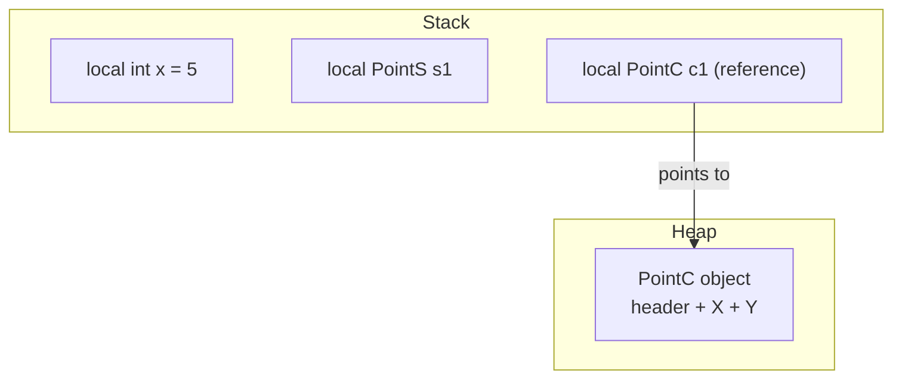

Every C# type is either a **value type** or a **reference type**, and that single fact drives how assignment, method calls and equality behave. Interviewers use this topic to check whether you actually understand the language or just write code that happens to work.

## The core distinction

A **value type** (`struct`, `enum`, numeric primitives) holds its data directly. A **reference type** (`class`, `interface`, `delegate`, array, `string`) holds a pointer to data allocated elsewhere. Assigning a value type **copies the bits**; assigning a reference type **copies the pointer**.

```csharp
struct PointS { public int X, Y; }
class PointC { public int X, Y; }

var s1 = new PointS { X = 1, Y = 2 };
var s2 = s1;              // full copy — independent
s2.X = 99;
Console.WriteLine(s1.X);  // 1 — unaffected

var c1 = new PointC { X = 1, Y = 2 };
var c2 = c1;               // same reference — aliases c1
c2.X = 99;
Console.WriteLine(c1.X);  // 99 — mutated through the alias
```

> [!KEY]
> Value type = copy the value. Reference type = copy the address. Every other behavior in this topic — mutation, `==`, boxing, passing to methods — follows from that one sentence.

## Where they live



`PointS` lives entirely on the stack as part of its containing frame. `c1` is a reference sitting on the stack, but the object it points to — with its object header, method table pointer and fields — lives on the heap. A struct **field inside a class** lives inline inside that object on the heap; it only sits on the stack when it is itself a local variable or parameter.

> [!WARNING]
> "Structs are on the stack, classes are on the heap" is the interview shorthand, but it is not the full rule. A struct captured in a lambda closure, boxed to `object`, stored as a field of a class, or held in an array of structs on the heap does **not** live on the stack. The stack/heap distinction is really about **storage location of the containing slot**, not the type itself.

## Passing to methods

By default, both value and reference types are passed **by value** — meaning the *variable's contents* are copied into the parameter. For a struct that's the whole data; for a class that's the reference (so the callee sees the same object, but reassigning the parameter itself doesn't affect the caller).

```csharp
void Mutate(PointS p) { p.X = 100; }        // copy — caller's struct is untouched
void MutateRef(ref PointS p) { p.X = 100; } // caller's struct changes

void Rename(PointC c) { c.X = 100; }        // mutates the shared object
void Replace(PointC c) { c = new PointC(); } // caller's reference is untouched

void ReplaceRef(ref PointC c) { c = new PointC(); } // caller's reference now points elsewhere
```

| Parameter modifier | Effect on value types | Effect on reference types |
|---|---|---|
| (none) | Copy of the struct passed | Copy of the reference passed; object is shared |
| `ref` | Caller's variable is aliased; writes visible | Caller's variable is aliased; reassignment visible |
| `out` | Must be assigned before returning | Must be assigned before returning |
| `in` | Passed by reference, read-only (avoids copy for large structs) | Rarely useful — already cheap to copy a reference |

## Equality: three different questions

| Check | What it compares | Default for class | Default for struct |
|---|---|---|---|
| `ReferenceEquals(a, b)` | Are they the same object in memory? | Identity | Always false for boxed structs unless same box |
| `Equals(object)` | Value equality if overridden, else identity for classes | Identity (unless overridden) | Field-by-field via reflection (slow) |
| `==` operator | Whatever the type defines; not polymorphic unless overloaded | Identity (unless operator overloaded) | Not defined unless the struct defines it |

```csharp
var p1 = new PointC { X = 1, Y = 2 };
var p2 = new PointC { X = 1, Y = 2 };
Console.WriteLine(p1 == p2);            // false — reference comparison, different objects
Console.WriteLine(p1.Equals(p2));       // false — Equals not overridden

record RPoint(int X, int Y);
var r1 = new RPoint(1, 2);
var r2 = new RPoint(1, 2);
Console.WriteLine(r1 == r2);            // true — record generates value equality
```

> [!TIP]
> A strong interview line: *"For structs, the default `Equals` uses reflection and is slow — I'd override `Equals`/`GetHashCode` or implement `IEquatable<T>` for anything performance-sensitive."*

## Nullable value types and defaults

Value types cannot normally be `null` because there is no reference to null out — `Nullable<T>` (`int?`) wraps a value type with a `HasValue` flag, effectively adding a byte or more of overhead and boxing it as either `null` or the boxed value when cast to `object`.

```csharp
int? maybe = null;
if (maybe.HasValue) Console.WriteLine(maybe.Value);
int fallback = maybe ?? -1;             // null-coalescing default

int i = default;          // 0
bool b = default;         // false
PointS p = default;       // all fields zeroed
PointC c = default;       // null
string s = default;       // null
```

## When to use a struct

Structs make sense when the type is small, immutable (or nearly so), short-lived, and semantically a "value" rather than an "entity" — `DateTime`, `Guid`, `TimeSpan`, and money/coordinate types are canonical examples.

| Favor a struct | Favor a class |
|---|---|
| Small (rule of thumb: ≤ 16–24 bytes) | Large or unbounded size |
| Immutable or logically a single value | Mutable, identity matters |
| Created and discarded frequently (avoid GC pressure) | Long-lived, shared, or referenced from many places |
| No inheritance needed (structs are sealed, implicitly) | Needs polymorphism / inheritance hierarchy |
| Copy semantics are the intent (e.g. a `Point`) | Reference/aliasing semantics are the intent (e.g. a `Connection`) |

> [!DANGER]
> A large mutable struct copied by value on every method call and every collection iteration (`foreach` over `List<BigStruct>`) can be *slower* than a class due to repeated copying — despite avoiding heap allocation. Measure before assuming "struct = fast."

## Records: reference types with value equality

`record` (a class by default; `record struct` for a value-type version) generates `Equals`, `GetHashCode`, `ToString`, and a `with` expression for non-destructive copies — while still being a reference type unless you say `record struct`.

```csharp
record Money(decimal Amount, string Currency);

var m1 = new Money(10m, "USD");
var m2 = m1 with { Amount = 20m };   // copies m1, changes one field
Console.WriteLine(m1 == m2);         // false — different Amount
Console.WriteLine(m1.Amount);        // 10 — m1 untouched, m2 is a new object
```

Records are the idiomatic modern choice for immutable data-carrying types (DTOs, value objects, message payloads) because you get value equality for free without hand-writing `Equals`/`GetHashCode`.

## Cheat sheet

- Value type = copy the data; reference type = copy the pointer.
- Default parameter passing is by value for *both* — for a class that copies the reference, not the object.
- `ref`/`out`/`in` change *how the variable itself* is passed, independent of value/reference type.
- `ReferenceEquals` = identity. `Equals`/`==` depend on overrides. Records override both to mean "same values".
- `int?` is `Nullable<int>`, a struct wrapping a flag + value — not a reference.
- `default` gives zero/false/null depending on the type's storage layout.
- Prefer structs for small, immutable, short-lived values; classes for identity, mutability, and polymorphism.
- Records give reference-type semantics for identity but value semantics for equality — read the type, not just the keyword, to know which you're dealing with.

## Common mistakes

| Mistake | Fix |
|---|---|
| Assuming `==` on classes compares field values | Override `Equals`/`GetHashCode` or use a `record` |
| Believing a `struct` can never live on the heap | It is copied into a heap object when boxed and can live inline inside a heap object, array, or closure |
| Passing a large struct by value in hot code paths | Pass with `in` or convert to a class/record |
| Mutating a struct returned from a property (`p.Location.X = 5`) | Struct properties return copies — this silently mutates a temporary and does nothing; C# actually blocks this for non-readonly properties as a compile error |
| Comparing boxed value types with `==` on `object` | Falls back to reference equality unless the underlying `Equals` is used |
| Forgetting `record` still allows `null` (it's a class) | Use `record struct` if you need a non-nullable value type with value equality |

## Summary

Value types copy their data; reference types copy a pointer to shared data — this single rule explains assignment, mutation-through-aliasing, and why structs feel "safer" to pass around. Equality has three distinct forms (`ReferenceEquals`, `Equals`, `==`), and only records give you sensible value equality out of the box. Choose structs for small immutable values you copy often, classes for entities with identity and behavior, and records when you want reference-type ergonomics with value-based equality.

## Top Interview Questions

### Q1. What is the fundamental difference between a value type and a reference type in C#?

A value type stores its data directly in the memory location associated with the variable — typically the stack frame, an array slot, or inline inside a containing object. A reference type variable stores a pointer to an object allocated separately (normally on the heap); the variable itself is just the address. This means assigning one value-type variable to another copies the entire value, producing two independent copies, while assigning one reference-type variable to another copies the pointer, so both variables alias the same underlying object. `struct`, `enum`, and built-in numerics are value types; `class`, `interface`, `delegate`, and arrays are reference types.

### Q2. If structs are value types, why do people say "structs go on the stack"? Is that always true?

It's a common oversimplification. A struct lives wherever its containing variable lives: a local struct variable is on the stack, but a struct that is a field of a class lives inline inside that class instance on the heap. A struct boxed to `object` or an interface is copied onto the heap inside a box. A struct captured by a lambda closure is promoted into a heap-allocated closure class. An array of structs (`PointS[]`) is one contiguous heap allocation containing all the struct data inline. So the accurate statement is: value types are stored **in place**, wherever that place happens to be — the stack is just the most common place for locals and parameters.

### Q3. What happens when you pass a struct to a method versus a class?

Both are passed by value by default, but "value" means something different for each. For a struct, the entire set of fields is copied into the parameter, so mutating the parameter inside the method has no effect on the caller's variable. For a class, the *reference* (the pointer) is copied — the parameter and the caller's variable now point at the same object, so mutating the object's fields through the parameter is visible to the caller. However, reassigning the parameter to a new object (`c = new Foo()`) only rebinds the local parameter, not the caller's variable — for that you need `ref`.

### Q4. Explain the difference between ReferenceEquals, Equals, and == in C#.

`ReferenceEquals(a, b)` always checks identity — are these literally the same object in memory — and cannot be overridden. `Equals(object)` is virtual on `object` and defaults to reference equality for classes, but is commonly overridden (as in records, `string`, or custom value objects) to compare contents instead. The `==` operator is not polymorphic by default; for classes it resolves at compile time to whatever operator is defined for the *static* type — reference equality unless overloaded — while for value types like `int` it is a built-in bitwise comparison, and structs get no `==` unless you define one. The trap: calling `Equals` through a base-class-typed variable can pick a different overload than calling it on the derived type directly, so virtual dispatch matters.

### Q5. Why does a record give you `==` that compares values, but a class does not?

The compiler auto-generates `Equals(object)`, `Equals(RecordType)`, `GetHashCode()`, and the `==`/`!=` operators for a record, all implemented to compare every public property/field for equality — this is "value equality" or "structural equality". A plain class gets none of this generated code; its inherited `Equals` from `object` and its `==` operator both default to reference identity, because the compiler has no way to know which fields constitute "the value" of an arbitrary class without you specifying it. This is precisely why DTOs and value objects are increasingly written as records — you get correct equality (and `GetHashCode`) without manually maintaining it, which is a common source of bugs when a class is later given a new field and someone forgets to update `Equals`.

### Q6. What is `Nullable<T>` and why can't you just assign `null` to an `int`?

Value types are, by design, guaranteed to always hold a value — there is no "null pointer" state to fall back to. `Nullable<T>` (`T?` for value types) is a struct that wraps a `T` value alongside a `bool HasValue` flag, giving value types an explicit way to represent "no value" without changing their fundamental non-nullable nature. Accessing `.Value` on a `Nullable<T>` with `HasValue == false` throws `InvalidOperationException`. When boxed to `object`, a `Nullable<T>` with no value boxes to an actual `null` reference (a special-cased compiler/runtime behavior), while one with a value boxes to a boxed `T`, not a boxed `Nullable<T>` — a subtle detail worth mentioning if it comes up.

### Q7. You have a large mutable struct that's being copied on every method call in a hot path. What would you do?

First, measure — struct copying is often not the actual bottleneck, and premature "fixes" can add complexity for no gain. If profiling confirms copying is expensive, options in order of preference: (1) pass it with `in` to avoid the copy while keeping value semantics for read-only access; (2) if mutation is genuinely required across calls, pass with `ref`; (3) reconsider whether the type should be a class or made immutable and smaller — a struct larger than roughly 16–24 bytes starts to lose the performance benefit over a class reference; (4) if it's part of a large array processed in a loop, consider a `Span<T>` over the array to avoid bounds-check and copy overhead. I'd also check whether the struct implements `IEquatable<T>` to avoid slow reflection-based `Equals`/`GetHashCode` if it's used as a dictionary key.

### Q8. What's the difference between `default(T)` for a class, a struct, and `int?`?

`default(T)` produces the "zero value" appropriate to the storage layout of `T`. For any reference type (a class, interface, delegate, array, or `string`), `default` is `null`. For a numeric value type it's the numeric zero (`0`, `0.0`, `0m`); for `bool` it's `false`; for `char` it's `'\0'`; for an arbitrary struct, every field is recursively set to its own default (so a struct of two ints defaults to both fields being 0). For `Nullable<T>` (`int?`), `default` is a `Nullable<T>` with `HasValue == false`, which compares equal to `null` via the compiler's special handling, even though it's a struct internally.

### Q9. You override `Equals` on a class but forget `GetHashCode`. What breaks?

`GetHashCode` and `Equals` have a contract: if two objects are equal according to `Equals`, they **must** return the same hash code. If you override only `Equals`, the inherited `GetHashCode` from `object` (identity-based) will usually produce different hash codes for two objects your `Equals` considers equal. This silently breaks any hash-based collection: `Dictionary<TKey, TValue>` lookups, `HashSet<T>.Contains`, and LINQ's `GroupBy`/`Distinct` all bucket by hash code first, then confirm with `Equals` only within a bucket — so two "equal" objects with different hash codes can end up in different buckets and never be found as duplicates. The compiler warns (`CS0659`) but does not stop you; always override both together, or use a `record`/`record struct` which generates both consistently.

### Q10. In production, when would choosing a `class` over a `record` or `struct` for a domain entity actually matter?

When identity matters more than value — for example, an `Order` entity tracked by Entity Framework, where two `Order` objects with identical field values but different database IDs must remain distinguishable, and where the object is mutated over its lifetime as state transitions occur (placed → shipped → delivered) with the same identity throughout. Using a `record` there would be actively wrong: its generated value equality would make two orders with the same current field values compare equal even if they represent different rows, and its `with`-expression-friendly immutability model fights against the ORM's change-tracking, which mutates instances in place. The rule of thumb I use: DTOs, value objects, and immutable messages → record; tracked, identity-bearing domain entities → class with an explicit identity-based `Equals` if needed (often just comparing the primary key).

### Q11. Does `in` on a parameter guarantee the struct won't be copied at all?

Not entirely — `in` passes the argument by reference (avoiding the copy of the struct's data into the parameter), but if the method calls any member that isn't marked `readonly` on a non-`readonly struct`, the compiler must make a **defensive copy** internally before calling it, because it cannot prove the member won't mutate the struct through the read-only reference. This defensive copying can silently negate the performance benefit `in` was meant to provide. The fix is to mark the struct itself `readonly struct` (or mark individual members `readonly`) so the compiler can prove no mutation is possible and skip the defensive copy — this is a good "I know the subtlety" answer in a performance-focused interview.

### Q12. Why can a boxed struct behave surprisingly with `ReferenceEquals`?

Boxing copies a value type's data into a new object on the heap, and every boxing operation creates a **new box**, even from the same struct value. So `ReferenceEquals(box1, box2)` for two separately boxed copies of an equal struct value returns `false`, because they are two distinct heap objects, even though `box1.Equals(box2)` (using the struct's value-based `Equals`) can return `true`. This trips people up when storing structs in an `object[]` or passing them through non-generic APIs like old-style `ArrayList` — every access can implicitly box again, producing yet another distinct object, which is also why boxing in loops is a classic hidden-allocation performance trap.
