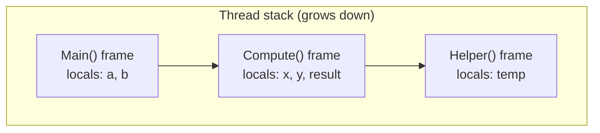
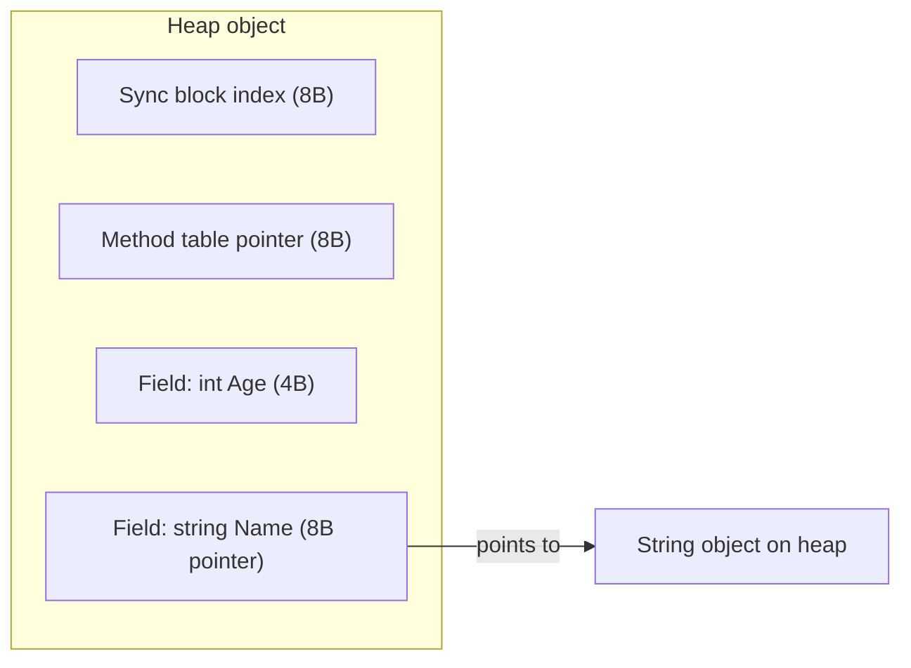

Interviewers use "where does this live in memory" questions to separate people who memorized "structs are stack, classes are heap" from people who understand allocation. This page builds the accurate mental model: stack frames, heap objects, boxing, and the tools (`Span<T>`, `stackalloc`, `ref` returns) that let you control allocation deliberately.

## The stack

The stack is a contiguous, per-thread region of memory that grows and shrinks as methods are called and return. Each method call pushes a **stack frame** holding local variables, parameters, and the return address. Frames are freed automatically the instant the method returns — no garbage collector involved, which makes the stack extremely cheap.



A value type local, a reference-type local's *pointer*, and method parameters all live in the frame. Default stack size per thread is **1 MB** on Windows for a typical .NET thread — deep or unbounded recursion overflows it with a fatal `StackOverflowException` that **cannot be caught**.

## The heap and object headers

The heap is a larger, shared region managed by the garbage collector (GC). Every reference-type instance allocated there carries a fixed **object header** overhead before its fields even start.

| Component | Size (64-bit) | Purpose |
|---|---|---|
| Sync block index | 8 bytes | Locking (`lock`), hash code cache |
| Type object pointer (method table) | 8 bytes | Identifies the runtime type, vtable |
| Fields | varies | Actual instance data, padded for alignment |

So a class with a single `int` field still costs at least 24 bytes (16-byte header + 4 bytes + alignment padding) — versus a struct with the same field costing exactly 4 bytes inline. This overhead is why wrapping millions of small values in classes (instead of structs or primitive arrays) meaningfully increases memory pressure and GC pause frequency.

> [!KEY]
> The stack is free and automatic; the heap costs an allocation, a header, and eventually a GC pass to reclaim. Every performance-sensitive answer about memory comes back to "does this avoid an unnecessary heap allocation."

## Boxing: the classic hidden allocation

Boxing wraps a value type in a heap object so it can be treated as `object` or an interface type; unboxing extracts it back. Boxing is implicit and easy to miss.

```csharp
int i = 42;
object boxed = i;              // boxing — heap allocation, i is copied into a new object
int back = (int)boxed;         // unboxing — copies the value back out

// Hidden boxing in a loop — allocates once per iteration
ArrayList list = new ArrayList();
for (int n = 0; n < 1000; n++)
    list.Add(n);                // each int boxed before being stored as object

// No boxing — List<int> stores ints inline
var typed = new List<int>();
for (int n = 0; n < 1000; n++)
    typed.Add(n);
```

> [!DANGER]
> Boxing is a top interview trap: string interpolation/concatenation with a struct argument, `Console.WriteLine("{0}", someStruct)` through a non-generic overload, storing structs in non-generic collections (`ArrayList`, `Hashtable`), and calling a non-overridden `ToString()`/`Equals()` through `object` can all box silently. Generic collections (`List<T>`, `Dictionary<K,V>`) avoid this entirely for value-type type arguments.

## Ref locals and ref returns

C# 7+ allows a local variable or a return value to be an actual **alias** to storage (an array element or a field) rather than a copy — useful for avoiding copies of large structs.

```csharp
int[] numbers = { 1, 2, 3 };
ref int r = ref numbers[1];   // alias, not a copy
r = 99;
Console.WriteLine(numbers[1]); // 99

ref int Find(int[] arr, int target)
{
    for (int i = 0; i < arr.Length; i++)
        if (arr[i] == target) return ref arr[i]; // return an alias into the array
    throw new InvalidOperationException();
}

ref int found = ref Find(numbers, 99);
found = 100;                    // mutates numbers[1] directly, no copy
```

## Span\<T\> and stackalloc

`Span<T>` is a `ref struct` — a value type that can point at contiguous memory (an array, a string, or unmanaged/stack memory) without copying it and without allocating on the heap. Because it can hold a pointer to stack memory, a `Span<T>` is restricted to living entirely on the stack itself: it cannot be a field of a class, boxed, or captured in a lambda closure.

```csharp
Span<int> stackBuffer = stackalloc int[4];   // allocated directly on the stack, no GC involved
stackBuffer[0] = 10;

int[] source = { 1, 2, 3, 4, 5 };
Span<int> slice = source.AsSpan(1, 3);       // view over indices 1..3, zero copy
slice[0] = 99;
Console.WriteLine(source[1]);                 // 99 — slice aliases the same memory

string text = "hello world";
ReadOnlySpan<char> word = text.AsSpan(6, 5);  // "world" without allocating a substring
```

`stackalloc` is dangerous with large or unbounded sizes — it can overflow the 1 MB stack just like deep recursion, so it is normally reserved for small, bounded buffers.

## Strings: immutability, interning and StringBuilder

`string` is a **reference type that behaves like a value**: every instance is immutable, so any operation that appears to modify a string allocates a brand new one on the heap and leaves the original for the garbage collector. This is the single most common accidental-allocation source in .NET code.

```csharp
// O(n^2) — each += allocates a new string and copies everything before it.
var s = "";
foreach (var part in parts) s += part;          // 10,000 parts -> ~50M chars copied

// O(n) — one growable buffer, one final allocation.
var sb = new StringBuilder();
foreach (var part in parts) sb.Append(part);
var result = sb.ToString();
```

The crossover is lower than people expect: for a handful of concatenations the compiler rewrites `a + b + c` into a single `String.Concat` call and `StringBuilder` is pure overhead. Reach for `StringBuilder` when the count is **unbounded or loop-driven**, not when it is a fixed three pieces.

**Interning** is a runtime-wide table of unique string instances. Compile-time literals are interned automatically, which is why reference equality can surprise you:

```csharp
var a = "hello";
var b = "hello";
Console.WriteLine(ReferenceEquals(a, b));          // True  - same interned literal
var c = new string(['h','e','l','l','o']);
Console.WriteLine(ReferenceEquals(a, c));          // False - built at runtime
Console.WriteLine(a == c);                         // True  - == compares content
Console.WriteLine(ReferenceEquals(a, string.Intern(c)));  // True - forced into the pool
```

| Operation | Allocates | Notes |
|---|---|---|
| `s1 + s2` (few, fixed) | One result | Compiler folds into `String.Concat` |
| `+=` inside a loop | One per iteration | `O(n^2)` total copying — the classic bug |
| `StringBuilder.Append` | Amortised, buffer doubles | `O(n)` total; pre-size with the capacity ctor if you know the length |
| `Substring` | New string | Use `AsSpan().Slice()` to avoid the copy when you only read |
| `string.Intern` | Nothing new | Pins the string for the process lifetime — a leak if you intern user input |

> [!WARNING]
> `string.Intern` puts the string in a table that lives as long as the process and is **never** collected. Interning user-supplied or high-cardinality values is a slow memory leak. This is a favourite follow-up once a candidate mentions interning.

> [!TIP]
> For parsing and slicing hot paths, `ReadOnlySpan<char>` over the existing string gives you substring semantics with **zero allocation**, because a span is a view rather than a copy. Naming that trade-off is what separates a senior answer from "use StringBuilder".

## The Large Object Heap

Objects **85,000 bytes or larger** are allocated on the **Large Object Heap (LOH)** instead of the normal generational heap. The LOH is collected only during a full (Gen 2) collection and, historically, was never compacted by default — meaning repeated allocation/deallocation of large arrays could fragment it. Since .NET Core, the LOH *can* be compacted on demand (`GCSettings.LargeObjectHeapCompactionMode`), but it is still comparatively expensive to collect.

| Generation | What lives there | Collected how often |
|---|---|---|
| Gen 0 | Newly allocated small objects | Very frequently, very fast |
| Gen 1 | Objects that survived one Gen 0 collection | Less frequently |
| Gen 2 | Long-lived objects | Rarely, most expensive |
| LOH | Objects ≥ 85,000 bytes | Collected with Gen 2 |

> [!TIP]
> A senior answer: *"Large arrays or buffers — think image data or big string builders — end up on the LOH. I'd pool them with `ArrayPool<T>` instead of allocating fresh each time, to avoid LOH fragmentation and GC pressure."*

## Memory layout of a class instance



Reference-type fields inside an object are themselves just pointers to other heap objects — a `Person` object doesn't contain its `Name` string's characters inline, it contains a pointer to a separate `string` object.

## Closures escape to the heap

A lambda or local function that captures a local variable forces the compiler to move that variable (and any others captured alongside it) into a compiler-generated class instance on the heap — even if the variable would otherwise have been a simple stack int.

```csharp
Func<int> MakeCounter()
{
    int count = 0;                 // would normally be a stack local
    return () => ++count;          // captured — compiler promotes it into a heap-allocated closure object
}

var counter = MakeCounter();
Console.WriteLine(counter());      // 1
Console.WriteLine(counter());      // 2 — count survived after MakeCounter returned
```

This is why the stack/heap rule of thumb breaks down: `count` looks like an ordinary `int` local, but because a delegate outlives the method call and needs to keep referencing it, it must live on the heap.

## Cheat sheet

- Stack = per-thread, LIFO, freed automatically on method return, ~1 MB default size.
- Heap = shared, GC-managed, every object has an 8+8 byte header before fields.
- Boxing turns a value type into a heap object; watch for it in non-generic collections, interpolation, and interface casts.
- `ref` locals/returns alias existing storage instead of copying.
- `Span<T>` is a `ref struct` — zero-copy views over arrays/strings/stack memory, but can never live on the heap itself.
- `stackalloc` allocates directly on the stack — fast, but unbounded/large sizes risk stack overflow.
- Objects ≥ 85,000 bytes go to the Large Object Heap, collected only on Gen 2 passes.
- Capturing a local in a lambda/local function can force it onto the heap via a compiler-generated closure class.
- "Structs are stack, classes are heap" is a useful default, not an absolute law — always check what actually contains the value.

## Common mistakes

| Mistake | Fix |
|---|---|
| Assuming a struct never allocates | It allocates when boxed, captured in a closure, or stored in a heap object |
| Using `ArrayList`/`Hashtable` with value types | Use generic `List<T>`/`Dictionary<K,V>` to avoid boxing |
| Allocating large arrays repeatedly in a hot loop | Use `ArrayPool<T>.Shared` to rent/return buffers |
| Returning a `Span<T>` from a method that wraps a `stackalloc` buffer | The stack memory is invalid once the method returns — use `Span<T>` only within the same call frame, or allocate on the heap instead |
| Ignoring that recursion depth counts against the 1 MB stack | Convert deep recursion to iteration or increase thread stack size deliberately |
| Believing GC pauses are eliminated by using `struct` everywhere | Excess struct copying has its own cost; the goal is fewer *unnecessary* allocations, not zero heap usage |

## Summary

The stack is cheap, automatic, per-thread storage for frames and locals; the heap is GC-managed shared storage that carries per-object header overhead and needs collection passes to reclaim. Boxing, closures, and large allocations are the three classic ways a value silently ends up on the heap when it looks like it shouldn't. Modern C# gives you `Span<T>`, `stackalloc`, and `ref` returns specifically to opt back into stack-based, zero-copy behavior when profiling shows the heap is the bottleneck.

## Top Interview Questions

### Q1. What is stored on the stack versus the heap in a typical .NET program?

The stack holds per-thread method-call frames: local variables of value types, parameters, and the return address for each active call — all freed automatically the instant a method returns. The heap holds objects: every `class` instance, every array, every boxed value type, and any object a reference-type variable points to. A local variable of reference type itself (the pointer) sits on the stack, but what it points to sits on the heap. The important nuance is that value types don't always live on the stack — a struct field inside a class instance is stored inline as part of that heap object, and a struct captured by a closure or stored in an array is likewise part of whatever container holds it.

### Q2. What is boxing, and why is it expensive?

Boxing is the implicit conversion of a value type to `object` (or to an interface it implements), which requires allocating a new object on the heap, copying the value type's bits into it, and prefixing it with the standard object header (sync block + method table pointer, 16 bytes on 64-bit). It's expensive for two reasons: the allocation itself has a cost and adds GC pressure, and it happens **silently** — passing an `int` to a method expecting `object`, storing structs in `ArrayList`, or calling a virtual method inherited from `object` on an unboxed struct value can all trigger it without any visible cast in the code. The fix is almost always generics: `List<int>` stores ints inline with no boxing, whereas `ArrayList` boxes every element.

### Q3. Explain `ref` locals and `ref` returns. When would you use them?

Normally, assigning a value-type variable to another, or returning a value type from a method, copies the value. A `ref` local (`ref int r = ref array[i];`) or `ref return` (`ref int Find(...) { return ref array[i]; }`) instead creates an alias directly to the original storage location — no copy occurs, and writes through the alias mutate the original. This matters for performance-sensitive code working with large structs in arrays: instead of copying a big struct out, mutating it, and copying it back, you get a direct reference to the array slot and mutate in place. It's a niche but real feature in high-performance C# code, notably used inside `Span<T>` indexers and numeric/game libraries.

### Q4. What is `Span<T>` and why is it declared as a `ref struct`?

`Span<T>` is a lightweight, stack-only view over a contiguous block of memory — it can wrap an array, a string's characters, or a `stackalloc` buffer — without copying that memory or allocating anything on the heap for the data itself. It's declared as a `ref struct` specifically so the compiler can enforce that it **never** escapes to the heap: it cannot be boxed, cannot be a field of an ordinary class, cannot be captured by a lambda closure, and cannot be used across `await` boundaries. This restriction exists because a `Span<T>` may internally hold a raw pointer to stack memory (from `stackalloc`); if it escaped onto the heap and outlived its stack frame, that pointer would become invalid ("dangling"), causing memory corruption — the `ref struct` restriction is the compiler's way of making that class of bug impossible.

### Q5. What is the Large Object Heap and why does it matter for performance?

Any object 85,000 bytes or larger — typically large arrays, big strings, or sizeable buffers — is allocated on a separate heap segment called the Large Object Heap (LOH) instead of the normal small-object generational heap. The LOH is only swept during a full Gen 2 collection, which is the most expensive kind of GC pause, and historically was not compacted by default, so repeatedly allocating and discarding large arrays could fragment it and cause `OutOfMemoryException` even when total free memory looked sufficient. In production, the standard fix is to pool large buffers with `ArrayPool<T>.Shared` (rent, use, return) instead of allocating fresh arrays each time, and, if fragmentation is already a problem, to opt into on-demand LOH compaction via `GCSettings.LargeObjectHeapCompactionMode`.

### Q6. A lambda captures a local `int` variable declared inside a method. Where does that variable actually live, and why?

Even though it looks like a normal stack-based local, once a lambda (or local function) captures it, the compiler must promote it into a field of a compiler-generated class allocated on the heap. This happens because the delegate created from the lambda can outlive the method call that created it — if `count` stayed on the stack, the closure would reference invalid memory the moment the enclosing method returned. The compiler handles this transparently: all variables captured together by the same set of lambdas are grouped into one generated "display class" instance, and every capturing lambda becomes a method on that instance operating on its fields instead of true stack locals. This is a common gotcha in loop bodies, where capturing the loop variable by reference across iterations produced the well-known "closure captures the same variable, not a snapshot" bug in older C#.

### Q7. Why can deep recursion cause a StackOverflowException, and why is that different from an OutOfMemoryException?

Each recursive call pushes a new stack frame containing its parameters, locals, and return address; the stack is a fixed-size region (1 MB by default per thread on Windows), so sufficiently deep recursion exhausts it. `StackOverflowException` is special in .NET: unlike almost every other exception, it **cannot be caught** by any try/catch — the CLR considers the process's memory state potentially corrupted and terminates it immediately, because unwinding further stack frames to run `catch`/`finally` blocks would itself require stack space that may not be available. `OutOfMemoryException`, by contrast, is a heap allocation failure (the GC couldn't find or grow enough memory) and *can* be caught, because the stack is unaffected. In production, unbounded or attacker-controlled recursion depth (e.g. parsing deeply nested JSON) is a real denial-of-service vector, which is why parsers often cap recursion depth explicitly or convert to an iterative algorithm with an explicit stack on the heap.

### Q8. You're processing a large text file and building substrings in a loop. How do you avoid excessive allocations?

Repeated `Substring()` calls allocate a new `string` on the heap for every slice, and processing a large file line-by-line or token-by-token this way generates significant GC pressure. The fix is `ReadOnlySpan<char>` (or `ReadOnlyMemory<char>` if the slices need to be stored beyond the current stack frame, since `Span<T>` can't be a field): `text.AsSpan(start, length)` gives a zero-allocation view over the existing string's backing memory instead of copying characters into a new object. Combined with `Span<T>`-based APIs like `int.TryParse(ReadOnlySpan<char>, ...)`, you can parse and process large inputs with effectively zero string allocations per token, which is a common technique in high-throughput parsers and the reason modern .NET string/number APIs have span-based overloads everywhere.

### Q9. What's the object header overhead, and why does it matter when choosing between a class and a struct for many small instances?

Every heap object carries a fixed 16 bytes of overhead on 64-bit .NET before its fields even begin: an 8-byte sync block index (used for `lock` and identity hash caching) and an 8-byte method table pointer (identifying the runtime type). For a class wrapping a single 4-byte `int`, that means at least 20 bytes are consumed (rounded up to 24 for alignment) versus 4 bytes for the same data stored as a struct field inline in an array. At scale — say, a million small "point" or "tick" objects in a simulation or a hot data pipeline — that overhead alone can multiply memory usage several times over and directly increases GC scan time, since the collector has to traverse every live object's header and fields during a collection. This is the concrete, quantifiable reason "use a struct for small, high-volume value data" is more than a style preference.

### Q10. In a production service, you notice frequent Gen 2 and LOH collections causing latency spikes. What would you investigate?

I'd start by capturing GC statistics (via `dotnet-counters`, `dotnet-trace`, or the `GC.CollectionCount`/`GC.GetTotalMemory` APIs) to confirm which generation is triggering and how often, then look for the two usual causes: objects being promoted to Gen 2 unnecessarily (often because they're held alive longer than needed — e.g. cached but never evicted, or referenced from a static collection) and large, short-lived allocations landing on the LOH (buffers, big arrays, or large strings created per-request). Fixes typically include pooling large buffers with `ArrayPool<T>`, reviewing caches for unbounded growth or missing expiration, replacing large per-request allocations with `Span<T>`/`Memory<T>`-based processing, and checking for accidental object retention through unremoved event handler subscriptions (a classic memory-leak pattern). I'd also check whether server or workstation GC mode and concurrent/background GC settings are appropriate for the workload, since that alone can significantly change pause characteristics without any code change.

### Q11. How does `stackalloc` differ from a normal array allocation, and what's the risk?

`int[] arr = new int[100]` allocates on the managed heap and is tracked by the GC; `Span<int> buf = stackalloc int[100]` allocates directly on the current method's stack frame, with no heap allocation and no GC involvement at all — the memory is reclaimed automatically (and instantly) when the method returns, exactly like any other local variable. The risk is twofold: first, the stack is small and fixed (1 MB by default), so a large or attacker-controlled `stackalloc` size can overflow it, which the runtime cannot always guard against as gracefully as heap `OutOfMemoryException`s; second, because it's stack memory, the `Span<T>` wrapping it must never be returned from the method or stored somewhere that outlives the current call, which is exactly why `Span<T>` is a `ref struct` — the compiler enforces that restriction at compile time so this class of bug can't happen silently.

### Q12. Why does the phrase "structs avoid garbage collection" oversell what structs actually do?

Structs avoid *heap allocation for the value itself* only when the storage location is not on the heap — for example, a local variable, a parameter, a `stackalloc` buffer, or a field inside another stack-resident struct. The moment a struct is boxed (assigned to `object`/an interface), stored in a heap array, stored as a field of a class, or captured in a closure, it becomes part of a heap allocation and is subject to GC reachability just the same. Additionally, using structs doesn't eliminate all cost: large structs copied repeatedly by value (through method calls, `foreach` iteration, or array reads) can cost more in raw CPU time from copying than a class reference would, even though no extra object allocation occurs. The accurate, senior framing is "structs avoid *an extra, independent* heap allocation for the value itself" — not "structs make garbage collection go away."
