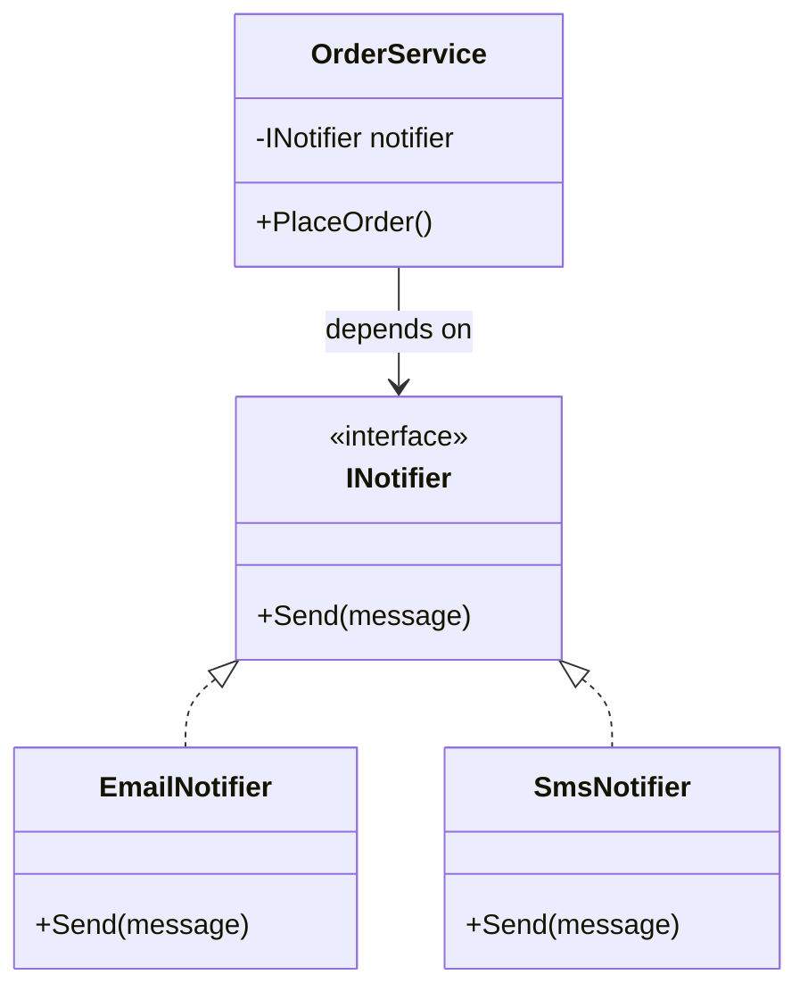

"Interface or abstract class?" is one of the oldest interview questions in the book, and it still matters because the answer shapes how testable, extensible, and coupled your codebase becomes. This page covers the mechanics, the controversial newer features, and the design judgment interviewers actually want to hear.

## Interface vs abstract class

| Aspect | Interface | Abstract class |
|---|---|---|
| Instantiable | Never | Never |
| Members | Methods, properties, events, indexers; can have default implementations (C# 8+) | Any member; can mix abstract and concrete |
| Fields | Not allowed (only static in newer C#) | Allowed |
| Constructors | None | Yes — run when a derived class is constructed |
| Multiple inheritance | A class can implement many interfaces | A class can inherit only one base class |
| Access modifiers on members | Implicitly public (unless explicit implementation) | Any access modifier |
| Versioning | Adding a member breaks all implementers (unless given a default body) | Adding a concrete method is backward compatible |
| Typical use | Contract/capability ("can do X") | Shared implementation across a family of related types |

> [!KEY]
> Interfaces answer "what can this type **do**?" (a capability, a contract). Abstract classes answer "what **is** this type, and what does it share with its siblings?" (an identity, a partial implementation). Reach for an interface first; reach for an abstract class only when you have real shared code to put in the base.

## Multiple inheritance of behavior

C# forbids multiple class inheritance to avoid the "diamond problem" (ambiguity when two base classes define the same member), but a class can implement any number of interfaces — giving you multiple inheritance of *contract*, and since C# 8, partial multiple inheritance of *behavior* via default interface methods.

```csharp
interface IFlyable { void Fly(); }
interface ISwimmable { void Swim(); }

class Duck : IFlyable, ISwimmable   // "multiple inheritance" of capability
{
    public void Fly() => Console.WriteLine("Flying");
    public void Swim() => Console.WriteLine("Swimming");
}
```

## Default interface methods — and why they're controversial

```csharp
interface ILogger
{
    void Log(string message);

    // Default implementation — existing implementers don't break when this is added
    void LogError(string message) => Log($"ERROR: {message}");
}

class ConsoleLogger : ILogger
{
    public void Log(string message) => Console.WriteLine(message);
    // LogError is inherited from the interface's default — no override needed
}
```

Default interface methods (DIMs, C# 8+) let you add a method to a widely-implemented interface without breaking every existing implementation — solving a real API-versioning pain point. The controversy: they blur the interface/abstract-class line, they reintroduce diamond-problem-style ambiguity (two interfaces providing conflicting defaults must be resolved explicitly by the implementing class), and calling a DIM requires the *static* type to be the interface — calling it through a class-typed reference silently uses the class's own override resolution rules, which can surprise readers expecting virtual-style dispatch.

> [!WARNING]
> A default interface method is **not** invoked polymorphically the way a class's virtual method is if a derived interface re-declares it. Mixing DIMs with multiple interface inheritance is a real source of subtle bugs — most style guides recommend keeping DIMs to simple, unambiguous helper methods, not core business logic.

## Explicit interface implementation

Used when a class implements two interfaces with a colliding member name, or when you want a member accessible only through the interface type, not the concrete class.

```csharp
interface IEnglishGreeter { string Greet(); }
interface IFrenchGreeter { string Greet(); }

class Bilingual : IEnglishGreeter, IFrenchGreeter
{
    string IEnglishGreeter.Greet() => "Hello";
    string IFrenchGreeter.Greet() => "Bonjour";
}

var b = new Bilingual();
// b.Greet();                     // compile error — not accessible on the concrete type
Console.WriteLine(((IEnglishGreeter)b).Greet()); // "Hello"
```

## Abstract vs virtual vs sealed

| Modifier | On a method means | Can override? | Can call base implementation? |
|---|---|---|---|
| `abstract` | No implementation here; derived class **must** provide one | Yes (mandatory) | No (there is none) |
| `virtual` | Default implementation provided; derived classes may replace it | Yes (optional) | Yes, via `base.Method()` |
| `override` | Replaces a `virtual`/`abstract` member from the base | — | Yes, via `base.Method()` |
| `sealed override` | Replaces a base member and forbids any further overriding | No (stops the chain) | Yes |
| (no modifier, non-virtual) | Fixed implementation | No — hides, doesn't override, if redeclared with `new` | N/A |

```csharp
abstract class Shape
{
    public abstract double Area();                 // must be implemented
    public virtual string Describe() => $"Shape with area {Area()}"; // may be overridden
}

class Circle : Shape
{
    public double Radius { get; init; }
    public override double Area() => Math.PI * Radius * Radius;
    public sealed override string Describe() => $"Circle: {base.Describe()}"; // no further overrides allowed
}
```

## Composition over inheritance



`OrderService` depends on the `INotifier` **abstraction**, not a concrete class — the concrete implementation is injected (constructor injection), so swapping `EmailNotifier` for `SmsNotifier` requires zero changes to `OrderService`, and tests can inject a mock/fake `INotifier`. This is the essence of the Dependency Inversion Principle and why "prefer composition over inheritance" is standard guidance: inheritance couples a subclass tightly to its base's implementation details and can break with base-class changes (the fragile base class problem), while composition through an interface keeps the dependency swappable and the relationship explicit.

> [!TIP]
> A senior answer to "why prefer composition": *"Inheritance is the tightest form of coupling in OOP short of literally copying code — a subclass depends on its base's implementation, not just its contract. Composition through an interface only depends on the contract, which is easier to test, mock, and swap."*

## Interface segregation and testability

A "fat" interface with many members forces every implementer (including test doubles) to implement methods they don't need. The Interface Segregation Principle says: split it into small, focused interfaces so clients depend only on what they use.

```csharp
// Before — fat interface
interface IRepository<T> { T Get(int id); void Save(T item); void Delete(int id); void Backup(); }

// After — segregated
interface IReadRepository<T> { T Get(int id); }
interface IWriteRepository<T> { void Save(T item); void Delete(int id); }
```

Smaller interfaces are dramatically easier to mock in unit tests (a mocking framework or a hand-written fake needs fewer members), and they make dependencies more honest — a class depending only on `IReadRepository<T>` visibly cannot delete anything, which is valuable at a glance during code review.

## Common framework interfaces

| Interface | Purpose | Key member(s) |
|---|---|---|
| `IEnumerable<T>` | Supports `foreach` iteration | `GetEnumerator()` |
| `IComparable<T>` | Defines a natural sort order | `CompareTo(T other)` |
| `IEquatable<T>` | Strongly-typed equality, avoids boxing vs `object.Equals` | `Equals(T other)` |
| `IDisposable` | Deterministic release of unmanaged/scarce resources | `Dispose()` — pairs with `using` |
| `IComparer<T>` / `IEqualityComparer<T>` | Pluggable external comparison logic (not on the type itself) | `Compare`, `Equals`/`GetHashCode` |
| `INotifyPropertyChanged` | UI/data-binding change notification | `PropertyChanged` event |

> [!NOTE]
> Implementing `IEquatable<T>` alongside overriding `Equals(object)` avoids boxing for value types and avoids a virtual dispatch + type-check for reference types — most collections (`List<T>.Contains`, `Dictionary<K,V>`) prefer `IEquatable<T>.Equals` when available.

## Cheat sheet

- Interface = contract/capability, no state, multiple per class. Abstract class = partial identity + shared implementation, one per class.
- A class can implement unlimited interfaces but inherit only one base class.
- Default interface methods let you extend an interface without breaking implementers — use sparingly, dispatch is not fully virtual-like.
- `abstract` = must override, no body. `virtual` = optional override, has a body. `sealed override` = stops further overriding.
- Explicit interface implementation resolves member-name collisions and hides a member from the concrete type.
- Prefer composition + small interfaces for testability; inject dependencies rather than inheriting to reuse code.
- Interface Segregation: many small interfaces beat one fat interface, especially for mocking.
- `IEquatable<T>` avoids the cost of `object.Equals` boxing/virtual dispatch — implement it for value types used in collections.

## Common mistakes

| Mistake | Fix |
|---|---|
| Using inheritance purely for code reuse with no real IS-A relationship | Use composition — inject a helper/service instead |
| Adding a member to a widely-used interface without a default body | Provide a default interface method, or introduce a new interface instead |
| Assuming a `sealed override` method can itself be overridden further down | `sealed` on an override explicitly forbids that — check the hierarchy |
| Building one large "God interface" for a whole subsystem | Split by client need (Interface Segregation Principle) |
| Forgetting explicit interface implementation hides members from the concrete type | Cast to the interface type to access them, or don't use explicit implementation unless there's a real collision |
| Overriding `Equals(object)` without also implementing `IEquatable<T>` | Add `IEquatable<T>` for value types and hot collection paths to avoid boxing |

## Summary

Interfaces describe what a type can do and support multiple inheritance of contract (and, cautiously, of default behavior); abstract classes describe what a type fundamentally is and let you share real implementation across a family of subclasses, at the cost of single inheritance. Default interface methods solve API versioning but introduce dispatch subtleties worth knowing. In practice, senior C# design favors small, focused interfaces injected via composition over deep inheritance hierarchies, because it keeps dependencies explicit, swappable, and easy to mock in tests.

## Top Interview Questions

### Q1. What is the core difference between an interface and an abstract class, and when would you choose each?

An interface defines a pure contract — a set of members a type promises to provide — with no state and, traditionally, no implementation, and a class can implement any number of interfaces. An abstract class can hold state (fields), constructors, and a mix of abstract and fully-implemented members, but a class can inherit from only one. Choose an interface when you're describing a capability that unrelated types might share (`IDisposable`, `IComparable`) — it maximizes flexibility and multiple-implementation. Choose an abstract class when you have a genuine family of related types that share real, non-trivial implementation and state, and you want to force a consistent structure (a template method pattern, for instance) while still leaving specific steps to be filled in by subclasses.

### Q2. Why can't a C# class inherit from more than one class, but it can implement multiple interfaces?

This avoids the "diamond problem": if two base classes both defined a field or a concrete method with the same name, the compiler (and the runtime layout) would have no unambiguous way to decide which one a derived instance uses, and language designers who allow it (like C++) require complex disambiguation rules that are a well-known source of bugs. Interfaces avoid this because, traditionally, they carried no state and no implementation — there was nothing to conflict over beyond a method signature, and name collisions between two interfaces are resolved cleanly via explicit interface implementation. Since C# 8 introduced default interface methods, true behavioral conflicts *can* occur between two interfaces, but the language requires the implementing class to explicitly resolve the ambiguity rather than silently picking one — preserving the "no silent ambiguity" guarantee that made multiple interface implementation safe in the first place.

### Q3. What are default interface methods and why are they considered controversial?

Default interface methods (C# 8+) let an interface provide a method body directly, so adding a new member to a widely-implemented interface doesn't break every existing implementer — they simply inherit the default unless they choose to override it. This solves a real, painful API-versioning problem (famously the reason Java added the same feature) — before this, adding any member to a public interface was a breaking change for every consumer. The controversy is that it blurs the traditional "interfaces are pure contracts, abstract classes carry implementation" distinction that many C# developers built their mental model around, it can reintroduce diamond-problem-style conflicts between two interfaces' defaults (requiring explicit resolution), and dispatch is more subtle than virtual methods — calling a member through a variable typed as the concrete class versus typed as the interface can resolve differently, which trips up people expecting uniform polymorphic behavior.

### Q4. Explain the difference between `virtual`, `override`, `abstract`, and `sealed` in the context of method overriding.

`virtual` marks a method in a base class as having a default implementation that derived classes *may* replace; `abstract` marks a method with no implementation at all that derived classes *must* provide, and can only appear in an abstract class. `override` is used on the derived class's method to explicitly replace a `virtual` or `abstract` base member, participating in the same polymorphic dispatch chain. `sealed`, when applied to an `override`, stops that chain — no further subclass can override that member again — which is useful when you want to guarantee a specific step in an inheritance hierarchy can never be changed further down, often for correctness or security reasons (e.g. sealing a validation method so a deep subclass can't bypass it).

### Q5. What is explicit interface implementation, and give a scenario where you'd need it.

Explicit interface implementation (`ReturnType InterfaceName.MemberName(...)`) implements an interface member such that it is callable only through a reference typed as that interface, not through the concrete class type directly. The classic scenario is when a class implements two interfaces that happen to declare a member with the same name and signature — say `IEnglishGreeter.Greet()` and `IFrenchGreeter.Greet()` — the class cannot provide two ordinary public `Greet()` methods with identical signatures, so it implements each explicitly, and callers must cast to the specific interface to choose which one they want. It's also used deliberately to "hide" a member from a class's primary public surface — for example, implementing `IDisposable.Dispose()` explicitly on a type that offers a more specific `Close()` method instead, nudging callers toward the more meaningful API while still satisfying the interface contract for `using` statements.

### Q6. What does `sealed` mean when applied to a class versus a method?

On a class, `sealed` prevents any other class from inheriting from it at all — useful for types that were never designed to be extended safely (utility classes, or performance-critical types where the JIT can devirtualize calls more aggressively when it knows no subclass exists), and it's also why `record` types are implicitly easy to seal for the same reasons. On a method, `sealed` can only appear together with `override`, and it stops that *specific member* from being overridden any further down the hierarchy, while the rest of the class remains open for extension. A practical case: a base class defines a `virtual` `Validate()` template method that subclasses may customize, but one subclass seals its override to guarantee a security-critical check it adds can never be silently removed by a further subclass.

### Q7. What is the relationship between `IDisposable` and the `using` statement, and why does it matter for interfaces specifically?

`IDisposable` is the standard interface (a single `Dispose()` method) for deterministic cleanup of unmanaged or scarce resources — file handles, database connections, network sockets — that the garbage collector cannot reliably reclaim in a timely manner since it only tracks managed memory pressure, not external resources. The `using` statement (or `using` declaration) is compiler sugar that guarantees `Dispose()` is called even if an exception is thrown, by lowering to a `try`/`finally` block. This matters as an interface design lesson: `IDisposable` is a great example of a minimal, single-purpose interface — it says nothing about *what* is being disposed, only that cleanup is needed, which is exactly why it can be implemented uniformly across totally unrelated types (streams, HTTP clients, DB contexts) and consumed generically by any code that just calls `using`.

### Q8. What's the difference between `IComparable<T>` and `IComparer<T>`, and when would you use each?

`IComparable<T>` is implemented **by the type itself** to define its single, natural/default sort order (`CompareTo`) — for example, a `Money` type might implement it to sort ascending by amount. `IComparer<T>` is a **separate, pluggable** object passed *into* a sorting or collection API (`List<T>.Sort(IComparer<T>)`, `SortedSet<T>`) to define an alternative or external ordering without modifying the type itself — useful when you need multiple different sort orders for the same type (ascending vs descending, by name vs by date) or when you don't own the type's source code and can't add `IComparable<T>` to it. The interview-relevant point: `IComparable<T>` answers "what is this type's one true order," `IComparer<T>` answers "how do I want to compare things *right now*, for this particular call" — and a well-designed API accepts an optional `IComparer<T>` precisely so callers aren't stuck with only the type's default order.

### Q9. You need to add a `CalculateDiscount()` capability to some, but not all, of the 15 classes implementing a `IProduct` interface. What's the cleanest way to do this without breaking the other 14?

Adding `CalculateDiscount()` directly to `IProduct` would force all 15 implementers to provide it, which is unnecessary churn for classes that don't support discounts, and would be a breaking change for any external implementers of `IProduct` you don't control. The cleaner options: (1) introduce a new, narrow interface `IDiscountable { decimal CalculateDiscount(); }` that only the relevant classes implement — respecting Interface Segregation, and callers that need the capability can check `if (product is IDiscountable d)` or accept `IDiscountable` directly; or (2) if broad applicability is likely eventually and you're on C# 8+, add it to `IProduct` as a default interface method with a sensible default (e.g. returning zero discount), so existing implementers keep compiling without changes and only override it where a real discount applies. I'd default to option 1 unless there's a strong signal that "discountable" really is a universal trait of every `IProduct`, since a smaller, targeted interface is easier to reason about and test.

### Q10. In a code review, you see a new subclass inheriting from a service class purely to reuse three helper methods, with no real IS-A relationship. What would you say, and what would you suggest instead?

I'd flag it as inheritance being used for code reuse rather than to model a genuine "is a" relationship, which tightly couples the new class to the base's implementation details, drags in every public/protected member whether wanted or not, and breaks the moment the base class changes for reasons unrelated to the subclass (the fragile base class problem). I'd suggest extracting the three helper methods into a small, focused class or interface (say, `IOrderCalculator` with those three operations) and using composition — inject that helper into the new class via its constructor. This keeps the dependency explicit and swappable, makes the new class trivially mockable in unit tests, and avoids inheriting unrelated behavior or being broken by future changes to the "base" class that were never meant to affect it.

### Q11. Why implement `IEquatable<T>` in addition to overriding `Equals(object)`?

`Equals(object obj)` requires boxing when `T` is a value type (the parameter type is `object`, so a struct argument must be boxed to be passed), and even for reference types it requires a runtime type check/cast before comparing. `IEquatable<T>.Equals(T other)` is strongly typed, so a struct is passed without boxing, and a reference type comparison skips the cast — both cheaper, and both avoid a virtual dispatch through `object`. Many built-in APIs specifically check for and prefer `IEquatable<T>` when available: `List<T>.Contains`, `Dictionary<K,V>` lookups, and LINQ's `Distinct`/`GroupBy` all use it as a fast path if the type implements it, falling back to `object.Equals` otherwise — so for any type used heavily as a collection element or dictionary key, implementing `IEquatable<T>` is a real, measurable performance improvement, not just a style preference.

### Q12. How would you design an interface layer to make a class easy to unit test without a mocking framework installed?

I'd design against small, focused interfaces (Interface Segregation) representing exactly the operations the class under test needs — for example, `IClock { DateTime UtcNow(); }` instead of directly calling `DateTime.UtcNow`, or `IEmailSender { Task SendAsync(...); }` instead of calling an SMTP client directly — and inject them via the constructor rather than constructing dependencies internally (`new SmtpClient()`). Without a mocking framework, you can then write simple hand-rolled "fake" classes implementing these interfaces (`FakeClock`, `RecordingEmailSender`) that capture calls or return canned values, which is straightforward precisely because the interfaces are small — a fat interface with a dozen members would make hand-writing fakes tedious and is a sign the design itself needs to be segregated further. This is the practical, everyday payoff of "program to an interface, not an implementation": testability without necessarily needing Moq/NSubstitute at all.
