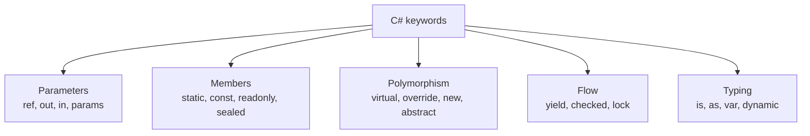

Some C# keywords rarely come up in day-to-day code but show up constantly in interviews because they test precise understanding rather than familiarity. This page is a fast-reference sweep — tables and short examples, not essays — so you can refresh each one in seconds before a round.



## Parameter modifiers: ref, out, in, params

| Keyword | Direction | Must assign before use? | Must assign before return? | Typical use |
|---|---|---|---|---|
| `ref` | In and out | Yes, by caller | Not required | Mutate caller's variable |
| `out` | Out only | No | Yes, required | `TryParse`-style multiple return values |
| `in` | In only (readonly) | Yes, by caller | N/A | Avoid copying a large struct |
| `params` | In (variable count) | N/A | N/A | Variable-length argument list |

```csharp
void Swap(ref int a, ref int b) { (a, b) = (b, a); }
bool TryDivide(int a, int b, out int result) {
    if (b == 0) { result = 0; return false; }
    result = a / b; return true;
}
void PrintAll(params int[] xs) { foreach (var x in xs) Console.WriteLine(x); }
PrintAll(1, 2, 3);            // params lets you call without an explicit array
```

## static, const vs readonly

| | `const` | `static readonly` | `readonly` (instance) |
|---|---|---|---|
| Evaluated | Compile time | Runtime (once, at type init or in static constructor) | Runtime (once, per instance, in constructor) |
| Can depend on runtime values | No | Yes | Yes |
| Storage | Inlined into IL at every call site | One shared value per type | One value per instance |
| Versioning risk | Changing it requires recompiling **every** dependent assembly | Safe to change without breaking callers | N/A |

```csharp
const double Pi = 3.14159;                  // baked into IL wherever used
static readonly DateTime StartupTime = DateTime.UtcNow;  // computed once at runtime
class Config { public readonly string Env; public Config(string e) => Env = e; }
```

> [!WARNING]
> `const` values are copied into the IL of every assembly that references them at compile time. If library A defines `public const int Version = 1;` and library B compiles against it, then A is updated to `Version = 2` without recompiling B, **B still sees 1** until it's rebuilt. This is a real production versioning trap — use `static readonly` for anything that might change across a library boundary.

## virtual, override, and new (method hiding)

This is the classic trick question. `new` on a method **hides** a base member instead of overriding it — dispatch then depends on the **compile-time (static) type** of the reference, not the runtime type.

```csharp
class Base { public virtual string Who() => "Base"; }
class Derived : Base { public override string Who() => "Derived"; }
class Hider : Base { public new string Who() => "Hider"; }

Base b1 = new Derived();
Console.WriteLine(b1.Who());     // "Derived" — override, dispatches by runtime type

Base b2 = new Hider();
Console.WriteLine(b2.Who());     // "Base" — new hides, dispatches by COMPILE-TIME type (Base)

Hider h = new Hider();
Console.WriteLine(h.Who());      // "Hider" — static type is Hider now
```

> [!DANGER]
> The trick question is always some variant of "what does this print when accessed through a base-typed reference." `override` gives you real polymorphism (runtime type wins); `new` gives you shadowing (compile-time type wins). Omitting both `override` and `new` on a method with the same signature as a base `virtual` method issues a compiler warning and defaults to `new` behavior.

## sealed, abstract, partial

| Keyword | On a class | On a method |
|---|---|---|
| `sealed` | No further inheritance allowed | Combined with `override`, stops further overriding |
| `abstract` | Cannot be instantiated; may contain abstract members | No body; derived class must implement |
| `partial` | Class body split across multiple files (same assembly) | A partial method declared in one part, optionally implemented in another (source generators use this heavily) |

```csharp
public sealed class Singleton { }              // cannot be subclassed
public abstract class Shape { public abstract double Area(); }
public partial class Widget { partial void OnInit(); }   // often paired with a generated partial class
```

## using declarations and yield return

```csharp
// Classic using statement — scoped block
using (var conn = new SqlConnection(cs)) { conn.Open(); }

// using declaration (C# 8+) — disposed at end of enclosing scope, less nesting
using var conn2 = new SqlConnection(cs);
conn2.Open();

// yield return — builds a state machine, defers execution until enumerated
IEnumerable<int> Range(int start, int count)
{
    for (int i = 0; i < count; i++)
        yield return start + i;    // pauses here, resumes on next MoveNext()
}
```

`yield return` doesn't run any of the method body until the caller starts iterating — the compiler transforms the method into a hidden state machine class implementing `IEnumerator<T>`.

## checked/unchecked, is/as, nameof, default

| Keyword | What it does |
|---|---|
| `checked { }` | Throws `OverflowException` on integer overflow within the block instead of silently wrapping |
| `unchecked { }` | Explicitly allows silent wraparound (the default behavior outside a `checked` context) |
| `is` | Type-compatibility test, optionally with pattern matching (`if (obj is string s)`) |
| `as` | Safe cast — returns `null` on failure instead of throwing (reference types / nullable only) |
| `nameof(x)` | Compile-time string of a symbol's name — refactor-safe, avoids magic strings |
| `default` | Default value of a type — `0`, `false`, `null`, or all-zero struct |

```csharp
checked { int max = int.MaxValue; int overflow = max + 1; }   // throws OverflowException
unchecked { int wrapped = int.MaxValue + 1; }                  // silently wraps to int.MinValue

object o = "hello";
if (o is string s) Console.WriteLine(s.Length);   // pattern-matching is
string? cast = o as string;                        // null if o isn't a string, no exception

void Validate(string name) { if (name == null) throw new ArgumentNullException(nameof(name)); }
```

## dynamic vs var vs object

| | `var` | `object` | `dynamic` |
|---|---|---|---|
| Type resolved | Compile time, inferred | Compile time, always `object` | Runtime |
| Type safety | Full — same as writing the type explicitly | Requires cast to use members | None until runtime — wrong member throws `RuntimeBinderException` |
| Typical use | Reduce verbosity where the type is obvious | Storing heterogeneous data, boxing | COM interop, dynamic JSON, scripting scenarios |

```csharp
var x = 5;                 // compiler infers int — still fully statically typed
object y = 5;               // must cast to use int members: ((int)y).ToString()
dynamic z = 5;               // z.AnyMemberName() compiles; fails at runtime if it doesn't exist
```

## lock, volatile, unsafe/fixed

| Keyword | Purpose | Key caveat |
|---|---|---|
| `lock` | Mutual exclusion around a critical section (shorthand for `Monitor.Enter`/`Exit`) | Lock on a private, dedicated object — never `lock(this)` or a public/string object |
| `volatile` | Prevents the compiler/CPU from caching a field in a register; every read/write goes to main memory | Not a substitute for proper synchronization of compound operations (`x++` is still not atomic) |
| `unsafe` | Enables pointer arithmetic (`int*`) | Requires `AllowUnsafeBlocks` in the project; bypasses type/bounds safety |
| `fixed` | Pins a managed object so the GC won't move it during a pointer operation | Needed because the GC can relocate objects during a compaction pass |

```csharp
private readonly object _gate = new();
lock (_gate) { /* critical section */ }

private volatile bool _stopRequested;

unsafe void FastCopy(byte* src, byte* dst, int count) {
    for (int i = 0; i < count; i++) dst[i] = src[i];
}
fixed (byte* p = someByteArray) { FastCopy(p, p, someByteArray.Length); }
```

## Trick questions to expect

| Question | The trap |
|---|---|
| "What prints if a `new` method is called through a base-typed variable?" | People say the derived value; correct answer follows the *static* type |
| "Is `const` safe across assemblies?" | People assume yes; it's baked into IL and can go stale |
| "Does `volatile` make `counter++` thread-safe?" | No — `volatile` only prevents caching, not atomicity of read-modify-write |
| "Does `as` throw on a failed cast?" | No — it returns `null`; a direct `(T)obj` cast throws `InvalidCastException` |
| "Is `var` dynamically typed like `dynamic`?" | No — `var` is resolved and fixed at compile time, fully static |
| "Does `checked` affect `float`/`double` overflow?" | No — floating-point overflow produces `Infinity`, not an exception; `checked` only affects integral types |

## Cheat sheet

- `ref`/`out`/`in` control aliasing and direction; `params` allows variable-length calls.
- `const` is compile-time and cross-assembly-fragile; `static readonly` is runtime-safe.
- `override` = polymorphic (runtime type); `new` = hiding (compile-time type). This is the #1 asked trick.
- `sealed` stops inheritance (class) or overriding (method); `abstract` forces implementation.
- `using` declarations reduce nesting; both forms call `Dispose()` deterministically.
- `yield return` builds a hidden state machine — execution is deferred until enumeration.
- `checked`/`unchecked` control integer overflow behavior; doesn't touch floating point.
- `is`/`as` are safe type tests; `as` never throws, a direct cast can.
- `var` is fully static typing with inference; `dynamic` defers member resolution to runtime.
- `volatile` ≠ atomic; `lock` on a private dedicated object for real mutual exclusion.

## Common mistakes

| Mistake | Fix |
|---|---|
| Assuming `new` on a method behaves like `override` | It hides based on static type — always prefer `override` unless hiding is deliberate |
| Using `const` for values that might change across a shared library | Use `static readonly` instead |
| Believing `volatile` makes compound operations thread-safe | Use `lock`, `Interlocked`, or higher-level synchronization primitives |
| `lock (this)` or `lock ("someString")` | Lock on a private, dedicated, non-string object |
| Forgetting `checked` doesn't apply to floating-point math | Overflow in `float`/`double` yields `Infinity`/`NaN`, not an exception |
| Using `dynamic` where `var` or a proper interface would do | Reserve `dynamic` for genuinely dynamic scenarios (COM, dynamic JSON) — you lose IntelliSense and compile-time checking |

## Summary

Most of these keywords are simple individually, but interviewers combine them into scenario questions to see whether your mental model is precise — the `override` vs `new` dispatch difference is the single most common trap, followed by `const` cross-assembly staleness and `volatile` not implying atomicity. Treat this page as a pre-interview refresh: if you can explain *why* each keyword behaves the way it does (not just what it does), you'll handle the follow-up question too.

## Top Interview Questions

### Q1. What is the difference between `ref`, `out`, and `in` parameters?

All three pass a parameter by reference rather than by value, meaning the parameter aliases the caller's variable instead of receiving a copy. `ref` requires the caller to initialize the variable before the call and allows the method to both read and write it. `out` does not require prior initialization (the method is treated as the sole source of the value) but the compiler enforces that the method **must** assign it before returning on every code path — the classic use is `TryParse`-style APIs returning a success flag plus a value. `in` also requires the caller to initialize the variable but only allows the method to read it, not write it — a compile-time enforced read-only alias, primarily used to avoid copying a large struct argument without giving up value semantics.

### Q2. What does `new` mean on a method, and how is it different from `override`? Walk through what a base-typed reference sees.

`override` participates in polymorphic (virtual) dispatch: calling the method through a reference of any type in the hierarchy invokes the actual runtime type's implementation. `new` instead declares an entirely separate, unrelated method that happens to share a name and signature with a base class member — it "hides" the base member rather than replacing it in the virtual dispatch table. The practical consequence: given `Base b = new Derived()`, calling `b.Method()` invokes `Derived`'s implementation if it's `override`, but invokes `Base`'s implementation if `Derived` used `new` instead — because with `new`, the compiler resolves the call based on the **static (compile-time) type** of the variable (`Base`), completely ignoring the actual runtime type. This is the most commonly asked "what does this print" trick question in C# interviews.

### Q3. Why is `const` considered risky across assembly boundaries, but `static readonly` is not?

`const` values are resolved entirely at compile time and the literal value is baked directly into the IL of every assembly that references them — there is no runtime lookup at all. If a library defines `public const int MaxRetries = 3;` and a consuming assembly is compiled against it, the consuming assembly's IL now contains a literal `3`, not a reference to the constant. If the library later changes `MaxRetries` to `5` and is redeployed **without recompiling the consumer**, the consumer keeps using the stale value `3` until it is itself rebuilt against the new library — a subtle, silent version-skew bug. `static readonly` fields, by contrast, are resolved at runtime (evaluated once during static initialization), so every assembly that references the field reads its current, live value with no recompilation needed — making it the safer choice for any constant that might realistically change or that crosses a package/library boundary.

### Q4. Does `volatile` make an increment operation like `counter++` thread-safe?

No. `volatile` only guarantees that reads and writes of that field go directly to main memory rather than being cached in a CPU register or reordered by certain compiler/JIT optimizations — it ensures **visibility** of the latest value across threads, not **atomicity** of compound operations. `counter++` is actually three separate steps (read, increment, write), and even with `volatile`, two threads can both read the same value before either writes back the incremented result, losing an update (a classic race condition) — `volatile` does nothing to prevent that interleaving. For a truly atomic increment, you need `Interlocked.Increment(ref counter)`, or wrap the whole read-modify-write sequence in a `lock`.

### Q5. What is the difference between `is`, `as`, and a direct cast `(T)obj`?

`is` tests whether a value is compatible with a given type and returns a `bool` (optionally binding a pattern-matched variable, `if (obj is string s)`), without throwing regardless of the outcome. `as` attempts a conversion and returns the converted reference on success or `null` on failure, without ever throwing an exception — but it only works for reference types or `Nullable<T>`, since there's no `null` to fall back to for a non-nullable value type. A direct cast `(T)obj` attempts the same conversion but **throws `InvalidCastException`** if it fails, which is appropriate when a failed cast represents a genuine bug/invariant violation rather than an expected possibility. In practice: use `is` with pattern matching when you need to branch on type, `as` when a failed conversion is a normal, expected outcome you'll handle, and a direct cast when you're certain of the type and want a loud failure if you're wrong.

### Q6. What does `yield return` actually do under the hood?

`yield return` is compiler sugar that transforms the containing method into a compiler-generated class implementing `IEnumerable<T>`/`IEnumerator<T>` (a state machine), rather than a normal method that runs to completion in one call. None of the method body executes when it's first called — it only starts running when the caller begins enumerating (calling `MoveNext()`, e.g. via `foreach`), and execution pauses at each `yield return`, resuming exactly where it left off on the next `MoveNext()` call. This is what enables **deferred, lazy execution**: an infinite sequence generator (`IEnumerable<int> Naturals() { int n = 0; while (true) yield return n++; }`) works fine because elements are only produced as they're requested, never all at once up front.

### Q7. When would you use `checked` explicitly, and what does it not protect against?

`checked` forces the runtime to throw `OverflowException` if an integer arithmetic operation within the block would overflow its type's range, instead of silently wrapping around (the default `unchecked` behavior for arithmetic outside an explicit context, unless the project sets `<CheckForOverflowUnderflow>` globally). It's most valuable in code where silent overflow would be a serious correctness or security bug — financial calculations, buffer size computations, or anywhere an overflowed value could be misused (e.g. as an array length, leading to a much smaller allocation than intended). It does **not** protect against floating-point overflow: `float`/`double` arithmetic that exceeds their range produces `Infinity` or `NaN` per IEEE 754 semantics regardless of `checked`/`unchecked`, since those are defined floating-point behaviors, not silent wraparound.

### Q8. What's the practical difference between `var`, `object`, and `dynamic`?

All three can appear where you assign a value, but their typing behavior is completely different. `var` is resolved by the compiler at compile time to the actual, specific type of the right-hand expression — it is exactly as statically typed as writing the type out explicitly, just less verbose; the compiler still catches every type error at compile time. `object` is a real, fixed static type (the root of the type hierarchy) — you can store anything in it, but to use any member specific to the actual stored type, you must cast, and the compiler enforces that cast is checked. `dynamic` defers **all** member resolution to runtime — `dynamicVar.AnyMethodName()` compiles regardless of whether such a method exists, and only throws `RuntimeBinderException` if it turns out not to exist when that line actually executes; this trades compile-time safety and IntelliSense for flexibility, appropriate for COM interop, dynamic JSON/data shapes, or scripting-style scenarios, but risky for everyday application code.

### Q9. Why should you avoid `lock(this)` or locking on a string literal?

`lock` needs a private object reference that only your own code controls, because the lock is keyed on object identity. `lock(this)` exposes your synchronization primitive to any external code that also happens to have a reference to your object — if unrelated code elsewhere also does `lock(myInstance)`, you now have two independent parts of the system contending for the same lock for unrelated reasons, which can cause unexpected contention or even deadlocks that are very hard to trace. String literals are worse: due to string interning, the literal `"my-lock-key"` used in two completely unrelated parts of the program (or even in different assemblies) can resolve to the **exact same interned string object**, silently causing two unrelated critical sections to serialize against each other. The fix is always a `private readonly object _gate = new();` field dedicated solely to that one lock's purpose.

### Q10. A developer added a new field to a class and used `checked` around a calculation involving it, but a production incident revealed silent data corruption instead of an exception. What would you investigate?

First, I'd verify the value actually causing corruption is an integral type inside the `checked` block's lexical scope — `checked` only affects the literal arithmetic expressions textually inside the block (or explicitly marked as `checked(...)`), so if the overflow-prone calculation happens inside a called method or a different block not marked `checked`, it silently uses the default unchecked behavior even though it looks "protected" from the outside. I'd also check whether the type involved is actually a floating-point type (`float`/`double`) rather than an integral type, since `checked` has no effect on IEEE 754 overflow — that produces `Infinity`/`NaN` instead of a corrupt-looking wrapped integer, which can itself silently propagate through further calculations. Finally, I'd check the project's `<CheckForOverflowUnderflow>` MSBuild setting, since some teams assume it's globally enabled project-wide when it is not, meaning `checked` blocks were needed everywhere but were only added in one place.

### Q11. What is the difference between a `using` statement and a `using` declaration, and when did the declaration form appear?

Both guarantee `Dispose()` is called on an `IDisposable` object, effectively lowering to a `try`/`finally`. The classic `using (var x = ...) { ... }` statement form scopes disposal to an explicit block — `Dispose()` runs when execution leaves that block, whether normally or via exception. The `using` declaration (C# 8+), `using var x = ...;` with no braces, instead scopes disposal to the **end of the enclosing block** (usually the method) — useful for reducing nesting when you have several disposable resources in sequence, since each no longer needs its own indentation level. The trade-off: with a `using` declaration, the resource stays alive (and un-disposed) for longer — until the end of the method rather than a tightly scoped block — which is usually fine but worth being deliberate about if the resource is expensive or if you specifically want deterministic early disposal.

### Q12. Does marking a field `readonly` make the object it references immutable?

No — `readonly` only prevents the **field itself** from being reassigned to a different reference after construction; it says nothing about the mutability of the object that reference points to. A `private readonly List<int> _items = new();` field can never be pointed at a different list, but `_items.Add(5)` compiles and mutates the list's contents perfectly fine, since that doesn't reassign the field — it calls a method on the object the field already refers to. True immutability of the referenced object requires the object's own type to be immutable (an immutable collection type, a record with `init`-only properties, or a hand-written type with no mutating members) — `readonly` on the field is a necessary but not sufficient condition for that guarantee, and this gap is a common source of confusion for developers assuming `readonly` behaves like a deep-freeze.
