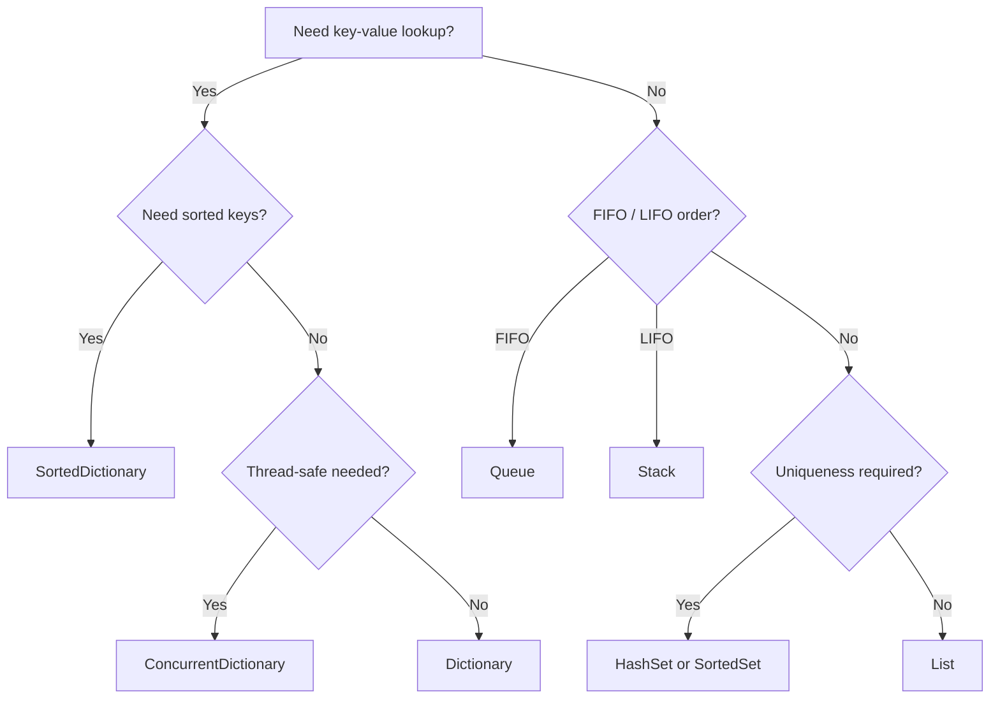

Generics and collections questions test whether you understand *why* the type system is shaped the way it is, not just which method name to call. This page covers the type-safety-plus-performance argument for generics, the variance rules that trip people up, and a practical collection-choice reference.

## Why generics exist

Before generics (pre-C# 2.0), general-purpose collections stored `object`, which meant two costs: **no compile-time type safety** (you could put a `string` into a list meant for `int`, discovered only at runtime via `InvalidCastException`), and **boxing** every value type on the way in and out.

```csharp
// Pre-generics style — ArrayList
ArrayList list = new ArrayList();
list.Add(5);            // boxes the int onto the heap
list.Add("oops");       // compiles fine — no type safety
int x = (int)list[0];   // unboxing + cast, throws InvalidCastException on list[1]

// Generic style — List<T>
List<int> typed = new List<int>();
typed.Add(5);            // stored inline, no boxing
// typed.Add("oops");    // compile error — caught immediately
int y = typed[0];        // no cast needed
```

> [!KEY]
> Generics deliver two benefits at once: compile-time type safety (catch mistakes before runtime) and performance (no boxing for value types, no casting for reference types). Interviewers want both halves of this answer, not just "type safety."

## Type parameter constraints

Constraints restrict what a generic type parameter can be, unlocking operations the compiler couldn't otherwise guarantee are valid.

| Constraint | Meaning | Enables |
|---|---|---|
| `where T : class` | Reference type only | `T` can be compared to `null` directly |
| `where T : struct` | Value type only | Guarantees non-nullable, enables `Nullable<T>` wrapping |
| `where T : new()` | Must have a public parameterless constructor | `new T()` inside the generic method |
| `where T : SomeBase` | Must inherit `SomeBase` | Access to `SomeBase`'s members on `T` |
| `where T : ISomeInterface` | Must implement the interface | Call interface members on `T` |
| `where T : notnull` | Non-nullable (reference or value) | Used heavily in `Dictionary<TKey,TValue>` internals |

```csharp
T CreateDefault<T>() where T : new() => new T();

void PrintName<T>(T item) where T : IHasName => Console.WriteLine(item.Name);

class Repository<T> where T : class, IEntity, new() { /* ... */ }
```

## Covariance and contravariance (in/out)

Variance describes whether a generic interface/delegate with `IFoo<Derived>` can be treated as `IFoo<Base>` (or vice versa) safely.

| Modifier | Name | Direction | Example |
|---|---|---|---|
| `out T` | Covariant | `IFoo<Derived>` usable as `IFoo<Base>` | `IEnumerable<out T>` — you only ever *read* T out |
| `in T` | Contravariant | `IFoo<Base>` usable as `IFoo<Derived>` | `IComparer<in T>` — you only ever *pass* T in |
| (none) | Invariant | No substitution allowed either way | `IList<T>`, `List<T>` — supports both read and write |

```csharp
IEnumerable<string> strings = new List<string>();
IEnumerable<object> objects = strings;         // OK — covariant, out T, read-only positions only

IComparer<object> objComparer = Comparer<object>.Create((a, b) => 0);
IComparer<string> strComparer = objComparer;    // OK — contravariant, in T, accepts a "more general" comparer

// List<T> is invariant — this does NOT compile:
// List<object> objList = new List<string>();   // would allow objList.Add(42) into a List<string>!
```

> [!TIP]
> The mnemonic: **out** = output position only (methods return `T`, never accept it as a parameter) → covariant. **in** = input position only (methods accept `T` as a parameter, never return it) → contravariant. `List<T>` can't be either because it both takes `T` (`Add`) and returns `T` (`this[int]`) — allowing variance there would let you insert the wrong type through a mismatched reference and blow up at runtime.

## Generic type inference

The compiler infers type arguments from method arguments so you rarely have to write them explicitly.

```csharp
T First<T>(List<T> list) => list[0];

var ints = new List<int> { 1, 2, 3 };
int a = First(ints);              // T inferred as int — no need for First<int>(ints)

// Inference can fail with no arguments to infer from — must specify explicitly
T CreateDefault<T>() where T : new() => new T();
var d = CreateDefault<MyClass>();  // required — nothing to infer T from
```

## Boxing/unboxing cost and how to spot it

Boxing allocates a new object on the heap and copies the value type's data into it; unboxing copies it back out. Each boxing operation is a heap allocation — invisible in the syntax, which is exactly why it's an interview favorite.

```csharp
int i = 42;
object boxed = i;             // boxing — allocation #1
Console.WriteLine(boxed);     // ToString() called on the boxed copy, no new box

var list = new List<object>();
for (int n = 0; n < 1000; n++)
    list.Add(n);               // boxes 1000 times — 1000 allocations

var typedList = new List<int>();
for (int n = 0; n < 1000; n++)
    typedList.Add(n);          // no boxing — stored inline in the internal int[] backing array
```

| Where boxing hides | Example |
|---|---|
| Non-generic collections | `ArrayList`, `Hashtable`, `Queue` (non-generic), `Stack` (non-generic) |
| `string.Format`/interpolation with a struct via a non-generic overload | Rare in modern .NET (span-based overloads avoid it), but watch for `object[]` params overloads |
| Boxing to an interface | `IComparable c = someStruct;` |
| `object.Equals(object)` called on a struct | Boxes the argument to compare |

## The .NET collection reference table

| Collection | Backing structure | Access | Insert | Search | Ordered? | Use case |
|---|---|---|---|---|---|---|
| `List<T>` | Dynamic array | `O(1)` | `O(1)` amortised at end, `O(n)` elsewhere | `O(n)` | Insertion order | General-purpose sequence, indexable |
| `Dictionary<K,V>` | Hash table | — | `O(1)` avg | `O(1)` avg | No guaranteed order | Key-value lookup |
| `HashSet<T>` | Hash table | — | `O(1)` avg | `O(1)` avg | No guaranteed order | Uniqueness, fast membership test |
| `SortedDictionary<K,V>` | Red-black tree | — | `O(log n)` | `O(log n)` | Sorted by key | Ordered key-value, range queries |
| `SortedSet<T>` | Red-black tree | — | `O(log n)` | `O(log n)` | Sorted | Ordered unique elements, range queries |
| `Queue<T>` | Circular array | — | `O(1)` at back | — | FIFO | Task queues, BFS |
| `Stack<T>` | Dynamic array | — | `O(1)` at top | — | LIFO | Undo history, DFS, parsing |
| `LinkedList<T>` | Doubly linked nodes | `O(n)` | `O(1)` given a node | `O(n)` | Insertion order | Frequent insert/remove at both ends or mid-list given a node reference |
| `ConcurrentDictionary<K,V>` | Striped/lock-free hash table | — | `O(1)` avg | `O(1)` avg | No guaranteed order | Thread-safe shared cache/map |
| `ImmutableList<T>` | Balanced binary tree (AVL-like) | `O(log n)` | `O(log n)`, returns new instance | `O(n)` | Insertion order | Safe sharing across threads without locks, undo/redo, functional style |

> [!WARNING]
> `ImmutableList<T>.Add` is `O(log n)`, not `O(1)` like `List<T>.Add` — it must build a new tree path to preserve the old version. If you need frequent mutation and don't need immutability guarantees, `List<T>` is the right default; reach for `ImmutableList<T>` specifically for safe cross-thread sharing or when you need to keep prior versions around (undo, snapshotting).

## Choosing the right collection



## Cheat sheet

- Generics give type safety **and** avoid boxing/casting — mention both.
- Constraints (`where T : ...`) unlock operations the compiler can't otherwise assume are safe.
- `out T` = covariant (produces T only); `in T` = contravariant (consumes T only); mutable containers are invariant.
- Boxing is a heap allocation hiding behind an implicit conversion — non-generic collections are the classic source.
- `List<T>` add is amortised `O(1)`; `Dictionary`/`HashSet` are `O(1)` average, `O(n)` worst case on hash collisions.
- `SortedDictionary`/`SortedSet` trade `O(log n)` for guaranteed order — use when you need range queries or ordered iteration.
- `ConcurrentDictionary` is for thread-safety, not automatically faster than `Dictionary` + external lock in all scenarios — measure.
- `ImmutableList<T>.Add` is `O(log n)`, not `O(1)` — don't default to it for hot mutation paths.

## Common mistakes

| Mistake | Fix |
|---|---|
| Using `ArrayList`/`Hashtable` in new code | Use generic `List<T>`/`Dictionary<K,V>` — no boxing, compile-time safety |
| Assuming `List<object>` can hold a `List<string>` | Generic classes are invariant; only interfaces/delegates with `in`/`out` support variance |
| Choosing `SortedDictionary` by default "to be safe" | Costs `O(log n)` vs `O(1)` for `Dictionary` — only pay for ordering if you need it |
| Iterating a `Dictionary` expecting insertion order | Order is not guaranteed — use a `List<KeyValuePair<K,V>>` or `SortedDictionary` if order matters |
| Using `ConcurrentDictionary` and still wrapping every access in a `lock` | Defeats the purpose — use its atomic methods (`AddOrUpdate`, `GetOrAdd`) instead |
| Boxing structs into `List<object>` for "flexibility" | Use a generic type parameter or a common interface instead |

## Summary

Generics exist to give you compile-time type safety and eliminate the boxing/casting overhead that plagued pre-generic collections, and constraints let you tell the compiler enough about a type parameter to call meaningful members on it. Variance (`in`/`out`) is safe only in read-only or write-only positions — mutable generic containers stay invariant to prevent type-safety holes. Picking the right .NET collection is a matter of matching the access pattern (key lookup, FIFO/LIFO, ordered iteration, thread-safety) to its underlying data structure and Big-O profile, not just habit.

## Top Interview Questions

### Q1. Why do generics exist — what problem did they solve that `object`-based collections had?

Before generics, general-purpose collections like `ArrayList` stored everything as `object`, which created two real problems. First, there was no compile-time type safety: you could add an `int` and a `string` to the same `ArrayList`, and the mistake would only surface as an `InvalidCastException` at runtime when reading an element back with an incorrect cast. Second, every value type stored in such a collection had to be **boxed** — copied onto the heap and wrapped in an object header — costing an allocation per element, with unboxing costing another copy on the way out. Generics (`List<T>`, `Dictionary<K,V>`) solve both: the compiler enforces the element type at compile time, and for value-type type arguments, the values are stored inline in a `T[]` array with no boxing at all.

### Q2. What are generic constraints and why would you need `where T : new()`?

Constraints (`where T : ...`) restrict what types can be substituted for a generic type parameter, and in exchange, let the compiler permit operations on `T` it otherwise couldn't safely assume were valid. Without any constraint, the compiler only knows `T` could be literally anything, so it only allows operations valid for every possible type (basically just `object` members). `where T : new()` specifically constrains `T` to types with an accessible public parameterless constructor, which is what allows a generic method to write `new T()` inside its body — without the constraint, the compiler can't guarantee every possible substitution for `T` even has such a constructor, so `new T()` would be a compile error. This is common in generic factories, object pools, and dependency-injection-style code that needs to construct instances of a type parameter.

### Q3. Explain covariance and contravariance with `in`/`out` — what problem do they solve, and why is `List<T>` not variant?

Covariance (`out T`) allows an interface typed with a more derived type argument to be used where a less derived (base) type argument is expected — `IEnumerable<string>` can be passed where `IEnumerable<object>` is expected — and it's safe specifically because `IEnumerable<T>` only ever *produces* `T` values (via `MoveNext`/`Current`), never accepts one as input; there's no way to misuse the substitution to insert an incompatible type. Contravariance (`in T`) is the reverse: an `IComparer<object>` can be used where `IComparer<string>` is expected, safe because the interface only ever *consumes* `T` (as a parameter), never returns one. `List<T>` supports both reading (`this[int]` returns `T`) and writing (`Add(T)` accepts `T`), so allowing `List<object> x = new List<string>();` would let you call `x.Add(42)` — inserting an `int` into what is actually a `List<string>` at runtime, silently violating type safety. That's exactly why the CLR restricts variance to interfaces/delegates where the type parameter appears only in output (`out`) or only in input (`in`) positions, and generic classes like `List<T>` remain invariant.

### Q4. How would you detect that boxing is happening in a hot path, and what would you do about it?

Boxing doesn't appear as an explicit cast in source, so I'd look for the classic triggers: value types stored in non-generic collections (`ArrayList`, `Hashtable`), value types assigned to `object`-typed variables or parameters, value types passed to methods expecting an interface they implement (`IComparable`, `IFormattable`), and calls to `object.Equals`/`object.GetHashCode` on structs that haven't overridden them (which box the argument for comparison). In practice, I'd confirm suspected boxing with a memory profiler (looking for unexpectedly high allocation counts of boxed primitive types) or by inspecting the generated IL for `box`/`unbox` opcodes. The fix is almost always to move to a generic API (`List<T>` instead of `ArrayList`), implement `IEquatable<T>` on the struct to avoid `object.Equals` boxing, or restructure the code so the value type never needs to flow through an `object`/interface-typed variable in the hot path.

### Q5. Compare `Dictionary<K,V>` and `SortedDictionary<K,V>` — when would you accept the slower option?

`Dictionary<K,V>` is backed by a hash table giving average `O(1)` insert/lookup/delete but no guaranteed iteration order. `SortedDictionary<K,V>` is backed by a balanced binary tree (red-black tree), giving `O(log n)` for the same operations but guaranteeing keys are always iterated in sorted order, and supporting efficient range-style operations. You'd accept the slower `SortedDictionary` specifically when you need ordered iteration or range queries as a first-class requirement — for example, a leaderboard needing "give me the top 10 scores in order" repeatedly, or a time-series index where you frequently need "all entries between timestamp A and B." If you only occasionally need sorted output, it's often cheaper to keep a `Dictionary` for `O(1)` operations and sort a snapshot (`OrderBy`) only when needed, paying `O(n log n)` once instead of `O(log n)` on every single insert.

### Q6. In production, a `List<Guid>.Contains()` check inside a loop processing 100,000 items became a performance bottleneck. What's happening and how would you fix it?

`List<T>.Contains` is a linear scan — `O(n)` — because a plain list has no index structure to jump directly to a value; it must compare against each element in the worst case. Calling it inside a loop over another collection of size `m` turns what looks like an `O(m)` operation into `O(n × m)`, which explains the bottleneck at 100,000 items (potentially 10 billion comparisons in the worst case). The fix is to convert the `List<Guid>` into a `HashSet<Guid>` once before the loop (`var set = new HashSet<Guid>(list);`), since `HashSet<T>.Contains` is `O(1)` average — this changes the overall complexity to `O(n + m)`, typically an enormous real-world speedup for large collections. I'd also check whether `Guid` has any custom equality/hashing overrides that might make hashing itself expensive, though the built-in `Guid` implementation is efficient by default.

### Q7. What's the practical difference between `ConcurrentDictionary<K,V>` and a plain `Dictionary<K,V>` guarded by a `lock`?

`Dictionary<K,V>` is not thread-safe at all for concurrent reads and writes — even concurrent reads without any writes are safe, but any write concurrent with anything else can corrupt internal state or throw. Wrapping every access in an explicit `lock` makes it safe but serializes **all** access, including reads, through a single critical section, which can become a contention bottleneck under high concurrency. `ConcurrentDictionary<K,V>` uses finer-grained internal locking (historically striped locks over internal buckets, tuned over time) so multiple threads can often operate on different parts of the dictionary concurrently, and it also exposes atomic compound operations like `AddOrUpdate` and `GetOrAdd` that would otherwise require careful manual locking to get right (avoiding check-then-act races). The trade-off: `ConcurrentDictionary` has higher per-operation overhead than a plain `Dictionary` in single-threaded use, so it's a genuine "use it when you actually need concurrent access" choice, not a strictly-better default.

### Q8. Why is `ImmutableList<T>.Add` `O(log n)` instead of `O(1)` like `List<T>.Add`?

`List<T>` mutates in place — appending to the end reuses the existing backing array (or grows it, amortised `O(1)`), and the caller's reference now points at a list that includes the new element. `ImmutableList<T>` must never mutate the original instance, because other code may still hold a reference to it and expect it to remain unchanged — so `Add` cannot simply grow an array in place. Instead, `ImmutableList<T>` is backed by a balanced binary tree, and adding an element creates a new tree that shares as many unchanged sub-trees as possible with the original (structural sharing), only allocating new nodes along the path from the root to the new leaf — that path has length proportional to the tree's height, `O(log n)`. This is the fundamental cost of true immutability with efficient memory reuse: you trade `O(1)` mutation for `O(log n)` "mutation" that actually produces a new, independent version while reusing most of the old structure.

### Q9. How does the compiler infer generic type arguments, and when does it fail, requiring you to specify them explicitly?

For generic methods, the compiler examines the types of the arguments passed at the call site and works backward to solve for the type parameters — for `T First<T>(List<T> list)`, passing a `List<int>` lets the compiler directly read off `T = int` from the parameter's type. Inference fails, requiring explicit type arguments, when there's nothing in the method's regular parameters to infer from — most commonly a method whose type parameter only appears in the return type or inside a `new T()` constraint with no parameter tying it to a concrete type, like `T CreateDefault<T>() where T : new()`, which must be called as `CreateDefault<MyClass>()`. Inference can also become ambiguous with multiple overloads or when different arguments imply conflicting types for the same type parameter, in which case the compiler reports an error and again requires explicit specification.

### Q10. When would you choose a `Queue<T>` versus a `LinkedList<T>` if both can act as a FIFO structure?

`Queue<T>` is backed by a circular array internally, giving `O(1)` enqueue/dequeue at each respective end with good cache locality (contiguous memory) and lower per-element overhead than a linked structure. `LinkedList<T>` is a doubly-linked list of individually heap-allocated nodes, also giving `O(1)` insertion/removal at both ends, but with worse cache locality (nodes are scattered across the heap) and per-node overhead (each node carries its own object header plus next/previous pointers). The deciding factor is usually whether you need more than simple FIFO/LIFO access: if you only ever enqueue at the back and dequeue from the front, `Queue<T>` is more efficient and the natural choice. `LinkedList<T>` earns its keep when you need `O(1)` insertion or removal from the **middle** of the sequence given a node reference you're already holding — something neither `Queue<T>` nor `List<T>` can do without an `O(n)` shift.

### Q11. Can you make your own generic class covariant like `IEnumerable<T>`? What's the restriction?

You can only apply `out`/`in` variance to **interfaces and delegates**, not to classes — `List<T>` and any custom generic `class Container<T>` are always invariant, full stop, regardless of how you use `T` inside. If you want variance for your own abstraction, you need to define an interface (`interface IReadOnlyContainer<out T> { T Get(); }`) and have your class implement it; consumers who need the covariant view work through the interface type, while the concrete class itself remains invariant. The restriction exists because interfaces/delegates only describe a contract (which operations exist and their signatures), so the compiler can mechanically verify that a type parameter used only in output positions is safe to treat covariantly — a concrete class's internal implementation (private fields, internal arrays) isn't part of that contract-level analysis, so the CLR simply doesn't extend variance to classes.

### Q12. What's the difference in eviction/complexity behavior between `HashSet<T>` and `SortedSet<T>`, and when would `SortedSet<T>` clearly win?

`HashSet<T>` gives average `O(1)` add/remove/contains via hashing, but has no defined iteration order (effectively hash-bucket order) and no efficient way to answer range-style questions like "give me all elements between X and Y" — that would require scanning the whole set, `O(n)`. `SortedSet<T>` gives `O(log n)` for the same operations via its underlying balanced tree, but adds genuinely useful range operations: `GetViewBetween(min, max)` returns a live view of just the elements in that range in `O(log n)` to establish, plus `Min`/`Max` in `O(log n)` (or better, depending on implementation) instead of an `O(n)` scan. `SortedSet<T>` clearly wins whenever the access pattern includes "smallest/largest N," "everything in this range," or "next element after X" as a recurring operation — a `HashSet<T>` simply cannot answer those efficiently regardless of how it's used, since hashing deliberately discards ordering information.
