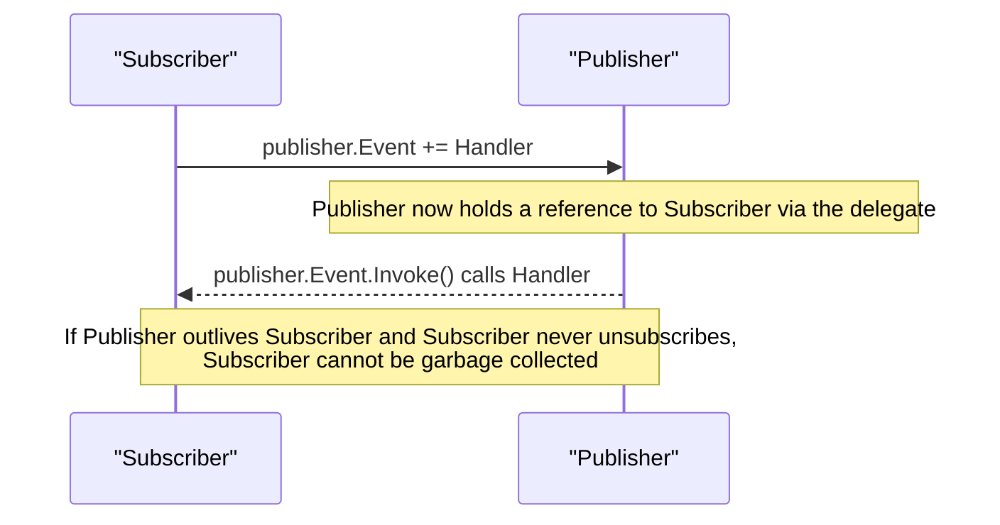

Delegates are the backbone of callbacks, LINQ, and events in C#, and interviewers use them to check whether you understand what's really happening under `Func<T>`/`Action` syntax sugar — not just whether you can use it. This page builds from the delegate type up through events, closures, and the loop-variable trap everyone eventually hits.

## Delegate as a type-safe function pointer

A delegate is a type that represents a reference to a method with a specific signature — think of it as a function pointer with compile-time type checking and support for multiple targets.

```csharp
delegate int MathOp(int a, int b);

int Add(int a, int b) => a + b;
int Multiply(int a, int b) => a * b;

MathOp op = Add;                  // method group conversion
Console.WriteLine(op(2, 3));      // 5
op = Multiply;
Console.WriteLine(op(2, 3));      // 6
```

Unlike a raw C function pointer, a delegate carries the method's signature (checked at compile time), can wrap an instance method (bundling the target object alongside the method pointer), and can point to more than one method at once (multicast, below).

## Func, Action, Predicate

`System.Func<...>`, `System.Action<...>`, and `System.Predicate<T>` are pre-defined generic delegate types the .NET team gave you so you rarely need to declare your own `delegate` keyword.

| Type | Signature shape | Example |
|---|---|---|
| `Action` | No parameters, no return | `Action greet = () => Console.WriteLine("hi");` |
| `Action<T1,...>` | Parameters, no return | `Action<string> log = s => Console.WriteLine(s);` |
| `Func<T1,...,TResult>` | Parameters, returns `TResult` (last type argument) | `Func<int,int,int> add = (a, b) => a + b;` |
| `Predicate<T>` | One parameter, returns `bool` | `Predicate<int> isEven = x => x % 2 == 0;` |

```csharp
Func<int, int, int> add = (a, b) => a + b;
Action<string> log = message => Console.WriteLine($"[LOG] {message}");
Predicate<int> isPositive = x => x > 0;

var evens = list.Where(x => x % 2 == 0);   // Where accepts a Func<T, bool> under the hood
```

## Multicast delegates and return values

Delegates are inherently multicast — `+=` appends another method to an invocation list, and invoking the delegate calls each in order.

```csharp
Action pipeline = () => Console.WriteLine("Step 1");
pipeline += () => Console.WriteLine("Step 2");
pipeline += () => Console.WriteLine("Step 3");
pipeline();               // prints Step 1, Step 2, Step 3 — in registration order

Func<int, int> multi = x => x + 1;
multi += x => x * 100;
int result = multi(5);    // 600 — only the LAST subscriber's return value is kept
```

> [!WARNING]
> With a multicast `Func<T>`, only the **last** delegate's return value is observable through a direct call — earlier ones execute but their results are discarded. If you need every result, iterate `GetInvocationList()` and call each manually.

## Events: restricted delegates

An `event` is a delegate field with compiler-enforced restrictions: outside the declaring class, code can only `+=`/`-=` a handler — it cannot invoke the event or assign it directly, and it cannot clear other subscribers' handlers with `=`.

```csharp
class Button
{
    public event EventHandler? Clicked;   // restricted delegate field

    public void SimulateClick() => Clicked?.Invoke(this, EventArgs.Empty); // only the class itself can raise it
}

var button = new Button();
button.Clicked += (sender, e) => Console.WriteLine("Clicked!");
// button.Clicked(button, EventArgs.Empty);   // compile error — can't invoke from outside
// button.Clicked = null;                      // compile error — can't assign, only +=/-=
button.SimulateClick();                        // "Clicked!"
```

> [!KEY]
> `event` exists specifically to enforce the **publish/subscribe** discipline: subscribers can only subscribe or unsubscribe; only the publisher can raise the event or clear the whole list. Without `event` (a plain public delegate field), any external code could call it directly or wipe out every other subscriber with `= someHandler`, breaking encapsulation.

## The event handler pattern

```csharp
public class OrderPlacedEventArgs : EventArgs
{
    public int OrderId { get; init; }
}

public class OrderService
{
    public event EventHandler<OrderPlacedEventArgs>? OrderPlaced;

    public void PlaceOrder(int id)
    {
        // ... business logic ...
        OrderPlaced?.Invoke(this, new OrderPlacedEventArgs { OrderId = id });
    }
}

var service = new OrderService();
service.OrderPlaced += (sender, args) => Console.WriteLine($"Order {args.OrderId} placed");
```

The `EventHandler<TEventArgs>(object? sender, TEventArgs e)` shape is a .NET-wide convention: it lets subscribers know *who* raised the event and receive strongly-typed event data, and `?.Invoke` guards against `NullReferenceException` when there are no subscribers.

## Closures and the captured-variable trap in loops

A lambda captures **variables**, not their values at the moment of capture — historically, this meant a `for` loop's iteration variable, being reused across iterations, was captured once and reflected its *final* value in every closure.

```csharp
// C# 5+ (current behavior) — each iteration gets its own variable, this works correctly
var actions = new List<Action>();
for (int i = 0; i < 3; i++)
    actions.Add(() => Console.WriteLine(i));
foreach (var a in actions) a();     // prints 0, 1, 2

// foreach always captured a fresh variable per iteration, even before C# 5
foreach (var item in new[] { "a", "b", "c" })
    actions.Add(() => Console.WriteLine(item));  // safe in all C# versions

// The trap that STILL exists: a single variable declared OUTSIDE the loop and reused
var actionsTrap = new List<Action>();
int shared = 0;
for (int i = 0; i < 3; i++)
{
    shared = i;
    actionsTrap.Add(() => Console.WriteLine(shared));  // all three print 2 — same captured variable
}
```

> [!DANGER]
> C# 5 changed `for` loop semantics so the loop variable is now scoped fresh per iteration, fixing the classic "all closures print the last value" bug for `for` loops specifically. But the underlying rule — **closures capture the variable, not a snapshot of its value** — is unchanged, and any variable declared outside the loop body and mutated inside it will still exhibit the old trap. This is one of the most reliable "do you actually understand closures" interview questions.

## Lambda vs anonymous method vs local function

| Form | Syntax | Captures variables? | Can be `async`? | Overhead |
|---|---|---|---|---|
| Lambda expression | `x => x + 1` | Yes (closure) | Yes (`async x => ...`) | Allocates a delegate, and a closure class if it captures |
| Anonymous method | `delegate(int x) { return x + 1; }` | Yes (closure) | No | Same as lambda — largely superseded by lambdas |
| Local function | `int Add1(int x) => x + 1;` | Yes, but the compiler can avoid a heap allocation entirely if it's never converted to a delegate | Yes | Cheapest — can be a plain static-like method with no delegate/closure overhead if not passed as a value |

```csharp
// Local function — best choice when you don't need to pass it around as a delegate value
int Fibonacci(int n)
{
    int Fib(int k) => k <= 1 ? k : Fib(k - 1) + Fib(k - 2);  // local function, no delegate allocation
    return Fib(n);
}
```

> [!TIP]
> Prefer local functions over lambdas when the "function" is only ever called directly (not stored, passed as a callback, or assigned) — the compiler can skip allocating a delegate object entirely, which matters in hot paths.

## The event memory-leak problem

Subscribing to an event creates a reference from the **publisher** to the **subscriber** (through the delegate's invocation list) — the opposite direction of what you might expect, and the classic cause of a subtle memory leak.



If a long-lived publisher (say, a singleton service or a static event) holds a subscription to a short-lived object that never unsubscribes, the short-lived object is kept alive indefinitely by that reference — it "leaks" even though nothing else in the program references it anymore. The fix is to explicitly `-=` in a `Dispose()`/cleanup method, or use a weak event pattern (a `WeakReference`-based subscription, as used by WPF's `WeakEventManager`) when the subscriber's lifetime is shorter and unpredictable relative to the publisher's.

## Cheat sheet

- A delegate is a type-safe reference to one or more methods matching a signature.
- `Func`/`Action`/`Predicate` cover almost every case — you rarely need a custom `delegate` type.
- Delegates are multicast by default; only the last handler's return value survives a direct `Func<T>` call.
- `event` restricts a delegate field to `+=`/`-=` from outside the class — no external invoke, no external `=` wipeout.
- Closures capture **variables**, not values — mutating the captured variable after capture changes what the closure sees.
- `for` loop variables are scoped per-iteration since C# 5; `foreach` always was. A variable declared *outside* the loop is still a trap.
- Prefer local functions over lambdas when the function is never passed around as a value — avoids a delegate/closure allocation.
- Event subscriptions create a publisher → subscriber reference; forgetting to unsubscribe is a classic memory leak.

## Common mistakes

| Mistake | Fix |
|---|---|
| Exposing a public delegate field instead of an `event` | External code can invoke it or wipe all subscribers with `=` — always use `event` |
| Assuming every subscriber's return value is observed on a multicast `Func<T>` | Only the last one is — iterate `GetInvocationList()` if you need all results |
| Capturing a loop-external variable inside a loop body's lambda | Declare a fresh local inside the loop body to capture per-iteration |
| Never unsubscribing a long-lived publisher's event | Unsubscribe in `Dispose()`, or use a weak event pattern |
| Invoking an event without a null check | Use `Event?.Invoke(...)` — no subscribers means a null delegate field |
| Using a lambda where a local function would avoid an allocation | Prefer local functions for callbacks that are only ever called directly, not stored/passed |

## Summary

Delegates are type-safe, potentially multicast references to methods, and `Func`/`Action`/`Predicate` cover nearly every use case without a custom delegate declaration. Events layer a publish/subscribe discipline on top of a delegate field, so subscribers can only add or remove themselves, never invoke or clear the list — but that same subscription creates a reference back from publisher to subscriber, which is the root cause of the most common event-related memory leak. Closures capture variables, not values, which is why loop-variable capture is a perennial interview trap even though `for` loops have scoped their iteration variable per-iteration since C# 5.

## Top Interview Questions

### Q1. What is a delegate, and how is it different from a raw function pointer in a language like C?

A delegate is a type-safe, object-oriented reference to one or more methods that match a specific signature (parameter types and return type). Unlike a raw C function pointer, which is just an untyped memory address the compiler doesn't validate against a signature, a delegate is checked at compile time — you cannot assign a method with an incompatible signature to it. A delegate can also bundle a target instance alongside the method pointer (so it can call an instance method correctly, keeping that instance alive as long as the delegate exists), and it's inherently multicast — a single delegate variable can hold and invoke a list of multiple methods in sequence, something a plain function pointer cannot do without manual bookkeeping.

### Q2. What are `Func`, `Action`, and `Predicate`, and why did the .NET team introduce them?

They are a family of pre-defined generic delegate types covering the overwhelming majority of callback shapes you need: `Action`/`Action<T1,...,T16>` for methods with no return value, `Func<T1,...,TResult>` for methods with a return value (the last type parameter), and `Predicate<T>` specifically for a single-parameter method returning `bool` (common in filtering). Before generics, developers declared a custom `delegate` type for every distinct method signature they needed to pass around, leading to a proliferation of near-identical delegate type declarations across codebases. `Func`/`Action` eliminate that boilerplate — LINQ, event handling patterns, and most callback-based APIs in modern .NET are built entirely on these generic delegates rather than bespoke ones, and you only reach for a custom `delegate` keyword declaration today when you need named parameters in the signature for clarity or `ref`/`out` parameters, which the generic delegates don't support.

### Q3. What happens when you call a multicast `Func<T>` — do you get all the results back?

No — invoking a multicast delegate calls every method in its invocation list in the order they were added, but if the delegate has a return type, only the value returned by the **last** invoked method is returned to the caller; the return values of all earlier invocations are computed but silently discarded. This is a common source of subtle bugs when someone assumes `+=`-chaining a `Func<T>` behaves like an aggregation. If every subscriber's result is actually needed, you must call `GetInvocationList()` on the delegate, which returns a `Delegate[]` of each individual target, and invoke them one at a time, collecting results yourself — multicast delegates with return values are really best reserved for `Action`-style (void) scenarios like event notification, where every subscriber's side effect matters but no return value does.

### Q4. Why does C# have a separate `event` keyword instead of just exposing a public delegate field?

A plain public delegate field gives external code full control over it: any caller can invoke it directly (`obj.SomeDelegate()`), bypassing whatever internal logic was meant to trigger it, and any caller can also assign it with `=`, which silently replaces (wipes out) every previously registered subscriber rather than adding to the list. The `event` keyword restricts external code to only `+=` and `-=` — the compiler generates a private backing delegate field plus `add`/`remove` accessor methods, and only code within the declaring class retains the ability to invoke the event or assign it outright. This enforces the intended publish/subscribe discipline: subscribers manage their own subscription, but only the publisher decides when the event fires and controls the full subscriber list, which is essential for encapsulation in any non-trivial event-driven design.

### Q5. Explain the classic "closures in a loop" bug — does it still exist in modern C#?

Historically, in `for (int i = 0; i < n; i++) actions.Add(() => Console.WriteLine(i));`, all lambdas captured the *same* variable `i`, and since the loop reused a single variable across iterations, every closure printed the loop's final value once the loop completed, rather than the value at the time each closure was created. C# 5 changed the language specification so a `for` loop's iteration variable is now a fresh variable scoped to each iteration, which fixed this specific case — the code above now correctly prints 0, 1, 2 in modern C#. `foreach` never had this bug even in older C# versions, since its iteration variable was always scoped per-iteration. The underlying rule that closures capture variables, not value snapshots, is unchanged, though — a variable declared *outside* the loop and merely assigned inside it (`int shared; for(...) { shared = i; actions.Add(() => Print(shared)); }`) still exhibits the "all closures see the final value" behavior today, because there's genuinely only one variable being captured across all iterations.

### Q6. What's the difference between a lambda expression, an anonymous method, and a local function — and when would you choose a local function?

All three let you define a piece of executable logic inline without a separately named, top-level method, and all three can capture enclosing variables as a closure. Anonymous methods (`delegate(int x) { return x + 1; }`, pre-C# 3) are the oldest form and have been almost entirely superseded by the more concise lambda syntax (`x => x + 1`). Local functions (C# 7+) look like ordinary method declarations nested inside another method, and the key practical difference is allocation: if a local function is only ever called directly (never converted to a delegate, stored, or passed as a value), the compiler can emit it as a plain method call with no delegate object or closure class allocation at all — whereas a lambda assigned to a `Func`/`Action` variable, by definition, requires at least a delegate instance to be allocated. I'd choose a local function specifically for recursive helper logic or straightforward inline logic that's only invoked directly within the same method, to avoid the unnecessary allocation.

### Q7. How can subscribing to an event cause a memory leak, and how would you fix it?

Subscribing (`publisher.Event += subscriber.Handler`) creates a reference **from the publisher to the subscriber**, stored inside the publisher's event delegate's invocation list — this is the reverse of the intuitive direction, since people expect the subscriber to "depend on" the publisher, not the other way around. If the publisher is long-lived (a singleton, a static event, or simply an object that outlives the subscriber in practice) and the subscriber never explicitly unsubscribes (`-=`), the garbage collector can never reclaim the subscriber, because the publisher's invocation list still holds a live reference to it — even though every other part of the program may have long since lost interest in that subscriber. The standard fix is to unsubscribe explicitly, typically in a `Dispose()` method called deterministically via `using`/IDisposable patterns when the subscriber's lifetime ends; for cases where deterministic disposal isn't practical, a weak event pattern (using `WeakReference` internally, as WPF's `WeakEventManager` does) breaks the strong reference so the subscriber can be collected even without explicit unsubscription.

### Q8. What is the `EventHandler<TEventArgs>` convention, and why does every subscriber receive a `sender` parameter?

`EventHandler<TEventArgs>` is the .NET Framework's standard delegate shape for events: `void Handler(object? sender, TEventArgs e)`. The `sender` parameter — the object that raised the event — lets a single handler method be subscribed to multiple publishers and still distinguish which one fired, without needing a separate closure or lambda per publisher instance. `TEventArgs` (conventionally deriving from `EventArgs`) carries any event-specific data, keeping the delegate signature consistent across the entire framework while still allowing arbitrary payloads. Following this convention (rather than a bespoke `Action<int>` or similar) matters mostly for consistency and tooling — many frameworks, serializers, and designer tools expect the `EventHandler`/`EventHandler<T>` shape, and deviating from it can break expectations for anyone integrating with your event, even though a plain `Action<T>` would technically work.

### Q9. In a debugging scenario, an event handler you subscribed to is never firing even though you can confirm the publishing code calls `Invoke`. What would you check?

First, I'd check whether I'm actually subscribed to the same instance that's raising the event — a very common cause is subscribing to one instance (e.g. one created during setup) while a different instance (e.g. one resolved fresh from a DI container per request) is the one actually publishing. Second, I'd check the subscription is registered *before* the event is raised — a race where the publish happens before the `+=` executes (common in async initialization code) means the handler genuinely wasn't in the invocation list at the time `Invoke` ran. Third, I'd check whether an exception thrown inside an *earlier* subscriber in a multicast invocation list is silently preventing later subscribers from running — since `Invoke` calls each target in sequence and an unhandled exception partway through the list aborts the remaining calls, unless the publisher explicitly iterates `GetInvocationList()` with per-handler exception handling. Finally, I'd verify there isn't a `-=` unsubscription happening unexpectedly elsewhere (e.g. in a constructor being run again, or double-initialization logic) that removes the handler before the event fires.

### Q10. Why would you use `?.Invoke(...)` when raising an event instead of calling the event delegate directly?

An event with no subscribers is simply a `null` delegate field — the `event` keyword doesn't automatically initialize it to an empty, no-op delegate. Calling `SomeEvent(this, args)` directly on a `null` field throws `NullReferenceException`, so publishers must guard against the "nobody is listening yet" case. The idiomatic guard is the null-conditional operator, `SomeEvent?.Invoke(this, args)`, which short-circuits to doing nothing if the field is `null`. One subtlety worth naming in an interview: in multithreaded code, there's a narrow theoretical race where the field could become `null` *between* the null check and the invoke if another thread unsubscribes the last handler concurrently — `?.Invoke` actually protects against this specific race because it evaluates the delegate reference once into a temporary before checking it, but it's still worth knowing this is a real subtlety of the pattern, not just cosmetic null-safety.

### Q11. How would you design a plugin system where multiple independent modules need to react to a "task completed" notification, without letting one module's failure block the others?

I'd expose an `event EventHandler<TaskCompletedEventArgs>? TaskCompleted;` on the publisher and have each module subscribe independently via `+=`, keeping them decoupled from each other and from the publisher's internal implementation. To prevent one subscriber's exception from blocking the rest (the default behavior of directly invoking a multicast delegate, where an exception mid-list aborts remaining calls), I'd manually iterate `TaskCompleted?.GetInvocationList()`, casting each to the handler delegate type, and wrap each individual invocation in its own `try`/`catch`, logging failures without letting one misbehaving module prevent others from being notified. I'd also make sure modules unsubscribe on their own shutdown/dispose path to avoid the publisher-holds-subscriber memory leak, especially if modules can be loaded and unloaded dynamically at runtime.

### Q12. What's the difference between capturing a variable "by reference" (as closures do) versus capturing "by value," and why does C# only do the former?

Capturing "by value" would mean the lambda takes a snapshot of the variable's current value at the moment the closure is created, and later mutations to the original variable would have no effect on what the closure sees — some languages offer this as an explicit option. C# closures always capture "by reference" conceptually: the compiler-generated closure class holds a reference to the *same storage location* as the original variable (technically, the compiler promotes the captured variable itself into a field of a generated class, and both the original code and the lambda operate on that same field), so any mutation visible to one is visible to the other. This is precisely why the loop-variable trap exists — it's not a bug so much as a direct, intentional consequence of "closures see live variables, not frozen snapshots," which is powerful for patterns like a counter closure (`MakeCounter` returning a closure that increments and reads shared state across calls) but requires care in loops where a fresh variable per iteration is what you actually want.
