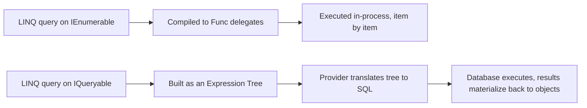

LINQ questions in interviews almost always converge on one thing: do you actually understand *when* a query runs, and do you know the difference between LINQ-to-Objects and LINQ-to-Entities. This page covers both, plus the operator reference and EF Core pitfalls that come up in senior rounds.

## Query syntax vs method syntax

Both compile to the same underlying method calls — query syntax is pure syntactic sugar over method (fluent) syntax.

```csharp
// Query syntax
var query = from p in products
            where p.Price > 100
            orderby p.Name
            select p.Name;

// Method syntax — what the compiler translates the query expression into
var method = products
    .Where(p => p.Price > 100)
    .OrderBy(p => p.Name)
    .Select(p => p.Name);
```

Method syntax covers more operators than query syntax has keywords for (`Count`, `Sum`, `Any`, `Skip`, `Take`, etc. have no query-syntax equivalent), so most production code mixes both or leans fully method syntax.

## Deferred vs immediate execution

Most LINQ operators are **deferred** — they build up a description of the query but don't run it until you actually enumerate the result (via `foreach`, `.ToList()`, `.First()`, etc.). A minority are **immediate** — they execute right away and return a concrete result.

| Deferred (lazy) | Immediate (eager) |
|---|---|
| `Where`, `Select`, `OrderBy`, `GroupBy`, `Join`, `Skip`, `Take` | `ToList()`, `ToArray()`, `ToDictionary()`, `Count()`, `Sum()`, `First()`, `Single()`, `Any()` |

```csharp
var query = numbers.Where(n => n > 0);  // nothing has executed yet — just a description
numbers.Add(-5);
numbers.Add(10);
foreach (var n in query) Console.WriteLine(n);  // NOW it runs, sees the mutated list
```

> [!KEY]
> A deferred query is re-evaluated **every time** it's enumerated. This is the source of both a classic bug (multiple enumeration re-running expensive work) and a classic feature (a query automatically reflecting the latest state of its source).

## The multiple-enumeration trap

```csharp
IEnumerable<int> GetExpensiveQuery() =>
    numbers.Where(n => { Console.WriteLine("evaluating"); return n > 0; });

var query = GetExpensiveQuery();
int count = query.Count();     // enumerates once — prints "evaluating" for every element
var list = query.ToList();     // enumerates AGAIN — prints "evaluating" for every element again
```

If the source is a database query (`IQueryable`), each enumeration re-runs the SQL — hitting the database once for `Count()` and again for `ToList()`. The fix is to materialize once:

```csharp
var materialized = GetExpensiveQuery().ToList();   // executes once
int count = materialized.Count;                     // no re-query — this is List<T>.Count, O(1)
var listAgain = materialized;                        // reuse the same list
```

> [!DANGER]
> Multiple enumeration is worse than just "slow" when the source isn't stable across enumerations — a `Random`-based filter, a query against a changing database, or a query over a mutating in-memory collection can return **different results** on each enumeration of the same "query," producing inconsistent or hard-to-reproduce bugs.

## IEnumerable vs IQueryable — the single most asked LINQ question

`IEnumerable<T>` represents an in-memory sequence; its LINQ operators are compiled to actual delegates (`Func<T, bool>` etc.) executed by the CLR, one item at a time, entirely in process memory. `IQueryable<T>` represents a query that can be **translated to another form** (most commonly SQL) and executed elsewhere; its operators build an **expression tree** — a data structure describing the query as code, not compiled delegates — which a provider (like EF Core) walks and translates into SQL at enumeration time.



```csharp
// IEnumerable — filtering happens in application memory, AFTER all rows are loaded
IEnumerable<Product> inMemory = dbContext.Products.ToList();
var cheapInMemory = inMemory.Where(p => p.Price < 100);       // runs in C#, after the full table is in memory

// IQueryable — filtering is translated into SQL and happens in the database
IQueryable<Product> queryable = dbContext.Products;
var cheapInDb = queryable.Where(p => p.Price < 100);          // becomes "WHERE Price < 100" in SQL, runs in the DB
```

| | `IEnumerable<T>` | `IQueryable<T>` |
|---|---|---|
| Represents | An in-memory (or already-streaming) sequence | A translatable query against an external provider |
| Operators compiled to | Delegates (`Func<T,...>`) | Expression trees (`Expression<Func<T,...>>`) |
| Where does filtering happen | In the CLR, item by item | Translated to the target (usually SQL), executed remotely |
| Typical source | Arrays, `List<T>`, any in-memory collection | `DbSet<T>` in EF Core, remote data providers |
| Risk if used carelessly | Multiple enumeration re-runs in-memory work | Pulls entire table into memory if you accidentally call `.ToList()`/`AsEnumerable()` too early |

> [!TIP]
> The answer that wins the point: *"`IQueryable` lets the provider see the query as data — an expression tree — so it can translate `Where`/`Select`/`OrderBy` into SQL and only bring back the rows that matter. The moment you call `.ToList()`, `.AsEnumerable()`, or use a method the provider can't translate, everything after that point runs in memory over whatever was already fetched."*

## Common operators reference

| Operator | Purpose | Deferred? |
|---|---|---|
| `Where` | Filter | Yes |
| `Select` | Project/transform each element | Yes |
| `SelectMany` | Flatten a sequence of sequences into one | Yes |
| `OrderBy`/`OrderByDescending` | Sort | Yes |
| `GroupBy` | Bucket elements by a key | Yes |
| `Join`/`GroupJoin` | Relational-style join between two sequences | Yes |
| `Skip`/`Take` | Pagination | Yes |
| `Distinct`/`Union`/`Except`/`Intersect` | Set operations | Yes |
| `Aggregate` | Custom fold/reduce over a sequence | Immediate |
| `Count`/`Sum`/`Average`/`Min`/`Max` | Numeric/count aggregation | Immediate |
| `Any`/`All` | Existence/universality check | Immediate |
| `First`/`FirstOrDefault`/`Single`/`SingleOrDefault` | Element retrieval | Immediate |
| `ToList`/`ToArray`/`ToDictionary` | Materialize | Immediate |

## Select vs SelectMany

`Select` produces one output element per input element (a 1-to-1 mapping, possibly of a different shape). `SelectMany` flattens a sequence-of-sequences into a single flat sequence (1-to-many, then concatenated).

```csharp
var orders = new[] {
    new Order { Items = new[] { "Pen", "Pencil" } },
    new Order { Items = new[] { "Eraser" } }
};

var perOrder = orders.Select(o => o.Items);
// IEnumerable<string[]> — two arrays: ["Pen","Pencil"], ["Eraser"]

var flattened = orders.SelectMany(o => o.Items);
// IEnumerable<string> — ["Pen", "Pencil", "Eraser"] — flattened into one sequence
```

## GroupBy and Aggregate

```csharp
var byCategory = products.GroupBy(p => p.Category);
foreach (var group in byCategory)
    Console.WriteLine($"{group.Key}: {group.Count()} items");

int total = numbers.Aggregate(0, (acc, n) => acc + n);          // fold with a seed
string joined = words.Aggregate((a, b) => $"{a}, {b}");          // fold with the first element as the seed
```

## Any vs Count() > 0, FirstOrDefault vs SingleOrDefault

| Comparison | Difference |
|---|---|
| `Any()` vs `Count() > 0` | `Any()` stops at the first match — `O(1)` in the best case. `Count()` must enumerate the entire sequence (`O(n)`) unless the source has a fast `Count` property, which most `IQueryable` sources don't guarantee at the LINQ level |
| `FirstOrDefault()` vs `SingleOrDefault()` | `FirstOrDefault` returns the first match (or default) and stops immediately — fine when duplicates are expected/acceptable. `SingleOrDefault` scans far enough to confirm **at most one** match exists and throws `InvalidOperationException` if there are two or more — use it to assert an invariant ("this key must be unique"), not as a casual lookup |

```csharp
bool hasNegative = numbers.Any(n => n < 0);        // efficient — short-circuits
bool hasNegativeSlow = numbers.Count(n => n < 0) > 0;  // wasteful — scans everything just to check nonzero

var user = users.SingleOrDefault(u => u.Id == id);  // throws if two users share an Id — good, that's a bug you want surfaced
```

## Client-side vs server-side evaluation in EF Core

EF Core translates as much of a query as it can into SQL; anything it cannot translate either throws (in modern EF Core, by default) or historically fell back to evaluating client-side after **pulling more data than intended** into memory.

```csharp
// Translatable — becomes a WHERE clause in SQL
var result1 = dbContext.Orders.Where(o => o.Total > 100).ToList();

// NOT translatable if MyCustomBusinessRule is a plain C# method EF Core can't map to SQL
var result2 = dbContext.Orders.Where(o => MyCustomBusinessRule(o)).ToList();  // throws in modern EF Core

// Common accidental fix that hides a bug: force it in-memory by materializing too early
var result3 = dbContext.Orders.ToList().Where(o => MyCustomBusinessRule(o));  // pulls the WHOLE table first!
```

> [!WARNING]
> Calling `.ToList()`/`.AsEnumerable()` *before* your filtering conditions is a common accidental fix for "this LINQ expression can't be translated" errors — it makes the error go away by pulling the entire table into memory and filtering there, which works but silently destroys performance on a large table. Always try to keep filtering expressed in terms EF Core can translate (simple comparisons, supported string/date functions) and materialize (`ToList`) as the very last step.

## The N+1 query problem

```csharp
var orders = dbContext.Orders.ToList();               // 1 query
foreach (var order in orders)
    Console.WriteLine(order.Customer.Name);            // triggers 1 query PER order — lazy loading, N additional queries
```

This is the classic **N+1 query problem**: one query to get the list, then N more queries — one per row — to lazily load a related entity, instead of one efficient join. The fix is eager loading with `Include`:

```csharp
var orders = dbContext.Orders
    .Include(o => o.Customer)      // one JOIN query total, not N+1
    .ToList();
```

## Custom extension methods

LINQ's own operators are just extension methods on `IEnumerable<T>`/`IQueryable<T>` — you can write your own the same way.

```csharp
public static class LinqExtensions
{
    public static IEnumerable<T> WhereNotNull<T>(this IEnumerable<T?> source) where T : class =>
        source.Where(x => x is not null)!;

    public static IEnumerable<TSource> DistinctBy<TSource, TKey>(
        this IEnumerable<TSource> source, Func<TSource, TKey> keySelector) =>
        source.GroupBy(keySelector).Select(g => g.First());
}
```

The `DistinctBy` implementation in this example is hand-rolled for illustration — .NET 6+ actually ships a built-in `DistinctBy`, along with `MaxBy`/`MinBy`, precisely because this pattern came up often enough for Microsoft to standardize it into the BCL.

## Cheat sheet

- Query syntax and method syntax compile to the same calls; method syntax covers more operators.
- Most LINQ operators are deferred — they run on enumeration, not on the line where you write them.
- A deferred query re-runs on every enumeration — materialize with `.ToList()` once to avoid re-running expensive/side-effecting or non-deterministic work.
- `IEnumerable<T>` = delegates, runs in memory. `IQueryable<T>` = expression trees, translated to SQL/another provider.
- `.ToList()`/`.AsEnumerable()` is the boundary where `IQueryable` becomes `IEnumerable` — everything after runs in memory.
- `Any()` short-circuits; `Count() > 0` scans everything — prefer `Any()`.
- `SingleOrDefault` asserts uniqueness (throws on 2+ matches); `FirstOrDefault` doesn't care.
- N+1 queries come from lazy-loading related entities in a loop — fix with `Include` (eager loading).
- LINQ operators are just extension methods — writing your own follows the exact same pattern.

## Common mistakes

| Mistake | Fix |
|---|---|
| Enumerating the same deferred query multiple times | Call `.ToList()` once and reuse the materialized list |
| Using `Count() > 0` instead of `Any()` | `Any()` short-circuits on the first match |
| Calling `.ToList()` before filtering against an EF Core `DbSet` | Filter first so EF Core can translate it to SQL; materialize last |
| Using `SingleOrDefault` casually where duplicates are expected | Use `FirstOrDefault` unless uniqueness really is an invariant you want enforced |
| Lazy-loading related entities inside a loop | Use `.Include()` for eager loading, avoiding N+1 queries |
| Assuming query syntax and method syntax are functionally different | They compile to identical calls — it's purely a style choice |

## Summary

LINQ operators mostly execute lazily, which is powerful for composability but dangerous if you enumerate the same query twice without realizing it re-runs the whole pipeline. The `IEnumerable` vs `IQueryable` distinction is really about *where* the query executes — in-process delegates versus a translated expression tree run by a remote provider like a SQL database — and confusing the two is the single most common source of accidental full-table scans in EF Core code. Master the deferred-vs-immediate operator table, know when a query has crossed from `IQueryable` into `IEnumerable`, and watch for N+1 patterns, and you'll handle the large majority of LINQ interview and production scenarios.

## Top Interview Questions

### Q1. What is deferred execution in LINQ, and why does it matter?

Deferred execution means a LINQ query is not run at the point it's written — operators like `Where`, `Select`, and `OrderBy` build up a description of the work to do, and that description only actually executes when the result is enumerated, via `foreach`, `.ToList()`, `.First()`, or similar. It matters for two reasons: first, it enables efficient composition — you can chain several operators together and the provider (or the CLR for in-memory LINQ) can potentially optimize the whole pipeline as one pass rather than materializing intermediate collections at every step; second, it means a query re-evaluates its source **every time** it's enumerated, which is a double-edged sword — it can reflect live changes to the source automatically, but it can also silently re-run expensive work (or even return different results) if you enumerate the same query object more than once without realizing it.

### Q2. What's the difference between `IEnumerable<T>` and `IQueryable<T>`, and why is this the most commonly asked LINQ question?

`IEnumerable<T>` represents a sequence whose LINQ operators are compiled into ordinary delegates and executed in-process, item by item, entirely within the CLR. `IQueryable<T>` represents a sequence backed by a provider capable of translating the query into another execution form — most commonly SQL for EF Core — and its LINQ operators are compiled into **expression trees** (a data structure describing the query as code) rather than delegates, so the provider can inspect, rewrite, and translate the query before ever touching the actual data source. It's the most asked question because getting it wrong has serious performance consequences: code that looks identical (`dbSet.Where(...)`) can mean "run a targeted SQL `WHERE` clause in the database" or "pull the entire table into memory and filter in C#," entirely depending on whether the expression stayed as `IQueryable` all the way through or was accidentally converted to `IEnumerable` (via `.ToList()`/`.AsEnumerable()`) before the filter was applied.

### Q3. Explain the multiple-enumeration problem with a concrete example, and how you'd detect it in code review.

If a method returns `IEnumerable<T>` built from deferred LINQ operators, and the caller enumerates it more than once — say, once via `.Count()` to log how many results there are, then again via `foreach` to process them — the entire query pipeline re-executes both times. For an in-memory sequence built with a side-effecting selector, this means the side effect happens twice; for an `IQueryable` backed by a database, it means the SQL query (and the round trip) happens twice. In code review, I'd look for any variable typed `IEnumerable<T>` (or a method returning it) being used in more than one place — passed to both `Count()` and a `foreach`, or checked with `Any()` and then iterated — and would suggest materializing once with `.ToList()`/`.ToArray()` immediately after the query is built if it's going to be consumed more than once, converting a variable-cost, potentially-inconsistent operation into a fixed, single, predictable cost.

### Q4. When would `.ToList()` before a `.Where()` clause in an EF Core query cause a serious production problem?

If `.ToList()` (or `.AsEnumerable()`) is called *before* the filtering conditions in a query built on a `DbSet<T>`, EF Core has no opportunity to translate the `Where` clause into SQL — it must first execute an unfiltered (or less-filtered) query against the database, pull **every** matching row back into application memory as fully materialized objects, and only then apply the `Where` clause in-process over that already-fetched data. On a table with millions of rows, this can turn an intended "fetch 50 filtered rows" operation into "fetch 10 million rows over the network, then filter in memory," causing severe memory pressure, slow response times, and potentially timeouts or crashes under load — and it often creeps in specifically as an accidental "fix" for a translation error, where a developer materializes early just to make a `NotSupportedException` from an untranslatable predicate go away, without realizing the cost.

### Q5. What's the difference between `Select` and `SelectMany`?

`Select` performs a strict one-to-one projection: for every input element, it produces exactly one output element (of possibly a different shape/type), so a sequence of `n` elements produces exactly `n` results, even if each result is itself a collection. `SelectMany` performs a one-to-many projection followed by flattening: for every input element, the selector produces a **sequence** of zero or more output elements, and `SelectMany` concatenates all of those inner sequences into one single flat output sequence — so a list of orders each containing multiple line items becomes, via `SelectMany`, one flat sequence of line items across all orders, rather than `Select`'s sequence-of-sequences-of-line-items. This distinction comes up constantly with nested collections (orders and their items, categories and their products) — reaching for `Select` when you actually wanted a flattened result is a common beginner mistake that shows up as a `List<List<T>>` where a `List<T>` was expected.

### Q6. Why is `Any()` generally preferred over `Count() > 0` for an existence check?

`Any()` (with or without a predicate) short-circuits — it returns `true` the moment it finds a single matching element, without examining the rest of the sequence, giving it a best-case cost of `O(1)` and a worst case bounded by however far into the sequence the first match (or the end, if there is none) happens to be. `Count()` (or `Count(predicate)`), by contrast, must in general examine every element to produce an exact count, even though you only care whether that count is nonzero — for a sequence of a million elements where a match exists at index 0, `Any()` does one comparison while `Count() > 0` does a million. The performance gap is even more pronounced against an `IQueryable` source: `Any()` translates to an efficient `SELECT 1 ... LIMIT 1`-style existence check in SQL, whereas `Count() > 0` translates to a full `COUNT(*)` aggregation over the entire filtered result set — the database has to do meaningfully more work for the same yes/no answer.

### Q7. What's the difference between `FirstOrDefault` and `SingleOrDefault`, and when would using the wrong one hide a bug?

`FirstOrDefault` returns the first element matching the condition (or `default(T)` if none match) and stops looking as soon as it finds one — it has no opinion about whether other matches also exist further along the sequence. `SingleOrDefault` returns the one matching element (or `default(T)` if none match) but additionally **verifies uniqueness** — if it finds a second match, it throws `InvalidOperationException` immediately, refusing to silently pick one. Using `FirstOrDefault` where you actually need a unique key lookup (say, "get the user with this email address," where email should be unique) would silently hide a data-integrity bug — if a duplicate email somehow exists, `FirstOrDefault` returns whichever one it happens to find first with no indication anything is wrong, whereas `SingleOrDefault` would immediately surface the violated uniqueness invariant as an exception, which is exactly the behavior you want for catching such bugs early rather than in a confusing downstream symptom.

### Q8. What is the N+1 query problem, and how do you fix it in EF Core?

The N+1 problem occurs when you fetch a list of N parent entities with one query, and then, while processing them (commonly in a loop, printing or using a related navigation property), each access to a related entity triggers a **separate** lazy-loaded query — resulting in 1 initial query plus N additional queries, one per parent row, instead of a single efficient query that joins the data up front. This is easy to introduce accidentally: simply iterating over `order.Customer.Name` inside a `foreach` over orders, with lazy loading enabled, silently issues one database round trip per order. The standard fix is eager loading via `.Include(o => o.Customer)` (and `.ThenInclude(...)` for deeper navigation chains) on the initial query, which EF Core translates into a single `JOIN`-based SQL statement fetching everything needed in one round trip — dramatically reducing both query count and total latency, especially over a network to the database rather than a local connection.

### Q9. How does `Aggregate` differ from `Sum`/`Count`/other built-in aggregation operators, and when would you reach for it?

`Sum`, `Count`, `Min`, `Max`, and `Average` are specialized, purpose-built reductions that only know how to perform one specific kind of fold and only over compatible element types. `Aggregate` is the general-purpose fold/reduce operator: it takes an optional seed value and a function describing how to combine the running accumulator with each element, letting you express *any* custom reduction — not just sum or count — such as building a running maximum with custom tie-breaking logic, concatenating strings with custom separators, or computing a running product. You'd reach for `Aggregate` specifically when the built-in operators don't express what you need — for straightforward sums, counts, or averages, the dedicated operators are clearer to read and, for `IQueryable` sources, far more likely to translate efficiently to SQL, since arbitrary `Aggregate` lambdas frequently cannot be translated and force client-side (in-memory) evaluation.

### Q10. You inherit a codebase where a repository method returns `IQueryable<T>` all the way up to a controller action. Is this a good or bad pattern, and why?

It's a genuinely debated pattern with real trade-offs. The argument for it: leaving the result as `IQueryable<T>` as long as possible lets the calling code add further filtering, sorting, or pagination (`.Where()`, `.OrderBy()`, `.Skip().Take()`) that still gets translated into SQL and pushed down to the database, which can be more efficient than the repository eagerly fetching everything and letting the caller filter in memory. The argument against it: it leaks persistence/ORM concerns (the shape of the underlying `DbSet`, what's translatable to SQL, the lifetime of the `DbContext`) up through architectural layers that shouldn't need to know about them, makes the repository's contract harder to reason about (callers might inadvertently write untranslatable predicates that throw at the controller layer), and risks the `DbContext` being disposed before the `IQueryable` is actually enumerated if it crosses certain layer boundaries (like an async boundary after the context's scope ends). In most layered architectures I'd materialize (`.ToList()`/project with `.Select()` into DTOs) at the repository or application-service boundary and keep `IQueryable` exposure limited to a narrow, well-understood "query object" or "specification" layer rather than letting it flow unrestricted into controllers.

### Q11. What is an expression tree, and why does EF Core need it instead of just compiling your lambda to a delegate?

An expression tree is a data structure that represents code **as data** — instead of compiling `p => p.Price > 100` directly into executable IL wrapped in a delegate, the compiler builds a tree of objects (a `BinaryExpression` for `>`, a `MemberExpression` for `p.Price`, a `ConstantExpression` for `100`, etc.) that describes the *structure* of that logic, which can be inspected, walked, and rewritten programmatically at runtime. EF Core needs this because it doesn't execute your predicate in .NET at all when querying a database — it needs to understand what your lambda *means* well enough to generate an equivalent SQL `WHERE` clause, and a compiled delegate is an opaque, already-executable blob that can't be inspected or translated; you can only call it, not read what it does. This is why methods accepting `Expression<Func<T, bool>>` (like `IQueryable<T>.Where`) can be translated to SQL, while methods accepting a plain `Func<T, bool>` (like `IEnumerable<T>.Where`) can only ever be invoked directly in-process — and it's also why arbitrary C# logic (custom method calls, non-trivial control flow) often can't be translated: the provider's expression-tree-to-SQL translator simply doesn't have a mapping for every possible C# construct.

### Q12. A LINQ query against EF Core throws at runtime with a message about the expression not being translatable. What are your options?

First, I'd look at exactly which part of the query the exception points to and check whether it's calling a plain C# method, a custom business-logic function, or a language construct (like a `switch` expression with certain patterns) that EF Core's SQL translator doesn't recognize — often the fix is to rewrite that specific predicate using only translatable constructs (simple property comparisons, and the subset of string/date/math methods EF Core explicitly supports translating, like `string.Contains` or `DateTime.Year`). Second, if the logic genuinely can't be expressed in a way the database understands (say, a call into a complex in-memory business rule), I'd restructure the query to filter down to a reasonably-sized, index-supported subset first (translatable conditions that meaningfully narrow the result set), then materialize with `.ToList()` or `.AsEnumerable()` and apply the untranslatable logic afterward in memory — deliberately, not as blind trial-and-error, and only after confirming the pre-filter keeps the materialized set small. Third, for genuinely reusable predicates, I'd consider precomputing/denormalizing the needed value into a translatable column so the database can filter on it directly, avoiding the client-side evaluation entirely and keeping the query scalable as data grows.
