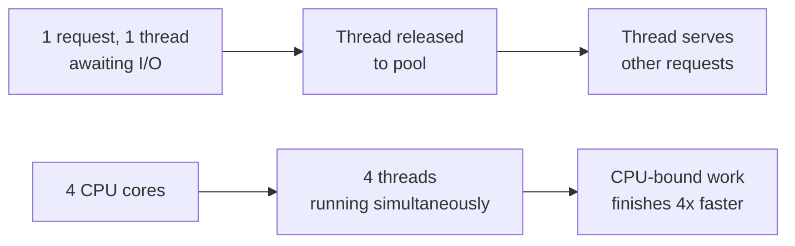
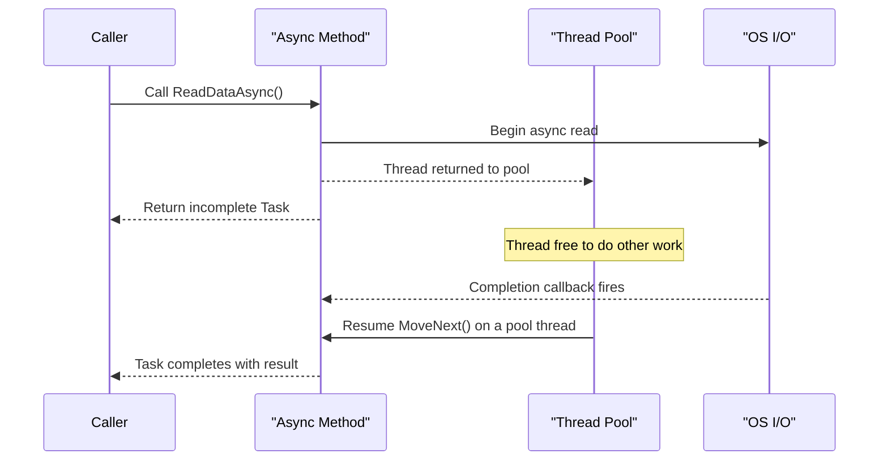

`async`/`await` is the feature every C# interview eventually pokes at, because it is easy to use and easy to misuse. The goal here is to build a mental model precise enough that you can explain *why* a piece of async code behaves the way it does, not just *that* it does.

## What async actually does

`async` does not mean "runs on another thread". The compiler rewrites an `async` method into a **state machine** — a class that implements `IAsyncStateMachine` with a `MoveNext()` method and fields for every local variable that needs to survive across an `await`. Each `await` point becomes a state transition: the method runs synchronously up to the first incomplete awaited operation, then returns control to its caller, and `MoveNext()` is scheduled to resume once that operation completes.

For I/O — a socket read, a database call, a file operation — the underlying OS API is asynchronous already. No thread is occupied while the disk or network does its work; the request is registered with the OS, and a completion callback (via I/O completion ports on Windows) resumes the state machine on a thread-pool thread later. This is why async I/O scales: a server can have thousands of in-flight requests using a handful of threads.

> [!KEY]
> `await` does not create a thread. For I/O-bound work, there is no thread at all between the `await` and the completion callback — the thread is returned to the pool and reused for other work.

## Task, Task<T> and ValueTask

| Type | Represents | Allocation | Use when |
|---|---|---|---|
| `Task` | An asynchronous operation with no result | Heap-allocated | Fire-and-track void-returning async work |
| `Task<T>` | An asynchronous operation that yields `T` | Heap-allocated | Most async APIs |
| `ValueTask` / `ValueTask<T>` | A result that is often already available synchronously | Struct, avoids allocation on the sync path | Hot paths where the result is frequently cached or already computed |

`ValueTask<T>` exists purely for performance: if a method frequently completes synchronously (say, a cache hit), wrapping the result in a `Task<T>` allocates on every call. `ValueTask<T>` avoids that allocation when the fast path is taken. The trade-off is a stricter usage contract — you must not `await` the same `ValueTask` twice, store it, or call `.Result` on it after it has already been awaited, because its backing state may be pooled and reused.

> [!WARNING]
> Only use `ValueTask` where you have measured an allocation problem. It is harder to use correctly than `Task<T>`, and misuse (double-await, concurrent await) is undefined behaviour, not just a style issue.

## Asynchronous is not parallel

This distinction is asked constantly and answered badly. **Parallelism** is doing multiple pieces of work at the same literal instant, using multiple CPU cores — it is about *throughput* for CPU-bound work. **Asynchrony** is about not blocking a thread while waiting for something else to finish — it is about *responsiveness and scalability*, and a single thread can juggle thousands of pending async operations.



`await Task.Delay(1000)` is asynchronous but not parallel — nothing is happening concurrently, you are just not blocking a thread while waiting. `Parallel.For` over a CPU-bound loop is parallel. `Task.Run(() => Compute())` combined with `await` gives you both: work moves to a pool thread (parallel-capable) and the caller doesn't block (asynchronous).

## Awaiting vs blocking

`await someTask` suspends the *method*, not the thread — control returns to the caller of the async method, and the thread is free to do other work. `someTask.Result` or `someTask.Wait()` **blocks the calling thread**, holding it hostage until the task completes, while gaining none of async's benefits and, on a thread with a `SynchronizationContext`, risking a deadlock (see the cancellation and pitfalls page for the exact mechanism).

```csharp
// Non-blocking: thread is released while awaiting
var data = await httpClient.GetStringAsync(url);

// Blocking: thread sits idle waiting for GetStringAsync's task
var data = httpClient.GetStringAsync(url).Result;
```

## ConfigureAwait(false) and SynchronizationContext

In UI apps (WPF, WinForms, old ASP.NET) there is a `SynchronizationContext` that captures "the UI thread" or "the request context". By default, `await` captures the current context and resumes the continuation on it, so that code after `await` can safely touch UI controls. `ConfigureAwait(false)` tells the awaiter *not* to bother resuming on that captured context — resume on whatever thread-pool thread the continuation happens to run on instead.

| Scenario | Use `ConfigureAwait(false)`? |
|---|---|
| Library / class-library code with no UI dependency | Yes — avoids forcing context capture on every caller |
| ASP.NET Core app code (no `SynchronizationContext` by default) | No real effect — use it in shared libraries, not as an ASP.NET Core throughput trick |
| UI event handler that updates a control after `await` | No — you need the UI context back |
| Classic ASP.NET (has a request `SynchronizationContext`) | Yes, in library code — helps avoid deadlocks |

> [!TIP]
> ASP.NET Core removed the `SynchronizationContext` entirely, which is why the classic `.Result` deadlock is far less common there than in old ASP.NET or WPF. Saying this out loud signals you understand the mechanism, not just the rule of thumb.

## Async all the way down, and async void

Once you `await` something, the calling method should also be `async` and be awaited by *its* caller, all the way up. Mixing sync and async (blocking on a task with `.Result`) reintroduces the exact problems async was meant to solve.

`async void` is the one signature you should almost never write. It exists only for event handlers, because an event handler's signature can't return `Task`. Everywhere else, prefer `async Task`:

```csharp
// Dangerous: caller cannot await this, cannot catch its exceptions,
// and an unhandled exception crashes the process.
public async void ProcessOrder(Order order) { ... }

// Correct: awaitable, exceptions flow into the returned Task.
public async Task ProcessOrderAsync(Order order) { ... }
```

> [!DANGER]
> An exception thrown inside `async void` is raised directly on the `SynchronizationContext` (or thread pool) rather than being captured in a `Task`. There is no caller to catch it — it typically crashes the process. Only event handlers should be `async void`, and even they should immediately delegate to an `async Task` method wrapped in try/catch.

## Exception propagation in async methods

Exceptions thrown inside an `async Task` method are captured and stored on the returned `Task`; they are re-thrown when the task is awaited (or accessed via `.Result`, wrapped in an `AggregateException`). This means a `try/catch` around an `await` works exactly like synchronous code:

```csharp
public async Task<string> FetchAsync(string url)
{
    try
    {
        return await httpClient.GetStringAsync(url);
    }
    catch (HttpRequestException ex)
    {
        _logger.LogWarning(ex, "Fetch failed for {Url}", url);
        return null;
    }
}
```

## Sequence: an awaited I/O call



## Cheat sheet

- `async` compiles to a state machine; `await` is a suspension point, not a thread hop for I/O.
- `Task` = no result, `Task<T>` = a result, `ValueTask<T>` = a result that avoids allocation on a hot synchronous path.
- Async ≠ parallel: async is about not blocking threads, parallel is about using multiple cores.
- `await` suspends the method; `.Result`/`.Wait()` blocks the thread — never mix them in library code.
- `ConfigureAwait(false)` is mainly a library concern; in ASP.NET Core app code it is effectively a no-op for context capture.
- `async void` only for event handlers — exceptions there are unobservable and can crash the process.
- Go "async all the way down" — don't block on async code partway up the call chain.
- Exceptions in `async Task` are stored on the task and rethrown on `await`.

## Common mistakes

| Mistake | Fix |
|---|---|
| Calling `.Result` or `.Wait()` on an async call | `await` it, or make the caller `async` too |
| Writing `async void` for a normal method | Return `async Task` so exceptions and completion are observable |
| Assuming `await` uses a background thread for I/O | For true I/O, no thread is consumed while waiting |
| Storing or double-awaiting a `ValueTask` | Convert to `Task` with `.AsTask()` if you need to await it more than once |
| Forgetting `ConfigureAwait(false)` in a shared library | Add it to avoid forcing a context capture on every caller |
| Assuming async makes CPU-bound code faster | Async does not add parallelism; use `Task.Run` + `Parallel`/`Task.WhenAll` for CPU work |

## Summary

`async`/`await` is syntactic sugar over a compiler-generated state machine that lets a method suspend at an `await` and resume later without occupying a thread while waiting on I/O. It is not the same as parallelism, and awaiting is not the same as blocking. `Task`, `Task<T>` and `ValueTask<T>` cover the "what am I waiting for" spectrum, `ConfigureAwait(false)` controls whether the continuation needs the original context, and `async void` is a trap reserved for event handlers. Understanding the state machine and the thread-pool handoff is what separates "I can use async/await" from "I can explain why it scales".

## Top Interview Questions

### Q1. What does the `async` keyword actually do to a method?

It tells the compiler to transform the method body into a state machine class implementing `IAsyncStateMachine`. Local variables that must live across an `await` become fields of that class. At each `await`, if the awaited task is already complete the method continues synchronously; if not, the method registers a continuation (via the awaiter) and returns an incomplete `Task`/`Task<T>` to the caller immediately. When the awaited operation later completes, the runtime calls `MoveNext()` again to resume execution from that point. Crucially, `async` by itself does not schedule anything on another thread — it only restructures control flow.

### Q2. Does `await` block the current thread?

No. `await` suspends the *async method*, not the thread. Control returns to whatever called the async method, and that thread is free to run other code, including servicing other requests in a server, or keeping a UI responsive. This is the core difference from `.Result` or `.Wait()`, which block the calling thread until the task finishes, defeating the purpose of using async in the first place and risking deadlocks in contexts with a captured `SynchronizationContext`.

### Q3. Explain the difference between asynchronous and parallel using a concrete example.

Asynchronous means not occupying a thread while waiting for something else — e.g. `await httpClient.GetAsync(url)` releases the thread while the network call is in flight; nothing is running "at the same time", you're just not blocked. Parallel means literally running multiple pieces of work at the same instant on multiple CPU cores, e.g. `Parallel.For(0, n, i => Compute(i))` uses several cores to finish a CPU-bound loop faster. You can combine them: `await Task.Run(() => Compute())` moves CPU work to a pool thread (parallel-capable) while the caller doesn't block (asynchronous). Async alone never makes CPU-bound code faster.

### Q4. Why is `async void` dangerous, and when is it acceptable?

An `async void` method returns nothing the caller can await or inspect, so the caller has no way to know when it finishes or to catch its exceptions. Exceptions thrown inside are posted to the `SynchronizationContext` (or thread pool) directly; if unhandled, they typically crash the process because there's no enclosing `Task` to observe the fault. It is only acceptable for UI/event handlers, whose delegate signature is fixed by the framework and can't return `Task`. Even then, the recommended pattern is to make the handler a thin wrapper that calls an `async Task` method inside a try/catch, so exceptions are handled explicitly.

### Q5. What's the difference between `Task`, `Task<T>` and `ValueTask<T>`?

`Task` represents an asynchronous operation with no return value; `Task<T>` adds a result of type `T`. Both are reference types allocated on the heap every time one is created. `ValueTask<T>` is a struct designed for methods that frequently complete synchronously (e.g. cache hits) — it avoids allocating a `Task<T>` on that fast path, falling back to wrapping a real task only when the operation is actually asynchronous. The cost is a stricter contract: a `ValueTask<T>` must be awaited at most once and not accessed after being awaited, because its internal state may be a pooled, reused object. Use `Task<T>` by default; reach for `ValueTask<T>` only after profiling shows allocation pressure.

### Q6. How do exceptions propagate through async methods?

An exception thrown inside an `async Task` (or `async Task<T>`) method is not thrown immediately to the caller — it is captured and stored inside the returned `Task` as a faulted state. It surfaces when the task is awaited (rethrown with the original stack trace preserved via `ExceptionDispatchInfo`), or when `.Result`/`.Wait()` is called, in which case it's wrapped in an `AggregateException`. This means ordinary `try/catch` around an `await` behaves just like synchronous exception handling. The dangerous exception is `async void`, where there is no `Task` to store the fault, so it propagates directly and usually terminates the process.

### Q7. What is `ConfigureAwait(false)` for, and do you need it in ASP.NET Core?

By default, `await` captures the current `SynchronizationContext` (if one exists) and resumes the continuation on it — necessary in UI apps so code after `await` can touch UI controls safely, and historically important in classic ASP.NET where a request context existed. `ConfigureAwait(false)` skips capturing that context, letting the continuation run on any available thread-pool thread, which reduces overhead and can prevent certain deadlocks. ASP.NET Core does not have a `SynchronizationContext` by default, so `ConfigureAwait(false)` is largely a no-op there, though many teams still apply it in shared libraries to be safe for any calling context, including WPF or classic ASP.NET consumers.

### Q8. Your API controller calls a downstream service with `await`, but users report timeouts under load. What would you check?

First, confirm nothing upstream is blocking on `.Result` or `.Wait()`, which starves the thread pool. Next, check whether `HttpClient` instances are being created per-request instead of reused (socket exhaustion) — use `IHttpClientFactory`. Then check the thread pool's minimum thread count; under sudden load, thread injection is throttled (the "hill climbing" algorithm adds threads slowly), so a burst of blocking or CPU-bound work queued alongside async continuations can cause queueing delays even though the async code itself is correct. Finally, check for missing `CancellationToken` propagation and downstream timeouts — a hung dependency without a timeout can hold connections indefinitely and cascade.

### Q9. What happens if you `await` a `Task` that has already completed?

The `await` still works correctly, but there's an optimization: if the awaiter's `IsCompleted` is already `true` when the state machine reaches that point, execution continues synchronously in the current call — no continuation is scheduled, no yielding back to the caller occurs, and no thread hand-off happens. This is why an `async` method that happens to hit only already-completed tasks can run entirely synchronously on the calling thread, only becoming truly asynchronous the first time it hits an incomplete awaitable. This detail matters for `ValueTask<T>`'s performance story, since it's built around this synchronous-completion fast path.

### Q10. Why can't you simply mark every method `async` and expect performance to improve automatically?

`async`/`await` adds overhead — a state machine allocation (for `Task`-returning methods where completion isn't synchronous), continuation scheduling, and context switches back to the thread pool. For CPU-bound, already-fast synchronous code, wrapping it in `async` adds cost without benefit — there's no I/O wait to free a thread from. Async pays off specifically when a method spends real wall-clock time waiting on something external (network, disk, a timer) where the calling thread would otherwise sit idle. The interview-ready framing: "async trades a bit of overhead for the ability to not block a thread; if there's nothing to wait on, there's nothing to gain."
