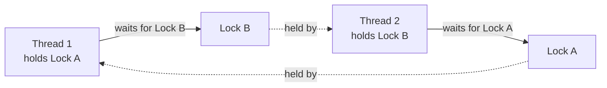

Synchronization questions test whether you can reason precisely about shared mutable state — not just "use a lock", but which lock, on what object, and what actually goes wrong when two threads race. This page builds the vocabulary to answer those questions cleanly.

## Race conditions and critical sections

A **race condition** occurs when the correctness of a result depends on the unpredictable timing of two or more threads accessing shared state. A **critical section** is the piece of code that must not be executed by more than one thread at a time to avoid that race — typically the code between a check and the update that depends on it.

```csharp
private int _counter = 0;
public void Increment() => _counter++; // NOT atomic: read, add, write — three steps
```

`_counter++` looks like one operation but compiles to a read, an add, and a write. Two threads can both read the same value before either writes back, and one increment is lost. This is the canonical race condition example in almost every interview.

> [!KEY]
> A race condition doesn't require exotic timing — it requires only that two threads interleave *somewhere* between reading and writing shared state. It reliably reproduces under load even though it may never show up in a quick manual test, which is exactly why it's dangerous in production.

## lock / Monitor, and what lock compiles to

`lock (obj) { ... }` is syntactic sugar over `Monitor.Enter`/`Monitor.Exit` wrapped in a `try/finally`:

```csharp
lock (obj)
{
    DoWork();
}

// Roughly compiles to:
bool lockTaken = false;
try
{
    Monitor.Enter(obj, ref lockTaken);
    DoWork();
}
finally
{
    if (lockTaken) Monitor.Exit(obj);
}
```

`Monitor` associates a lock with an object's **sync block** (a small header attached to every reference-type instance), making any reference type usable as a lock target without a separate lock object type. Only one thread can hold the lock on a given object at a time; others calling `Monitor.Enter` on the same object block until it's released.

## What to lock on (and what not to)

| Choice | Safe? | Why |
|---|---|---|
| A `private readonly object _lock = new object();` field | ✅ Yes | Dedicated, never exposed, nobody else can accidentally lock on it |
| `lock (this)` | ❌ No | External code holding a reference to your instance can lock on it too, causing unrelated contention or deadlocks you don't control |
| `lock ("some string")` | ❌ No | String literals are interned — the *same* string literal anywhere in the process (even a different assembly) maps to the same object, causing accidental cross-locking |
| `lock (typeof(MyClass))` | ❌ No | `Type` objects are shared/singleton per type across the whole process — same problem as locking a public object |
| A `static readonly object` field | ✅ Yes, for static-level synchronization | Dedicated and private, just scoped to the type rather than the instance |

> [!DANGER]
> `lock (this)` and `lock ("literal")` are two of the most common "looks fine, breaks in production" mistakes. Both lock on an object that isn't exclusively yours, so unrelated code — sometimes in a completely different library — can contend for, or deadlock on, the same lock without either side knowing about the other.

## Comparing synchronization primitives

| Primitive | Cross-process? | Async-friendly | Typical use |
|---|---|---|---|
| `lock` / `Monitor` | No | No — cannot `await` inside | Simple in-process mutual exclusion |
| `Mutex` | Yes (named mutex) | No | Coordinating across processes (e.g. single-instance app check) |
| `Semaphore` | Yes (named semaphore) | No | Limiting concurrent access across processes |
| `SemaphoreSlim` | No | Yes (`WaitAsync`) | Limiting concurrent access within a process, including in async code |
| `ReaderWriterLockSlim` | No | No | Read-heavy shared state: many concurrent readers, exclusive writer |
| `SpinLock` | No | No | Extremely short critical sections where avoiding a context switch is worth busy-waiting |
| `Interlocked` | No | N/A (lock-free) | Single atomic operations on a primitive value (increment, compare-exchange) |

```csharp
// SemaphoreSlim: the async-safe way to limit concurrency
private readonly SemaphoreSlim _gate = new SemaphoreSlim(3);

public async Task CallLimitedAsync()
{
    await _gate.WaitAsync();
    try { await CallDownstreamAsync(); }
    finally { _gate.Release(); }
}
```

> [!TIP]
> A `Mutex` can be named and shared across process boundaries (e.g. to ensure only one instance of a desktop app runs); a `lock`/`Monitor` cannot leave the process. Naming this distinction correctly is a quick way to show you know the difference between OS-level and CLR-level synchronization.

## Interlocked operations

`Interlocked` provides lock-free atomic operations on primitive types, implemented using CPU-level atomic instructions rather than OS synchronization primitives — much cheaper than a full lock for simple cases:

```csharp
private int _counter = 0;
public void Increment() => Interlocked.Increment(ref _counter);

// Compare-and-swap: only updates if the current value matches expected
public bool TryUpdate(int expected, int newValue) =>
    Interlocked.CompareExchange(ref _counter, newValue, expected) == expected;
```

Use `Interlocked` for single-variable atomic updates (counters, flags, simple state machines); reach for `lock` once you need to keep more than one piece of state consistent together.

## volatile and memory barriers

Modern CPUs and the JIT compiler are allowed to reorder reads and writes for performance, as long as a *single* thread can't observe the reordering — but another thread watching the same memory can. `volatile` on a field tells the runtime not to cache it in a register and not to reorder reads/writes around it, ensuring one thread's write becomes visible to other threads promptly, without providing mutual exclusion by itself.

```csharp
private volatile bool _shutdownRequested;

public void RequestShutdown() => _shutdownRequested = true;
public bool ShouldStop() => _shutdownRequested; // guaranteed to see the latest value
```

> [!WARNING]
> `volatile` solves a *visibility* problem, not an *atomicity* problem. `volatile int _counter; _counter++;` is still a non-atomic read-modify-write race — `volatile` only ensures each thread sees the freshest value, it does not make compound operations safe. Use `Interlocked` or a lock for anything beyond a single read or single write.

## Deadlocks: conditions and prevention

A deadlock needs all four **Coffman conditions** simultaneously: mutual exclusion (a resource can only be held by one thread), hold-and-wait (a thread holds one lock while waiting for another), no preemption (locks can't be forcibly taken away), and circular wait (a cycle of threads each waiting on the next).



```csharp
// Thread 1                          // Thread 2
lock (lockA)                          lock (lockB)
{                                      {
    lock (lockB) { ... }                   lock (lockA) { ... }  // circular wait → deadlock
}                                      }
```

| Prevention strategy | How it works |
|---|---|
| Lock ordering | Always acquire locks in the same global order across all code paths, eliminating circular wait |
| Timeouts | `Monitor.TryEnter(obj, timeout)` gives up and backs off instead of waiting forever |
| Lock hierarchy / fewer locks | Reduce the number of distinct locks a single thread needs to hold at once |
| Avoid nested locks entirely | Restructure to hold at most one lock at a time where possible |

## Async-safe locking with SemaphoreSlim

`lock`/`Monitor` **cannot** wrap an `await` — the C# compiler forbids it, because `Monitor.Enter`/`Exit` must run on the same thread, but an `await` may resume its continuation on a *different* thread pool thread, which would attempt to release a lock it never acquired.

```csharp
// Does not compile: "cannot await in the body of a lock statement"
lock (_lock)
{
    await CallAsync(); // compiler error
}

// Correct async-safe equivalent
await _semaphore.WaitAsync();
try { await CallAsync(); }
finally { _semaphore.Release(); }
```

`SemaphoreSlim` with `WaitAsync()`/`Release()` is the standard replacement — it doesn't require thread affinity, so the "acquire" and "release" can legitimately happen on different threads across an `await`.

## Cheat sheet

- A race condition needs shared mutable state plus an interleaving where correctness depends on timing.
- `lock` is sugar over `Monitor.Enter`/`Exit` in a `try/finally` — always exception-safe.
- Lock on a private, dedicated object. Never `lock (this)`, a string literal, or `typeof(X)`.
- `Mutex`/`Semaphore` are OS-level and can be named/cross-process; `SemaphoreSlim`/`lock` are CLR-level and in-process only.
- `SemaphoreSlim.WaitAsync()` is the async-safe substitute for `lock` — you cannot `await` inside a `lock` block.
- `Interlocked` gives lock-free atomic single-variable operations — cheaper than a lock for counters/flags.
- `volatile` guarantees visibility of the latest value across threads, not atomicity of compound operations.
- Deadlocks need mutual exclusion, hold-and-wait, no preemption and circular wait together — break circular wait with consistent lock ordering.
- `ReaderWriterLockSlim` is worth it only when reads vastly outnumber writes and contention is measured, not assumed.

## Common mistakes

| Mistake | Fix |
|---|---|
| `lock (this)` or `lock (someString)` | Use a dedicated `private readonly object` field |
| Assuming `volatile` makes `x++` thread-safe | Use `Interlocked.Increment` or a lock for compound operations |
| Trying to `await` inside a `lock` block | Use `SemaphoreSlim.WaitAsync()`/`Release()` instead |
| Acquiring multiple locks in inconsistent order across methods | Establish and document a single global lock acquisition order |
| Reaching for `ReaderWriterLockSlim` without measuring read/write ratio | Start with a simple `lock`; upgrade only if profiling shows read contention |
| Forgetting `finally` when manually calling `Monitor.Enter`/`Exit` | Prefer the `lock` statement, which guarantees release via compiler-generated `try/finally` |

## Summary

Race conditions arise whenever shared mutable state can be read and written by interleaved threads, and `lock`/`Monitor` remains the default tool for protecting a critical section — as long as you lock on a private, dedicated object rather than `this`, a string, or a `Type`. `Interlocked` and `volatile` solve narrower problems (atomic single operations, and cross-thread visibility) and are not substitutes for a lock around compound state changes. Deadlocks require all four Coffman conditions at once, so consistent lock ordering alone typically prevents them. Because `lock` cannot wrap an `await`, async code needs `SemaphoreSlim` instead — knowing exactly why is what turns "I know the syntax" into "I understand the runtime."

## Top Interview Questions

### Q1. What is a race condition, and why can `count++` be unsafe across threads?

A race condition occurs when the outcome of a program depends on the relative, unpredictable timing of multiple threads accessing shared mutable state, typically because an operation that looks atomic actually isn't. `count++` compiles to three distinct steps — read the current value, add one, write it back — and if two threads both read the same value before either writes back their incremented result, one of the increments is silently lost. This reproduces reliably under real concurrent load even if it's invisible in casual single-threaded testing, which is why relying on "it worked when I tested it" is not a valid argument for thread safety.

### Q2. What does the `lock` statement actually compile down to, and why does it use `try/finally`?

`lock (obj) { body }` compiles to roughly `Monitor.Enter(obj, ref lockTaken)` followed by the body inside a `try` block, with `Monitor.Exit(obj)` in the corresponding `finally` block, gated on whether the lock was actually acquired. The `try/finally` guarantees that the lock is released even if the body throws an exception or returns early — without it, an exception inside the critical section could leave the lock permanently held, deadlocking every other thread that later tries to acquire it. This is also why you should never manually call `Monitor.Enter`/`Exit` without an equivalent `try/finally` — the compiler-generated version of `lock` is exception-safe by construction.

### Q3. Why is `lock (this)` considered an anti-pattern?

Because `this` is a reference that code *outside* your class can also obtain and lock on — any external caller holding a reference to your instance can call `lock (yourInstance) { ... }` themselves, creating contention (or a deadlock) with your internal locking that you have no way to see or control from inside the class. The same problem applies to `lock` on a public field, a string literal (string interning can make identical literals in unrelated code share the same object), or `typeof(SomeClass)` (a single shared `Type` object per type, process-wide). The fix is always a `private readonly object _lock = new object();` field that only your class's own code can ever reference.

### Q4. Explain the four conditions required for a deadlock, and how lock ordering prevents it.

A deadlock requires all four Coffman conditions simultaneously: mutual exclusion (only one thread can hold a given lock), hold-and-wait (a thread holds one lock while waiting to acquire another), no preemption (a lock can't be forcibly taken from the thread holding it), and circular wait (a cycle of threads each waiting on a lock held by the next thread in the cycle). Breaking any one of these prevents deadlock in practice; the cheapest to break is usually circular wait, by establishing a single, consistent global order in which locks must always be acquired (e.g. "always lock the account with the lower ID first"). If every thread acquires locks in the same order, a cycle can never form, because the thread earliest in the ordering will never be waiting on one later in the ordering.

### Q5. Why can't you `await` inside a `lock` block, and what do you use instead?

`lock`/`Monitor.Enter` associates the acquired lock with the specific OS thread that entered it, and `Monitor.Exit` must be called from that same thread — but an `await` can suspend a method and resume its continuation on a *different* thread-pool thread once the awaited operation completes. If this were allowed, the lock might be "released" from a thread that never actually held it, which is undefined and unsafe, so the C# compiler flags it as a compile error. The correct async-safe substitute is `SemaphoreSlim`, using `await semaphore.WaitAsync()` to acquire and `semaphore.Release()` in a `finally` to release — `SemaphoreSlim` has no thread-affinity requirement, so acquire and release can legitimately happen on different threads.

### Q6. What's the difference between `volatile` and `Interlocked`, and when would you use each?

`volatile` solves a **visibility** problem: it prevents the compiler/JIT/CPU from caching a field's value in a register or reordering reads/writes around it, guaranteeing that once one thread writes to it, other threads reading it see the new value promptly rather than a stale cached copy. It does **not** make compound operations atomic — `volatile int x; x++;` is still a race, because the increment is still read-modify-write across three steps. `Interlocked` (`Increment`, `Decrement`, `CompareExchange`, `Add`) provides genuinely atomic single operations on a primitive value using CPU-level atomic instructions, making it the right tool for counters, flags, or compare-and-swap patterns, and is cheaper than a full lock for that narrow class of operations. Use `volatile` for simple flags read/written wholesale by one side each; use `Interlocked` for atomic updates; use a lock once more than one piece of state must change together consistently.

### Q7. When would you reach for `ReaderWriterLockSlim` instead of a plain `lock`?

`ReaderWriterLockSlim` allows multiple threads to hold a **read** lock simultaneously, only requiring exclusivity for a **write** lock, whereas a plain `lock` is always fully exclusive regardless of whether the operation is a read or a write. It's worth the added complexity specifically when reads vastly outnumber writes and you've measured real contention from serializing reads unnecessarily — a config cache or reference data store read constantly but updated rarely is the textbook case. It's not free: it has more overhead per acquisition than a simple `Monitor`-based lock, so applying it to a lightly-contended or write-heavy structure can make things slower, not faster; the senior answer names the read/write ratio as the deciding factor, not just "reads and writes exist."

### Q8. A production service occasionally hangs completely under load, with no CPU spike, and thread dumps show two threads each waiting on a lock the other holds. What's happening and how do you fix it?

This is a classic deadlock: two threads have each acquired one lock and are now blocked waiting for the other's lock, satisfying all four deadlock conditions, and neither can ever proceed, which explains why CPU usage stays flat — the threads aren't computing, they're just blocked. The immediate fix is to identify the two lock acquisition orders from the thread dump's stack traces and enforce a single consistent global order everywhere both locks are used together, eliminating the circular wait. As a safety net while the ordering fix is verified, `Monitor.TryEnter(obj, timeout)` can be used to fail fast and retry/back off rather than blocking indefinitely, though ordering is the real fix, not a band-aid — timeouts just convert a silent hang into an observable, retryable failure.

### Q9. Why is `Interlocked.CompareExchange` useful beyond simple counters?

`CompareExchange` is a compare-and-swap primitive: it atomically checks whether a location currently holds an expected value, and if so, replaces it with a new value, returning the value that was actually there beforehand. This underpins lock-free algorithms: you read the current state, compute a new state based on it, then attempt `CompareExchange` to commit — if another thread changed the value in between (indicated by the return value not matching your originally-read value), you retry the whole read-compute-commit cycle instead of blocking. This "optimistic concurrency" pattern avoids the cost of an OS-level lock entirely for cases where contention is low and retries are cheap, and is the building block behind much of `System.Collections.Concurrent`'s lock-free behaviour.

### Q10. What's the practical difference between a `Mutex` and a `lock`/`Monitor`, and when do you need a `Mutex` specifically?

`lock`/`Monitor` is purely a CLR-level, in-process construct — it can only coordinate threads within the same process and carries lower overhead because it never involves the OS kernel unless there's actual contention. A `Mutex` is backed by an OS kernel object and, when given a system-wide name, can be used to coordinate across **separate processes** — the canonical example is ensuring only one instance of a desktop application runs at a time, checked via a named `Mutex` at startup before any window is created. If your synchronization need never crosses a process boundary — which is the overwhelming majority of application code — `lock`/`Monitor` (or `SemaphoreSlim` for the async case) is cheaper and simpler; reach for `Mutex` (or named `Semaphore`) specifically when two independent processes need to agree on exclusive access to something.
