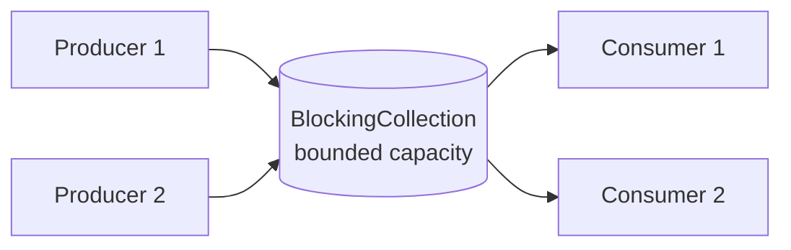

Once you know how to lock correctly, the next question is usually "why write your own locking at all?" — the BCL ships a set of collections and pipelines purpose-built for concurrent access, each with a specific shape of problem it solves best.

## ConcurrentDictionary

`ConcurrentDictionary<TKey, TValue>` allows safe concurrent reads and writes without an external lock, using fine-grained internal locking (striped across buckets) rather than one lock for the whole structure. Its most misunderstood methods are `GetOrAdd` and `AddOrUpdate`.

```csharp
private readonly ConcurrentDictionary<string, ExpensiveObject> _cache = new();

public ExpensiveObject GetOrCreate(string key) =>
    _cache.GetOrAdd(key, k => new ExpensiveObject(k)); // factory MAY run more than once
```

> [!DANGER]
> The factory delegate passed to `GetOrAdd`/`AddOrUpdate` is **not** guaranteed to run exactly once under contention. If two threads call `GetOrAdd` for the same missing key simultaneously, both factories may execute — only one result is actually stored, and the other is discarded — but any side effects in the discarded factory (a network call, a counter increment, a log write) still happened. If the factory must run exactly once, use `Lazy<T>` as the stored value, or an external lock around the check-and-create.

```csharp
// Guaranteed single execution of the expensive construction, even under contention
private readonly ConcurrentDictionary<string, Lazy<ExpensiveObject>> _cache = new();

public ExpensiveObject GetOrCreateSafe(string key)
{
    var lazy = _cache.GetOrAdd(key, k => new Lazy<ExpensiveObject>(() => new ExpensiveObject(k)));
    return lazy.Value; // Lazy<T> itself guarantees single execution
}
```

## ConcurrentQueue, ConcurrentStack and ConcurrentBag

| Collection | Order | Best for |
|---|---|---|
| `ConcurrentQueue<T>` | FIFO | Producer-consumer where order matters (e.g. work items processed in arrival order) |
| `ConcurrentStack<T>` | LIFO | Recently-added items should be processed first (undo stacks, work-stealing) |
| `ConcurrentBag<T>` | Unordered | Best when items are typically added and removed by the *same* thread (thread-local free lists); poor fit for cross-thread producer/consumer |

`ConcurrentBag<T>` optimizes for the case where a thread mostly consumes what it itself produced, using per-thread local queues internally — using it as a general cross-thread queue is a common performance mistake, since consuming from a bag populated entirely by *other* threads falls back to slower shared-list scanning.

## BlockingCollection and the producer-consumer pattern

`BlockingCollection<T>` wraps a `ConcurrentQueue<T>` (or another `IProducerConsumerCollection<T>`) with **blocking** semantics: `Take()` blocks the calling thread until an item is available, and `Add()` can block if a bounded capacity is full — giving you backpressure for free.

```csharp
public class WorkQueue
{
    private readonly BlockingCollection<WorkItem> _queue = new(boundedCapacity: 100);

    public void Produce(WorkItem item) => _queue.Add(item); // blocks if queue is full
    public void CompleteAdding() => _queue.CompleteAdding();

    public void ConsumeLoop()
    {
        foreach (var item in _queue.GetConsumingEnumerable()) // blocks until item or completion
        {
            Process(item);
        }
    }
}
```



`BlockingCollection` is entirely thread/blocking based — good for classic worker-thread pipelines, but not async-friendly (`Take()` blocks the thread, there's no `TakeAsync()`).

## Channels — the modern async producer-consumer

`System.Threading.Channels` is the async-first replacement for `BlockingCollection` in modern code: producers `WriteAsync`, consumers `ReadAsync`/`await foreach`, and nobody blocks a thread while waiting.

```csharp
var channel = Channel.CreateBounded<WorkItem>(new BoundedChannelOptions(100)
{
    FullMode = BoundedChannelFullMode.Wait // producer awaits instead of blocking a thread
});

// Producer
await channel.Writer.WriteAsync(new WorkItem());
channel.Writer.Complete();

// Consumer
await foreach (var item in channel.Reader.ReadAllAsync())
{
    await ProcessAsync(item);
}
```

| Aspect | BlockingCollection | Channel |
|---|---|---|
| Consumption model | Synchronous, blocks a thread | Asynchronous, `await`-based |
| Backpressure | Bounded capacity blocks producer thread | Bounded capacity awaits producer, or configurable drop/wait behaviour |
| Fits async pipelines | Poorly — needs a dedicated thread per consumer | Naturally — works with `Task`-based consumers |
| Introduced | Original TPL era | .NET Core 3.0+ |

> [!TIP]
> When asked "how would you build a producer-consumer pipeline in modern .NET", lead with `Channel<T>` rather than `BlockingCollection` — it's the current idiomatic answer and demonstrates you're not working from outdated knowledge.

## Parallel.For / Parallel.ForEach and partitioning

`Parallel.For`/`Parallel.ForEach` split a loop's iterations across multiple threads automatically, using an internal **partitioner** to divide the work into chunks so threads aren't constantly fighting over the next index.

```csharp
Parallel.For(0, items.Count, new ParallelOptions { MaxDegreeOfParallelism = 4 }, i =>
{
    Process(items[i]);
});
```

By default, the partitioner adapts chunk size to workload — many small iterations get batched together to reduce per-item scheduling overhead, while a few expensive iterations are handed out one at a time. Setting `MaxDegreeOfParallelism` caps how many threads participate; without a measured reason, leaving it unset lets the runtime use all available cores.

## PLINQ and when it hurts

PLINQ (`.AsParallel()`) parallelizes LINQ queries, but it is not a free performance upgrade:

| PLINQ helps when | PLINQ hurts when |
|---|---|
| The per-element work is genuinely CPU-heavy | Per-element work is trivial (e.g. a simple filter/select) — partitioning and merging overhead exceeds the work itself |
| The collection is large enough to amortize partitioning cost | The collection is small |
| Operations are independent (no shared mutable state) | The query has ordering requirements (`AsOrdered()` adds real overhead) |
| You've measured a real win | You're guessing it will be faster |

```csharp
// Likely faster: expensive per-item CPU work
var results = items.AsParallel().Select(x => ExpensiveComputation(x)).ToList();

// Likely slower: trivial per-item work, parallel overhead dominates
var results = items.AsParallel().Where(x => x.IsActive).ToList();
```

> [!WARNING]
> PLINQ's own documentation is blunt about this: always measure before and after. It's common for `.AsParallel()` on a cheap query to be *slower* than the sequential version, purely from partitioning and thread coordination overhead.

## Degree of parallelism and false sharing

**Degree of parallelism** is how many threads actively process work concurrently — too low under-utilizes cores, too high causes context-switch overhead and contention on shared resources (memory bandwidth, downstream services, locks). Start near `Environment.ProcessorCount` for CPU-bound work and tune down if you see diminishing returns or contention elsewhere (like a shared connection pool).

**False sharing** is a subtle performance bug: two threads write to *different* variables that happen to sit on the **same CPU cache line** (typically 64 bytes). Even though there's no logical data race, each write invalidates the whole cache line for the other core, forcing expensive cache-coherency traffic between cores.

```csharp
// Risk of false sharing: counters[0] and counters[1] likely share a cache line
public class Counters { public long[] PerThreadCount = new long[4]; }

// Mitigation: pad each counter to its own cache line
[StructLayout(LayoutKind.Explicit, Size = 64)]
public struct PaddedLong { [FieldOffset(0)] public long Value; }
```

## Lock-free basics: compare-and-swap

Lock-free structures avoid OS locks by using CPU-level **compare-and-swap (CAS)** instructions (exposed in .NET as `Interlocked.CompareExchange`): read the current state, compute a new state, then attempt to atomically swap it in only if nothing else changed the state in between — retrying on failure instead of blocking. Most of `System.Collections.Concurrent` is built internally on exactly this pattern, which is why these collections scale better under contention than a coarse `lock`-protected `Dictionary`.

## Comparison at a glance

| Tool | Concurrency model | Best for |
|---|---|---|
| `ConcurrentDictionary` | Lock-free reads, striped locks for writes | Shared key-value state under concurrent access |
| `ConcurrentQueue`/`Stack` | Lock-free (CAS-based) | Simple cross-thread FIFO/LIFO handoff |
| `ConcurrentBag` | Per-thread local storage | Same-thread produce-and-consume patterns |
| `BlockingCollection` | Thread-blocking | Classic synchronous producer-consumer with backpressure |
| `Channel<T>` | Async, non-blocking | Modern async producer-consumer pipelines |
| `Parallel.For`/`ForEach` | Data parallelism across threads | CPU-bound loops over large collections |
| PLINQ | Data parallelism via LINQ | CPU-heavy, independent per-element LINQ work |

## Cheat sheet

- `ConcurrentDictionary.GetOrAdd`'s factory can run more than once under contention — use `Lazy<T>` if it must run exactly once.
- `ConcurrentBag` is optimized for same-thread produce/consume, not general cross-thread queuing — prefer `ConcurrentQueue` for that.
- `BlockingCollection` blocks threads; `Channel<T>` is the async-native modern replacement — prefer channels for new async pipelines.
- Bounded capacity in either gives you backpressure automatically.
- `Parallel.For`/`ForEach` partition work across cores automatically — set `MaxDegreeOfParallelism` only with a measured reason.
- PLINQ helps when per-element work is genuinely expensive and the collection is large; it can be slower than sequential LINQ otherwise — always measure.
- False sharing silently kills performance when unrelated variables share a CPU cache line — pad hot per-thread counters.
- Most concurrent collections are internally lock-free, built on `Interlocked.CompareExchange` retry loops.

## Common mistakes

| Mistake | Fix |
|---|---|
| Assuming `GetOrAdd`'s factory runs exactly once | Wrap the value in `Lazy<T>`, or accept idempotent factories only |
| Using `ConcurrentBag` as a general work queue | Use `ConcurrentQueue` or `Channel<T>` for cross-thread handoff |
| Blocking threads with `BlockingCollection` inside an async pipeline | Use `Channel<T>` with `WriteAsync`/`ReadAsync` instead |
| Slapping `.AsParallel()` on every LINQ query | Measure — apply only where per-element work is genuinely CPU-heavy |
| Ignoring `MaxDegreeOfParallelism` on a shared/limited downstream resource | Cap parallelism to what the downstream dependency can actually handle |
| Not noticing false sharing in a per-thread counters array | Pad hot fields to separate cache lines, or use `[ThreadStatic]` per-thread instances instead |

## Summary

The BCL's concurrent collections each target a specific access pattern: `ConcurrentDictionary` for shared key-value state (with the important caveat that `GetOrAdd`'s factory isn't guaranteed to run once), `ConcurrentQueue`/`Stack` for lock-free FIFO/LIFO handoff, and `ConcurrentBag` specifically for same-thread produce-and-consume. `BlockingCollection` remains useful for classic thread-based producer-consumer pipelines, but `Channel<T>` is the async-native successor for anything built around `async`/`await`. `Parallel.For`/`ForEach` and PLINQ parallelize CPU-bound work automatically, but they are not free — measure before assuming they help, and watch for subtler issues like false sharing when tuning per-thread state.

## Top Interview Questions

### Q1. Why is `ConcurrentDictionary.GetOrAdd`'s factory delegate not guaranteed to run exactly once?

`ConcurrentDictionary` is designed for high concurrent throughput, and guaranteeing exactly-once factory execution for every key would require locking around the entire check-then-create sequence, defeating much of the performance benefit. Instead, if two threads call `GetOrAdd` for the same absent key at nearly the same time, both may independently invoke the factory, compute a value, and race to insert it — only one insertion wins and is returned to both callers, while the other computed value is simply discarded. This is fine if the factory is a pure, side-effect-free construction, but if it performs a side effect (writes to a database, increments a metric, opens a network connection), that side effect happens even for the discarded value — a classic bug when developers assume "GetOrAdd" means "create once".

### Q2. How would you guarantee a cached value is constructed exactly once even under concurrent `GetOrAdd` calls?

Store a `Lazy<T>` as the dictionary's value instead of the raw value itself: `ConcurrentDictionary<string, Lazy<T>>`. `GetOrAdd`'s factory may still be called more than once, but it only constructs a lightweight `Lazy<T>` wrapper each time (cheap, no side effect) — the *actual* expensive construction happens inside `Lazy<T>.Value`, which `Lazy<T>` itself guarantees runs exactly once regardless of how many threads access it concurrently (with the default thread-safety mode). This pattern is the standard idiom for "expensive-to-create, must-run-once" cached values in a `ConcurrentDictionary`.

### Q3. What's the difference between `BlockingCollection<T>` and `Channel<T>`, and which would you choose for a new async pipeline?

Both implement a producer-consumer pattern with optional bounded capacity for backpressure, but `BlockingCollection<T>` is thread-blocking — its `Take()` call blocks the calling thread until an item is available, which means each consumer needs a dedicated (often non-pool) thread and doesn't compose with `async`/`await`. `Channel<T>` is async-native: `ReadAsync`/`WriteAsync` and `await foreach` over `ReadAllAsync()` suspend without blocking a thread, fitting naturally into an async pipeline built on `Task`. For any new code targeting modern .NET, `Channel<T>` is the better default — `BlockingCollection` is mostly relevant for legacy, thread-based worker pipelines or interop with synchronous code that can't be made async.

### Q4. When does PLINQ (`.AsParallel()`) make a query slower instead of faster?

PLINQ adds overhead for partitioning the source sequence across threads and merging results back together, plus the cost of scheduling work on multiple threads. If the per-element operation is cheap (a simple comparison, a small string check), that overhead can easily exceed the time saved by parallelizing, making the parallel version slower than a straightforward sequential LINQ query. It also gets worse if you add `AsOrdered()` unnecessarily (preserving order requires extra bookkeeping) or if the source collection is small enough that there isn't enough work to amortize the partitioning cost. The rule to state out loud: PLINQ pays off when per-element work is genuinely CPU-heavy and the collection is large — otherwise, measure first, because intuition is frequently wrong here.

### Q5. What guarantees do concurrent collections provide, and what do they not make atomic?

`System.Collections.Concurrent` types make their **individual operations** thread-safe: `TryAdd`, `TryTake`, `Enqueue`, `TryDequeue`, `GetOrAdd`, and similar methods can be called concurrently without corrupting the collection's internal state. They do not automatically make a multi-step workflow atomic. Code like `if (!dict.ContainsKey(k)) dict[k] = value;` still has a check-then-act race because another thread can insert between the two calls. Use the collection's compound atomic APIs (`GetOrAdd`, `AddOrUpdate`, `TryUpdate`) when they express the operation, and use an external lock or redesign the state when multiple collections or several related fields must change together consistently.

### Q6. Design a producer-consumer pipeline that ingests messages from a queue and processes them with bounded concurrency, using modern .NET.

I'd use a `Channel<T>` created with `Channel.CreateBounded<Message>(capacity)` to decouple the ingestion loop (the producer, reading from the external queue and calling `WriteAsync`) from a pool of consumer tasks reading via `await foreach (var msg in channel.Reader.ReadAllAsync())`. Bounded capacity with `BoundedChannelFullMode.Wait` gives automatic backpressure — if consumers fall behind, the producer's `WriteAsync` naturally awaits instead of buffering unboundedly in memory. I'd start several consumer tasks (bounded, e.g. `Parallel.ForEachAsync` over a fixed range, or a fixed number of `Task.Run(ConsumeLoopAsync)` calls) reading from the same channel reader, since multiple readers can safely drain a single `Channel<T>` concurrently, and thread a shared `CancellationToken` through both sides for clean shutdown via `channel.Writer.Complete()`.

### Q7. Why might `ConcurrentBag<T>` perform worse than `ConcurrentQueue<T>` for a typical producer-consumer scenario?

`ConcurrentBag<T>` is internally optimized around the assumption that a thread will mostly consume the items *it itself* produced, using thread-local storage to avoid contention in that specific pattern. In a typical producer-consumer setup, producers and consumers are different threads — items are always added by one thread and removed by another — which is exactly the case `ConcurrentBag` is not optimized for; consuming from a bag populated by other threads falls back to scanning other threads' local lists, which is slower than `ConcurrentQueue`'s design, built around efficient cross-thread FIFO handoff via lock-free enqueue/dequeue operations. The practical guidance: default to `ConcurrentQueue` for producer-consumer; reserve `ConcurrentBag` for object-pooling-style patterns where same-thread reuse is the norm.

### Q8. How does `Parallel.For` decide how to split work across threads, and when would you override its defaults?

`Parallel.For`/`ForEach` use an internal partitioner that divides the iteration range (or source collection) into chunks handed out to worker threads drawn from the thread pool, adapting chunk size based on observed workload — many small, cheap iterations get batched into larger chunks to amortize per-item scheduling overhead, while a smaller number of expensive iterations may be handed out closer to one-at-a-time. You'd override the default `MaxDegreeOfParallelism` when you have a specific, measured reason: for example, to avoid the parallel loop from monopolizing every core in a service that also needs to serve concurrent requests, or to cap parallel calls to a downstream resource (a database, an external API) that can only handle a limited number of concurrent connections regardless of how many CPU cores are free.

### Q9. What is the underlying mechanism that lets `ConcurrentDictionary` and `ConcurrentQueue` avoid full locks for most operations?

They're built primarily on **compare-and-swap (CAS)**, exposed in .NET as `Interlocked.CompareExchange`, along with more targeted, fine-grained locking only where truly needed (`ConcurrentDictionary` stripes a small number of internal locks across buckets rather than using one lock for the whole table). The general pattern is optimistic: read the current state, compute the desired next state, then attempt to atomically swap it in only if the state hasn't changed since it was read; if another thread got there first, retry the whole read-compute-swap cycle instead of blocking and waiting. This scales significantly better under contention than a single coarse `lock` around a plain `Dictionary`, because threads that lose the race retry cheaply instead of queueing behind a blocked thread.

### Q10. Your team parallelized a data-processing loop with `Parallel.ForEach` and it got slower in production, though it was faster locally. What would you investigate?

First, check whether the per-item work is actually CPU-bound and independent locally versus in production — if each iteration calls a downstream service or database, production concurrency is likely bottlenecked by that shared resource's connection limits or rate limits, and adding more parallel threads just increases contention and timeouts rather than throughput. Second, check `MaxDegreeOfParallelism` — if left unset, `Parallel.ForEach` will use as many cores as are available, which locally might be fine but in a production container with fewer allocated cores (or shared with other workloads) could cause oversubscription and context-switch overhead. Third, check for shared mutable state accessed inside the loop body without proper synchronization or with heavy lock contention, and check for false sharing if there's a per-iteration write to a shared array of counters — all of these can turn a "parallel win" locally into a net loss under real production conditions and concurrency levels.
