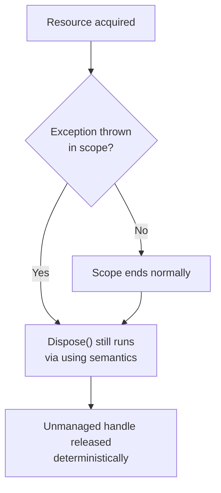

Exceptions and `IDisposable` show up in nearly every C# interview, often as a quick warm-up question that turns into a deeper discussion about resource management. Getting the details exactly right — stack traces, filters, deterministic disposal — is a fast way to demonstrate solid fundamentals.

## The exception hierarchy

All exceptions derive from `System.Exception`. Two broad branches matter in practice: `SystemException` (thrown by the runtime/BCL, generally recoverable-ish) and `ApplicationException` (intended for user-defined exceptions, though in practice most people just derive from `Exception` directly — `ApplicationException` never gained real adoption).

| Exception type | Meaning |
|---|---|
| `ArgumentException` | An argument's value is invalid for the operation |
| `ArgumentNullException` | A required argument was `null` |
| `ArgumentOutOfRangeException` | An argument is outside its acceptable range |
| `InvalidOperationException` | The object is in a state that doesn't support the call (e.g. modifying a collection while enumerating) |
| `NullReferenceException` | Dereferenced a `null` reference — almost always a bug, not something you catch |
| `IndexOutOfRangeException` | Array/index access outside bounds |
| `NotSupportedException` | The member exists but this implementation doesn't support it |
| `NotImplementedException` | Placeholder for unfinished code — should not reach production |
| `TimeoutException` | An operation exceeded its allotted time |
| `OperationCanceledException` | Raised when a `CancellationToken` cancellation is observed |
| `AggregateException` | Wraps one or more exceptions from parallel/task operations |
| `IOException` | File, stream, or network I/O failure |

> [!KEY]
> Catch the most specific exception type you can meaningfully handle. Catching bare `Exception` (or worse, `catch {}`) hides bugs and makes debugging production incidents much harder.

## try/catch/finally and exception filters

`finally` always runs — whether the try block succeeds, throws, or even returns early — making it the right place for cleanup that isn't already covered by `using`. Exception filters (`when`) let you catch conditionally without unwinding the stack if the condition is false, which also preserves more diagnostic context (e.g. it can inspect state at the throw point before unwinding, useful for the classic "log then rethrow" pattern):

```csharp
try
{
    return await CallDownstreamAsync();
}
catch (HttpRequestException ex) when (ex.StatusCode == HttpStatusCode.TooManyRequests)
{
    await Task.Delay(RetryDelay);
    return await CallDownstreamAsync();
}
catch (HttpRequestException ex)
{
    _logger.LogError(ex, "Downstream call failed");
    throw;
}
```

## throw vs throw ex

This is one of the most reliable "do they actually know C#" questions.

```csharp
try { DoWork(); }
catch (Exception ex)
{
    throw;      // preserves the original stack trace
    throw ex;   // resets the stack trace to this line — loses where it really happened
}
```

`throw;` rethrows the current exception, preserving its original stack trace all the way to where it was first thrown. `throw ex;` throws the *same exception object*, but resets its stack trace as if it originated at that `throw ex` line — you lose the original call path, which makes production debugging significantly harder.

> [!DANGER]
> `throw ex;` is a classic anti-pattern that silently destroys diagnostic information. It compiles fine and "works", which is exactly why it survives in codebases — always use bare `throw;` to rethrow, or `ExceptionDispatchInfo.Capture(ex).Throw()` if you need to rethrow later from a different context (such as from inside a stored exception in a `Task`).

## Custom exceptions

Define a custom exception when the caller needs to programmatically distinguish and react to a specific failure mode, not just log a message:

```csharp
public class InsufficientFundsException : Exception
{
    public decimal Shortfall { get; }

    public InsufficientFundsException(decimal shortfall)
        : base($"Insufficient funds: short by {shortfall:C}")
    {
        Shortfall = shortfall;
    }
}
```

Include the standard constructors (parameterless, message, message+innerException) for compatibility with generic exception-handling code and serialization tooling, and only add custom properties when callers genuinely need structured data beyond the message string.

## When not to use exceptions for control flow

Exceptions model **exceptional** conditions — things that should not routinely happen. Using them for expected, frequent outcomes (e.g. "user not found" during a normal lookup) is both a design smell and a performance problem.

| Approach | Cost | Use when |
|---|---|---|
| Throwing an exception | Expensive — stack unwinding, stack trace capture (~microseconds, orders of magnitude slower than a normal return) | Truly unexpected failures |
| Returning `null` / `Maybe<T>` | Cheap | Absence is a normal, expected outcome |
| `TryParse`-style `bool TryX(out T value)` | Cheap, no allocation on the failure path | High-frequency validation/parsing |
| Result/Either type (`Result<T, TError>`) | Cheap, explicit | Domain logic with multiple expected failure modes |

```csharp
// Expensive and semantically wrong: "not found" is a normal case here
public User GetUser(string id)
{
    var user = _repo.Find(id);
    if (user is null) throw new UserNotFoundException(id);
    return user;
}

// Better: absence is expected, not exceptional
public bool TryGetUser(string id, out User user)
{
    user = _repo.Find(id);
    return user is not null;
}
```

> [!TIP]
> A senior answer names the mechanism, not just the rule: "exceptions unwind the stack and capture a trace, which costs real time — reserve them for truly unexpected states, and use `TryX` or a result type for expected branching."

## The Dispose pattern

`IDisposable` provides deterministic cleanup for unmanaged resources (file handles, sockets, database connections, unmanaged memory) that the garbage collector doesn't know how to release promptly, because the GC only tracks managed memory.

```csharp
public class FileProcessor : IDisposable
{
    private FileStream _stream;
    private bool _disposed;

    public FileProcessor(string path) => _stream = File.OpenRead(path);

    public void Dispose()
    {
        Dispose(true);
        GC.SuppressFinalize(this); // no finalizer work needed once disposed
    }

    protected virtual void Dispose(bool disposing)
    {
        if (_disposed) return;
        if (disposing)
        {
            _stream?.Dispose(); // release managed IDisposable members
        }
        _disposed = true;
    }
}
```

The `protected virtual Dispose(bool)` overload exists so derived classes can add their own cleanup while still participating in the base class's disposal logic — it's the standard shape recommended by the .NET guidelines whenever a class might be subclassed.

## using statements, using declarations and IAsyncDisposable

```csharp
// Classic using statement — scoped to the block
using (var conn = new SqlConnection(connStr))
{
    conn.Open();
}

// using declaration (C# 8+) — disposed at end of enclosing scope, less nesting
using var conn = new SqlConnection(connStr);
conn.Open();

// IAsyncDisposable — for resources with async cleanup (flushing a stream, closing a connection)
await using var conn = new AsyncConnection();
```

`IAsyncDisposable`'s `DisposeAsync()` matters for resources whose cleanup genuinely needs to be asynchronous (flushing buffered data over the network) rather than blocking the calling thread inside a synchronous `Dispose()`.



## Finalizers — why you almost never write one

A finalizer (`~ClassName()`) is a safety net the GC calls if `Dispose()` was never invoked, to release unmanaged resources before the object's memory is reclaimed. It should only appear on a class that **directly** owns an unmanaged handle (e.g. wrapping a raw `SafeHandle` yourself) — which is rare, since `SafeHandle` and its derivatives already do this correctly.

> [!WARNING]
> Finalizers add real cost: an object with a finalizer survives at least one extra GC generation (it's promoted to a finalization queue instead of being collected immediately), delaying reclamation and adding GC pressure. If your class only holds other `IDisposable` objects (streams, connections), do **not** write a finalizer — just implement `Dispose()` and rely on the owned objects' own finalizers as the safety net.

## Cheat sheet

- Catch specific exception types; avoid bare `catch (Exception)` unless rethrowing or logging at a boundary.
- `throw;` preserves the stack trace. `throw ex;` resets it — never use it to rethrow.
- Exception filters (`when`) let you branch on exception state without unwinding first.
- Exceptions are for the unexpected; use `TryX`/`out` or result types for expected, frequent outcomes.
- `IDisposable.Dispose()` is for deterministic release of unmanaged/scarce resources — the GC doesn't know about file handles or sockets.
- `using`/`using var`/`await using` guarantee `Dispose`/`DisposeAsync` runs even on exception.
- Implement `protected virtual Dispose(bool disposing)` if the class might be subclassed.
- Only write a finalizer if the class directly owns an unmanaged handle — it's rarely needed.
- `GC.SuppressFinalize(this)` in `Dispose()` avoids unnecessary finalization queue overhead.

## Common mistakes

| Mistake | Fix |
|---|---|
| `throw ex;` to rethrow | Use bare `throw;` to preserve the original stack trace |
| Using exceptions for expected control flow (e.g. "not found") | Use `TryX(out value)` or a result/option type |
| Catching `Exception` and swallowing it silently | Catch specific types; log and rethrow if you can't truly handle it |
| Forgetting to dispose an `IDisposable` field inside your own `Dispose` | Implement the full dispose pattern, disposing owned members |
| Writing a finalizer on a class that only holds managed `IDisposable` objects | Remove it — those objects already have their own finalizers as a safety net |
| Not calling `GC.SuppressFinalize(this)` when a finalizer exists | Call it in `Dispose()` once cleanup is done |
| Blocking synchronously inside `DisposeAsync` | Do the async cleanup properly with `await`, don't call `.Result`/`.Wait()` |

## Summary

The exception hierarchy exists to model unexpected failure, not routine branching — use `TryX` patterns or result types for the latter, and reserve `throw`/`catch` for genuine faults. `throw;` versus `throw ex;` is a small syntactic difference with a large diagnostic consequence: always rethrow bare. `IDisposable` and the Dispose pattern give you deterministic cleanup of unmanaged and scarce resources that the garbage collector cannot manage on its own schedule, and `using`/`using var`/`await using` guarantee that cleanup runs even when an exception is thrown. Finalizers are a rarely-needed safety net, not a default addition to every class.

## Top Interview Questions

### Q1. What is the difference between `throw;` and `throw ex;` inside a catch block?

`throw;` rethrows the currently-caught exception object unchanged, preserving its original stack trace all the way back to where it was first thrown — this is what you should almost always use. `throw ex;` throws the same exception object but resets its `StackTrace` property to originate at that line, discarding the information about where the exception actually occurred. In production, this difference is the reason a stack trace in your logs sometimes points to an unhelpful rethrow site instead of the real bug location. If you need to rethrow later, outside the original catch's scope, use `ExceptionDispatchInfo.Capture(ex).Throw()`, which preserves the trace across that boundary too.

### Q2. When should you catch an exception versus let it propagate?

Catch an exception only if you can do something meaningful at that point: retry, fall back to a default, translate it into a domain-specific exception, or log it at a boundary (like the outermost middleware or a top-level handler) before it's reported. If you can't add value, let it propagate — catching and swallowing silently (or catching `Exception` broadly "just in case") hides bugs and turns debugging into guesswork. A good rule: catch specific types close to where you can react to them, and have one broad catch-all only at the application's boundary for logging/telemetry, always rethrowing or converting there, never silently discarding.

### Q3. Why shouldn't exceptions be used for routine control flow, like "record not found"?

Throwing and catching an exception is dramatically more expensive than a normal return — it involves capturing a stack trace, unwinding the call stack frame by frame, and running any `finally` blocks along the way, typically orders of magnitude slower than an `if` check or an `out` parameter. Beyond performance, it's a design smell: an expected, frequent outcome like "no matching record" is not exceptional, so throwing for it forces every caller into exception-handling machinery for something that is really just a boolean branch. The idiomatic alternative is a `TryGetX(out T value)` method, a nullable return, or a `Result<T, TError>` type — all of which make the "not found" case an explicit, cheap part of the normal control flow.

### Q4. What problem does `IDisposable` solve that the garbage collector doesn't?

The GC only knows about managed memory and reclaims it on its own schedule, whenever a collection happens to run — it has no visibility into unmanaged resources like OS file handles, socket handles, GDI handles, or unmanaged memory blocks. Left alone, those resources would only be released whenever a finalizer eventually runs, which could be much later than intended, exhausting limited OS resources (like file handles or connections) well before memory pressure triggers a collection. `IDisposable.Dispose()` provides a deterministic, caller-controlled point at which those unmanaged resources are released immediately, typically enforced via a `using` block or `using` declaration so cleanup happens even if an exception is thrown.

### Q5. Walk through the correct implementation of the Dispose pattern for a class with both managed and unmanaged resources.

You implement `IDisposable.Dispose()` as a public method that calls a `protected virtual void Dispose(bool disposing)` and then `GC.SuppressFinalize(this)`. Inside `Dispose(bool disposing)`, if `disposing` is true (called from `Dispose()`, not the finalizer), you dispose owned managed `IDisposable` members; unmanaged resources (raw handles) are released unconditionally regardless of `disposing`, since they must be freed even if the finalizer is what's calling in. A finalizer `~ClassName()` calls `Dispose(false)` only if the class directly owns an unmanaged handle — most classes never need one because they only hold other `IDisposable` objects, which already have their own cleanup and, if applicable, their own finalizers as the ultimate safety net.

### Q6. What is an exception filter (`catch (Ex ex) when (...)`) and why would you use one over checking the condition inside the catch block?

An exception filter is the `when` clause after a `catch` type pattern — the runtime evaluates the condition *before* deciding whether to unwind the stack into that catch block at all. If the filter returns false, the exception continues propagating past this catch as if it weren't there, and the search continues for another handler. This matters because filters can inspect the exception (and even ambient state) at the point of the throw without having already unwound the stack — useful for conditional retry logic (like retrying only on HTTP 429) and for debugging, since a debugger can still break at the original throw site if no filter matches, rather than always landing inside a catch block that then decides to rethrow.

### Q7. Your team has a class with a finalizer that only wraps a `List<Stream>` of already-`IDisposable` streams. What's wrong with this, and how would you fix it?

The finalizer is unnecessary and harmful: it only makes sense when a class directly owns an unmanaged handle, and each `Stream` in the list already manages its own unmanaged resource (and has its own finalizer as backup) — this wrapper class holds no unmanaged resource itself. Adding a finalizer here forces every instance to be promoted to the finalization queue on collection instead of being reclaimed immediately, adding an extra GC generation of delay and unnecessary work, purely to (redundantly) call `Dispose` on objects that would clean themselves up anyway. The fix is to remove the finalizer entirely, implement `IDisposable.Dispose()` to iterate and dispose each stream, and rely on `using`/`using var` at call sites for deterministic cleanup.

### Q8. What's the difference between `using`, the `using` declaration, and `await using`?

The classic `using (var x = ...) { }` statement scopes disposal to the end of that explicit block, calling `Dispose()` in a compiler-generated `finally`, even if an exception is thrown inside. The `using` declaration (`using var x = ...;`, C# 8+) disposes at the end of the *enclosing* scope (the method or block it's declared in) rather than requiring explicit braces, reducing nesting when you have several disposables in sequence. `await using` is for types implementing `IAsyncDisposable`, calling `DisposeAsync()` instead — needed when cleanup itself must be asynchronous, such as flushing buffered writes over a network connection, so you don't block a thread inside a synchronous `Dispose()`.

### Q9. How would you decide whether a new type you're writing needs a custom exception class versus reusing a built-in one?

Reuse a built-in exception (`ArgumentException`, `InvalidOperationException`, etc.) when the failure is a generic, well-understood category that callers handle the same way regardless of your specific type — it reduces API surface and callers likely already know how to handle it. Create a custom exception when callers need to programmatically distinguish this specific failure from others and possibly extract structured data from it (like `InsufficientFundsException.Shortfall`) to drive different behavior, not just a different message string. Always include the conventional constructors and derive from `Exception` (rarely `ApplicationException`, which never gained real traction), and avoid creating a new exception type purely to carry a custom message when an existing type with a good message would do.

### Q10. In a production incident, you see a `NullReferenceException` with a stack trace pointing to a `catch` block instead of the code that actually failed. What likely happened, and how do you prevent it in the future?

This is the classic symptom of `throw ex;` somewhere in the call chain — the original exception was caught, and instead of being rethrown with `throw;`, it was rethrown with `throw ex;`, which reset the stack trace to originate at that rethrow line, hiding where the null dereference actually happened. To prevent it, a code review rule (and ideally an analyzer/lint rule, since Roslyn analyzers can flag this) that bans `throw ex;` in favor of bare `throw;` closes the gap; if the exception genuinely needs to be captured and rethrown later (e.g. from inside a `Task`'s continuation or a queued callback), `ExceptionDispatchInfo.Capture(ex).Throw()` preserves the original trace across that boundary as well.
