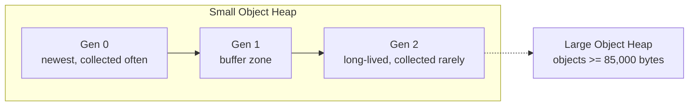

The .NET garbage collector (GC) is automatic, but "automatic" does not mean "free to ignore". Interviewers use GC questions to test whether you understand what makes an object collectible, why memory leaks still happen in a managed language, and how to reason about latency in a GC-based runtime.

## The generational hypothesis

The GC is built on one empirical observation: **most objects die young**. Short-lived objects (temporary strings, loop variables, request-scoped DTOs) vastly outnumber long-lived ones (caches, singletons, static data). Rather than scanning the entire heap on every collection, the GC organizes memory into **generations** and collects the youngest, cheapest-to-scan generation far more often than the rest.



| Generation | Contains | Collection frequency | Typical cost |
|---|---|---|---|
| Gen 0 | Newly allocated objects | Very frequent | Microseconds — scans a small, mostly-dead region |
| Gen 1 | Objects that survived one Gen 0 collection | Less frequent | Small buffer between short and long-lived |
| Gen 2 | Long-lived objects (survived Gen 1, statics, large caches) | Rare | Most expensive — scans the whole surviving graph |
| Large Object Heap (LOH) | Objects ≥ 85,000 bytes (large arrays, big strings) | Collected with Gen 2 | Not compacted by default — can fragment |

An object that survives a Gen 0 collection is **promoted** to Gen 1; survive again and it's promoted to Gen 2. The idea is that the longer an object has lived, the more likely it is to keep living, so it's not worth re-checking it as often.

> [!KEY]
> A Gen 0 collection only scans Gen 0 (and roots pointing into it) — it does not touch Gen 1 or Gen 2. This is what makes frequent small collections cheap: the GC never pays the cost of the whole heap unless it actually needs a Gen 2 collection.

## Mark-sweep-compact

Each collection runs three conceptual phases:

1. **Mark** — starting from the roots (see below), walk every reachable object and mark it "alive".
2. **Sweep** — anything not marked is garbage; its memory is reclaimable.
3. **Compact** — surviving objects are moved together to eliminate gaps, so the heap stays contiguous and allocation remains a cheap pointer bump.

The small object heap is compacted; the Large Object Heap is **not compacted by default** (moving large arrays is expensive), which is why it's a common source of fragmentation — the GC can free LOH memory but leave holes too small for the next large allocation, forcing heap growth. `GCSettings.LargeObjectHeapCompactionMode` can request a one-time LOH compaction if this becomes a real problem.

## Ephemeral segments, workstation vs server GC

The GC allocates memory in **segments** from the OS. The segment holding Gen 0 and Gen 1 is called the **ephemeral segment**, sized to fit comfortably in cache for fast, frequent collections.

| Mode | Threads | Heaps | Best for |
|---|---|---|---|
| Workstation GC | Single GC thread (by default) | One heap | Desktop/client apps, low-latency single-instance tools |
| Server GC | One GC thread per core | One heap **per core** | ASP.NET Core services, throughput-oriented multi-core servers |
| Concurrent/Background GC | Extra thread runs alongside app threads for Gen 2 | Either mode | Reduces (not eliminates) pause time for full collections |

Server GC trades memory (each core gets its own heap and larger segments) for throughput — it's the default for ASP.NET Core web apps. Background GC lets most of a Gen 2 collection's marking happen concurrently with running application threads, only briefly pausing them for the parts that must be exclusive.

> [!TIP]
> Saying "we run Server GC because it scales collection work across cores and reduces per-request latency variance under load, at the cost of higher baseline memory" is exactly the kind of trade-off statement that reads as senior.

## GC pauses and latency

Even with background/concurrent collection, some phases require **stopping all managed threads** (a "stop-the-world" pause) — most notably during compaction. Gen 0/1 pauses are typically sub-millisecond; a full blocking Gen 2 collection on a large heap can run into tens or hundreds of milliseconds, which matters for latency-sensitive services (trading systems, real-time APIs).

| Factor | Effect on pause time |
|---|---|
| Heap size | Larger surviving graph → longer mark phase |
| Object graph depth/pointer density | More references to trace → slower mark |
| Allocation rate | Higher churn → more frequent Gen 0 collections |
| Pinned objects (`fixed`, P/Invoke buffers) | Blocks compaction around them, can fragment Gen 0/1 |
| Server vs Workstation GC | Server parallelizes marking across cores |

## What makes an object eligible for collection: roots

An object is **not** eligible for collection just because no variable currently "looks like" it's used — the GC decides reachability precisely, by tracing from a set of **roots**:

- Local variables and parameters on any thread's stack
- Static fields
- CPU registers currently referencing an object
- GC handles (used by interop/pinning)
- Objects queued for finalization

If an object cannot be reached from any root by following references, it is garbage — regardless of how recently it was used. This is why an object referenced only by an event handler that's still subscribed, or a static dictionary entry that's never removed, is **not** garbage, even though "nobody uses it anymore" in a human sense.

## Memory leaks in managed code

.NET prevents dangling pointers and double-frees, but it does **not** prevent logical memory leaks — an object stays alive as long as something reachable references it, intentionally or not.

| Leak source | Why it happens | Fix |
|---|---|---|
| Static fields / caches | Static roots live for the process lifetime | Bound cache size, use `MemoryCache` with eviction, or `WeakReference` |
| Event handler subscriptions | Publisher holds a reference to subscriber's delegate, keeping it alive | Unsubscribe explicitly, or use weak event patterns |
| Captured closures | A lambda capturing `this` or a large object keeps it alive as long as the delegate lives | Capture only what's needed; be careful with long-lived delegates |
| Unmanaged handles without disposal | GC doesn't know their real cost, delays collection | Implement `IDisposable` correctly, use `using` |
| `ThreadStatic`/thread-pool thread state | Long-lived pool threads retain thread-local data | Clear thread-local state after use, or avoid unbounded growth |

```csharp
public class Publisher
{
    public event Action<string> OnMessage;
}

public class Subscriber : IDisposable
{
    private readonly Publisher _publisher;
    public Subscriber(Publisher publisher)
    {
        _publisher = publisher;
        _publisher.OnMessage += HandleMessage; // publisher now holds a reference to this
    }
    private void HandleMessage(string msg) { /* ... */ }

    public void Dispose() => _publisher.OnMessage -= HandleMessage; // must unsubscribe
}
```

> [!DANGER]
> Forgetting to unsubscribe from an event is one of the most common real-world .NET memory leaks. The publisher's invocation list keeps a strong reference to the subscriber's method target, so the subscriber (and everything it references) stays alive for as long as the publisher does — even if every other reference to the subscriber has gone out of scope.

## GC.Collect and why you (almost) never call it

`GC.Collect()` forces an immediate collection, usually a full, blocking Gen 2 collection. It defeats the GC's own tuning heuristics, which are based on live-object survival patterns the GC has been observing — calling it manually typically makes things *slower* overall, not faster, by forcing expensive full collections at times the GC wouldn't have chosen itself.

> [!WARNING]
> The only broadly accepted use case is right after a very large, one-time deallocation you know won't repeat (e.g. after unloading a huge in-memory dataset at startup) where you specifically want memory returned to the OS immediately. Even then, it's rare — reach for it only with a measured, specific justification, never as a routine "just in case" call.

## Diagnosing GC behaviour

`dotnet-counters` (part of the `dotnet-tools` diagnostics suite) gives a live view of GC behaviour without attaching a debugger:

```bash
dotnet tool install --global dotnet-counters
dotnet-counters monitor --process-id <pid> --counters System.Runtime
```

Key counters to watch: `% Time in GC`, `Gen 0/1/2 Size`, `Gen 0/1/2 GC Count`, `LOH Size`, `Allocation Rate`. A high `% Time in GC` (say, above 10-20% sustained) or a rapidly growing Gen 2/LOH size with few corresponding collections is the signal to dig into allocation patterns with `dotnet-trace` or a memory profiler.

## Cheat sheet

- Generational GC exists because most objects die young — Gen 0 is collected far more often than Gen 2.
- Objects are promoted (Gen 0 → 1 → 2) when they survive a collection of their current generation.
- Mark-sweep-compact: mark reachable objects from roots, sweep the rest, compact survivors (LOH is not compacted by default).
- Server GC = one heap and GC thread per core, for throughput; Workstation GC = single heap, lower memory footprint.
- Background/concurrent GC reduces but does not eliminate stop-the-world pauses, mainly during compaction.
- Reachability from roots (stack, statics, registers, GC handles) — not "recent use" — determines eligibility.
- Common managed leaks: unsubscribed events, unbounded static caches, captured closures, undisposed handles.
- Never call `GC.Collect()` routinely — it overrides the GC's own tuning heuristics and is usually a net loss.
- `dotnet-counters` gives a fast, low-overhead live view of GC pressure and allocation rate.

## Common mistakes

| Mistake | Fix |
|---|---|
| Calling `GC.Collect()` "to clean things up" before a benchmark or in production code | Remove it; let the GC's own heuristics decide, or only use it after a known one-off huge deallocation |
| Forgetting to unsubscribe from events | Unsubscribe in `Dispose()`, or use weak event patterns for long-lived publishers |
| Assuming a managed language can't leak memory | It can — anything still reachable from a root is never collected |
| Storing large objects in a static, unbounded `Dictionary` as a cache | Use `MemoryCache`/eviction policies or explicit size limits |
| Allocating many objects just under/over the 85,000-byte LOH threshold | Be aware of the LOH threshold; batch or pool large buffers (e.g. `ArrayPool<T>`) |
| Writing a finalizer "just in case" for a class with no unmanaged resources | Don't — it adds GC overhead for no benefit |

## Summary

The .NET GC organizes memory into generations because most objects are short-lived, collecting Gen 0 cheaply and frequently while rarely paying the cost of a full Gen 2 scan. Reachability from roots — not how recently something was used — determines whether an object survives, which is exactly why managed code can still leak: static references, unsubscribed events, and captured closures all keep objects reachable indefinitely. Server GC and background/concurrent collection improve throughput and reduce (but don't eliminate) pause times, and tools like `dotnet-counters` let you observe real GC pressure instead of guessing. `GC.Collect()` should almost never appear in application code.

## Top Interview Questions

### Q1. Explain the generational hypothesis and why it makes garbage collection faster.

The generational hypothesis is the empirical observation that most objects die young — short-lived temporaries vastly outnumber long-lived objects like caches and singletons. The GC exploits this by dividing the heap into generations (0, 1, 2) and collecting the youngest generation, Gen 0, far more frequently than older ones, since it's small and mostly garbage by the time it's scanned. Objects that survive a collection are promoted to the next generation, on the assumption that objects which have already lived a while are more likely to keep living, so they don't need to be re-checked as often. This means the GC almost never pays the cost of scanning the entire heap — only Gen 2 collections do, and those are comparatively rare.

### Q2. What determines whether an object is eligible for garbage collection?

Reachability from a set of **roots** — not how recently the object was used, and not reference counting. Roots include local variables and parameters currently on any thread's stack, static fields, CPU registers holding object references, and GC handles used by interop. The GC traces outward from every root, following object references, and marks everything it reaches as alive; anything left unmarked after that trace is garbage, regardless of whether a human would consider it "no longer needed." This is precisely why an object referenced only by a still-subscribed event handler, or held in a static dictionary that's never cleared, is not eligible for collection — it remains reachable through that root.

### Q3. What's the difference between Workstation GC and Server GC, and when would you choose each?

Workstation GC uses a single GC thread and one heap, favoring lower memory footprint and being appropriate for desktop apps or tools where a single instance runs with modest throughput needs. Server GC creates one heap and one dedicated GC thread per CPU core, parallelizing collection work across cores — it trades higher baseline memory usage for significantly better throughput and more consistent latency under concurrent load, which is why it's the default for ASP.NET Core web applications. The choice is essentially a throughput-vs-footprint trade-off: a high-traffic multi-core service wants Server GC, while a lightweight single-purpose tool or a memory-constrained container might prefer Workstation GC.

### Q4. Why doesn't a garbage-collected language prevent memory leaks entirely?

Because the GC only guarantees that *unreachable* memory is eventually reclaimed — it says nothing about objects that are still reachable but logically no longer needed by the application. If a static field, a long-lived cache, a subscribed event handler, or a captured closure keeps a reference alive, the object (and everything it references) stays in memory indefinitely, even though no meaningful code path will ever use it again. This is a "logical leak", not a GC bug — the classic real-world case is forgetting to unsubscribe an object from an event, since the publisher's delegate invocation list holds a strong reference to the subscriber, keeping it alive for as long as the publisher lives.

### Q5. Describe the mark-sweep-compact algorithm and why the Large Object Heap is handled differently.

Mark-sweep-compact runs three phases: mark every object reachable from the roots, sweep (identify) everything unmarked as garbage, and compact the survivors by moving them together to close gaps, keeping the heap contiguous so future allocations remain a cheap pointer bump. The Large Object Heap, which holds objects 85,000 bytes or larger, is **not compacted by default** because moving very large objects in memory is itself expensive — instead, freed LOH space is just tracked in a free list, which can fragment over time if allocation sizes vary, since a freed hole might be too small for the next large allocation and force the heap to grow rather than reuse the space. `GCSettings.LargeObjectHeapCompactionMode` can request a one-time compaction if fragmentation becomes measurably harmful.

### Q6. Why is calling `GC.Collect()` in application code usually a bad idea?

The GC continuously tunes itself based on observed allocation and survival patterns — how quickly Gen 0 fills, how often objects are promoted, how large the heap has grown — to decide when and how much to collect. Calling `GC.Collect()` manually forces an immediate collection (usually a full, blocking Gen 2 collection) regardless of whether the heuristics think it's warranted, which typically means doing more work, more often, than the GC would have chosen on its own — actively hurting throughput and latency rather than helping. The rare accepted exception is immediately after a known, one-time massive deallocation (e.g., releasing a huge cache at a natural checkpoint) where you specifically want memory returned to the OS promptly; even then, it should be a deliberate, measured decision, not a routine call.

### Q7. Your service shows high and growing memory usage over time, and `dotnet-counters` shows Gen 2 heap size climbing steadily with few Gen 2 collections. What would you investigate?

A steadily growing Gen 2 heap with few collections suggests objects are being promoted and then staying reachable rather than dying — a logical memory leak, not a GC malfunction. I'd look for static or singleton-scoped collections that grow unboundedly (caches without eviction), event subscriptions that are never removed (especially where a short-lived object subscribes to a long-lived publisher), and long-lived closures capturing large graphs of objects. I'd use a memory profiler (or `dotnet-gcdump` to capture a heap snapshot) to find the objects with unexpectedly high retained-object counts and trace their retention path back to the root keeping them alive, since that path is exactly what needs to be broken.

### Q8. Why can pinned objects and P/Invoke buffers cause fragmentation, and how do you mitigate it?

Pinning (via `fixed` or `GCHandle.Alloc(obj, GCHandleType.Pinned)`) tells the GC an object's memory address must not change, which is necessary when passing a managed buffer to unmanaged code via P/Invoke, since native code expects a stable pointer. But compaction works by moving objects to close gaps — a pinned object can't be moved, so the GC has to compact around it, potentially leaving small unusable gaps nearby and reducing compaction efficiency, especially if pinning is frequent or long-lived. Mitigations include pinning for the shortest possible duration, using `ArrayPool<T>` or preallocated buffers pinned once and reused rather than pinning fresh buffers repeatedly, and, where the interop API allows it, using `Span<T>`/`Memory<T>`-based patterns that minimize how often pinning is needed.

### Q9. What's the difference between the ephemeral segment and the rest of the heap, and why does it matter for performance?

The ephemeral segment is the memory region holding Gen 0 and Gen 1 — sized specifically to be small enough to fit well within CPU cache, since Gen 0 collections happen very frequently and need to be as fast as possible. Gen 2 objects and the Large Object Heap live in separate, larger segments that are scanned far less often. This separation matters because it lets the GC keep the hot, frequent collection path (Gen 0) cache-friendly and cheap, while the expensive full-heap scan (Gen 2) only happens when actually necessary — if everything were in one undifferentiated heap, every collection would risk scanning far more memory than needed, making allocation-heavy code much slower on average.

### Q10. How would you use `dotnet-counters` to diagnose whether GC is a bottleneck in a running service, and what would you look for?

I'd attach with `dotnet-counters monitor --process-id <pid> --counters System.Runtime` against the live process, which needs no code changes or restarts. The key signal is `% Time in GC` — if it's sustained above roughly 10–20%, the process is spending a meaningful fraction of CPU time collecting rather than doing useful work. I'd also watch `Allocation Rate` (high sustained allocation drives frequent Gen 0 collections), `Gen 0/1/2 GC Count` relative to `Gen 0/1/2 Size` (frequent Gen 2 collections with a large Gen 2 heap suggest either genuine long-lived data growth or a leak), and `LOH Size` for large-object churn. If `% Time in GC` is high, the next step is a memory or allocation profiler (`dotnet-trace` with the GC/allocation providers) to find which call sites are generating the pressure.
