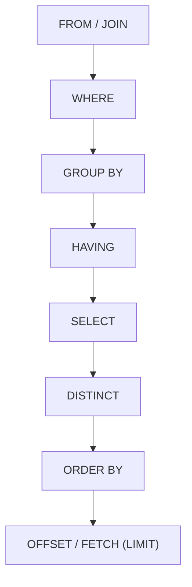
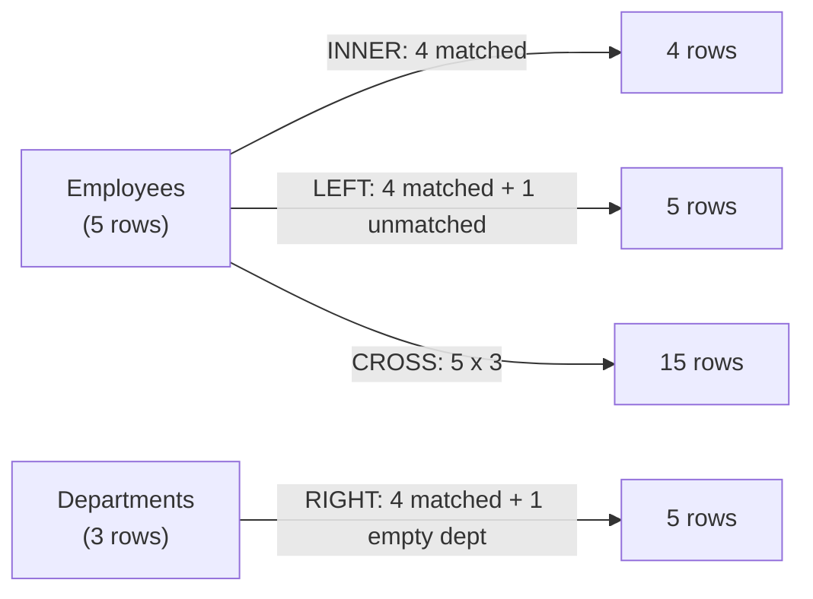

Almost every SQL bug traces back to a wrong mental model of *when* each clause runs. This page fixes that model first, then walks every join type and the aggregation rules that sit on top of it. All examples use T-SQL (SQL Server); differences from ANSI/MySQL/Postgres are called out inline.

## Sample schema used in these examples

Every worked example on this page and the rest of this section reads from the same two tables, so the `employee_name`/`department_name` pairs recur throughout instead of being re-invented per example.

```sql
CREATE TABLE departments (
    department_id INT PRIMARY KEY,
    department_name VARCHAR(50) UNIQUE NOT NULL
);

CREATE TABLE employees (
    employee_id INT PRIMARY KEY,
    employee_name VARCHAR(50) NOT NULL,
    email VARCHAR(100) UNIQUE,
    department_id INT,
    salary DECIMAL(10, 2),
    city VARCHAR(50),
    manager_id INT,
    status VARCHAR(20) DEFAULT 'Active',
    CONSTRAINT fk_employee_department
        FOREIGN KEY (department_id) REFERENCES departments(department_id)
        ON UPDATE CASCADE
        ON DELETE SET NULL,
    FOREIGN KEY (manager_id) REFERENCES employees(employee_id)
);

INSERT INTO departments (department_id, department_name) VALUES
    (1, 'Engineering'), (2, 'HR'), (3, 'Sales');

INSERT INTO employees (employee_id, employee_name, department_id, salary, city, manager_id, status) VALUES
    (1, 'Aman',  1,    80000, 'Delhi',      NULL, 'Active'),
    (2, 'Anita', 1,    65000, 'Mumbai',     1,    'Active'),
    (3, 'Ravi',  2,    55000, 'Bengaluru',  1,    'Active'),
    (4, 'Neha',  NULL, 45000, 'Pune',       2,    'Inactive');
```

| employee_id | employee_name | department_id | salary | city | manager_id | status |
|---|---|---|---|---|---|---|
| 1 | Aman | 1 | 80000 | Delhi | `NULL` | Active |
| 2 | Anita | 1 | 65000 | Mumbai | 1 | Active |
| 3 | Ravi | 2 | 55000 | Bengaluru | 1 | Active |
| 4 | Neha | `NULL` | 45000 | Pune | 2 | Inactive |

Note the `ON DELETE SET NULL` on `fk_employee_department`: deleting a department doesn't fail or cascade-delete its staff, it just detaches them (`department_id` becomes `NULL`) — Neha's row already shows that detached state. Sales (`department_id = 3`) has no employees at all, which is what makes it useful for the outer-join examples below.

## Logical query processing order

SQL reads like `SELECT ... FROM ... WHERE ... GROUP BY ... HAVING ... ORDER BY`, but that is the **written** order, not the **execution** order. The engine actually processes clauses in this sequence:



This explains almost every "why doesn't this work" moment:

- You cannot use a `SELECT` column alias in `WHERE` — `WHERE` runs before `SELECT` computes it.
- You *can* use an alias in `ORDER BY` — it runs after `SELECT`.
- `WHERE` cannot reference an aggregate (`WHERE COUNT(*) > 1`) because aggregates do not exist until `GROUP BY`/`SELECT` runs — that is what `HAVING` is for.
- `TOP` / `LIMIT` applies last, after sorting, which is why "top 5 by X" requires an `ORDER BY` to be meaningful.

> [!KEY]
> Memorise the order: **FROM → WHERE → GROUP BY → HAVING → SELECT → ORDER BY → LIMIT**. Every "why did my query fail" question is answered by pointing at this list.

## Join types and result-set size

Joins combine rows from two tables based on a predicate. The join type controls what happens to rows on either side that have **no match**.


Focusing on just the four outer/inner variants, the shaded region of each pair of circles is the fastest way to remember which rows survive:


| Join | Rows returned | Unmatched left row | Unmatched right row |
|---|---|---|---|
| `INNER JOIN` | Only matching pairs | Dropped | Dropped |
| `LEFT JOIN` | All left rows + matches | Kept, right columns `NULL` | Dropped |
| `RIGHT JOIN` | All right rows + matches | Dropped | Kept, left columns `NULL` |
| `FULL JOIN` | All rows from both sides | Kept, right `NULL` | Kept, left `NULL` |
| `CROSS JOIN` | Cartesian product | N/A (every row × every row) | N/A |
| `SELF JOIN` | Table joined to itself | Depends on join type used | Depends on join type used |



`RIGHT JOIN` is rarely used in practice — rewriting `A RIGHT JOIN B` as `B LEFT JOIN A` is equivalent and reads more naturally left-to-right. `FULL JOIN` is not supported in MySQL; emulate with `LEFT JOIN UNION RIGHT JOIN`.

```sql
-- Every employee, with department name or NULL if unassigned
SELECT e.employee_name, d.department_name
FROM employees e
LEFT JOIN departments d ON e.department_id = d.department_id;
```

| employee_name | department_name |
|---|---|
| Aman | Engineering |
| Anita | Engineering |
| Ravi | HR |
| Neha | `NULL` |

### Self joins

A self join compares a table to itself, typically to relate a row to another row in the same table — the classic case is an employee-manager hierarchy.

```sql
SELECT e.employee_name AS employee, m.employee_name AS manager
FROM employees e
LEFT JOIN employees m ON e.manager_id = m.employee_id;
```

## Join on NULL — the silent trap

`NULL` never equals anything, not even another `NULL`. A join predicate `a.col = b.col` **excludes** rows where either side is `NULL`, because `NULL = NULL` evaluates to `UNKNOWN`, not `TRUE`.

> [!DANGER]
> `LEFT JOIN departments d ON e.department_id = d.department_id` will never match `e.department_id IS NULL` to anything — that row simply gets `NULL` on the right, which is usually what you want. But if you *intend* to match NULLs to NULLs (rare, e.g. staging-table reconciliation), you need `ON (e.dept = d.dept OR (e.dept IS NULL AND d.dept IS NULL))` — plain `=` will silently drop the pairing.

## WHERE vs ON for outer joins — the classic trap

For an `INNER JOIN`, putting a filter in `WHERE` or in `ON` gives the same result. For an **outer join**, it does not, and this is one of the most reliable "do you actually understand joins" interview questions.

```sql
-- A: filter in ON — keeps all employees, just narrows which dept rows attach
SELECT e.employee_name, d.department_name
FROM employees e
LEFT JOIN departments d
    ON e.department_id = d.department_id AND d.department_name = 'Engineering';

-- B: filter in WHERE — silently turns the LEFT JOIN into an INNER JOIN
SELECT e.employee_name, d.department_name
FROM employees e
LEFT JOIN departments d ON e.department_id = d.department_id
WHERE d.department_name = 'Engineering';
```

Query A still returns every employee — non-Engineering employees just show `NULL` for `department_name`. Query B evaluates `WHERE` **after** the join has produced its rows, and `d.department_name = 'Engineering'` is `UNKNOWN` (not `TRUE`) for the `NULL` rows the left join manufactured, so `WHERE` throws them away — the left join is neutered into an inner join.

> [!WARNING]
> Rule of thumb: conditions that decide **which rows from the outer side survive** belong in `WHERE`. Conditions that decide **which rows from the joined-in side are allowed to match** belong in `ON`.

## GROUP BY and HAVING

`GROUP BY` collapses rows sharing the same key values into one row per group; every column in `SELECT` must then either be in `GROUP BY` or wrapped in an aggregate. `HAVING` filters **groups** after aggregation, while `WHERE` filters **rows** before aggregation.

| | WHERE | HAVING |
|---|---|---|
| Runs | Before grouping | After grouping |
| Filters | Individual rows | Aggregated groups |
| Can use aggregates | No | Yes |
| Can use column aliases | No (mostly) | Yes (varies by engine) |

```sql
-- Departments with more than 1 active employee, average salary above 50000
SELECT department_id, COUNT(*) AS headcount, AVG(salary) AS avg_salary
FROM employees
WHERE status = 'Active'
GROUP BY department_id
HAVING COUNT(*) > 1 AND AVG(salary) > 50000;
```

> [!TIP]
> Say it explicitly in an interview: *"WHERE removes rows before they're grouped, so it's cheaper and should carry as much of the filter as possible; HAVING only makes sense for conditions on the aggregate itself."* That single sentence demonstrates you understand the execution order, not just the syntax.

### DISTINCT vs GROUP BY

Both collapse duplicate rows, but for different reasons — `DISTINCT` is purely about removing repeats from the final projection, `GROUP BY` is about forming buckets for aggregation.

| | `DISTINCT` | `GROUP BY` |
|---|---|---|
| Purpose | Removes duplicate rows from the result | Forms groups, almost always to feed an aggregate |
| Needs an aggregate function | No | Not required, but rare without one |
| Applies to | The whole selected row | The listed grouping columns |
| Example | `SELECT DISTINCT city FROM employees;` | `SELECT city, COUNT(*) FROM employees GROUP BY city;` |

`SELECT DISTINCT city, department_id` and `SELECT city, department_id FROM employees GROUP BY city, department_id` return the same rows — `GROUP BY` with no aggregate in the `SELECT` list is functionally a more verbose `DISTINCT`. Reach for `DISTINCT` when you just want unique rows; reach for `GROUP BY` the moment you need a per-group aggregate alongside them.

## Aggregate functions and NULL handling

`COUNT`, `SUM`, `AVG`, `MIN`, `MAX` all **ignore `NULL` values** except `COUNT(*)`.

| Expression | Counts | NULLs | Duplicates |
|---|---|---|---|
| `COUNT(*)` | All rows in the group | Included | Included |
| `COUNT(col)` | Rows where `col` is not `NULL` | Excluded | Included |
| `COUNT(DISTINCT col)` | Distinct non-NULL values of `col` | Excluded | Collapsed |
| `SUM(col)` | Sum of non-NULL values | Excluded (treated as 0-contribution) | Included |
| `AVG(col)` | Sum(non-NULL) / **count of non-NULL** rows | Excluded from both numerator and denominator | Included |

```sql
SELECT
    COUNT(*)                    AS total_rows,
    COUNT(department_id)        AS rows_with_dept,
    COUNT(DISTINCT department_id) AS distinct_depts,
    AVG(salary)                 AS avg_salary
FROM employees;
```

Note the practical trap this creates: `AVG(col)` divides by the count of **non-NULL** rows, not the total row count. If you want a `NULL` to count as zero in the average, use `AVG(ISNULL(col, 0))` (T-SQL) or `AVG(COALESCE(col, 0))` (portable) — otherwise a row with `NULL` is silently excluded from the average entirely, which skews results upward for "missing means zero" data like bonuses.

## Cheat sheet

- Execution order is **FROM → WHERE → GROUP BY → HAVING → SELECT → ORDER BY → LIMIT/TOP** — memorise it, it explains almost every clause-ordering question.
- `INNER` keeps only matches; `LEFT`/`RIGHT` keep one full side plus matches; `FULL` keeps everything; `CROSS` is the Cartesian product.
- Prefer `LEFT JOIN` over `RIGHT JOIN` for readability — they are equivalent with sides swapped.
- `NULL = NULL` is `UNKNOWN`, never `TRUE` — this affects both join predicates and `WHERE`/`HAVING` filters.
- For outer joins: filter the **preserved side** in `WHERE`, filter the **joined-in side** in `ON`.
- `WHERE` filters rows before grouping (cheap, no aggregates allowed); `HAVING` filters groups after aggregation.
- Every non-aggregated column in `SELECT` must appear in `GROUP BY`.
- `COUNT(*)` counts rows; `COUNT(col)` skips `NULL`; `COUNT(DISTINCT col)` skips `NULL` and duplicates.
- `AVG`/`SUM` ignore `NULL` rows entirely — they do not treat `NULL` as `0`.
- `DISTINCT` removes duplicate rows from the projection; `GROUP BY` with no aggregate does the same thing more verbosely — reach for `GROUP BY` only once an aggregate is involved.
- A foreign key's `ON DELETE`/`ON UPDATE` action (`CASCADE`, `SET NULL`, `RESTRICT`) decides what happens to child rows, and directly shapes what a later `LEFT JOIN` against that table will show.

## Common mistakes

| Mistake | Fix |
|---|---|
| Putting an outer-join-side filter in `WHERE` | Move it to `ON` so the outer join isn't turned into an inner join |
| Assuming `RIGHT JOIN departments` matches `NULL` department_id | It doesn't — `NULL = NULL` is `UNKNOWN`; those rows only appear via `LEFT/RIGHT/FULL` unmatched slots |
| Filtering an aggregate with `WHERE COUNT(*) > 1` | Use `HAVING COUNT(*) > 1` — aggregates don't exist until after `GROUP BY` |
| Expecting `AVG(col)` to treat `NULL` as `0` | Wrap with `ISNULL`/`COALESCE` if that is the intended behaviour |
| Selecting a non-aggregated, non-grouped column | Add it to `GROUP BY` or wrap it in `MIN`/`MAX`/`ANY_VALUE` |
| Using `COUNT(col)` when you meant `COUNT(*)` | Decide deliberately — they differ whenever `col` can be `NULL` |
| Reaching for `GROUP BY` just to deduplicate rows | Use `DISTINCT` — it says "unique rows" more directly when no aggregate is involved |

## Summary

Every SQL confusion — alias scoping, why an aggregate filter belongs in `HAVING`, why a `LEFT JOIN` "loses" rows — collapses to one fact: the engine evaluates `FROM/JOIN`, then `WHERE`, then `GROUP BY`, then `HAVING`, then `SELECT`, then `ORDER BY`, then `LIMIT`, regardless of how the text is written. Layer on top of that the NULL-never-equals-NULL rule and the WHERE-vs-ON distinction for outer joins, and you can reason about any join or aggregation query without guessing.

## Top Interview Questions

### Q1. What is the logical order in which SQL clauses are evaluated?

`FROM`/`JOIN` first (build the working row set), then `WHERE` (filter rows), then `GROUP BY` (collapse into groups), then `HAVING` (filter groups), then `SELECT` (project/compute columns and aliases), then `DISTINCT`, then `ORDER BY`, and finally `TOP`/`LIMIT`/`OFFSET-FETCH`. This differs from the written order and explains why a `SELECT` alias can't be used in `WHERE` (not computed yet) but can be used in `ORDER BY` (computed by then), and why aggregate conditions must go in `HAVING`, not `WHERE`.

### Q2. What's the difference between WHERE and HAVING?

`WHERE` filters individual rows before any grouping happens, so it cannot reference aggregate functions and generally cannot reference `SELECT` aliases. `HAVING` filters groups after `GROUP BY`/aggregation has run, so it can use `COUNT`, `SUM`, `AVG`, etc. Performance-wise, push as much filtering as possible into `WHERE` — it reduces the row count before the (more expensive) grouping step, whereas `HAVING` runs afterward. A `HAVING` clause with no aggregate condition (e.g. `HAVING department_id = 1`) is a code smell — it should almost always be a `WHERE`.

### Q3. Why does putting a condition in WHERE instead of ON change the result of a LEFT JOIN?

For an inner join, the two are equivalent because non-matching rows are dropped either way. For a left join, `ON` decides which rows from the *right* table are allowed to attach to a preserved left row — non-matches still produce a left row with `NULL`s. `WHERE`, however, runs after the join has already produced those `NULL`-padded rows, and a condition like `d.name = 'X'` evaluates to `UNKNOWN` (not `TRUE`) against a `NULL`, so `WHERE` throws those rows away — silently converting the left join into an inner join. The fix is to put right-side filters in `ON` if you want to keep every left row.

### Q4. What is the difference between COUNT(*), COUNT(column), and COUNT(DISTINCT column)?

`COUNT(*)` counts every row in the group regardless of `NULL`s. `COUNT(column)` counts only rows where that column is non-`NULL`. `COUNT(DISTINCT column)` counts distinct non-`NULL` values, collapsing duplicates. They can all return different numbers on the same table: given rows `(1), (1), (NULL), (2)`, `COUNT(*) = 4`, `COUNT(col) = 3`, `COUNT(DISTINCT col) = 2`.

### Q5. Why doesn't a join predicate match two NULL values?

SQL uses three-valued logic: any comparison involving `NULL`, including `NULL = NULL`, evaluates to `UNKNOWN`, and `ON`/`WHERE` only keep rows where the predicate is `TRUE` — `UNKNOWN` is treated like `FALSE` for filtering purposes. So an `INNER`/`LEFT` join on `a.col = b.col` never pairs two `NULL`s together. If you genuinely need NULL-to-NULL matching (rare — usually a sign the schema should use a sentinel value or a third join key), you must write it explicitly with `IS NULL` checks combined via `OR`, since `NULL`-safe equality operators like `IS NOT DISTINCT FROM` are not available in T-SQL (SQL Server) though they exist in Postgres.

### Q6. When would you use a CROSS JOIN in a real application?

Genuine uses are rare but real: generating a calendar of dates crossed with every store to build a "sales by day" report scaffold (so days with zero sales still appear), building a Cartesian product for combinatorial test data, or crossing a small "buckets" table (e.g. price bands) with rows to bucket them. Outside of these deliberate cases, a `CROSS JOIN` appearing in a query is almost always a bug — a forgotten `ON`/`WHERE` predicate that has turned an intended join into an accidental Cartesian product, which is a classic cause of duplicated rows and blown-up result sets.

### Q7. A report shows department headcounts that look too high — duplicated rows. What would you check?

First suspect is a join fan-out: joining `employees` to a table with more than one row per employee (e.g. a `employee_skills` or `employee_projects` table) multiplies each employee row by however many matching child rows exist, inflating any subsequent `COUNT`/`SUM`. The fix is either to aggregate the child table into one row per key **before** joining (a subquery/CTE with its own `GROUP BY`), or to use `COUNT(DISTINCT employee_id)` instead of `COUNT(*)` at the final aggregation. I'd also check for an accidental `CROSS JOIN` from a missing or wrong join predicate, and verify the join columns' data types match (implicit conversion can also cause unexpected match counts).

### Q8. How do you find duplicate rows in a table using SQL?

Group by the columns that define a "duplicate" and filter for groups with more than one row:

```sql
SELECT email, COUNT(*) AS occurrences
FROM employees
GROUP BY email
HAVING COUNT(*) > 1;
```

To get the actual duplicate rows (not just the count), join back to the base table on those keys, or use `ROW_NUMBER() OVER (PARTITION BY email ORDER BY employee_id) AS rn` in a CTE and select `rn > 1` — this also gives a clean way to delete all-but-one of each duplicate set.

### Q9. Why can't you reference a SELECT column alias in the WHERE clause?

Because of logical processing order: `WHERE` executes before `SELECT`, so the alias does not exist yet when `WHERE` is evaluated — the engine literally has not computed it. You must repeat the underlying expression in `WHERE` (or wrap the query in a CTE/subquery and filter the outer query, where the alias *does* exist because the inner `SELECT` has already run). `ORDER BY` and `HAVING` (in most engines) can use aliases because they run after `SELECT`.

### Q10. What is the difference between an inner join and a semi-join, and how do you write one in T-SQL?

An inner join returns one output row per **matching pair**, so if a department has three matching employees, the department row is effectively repeated three times with different employee columns. A semi-join returns each row from the left table **at most once**, purely testing "does at least one match exist" — it never duplicates left rows and never exposes right-side columns. T-SQL has no `SEMI JOIN` keyword; you express it with `EXISTS` or `IN`: `SELECT * FROM departments d WHERE EXISTS (SELECT 1 FROM employees e WHERE e.department_id = d.department_id)`. This is both more correct and often faster than `SELECT DISTINCT d.* FROM departments d JOIN employees e ON ...` for an existence check.

### Q11. What happens if you SELECT a non-aggregated column that isn't in GROUP BY?

Standard SQL (and SQL Server) rejects it at parse time with an error like "column is invalid in the select list because it is not contained in either an aggregate function or the GROUP BY clause" — the engine cannot know which of the possibly-many values within a group to return for that column. MySQL historically allowed this under `ONLY_FULL_GROUP_BY=OFF` and silently picked an arbitrary row's value, which is a well-known source of nondeterministic bugs; modern MySQL defaults to rejecting it too. The fix is to add the column to `GROUP BY`, or wrap it in an aggregate like `MIN()`/`MAX()` if any value from the group is acceptable.

### Q12. How would you write a query to find departments with no employees?

Use a `LEFT JOIN` from the "should have matches" side and filter for the missing side, or use `NOT EXISTS`:

```sql
SELECT d.department_name
FROM departments d
LEFT JOIN employees e ON e.department_id = d.department_id
WHERE e.employee_id IS NULL;

-- equivalent, often clearer and can be faster
SELECT d.department_name
FROM departments d
WHERE NOT EXISTS (SELECT 1 FROM employees e WHERE e.department_id = d.department_id);
```

Avoid `NOT IN (SELECT department_id FROM employees)` here — if even one `employee_id`/`department_id` in the subquery is `NULL`, `NOT IN` returns an empty result set for every row, a well-known trap covered in more detail alongside subqueries.

### Q13. When is DISTINCT the same as GROUP BY, and when should you use one over the other?

`SELECT DISTINCT city FROM employees` and `SELECT city FROM employees GROUP BY city` return identical rows, because `GROUP BY` with no aggregate in the `SELECT` list just forms one group per distinct value and returns it once — functionally a more roundabout `DISTINCT`. They stop being interchangeable the moment an aggregate joins the query: `GROUP BY` is required to compute a per-group `COUNT`/`SUM`/`AVG`, something `DISTINCT` cannot do at all. The practical rule is to reach for `DISTINCT` when the goal is simply "unique rows" and reach for `GROUP BY` the moment any aggregate function is involved — using `GROUP BY` purely for deduplication is a common but needless habit that makes a query read as if aggregation were coming, when it isn't.

### Q14. A table has `ON DELETE SET NULL` on its foreign key. What actually happens when a parent row is deleted, and how does that affect a later report?

Deleting the parent row (say, a department) does not fail and does not cascade-delete the matching child rows (its employees) — instead, every child row's foreign key column is set to `NULL`, silently detaching it from the (now-gone) parent while the child row itself survives. This matters for reporting: a later `INNER JOIN` to that same foreign key will simply drop those detached rows from the result, while a `LEFT JOIN` from the child table will keep them with `NULL` in the parent's columns — exactly the same `NULL`-producing shape as an employee who was never assigned a department in the first place, so a report can't distinguish "never assigned" from "assignment was deleted" without an extra audit column or a soft-delete on the parent instead.
