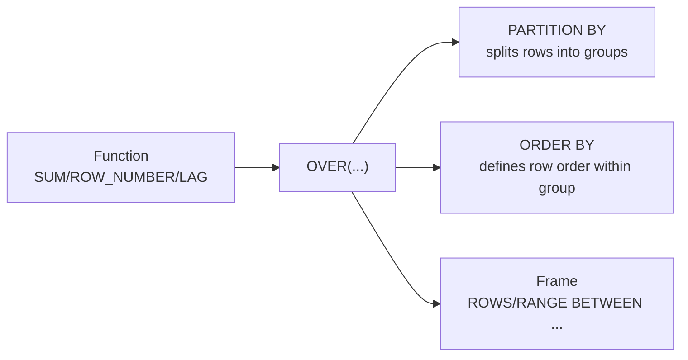

Window functions compute a value across a set of rows related to the current row **without collapsing them into one row**, unlike `GROUP BY`. They power ranking, running totals, top-N-per-group and deduplication queries that come up constantly in interviews. This page uses T-SQL syntax throughout.

## Anatomy of the OVER clause

Every window function is `function() OVER (PARTITION BY ... ORDER BY ... frame)`.



- **PARTITION BY** — optional; resets the window per group, like an implicit `GROUP BY` that doesn't collapse rows. Omit it to treat the whole result set as one partition.
- **ORDER BY** — required for ranking/offset functions; defines the row sequence the function walks.
- **Frame** — the subset of rows *within the partition* the function actually sees, relative to the current row. Only meaningful for aggregate window functions; ranking functions ignore it.

```sql
SELECT
    employee_name, department_id, salary,
    ROW_NUMBER() OVER (PARTITION BY department_id ORDER BY salary DESC) AS rn
FROM employees;
```

> [!KEY]
> A window function runs **after** `WHERE`/`GROUP BY`/`HAVING` but **before** `ORDER BY`/`TOP` in logical processing order — it operates on already-filtered, already-grouped rows, and you cannot filter its result in the same `SELECT`'s `WHERE` clause (it doesn't exist yet). Wrap in a CTE and filter the outer query instead.

## Ranking functions and how they handle ties

Given salaries `(90k, 90k, 80k, 70k)` ordered descending:

| salary | ROW_NUMBER() | RANK() | DENSE_RANK() | NTILE(2) |
|---|---|---|---|---|
| 90,000 | 1 | 1 | 1 | 1 |
| 90,000 | 2 | 1 | 1 | 1 |
| 80,000 | 3 | 3 | 2 | 2 |
| 70,000 | 4 | 4 | 3 | 2 |

- **ROW_NUMBER()** — always unique, arbitrary tie-break order (whatever `ORDER BY` doesn't fully disambiguate). Use for pagination and deduplication.
- **RANK()** — ties share the same rank, but the **next** rank skips (1, 1, 3, 4) — leaves gaps equal to the number of tied rows.
- **DENSE_RANK()** — ties share the same rank, **no gap** afterward (1, 1, 2, 3).
- **NTILE(n)** — splits the partition into `n` roughly equal buckets, ignoring ties; useful for percentile/quartile bucketing.

> [!WARNING]
> `ROW_NUMBER()` with a non-unique `ORDER BY` is **non-deterministic** — which tied row gets `1` vs `2` can vary between runs or plans. Add a tiebreaker column (usually the primary key) to `ORDER BY` if the exact assignment matters, e.g. `ORDER BY salary DESC, employee_id`.

## Aggregate windows: running totals and moving averages

Aggregate functions become window functions the moment you add `OVER(...)` — no `GROUP BY` needed, and every input row survives.

```sql
SELECT
    order_date, amount,
    SUM(amount) OVER (ORDER BY order_date
                       ROWS BETWEEN UNBOUNDED PRECEDING AND CURRENT ROW) AS running_total,
    AVG(amount) OVER (ORDER BY order_date
                       ROWS BETWEEN 2 PRECEDING AND CURRENT ROW) AS moving_avg_3
FROM orders;
```

| order_date | amount | running_total | moving_avg_3 |
|---|---|---|---|
| Jan 1 | 100 | 100 | 100.0 |
| Jan 2 | 200 | 300 | 150.0 |
| Jan 3 | 150 | 450 | 150.0 |
| Jan 4 | 300 | 750 | 216.7 |

## LAG, LEAD, FIRST_VALUE, LAST_VALUE

`LAG(col, n, default)` and `LEAD(col, n, default)` read a value from `n` rows before/after the current row within the partition — the classic use is comparing a row to the previous one (day-over-day change) without a self-join.

```sql
SELECT
    order_date, amount,
    LAG(amount, 1, 0) OVER (ORDER BY order_date) AS prev_amount,
    amount - LAG(amount, 1, 0) OVER (ORDER BY order_date) AS change
FROM orders;
```

> [!DANGER]
> `LAST_VALUE()` is the single most common window-function bug. With the **default frame**, `LAST_VALUE(col) OVER (ORDER BY x)` uses `RANGE BETWEEN UNBOUNDED PRECEDING AND CURRENT ROW` — so "last value" actually means "value of the current row", not the last row in the partition. To get the true last row you must widen the frame explicitly: `LAST_VALUE(col) OVER (ORDER BY x ROWS BETWEEN UNBOUNDED PRECEDING AND UNBOUNDED FOLLOWING)`.

## ROWS vs RANGE frames

| | `ROWS` | `RANGE` |
|---|---|---|
| Unit | Physical row count | Logical value equality on `ORDER BY` key |
| Ties in ORDER BY | Each row counted separately | All peer rows (same value) treated as one unit |
| Default when `ORDER BY` is present and no frame is written | No `ROWS` frame is implied | `RANGE BETWEEN UNBOUNDED PRECEDING AND CURRENT ROW` |
| Performance | Generally faster, simpler to reason about | Can silently include more rows than expected when ties exist |
| Typical use | Moving average of last N rows | Running total that should treat tied dates as one group |

`ROWS BETWEEN 2 PRECEDING AND CURRENT ROW` always means "this row and the two immediately before it, physically". `RANGE BETWEEN 2 PRECEDING AND CURRENT ROW` on a numeric `ORDER BY` means "all rows whose value is within 2 of this row's value" — a different, less commonly needed semantic. Default to `ROWS` unless you specifically need value-based framing.

Two extra details make this interview-safe. First, a window `ORDER BY` is separate from the final result's `ORDER BY`: it defines calculation order, not necessarily output order. If the final rows must be displayed in that same order, add a normal outer `ORDER BY` too. Second, tie handling is only deterministic when the `ORDER BY` list is unique. A running total over `ORDER BY order_date` can process two same-day rows in either physical order under a `ROWS` frame, so add a stable tiebreaker such as `order_id` whenever row-by-row progression matters.

## Top-N-per-group

The single most-asked window function pattern: "top 3 highest-paid employees per department."

```sql
WITH ranked AS (
    SELECT
        employee_name, department_id, salary,
        ROW_NUMBER() OVER (PARTITION BY department_id ORDER BY salary DESC) AS rn
    FROM employees
)
SELECT employee_name, department_id, salary
FROM ranked
WHERE rn <= 3;
```

Use `ROW_NUMBER()` when you need exactly N rows per group even with ties; use `RANK()` if "top 3" should include everyone tied for 3rd place (which can return more than 3 rows per group).

## Deduplication with ROW_NUMBER

Given duplicate rows (e.g. from a bad import), keep exactly one per key:

```sql
WITH dedup AS (
    SELECT *, ROW_NUMBER() OVER (PARTITION BY email ORDER BY employee_id) AS rn
    FROM employees
)
DELETE FROM dedup WHERE rn > 1;
```

This pattern — CTE with `ROW_NUMBER()`, then `DELETE`/`SELECT` filtered on `rn` — is directly writable against the CTE in SQL Server because CTEs built on a base table are updatable.

## Performance considerations

- Window functions can often replace a **self-join** or **correlated subquery**, and are usually faster because the engine computes them in one sort/pass rather than re-scanning per row.
- Each distinct `PARTITION BY ... ORDER BY ...` specification may require its **own sort** — if a query uses several different window specs, check the execution plan for repeated `Sort` operators, and see if a shared spec (or an index matching it) can avoid re-sorting.
- An index on `(partition_columns, order_by_columns)` lets the engine consume rows already sorted instead of sorting in memory — the same leftmost-prefix logic as any other index.

> [!TIP]
> Say this to sound senior: *"I'd reach for a window function instead of a correlated subquery here — it's one pass over a single sort instead of one subquery execution per outer row."*

## Cheat sheet

- `OVER (PARTITION BY ... ORDER BY ... frame)` — partition resets the window, order defines sequence, frame bounds which rows an aggregate sees.
- `ROW_NUMBER` — always unique. `RANK` — ties share rank, gaps after. `DENSE_RANK` — ties share rank, no gaps. `NTILE(n)` — n equal buckets.
- Window functions run after `WHERE`/`GROUP BY`/`HAVING`, before `ORDER BY` — filter their output via an outer query or CTE, never in the same `SELECT`'s `WHERE`.
- `LAG`/`LEAD` replace self-joins for "compare to previous/next row".
- `LAST_VALUE` needs an explicit `ROWS BETWEEN UNBOUNDED PRECEDING AND UNBOUNDED FOLLOWING` frame or it silently returns the current row.
- Default to `ROWS` frames; reach for `RANGE` only when tied `ORDER BY` values should be treated as one logical group.
- Top-N-per-group and deduplication are both "CTE + ROW_NUMBER + filter on rn" — the single most reusable pattern in this topic.
- A non-unique `ORDER BY` inside `OVER` makes `ROW_NUMBER()` non-deterministic — add a tiebreaker.

## Common mistakes

| Mistake | Fix |
|---|---|
| Filtering a window function result in the same query's `WHERE` | Wrap in a CTE/subquery and filter the outer query |
| Assuming `LAST_VALUE` returns the partition's last row by default | Add explicit `ROWS BETWEEN UNBOUNDED PRECEDING AND UNBOUNDED FOLLOWING` |
| Using `ROW_NUMBER()` for "top 3 including ties" | Use `RANK()` instead — it doesn't force an arbitrary cutoff |
| `ORDER BY` inside `OVER` with duplicate values and expecting stable numbering | Add a unique tiebreaker column |
| Recomputing the same window spec many times across a query | Consider precomputing once in a CTE, or check for repeated sorts in the plan |
| Confusing `RANGE` and `ROWS` frame semantics with tied values | Default to `ROWS` unless value-based grouping is truly needed |

## Summary

Window functions let you attach per-row analytics — rank, running total, previous value — without collapsing rows the way `GROUP BY` does, because the frame and partition operate independently of the final row count. The core decision points are which ranking function matches your tie behaviour, whether you need a `ROWS` or `RANGE` frame, and remembering that filtering a window function's output requires an outer query. Once you internalise "CTE + ROW_NUMBER + filter", top-N-per-group and deduplication become the same five-line pattern.

## Top Interview Questions

### Q1. What is the difference between ROW_NUMBER, RANK, and DENSE_RANK?

All three assign a position based on `ORDER BY` within a partition, but they differ on ties. `ROW_NUMBER()` always gives unique, sequential numbers even for tied values — the tie-break order is otherwise arbitrary unless you add a deterministic secondary sort key. `RANK()` gives tied rows the same number but skips subsequent numbers by the count of ties (1, 1, 3). `DENSE_RANK()` gives tied rows the same number with no gap afterward (1, 1, 2). Use `ROW_NUMBER` for pagination/deduplication where you need exactly one row per rank, `RANK`/`DENSE_RANK` when the business meaning of "tied for 2nd" matters, e.g. a leaderboard.

### Q2. How would you get the top 3 highest-paid employees per department?

```sql
WITH ranked AS (
    SELECT employee_name, department_id, salary,
           ROW_NUMBER() OVER (PARTITION BY department_id ORDER BY salary DESC) AS rn
    FROM employees
)
SELECT * FROM ranked WHERE rn <= 3;
```

`PARTITION BY department_id` resets the numbering independently for each department, so Engineering gets its own 1, 2, 3 and Sales gets its own 1, 2, 3. The outer query is required because the `rn` value is produced by the `SELECT` list and cannot be filtered in the same query's `WHERE`. `ROW_NUMBER()` is the right choice when the requirement is exactly three rows per department, even if salaries tie; add a deterministic tiebreaker such as `employee_id` to avoid arbitrary order. If the business wording is "top 3 ranks including ties", use `RANK()` instead, accepting that a department can return more than three rows when several employees tie at the boundary.

### Q3. Why can't you filter directly on a window function in the WHERE clause of the same query?

Logical query processing evaluates `WHERE` before `SELECT`, and window functions are computed as part of the `SELECT`/projection step (conceptually after `HAVING`, before `ORDER BY`). So the window function's result doesn't exist yet when `WHERE` runs, and SQL Server raises "invalid column name" or a similar error if you try. The standard workaround is to compute the window function inside a CTE or derived table, then filter it in the outer query's `WHERE`, since by then it's just an ordinary computed column.

### Q4. Explain the difference between a ROWS frame and a RANGE frame.

`ROWS` defines the frame by physical row position — `ROWS BETWEEN 1 PRECEDING AND CURRENT ROW` always means exactly two physical rows. `RANGE` defines the frame by logical `ORDER BY` values and peer rows. When an aggregate window has `ORDER BY` but no explicit frame, SQL defaults to `RANGE BETWEEN UNBOUNDED PRECEDING AND CURRENT ROW`, so the frame includes all earlier sort-key values **and every row tied with the current row's sort key**. This matters with duplicate `ORDER BY` values: a running total using the default `RANGE` frame gives the same cumulative value to all tied rows, whereas `ROWS` advances one physical row at a time. Default to an explicit `ROWS` frame unless tie-as-one-group semantics are intentional.

### Q5. What's the bug in this query, and how do you fix it: `LAST_VALUE(salary) OVER (ORDER BY hire_date)`?

Without an explicit frame, `OVER (ORDER BY ...)` defaults to `RANGE BETWEEN UNBOUNDED PRECEDING AND CURRENT ROW`, so at every row, "last row in the frame" is the **current row itself** — the query just returns each row's own salary, not the salary of the last-hired employee. The fix is to widen the frame to the whole partition: `LAST_VALUE(salary) OVER (ORDER BY hire_date ROWS BETWEEN UNBOUNDED PRECEDING AND UNBOUNDED FOLLOWING)`. This is one of the most common silent-wrong-answer bugs with window functions because the query runs without error.

### Q6. How would you compute a 7-day moving average of daily sales?

```sql
SELECT
    sale_date, daily_total,
    AVG(daily_total) OVER (
        ORDER BY sale_date
        ROWS BETWEEN 6 PRECEDING AND CURRENT ROW
    ) AS moving_avg_7d
FROM daily_sales;
```

`ROWS BETWEEN 6 PRECEDING AND CURRENT ROW` gives a seven-row frame: the current row plus the six physical rows before it. That is correct only if `daily_sales` has exactly one row per calendar day per series. If weekends, holidays, or missing data leave gaps, this becomes a "last seven recorded rows" average, not a true last-seven-calendar-days average. In that case, join to a calendar table first so missing days appear with zero or `NULL` as appropriate, or use an engine-specific interval frame where supported. Also make the `ORDER BY` deterministic if there can be multiple rows for the same date.

### Q7. How do window functions compare to GROUP BY, and when would you use each?

`GROUP BY` collapses each group into a single output row and can only return aggregated or grouping columns. Window functions compute an aggregate (or rank/offset) **per row while keeping every row** — you get the detail row plus the group-level statistic side by side, e.g. each employee's salary next to their department's average. Use `GROUP BY` when you only need the summary; use a window function when you need to compare an individual row to its group (e.g. "how far is this employee's salary from the department average") or need both detail and aggregate in one result set.

### Q8. How would you deduplicate rows in a table, keeping only the earliest by employee_id per email?

```sql
WITH dedup AS (
    SELECT *, ROW_NUMBER() OVER (PARTITION BY email ORDER BY employee_id) AS rn
    FROM employees
)
DELETE FROM dedup WHERE rn > 1;
```

`PARTITION BY email` creates a separate numbering sequence for each duplicate group, and `ORDER BY employee_id` makes the lowest employee ID the survivor with `rn = 1`. Deleting `rn > 1` removes every later row in the group. The `ORDER BY` is not decoration — it is the business rule for which copy survives, so use `created_at`, `last_updated`, or another deterministic column if "earliest employee_id" is not the real rule. In SQL Server this CTE is deletable because it is a simple projection over one base table with no aggregation or joins; in other engines you may need a `DELETE ... USING` or join-back form.

### Q9. What is NTILE and what's a realistic use case?

`NTILE(n)` divides the rows in a partition into `n` groups as evenly as possible, purely by their position after `ORDER BY`, and labels each row with its bucket number (1 to n). A realistic use is computing salary quartiles: `NTILE(4) OVER (ORDER BY salary)` labels the bottom 25% of earners as bucket 1 and the top 25% as bucket 4, without needing a separate percentile calculation. Unlike `RANK`, `NTILE` ignores ties for bucket boundaries — two employees with identical salaries can end up in different buckets if the row count doesn't divide evenly.

### Q10. How would you compute the difference between each order's amount and the previous order's amount for the same customer?

```sql
SELECT
    customer_id, order_date, amount,
    amount - LAG(amount, 1, 0) OVER (
        PARTITION BY customer_id ORDER BY order_date
    ) AS change_from_prev
FROM orders;
```

`PARTITION BY customer_id` gives each customer an independent order history, so one customer's previous order is never compared with another's. `ORDER BY order_date` defines the sequence, but in production I would add a deterministic tiebreaker such as `order_id` because two orders can share the same timestamp. `LAG(amount, 1, 0)` reads the prior amount in that sequence and returns `0` for the first order; subtracting gives the delta. If `0` is misleading for the first order, use `NULL` as the default and handle that case separately. Before window functions this required a self-join to locate the immediately previous order, which is slower and much easier to get wrong with tied dates.

### Q11. Why might a query with several different window function specifications be slow, and how would you investigate?

Each distinct `PARTITION BY`/`ORDER BY` combination generally requires the engine to sort the data in that specific order before it can compute the window function; if a query has three window functions with three different partition/order specs, the plan may contain three separate (expensive) sort operators over the same rows. I'd look at the actual execution plan for repeated `Sort` operators and their cost, and consider whether the query can be restructured to share a single ordering, or whether an index matching the most expensive spec's columns would let the engine consume pre-sorted data and skip that sort.

### Q12. Can you use a window function's result as an argument to another window function, or reference it in the same SELECT's GROUP BY?

No — window functions cannot be nested directly, and a window function's alias cannot be used inside another window function's `OVER` clause or in the same query's `GROUP BY`/`WHERE` in one `SELECT`, because logical processing computes them all at the same conceptual stage without a defined ordering between them. To chain them (e.g. rank employees, then compute a running total of ranked salaries), compute the first window function in a CTE, then apply the second window function in an outer query against that CTE's output column.
