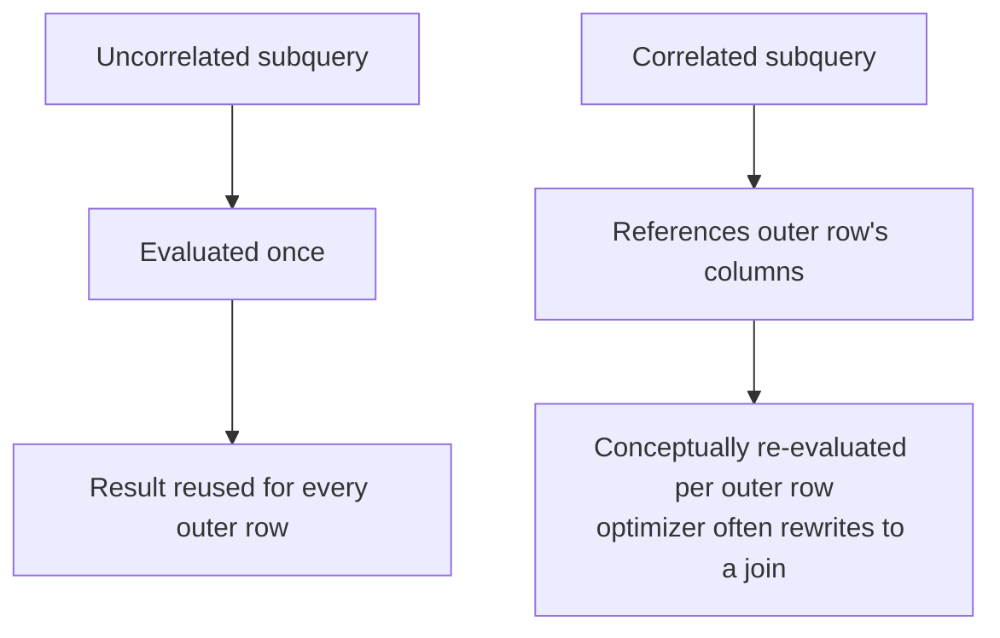

Subqueries and CTEs are both ways to compose a query out of smaller pieces, but they differ in readability, materialisation and — critically — in one specific `NULL` interaction that causes silently wrong results in production. This page uses T-SQL syntax throughout.

## Types of subqueries

| Type | Returns | Where it's used | Example |
|---|---|---|---|
| Scalar | Single value (1 row, 1 column) | Anywhere a literal value is valid | `WHERE salary > (SELECT AVG(salary) FROM employees)` |
| Row | Single row, multiple columns | Row comparisons in engines that support row-value constructors | `WHERE (dept_id, city) = (...)` in Postgres/MySQL; in T-SQL, rewrite as `EXISTS` with separate column predicates |
| Table (derived table) | Multiple rows/columns | `FROM`/`JOIN` clause | `FROM (SELECT dept_id, AVG(salary) avg_sal FROM employees GROUP BY dept_id) d` |
| Correlated | Re-evaluated per outer row | `WHERE`/`SELECT`, references outer query | `WHERE EXISTS (SELECT 1 FROM orders o WHERE o.cust_id = c.cust_id)` |

A scalar subquery used where a single value is expected must return **exactly** one row — more than one row raises a runtime error, not a silent truncation.

## Correlated vs uncorrelated — the performance difference

An **uncorrelated** subquery has no reference to the outer query; it can be evaluated **once** and reused. A **correlated** subquery references a column from the outer query, so conceptually it must be re-evaluated for every outer row.

```sql
-- Uncorrelated: computed once
SELECT * FROM employees WHERE salary > (SELECT AVG(salary) FROM employees);

-- Correlated: references e from the outer query, conceptually once per row
SELECT * FROM employees e
WHERE salary > (SELECT AVG(salary) FROM employees WHERE department_id = e.department_id);
```



> [!NOTE]
> Modern query optimizers frequently rewrite a correlated subquery into an equivalent join or semi-join internally, so "correlated = always row-by-row execution" is not literally true at runtime — but it's still the right mental model for reasoning about worst-case cost, and a good one to state before adding "though the optimizer may rewrite this."

## IN vs EXISTS vs JOIN

| | `IN` | `EXISTS` | `JOIN` |
|---|---|---|---|
| Returns duplicate outer rows on multiple matches | No | No | Yes, one per match |
| Short-circuits on first match | No (conceptually builds full list) | Yes | N/A |
| NULL-safe with a NULL-containing subquery list | **No — classic trap** | Yes | N/A |
| Can pull columns from the inner table | No | No | Yes |
| Typical use | Small, known, NULL-free list | Existence check, especially correlated | Need columns from both tables |

### The NOT IN / NULL trap, precisely

```sql
-- If ANY department_id in employees is NULL, this returns ZERO rows —
-- not "departments with no employees", but nothing at all.
SELECT * FROM departments
WHERE department_id NOT IN (SELECT department_id FROM employees);
```

`NOT IN (a, b, NULL)` expands logically to `x <> a AND x <> b AND x <> NULL`. The last comparison is `UNKNOWN`, and `TRUE AND TRUE AND UNKNOWN` is `UNKNOWN` — not `TRUE` — so **the entire row is excluded**, for every row, once a single `NULL` exists anywhere in the subquery's result column.

> [!DANGER]
> This is one of the highest-value SQL traps to know cold: `NOT IN` against a subquery that can produce even one `NULL` silently returns **no rows** for the whole query, with no error. Always either filter the subquery with `WHERE column IS NOT NULL`, or rewrite as `NOT EXISTS`, which has no such trap:
> ```sql
> SELECT * FROM departments d
> WHERE NOT EXISTS (SELECT 1 FROM employees e WHERE e.department_id = d.department_id);
> ```

`EXISTS` only cares whether a matching row exists, never comparing values directly to `NULL`, so it is immune to this trap. As a rule: **prefer `EXISTS`/`NOT EXISTS` over `IN`/`NOT IN`** whenever the subquery's column might contain `NULL`, which in practice means almost always unless it's a primary key.

## Derived tables and CTEs

A **derived table** is a subquery in `FROM`, given an alias, usable like any table. A **CTE** (`WITH name AS (...)`) does the same thing but is named *before* the main query and can be referenced multiple times — improving readability for multi-step logic.

```sql
-- Derived table
SELECT d.department_name, x.avg_salary
FROM departments d
JOIN (SELECT department_id, AVG(salary) AS avg_salary FROM employees GROUP BY department_id) x
    ON d.department_id = x.department_id;

-- Same logic as a CTE — reads top-to-bottom, reusable if referenced again
WITH dept_avg AS (
    SELECT department_id, AVG(salary) AS avg_salary
    FROM employees
    GROUP BY department_id
)
SELECT d.department_name, x.avg_salary
FROM departments d
JOIN dept_avg x ON d.department_id = x.department_id;
```

CTEs are purely a readability/structuring construct in SQL Server — they are **not** automatically materialised or cached; a non-recursive CTE referenced twice in the same query is typically expanded (inlined) twice by the optimizer, same as a view. This differs from Postgres before version 12, which fully materialised CTEs by default (an "optimisation fence").

> [!WARNING]
> A CTE can hurt performance if you reference it multiple times expecting the underlying computation to run once — in SQL Server, each reference is usually re-expanded and re-executed against the base tables. If a heavy computation needs to be computed once and reused, materialise it explicitly into a temp table (`#temp`) or table variable instead.

### CTE vs view vs derived table

All three are ways to give a query a name; they differ in scope and persistence.

| | Derived table | CTE | View |
|---|---|---|---|
| Defined | Inline, inside `FROM` | `WITH name AS (...)`, before the main query | `CREATE VIEW name AS ...`, once, outside any query |
| Lifetime | That one query only | That one query only | Persists in the schema until dropped |
| Reusable across queries | No | No | Yes — any later query can reference it by name |
| Can be recursive | No | Yes | No |
| Materialised by default | No | No (SQL Server) | No — still a stored query, expanded on use |

```sql
CREATE VIEW active_employees AS
SELECT employee_id, employee_name, department_id
FROM employees
WHERE status = 'Active';
```

A view is the right tool when the same shaped query is needed across many different statements or by many different consumers (reports, other views, ad-hoc analysts) — define it once, query it like a table forever after. A CTE is the right tool when the naming/structuring benefit is local to a single statement. Neither a view nor a non-recursive CTE is materialised by default in SQL Server — both are inlined into the surrounding query's plan, so neither one, by itself, is a performance optimisation; a materialised/indexed view or a `#temp` table is what you reach for when the computation genuinely needs to run once and be reused.

## Recursive CTEs

A recursive CTE has an **anchor** (base case) and a **recursive member** referencing the CTE itself, combined with `UNION ALL`. Classic use: walking a hierarchy like an org chart.

```sql
WITH org_chart AS (
    -- Anchor: the top of the tree
    SELECT employee_id, employee_name, manager_id, 0 AS level
    FROM employees
    WHERE manager_id IS NULL

    UNION ALL

    -- Recursive member: join back to the CTE, one level down each iteration
    SELECT e.employee_id, e.employee_name, e.manager_id, o.level + 1
    FROM employees e
    JOIN org_chart o ON e.manager_id = o.employee_id
)
SELECT * FROM org_chart ORDER BY level, employee_id;
```

| employee_id | employee_name | manager_id | level |
|---|---|---|---|
| 1 | Aman | `NULL` | 0 |
| 2 | Anita | 1 | 1 |
| 3 | Ravi | 1 | 1 |
| 4 | Neha | 2 | 2 |

Execution conceptually loops: run the anchor once, then repeatedly run the recursive member against **only the rows produced in the previous iteration**, appending results, until an iteration produces zero rows. SQL Server defaults to `MAXRECURSION 100` as a safety net against infinite loops from cyclic data — override with `OPTION (MAXRECURSION 0)` (unlimited) only when you're confident the data is acyclic.

Recursive CTEs also generate sequences without a loop:

```sql
WITH numbers AS (
    SELECT 1 AS n
    UNION ALL
    SELECT n + 1 FROM numbers WHERE n < 100
)
SELECT n FROM numbers OPTION (MAXRECURSION 100);
```

## Pivoting data

Turning rows into columns is a frequent follow-up to a subquery/CTE question. T-SQL has a dedicated `PIVOT` operator; a conditional aggregate works everywhere and is usually easier to write from scratch.

```sql
-- Conditional aggregate — portable across engines
SELECT
    department_id,
    SUM(CASE WHEN status = 'Active' THEN 1 ELSE 0 END) AS active_count,
    SUM(CASE WHEN status = 'Inactive' THEN 1 ELSE 0 END) AS inactive_count
FROM employees
GROUP BY department_id;

-- T-SQL PIVOT — same result, engine-specific syntax
SELECT department_id, [Active], [Inactive]
FROM (SELECT department_id, status FROM employees) src
PIVOT (COUNT(status) FOR status IN ([Active], [Inactive])) AS pvt;
```

> [!TIP]
> The conditional-`SUM`/`CASE` form is worth defaulting to in an interview — it needs no engine-specific syntax and demonstrates you understand *what* a pivot does (turning group membership into columns) rather than just knowing a keyword.

## Set operations

Where a subquery nests one query inside another, a set operation combines two **compatible** `SELECT` queries side by side — same number of columns, same order, comparable types — into one result.

| Operator | Result | Duplicates | 
|---|---|---|
| `UNION` | Rows present in either query | Removed |
| `UNION ALL` | Rows present in either query | Preserved |
| `INTERSECT` | Rows present in **both** queries | Removed |
| `EXCEPT` (SQL Server/Postgres) / `MINUS` (Oracle) | Rows in the first query but not the second | Removed |

```sql
SELECT employee_name FROM employees WHERE department_id = 1
UNION
SELECT employee_name FROM employees WHERE department_id = 2;

-- Same shape, but keeps duplicates and skips the dedup cost
SELECT employee_name FROM employees WHERE department_id = 1
UNION ALL
SELECT employee_name FROM employees WHERE department_id = 2;

-- Employees who are both assigned to a department and have a manager
SELECT employee_name FROM employees WHERE department_id IS NOT NULL
INTERSECT
SELECT employee_name FROM employees WHERE manager_id IS NOT NULL;

-- Employees with no manager (set difference)
SELECT employee_name FROM employees
EXCEPT
SELECT employee_name FROM employees WHERE manager_id IS NOT NULL;
```

> [!KEY]
> Default to `UNION ALL` unless you specifically need deduplication — `UNION` implies a sort/hash pass to remove duplicates, which is pure overhead if the two queries can't produce overlapping rows anyway (e.g. they filter on mutually exclusive `department_id` values).

Set operations and joins solve different problems and are easy to conflate under interview pressure: a join combines tables **horizontally**, matching rows on a predicate and producing more columns; a set operation combines result sets **vertically**, stacking compatible rows and producing the same columns. Put an `ORDER BY` only at the very end of the combined statement — it applies to the whole result, not to one side.

## Cheat sheet

- Scalar subqueries must return exactly one value; more than one row is a runtime error, not silent truncation.
- Uncorrelated subqueries evaluate once; correlated subqueries reference the outer row and conceptually run per row (though optimizers often rewrite them).
- Prefer `EXISTS`/`NOT EXISTS` over `IN`/`NOT IN` whenever the subquery column can contain `NULL` — `NOT IN` with a `NULL` in the list returns zero rows for the entire query.
- `JOIN` can return duplicate outer rows on multiple matches; `IN`/`EXISTS` never do.
- A view persists in the schema and is reusable across queries; a CTE and a derived table live only inside the one statement that defines them.
- CTEs are a readability tool, not an automatic cache — SQL Server typically re-expands them per reference.
- Materialise into a `#temp` table when a computation is expensive and referenced multiple times.
- Recursive CTEs need an anchor, a recursive member joined via `UNION ALL`, and implicitly stop when an iteration returns zero rows.
- `MAXRECURSION` (default 100 in SQL Server) guards against runaway recursion on cyclic data.
- `UNION`/`INTERSECT`/`EXCEPT` deduplicate; `UNION ALL` doesn't — default to `UNION ALL` unless duplicates are actually possible and unwanted.
- A conditional `SUM(CASE WHEN ...)` is a portable, easy-to-reason-about alternative to `PIVOT`.

## Common mistakes

| Mistake | Fix |
|---|---|
| Using `NOT IN` against a subquery column that can be `NULL` | Use `NOT EXISTS`, or add `WHERE column IS NOT NULL` to the subquery |
| Assuming a CTE referenced twice computes its body once | Materialise into a `#temp` table if reuse without recomputation is required |
| Writing a correlated subquery when a join would be clearer and often faster | Rewrite as a join or `EXISTS` and compare plans |
| Forgetting `UNION ALL` (not `UNION`) in a recursive CTE | `UNION` deduplicates and can silently break level-by-level recursion logic |
| Letting a recursive CTE run unbounded on unexpectedly cyclic data | Keep `MAXRECURSION` at a sane default rather than raising it to 0 blindly |
| Using a scalar subquery that can return more than one row | Add aggregation (`MAX`/`MIN`) or `TOP 1` with a deterministic `ORDER BY`, or handle the multi-row case explicitly |
| Using `UNION` where `UNION ALL` would do | Default to `UNION ALL`; only pay for deduplication when duplicates are actually possible and unwanted |
| Confusing a set operation with a join when the goal is "combine two tables" | Set operations stack compatible rows vertically; use a join when you need columns from both sides |

## Summary

Subqueries and CTEs are different presentations of the same relational algebra — the real decisions are correlated vs uncorrelated (a performance question), `IN`/`EXISTS`/`JOIN` (a correctness and NULL-safety question), and whether a CTE needs actual materialisation or is just a readability layer. The `NOT IN`/`NULL` trap and the recursive-CTE anchor-plus-recursive-member pattern are the two facts most likely to separate a strong answer from a shaky one in this topic.

## Top Interview Questions

### Q1. What is the difference between a correlated and an uncorrelated subquery?

An uncorrelated subquery is self-contained — it doesn't reference any column from the outer query — so it can be evaluated once and its result reused for every outer row, e.g. `WHERE salary > (SELECT AVG(salary) FROM employees)`. A correlated subquery references a column from the outer query, e.g. `WHERE salary > (SELECT AVG(salary) FROM employees e2 WHERE e2.department_id = e.department_id)`, so conceptually it must be re-evaluated once per outer row. In practice, modern optimizers often rewrite correlated subqueries into joins or semi-joins internally, but the conceptual cost model — "possibly once per row" vs "once total" — is the correct one to reason with and state in an interview.

### Q2. Why does `NOT IN` sometimes return zero rows unexpectedly?

`NOT IN (list)` is logically `x <> v1 AND x <> v2 AND ...`. If any value in the list is `NULL`, that comparison evaluates to `UNKNOWN` rather than `TRUE`, and `UNKNOWN` anywhere in an `AND` chain makes the whole expression `UNKNOWN` — which is treated as false for filtering, so the row is excluded. Because this applies to *every* row being tested, a single `NULL` in the subquery's result column causes the entire `NOT IN` query to return zero rows, with no error raised. The safe fix is `NOT EXISTS`, which tests row existence rather than comparing values, and is completely unaffected by `NULL`s in the inner table.

### Q3. When would you choose EXISTS over IN, and over a JOIN?

Choose `EXISTS` when you only need to test whether a matching row is present and don't need any columns from the inner table — it's NULL-safe (unlike `NOT IN`) and can short-circuit on the first match. Choose `IN` for a short, known, NULL-free list, especially a literal list rather than a subquery. Choose a `JOIN` when you need to actually select columns from both tables, understanding that a join duplicates the outer row once per match, whereas `EXISTS`/`IN` never do — so if a department could match three employees and you only want one row per department, `EXISTS` is correct and a plain join would need an extra `DISTINCT` or aggregation.

### Q4. What's the practical difference between a CTE and a derived table (subquery in FROM)?

Functionally they're equivalent in SQL Server — both define a named result set usable in the outer query — but a CTE is declared once at the top with `WITH name AS (...)` and can be referenced multiple times in the main query, while a derived table is inline and single-use unless duplicated. CTEs read top-to-bottom like a sequence of named steps, which is significantly more readable for multi-stage logic, and a CTE can be recursive whereas a plain derived table cannot. Neither is automatically materialised or cached by default in SQL Server — both are typically inlined/expanded by the optimizer at each reference.

### Q5. Does a CTE get computed once and cached, or once per reference?

In SQL Server, a non-recursive CTE is **not** automatically materialised — if you reference the same CTE twice in the outer query, the optimizer typically expands (re-executes) its definition against the base tables for each reference, the same as it would with a view or an inlined subquery. This means a CTE with an expensive aggregation referenced three times can run that aggregation three times. If you need the result computed once and reused, materialise it explicitly into a `#temp` table or table variable — that gives an actual, physically-stored single copy of the result.

### Q6. How would you write a recursive CTE to list an employee's full management chain up to the CEO?

```sql
WITH chain AS (
    SELECT employee_id, employee_name, manager_id, 0 AS depth
    FROM employees
    WHERE employee_id = @target_employee_id

    UNION ALL

    SELECT e.employee_id, e.employee_name, e.manager_id, c.depth + 1
    FROM employees e
    JOIN chain c ON e.employee_id = c.manager_id
)
SELECT * FROM chain ORDER BY depth;
```

The anchor starts at the target employee with depth 0. The recursive member then joins the base `employees` table back to the current chain row on `e.employee_id = c.manager_id`, which moves one manager upward per iteration. Recursion stops naturally when the current row has `manager_id IS NULL`, because the join finds no parent. In production I would keep a bounded `MAXRECURSION` and add cycle detection if the hierarchy is user-maintained; a bad self-reference (`manager_id = employee_id`) otherwise turns a simple org-chart query into a runaway recursive query. Ordering by depth gives the path from employee to CEO.

### Q7. What safety mechanism prevents a recursive CTE from looping forever on bad data, and how do you control it?

SQL Server enforces a `MAXRECURSION` limit, defaulting to 100 iterations; exceeding it raises an error rather than looping indefinitely, which protects against cyclic data (e.g. an employee accidentally set as their own indirect manager). You can raise or remove the limit with `OPTION (MAXRECURSION n)` (or `0` for unlimited) on the outer query, but doing so on untrusted or unvalidated hierarchical data risks a genuine infinite loop consuming resources — a defensible senior answer is to keep a bounded limit in production and treat hitting it as a data-quality signal worth investigating rather than something to just raise away.

### Q8. How would you find employees who earn more than the average salary of their own department?

```sql
SELECT e.employee_name, e.department_id, e.salary
FROM employees e
WHERE e.salary > (
    SELECT AVG(e2.salary)
    FROM employees e2
    WHERE e2.department_id = e.department_id
);
```

This is a correlated scalar subquery — for each outer employee row, the inner query computes the average salary for that employee's department and compares the outer salary to it. It is a good, readable first answer, but on a large table it can be expensive if the optimizer cannot decorrelate it. An equivalent, often more efficient rewrite pre-aggregates once with a CTE or derived table and joins: `WITH dept_avg AS (SELECT department_id, AVG(salary) avg_sal FROM employees GROUP BY department_id) SELECT e.* FROM employees e JOIN dept_avg d ON e.department_id = d.department_id WHERE e.salary > d.avg_sal`. That version computes each department's average once, makes the join key explicit, and is usually easier to index and inspect in an execution plan. Also decide how to handle employees with `NULL` department IDs, since they will not match a grouped department average.

### Q9. What is a lateral/apply-style correlated subquery used for, and how is it different from a plain correlated subquery in WHERE?

`CROSS APPLY`/`OUTER APPLY` (T-SQL's equivalent of a lateral join) let a correlated subquery appear in the `FROM` clause and return **multiple columns and multiple rows** per outer row, which a scalar correlated subquery in `WHERE`/`SELECT` cannot do. A common use is "the 3 most recent orders per customer": `SELECT c.customer_name, o.* FROM customers c CROSS APPLY (SELECT TOP 3 * FROM orders o WHERE o.customer_id = c.customer_id ORDER BY order_date DESC) o` — the subquery is correlated to `c.customer_id` but can return several rows and several columns, something a `WHERE`-clause subquery is restricted from doing.

### Q10. How would you rewrite a query that pivots employee counts by status into columns, without using the PIVOT keyword?

```sql
SELECT
    department_id,
    SUM(CASE WHEN status = 'Active' THEN 1 ELSE 0 END) AS active_count,
    SUM(CASE WHEN status = 'Inactive' THEN 1 ELSE 0 END) AS inactive_count
FROM employees
GROUP BY department_id;
```

A conditional aggregate — `SUM`/`COUNT` wrapped around a `CASE WHEN` — reshapes each qualifying condition into its own column while still grouping normally, achieving the same result as `PIVOT` without engine-specific syntax. `SUM(CASE WHEN status = 'Active' THEN 1 ELSE 0 END)` counts active rows because matching rows contribute 1 and non-matching rows contribute 0. This is generally the version to write from memory in an interview: it demonstrates the mechanism, works in SQL Server, Postgres and MySQL, and is easy to extend with more statuses by adding another expression. Native `PIVOT` can be useful, but it is more dialect-specific and less memorable under pressure.

### Q11. A query using a correlated subquery in the SELECT list is slow on a large table — how would you diagnose and fix it?

I'd first check the execution plan for a nested-loop pattern where the inner subquery's operator count scales with the outer row count — a strong sign the subquery is effectively running once per outer row. The fix is usually to convert it to a `LEFT JOIN` against a pre-aggregated derived table/CTE (computing the needed value once per group rather than once per outer row), or to add a covering index on the subquery's filter/join columns so each individual execution is cheap even if it runs many times. I'd validate the fix by comparing estimated/actual row counts and total logical reads before and after rather than assuming the rewrite helped.

### Q12. What's the difference between UNION and UNION ALL, and why does it matter inside a recursive CTE?

`UNION` combines two result sets and removes duplicate rows, which requires a distinct/sort operation; `UNION ALL` simply concatenates them, keeping duplicates, and is cheaper. Recursive CTEs in SQL Server **require** `UNION ALL` between the anchor and recursive member — `UNION` is not permitted in that position because de-duplicating across iterations would conflict with how the engine tracks "new rows produced this iteration" to know when to stop recursing. Even where a variant allowed it, using `UNION` would risk silently collapsing legitimately repeated rows (e.g. two employees at the same hierarchy level with identical name/id coincidences) and obscure the true recursion depth.

### Q13. What's the difference between a set operation like INTERSECT and an INNER JOIN that achieves a similar-looking result?

`INTERSECT` compares whole rows between two **compatible** `SELECT` queries (same column count, same order, comparable types) and returns only the rows present in both, with no join predicate at all — the "match" is exact-row equality across every selected column. An `INNER JOIN` compares two potentially very differently-shaped tables on an explicit predicate and returns the combined, wider row for every match, which can also fan out into multiple output rows per input row if the predicate matches more than once. Use `INTERSECT` when you're really asking "which rows appear in both result sets" (e.g. customers who ordered in both Q1 and Q2, expressed as two single-column queries); use a join when you need columns from both sides or the relationship isn't "the exact same row shape twice."

### Q14. When would you choose a persisted VIEW instead of a CTE for a piece of reusable query logic?

A CTE's definition is scoped to the single statement it's written in — nothing outside that query can see or reuse it. A view is a named, schema-level object that persists after creation, so any later query, report, or even another view can reference it by name without repeating its definition. Choose a view when the same shaped query (e.g. "active employees with their department name") is needed by multiple, independent statements or consumers over time; choose a CTE when the structuring benefit — naming an intermediate step for readability, or enabling recursion — is local to one query and not worth promoting to a permanent schema object.
